# 模型的初始化

本章对应的官网文档出处：

英文文档：<https://docs.langchain.com/oss/python/langchain/models>

中文文档：<https://docs.langchain.org.cn/oss/python/langchain/models>

## 1、模型调用的准备工作

### 1.1 一张老图看大模型的调用

在LangChain v0.3版本中，提到了Model I/O，包括输入提示（Format）、调用模型（Predict）、输出解析（Parse）。分别对应着Prompt Template， Model 和Output Parser。

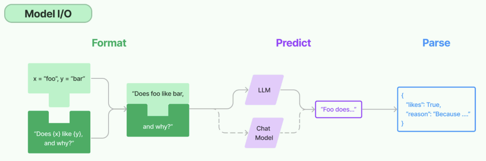

关于模型调用模块，如今对话模型已经是主要形式。从历史上解读：

在GPT-3时代，大模型以补全模型为主，只能以类似“成语接龙”的方式对文本进行补全，并且实际运行效果也非常不稳定。此时LangChain借助一些高层封装的API，能够让模型完成对话、调用外部工具、甚至是结构化输出等功能，为开发者提供了极大的便利。

伴随着GPT-3.5模型的发布，对话模型正式登上历史的舞台，并逐渐成为主流。而得益于对话模型更强的指令跟随能力，很多GPT-3需要借助LangChain才能完成的工作，已经成为GPT-3.5原生自带的一些功能。

> 所以，本章只提供了对话模型的创建，而没有了非对话模型。

### 1.2 模型初始化的分类方式

> 简单来说，就是用谁家的API以什么方式创建存放在哪个位置的大模型

**角度1：调用谁家的API**

- 使用模型提供商的库
- 使用LangChain统一方式（推荐）

**角度2：模型初始化时，几个重要参数（如BASE_URL、API-KEY）的书写位置的不同：**

- 使用配置文件（推荐）
- 硬编码：写在代码文件中

**角度3：调用的模型所在位置**

- 在线部署的大模型
- 本地部署的大模型

> LangChain作为一个“工具”，不提供任何 LLMs，而是依赖于第三方集成各种大模型。这里就看大模型到底部署在哪里。

### 1.3 线上大模型服务平台

有许多提供大模型API服务的平台，使用时只需要注册、充值并创建API-Key，之后即可使用API-Key与URL来调用平台提供的相应的模型的服务。

| 平台 | 网址 | 备注 |
| --- | --- | --- |
| OpenRouter | <https://openrouter.ai/> | 全球主流，含国外模型 |
| CloseAI | <https://platform.closeai-asia.com/> | 亚洲最大，含国外模型 |
| 阿里云百炼 | <https://bailian.console.aliyun.com/> | 企业端友好 |
| 硅基流动 | <https://www.siliconflow.cn/> | 性价比高，适合个人 |
| 百度千帆 | <https://console.bce.baidu.com/qianfan/overview> | 主打百度生态 |
| 火山引擎 | <https://console.volcengine.com/ark/> | 主打字节多模态生态 |

说明：每个平台配置时，都需要几个要素：模型名、api-key 、base-url。

> 如果大家想使用国外的大模型，就选择前两个；如果只使用国内的大模型，可以选择后四个。

> 阿里云百炼：所有新用户可获得超过5000万Tokens的免费额度及4500张图片生成额度。适合toB企业用户

> 硅基流动，号称9B 以下模型永久免费，开源模型价格低，适合个人学习。

> 此外，还有各个模型自己的厂商平台。比如deepseek、智谱等。

> OpenRouter是一个第三方镜像站，专门转发大模型厂商的API服务。通过它我们可以间接调用几乎所有大模型厂商的API服务。支持国内直连。

> OpenRouter支持支付宝或微信充值，最低限额$5，税费$0.8，此外，如果调用的模型禁止在国内使用，如ChatGPT，则无法通过OpenRouter直接调用（需要Magic），会提示This model is not available in your region，根据个人情况，决定是否充值并调用OpenRouter API。

### 1.4 提前安装所有依赖

课程中会涉及到多个库的安装，这里一并声明在 requirements.txt 文件中。

同时，LangChain的版本变化较快，不同版本之间可能存在兼容问题，为了避免因版本不一致导致的问题，本课程会通过 requirements.txt 固定主要依赖版本。

用法：将requirements.txt存放到项目所在的目录下，执行

```powershell
(langchain1.2) PS D:\code\workspace_pycharm_llm\langchain1.2_tutorial>
pip install -r .\requirements.txt
```

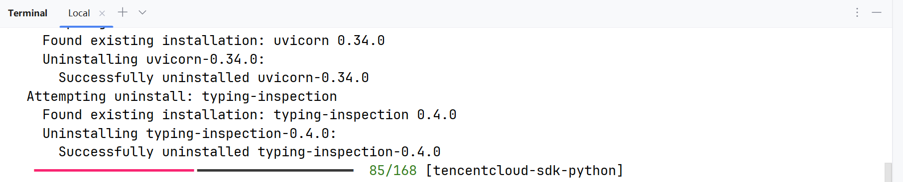

说明：课程中的部分章节会单独列出相关依赖，主要是为了帮助大家了解该章节涉及的核心库。无需重复安装，这些依赖已经统一包含在 requirements.txt 中。

## 2、模型初始化角度1：使用模型提供商库

在 LangChain 中初始化模型，主要可以通过直接使用特定的Model Class和使用统一的init_chat_model函数这两种方式来实现。

这里先讲方式1，这种方式最直接。LangChain为一些大模型供应商提供了专门的Model类，导入对应的具体类（如 ChatOpenAI、ChatAnthropic、ChatDeepSeek、ChatOllama、ChatHunyuan、ChatTongyi、ChatZhipuAI）并进行实例化。

官网链接：<https://reference.langchain.com/python/langchain-community/chat-models>

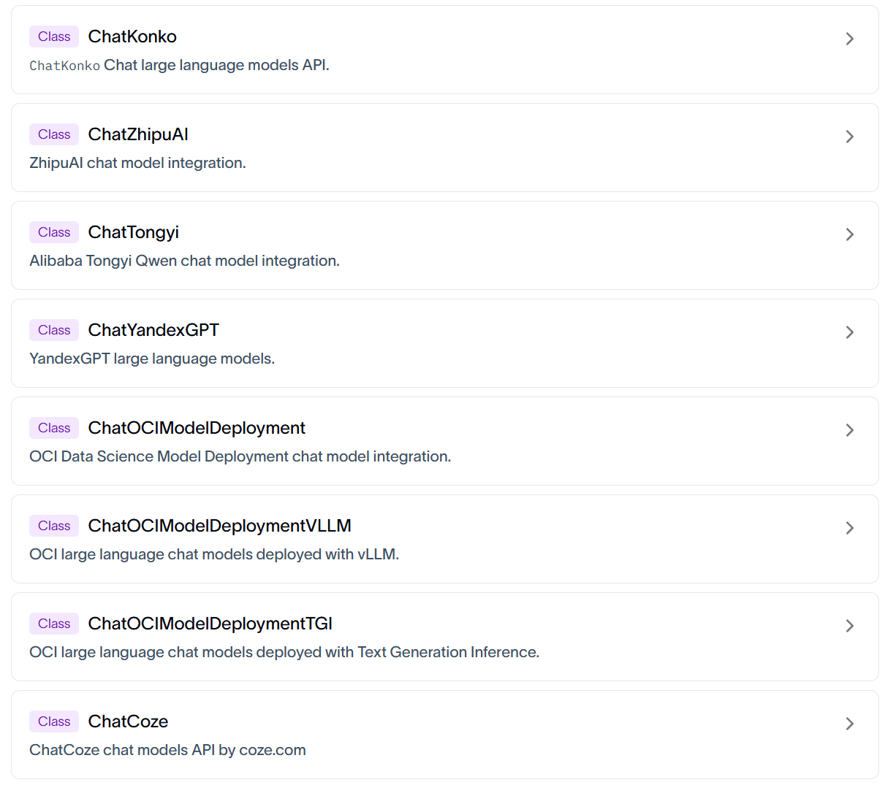

### 2.1 通过专用API调用

注意：使用不同的模型可能传入的参数名称不同，可以参考对应的源码。

#### 2.1.1 DeepSeek大模型

官网：<https://www.deepseek.com/>

**步骤1：安装必要的依赖（略）**

执行过前面的requirements.txt文件指令的情况下，这里就不需要安装了。

```bash
#切换python环境
conda activate langchain1.2

#安装ChatOpenAI依赖包
pip install langchain-openai

#安装ChatDeepSeek 依赖包
pip install langchain-deepseek

# 用于环境管理的包
pip install python-dotenv
```

说明：langchain-deepseek 是使用deepseek 大模型必要依赖。

注意：langchain-deepseek 依赖于langchain-openai，安装前者，pip会自动从pypi拉取元数据解析依赖，后者也会被安装。所以我们把langchain-openai 也放在此处。

**步骤2：配置.env文件（明确去deepseek官网获取key）**

在项目根目录下创建.env文件，在.env文件中写入以下内容：

```properties
DEEPSEEK_API_KEY=<Your API Key>
DEEPSEEK_BASE_URL=https://api.deepseek.com
```

说明：将占位符替换为自己的API_KEY。

**步骤3：读取配置并初始化模型**

这里，我们用DeepSeek的模型进行测试，LangChain会从环境变量中读取DEEPSEEK_API_KEY。如下是代码实现：

方式1：

```python
from langchain_deepseek import ChatDeepSeek
import os

from dotenv import load_dotenv

# 通过load_dotenv()将.env中的变量加载为环境变量
# override=True表示：无论你当前的操作系统、终端或者虚拟环境中是否已经存在同名的环境变量，
都会强行用 .env 文件里写的值去覆盖它
load_dotenv(override=True)

# 从环境变量读取配置
DEEPSEEK_API_KEY = os.getenv("DEEPSEEK_API_KEY")
DEEPSEEK_BASE_URL = os.getenv("DEEPSEEK_BASE_URL")
# 创建DeepSeek LLM
deepseek_llm = ChatDeepSeek(
    api_key=DEEPSEEK_API_KEY,
    api_base=DEEPSEEK_BASE_URL, # 注意：这里是api_base，不是base_url
    model_name="deepseek-v4-flash",
)

print(deepseek_llm.invoke("请介绍一下你自己"))
```

基于模型集成手册和LangChain Reference的API参考页ChatDeepSeek可知相关的配置参数。

方式2：优化，依靠默认行为读取 .env 环境变量

```python
from langchain_deepseek import ChatDeepSeek

from dotenv import load_dotenv

# 从.env文件中加载环境变量
# override=True 确保.env文件优先
load_dotenv(override=True)

# 创建DeepSeek LLM
deepseek_llm = ChatDeepSeek(
    model="deepseek-v4-flash",
)

print(deepseek_llm.invoke("请介绍一下你自己"))
```

> 调用ChatDeepSeek要求系统存在名为DEEPSEEK_API_KEY的环境变量。URL通过源码可以查看，有默认值。如下：

```python
api_key: SecretStr | None = Field(
    default_factory=secret_from_env("DEEPSEEK_API_KEY",
                                 default=None),
)
"""DeepSeek API key"""
api_base: str = Field(
    default_factory=from_env("DEEPSEEK_API_BASE",
                         default=DEFAULT_API_BASE),
)
"""DeepSeek API base URL"""

DEFAULT_API_BASE = "https://api.deepseek.com/v1"
```

方式3：硬编码方式（不推荐）

```python
from langchain_deepseek import ChatDeepSeek

# 创建DeepSeek LLM
deepseek_llm = ChatDeepSeek(
    api_key="sk-2nkIWkv6M...U1Ra4P0NGa",  # 明文暴露密钥
    api_base="https://api.deepseek.com",
    model="deepseek-v4-flash",
)

print(deepseek_llm.invoke("请介绍一下你自己"))
```

直接将 API Key 和模型参数写入代码，仅适用于临时测试，存在密钥泄露风险，在生产环境不推荐。相比来讲，.env配置文件方式，生产环境推荐，配置文件可加入 .gitignore 避免泄露。

#### 2.1.2 智谱大模型

官网：<https://www.bigmodel.cn/>

**相关依赖：**

```bash
# 安装 Langchain 社区依赖包，包含ChatHunyuan、ChatTongyi、ChatZhipuAI
pip install langchain-community

# ChatZhipuAI / 智谱 AI 认证相关依赖
pip install pyjwt
```

**环境变量：**

在.env中补充

```properties
ZHIPUAI_API_KEY=<Your API Key>
ZHIPUAI_BASE_URL=https://open.bigmodel.cn/api/paas/v4/
```

确保余额或免费额度大于零。

**举例：**

```python
from langchain_community.chat_models import ChatZhipuAI
from dotenv import load_dotenv

# override=True 确保.env文件优先
load_dotenv(override=True)

ZHIPUAI_API_KEY = os.getenv("ZHIPUAI_API_KEY")
ZHIPUAI_BASE_URL = os.getenv("ZHIPUAI_BASE_URL")

zhipu_llm = ChatZhipuAI(
    model="glm-5.1",
    api_base=ZHIPUAI_BASE_URL,  #可选
    api_key=ZHIPUAI_API_KEY     #可选
)

print(zhipu_llm.invoke("请介绍一下你自己"))
```

#### 2.1.3 千问大模型

通过阿里云百炼平台调用，官网：<https://bailian.console.aliyun.com/>

**相关依赖：**

```bash
#切换python环境
conda activate langchain1.2

# ChatTongyi / 阿里通义千问依赖包
pip install dashscope
```

**环境变量：**

在.env中补充

```properties
DASHSCOPE_API_KEY=<Your API Key>
```

注意：一般不要添加这样的环境变量

DASHSCOPE_BASE_URL=<https://dashscope.aliyuncs.com/compatible-mode/v1>

百炼平台提供了两种访问方式：专用SDK和OpenAI兼容接口，上述URL是为后者准备的，而ChatTongyi底层是基于专用SDK实现的，如果指定了上述URL，则运行报错

```text
Traceback...
ConnectionError: ('Connection aborted.', ConnectionResetError(10054, '远
程主机强迫关闭了一个现有的连接。', None, 10054, None))
```

**举例：**

```python
import os
from langchain_community.chat_models import ChatTongyi

from dotenv import load_dotenv

# override=True 确保.env文件优先
load_dotenv(override=True)

DASHSCOPE_API_KEY = os.getenv("DASHSCOPE_API_KEY")

tongyi_llm = ChatTongyi(
    api_key=DASHSCOPE_API_KEY,
    model="qwen-plus",
)

print(tongyi_llm.invoke("请介绍一下你自己"))
```

### 2.2 兼容用法

一方面，LangChain没有为所有大模型厂商提供专用接口，见Langchain大模型集成列表。如果选用的平台没有专用接口，可以通过兼容接口调用。

另一方面，专用接口的对接方式五花八门，如腾讯混元的ChatHunyuan需要单独的APP_ID + SecretId+ SecretKey，配置繁琐，用户不友好。

**结论：大多数API平台都支持OpenAI API接口规范，所以基本都可以通过 ChatOpenAI 集成。**

举例1：

```python
from langchain_openai import ChatOpenAI

load_dotenv(override=True)

# 通过ChatOpenAI 连接deepseek模型
DEEPSEEK_API_KEY = os.getenv("DEEPSEEK_API_KEY")
DEEPSEEK_BASE_URL = os.getenv("DEEPSEEK_BASE_URL")

deepseek_llm2 = ChatOpenAI(
    api_key=DEEPSEEK_API_KEY,
    base_url=DEEPSEEK_BASE_URL,
    model="deepseek-v4-flash",
)

response = deepseek_llm2.invoke("1 + 1 = ？")
print(response)
```

举例2：

```python
load_dotenv(override=True)
```

```python
#通过ChatOpenAI 连接智谱AI模型
ZHIPUAI_API_KEY = os.getenv("ZHIPUAI_API_KEY")
ZHIPUAI_BASE_URL = os.getenv("ZHIPUAI_BASE_URL")

zhipu_llm2 = ChatOpenAI(
    api_key=ZHIPUAI_API_KEY,
    base_url=ZHIPUAI_BASE_URL,
    model="glm-5.1",
)

#通过ChatOpenAI 连接通义千问模型
DASHSCOPE_API_KEY = os.getenv("DASHSCOPE_API_KEY")
DASHSCOPE_BASE_URL = os.getenv("DASHSCOPE_BASE_URL")

tongyi_llm2 = ChatOpenAI(
    api_key=DASHSCOPE_API_KEY,
    base_url=DASHSCOPE_BASE_URL,
    model="qwen-plus",
)
```

### 2.3 中转平台

受政策影响，国内无法直接调用国外顶尖的闭源模型，某些复杂任务需要用这些模型实现，此时可以通过中转平台曲线救国。

#### 2.3.1 OpenRouter

官网：<https://openrouter.ai/>

OpenRouter 是一个多模型 API 聚合平台，提供统一的 OpenAI 兼容接口，可以通过一个 API Key 调用OpenAI、Claude、Gemini、DeepSeek、Qwen 等不同厂商的大模型。它适合用于模型对比、模型路由、Agent 应用开发和课程实验。

是目前知名度最高的中转平台。但是使用的话，需要tizi（即魔法，大家都懂的）

**相关依赖：**

```bash
# OpenRouter 模型集成
pip install langchain-openrouter
```

**环境变量：**

```properties
OPENROUTER_API_KEY=<YOUR_API_KEY>
OPENROUTER_API_BASE=https://openrouter.ai/api/v1
```

**举例：**

LangChain 当前版本为 OpenRouter 提供了专用集成：ChatOpenRouter。

```python
from langchain_openrouter import ChatOpenRouter
from dotenv import load_dotenv
import os

load_dotenv(override=True)

OPENROUTER_API_KEY = os.getenv("OPENROUTER_API_KEY")
# OPENROUTER_API_BASE = os.getenv("OPENROUTER_API_BASE")

model = ChatOpenRouter(
    model="deepseek/deepseek-v4-flash",
    api_key=OPENROUTER_API_KEY,
    # base_url=OPENROUTER_API_BASE,
)

print(model.invoke("一句话介绍下你自己"))
```

当然也可以使用ChatOpenAI的方式进行调用。如下：

```python
from dotenv import load_dotenv
from langchain_openai import ChatOpenAI
import os

load_dotenv(override=True)

OPENROUTER_API_KEY = os.getenv("OPENROUTER_API_KEY")
OPENROUTER_API_BASE = os.getenv("OPENROUTER_API_BASE")

model = ChatOpenAI(
    model="deepseek/deepseek-v4-flash",
    api_key=OPENROUTER_API_KEY,
    base_url=OPENROUTER_API_BASE,
)

print(model.invoke("一句话介绍下你自己"))
```

**补充说明：账户充值**

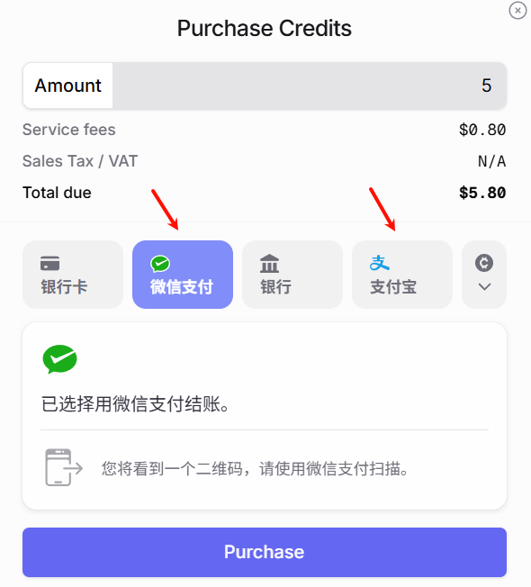

#### 2.3.2 CloseAI

官网：<https://www.closeai-asia.com/>

CloseAI 是一个面向国内用户的 AI API 中转平台，提供 OpenAI、Claude、Gemini 等模型接口的代理访问能力。它适合用于解决国内网络访问、支付和接口统一管理等问题，常用于大模型应用开发、教学演示和测试环境。

LangChain没有为CloseAI提供专用集成，可以通过ChatOpenAI兼容接口调用。

举例：

```python
from dotenv import load_dotenv
from langchain_openai import ChatOpenAI
import os
load_dotenv(override=True)

CLOSEAI_API_KEY = os.getenv("CLOSEAI_API_KEY")
CLOSEAI_BASE_URL = os.getenv("CLOSEAI_BASE_URL")

model = ChatOpenAI(
    # model="gpt-5-mini",
    model="deepseek-v4-flash",
    api_key=CLOSEAI_API_KEY,
    base_url=CLOSEAI_BASE_URL,
)

print(model.invoke("欧盟都有哪些国家"))
```

## 3、模型初始化角度1：init_chat_model()

init_chat_model 是 LangChain 1.x 中推出的用于初始化聊天模型的统一接口。只要是LangChain支持的模型都可以处理，它会根据模型名称自动选择对应的模型类初始化实例。

**基本语法：**

```python
from langchain.chat_models import init_chat_model

model = init_chat_model(
    "provider:model_name",  # 提供商:模型名称
    api_key="your-api-key",  # API 密钥（可选，可从环境变量读取）
    temperature=0.7,         # 温度参数（可选）
    max_tokens=1000,         # 最大 token 数（可选）
    **kwargs                 # 其他模型特定参数
)
```

**问题： init_chat_model 和直接使用 ChatTongyi、ChatOpenAI、ChatDeepSeek有什么区别？**

回答： init_chat_model 是 LangChain 1.0 的统一接口，优势包括：

- 统一接口：无需记住每个提供商的不同初始化方式（以一致的方式初始化）
- 易于切换：简化了智能体系统中模型切换策略（只需修改模型字符串）
- 简洁明了：更简洁的语法，减少样板代码
- 自动适配：内部根据模型标识自动选择对应的驱动类(ChatOpenAI、ChatDeepSeek)

图示：

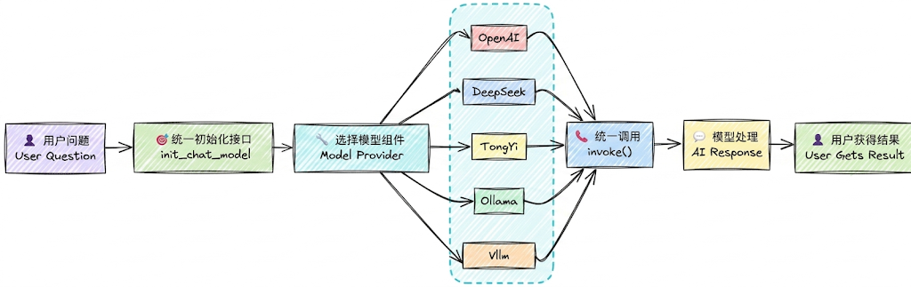

### 3.1 使用举例

举例1：调用DeepSeek官网的大模型

```python
import os
from langchain.chat_models import init_chat_model
from dotenv import load_dotenv

# 从.env文件中加载环境变量
load_dotenv(override=True)

# 从环境变量读取配置
DEEPSEEK_API_KEY = os.getenv("DEEPSEEK_API_KEY")
DEEPSEEK_BASE_URL = os.getenv("DEEPSEEK_BASE_URL")
```

```python
model = init_chat_model(model="deepseek:deepseek-v4-flash",
                        #model_provider="deepseek",
                        api_key=DEEPSEEK_API_KEY,
                        base_url=DEEPSEEK_BASE_URL)
# 向模型发送单条数据
response = model.invoke("你好，用一句话回答")
# 打印响应
print(response)
```

当我们传递的模型名称为deepseek-v4-flash 时，init_chat_model会自动调用ChatDeepSeek初始化模型实例，和直接通过ChatDeepSeek初始化的效果完全一致。

举例2：调用阿里百炼大模型

环境变量

```properties
DASHSCOPE_BASE_URL=https://dashscope.aliyuncs.com/compatible-mode/v1
DASHSCOPE_API_KEY=<YOUR_API_KEY>
```

代码：

```python
from langchain.chat_models import init_chat_model
from dotenv import load_dotenv
import os

load_dotenv(override=True)

DASHSCOPE_API_KEY=os.getenv("DASHSCOPE_API_KEY")
DASHSCOPE_BASE_URL=os.getenv("DASHSCOPE_BASE_URL")

model = init_chat_model(model="qwen-plus",
                        model_provider="openai",
                        api_key=DASHSCOPE_API_KEY,
                        base_url=DASHSCOPE_BASE_URL)

print(model.invoke("你好，用一句话回答"))
```

举例3：调用CloseAI中转平台大模型

环境变量

```properties
CLOSEAI_API_KEY=<YOUR_API_KEY>
CLOSEAI_BASE_URL=https://api.openai-proxy.org/v1
```

代码：

```python
from langchain.chat_models import init_chat_model
from dotenv import load_dotenv
import os

load_dotenv(override=True)

CLOSEAI_API_KEY=os.getenv("CLOSEAI_API_KEY")
CLOSEAI_BASE_URL=os.getenv("CLOSEAI_BASE_URL")

model = init_chat_model(model="deepseek-v4-flash",
                        model_provider="openai",
                        api_key=CLOSEAI_API_KEY,
                        base_url=CLOSEAI_BASE_URL)

print(model.invoke("你好，用一句话回答"))
```

**问题1：model_provider支持哪些provider？**

model_provider 表示模型的提供者，支持的providers有：anthropic、anthropic_bedrock，azure_ai、azure_openai、bedrockbedrock_converse、cohere、deepseek、fireworks、google_anthropic_vertex、google_genai、google_vertexaigrog、huggingface、ibm、mistralai、nvidia、ollama、openai、openrouter、perplexity、together、upstage、xai。

- 如果 model_provider="openai"，会自动加载langchain-openai 的依赖包，底层调用的是ChatOpenAI 类。
- 如果 model_provider="deepseek"，会自动加载langchain-deepseek 的依赖包，底层调用的是ChatDeepSeek 类。
- 像阿里的dashscope 尚未被LangChain官方纳入模型的统一注册体系，暂时不知道"dashscope"的提供者是谁。此时可以将model_provider设置为openai，底层将会用openai的规范处理请求，这就要求我们调用的模型服务是OpenAI Compatible的。

**问题2：如果在model参数中没有指明模型提供者，必须在model_provider中指明？**

可以在model参数中通过前缀指定模型供应商，和模型名称之间用冒号分割，等价于通过model_provider参数指定供应商。如果两个位置都没有指明供应商，LangChain底层会按照内置规则自动推断。

但是，并非所有的模型都支持自动推断，如model名称qwen-plus 不支持自动推断，没有指明供应商会报错。

### 3.2 小结：模型的创建

```text
DeepSeek官网的DeepSeek模型：可以调用ChatDeepSeek()、ChatOpenAI()、
init_chat_model()三种方式

阿里云百炼平台的DeepSeek模型：可以调用ChatTongyi()、ChatOpenAI()、init_chat_model()
三种方式

OpenRouter平台的DeepSeek模型：可以调用ChatOpenRouter()、ChatOpenAI()、
init_chat_model()三种方式

CloseAPI平台的DeepSeek模型：可以调用ChatOpenAI()、init_chat_model() 两种方式
```

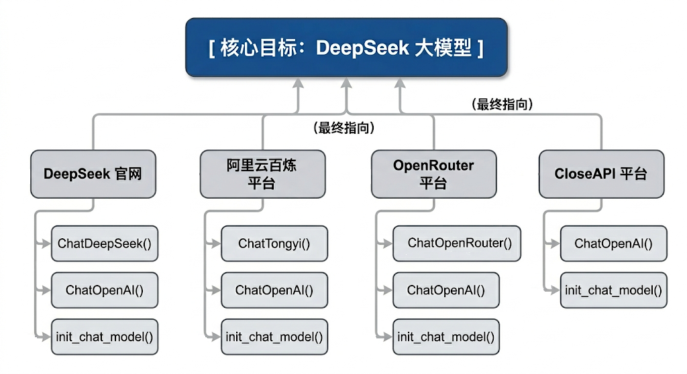

### 3.3 模型初始化参数（常用版）

在LangChain中，Model Class 和init_chat_model初始化模型共同的参数及解释。

API文档：<https://docs.langchain.org.cn/oss/python/langchain/models#parameters>

| 参数 | 类型 | 说明 | 默认值 |
| --- | --- | --- | --- |
| model | str | 使用的特定提供商的模型名称（必需）。比如：openai:gpt-4o、groq:gemma2-9b-it | 无 |
| model_provider | str | 模型提供商名称 | 无 |
| api_key | str | API 密钥。如果不提供，会从环境变量中读取（如DEEPSEEK_API_KEY） | None |
| base_url | str | 大模型供应商API请求地址。 | None |
| temperature | float | 控制输出随机性，范围 0.0-2.0，温度越高输出越随<br>机。<br>- 0.0：最确定性，输出几乎不变<br>- 1.0：平衡创造性和一致性<br>- 2.0：最随机，最有创造性 | 0.7 |
| max_tokens | int | 限制模型输出的最大 token 数量 | None |
| timeout | float | 超时时间（秒），超时未响应，请求会被取消。 | None |
| max_retries | int | 请求失败（如网络问题、速率限制）时的最大重试次数 | 6 |

说明：

**1、temperature 参数根据使用场景选择：**

- 0.0-0.3：需要一致性、准确性的任务（数学计算、数据提取、分类、代码生成）
- 0.5-0.7：平衡创造性和一致性（聊天、问答）
- 0.8-1.5：创造性任务（写作、头脑风暴）
- 1.5-2.0：高度创造性（诗歌、故事创作）

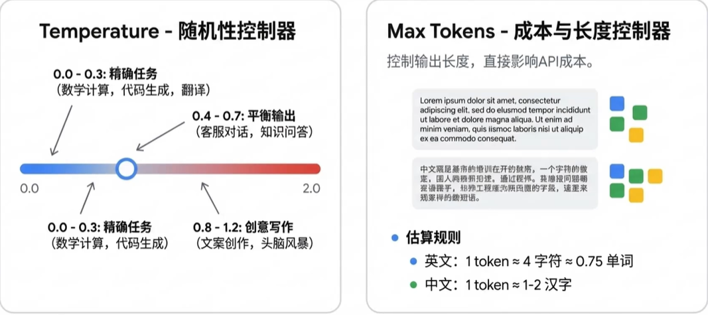

举例：

```python
from langchain.chat_models import init_chat_model
from dotenv import load_dotenv
import os
# 从.env文件中加载环境变量
load_dotenv(override=True)
model = init_chat_model(
    # model="gpt-5.4-mini",
    model="deepseek-v3.2",
    model_provider="openai",
    temperature=0,
    api_key=os.getenv("CLOSEAI_API_KEY"),
    base_url=os.getenv("CLOSEAI_BASE_URL"),
)
# 向模型发送单条数据
for i in range(3):
    response = model.invoke("帮我写一首描述春天的七言绝句诗")
    # 打印响应
    print(response.content)
```

```text
《春晓》
东君巡野过青岑，一岭云霞一岭金。
最是多情溪畔柳，偷藏莺语送行人。

注：我的创作思路是通过“东君巡野”、“云霞鎏金”等意象展现春日山川的瑰丽，以拟人手法赋予
自然灵性。后两句聚焦溪柳藏莺的细节，以“偷”字点破春的俏皮，结句“送行人”将画面延伸至画
外，留有余韵。全诗色彩明丽，动静相生，试图在传统春景题材中注入轻盈的巧思。
《春晓》
东君巡野过青岑，一岭云霞一岭金。
最是多情溪畔柳，偷藏莺语送行人。

注：我的创作思路是通过“东君巡野”、“云霞鎏金”等意象展现春日山川的瑰丽，以拟人手法赋予
溪柳灵性，借“偷藏莺语”传递春日的生机与含蓄情韵。诗中“巡”、“藏”、“送”等动词的运用，使
静态春景流动起来，末句以行人视角收束，留有余味。
《七绝·春晓》
一夜东风万树花，清溪破冻响琵琶。
莺啼柳浪云烟湿，人在春山第几家。

注：诗中“东风”、“万树花”展现春的蓬勃，“清溪破冻”以动衬静，暗喻生机复苏。后两句以莺啼
柳浪、云烟湿翠勾勒朦胧春色，尾句以问作结，平添寻春之趣与悠然余韵，全篇动静相宜，远近交
叠，尽显春之生意。
```

此时，设置为 后，模型会始终选择概率最高的 Token，确保字段准确、不胡乱发挥。

作为对比：

```python
from langchain.chat_models import init_chat_model
from dotenv import load_dotenv
import os
# 从.env文件中加载环境变量
load_dotenv(override=True)

model = init_chat_model(
    # model="gpt-5.4-mini",
    model="deepseek-v3.2",
    model_provider="openai",
    temperature=1.5,
    api_key=os.getenv("CLOSEAI_API_KEY"),
    base_url=os.getenv("CLOSEAI_BASE_URL"),
)
# 向模型发送单条数据
for i in range(3):
    response = model.invoke("帮我写一首描述春天的七言绝句诗")
    # 打印响应
    print(response.content)
```

```text
《壬寅仲春即事》
东君醉酒泼彤云，一岭胭脂一岭曛。
怪道莺声啼不彻，枝头烧作石榴裙。

注：诗中“东君”代指春神，以其醉意泼洒彩霞为喻，形象展现春色之浓郁灵动。后两句通过莺啼
不绝与石榴裙的巧妙联想，以火焰比喻花海翻腾之势，全诗在传统春景描绘中融入奇幻色彩，浪漫
笔法间尽显春之热烈与生机盎然。
《春溪行》
东君遣暖润青苔，波光潋滟载云回。
莫道残寒犹料峭，一枝红蕊过溪来。

注：全诗以碧溪破冰、波光载云的视觉变化，展现初春的流动生机。后两句用“残寒料峭”与“红蕊
过溪”形成冷峻与热烈的鲜明对比，通过拟人化技法使春色具有冲破束缚的动势，暗合人生际遇中
希望常在的哲思。
《仲春野行》
东君遣煦渥郊乡，粉李绯桃竞试妆。
最赏青畴酥雨足，一犁烟水伴牛驮。

注：本诗以传统笔法勾勒春景，通过“东君遣煦”、“桃李试妆”展现春神的雍容与百花的娇媚。后
两句转写田园，以“酥雨”、“犁烟”意象突出春耕时节泥土的润泽与生机，牛驮微雨中缓行的画
面，传递出深邃而醇厚的自然生趣。
```

使用场景：严格的结构化数据提取

```python
from langchain.chat_models import init_chat_model
from dotenv import load_dotenv
import os
# 从.env文件中加载环境变量
load_dotenv(override=True)

model = init_chat_model(
    model="deepseek-v3.2",
    model_provider="openai",
    temperature=0,
    api_key=os.getenv("CLOSEAI_API_KEY"),
    base_url=os.getenv("CLOSEAI_BASE_URL"),
)
# 向模型发送单条数据
response = model.invoke("张三，男，30岁，拥有8年编程开发经验，目前在某互联网大厂担任技
术专家。帮我从上文中提取数据，返回JSON格式")
print(response.content)
```

```json
{
"name": "张三",
"gender": "男",
"age": 30,
"programming_experience_years": 8,
"current_position": "技术专家",
"current_company_type": "互联网大厂"
}
```

使用场景：创意文案与头脑风暴

```python
from langchain.chat_models import init_chat_model
from dotenv import load_dotenv
import os
# 从.env文件中加载环境变量
load_dotenv(override=True)

model = init_chat_model(
    model="deepseek-v3.2",
    model_provider="openai",
    temperature=1.5,
    api_key=os.getenv("CLOSEAI_API_KEY"),
    base_url=os.getenv("CLOSEAI_BASE_URL"),
)
# 向模型发送单条数据
response = model.invoke("请为一款极致静音的机械键盘写3个充满诗意且极具张力的广告语。")
print(response.content)
```

```markdown
1. **「指尖落下无声诗，每个字都沉入深海」**
   *奔赴思绪的静谧领域，让敲击成为心流的涟漪*

2. **「在银桦雪原上耕种文字，唯留耕者的呼吸」**
   *以失声的机械之齿，驯服每一次破晓的灵感*

3. **「当键盘学会芭蕾，世界只剩文案绽放的轻重音」**
   *精密弹力悬浮于声学悬空层，触感在寂静中震耳欲聋*

---

注：广告语核心将“静音”属性诗化为**创作禅境、自然隐喻与艺术比拟**，通过矛盾张力（如
“失声的机械”“寂静中震耳欲聋”）强化产品颠覆性，适用于高端文创/科技消费场景。
```

**2、Token是什么？**

基本单位： 大模型通过分词器（Tokenizer）将文本拆分后的最小语义单元是token（相当于自然语言中的词或字）。不同的模型采用不同的分词算法（如BPE、WordPiece），因此同一段文本在不同模型中的Token数量可能不同。

收费依据：大语言模型通常也是以token的数量作为其计量（或收费）的依据。

- 1个中文Token≈1-1.8个汉字，1个英文Token≈3-4个字符
- Token与字符转化的可视化工具：

OpenAI提供：<https://platform.openai.com/tokenizer>

百度智能云提供：<https://console.bce.baidu.com/support/#/tokenizer>

举例：

```python
from langchain.chat_models import init_chat_model
from dotenv import load_dotenv
import os
# 从.env文件中加载环境变量
load_dotenv(override=True)

model = init_chat_model(
    # model="gpt-5.4-nano",
    model="gpt-5.4-mini",
    # temperature=0.7,
    api_key=os.getenv("CLOSEAI_API_KEY"),
    base_url=os.getenv("CLOSEAI_BASE_URL"),
    max_tokens=15,
)
# 向模型发送单条数据
response = model.invoke("请用中文详细介绍什么是AI")
# 打印响应
print(response)

# print(response.content)
# print(response.response_metadata["finish_reason"])
```

```python
content='当然可以。下面我用中文尽量系统、通' additional_kwargs={'refusal':
None} response_metadata={'token_usage': {'completion_tokens': 15,
'prompt_tokens': 14, 'total_tokens': 29, 'completion_tokens_details':
{'accepted_prediction_tokens': 0, 'audio_tokens': 0, 'reasoning_tokens':
0, 'rejected_prediction_tokens': 0}, 'prompt_tokens_details':
{'audio_tokens': 0, 'cached_tokens': 0}, 'latency_checkpoint':
{'engine_tbt_ms': 5, 'engine_ttft_ms': 29, 'engine_ttlt_ms': 109,
'pre_inference_ms': 83, 'service_tbt_ms': 4, 'service_ttft_ms': 279,
'service_ttlt_ms': 336, 'total_duration_ms': 261,
'user_visible_ttft_ms': 196}}, 'model_provider': 'openai', 'model_name':
'gpt-5.4-mini-2026-03-17', 'system_fingerprint': None, 'id': 'chatcmpl-
Dg3tYDOZ1xWSR3EaTX8jlM58yUSq2', 'service_tier': 'default',
'finish_reason': 'length', 'logprobs': None} id='lc_run--019e2fb9-11b0-
7901-9076-a45fc0b41125-0' tool_calls=[] invalid_tool_calls=[]
usage_metadata={'input_tokens': 14, 'output_tokens': 15, 'total_tokens':
29, 'input_token_details': {'audio': 0, 'cache_read': 0},
'output_token_details': {'audio': 0, 'reasoning': 0}}
```

## 4、模型初始化角度3：本地模型的部署与调用

### 4.1 Ollama的介绍

LangChain也支持使用Ollama 、vLLM 等框架启动的本地大模型。这里以Ollama为例进行演示。

Ollama是在Github上的一个开源项目，其项目定位是：一个本地运行大模型的集成框架，可以实现如Qwen、Deepseek 等主流大模型的下载、启动和本地运行的自动化部署及推理流程。

Ollama官方地址：<https://ollama.com>

产品定位：

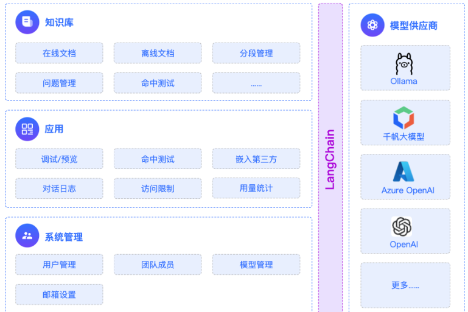

### 4.2 Ollama的下载-安装

Ollama项目支持跨平台部署，目前已兼容Mac、Linux和Windows操作系统。

无论使用哪个操作系统，Ollama项目的安装过程都设计得非常简单。

访问 <https://ollama.com/download> 下载对应系统的安装文件。

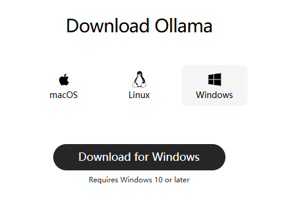

- Linux 系统执行以下命令安装：

```bash
curl -fsSL https://ollama.com/install.sh | sh
```

这行命令的目的是从<https://ollama.com/> 网站读取 install.sh 脚本，并立即通过 sh 执行

该脚本，在安装过程中会包含以下几个主要的操作：

检查当前服务器的基础环境，如系统版本等；

下载Ollama的二进制文件；

配置系统服务，包括创建用户和用户组，添加Ollama的配置信息；

启动Ollama服务；

- Windows 系统的安装过程如下

手动创建ollama安装目录：首先在你想安装的路径下创建好一个新文件夹，并把ollama的安装包放在里面。比如我的是：F:\common_tools\Ollama

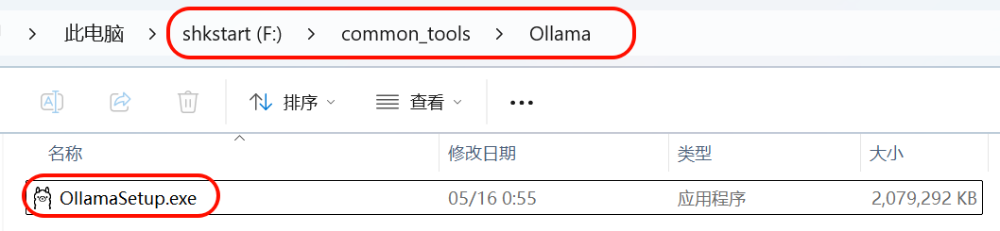

在文件路径上输入cmd 回车后会自动打开命令行窗口：

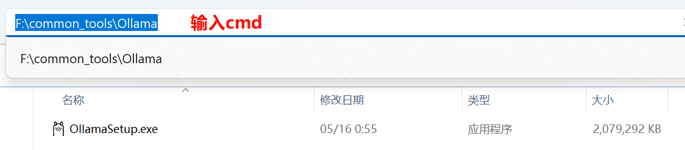

然后在cmd 窗口输入：

```powershell
OllamaSetup.exe /DIR=F:\common_tools\Ollama
```

语法：软件名称/DIR=这里放你上面创建好的Ollama指定目录

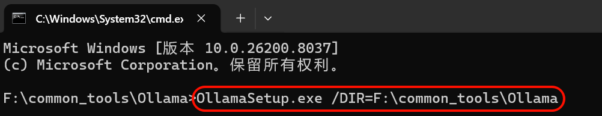

然后Ollama就会进入安装，点击install后，可以看到Ollama的安装路径就变成了我们指定的目录了。

### 4.3 模型的下载

**1、手动设置大模型存储目录：**

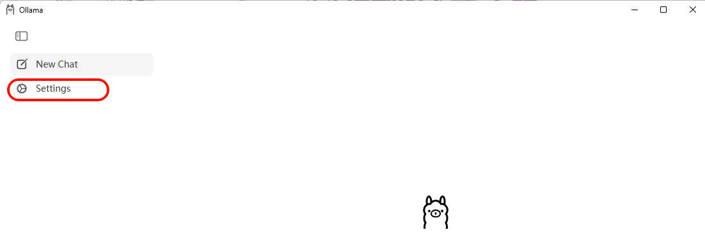

指明大模型要下载到的本地目录位置

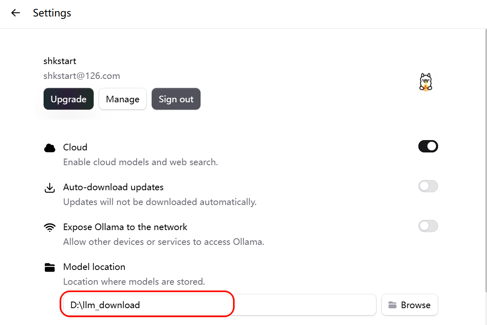

**2、模型的下载**

方式1：直接在图形化界面位置下载

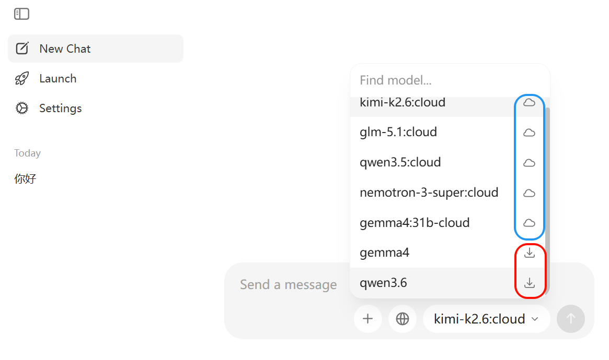

> 蓝色的使用在线模型，需要在Ollama平台付费使用。

方式2：访问 <https://ollama.com/search> 可以查看 Ollama 支持的模型。使用命令行可以下载并运行模型，例如运行 deepseek-r1:1.5b 模型：

```bash
ollama run deepseek-r1:1.5b
```

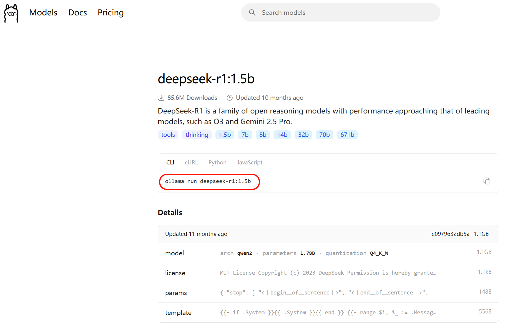

回到命令行，输入指令开始下载：

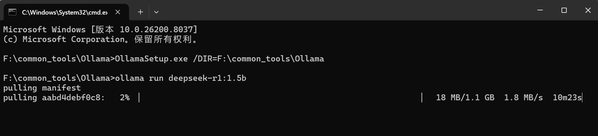

下载完即可进行交互：

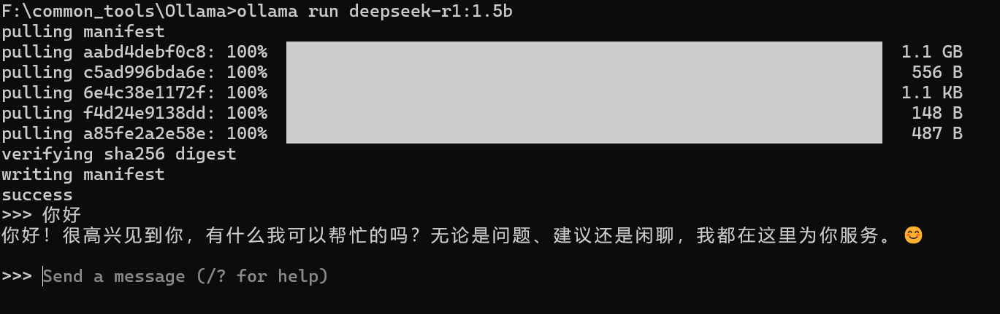

Ollama常用命令：

| 命令 | 一句话说明 |
| --- | --- |
| ollama pull llama3 | 下载指定模型（例：llama3）。 |
| ollama run llama3 | 启动并进入该模型交互对话。 |
| ollama list | 列出本机已下载的所有模型。 |
| ollama rm llama3 | 删除不再需要的模型以节省磁盘。 |
| ollama cp llama3 my-llama3 | 本地复制/重命名模型。 |
| ollama show llama3 | 查看模型详细信息（参数、大小等）。 |
| ollama create my-model -f Modelfile | 用自定义 Modelfile 构建新模型。 |
| ollama serve | 启动后台服务，供 API 调用。 |
| ollama ps | 查看当前正在运行的模型进程。 |
| ollama stop llama3 | 停止正在运行的模型。 |
| ollama --version | 查看安装的ollama版本 |

### 4.4 LangChain调用模型

LangChain整合Ollama调用本地大模型：

```bash
#pip install langchain-ollama
pip install -qU langchain-ollama

pip install -U ollama
```

方式1：

```python
from langchain_ollama import ChatOllama

ollama_llm = ChatOllama(
    model="deepseek-r1:1.5b",
    base_url="http://192.168.1.106:11434" #如果Ollama在本地默认端口运行，则可省
略，或使用http://localhost:11434
)
question = "你好，请你介绍一下你自己。"

result = ollama_llm.invoke(question)
print(result)
```

```python
content='您好！我是由中国的深度求索（DeepSeek）公司开发的智能助手DeepSeek-R1。有
关模型和产品的详细内容请参考官方文档。' additional_kwargs={} response_metadata=
{'model': 'deepseek-r1:1.5b', 'created_at': '2026-05-
17T13:42:49.4318473Z', 'done': True, 'done_reason': 'stop',
'total_duration': 485244400, 'load_duration': 55976000,
'prompt_eval_count': 9, 'prompt_eval_duration': 196625400, 'eval_count':
38, 'eval_duration': 208765000, 'logprobs': None, 'model_name':
'deepseek-r1:1.5b', 'model_provider': 'ollama'} id='lc_run--019e362c-
d771-7580-aa74-db1420cfce2b-0' tool_calls=[] invalid_tool_calls=[]
usage_metadata={'input_tokens': 9, 'output_tokens': 38, 'total_tokens':
47}
```

方式2：

```python
from langchain.chat_models import init_chat_model

ollama_llm = init_chat_model(
    model="deepseek-r1:1.5b",
    model_provider="ollama",
    # base_url="http://192.168.1.106:11434",
)

question = "你好，请你介绍一下你自己。"

result = ollama_llm.invoke(question)
print(result)
```

```python
content='您好！我是由中国的深度求索（DeepSeek）公司开发的智能助手DeepSeek-R1。我
擅长通过思考来帮您解答复杂的数学，代码和逻辑推理等理工类问题。' additional_kwargs=
{} response_metadata={'model': 'deepseek-r1:1.5b', 'created_at': '2026-
05-17T13:45:51.8148967Z', 'done': True, 'done_reason': 'stop',
'total_duration': 658034000, 'load_duration': 53012900,
'prompt_eval_count': 9, 'prompt_eval_duration': 236815100, 'eval_count':
47, 'eval_duration': 338788200, 'logprobs': None, 'model_name':
'deepseek-r1:1.5b', 'model_provider': 'ollama'} id='lc_run--019e362f-
9f34-7cc2-b34d-8fa380131978-0' tool_calls=[] invalid_tool_calls=[]
usage_metadata={'input_tokens': 9, 'output_tokens': 47, 'total_tokens':
56}
```
