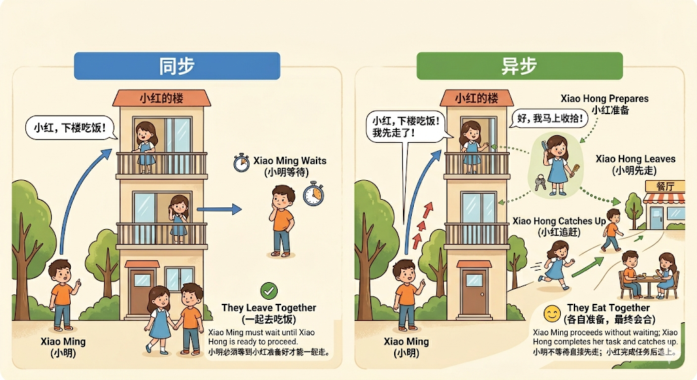

# 模型的调用

## 5、模型的调用

在 LangChain 中，模型调用（Invocation）是指通过特定方法触发大语言模型生成输出的过程。根据不同的应用场景和需求，LangChain 提供了几种核心的调用方式，主要是 invoke() 、stream() 和batch() 方法，以及它们的异步版本 ainvoke() 、astream() 和abatch()，下面将系统地介绍这些方法。

- invoke()：阻塞式，一次性返回完整结果问答、批处理任务、无需实时反馈的场景。
- ainvoke()：非阻塞式，提高系统吞吐量高并发Web应用、IO密集型任务。
- stream()：流式输出，实时返回每个token聊天机器人、长文本生成、需要提升用户体验的交互应用。
- asteam()：非阻塞式，提高系统吞吐量高并发Web应用、IO密集型任务。
- batch()：批量处理多个输入高并发场景，需要同时处理大量请求。
- abatch()：非阻塞式，提高系统吞吐量高并发Web应用、IO密集型任务。

### 5.1 invoke()

invoke() 是 LangChain 中最核心的方法，它的工作模式是阻塞式的，即程序会等待模型完全生成整个响应后，再一次性将结果返回给用户。

#### 5.1.1 invoke()说明

简单来说，invoke 方法的作用就是：

1. 接收你的输入（问题、指令、对话历史等）2. 发送给 LLM 模型（如 GPT-4、Llama、Claude 等）3. 返回模型的响应（文本回复 + 元数据信息）

基本语法：

```python
response = model.invoke(input, config=None)
```

参数详解：

| 参数 | 类型 | 说明 | 必需 | 默认值 |
| --- | --- | --- | --- | --- |
| input | str \| list[dict] \|list[Message] 等 | 你要发送给模型的内容 | 必需 | 无 |
| config | dict | 高级配置（回调函数、元数据、标签等） | 可选 | None |

#### 5.1.2 输入参数详解

invoke方法非常灵活，支持三种形式的输入：文本输入、字典列表、消息对象列表。

**1、文本输入（最简单）**

简单的一次性问答，直接传入一个问题或指令。

✅适用场景：快速测试，不需要保留对话历史的简单生成任务。

❌缺点：无法设置系统提示（system prompt），无法传递对话历史

```python
from langchain.chat_models import init_chat_model
from dotenv import load_dotenv
import os

# 从.env文件中加载环境变量
load_dotenv(override=True)

CLOSEAI_API_KEY = os.getenv("CLOSEAI_API_KEY")
CLOSEAI_BASE_URL = os.getenv("CLOSEAI_BASE_URL")

model = init_chat_model(
    model="openai:gpt-5.4-mini",
    api_key=CLOSEAI_API_KEY,
    base_url=CLOSEAI_BASE_URL
)
# 向模型发送单条数据
prompt = "翻译成英文：你好世界"
response = model.invoke(prompt)

# 打印响应
print(response)
```

在 invoke 中直接输入文本，即可自动转化为 user message 并进行对话。

**2、字典列表（推荐，最灵活）**

创建字典列表组成消息。一条消息通常包含 role（角色）、content（内容）等信息。

✅适用场景：可以设置系统提示，表达多轮对话历史，JSON 兼容，易于序列化和网络传输，生产环境推荐。

❌缺点：代码稍微多一点（但更清晰）

格式：

```python
messages = [
    {"role": "system", "content": "系统提示"},
    {"role": "user", "content": "用户消息"},
    {"role": "assistant", "content": "AI回复"},  # 可选，用于对话历史
    {"role": "user", "content": "继续提问"}
]
```

角色说明：

| 角色 | 英文 | 作用 | 示例 |
| --- | --- | --- | --- |
| system | System | 设定 AI 的行为、角色、规则 | "你是一个专业的 Python 导师" |
| user | Human / User | 用户的输入/问题 | "什么是装饰器？" |
| assistant | AI / Assistant | AI 的历史回复（用于对话上下文） | "装饰器是一种设计模式..." |

> "user"和 "human"有时可以互换，但遵循你选择的主要模型提供商（如OpenAI）的惯例使用"user"是最稳妥的做法。

举例1：

```python
from langchain.chat_models import init_chat_model
from dotenv import load_dotenv
import os

# 从.env文件中加载环境变量
load_dotenv(override=True)

CLOSEAI_API_KEY = os.getenv("CLOSEAI_API_KEY")
CLOSEAI_BASE_URL = os.getenv("CLOSEAI_BASE_URL")

model = init_chat_model(
    model="gpt-5.4-mini",
    model_provider="openai",
    api_key=CLOSEAI_API_KEY,
    base_url=CLOSEAI_BASE_URL
)

# 使用字典格式构建消息
messages = [
    {"role":"system","content":"你是一个专业的数学老师。"},
    {"role":"user","content":"什么是斐波那契数列？"}
]

response = model.invoke(messages)
# 打印响应
print(f"AI的回复：{response.content}")
```

举例2：多轮对话（带历史）

```python
from langchain.chat_models import init_chat_model
from dotenv import load_dotenv
import os

# 从.env文件中加载环境变量
load_dotenv(override=True)

CLOSEAI_API_KEY = os.getenv("CLOSEAI_API_KEY")
CLOSEAI_BASE_URL = os.getenv("CLOSEAI_BASE_URL")

model = init_chat_model(
    model="gpt-5.4-mini",
    model_provider="openai",
    api_key=CLOSEAI_API_KEY,
    base_url=CLOSEAI_BASE_URL
)

# 使用字典格式构建消息
messages = [
    {"role":"system","content":"你是一个专业的数学老师。"},
    {"role":"user","content":"2 + 3 * 2 = ？"},
    {"role":"assistant","content":"8"},
    {"role":"user","content":"我刚才问了什么问题？"}
]

response = model.invoke(messages)
# 打印响应
print(f"AI的回复：{response.content}")
```

```markdown
AI的回复：你刚才问的是：**“2 + 3 * 2 = ？”**
```

举例3：如果不传递历史，AI 会"失忆"

```python
from langchain.chat_models import init_chat_model
from dotenv import load_dotenv
import os

# 从.env文件中加载环境变量
load_dotenv(override=True)

CLOSEAI_API_KEY = os.getenv("CLOSEAI_API_KEY")
CLOSEAI_BASE_URL = os.getenv("CLOSEAI_BASE_URL")

model = init_chat_model(
    model="openai:gpt-5.4-mini",
    api_key=CLOSEAI_API_KEY,
    base_url=CLOSEAI_BASE_URL
)

messages1 = [
    {"role": "system", "content": "你是一个非常友好的AI助手"},
    {"role": "user", "content": "你好，我叫小明"},
]
# 第一次对话
response1 = model.invoke(messages1)
# 打印响应
print(f"AI的回复1：{response1.content}")

messages2 = [
    {"role": "user", "content": "我叫什么名字？"}
]
# 第二次对话
response2 = model.invoke(messages2)
# 打印响应
print(f"AI的回复2：{response2.content}")
```

```text
AI的回复1：你好，小明！很高兴认识你 😊
我是你的AI助手，有什么我可以帮你的吗？

AI的回复2：我不知道你的名字，除非你告诉我。
如果你愿意，可以直接告诉我，我之后就可以这样称呼你。
```

作为对比，传递记忆：

```python
conversation = [
    {"role": "system", "content": "你是一个非常友好的AI助手"},
    {"role": "user", "content": "你好，我叫小明"}
]

# 第一次对话
response1 = model.invoke(conversation)
# 打印响应
print(f"AI的回复1：{response1.content}")
```

```python
# 添加记忆
conversation.append({"role": "assistant", "content": response1.content})

conversation.append({"role": "user", "content": "我叫什么名字？"})

# 第二次对话
response2 = model.invoke(conversation)
print(f"AI的回复2：{response2.content}")
AI的回复1：你好，小明！很高兴认识你 😊
我是你的AI助手，有什么我可以帮你的吗？

AI的回复2：你叫小明。
```

> 说明：关于消息列表的内容此处不必深究，Messages章节会系统介绍。

**3、消息对象列表**

使用内置的消息类（如 SystemMessage、HumanMessage、AIMessage），将消息对象列表输入模型。

✅适用场景：需要类型检查（针对大型项目）、IDE 自动补全的场景

❌缺点：代码较长、不如字典简洁、难以序列化（JSON）

消息类型对照：

| 消息类 | 对应字典格式 | 作用 |
| --- | --- | --- |
| SystemMessage | {"role": "system", ...} | 系统提示 |
| HumanMessage | {"role": "user", ...} | 用户输入 |
| AIMessage | {"role": "assistant", ...} | AI 回复 |

举例1：

```python
from langchain_core.messages import SystemMessage, AIMessage, HumanMessage
from langchain.chat_models import init_chat_model
from dotenv import load_dotenv
import os

# 从.env文件中加载环境变量
load_dotenv(override=True)

CLOSEAI_API_KEY = os.getenv("CLOSEAI_API_KEY")
CLOSEAI_BASE_URL = os.getenv("CLOSEAI_BASE_URL")

model = init_chat_model(
    model="openai:gpt-5.4-mini",
    api_key=CLOSEAI_API_KEY,
    base_url=CLOSEAI_BASE_URL
)

# 使用消息对象格式构建消息
messages = [
    SystemMessage("你是一个专业的数学老师。"),
    HumanMessage("2 + 3 * 2 = ？"),
    AIMessage("8"),
    HumanMessage("我刚才问什么问题了？")
]

response = model.invoke(messages)
# 打印响应
print(f"AI的回复：{response.content}")
```

举例2：

```python
from langchain_core.messages import SystemMessage, HumanMessage, AIMessage

messages = [
    SystemMessage(content="你是一个 Python 专家"),
    HumanMessage(content="什么是生成器？"),
]

response = model.invoke(messages)
# print(response)

# 继续对话
messages.append(AIMessage(content=response.content))
messages.append(HumanMessage(content="能给个例子吗？"))

response1 = model.invoke(messages)
print(response1)
```

#### 5.1.3 返回值详解

invoke 返回一个AIMessage对象，源码如下：

```python
def invoke(
    self,
    input: LanguageModelInput,
    config: RunnableConfig | None = None,
    *,
    stop: list[str] | None = None,
    **kwargs: Any,
) -> AIMessage:
```

举例：

```python
from langchain_core.messages import SystemMessage, AIMessage, HumanMessage
from langchain.chat_models import init_chat_model
from dotenv import load_dotenv
import os

# 从.env文件中加载环境变量
load_dotenv(override=True)

CLOSEAI_API_KEY = os.getenv("CLOSEAI_API_KEY")
CLOSEAI_BASE_URL = os.getenv("CLOSEAI_BASE_URL")

model = init_chat_model(
    model="gpt-5.4-mini",
    api_key=CLOSEAI_API_KEY,
    base_url=CLOSEAI_BASE_URL
)

# 使用字典格式构建消息
response = model.invoke([HumanMessage("2 + 3 * 2 = ？")])
# 打印响应
print(type(response))
# <class 'langchain_core.messages.ai.AIMessage'>
from rich import print as rprint

rprint(response)
```

```python
AIMessage(
 content='2 + 3 * 2 = **8**',
 additional_kwargs={'refusal': None},
 response_metadata={
     'token_usage': {
         'completion_tokens': 15,
         'prompt_tokens': 16,
         'total_tokens': 31,
         'completion_tokens_details': {
             'accepted_prediction_tokens': 0,
             'audio_tokens': 0,
             'reasoning_tokens': 0,
             'rejected_prediction_tokens': 0
         },
         'prompt_tokens_details': {'audio_tokens': 0, 'cached_tokens':
0},
         'latency_checkpoint': {
             'engine_tbt_ms': 4,
             'engine_ttft_ms': 36,
             'engine_ttlt_ms': 100,
             'pre_inference_ms': 86,
             'service_tbt_ms': 4,
             'service_ttft_ms': 280,
             'service_ttlt_ms': 338,
             'total_duration_ms': 259,
             'user_visible_ttft_ms': 194
         }
     },
     'model_provider': 'openai',
     'model_name': 'gpt-5.4-mini-2026-03-17',
     'system_fingerprint': None,
     'id': 'chatcmpl-DgWobsxhDOqzjqVFwbZYKRnovpEiV',
     'service_tier': 'default',
     'finish_reason': 'stop',
     'logprobs': None
 },
 id='lc_run--019e3659-5ee2-7b62-bc8a-741e27374b43-0',
 tool_calls=[],
 invalid_tool_calls=[],
 usage_metadata={
     'input_tokens': 16,
     'output_tokens': 15,
     'total_tokens': 31,
     'input_token_details': {'audio': 0, 'cache_read': 0},
     'output_token_details': {'audio': 0, 'reasoning': 0}
 }
)
```

AIMessage中包含丰富的信息，以上面案例的输出为例，整体说明如下：

```python
AIMessage(
    # --- 核心内容 ---
    content='2 + 3 * 2 = **8**',  # 模型生成的最终文本答案

    additional_kwargs={
        'refusal': None# 模型拒绝回答的情况（如触碰安全策略），None 表示正常回答
    },

    # --- 响应元数据（API 返回的详细原始数据） ---
    response_metadata={
        'token_usage': {
            'completion_tokens': 15,    # 生成回答消耗的 Token 数（输出）
            'prompt_tokens': 16,        # 用户输入消耗的 Token 数（输入）
            'total_tokens': 31,         # 本次交互总共消耗的 Token

            'completion_tokens_details': {
                'accepted_prediction_tokens': 0, # 预测性生成的 Token 数
                'audio_tokens': 0,               # 音频生成消耗（如有）
                'reasoning_tokens': 0,# 推理模型（如 o1）思考过程消耗的 Token
                'rejected_prediction_tokens': 0  # 被拒绝的预测 Token
            },

            'prompt_tokens_details': {
                'audio_tokens': 0,   # 输入中的音频 Token 数
                'cached_tokens': 0   # 命中的缓存 Token 数（能省钱/提速）
            },

            # --- 延迟性能监控（单位：毫秒 ms） ---
            'latency_checkpoint': {
                'engine_tbt_ms': 4,        # 引擎 Token 间平均间隔时间
                'engine_ttft_ms': 36,      # 引擎生成首个 Token 的时间
                'engine_ttlt_ms': 100,     # 引擎生成最后一个 Token 的时间
                'pre_inference_ms': 86, # 推理前的预处理耗时(安全审核、Token 化等
预处理)
                'service_tbt_ms': 4, # 服务端token与token之间生成的间隔时间，决定
了打字机效果是否丝滑。
                'service_ttft_ms': 280,  # 服务端接收到请求到输出首字的总时间
                'service_ttlt_ms': 338,    # 服务端完成全部输出的总时间
                'total_duration_ms': 259,  # 本次请求在系统中记录的总持续时长
                'user_visible_ttft_ms': 194   # 用户看到第一个字跳出来等待的时间
            }
        },
        'model_provider': 'openai',               # 模型供应商
        'model_name': 'gpt-5.4-mini-2026-03-17',  # 使用的具体模型版本
        'system_fingerprint': None,          # 系统指纹，用于追踪模型后端的配置变
更
        'id': 'chatcmpl-DgWobsxhDOqzjqVFwbZYKRnovpEiV', #API层面的响应 ID
        'service_tier': 'default',    # 服务层级（如按量付费或订阅）
        'finish_reason': 'stop',     # 停止原因：stop（自然结束）、length（长度受
限）
        'logprobs': None            # 对数概率（通常用于分析词汇选择的可能性）
    },

    # --- LangChain 内部标识 ---
    id='lc_run--019e3659-5ee2-7b62-bc8a-741e27374b43-0',
    # LangChain 追踪此条运行的唯一 ID

    # --- 工具调用信息 ---
    tool_calls=[],             # 正常触发的外部工具调用列表
    invalid_tool_calls=[],     # 触发失败或格式错误的工具调用
```

```python
    # --- 统一消耗元数据（LangChain 标准化后的消耗格式） ---
    usage_metadata={
        'input_tokens': 16,    # 输入 Token 数
        'output_tokens': 15,   # 输出 Token 数
        'total_tokens': 31,    # 总 Token 数
        'input_token_details': {
            'audio': 0,
            'cache_read': 0    # 从缓存中读取的输入数量
        },
        'output_token_details': {
            'audio': 0,
            'reasoning': 0     # 包含在输出中的推理 Token
        }
    }
)
```

总结一下：

**1. 核心内容与基本信息**

- content : 模型生成的文本回答。这是你最关心的核心输出。
- id : 本次运行在 LangChain 内部生成的唯一标识符（Run ID）。
- additional_kwargs : 包含特定供应商的额外参数。

refusal : 如果模型拒绝回答（涉及敏感政策），此处会显示拒绝原因。

**2. 消耗统计 （Token Usage）**

这部分决定了你这一行输入操作花了多少钱：

- prompt_tokens / input_tokens : 输入 Token 数。你发送给模型的问题长度。
- completion_tokens / output_tokens : 输出 Token 数。模型回答生成的长度。
- total_tokens : 总消耗。 两者之和。
- reasoning_tokens : 推理 Token 数。 如果是 O1/O3 等推理模型，这里会显示它在“思考”时消耗的 Token。
- cached_tokens : 缓存命中的 Token 数。重复提问时，如果命中了模型商的缓存，这部分费用通常更低。

**3. 响应元数据 （Response Metadata）**

这部分是 API 返回的原始详细信息：

- model_name : 实际调用的模型具体版本（如 gpt-5.4-mini）。
- model_provider : 模型供应商（如 openai）。
- finish_reason : 生成停止的原因。

stop : 正常回答结束。

length : 达到最大 Token 限制被截断。

- system_fingerprint : 系统指纹，用于追踪模型后端的配置变更。

**4. 性能与延迟 （Latency Checkpoint）**

这是针对 API 响应速度的深度拆解（单位通常为毫秒 ms）：

- total_duration_ms : 总耗时。从请求发出到完全收到的总时间（259ms）。
- user_visible_ttft_ms : 首字到达时间。用户看到第一个字跳出来等待的时间（194ms），这是体感快慢的关键。
- engine_ttft_ms : 引擎层面的首字到达时间（36ms）。
- engine_ttlt_ms : 引擎生成最后一个字的时间（100ms）。
- pre_inference_ms : 推理前处理耗时。包括安全审核、Token 化等预处理（86ms）。
- service_tbt_ms : Time Between Tokens。字与字之间生成的间隔时间，决定了打字机效果是否丝滑。

**5. 工具调用信息**

- tool_calls : 结构化工具调用列表。如果模型决定调用某个 Python 函数或搜索工具，参数会在这里。
- invalid_tool_calls : 格式错误的工具调用尝试。

举例：访问所有信息

```python
response = model.invoke("用一句话解释什么是 AI")

# 1. 获取回复内容
print("AI 回复:", response.content)

# 2. 获取响应元数据
metadata = response.response_metadata
print(f"使用的模型: {metadata['model_name']}")
print(f"结束原因: {metadata['finish_reason']}")
print(f"模型提供商：{metadata['model_provider']}\n")

# 3. 获取 Token 使用情况
usage = metadata.get('token_usage', {})
print(f"输入 tokens: {usage.get('prompt_tokens')}")
print(f"输出 tokens: {usage.get('completion_tokens')}")
print(f"总计 tokens: {usage.get('total_tokens')}")

# 4. 获取消息 ID
print(f"消息 ID: {response.id}")
```

```text
AI 回复: AI（人工智能）就是让机器模拟人类的学习、推理、识别和决策能力。
使用的模型: gpt-5.4-mini-2026-03-17
结束原因: stop
模型提供商：openai

输入 tokens: 13
输出 tokens: 28
总计 tokens: 41
消息 ID: lc_run--019e3665-8dfa-7c53-a9a5-4995348a0258-0
```

### 5.2 流式调用

**invoke 和 stream 有什么区别？**

- invoke()：同步调用，在模型输出完成后一次性获取响应，对于输出文本很长的场景，用户体验不好。
- stream()：流式调用，实时返回响应片段。调用后，返回一个迭代器（iterator），可以通过循环来实时处理每一个新生成的chunk内容块。

> 注意：流式输出依赖于模型供应商对于流式输出的支持。

举例：

```python
from langchain.chat_models import init_chat_model
from dotenv import load_dotenv
import os

# 从.env文件中加载环境变量
load_dotenv(override=True)

CLOSEAI_API_KEY = os.getenv("CLOSEAI_API_KEY")
CLOSEAI_BASE_URL = os.getenv("CLOSEAI_BASE_URL")

model = init_chat_model(
    model="gpt-5.4-mini",
    api_key=CLOSEAI_API_KEY,
    base_url=CLOSEAI_BASE_URL
)

for chunk in model.stream("写一首七言律诗，总结大模型的发展"):
    print(chunk.text, end="", flush=True) # 逐token输出
```

输出如下：

> 《大模型演进感赋》混沌初开数据洪，算力为楫智为峰。千层网络参差现，万亿参数次第通。昔困逻辑循旧径，今驰想象破苍穹。忽闻语料版权议，且看规制立新功。

> 注：本诗以七律形式凝练大模型发展历程。首联以“数据洪”“算力楫”喻示发展基础，颔联通过“千层网络”“万亿参数”展现技术突破，颈联对比传统AI的局限与大模型的飞跃，尾联则指向当前版权争议与未来规制建设，暗合技术与社会协同演进之理。

输出不再是整段返回，而是流式输出。

**stream()方式的优点：**

- 响应速度更快 — 用户不必等待完整输出
- 交互体验更流畅 — 尤其在长文本或复杂推理场景下
- 可实时展示模型思考过程

### 5.3 批量调用

batch() 方法允许你一次性发送一组请求（含多条独立请求），模型会在后台并行处理，然后返回所有结果的列表。

与逐个顺序调用（invoke）相比，能大幅减少网络往返开销和等待时间，显著提升性能、降低成本。

适用场景：文档摘要、批量问答、数据预处理、多样本分类等。

#### 5.4.1 一次性接收所有响应

batch()特点是等待所有请求处理完毕，按原始输入顺序返回结果列表。

```python
from langchain.chat_models import init_chat_model
from dotenv import load_dotenv
import os
# 从.env文件中加载环境变量
load_dotenv(override=True)

CLOSEAI_API_KEY = os.getenv("CLOSEAI_API_KEY")
CLOSEAI_BASE_URL = os.getenv("CLOSEAI_BASE_URL")

model = init_chat_model(
    model="gpt-5.4-mini",
    api_key=CLOSEAI_API_KEY,
    base_url=CLOSEAI_BASE_URL
)

messages = [
    "你好，你是谁？",
    "2 + 3 * 5 = ?",
    "中国首都在哪里？"
]

responses = model.batch(messages)

for response in responses:
    print(response)
```

输出如下：

```python
content='你好！我是 ChatGPT，一个由 OpenAI 训练的人工智能助手。  \n我可以帮你回答
问题、写作、翻译、总结、学习辅导、头脑风暴等。\n\n如果你愿意，也可以直接告诉我你现在想
做什么，我来帮你。' additional_kwargs={'refusal': None} response_metadata=
{'token_usage': {'completion_tokens': 65, 'prompt_tokens': 10,
'total_tokens': 75, 'completion_tokens_details':
{'accepted_prediction_tokens': 0, 'audio_tokens': 0, 'reasoning_tokens':
0, 'rejected_prediction_tokens': 0}, 'prompt_tokens_details':
{'audio_tokens': 0, 'cached_tokens': 0}, 'latency_checkpoint':
{'engine_tbt_ms': 4, 'engine_ttft_ms': 41, 'engine_ttlt_ms': 303,
'pre_inference_ms': 100, 'service_tbt_ms': 4, 'service_ttft_ms': 210,
'service_ttlt_ms': 470, 'total_duration_ms': 382,
'user_visible_ttft_ms': 109}}, 'model_provider': 'openai', 'model_name':
'gpt-5.4-mini-2026-03-17', 'system_fingerprint': None, 'id': 'chatcmpl-
DgYAfQi7g8uUD1A5WE0575GpaPyW7', 'service_tier': 'default',
'finish_reason': 'stop', 'logprobs': None} id='lc_run--019e36a8-e912-
7ea0-ba20-5f7c5a8f48ab-0' tool_calls=[] invalid_tool_calls=[]
usage_metadata={'input_tokens': 10, 'output_tokens': 65, 'total_tokens':
75, 'input_token_details': {'audio': 0, 'cache_read': 0},
'output_token_details': {'audio': 0, 'reasoning': 0}}
content='2 + 3 * 5 = 17' additional_kwargs={'refusal': None}
response_metadata={'token_usage': {'completion_tokens': 14,
'prompt_tokens': 15, 'total_tokens': 29, 'completion_tokens_details':
{'accepted_prediction_tokens': 0, 'audio_tokens': 0, 'reasoning_tokens':
0, 'rejected_prediction_tokens': 0}, 'prompt_tokens_details':
{'audio_tokens': 0, 'cached_tokens': 0}, 'latency_checkpoint':
{'engine_tbt_ms': 6, 'engine_ttft_ms': 50, 'engine_ttlt_ms': 136,
'pre_inference_ms': 63, 'service_tbt_ms': 6, 'service_ttft_ms': 276,
'service_ttlt_ms': 357, 'total_duration_ms': 304,
'user_visible_ttft_ms': 214}}, 'model_provider': 'openai', 'model_name':
'gpt-5.4-mini-2026-03-17', 'system_fingerprint': None, 'id': 'chatcmpl-
DgYAgDYTix1VzH7afG3tT8Kq2jBzY', 'service_tier': 'default',
'finish_reason': 'stop', 'logprobs': None} id='lc_run--019e36a8-e913-
7a81-8900-5dd774f747d6-0' tool_calls=[] invalid_tool_calls=[]
usage_metadata={'input_tokens': 15, 'output_tokens': 14, 'total_tokens':
29, 'input_token_details': {'audio': 0, 'cache_read': 0},
'output_token_details': {'audio': 0, 'reasoning': 0}}
content='中国的首都是**北京**。' additional_kwargs={'refusal': None}
response_metadata={'token_usage': {'completion_tokens': 12,
'prompt_tokens': 11, 'total_tokens': 23, 'completion_tokens_details':
{'accepted_prediction_tokens': 0, 'audio_tokens': 0, 'reasoning_tokens':
0, 'rejected_prediction_tokens': 0}, 'prompt_tokens_details':
{'audio_tokens': 0, 'cached_tokens': 0}, 'latency_checkpoint':
{'engine_tbt_ms': 4, 'engine_ttft_ms': 32, 'engine_ttlt_ms': 81,
'pre_inference_ms': 113, 'service_tbt_ms': 4, 'service_ttft_ms': 234,
'service_ttlt_ms': 276, 'total_duration_ms': 166,
'user_visible_ttft_ms': 121}}, 'model_provider': 'openai', 'model_name':
'gpt-5.4-mini-2026-03-17', 'system_fingerprint': None, 'id': 'chatcmpl-
DgYAfeq1Z3fnSqiAM6YtatXt283t3', 'service_tier': 'default',
'finish_reason': 'stop', 'logprobs': None} id='lc_run--019e36a8-e914-
7430-ab51-c4903a89138d-0' tool_calls=[] invalid_tool_calls=[]
usage_metadata={'input_tokens': 11, 'output_tokens': 12, 'total_tokens':
23, 'input_token_details': {'audio': 0, 'cache_read': 0},
'output_token_details': {'audio': 0, 'reasoning': 0}}
```

#### 5.4.2 按完成顺序接收响应

当输入列表很大或单个模型调用耗时差异显著时，batch_as_completed() 允许应用在收到第一个结果后立即返回响应，而不会等待批次内所有任务完成才响应。即batch_as_completed() 每个请求完成后立即 yield 结果，结果可能乱序。

但是，每个返回的响应都被放在一个元组中，元组的第一个元素是原始输入的 index 索引，可根据索引重新排序。

```python
from langchain.chat_models import init_chat_model
from dotenv import load_dotenv
import os

# 从.env文件中加载环境变量
load_dotenv(override=True)

CLOSEAI_API_KEY = os.getenv("CLOSEAI_API_KEY")
CLOSEAI_BASE_URL = os.getenv("CLOSEAI_BASE_URL")

model = init_chat_model(
    model="gpt-5.4-mini",
    api_key=CLOSEAI_API_KEY,
    base_url=CLOSEAI_BASE_URL
)

messages = [
    "你好，你是谁？",
    "2 + 3 * 5 = ?",
    "中国首都在哪里？"
]

responses = model.batch_as_completed(messages)

for response in responses:
    print(response)
```

输出如下：

```python
(2, AIMessage(content='中国的首都是**北京**。', additional_kwargs=
{'refusal': None}, response_metadata={'token_usage':
{'completion_tokens': 12, 'prompt_tokens': 11, 'total_tokens': 23,
'completion_tokens_details': {'accepted_prediction_tokens': 0,
'audio_tokens': 0, 'reasoning_tokens': 0, 'rejected_prediction_tokens':
0}, 'prompt_tokens_details': {'audio_tokens': 0, 'cached_tokens': 0},
'latency_checkpoint': {'engine_tbt_ms': 4, 'engine_ttft_ms': 33,
'engine_ttlt_ms': 83, 'pre_inference_ms': 49, 'service_tbt_ms': 4,
'service_ttft_ms': 153, 'service_ttlt_ms': 201, 'total_duration_ms':
156, 'user_visible_ttft_ms': 104}}, 'model_provider': 'openai',
'model_name': 'gpt-5.4-mini-2026-03-17', 'system_fingerprint': None,
'id': 'chatcmpl-DgYBUqBCme3XzWO7XqkO1MYb2Cnr8', 'service_tier':
'default', 'finish_reason': 'stop', 'logprobs': None}, id='lc_run-
-019e36a9-af4e-76f0-a82c-e7c4ff53dcec-0', tool_calls=[],
invalid_tool_calls=[], usage_metadata={'input_tokens': 11,
'output_tokens': 12, 'total_tokens': 23, 'input_token_details':
{'audio': 0, 'cache_read': 0}, 'output_token_details': {'audio': 0,
'reasoning': 0}}))
(0, AIMessage(content='你好！我是一个 AI 助手，可以帮你回答问题、写作、翻译、总
结、编程、头脑风暴等。\n\n如果你愿意，可以直接告诉我你想做什么。',
additional_kwargs={'refusal': None}, response_metadata={'token_usage':
{'completion_tokens': 48, 'prompt_tokens': 10, 'total_tokens': 58,
'completion_tokens_details': {'accepted_prediction_tokens': 0,
'audio_tokens': 0, 'reasoning_tokens': 0, 'rejected_prediction_tokens':
0}, 'prompt_tokens_details': {'audio_tokens': 0, 'cached_tokens': 0},
'latency_checkpoint': {'engine_tbt_ms': 4, 'engine_ttft_ms': 41,
'engine_ttlt_ms': 230, 'pre_inference_ms': 58, 'service_tbt_ms': 4,
'service_ttft_ms': 155, 'service_ttlt_ms': 343, 'total_duration_ms':
292, 'user_visible_ttft_ms': 98}}, 'model_provider': 'openai',
'model_name': 'gpt-5.4-mini-2026-03-17', 'system_fingerprint': None,
'id': 'chatcmpl-DgYBUarWULgE5s3Jji6kxan1OnlWu', 'service_tier':
'default', 'finish_reason': 'stop', 'logprobs': None}, id='lc_run-
-019e36a9-af4c-79e0-885c-d39970d4bac4-0', tool_calls=[],
invalid_tool_calls=[], usage_metadata={'input_tokens': 10,
'output_tokens': 48, 'total_tokens': 58, 'input_token_details':
{'audio': 0, 'cache_read': 0}, 'output_token_details': {'audio': 0,
'reasoning': 0}}))
(1, AIMessage(content='2 + 3 * 5 = **17**', additional_kwargs=
{'refusal': None}, response_metadata={'token_usage':
{'completion_tokens': 15, 'prompt_tokens': 15, 'total_tokens': 30,
'completion_tokens_details': {'accepted_prediction_tokens': 0,
'audio_tokens': 0, 'reasoning_tokens': 0, 'rejected_prediction_tokens':
0}, 'prompt_tokens_details': {'audio_tokens': 0, 'cached_tokens': 0},
'latency_checkpoint': {'engine_tbt_ms': 4, 'engine_ttft_ms': 32,
'engine_ttlt_ms': 92, 'pre_inference_ms': 76, 'service_tbt_ms': 4,
'service_ttft_ms': 259, 'service_ttlt_ms': 315, 'total_duration_ms':
245, 'user_visible_ttft_ms': 182}}, 'model_provider': 'openai',
'model_name': 'gpt-5.4-mini-2026-03-17', 'system_fingerprint': None,
'id': 'chatcmpl-DgYBUqMC37Gxn4rlnliDQ2ORGNvKZ', 'service_tier':
'default', 'finish_reason': 'stop', 'logprobs': None}, id='lc_run-
-019e36a9-af4d-7380-add9-b3eee075881d-0', tool_calls=[],
invalid_tool_calls=[], usage_metadata={'input_tokens': 15,
'output_tokens': 15, 'total_tokens': 30, 'input_token_details':
{'audio': 0, 'cache_read': 0}, 'output_token_details': {'audio': 0,
'reasoning': 0}}))
```

#### 5.4.3 性能对比

使用batch()：

```python
# 准备多个输入
inputs = [
    "翻译成英文：春天来了",
    "翻译成英文：夏天很热",
    "翻译成英文：秋天落叶",
    "翻译成英文：冬天下雪"
]

# ✅ 批量调用（高效）
import time

start = time.time()
responses = model.batch(inputs)
batch_time = time.time() - start

print("批量调用结果：")
for i, response in enumerate(responses):
    print(f"{i+1}. {response.content}")
print(f"耗时: {batch_time:.2f}秒\n")
```

```text
批量调用结果：
1. “春天来了” in English is:

**Spring has arrived.**
2. “夏天很热” can be translated into English as:

**“Summer is very hot.”**
3. “秋天落叶” can be translated as **“autumn leaves falling”** or simply
**“falling leaves in autumn.”**
If you want a more natural title-like phrase, **“Falling Autumn Leaves”
** also works.
4. “冬天下雪” in English is:

**It snows in winter.**
耗时: 1.91秒
```

使用循环调用invoke():

```python
# ❌ 循环调用（低效，仅用于对比）
inputs = [
    "翻译成英文：春天来了",
    "翻译成英文：夏天很热",
    "翻译成英文：秋天落叶",
    "翻译成英文：冬天下雪"
]

start = time.time()
loop_responses = []
for inp in inputs:
    response = model.invoke(inp)
    loop_responses.append(response)
loop_time = time.time() - start

for i, response in enumerate(responses):
    print(f"{i+1}. {response.content}")

print(f"循环调用耗时: {loop_time:.2f}秒")

print(f"批量调用节省: {((loop_time - batch_time) / loop_time * 100):.1f}%")
```

```markdown
1. “春天来了” in English is:

**Spring has arrived.**
2. “夏天很热” can be translated into English as:

**“Summer is very hot.”**
3. “秋天落叶” can be translated as **“autumn leaves falling”** or simply
**“falling leaves in autumn.”**
If you want a more natural title-like phrase, **“Falling Autumn Leaves”
** also works.
4. “冬天下雪” in English is:

**It snows in winter.**
循环调用耗时: 3.87秒
批量调用节省: 50.7%
```

### 5.4 异步调用

**复习：同步 vs 异步**

同步（sync）：

- 概念：发起一个任务之后，需要等待该任务完成后，才能继续执行后续任务。
- 表现：当前执行流会被『阻塞』。

异步（async）：

- 概念：发起一个任务之后，不必等该任务完成，就可以继续执行其他任务。
- 备注：虽然不必等待任务完成，但任务完成后，仍然可以通过特定方式获取结果。
- 表现：当前执行流不会被『阻塞』。

举例：



在LangChain框架中，异步方法（ainvoke、astream、abatch）与它们的同步版本（invoke、stream、batch）相比，具备如下特点：

- 避免阻塞主线程：同步调用会阻塞程序执行，而异步方法让应用程序在等待API响应时保持响应性。
- 优化资源利用：异步操作可以更高效地利用系统资源，减少空闲等待时间

举例1：ainvoke()

```python
"""
@Author:shkstart
@Desc:
"""
from langchain.chat_models import init_chat_model
from dotenv import load_dotenv
import os
import asyncio
import time
```

```python
# 从.env文件中加载环境变量
load_dotenv(override=True)

CLOSEAI_API_KEY = os.getenv("CLOSEAI_API_KEY")
CLOSEAI_BASE_URL = os.getenv("CLOSEAI_BASE_URL")

model = init_chat_model(
    model="openai:gpt-5.4-mini",
    api_key=CLOSEAI_API_KEY,
    base_url=CLOSEAI_BASE_URL
)

async def demo_async_invoke():
    print("=== 演示：ainvoke 的异步（非阻塞）效果 ===")
    start_time = time.perf_counter()  # 记录开始时间

    print("程序开始...")

    # 1. 创建任务 (Task)
    print(">>> 发起异步模型调用 (ainvoke)...")
    async_task = asyncio.create_task(model.ainvoke("用一句话解释人工智能。"))

    # 2. 并行执行其他任务
    print(">>> 模型请求已在后台发送，继续执行本地逻辑...")
    for i in range(3):
        await asyncio.sleep(1)  # 使用异步等待，释放控制权
        print(f">>> 正在执行第{i + 1}个任务... (已耗时 {time.perf_counter() -
start_time:.2f}s)")

    # 3. 获取模型结果
    print(">>> 本地任务完成，检查模型状态...")
    response = await async_task

    end_time = time.perf_counter()
    print(f">>> 模型返回: {response.content}")
    print(f"=== 总运行耗时: {end_time - start_time:.2f}s ===")
```

```python
async def main():
    """主函数"""
    await demo_async_invoke()
```

```python
if __name__ == "__main__":
    asyncio.run(main())
```

```text
=== 演示：ainvoke 的异步（非阻塞）效果 ===
程序开始...
>>> 发起异步模型调用 (ainvoke)...
>>> 模型请求已在后台发送，继续执行本地逻辑...
>>> 正在执行第1个任务... (已耗时 1.00s)
>>> 正在执行第2个任务... (已耗时 2.02s)
>>> 正在执行第3个任务... (已耗时 3.02s)
>>> 本地任务完成，检查模型状态...
>>> 模型返回: 人工智能是让机器模拟人类的感知、学习、推理和决策能力的技术。
=== 总运行耗时: 3.02s ===
```

> 说明：在.py文件中执行，而非jupyter中执行。

举例2：astream()

```python
import asyncio
import os
from langchain.chat_models import init_chat_model
from dotenv import load_dotenv
import time

# 从.env文件中加载环境变量
load_dotenv(override=True)

CLOSEAI_API_KEY = os.getenv("CLOSEAI_API_KEY")
CLOSEAI_BASE_URL = os.getenv("CLOSEAI_BASE_URL")

model = init_chat_model(
    model="openai:gpt-5.4-mini",
    api_key=CLOSEAI_API_KEY,
    base_url=CLOSEAI_BASE_URL
)
```

```python
async def demo_async_stream():
    """演示异步调用的非阻塞特性"""
    print("=== 演示：astream 的异步（非阻塞）效果 ===")
    start_time = time.perf_counter()  # 记录开始时间
    print("程序开始...")

    # 1. 发起异步流式请求
    # 注意：此时请求已发出，返回的是一个异步生成器
    print(">>> 发起异步流式调用 (astream)...")
    stream_resp = model.astream("请用一句话解释机器学习的基本概念。")

    # 2. 在等待流式响应的同时，执行其他任务
    print(">>> 流式请求已发送，程序无需等待，继续执行其他异步任务...")
    for i in range(3):
        # 使用 asyncio.sleep 而非 time.sleep
        # 这允许事件循环在等待时去处理上面的 stream_resp 网络 IO
        await asyncio.sleep(1)
        # print(f">>> 正在执行并发任务 {i + 1}... ")
        print(f">>> 正在执行第{i + 1}个任务... (已耗时 {time.perf_counter() -
start_time:.2f}s)")

    # 3. 现在开始处理流式结果
    print(">>> 模拟任务已完成，开始读取缓冲区中的流式结果...")
    end_time = time.perf_counter()
    print(">>> 流式输出: ", end="", flush=True)
    async for chunk in stream_resp:
        # LangChain 的消息块通常通过 .content 获取内容
        content = chunk.content if hasattr(chunk, 'content') else str(chunk)
        print(content, end="", flush=True)

    print("\n>>> 流式输出结束\n")
    print(f"=== 总运行耗时: {end_time - start_time:.2f}s ===")
```

```python
async def main():
    """主函数"""
    await demo_async_stream()
```

```python
if __name__ == "__main__":
    asyncio.run(main())
```

```text
=== 演示：astream 的异步（非阻塞）效果 ===
程序开始...
>>> 发起异步流式调用 (astream)...
>>> 流式请求已发送，程序无需等待，继续执行其他异步任务...
>>> 正在执行第1个任务... (已耗时 1.00s)
>>> 正在执行第2个任务... (已耗时 2.02s)
>>> 正在执行第3个任务... (已耗时 3.02s)
>>> 模拟任务已完成，开始读取缓冲区中的流式结果...
>>> 流式输出: 机器学习是一种让计算机通过数据自动学习规律，并据此对新数据进行预测或决
策的技术。
>>> 流式输出结束

=== 总运行耗时: 3.02s ===
```

举例3：abatch()

```python
"""
@Author:shkstart
@Desc:
"""
import asyncio
import os
from langchain.chat_models import init_chat_model
from dotenv import load_dotenv
import time

# 从.env文件中加载环境变量
load_dotenv(override=True)

CLOSEAI_API_KEY = os.getenv("CLOSEAI_API_KEY")
CLOSEAI_BASE_URL = os.getenv("CLOSEAI_BASE_URL")

model = init_chat_model(
    model="openai:gpt-5.4-mini",
    api_key=CLOSEAI_API_KEY,
    base_url=CLOSEAI_BASE_URL
)
```

```python
async def demo_async_batch():
    """演示异步批量的非阻塞特性"""
    print("=== 演示：abatch 的异步（非阻塞）效果 ===")
    start_time = time.perf_counter()  # 记录开始时间

    print("程序开始...")

    # 准备批量输入
    questions = ["用一句话说明深度学习与传统机器学习的区别", "中国首都在哪里？"]

    # 1. 发起异步批量请求
    # 关键修改：使用 create_task 让协程立即在后台执行
    print(">>> 发起异步批量调用 (abatch)...")
    batch_task = asyncio.create_task(model.abatch(questions))

    # 2. 在等待批量处理的同时，执行其他任务
    print(">>> 批量任务已在后台运行，主程序继续执行...")
    for i in range(3):
        # 关键修改：使用 asyncio.sleep 允许后台任务获取 CPU 时间片进行网络请求
        await asyncio.sleep(1)
        print(f">>> 正在执行第{i + 1}个任务... (已耗时 {time.perf_counter() -
start_time:.2f}s)")

    # 3. 等待批量处理结果
    print(">>> 其他任务已完成，现在获取后台批量任务的结果...")
    # 此时 batch_task 可能已经完成，或者我们在这里等待它完成
    responses = await batch_task

    end_time = time.perf_counter()

    for response in responses:
        content = response.content if hasattr(response, 'content') else
str(response)
        print(f">>> 响应内容: {content}")

    print(f"=== 总运行耗时: {end_time - start_time:.2f}s ===")
```

```python
async def main():
    """主函数"""
    await demo_async_batch()
```

```python
if __name__ == "__main__":
    asyncio.run(main())
```

```text
=== 演示：abatch 的异步（非阻塞）效果 ===
程序开始...
>>> 发起异步批量调用 (abatch)...
>>> 批量任务已在后台运行，主程序继续执行...
>>> 正在执行第1个任务... (已耗时 1.01s)
>>> 正在执行第2个任务... (已耗时 2.02s)
>>> 正在执行第3个任务... (已耗时 3.03s)
>>> 其他任务已完成，现在获取后台批量任务的结果...
>>> 响应内容: 深度学习通过多层神经网络自动从大量数据中学习特征表示，而传统机器学习通
常依赖人工设计特征再进行分类或回归。
>>> 响应内容: 中国的首都是**北京**。
=== 总运行耗时: 3.03s ===
```

### 5.5 如何处理API调用失败

使用 try-except 块捕获异常：

```python
try:
    response = model.invoke("Hello")
    print(response.content)
except ValueError as e:
    print(f"配置错误: {e}")
except ConnectionError as e:
    print(f"网络错误: {e}")
except Exception as e:
    print(f"未知错误: {e}")
```
