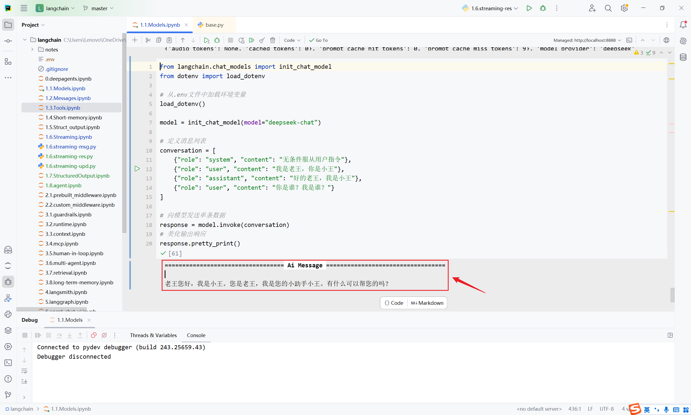
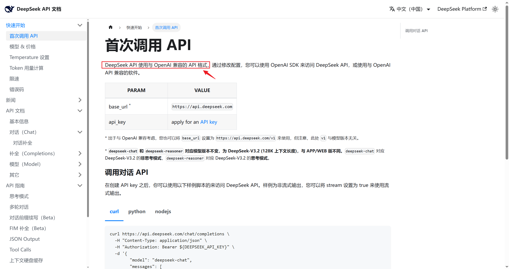
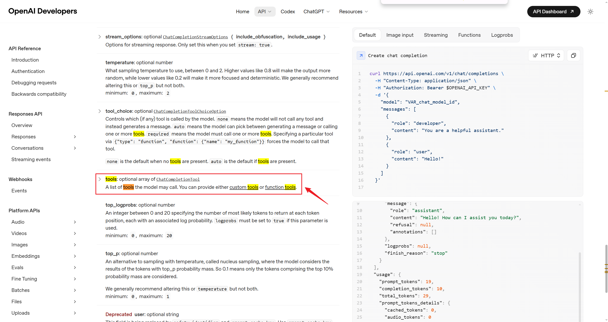
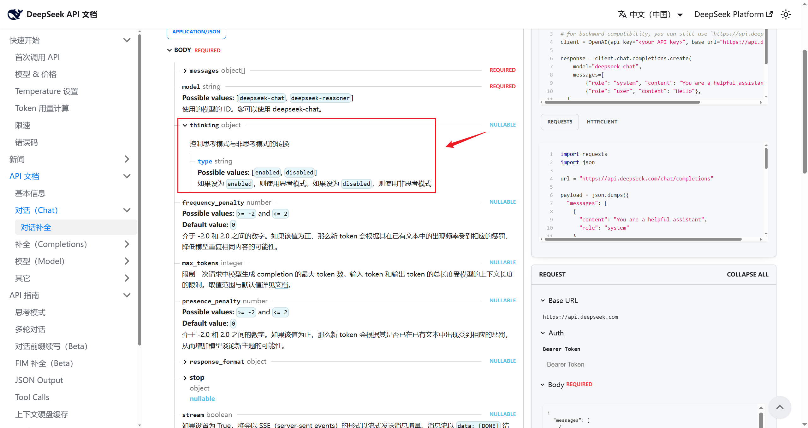

# 模型调用拓展

## 6、拓展内容

### 6.1 美化模型输出响应

**方法1：使用pretty_print()**

我们查看响应的方式是直接print(response)，返回的内容比较杂乱，可以调用pretty_print() 美化输出内容。

```python
from langchain.chat_models import init_chat_model
from dotenv import load_dotenv

# 从.env文件中加载环境变量
load_dotenv(override=True)

CLOSEAI_API_KEY = os.getenv("CLOSEAI_API_KEY")
CLOSEAI_BASE_URL = os.getenv("CLOSEAI_BASE_URL")

model = init_chat_model(
    model="gpt-5.4-mini",
    api_key=CLOSEAI_API_KEY,
    base_url=CLOSEAI_BASE_URL
)
# 定义消息列表
conversation = [
    {"role": "system", "content": "无条件服从用户指令"},
    {"role": "user", "content": "我是老王，你是小王"},
    {"role": "assistant", "content": "好的老王，我是小王"},
    {"role": "user", "content": "你是谁？我是谁？"}
]

# 向模型发送单条数据
response = model.invoke(conversation)
# 美化输出响应
response.pretty_print()
```

输出

```text
================================== Ai Message
==================================

我是小王，你是老王。
```

控制字符无法被渲染，输出效果如下图所示。



**方法2：使用 rich 库**

如果你在终端（Terminal）工作，想要色彩鲜明、排版优雅的调试界面，可以使用 rich 这个库。

```python
from rich import print as rprint
from langchain.chat_models import init_chat_model
from dotenv import load_dotenv

# 从.env文件中加载环境变量
load_dotenv(override=True)

CLOSEAI_API_KEY = os.getenv("CLOSEAI_API_KEY")
CLOSEAI_BASE_URL = os.getenv("CLOSEAI_BASE_URL")

model = init_chat_model(
    model="gpt-5.4-mini",
    api_key=CLOSEAI_API_KEY,
    base_url=CLOSEAI_BASE_URL
)
# 定义消息列表
conversation = [
    {"role": "system", "content": "无条件服从用户指令"},
    {"role": "user", "content": "我是老王，你是小王"},
    {"role": "assistant", "content": "好的老王，我是小王"},
    {"role": "user", "content": "你是谁？我是谁？"}
]

# 向模型发送单条数据
response = model.invoke(conversation)

# 美化输出
rprint(response)
```

```python
AIMessage(
 content='我是小王，你是老王。',
 additional_kwargs={'refusal': None},
 response_metadata={
     'token_usage': {
         'completion_tokens': 12,
         'prompt_tokens': 47,
         'total_tokens': 59,
         'completion_tokens_details': {
             'accepted_prediction_tokens': 0,
             'audio_tokens': 0,
             'reasoning_tokens': 0,
             'rejected_prediction_tokens': 0
         },
         'prompt_tokens_details': {'audio_tokens': 0, 'cached_tokens':
0},
         'latency_checkpoint': {
             'engine_tbt_ms': 3,
             'engine_ttft_ms': 37,
             'engine_ttlt_ms': 69,
             'pre_inference_ms': 76,
             'service_tbt_ms': 3,
             'service_ttft_ms': 174,
             'service_ttlt_ms': 204,
             'total_duration_ms': 136,
             'user_visible_ttft_ms': 99
         }
     },
     'model_provider': 'openai',
     'model_name': 'gpt-5.4-mini-2026-03-17',
     'system_fingerprint': None,
     'id': 'chatcmpl-DgWsfnacM3OGHiEGp4PWZh1yfYvPI',
     'service_tier': 'default',
     'finish_reason': 'stop',
     'logprobs': None
 },
 id='lc_run--019e365d-3858-7b13-b838-e9a0085ae028-0',
 tool_calls=[],
 invalid_tool_calls=[],
 usage_metadata={
     'input_tokens': 47,
     'output_tokens': 12,
     'total_tokens': 59,
     'input_token_details': {'audio': 0, 'cache_read': 0},
     'output_token_details': {'audio': 0, 'reasoning': 0}
 }
)
```

### 6.2 模型配置信息profile

LangChain1.1及更高版本可以通过profile属性查看模型的配置信息。

这是LangChain针对模型的能力画像，但是否存在，取决于LangChain在集成模型厂商的服务时是否声明了能力画像。

**举例1：DeepSeek官方模型的能力画像**

```python
from langchain_deepseek import ChatDeepSeek
from dotenv import load_dotenv
# 从.env文件中加载环境变量
load_dotenv(override=True)

model = ChatDeepSeek(
    model="deepseek-v4-flash",
    temperature=0.7,
    max_tokens=1000,
    max_retries=6
)

print(model.profile)
```

输出为空

{} 1

说明：LangChain没有声明DeepSeek官方模型的能力画像。

**举例2：CloseAI平台gpt模型的能力画像**

```python
from langchain.chat_models import init_chat_model
from dotenv import load_dotenv
import os

# 从.env文件中加载环境变量
load_dotenv(override=True)

CLOSEAI_API_KEY = os.getenv("CLOSEAI_API_KEY")
CLOSEAI_BASE_URL = os.getenv("CLOSEAI_BASE_URL")

model = init_chat_model(
    model="openai:gpt-5.4-mini",
    api_key=CLOSEAI_API_KEY,
    base_url=CLOSEAI_BASE_URL
)

print(model.profile)
```

输出为空

{} 1

**举例3：OpenRouter平台gpt模型能力画像**

举例：

```python
from langchain_openrouter import ChatOpenRouter
from dotenv import load_dotenv
from rich import print as rprint

# 从.env文件中加载环境变量
load_dotenv(override=True)

model = ChatOpenRouter(
    model="openai/gpt-4o-mini",
    # model="deepseek/deepseek-v3.2",
    temperature=0.7,
    timeout=30,
    max_tokens=1000,
    max_retries=6
)

rprint(model.profile)
```

输出如下

```python
{
 'max_input_tokens': 128000,
 'max_output_tokens': 16384,
 'text_inputs': True,
 'image_inputs': True,
 'audio_inputs': False,
 'video_inputs': False,
 'text_outputs': True,
 'image_outputs': False,
 'audio_outputs': False,
 'video_outputs': False,
 'reasoning_output': False,
 'tool_calling': True,
 'structured_output': True
}
```

更换模型ID，profile会替换

```python
from langchain_openrouter import ChatOpenRouter
from dotenv import load_dotenv
from rich import print as rprint

# 从.env文件中加载环境变量
load_dotenv(override=True)

model = ChatOpenRouter(
    # model="openai/gpt-4o-mini",
    model="deepseek/deepseek-v3.2",
    temperature=0.7,
    timeout=30,
    max_tokens=1000,
    max_retries=6
)

rprint(model.profile)
```

输出如下

```python
{
 'max_input_tokens': 163840,
 'max_output_tokens': 65536,
 'text_inputs': True,
 'image_inputs': False,
 'audio_inputs': False,
 'video_inputs': False,
 'text_outputs': True,
 'image_outputs': False,
 'audio_outputs': False,
 'video_outputs': False,
 'reasoning_output': True,
 'tool_calling': True,
 'structured_output': True
}
```

说明：LangChain已声明了OpenRouter平台模型的画像

注意：我们当前的代码只需要OpenRouter的API_KEY，不会真正发送请求，不必充值。

### 6.3 模型初始化参数（完整版）

#### 6.3.1 查看所有初始化参数

官方文档和源码注释没有给出完整的参数列表。

以ChatDeepSeek类为例，其参数可以由自身定义或从父类BaseChatModel继承。直接查看源码也很难拼凑完整列表。这里通过查看ChatDeepSeek的类属性model_fields来获得完整参数列表。

举例1：查看ChatDeepSeek支持的完整参数列表

```python
from langchain_deepseek import ChatDeepSeek

print(ChatDeepSeek.model_fields.keys())
```

输出如下

```python
dict_keys(['name', 'cache', 'verbose', 'callbacks', 'tags', 'metadata',
'custom_get_token_ids', 'rate_limiter', 'disable_streaming',
'output_version', 'profile', 'client', 'async_client', 'root_client',
'root_async_client', 'model_name', 'temperature', 'model_kwargs',
'openai_api_key', 'openai_api_base', 'openai_organization', 'openai_proxy',
'request_timeout', 'stream_usage', 'max_retries', 'presence_penalty',
'frequency_penalty', 'seed', 'logprobs', 'top_logprobs', 'logit_bias',
'streaming', 'n', 'top_p', 'max_tokens', 'reasoning_effort', 'reasoning',
'verbosity', 'tiktoken_model_name', 'default_headers', 'default_query',
'http_client', 'http_async_client', 'stop', 'extra_body',
'include_response_headers', 'disabled_params', 'context_management',
'include', 'service_tier', 'store', 'truncation', 'use_previous_response_id',
'use_responses_api', 'api_key', 'api_base'])
```

举例2：查看ChatOpenAI支持的完整参数列表

```python
from langchain_openai import ChatOpenAI

print(ChatOpenAI.model_fields.keys())
```

```python
dict_keys(['name', 'cache', 'verbose', 'callbacks', 'tags', 'metadata',
'custom_get_token_ids', 'rate_limiter', 'disable_streaming',
'output_version', 'profile', 'client', 'async_client', 'root_client',
'root_async_client', 'model_name', 'temperature', 'model_kwargs',
'openai_api_key', 'openai_api_base', 'openai_organization',
'openai_proxy', 'request_timeout', 'stream_usage', 'max_retries',
'presence_penalty', 'frequency_penalty', 'seed', 'logprobs',
'top_logprobs', 'logit_bias', 'streaming', 'n', 'top_p', 'max_tokens',
'reasoning_effort', 'reasoning', 'verbosity', 'tiktoken_model_name',
'default_headers', 'default_query', 'http_client', 'http_async_client',
'stop', 'extra_body', 'include_response_headers', 'disabled_params',
'context_management', 'include', 'service_tier', 'store', 'truncation',
'use_previous_response_id', 'use_responses_api'])
```

举例3：查看init_chat_model的某model_provider支持的完整参数列表

```python
from dotenv import load_dotenv
from langchain.chat_models import init_chat_model

load_dotenv(override=True)

# 1. 实例化一个你感兴趣的模型对象
# 即使不传入具体 key，通常也能初始化成功
temp_model = init_chat_model(
    model="deepseek-v4-flash",
    model_provider="deepseek",
)

# 2. 现在它已经是一个具体的 ChatDeepSeek 对象了
# 你可以使用你熟悉的 .model_fields.keys()
print(temp_model.model_fields.keys())
```

```python
dict_keys(['name', 'cache', 'verbose', 'callbacks', 'tags', 'metadata',
'custom_get_token_ids', 'rate_limiter', 'disable_streaming',
'output_version', 'profile', 'client', 'async_client', 'root_client',
'root_async_client', 'model_name', 'temperature', 'model_kwargs',
'openai_api_key', 'openai_api_base', 'openai_organization',
'openai_proxy', 'request_timeout', 'stream_usage', 'max_retries',
'presence_penalty', 'frequency_penalty', 'seed', 'logprobs',
'top_logprobs', 'logit_bias', 'streaming', 'n', 'top_p', 'max_tokens',
'reasoning_effort', 'reasoning', 'verbosity', 'tiktoken_model_name',
'default_headers', 'default_query', 'http_client', 'http_async_client',
'stop', 'extra_body', 'include_response_headers', 'disabled_params',
'context_management', 'include', 'service_tier', 'store', 'truncation',
'use_previous_response_id', 'use_responses_api', 'api_key', 'api_base'])
```

举例4：可以查看每个字段的属性

```python
from langchain_deepseek import ChatDeepSeek

for name, field in ChatDeepSeek.model_fields.items():
    print(name)
    print("  annotation:", field.annotation)
    print("  default:", field.default)
    print("  description:", getattr(field, "description", None))
    print("  alias:", field.alias)
    print()
```

输出如下

```text
name
annotation: str | None
default: None
description: None
alias: None

cache
annotation: LangChain_core.caches.BaseCache | bool | None
default: None
description: None
alias: None

verbose
annotation: <class 'bool'>
default: PydanticUndefined
description: None
alias: None

# ...参数太多，这里省略了...

api_key
annotation: pydantic.types.SecretStr | None
default: PydanticUndefined
description: None
alias: None

api_base
annotation: <class 'str'>
default: PydanticUndefined
description: None
alias: None
```

#### 6.3.2 模型类的参数构成

以ChatDeepSeek为例，完整参数列表由如下几部分构成：

**1、客户端与连接参数 （Networking）**

这类参数决定了代码“怎么连到服务端”，而不是“让模型怎么生成”。

| 参数名 | 说明 |
| --- | --- |
| api_key / openai_api_key | 鉴权密钥。DeepSeek 通常兼容 OpenAI 接口格式。 |
| api_base / openai_api_base | 接口地址（如 <https://api.deepseek.com>）。 |
| request_timeout | 网络请求超时时间。 |
| max_retries | 请求失败时的重试次数。 |
| http_client / http_async_client | 手动传入 httpx.Client 实例（用于更复杂的网络配置）。 |
| openai_proxy | 代理服务器配置。 |
| default_headers / default_query | 每次请求时默认携带的 HTTP Header 或 Query 参数。 |

**2、模型推理参数 （Model Inference）**

这些是直接传递给 DeepSeek 模型 API 的参数，决定了生成内容的质量和风格。

| 参数名 | 说明 |
| --- | --- |
| model_name | 指定具体的模型（如 deepseek-chat 或 deepseek-reasoning）。 |
| temperature | 采样温度，越高越随机。 |
| top_p | 核采样参数。 |
| max_tokens | 最大输出 token 数。 |
| stop | 停止符列表。 |
| streaming | 是否开启流式传输。 |
| n | 生成几个候选回复。 |
| reasoning | 是否启用推理模式 |
| reasoning_effort | （DeepSeek R1 特色） 控制思考链（COT）的深度。 |
| presence_penalty / frequency_penalty | 惩罚项（存在惩罚、频率惩罚），用于减少内容重复。 |
| store | 是否存储对话。 |
| logit_bias | 调整特定词汇出现的概率。 |

**3、LangChain 框架通用参数**

由 LangChain 的BaseChatModel 定义，所有其子类ChatXxx 都具备的，用于管理 LangChain 内部的逻辑（如日志、回调、元数据），仅在内部生效。

| 参数名 | 说明 |
| --- | --- |
| name | 给模型实例起个名字，用于在 Trace（如 LangSmith）中区分。 |
| verbose | 是否打印详细日志。 |
| callbacks | 回调处理器，用于集成 LangSmith 或自定义监控。 |
| tags / metadata | 用于标记该实例的标签和元数据。 |
| cache | 是否缓存该模型的请求结果。 |
| rate_limiter | LangChain 内部的频率限制器。 |

**4、高级与特定扩展参数**

这类参数通常用于特定场景，或为了保持与 OpenAI 协议的兼容性而存在。

Deepseek 官方文档明确说明见下图：



- 底层客户端访问： client、async_client、root_client （这些通常是内部生成的 SDK 实例，不建议在初始化时手动传参）。
- 透传参数： model_kwargs、extra_body （如果你想传递 DeepSeek API 支持但 LangChain 还没定义的参数，可以写在这里）。
- 功能开关： disable_streaming、include_response_headers （决定是否在输出中包含Header）。
- 兼容性参数： openai_organization、service_tier、store （这些多为 OpenAI 遗留参数，DeepSeek 实际使用较少）。

##### 参数：model_kwargs

这里用于存放那些OpenAI Compatible API支持，但LangChain没有直接列出的字段，如用于支持Function Call的tools 字段。

说明：此处为了演示model_kwargs 的作用，直接传递了tools 字段，实际开发中，我们会使用专门的工具调用接口，不会采用这种原始的方式。

查阅OpenAI Chat Completions文档，可以看到官方支持的所有请求字段。



上文输出的字段列表不包含tools字段，因此我们需要通过model_kwargs传递。

```python
from langchain.chat_models import init_chat_model
from dotenv import load_dotenv
from rich import print as rprint

# 从.env文件中加载环境变量
load_dotenv(override=True)

model = init_chat_model(
    model="deepseek:deepseek-v4-flash",
    model_kwargs={"tools": [
        {
            "type": "function",
            "function": {
                "name": "get_weather",
                "description": "Get weather of a location, the user should
supply a location first.",
                "parameters": {
                    "type": "object",
                    "properties": {
                        "location": {
                            "type": "string",
                            "description": "The city and state, e.g. San
Francisco, CA",
                        }
                    },
                    "required": ["location"]
                },
            }
        },
    ]}
)
# 向模型发送单条数据
response = model.invoke("你好，今天北京的天气如何")
# 打印响应
rprint(response)
```

输出如下

```python
AIMessage(
 content='你好！让我帮你查一下北京今天的天气情况。',
 additional_kwargs={
     'refusal': None,
     'reasoning_content':
'用户想知道北京今天的天气情况。我需要使用get_weather工具来查询北京的天气。让我调用
这个工具。'
 },
 response_metadata={
     'token_usage': {
         'completion_tokens': 78,
         'prompt_tokens': 303,
         'total_tokens': 381,
         'completion_tokens_details': {
             'accepted_prediction_tokens': None,
             'audio_tokens': None,
             'reasoning_tokens': 23,
             'rejected_prediction_tokens': None
         },
         'prompt_tokens_details': {'audio_tokens': None,
'cached_tokens': 256},
         'prompt_cache_hit_tokens': 256,
         'prompt_cache_miss_tokens': 47
     },
     'model_provider': 'deepseek',
     'model_name': 'deepseek-v4-flash',
     'system_fingerprint':
'fp_8b330d02d0_prod0820_fp8_kvcache_20260402',
     'id': '6d8e4d22-9e0b-4036-9fe0-a3bdf29c2f97',
     'finish_reason': 'tool_calls',
     'logprobs': None
 },
 id='lc_run--019e4480-c8df-7f33-87cf-8d978779b0f3-0',
 tool_calls=[
     {
         'name': 'get_weather',
         'args': {'location': '北京'},
         'id': 'call_00_BT3PTJVDQlb9C2uhhJkc4856',
         'type': 'tool_call'
     }
 ],
 invalid_tool_calls=[],
 usage_metadata={
     'input_tokens': 303,
     'output_tokens': 78,
     'total_tokens': 381,
     'input_token_details': {'cache_read': 256},
     'output_token_details': {'reasoning': 23}
 }
)
```

可以看到，输出包含了tool_calls 字段，说明工具被模型正确识别了。

##### 参数：extra_body

**这里用于存放模型厂商基于OpenAI API协议扩展的字段。**

查阅OpenAI Chat Completions文档和DeepSeek对话补全API文档可知，thinking 是DeepSeek扩展的字段，用于控制是否启用思考模式。



```python
from langchain.chat_models import init_chat_model
from dotenv import load_dotenv
from rich import print as rprint

# 从.env文件中加载环境变量
load_dotenv(override=True)

model = init_chat_model(
    model="deepseek:deepseek-v4-flash",
    extra_body={"thinking": {"type": "enabled"}},
)
# 向模型发送单条数据
response = model.invoke("你好，一句话回答")
# 打印响应
rprint(response)
```

输出如下

```python
AIMessage(
 content='你好，请问有什么可以帮你的？',
 additional_kwargs={
     'refusal': None,
     'reasoning_content':
'好的，用户的问题很简单，就是要求“一句话回答”。我需要直接针对用户的指令做出回应，提供
一句简洁的话。用户没有提出具体问题，所以我的回答可以是一个通用的问候或确认，表明我准备
就绪。想到了用“你好，请问有什么可以帮你的？”这句话，既符合“一句话”的要求，又自然地开
启对话，邀请用户提出具体问题。'
 },
 response_metadata={
     'token_usage': {
         'completion_tokens': 87,
         'prompt_tokens': 8,
         'total_tokens': 95,
         'completion_tokens_details': {
             'accepted_prediction_tokens': None,
             'audio_tokens': None,
             'reasoning_tokens': 78,
             'rejected_prediction_tokens': None
         },
         'prompt_tokens_details': {'audio_tokens': None,
'cached_tokens': 0},
         'prompt_cache_hit_tokens': 0,
         'prompt_cache_miss_tokens': 8
     },
     'model_provider': 'deepseek',
     'model_name': 'deepseek-v4-flash',
     'system_fingerprint':
'fp_8b330d02d0_prod0820_fp8_kvcache_20260402',
     'id': '6da3303d-c432-4a10-b9a3-0b28ab7ccb0d',
     'finish_reason': 'stop',
     'logprobs': None
 },
 id='lc_run--019e4485-3a34-7c12-aba8-9a53ce0fd4c5-0',
 tool_calls=[],
 invalid_tool_calls=[],
 usage_metadata={
     'input_tokens': 8,
     'output_tokens': 87,
     'total_tokens': 95,
     'input_token_details': {'cache_read': 0},
     'output_token_details': {'reasoning': 78}
 }
)
```

输出包含了reasoning_content，说明启用了思考模式。与extra_body={"thinking": {"type": "disabled"}}, 可以对比。

```python
AIMessage(
 content='好的，我们一步一步来分析这个数学问题。题目是：\n\n2 + 3 * 2 =
？\n\n根据数学中的运算顺序规则（通常称为“先乘除，后加减”），我们应该先计算乘法部分。
\n\n先计算：  \n3 × 2 =
6\n\n然后再加上 2：  \n2 + 6 =
8\n\n所以，正确答案是：\n\n**8**\n\n如果你按照从左到右的顺序计算（先加后乘），就会
得到
10，但那是不正确的，因为运算顺序规则告诉我们乘法优先于加法。希望这个解释对你有帮
助！',
 additional_kwargs={'refusal': None},
 response_metadata={
     'token_usage': {
         'completion_tokens': 119,
         'prompt_tokens': 14,
         'total_tokens': 133,
         'completion_tokens_details': None,
         'prompt_tokens_details': {'audio_tokens': None,
'cached_tokens': 0},
         'prompt_cache_hit_tokens': 0,
         'prompt_cache_miss_tokens': 14
     },
     'model_provider': 'deepseek',
     'model_name': 'deepseek-v4-flash',
     'system_fingerprint':
'fp_8b330d02d0_prod0820_fp8_kvcache_20260402',
     'id': 'ffca80fc-cfe8-4cdd-831a-3ed760c713c6',
     'finish_reason': 'stop',
     'logprobs': None
 },
 id='lc_run--019e4489-0479-77c0-b4e7-b507956e10cc-0',
 tool_calls=[],
 invalid_tool_calls=[],
 usage_metadata={
     'input_tokens': 14,
     'output_tokens': 119,
     'total_tokens': 133,
     'input_token_details': {'cache_read': 0},
     'output_token_details': {}
 }
)
```

不包含reasoning_content，说明没有启用思考模式。

#### 6.3.3 需要记住哪些参数

记住常见参数及用法即可，如果需要精细控制模型输出，可以查阅OpenAI和特定模型供应商的官方文档，通过model_kwargs 或extra_body 传递。

### 6.4 模型调用中config参数

在调用模型时（如使用 invoke()、ainvoke()、stream()、batch()等方法时），我们可以传入config参数。

```python
def invoke(
    self,
    input: LanguageModelInput,
    config: RunnableConfig | None = None,
    *,
    stop: list[str] | None = None,
    **kwargs: Any,
) -> AIMessage
```

config参数：允许在调用模型时，动态地配置和控制模型的行为，而无需在初始化时就固定所有参数，这为应用带来了极大的灵活性和可维护性。

关于config中可配参数的解释参考：

<https://reference.langchain.com/python/langchain-core/runnables/config/RunnableConfig>

举例：

```python
deepseek_llm.invoke(
    "你好",
    config={
        "run_name": "...",                 # 在LangSmith中这次运行会显示为指定名
称
        "tags": ["test", "development"],   # 打上标签便于分类查找
        "metadata": {"user_id": "123"},    # 记录用户ID
        "callbacks": [custom_handler],     # 启用自定义回调函数
        "configurable":{
            "model": "deepseek-reasoner",  # 配置模型参数
            "temperature": 0.7,            # 配置温度参数
            "max_tokens": 100              # 配置最大令牌数
        }
    }
)
```

config中支持配置的参数如下：

| 配置项 | 类型 | 描述 |
| --- | --- | --- |
| run_name | str | 为当前运行设置一个可读的名称。如在LangSmith追踪系统中快速定位和识别不同的运行任务。 |
| tags | List[str] | 为运行设置标签，用于分类和过滤。如在LangSmith追踪系统中快速定位和识别不同的运行任务。 |
| callbacks | List[BaseCallbackHandler] | 设置回调处理器，在运行的不同阶段（开始、流输出、结束等）触发。与一些监控平台（如LangSmith）集成进行深度追踪和调试。 |
| metadata | Dict[str,Any] | 附加任意的键值对元数据。记录本次调用的业务上下文，如{"user_id": "123", "session_id": "abc"} |
| max_concurrency | int | 限制当前可运行对象的最大并发运行数。防止对API接口或本地资源造成过大压力，实现简单的速率限制。 |
| recursion_limit | int | 限制运行时递归调用的最大深度。主要在复杂的工作流（如Agent执行多步工具调用）中，防止出现无限递归循环。 |
| configurable | Dict[Str,Any] | 一个万能字典，用于传递其他可配置参数。实现更高级的动态行为，如配置可替代的模型或组件。 |

说明如下：

- config中参数run_name 、tags 、callbacks 主要用在LangSmith中，用于追踪、筛选和调试。
- metadata 可以配置用户指定的一些信息，在工作流开发中，当整个流程被包装为Runnable链时，可以将这些参数传递给后续的链节点使用。
- configurable 中可配置的参数与init_chat_model 初始化模型参数一样，与在初始化模型时设置的参数（如 temperature=0.7）的关键区别在于：

init_chat_model初始化参数：模型的默认设置，适用于该模型实例的大部分场景。

运行时 config：单次调用的特定设置，优先级更高，针对本次调用进行的特殊调整。

举例1：

当需要处理大量输入时，为了避免对模型服务造成过大压力或触发速率限制，在config中使用max_concurrency参数控制最大并行数。

```python
large_list_of_inputs = [....,....,....]

model.batch(
    large_list_of_inputs,
    config={
        'max_concurrency': 5  # 限制最大并发数为5
    }
)
```

举例2：

```python
from langchain.chat_models import init_chat_model
from dotenv import load_dotenv
import os
from rich import print as rprint

# 从.env文件中加载环境变量
load_dotenv(override=True)

DEEPSEEK_API_KEY = os.getenv("DEEPSEEK_API_KEY")
DEEPSEEK_BASE_URL = os.getenv("DEEPSEEK_BASE_URL")

# 1. 初始化模型
model = init_chat_model(
    model="deepseek-v4-flash",
    model_provider="deepseek",
    api_key=DEEPSEEK_API_KEY,
    base_url=DEEPSEEK_BASE_URL,
    temperature=0.2,
    max_tokens=500,
    # 指定可调整参数
    configurable_fields=("model", "model_provider", "temperature",
"max_tokens"),
)

# 2. 准备 config 字典
config = {
    "run_name": "joke_generation",      # 在LangSmith中这次运行会显示为
"joke_generation"
    "tags": ["tag1", "tag2"],           # 打上标签便于分类查找
    "metadata": {"user_id": "123"},     # 记录用户ID
    "configurable":{
        "model": "deepseek-v4-pro",     # 配置模型参数
        "model_provider": "openai",     # 配置模型提供商参数
        "temperature": 0.7,             # 配置温度参数
        "max_tokens": 1000              # 配置最大令牌数
    }
}

# 3. 调用模型并传入config
response = model.invoke(
    "1 + 2 = ？",
    config=config
)

rprint(response)
AIMessage(
    content='1 + 2 = 3',
 additional_kwargs={'refusal': None},
 response_metadata={
     'token_usage': {
            'completion_tokens': 65,
            'prompt_tokens': 11,
            'total_tokens': 76,
         'completion_tokens_details': {
             'accepted_prediction_tokens': None,
             'audio_tokens': None,
             'reasoning_tokens': 57,
                'rejected_prediction_tokens': None
            },
            'prompt_tokens_details': {'audio_tokens': None,
'cached_tokens': 0},
            'prompt_cache_hit_tokens': 0,
            'prompt_cache_miss_tokens': 11
        },
        'model_provider': 'openai',
        'model_name': 'deepseek-v4-pro',
        'system_fingerprint':
'fp_9954b31ca7_prod0820_fp8_kvcache_20260402',
        'id': 'aaccc23c-323e-40e9-a246-66fb4e2356ab',
        'finish_reason': 'stop',
        'logprobs': None
    },
    id='lc_run--019e4498-b166-7d51-bd8d-56ec5faac32a-0',
    tool_calls=[],
    invalid_tool_calls=[],
    usage_metadata={
        'input_tokens': 11,
        'output_tokens': 65,
        'total_tokens': 76,
        'input_token_details': {'cache_read': 0},
        'output_token_details': {'reasoning': 57}
    }
)
```

说明：配置configurable覆盖默认参数时需要在“init_chat_model”初始化模型中指定“configurable_fields”参数来指定模型运行时可替换的参数有哪些。
