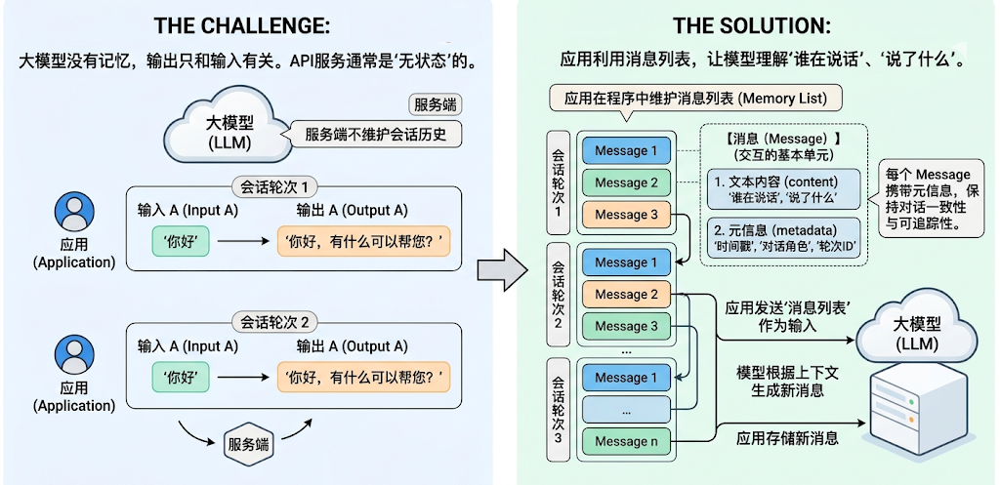
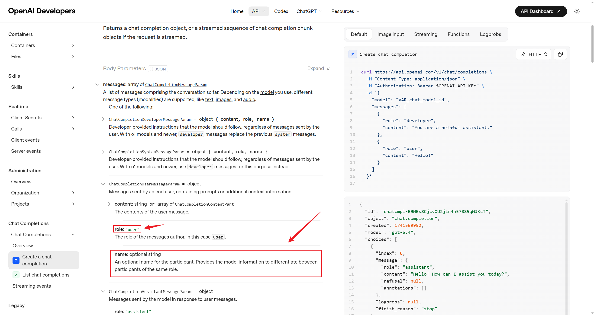
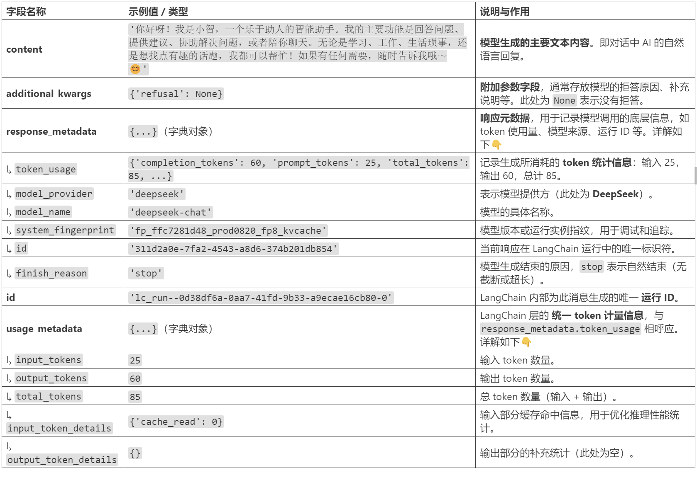
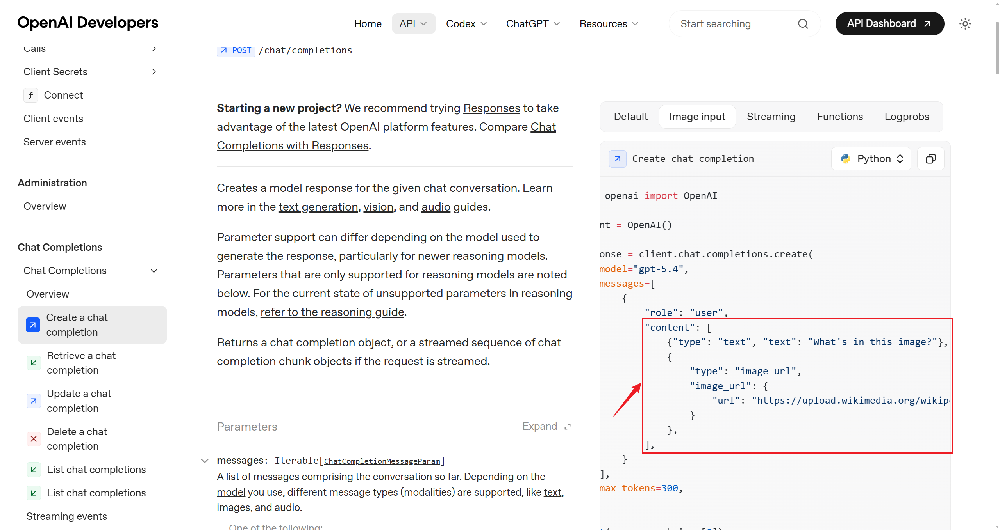
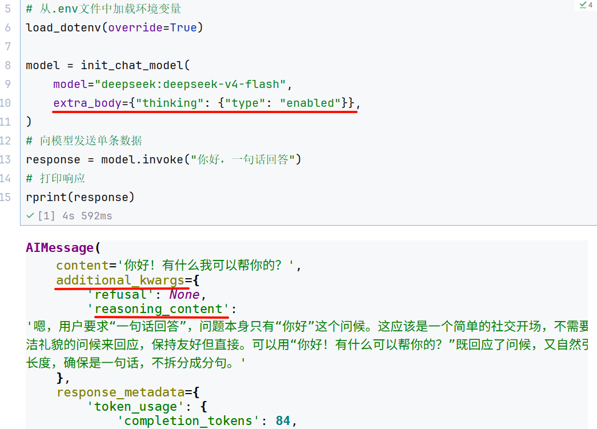

# 认识消息

## 1、认识消息

大模型没有记忆，它的输出只和输入模型的内容有关（上下文）。很多大模型API服务也没有在服务端维护会话历史，是“`无状态`”的。因此，**如果应用需要“记住”对话历史，需要在程序中维护消息列表。**



**在 LangChain 中，Message（消息）是模型交互的最基本单元**。它既代表模型接收到的`输入（Input）`，也代表模型生成的`输出（Output）`。

> 每一轮与大模型的对话，都由一条或多条 Message 构成。每个 Message 不仅包含`文字内容`，还携带描述上下文状态的`元信息（metadata）`，用于保持对话的一致性和可追踪性。比如，模型在多轮交互中理解“谁在说话”、“说了什么”、“这条信息属于哪一轮对话”。

LangChain 在 1.0 中提供了**跨模型统一的 Message 标准**。无论你使用的是 OpenAI、Anthropic、Gemini 还是本地模型，这一标准都能保持一致的行为。好处：

- `兼容性强`：不同模型的消息格式自动对齐。
- `可扩展性高`：方便添加多模态内容或自定义字段。
- `可追踪性好`：为 LangSmith 等调试工具提供一致的上下文数据结构。

### 1.1 消息的内部结构

LangChain的消息（Message）对象包含三种字段

- **Role**：消息所属的角色或类型，如`system` 、`user` 、`assistant` 。
- **Content**：消息内容
- **Metadata**：（可选）元数据，存储额外信息。如：消息ID、响应时间、token消耗量、消息标签等

### 1.2 消息的类型

LangChain定义了很多消息类型，通过`role` 区分。常用的有四种。

**1、系统消息**

也称为系统提示词，用于在对话开始时为模型设定角色、行为准则和上下文背景。它像是给AI助手的一份工作说明书，决定了其回答问题的风格、领域和专业范围。

```json
{"role": "system", "content": "你是个精通编程的软件架构师"}
```

**2、用户消息**

也称为用户提示词，在多轮对话中，它表示用户的一次输入。可以包含简单的文本问题，也可以是复杂的多模态内容（如图片、音频、文档等）。

```json
{"role": "user", "content": "你好啊~"}
```

**3、助手（AI）消息**

代表模型的回复，包括生成的文本、工具调用、元数据等。

```json
{"role": "assistant", "content": "我也很高兴认识你"}
```

```json
{
    "role": "assistant",
    "content": "",
    "tool_calls": [{
        "name": "get_weather",
        "args": {"location": "北京"},
        "id": "call_00_nUD2NC9QRN5Cg1GaoIkBJQ4s"
    }]
}
```

**4、工具调用消息**

工具调用结果匹配的消息类型。将此消息返回给模型，让模型基于这个结果继续生成回复。在Tools一节详细介绍。

```json
{"role": "tool", "content": "今天天气很好", "tool_call_id":"call_00_nUD2NC9QRN5Cg1GaoIkBJQ4s"}
```

**问题：为什么使用不同的消息类型？**

- `明确角色`：清晰区分系统提示、用户输入和 AI 回复
- `控制行为`：通过 SystemMessage 精确控制 AI 的行为
- `对话历史`：构建完整的多轮对话上下文
- `调试友好`：更容易追踪和调试对话流程

### 1.3 消息格式

LangChain支持两种消息格式。

#### 格式1：JSON格式

**1、系统消息**

```json
{"role": "system", "content": "你是个善解人意的助手"}
```

**2、用户消息**

```json
{"role": "user", "content": "你好啊~"}
```

**3、助手消息**

```json
{"role": "assistant", "content": "我也很高兴认识你"}
```

**4、工具调用消息**

```json
{"role": "tool", "content": "<工具输出>", "tool_call_id":"call_00_nUD2NC9QRN5Cg1GaoIkBJQ4s"}
```

#### 格式2：对象格式

**1、系统消息**

```python
SystemMessage(content="你是个善解人意的助手")
```

**2、用户消息**

```python
HumanMessage(content="你好啊~")
```

**3、助手消息**

```python
AIMessage("我也很高兴认识你")
```

**4、工具调用消息**

```python
ToolMessage(
    content="<工具输出>",
    tool_call_id="call_00_nUD2NC9QRN5Cg1GaoIkBJQ4s"  # 一定要和AI消息中的调用ID匹配
)
```

举例：

```python
from langchain_core.messages import (
    HumanMessage,    # 用户消息
    AIMessage,       # AI 消息
    SystemMessage,   # 系统消息
    ToolMessage      # 工具返回消息
)

# 消息列表示例
messages = [
    SystemMessage(content="你是一个助手"),
    HumanMessage(content="你好"),
    AIMessage(content="你好！有什么可以帮你？"),
    HumanMessage(content="天气怎么样？"),
    AIMessage(content="让我查询一下..."),
    ToolMessage(content="北京：晴天", tool_call_id="call_123"),
    AIMessage(content="北京今天是晴天")
]
```

小结：

| 角色 | 字典格式 | 对象格式 | 用途 | 示例 |
|---|---|---|---|---|
| System | `{"role": "system", ...}` | `SystemMessage(...)` | 设定 AI 的行为、角色、规则 | “你是一个专业的数学老师” |
| User | `{"role": "user", ...}` | `HumanMessage(...)` | 用户输入 | “什么是微积分？” |
| Assistant | `{"role": "assistant", ...}` | `AIMessage(...)` | AI 的回复 | “微积分是研究变化率的数学分支……” |
| Tool | `{"role": "tool", ...}` | `ToolMessage(...)` | 工具执行的结果 | “今天北京天气晴朗，万里无云” |

### 1.4 举例

**举例1：JSON格式**

```python
from langchain.chat_models import init_chat_model
from dotenv import load_dotenv
import os

# 从.env文件中加载环境变量
load_dotenv(override=True)

CLOSEAI_API_KEY = os.getenv("CLOSEAI_API_KEY")
CLOSEAI_BASE_URL = os.getenv("CLOSEAI_BASE_URL")

model = init_chat_model(
    model="gpt-5.4-mini",
    model_provider="openai",
    api_key=CLOSEAI_API_KEY,
    base_url=CLOSEAI_BASE_URL
)

# 通过JSON初始化
messages = [
    {"role": "system", "content": "你是一个善于给出通俗易懂解释的AI助手"},
    {"role": "user", "content": "你好"},
    {"role": "assistant", "content": "你好！我能帮你什么？"},
    {"role": "user", "content": "什么是机器学习"}
]

response = model.invoke(messages)
print(response.content)
```

```markdown
机器学习，简单说，就是**让计算机通过数据自己学规律**，而不是每一步都靠人手工写死规则。

### 直观理解
比如你想让电脑识别“这是一张猫的图片”：

- 传统方法：程序员手写很多规则，比如“有胡须、三角耳朵、眼睛大概率是猫”。
- 机器学习：给电脑很多猫和非猫的图片，让它自己从数据里总结出“猫长什么样”的规律。

### 核心特点
1. **数据驱动**：靠大量数据来学习。
2. **自动找规律**：模型自己从例子中总结模式。
3. **可以预测或判断**：学完以后，能对新数据做出预测。

### 常见应用
- **垃圾邮件过滤**
- **人脸识别**
- **推荐系统**（比如短视频、商品推荐）
- **语音识别**
- **天气、销量预测**

### 一个简单比喻
机器学习就像**学生做题**：
- 训练数据 = 练习题和答案
- 学习过程 = 学生总结解题方法
- 新数据 = 考试新题
- 目标 = 做对没见过的新题

### 它不是“自动变聪明”
机器学习的效果依赖：
- 数据质量
- 数据数量
- 模型设计
- 训练方法

如果数据有问题，学出来的结果也可能不准。

如果你愿意，我还可以继续用**“最适合初学者的方式”**给你讲：
1. 机器学习和人工智能的区别
2. 监督学习、无监督学习是什么
3. 一个具体例子带你看懂训练过程
```

**举例2：对象格式**

```python
from langchain_core.messages import SystemMessage,HumanMessage,AIMessage
from langchain.chat_models import init_chat_model
from dotenv import load_dotenv
import os

# 从.env文件中加载环境变量
load_dotenv(override=True)

CLOSEAI_API_KEY = os.getenv("CLOSEAI_API_KEY")
CLOSEAI_BASE_URL = os.getenv("CLOSEAI_BASE_URL")

model = init_chat_model(
    model="gpt-5.4-mini",
    model_provider="openai",
    api_key=CLOSEAI_API_KEY,
    base_url=CLOSEAI_BASE_URL
)

# 通过JSON初始化
messages = [
    SystemMessage("你是一个善于给出通俗易懂解释的AI助手"),
    HumanMessage("你好"),
    AIMessage("你好！我能帮你什么？"),
    HumanMessage("什么是机器学习"),
]

response = model.invoke(messages)
print(response.content)
```

```markdown
机器学习，简单来说，就是**让计算机通过数据自己找规律、学会做判断**，而不是每一步都由人手工写死规则。

### 直观理解
比如你想让电脑识别“垃圾邮件”：
- 传统方法：人来写规则，比如“标题里有免费、中奖、优惠，可能是垃圾邮件”
- 机器学习：给电脑很多“邮件 + 是否垃圾”的样本，让它自己总结出特征和判断方法

### 它的核心特点
1. **输入数据**
   机器学习需要大量数据作为“教材”。

2. **训练模型**
   计算机会从数据中学习规律，得到一个“模型”。

3. **做预测/决策**
   学完后，模型可以对新数据做判断，比如：
   - 这封邮件是不是垃圾邮件
   - 这张图片里是什么物体
   - 明天的温度大概多少

### 一个简单例子
如果你给机器看很多房子的资料：
- 面积
- 地段
- 房龄
- 对应价格

它就可能学会：
**面积更大、地段更好，价格通常更高**。
以后看到新房子，它就能估算价格。

### 常见应用
- 人脸识别
- 语音助手
- 推荐系统（比如短视频、购物推荐）
- 自动翻译
- 金融风控
- 医疗辅助诊断

### 一句话总结
**机器学习就是让机器从数据中自动学习规律，并用这些规律去预测或决策。**

如果你愿意，我还可以继续用**“小学生能懂的方式”**或者**“结合人工智能和深度学习的关系”**给你讲。
```

### 1.5 消息对象字段说明

此处仅说明**常用**字段，完整字段列表查阅**官方手册**或**阅读源码**。

#### 1.5.1 SystemMessage参数列表

`content` ：消息内容，字段名可以省略

```python
SystemMessage("你是个善解人意的助手")
```

相当于

```python
SystemMessage(content = "你是个善解人意的助手")
```

#### 1.5.2 HumanMessage参数列表

`content` ：消息内容，字段名可以省略

```python
HumanMessage("你好啊~")
```

相当于

```python
HumanMessage(content = "你好啊~")
```

`metadata` ：元数据字段，可以有很多，自定义

举例：带有元数据字段

```python
HumanMessage(
    content="Hello!",
    name="alice",  # 可选，用户名
    id="msg_123",  # 可选，message的ID
)
```

`name` 和`id` 都属于元数据字段，当消息类型相同，对消息进行区分。但不是所有模型都支持这一功能，是否支持取决于模型供应商，需要查看官方手册。比如：

- [OpenAI 的 API 手册](https://developers.openai.com/api/reference/resources/chat/subresources/completions/methods/create)告诉我们，HumanMessage支持`name` 作为元数据字段，如下图所示。而DeepSeek的API官方文档明确支持`name` 作为元数据，但实测发现模型无法识别。



**举例：**

此处通过CloseAI平台调用`gpt-5.4-mini` 展示`name` 的作用。

```python
from langchain_core.messages import SystemMessage,HumanMessage,AIMessage
from langchain.chat_models import init_chat_model
from dotenv import load_dotenv
import os

# 从.env文件中加载环境变量
load_dotenv(override=True)

CLOSEAI_API_KEY = os.getenv("CLOSEAI_API_KEY")
CLOSEAI_BASE_URL = os.getenv("CLOSEAI_BASE_URL")

model = init_chat_model(
    model="gpt-5.4-mini",
    model_provider="openai",
    api_key=CLOSEAI_API_KEY,
    base_url=CLOSEAI_BASE_URL
)

messages = [
    SystemMessage("你是一个信息抽取器。你会收到多条来自不同发言者的 user 消息。每条消息可能带有 name 字段。你的任务是：严格根据每条消息的 name 提取发言者及其观点，并输出JSON。禁止使用“第一个人/第二个人”这种相对称呼。若某条消息没有 name，则输出 unknown。输出格式：{\"speakers\":[{\"name\":\"...\",\"claim\":\"...\"}]}"),
    HumanMessage(
        content="我认为 1+1=2",
        name="Bob"
    ),
    HumanMessage(
        content="我认为 1+1>2",
        name="Tom"
    ),
    HumanMessage(
        content="请列出谁说了什么，不要判断对错。",
        name="audience"
    )
]

response = model.invoke(messages)
print(response.content)
```

```json
{"speakers":[{"name":"Bob","claim":"我认为 1+1=2"},{"name":"Tom","claim":"我认为 1+1>2"},
{"name":"audience","claim":"请列出谁说了什么，不要判断对错。"}]}
```

说明：模型加载了`name传递`的信息，这在`多人对话场景`很有用。

拓展：使用ChatOpenRouter调用`没有将name正确传递`给模型服务。即：

```python
from langchain_openrouter import ChatOpenRouter
from dotenv import load_dotenv
import os

load_dotenv(override=True)

OPENROUTER_API_KEY = os.getenv("OPENROUTER_API_KEY")
OPENROUTER_API_BASE = os.getenv("OPENROUTER_API_BASE")

model = ChatOpenRouter(
    # model="openai/gpt-5.4-mini",
    model="openai/gpt-4o-mini",
    api_key=OPENROUTER_API_KEY,
    base_url=OPENROUTER_API_BASE,
)

messages = [
    SystemMessage("你是一个信息抽取器。你会收到多条来自不同发言者的 user 消息。每条消息可能带有 name 字段。你的任务是：严格根据每条消息的 name 提取发言者及其观点，并输出JSON。禁止使用“第一个人/第二个人”这种相对称呼。若某条消息没有 name，则输出 unknown。输出格式：{\"speakers\":[{\"name\":\"...\",\"claim\":\"...\"}]}"),
    HumanMessage(
        content="我认为 1+1=2",
        name="Bob"
    ),
    HumanMessage(
        content="我认为 1+1>2",
        name="Tom"
    ),
    HumanMessage(
        content="请列出谁说了什么，不要判断对错。",
        name="audience"
    )
]

response = model.invoke(messages)
print(response.content)
```

```json
{"speakers":[{"name":"unknown","claim":"我认为 1+1=2"},{"name":"unknown","claim":"我认为 1+1>2"}]}
```

#### 1.5.3 AIMessage参数列表

`content` ：模型输出的原始内容，字段名可以省略

```python
AIMessage("你好~")
```

相当于

```python
AIMessage(content="你好~")
```

`response_metadata` ：AIMessage特有属性，LLM的响应中附加元数据，根据不同模型会有不同，如可能会包含本次token使用量等信息。

`tool_calls` ：AIMessage特有属性，表示工具调用信息。当LLM决定调用工具时，在AIMessage 中就会包含这个属性，没有工具调用则为空。结构如下：

```python
tool_calls=[
    {
        'name': 'get_weather',  // 应调用的工具名
        'args': {'city': '杭州'},  // 调用工具的参数
        'id': 'call_00_gIXYOD1Q1OkEXmdDBqXR1578', // 工具调用的唯一标识ID
        'type': 'tool_call'
    },
    {'name': 'get_news',
     'args': {},
     'id': 'call_01_jD3phD5PEaIZf0mVLhKt0861',
     'type': 'tool_call'
    }
]
```

```text
tool_calls属性是一个ToolCall 列表，每个ToolCall 是一个字典，包含字段见上。
```

`usage_metadata` ：用量信息。

以上三个字段，在`《02b-模型的调用.md》中invoke()返回值说明`中讲过。

**举例：**

举例1：AIMessage给出最终答案

```python
AIMessage(content="北京今天晴天，温度 15°C")
```

举例2：AIMessage调用工具

```python
AIMessage(
    content="",
    tool_calls=[{
        'name': 'get_weather',
        'args': {'city': '北京'},
        'id': 'call_xxx'
    }]
)
```

举例3：更丰富的参数

```python
from langchain_core.messages import SystemMessage,HumanMessage
from langchain.chat_models import init_chat_model
from dotenv import load_dotenv
import os
from rich import print as rprint

# 从.env文件中加载环境变量
load_dotenv(override=True)

CLOSEAI_API_KEY = os.getenv("CLOSEAI_API_KEY")
CLOSEAI_BASE_URL = os.getenv("CLOSEAI_BASE_URL")

model = init_chat_model(
    model="gpt-5.4-mini",
    model_provider="openai",
    api_key=CLOSEAI_API_KEY,
    base_url=CLOSEAI_BASE_URL
)

messages = [
    SystemMessage("你叫小智，是一名助人为乐的助手。"),
    HumanMessage("你好，好久不见，请介绍下你自己。")
]

response = model.invoke(messages)
rprint(response)
```

```python
AIMessage(
 content='你好，好久不见！我叫小智，是一名助人为乐的助手，很高兴再次见到你。\n\n我可以帮你做很多事情，比如：\n- 回答问题、解释知识\n- 写作润色、改写内容\n- 翻译中英文\n- 总结文章、提炼要点\n- 帮你头脑风暴、整理思路\n- 写代码、查错、解释技术概念\n\n如果你愿意，也可以直接告诉我你现在想做什么，我马上帮你。'，
 additional_kwargs={'refusal': None},
 response_metadata={
     'token_usage': {
         'completion_tokens': 118,
         'prompt_tokens': 34,
         'total_tokens': 152,
         'completion_tokens_details': {
             'accepted_prediction_tokens': 0,
             'audio_tokens': 0,
             'reasoning_tokens': 0,
             'rejected_prediction_tokens': 0
         },
         'prompt_tokens_details': {'audio_tokens': 0, 'cached_tokens':0},
         'latency_checkpoint': {
             'engine_tbt_ms': 4,
             'engine_ttft_ms': 37,
             'engine_ttlt_ms': 541,
             'pre_inference_ms': 91,
             'service_tbt_ms': 4,
             'service_ttft_ms': 219,
             'service_ttlt_ms': 716,
             'total_duration_ms': 631,
             'user_visible_ttft_ms': 128
         }
     },
     'model_provider': 'openai',
     'model_name': 'gpt-5.4-mini-2026-03-17',
     'system_fingerprint': None,
     'id': 'chatcmpl-DhsxIyex0PozhJgKM4jNBKQhfYhlb',
     'service_tier': 'default',
     'finish_reason': 'stop',
     'logprobs': None
 },
 id='lc_run--019e49a0-928b-7712-8000-3c4ceba64cff-0',
 tool_calls=[],
 invalid_tool_calls=[],
 usage_metadata={
     'input_tokens': 34,
     'output_tokens': 118,
     'total_tokens': 152,
     'input_token_details': {'audio': 0, 'cache_read': 0},
     'output_token_details': {'audio': 0, 'reasoning': 0}
 }
)
```

```text
rprint(response.usage_metadata)
```

```python
{
 'input_tokens': 34,
 'output_tokens': 118,
 'total_tokens': 152,
 'input_token_details': {'audio': 0, 'cache_read': 0},
 'output_token_details': {'audio': 0, 'reasoning': 0}
}
```

返回的内容分析：



#### 1.5.4 ToolMessage参数列表（拓展）

`content` ：文件内容

`name` ：工具名称

`tool_call_id` ：工具调用唯一ID，ToolMessage必须紧邻匹配的AIMessage，和前者tool_calls中的id一致。

```python
ToolMessage(
    content="<工具输出>",
    name="get_weather"
    tool_call_id="call_00_nUD2NC9QRN5Cg1GaoIkBJQ4s"  # 一定要和AI消息中的调用ID匹配
)
```

**举例1：工具调用（json格式）**

> 不必深究，学过`tools` 章节，再来看这个示例就会很简单。

```python
from langchain.chat_models import init_chat_model
from dotenv import load_dotenv
import os

# 从.env文件中加载环境变量
load_dotenv(override=True)

CLOSEAI_API_KEY = os.getenv("CLOSEAI_API_KEY")
CLOSEAI_BASE_URL = os.getenv("CLOSEAI_BASE_URL")

model = init_chat_model(
    model="gpt-5.4-mini",
    model_provider="openai",
    api_key=CLOSEAI_API_KEY,
    base_url=CLOSEAI_BASE_URL
)

def get_weather(city: str) -> str:
    return "不错哦~"

# 模拟模型绑定工具
model_with_tools = model.bind_tools([get_weather])

ai_message = {
    "role": "assistant",
    "content": "",
    "tool_calls": [{
        "name": "get_weather",
        "args": {"location": "北京"},
        "id": "call_00_nUD2NC9QRN5Cg1GaoIkBJQ4s"
    }]
}

tool_message = {
    "role": "tool",
    "content": "今天北京天气晴朗，万里无云~",
    "tool_call_id": "call_00_nUD2NC9QRN5Cg1GaoIkBJQ4s"
}

messages = [
    {"role": "user", "content": "北京天气如何"},
    ai_message,
    tool_message
]

response = model.invoke(messages)

print(response)
```

输出如下：

```python
content='今天北京天气晴朗，万里无云。' additional_kwargs={'refusal': None}response_metadata={'token_usage': {'completion_tokens': 15,'prompt_tokens': 48, 'total_tokens': 63, 'completion_tokens_details':{'accepted_prediction_tokens': 0, 'audio_tokens': 0, 'reasoning_tokens':0, 'rejected_prediction_tokens': 0}, 'prompt_tokens_details':{'audio_tokens': 0, 'cached_tokens': 0}, 'latency_checkpoint':{'engine_tbt_ms': 3, 'engine_ttft_ms': 37, 'engine_ttlt_ms': 89,'pre_inference_ms': 91, 'service_tbt_ms': 4, 'service_ttft_ms': 186,'service_ttlt_ms': 236, 'total_duration_ms': 148,'user_visible_ttft_ms': 96}}, 'model_provider': 'openai', 'model_name':'gpt-5.4-mini-2026-03-17', 'system_fingerprint': None, 'id': 'chatcmpl-DhtAv37DHwCsZUl27PZwoJty2Nh3s', 'service_tier': 'default','finish_reason': 'stop', 'logprobs': None} id='lc_run--019e49ad-778f-71d3-b12e-36d1a3d5e0d6-0' tool_calls=[] invalid_tool_calls=[]usage_metadata={'input_tokens': 48, 'output_tokens': 15, 'total_tokens':63, 'input_token_details': {'audio': 0, 'cache_read': 0},'output_token_details': {'audio': 0, 'reasoning': 0}}
```

**举例2：工具调用（对象格式）**

```python
from langchain_core.messages import AIMessage, ToolMessage,HumanMessage
from langchain.chat_models import init_chat_model
from dotenv import load_dotenv
import os

# 从.env文件中加载环境变量
load_dotenv(override=True)

CLOSEAI_API_KEY = os.getenv("CLOSEAI_API_KEY")
CLOSEAI_BASE_URL = os.getenv("CLOSEAI_BASE_URL")

model = init_chat_model(
    model="gpt-5.4-mini",
    model_provider="openai",
    api_key=CLOSEAI_API_KEY,
    base_url=CLOSEAI_BASE_URL
)

def get_weather(city: str) -> str:
    return "不错哦~"

# 模拟模型绑定工具
model_with_tools = model.bind_tools([get_weather])

# ai_message = {
#     "role": "assistant",
#     "content": "",
#     "tool_calls": [{
#         "name": "get_weather",
#         "args": {"location": "北京"},
#         "id": "call_00_nUD2NC9QRN5Cg1GaoIkBJQ4s"
#     }]
# }
ai_message = AIMessage(
    content = [],
    tool_calls = [{
        "name": "get_weather",
        "args": {"location": "北京"},
        "id": "call_00_nUD2NC9QRN5Cg1GaoIkBJQ4s"
    }]
)

# tool_message = {
#     "role": "tool",
#     "content": "今天北京天气晴朗，万里无云~",
#     "tool_call_id": "call_00_nUD2NC9QRN5Cg1GaoIkBJQ4s"
# }

tool_message = ToolMessage(
    content = "今天北京天气晴朗，万里无云~",
    tool_call_id = "call_00_nUD2NC9QRN5Cg1GaoIkBJQ4s"
)

messages = [
    # {"role": "user", "content": "北京天气如何"},
    HumanMessage(content="北京天气如何"),
    ai_message,
    tool_message
]

# for message in messages:
#     print(message)

response = model.invoke(messages)

print(response)
```

输出如下：

```python
content='今天北京天气晴朗，万里无云。' additional_kwargs={'refusal': None}response_metadata={'token_usage': {'completion_tokens': 15,'prompt_tokens': 48, 'total_tokens': 63, 'completion_tokens_details':{'accepted_prediction_tokens': 0, 'audio_tokens': 0, 'reasoning_tokens':0, 'rejected_prediction_tokens': 0}, 'prompt_tokens_details':{'audio_tokens': 0, 'cached_tokens': 0}, 'latency_checkpoint':{'engine_tbt_ms': 4, 'engine_ttft_ms': 38, 'engine_ttlt_ms': 92,'pre_inference_ms': 90, 'service_tbt_ms': 4, 'service_ttft_ms': 188,'service_ttlt_ms': 242, 'total_duration_ms': 157,'user_visible_ttft_ms': 98}}, 'model_provider': 'openai', 'model_name':'gpt-5.4-mini-2026-03-17', 'system_fingerprint': None, 'id': 'chatcmpl-DhtEQalx1aPDajZGnY89e4ZV4RWnr', 'service_tier': 'default','finish_reason': 'stop', 'logprobs': None} id='lc_run--019e49b0-c891-7eb1-a5f3-94b228a97366-0' tool_calls=[] invalid_tool_calls=[]usage_metadata={'input_tokens': 48, 'output_tokens': 15, 'total_tokens':63, 'input_token_details': {'audio': 0, 'cache_read': 0},'output_token_details': {'audio': 0, 'reasoning': 0}}
```

### 1.6 实战

#### 1.6.1 对话历史管理

关键规则：每次调用必须传递完整的对话历史！

也就是说：

```text
第 1 轮：
  [system, user] → AI回复 → 保存回复

第 2 轮：
  [system, user, assistant, user] → AI回复 → 保存回复

第 3 轮：
  [system, user, assistant, user, assistant, user] → AI回复
```

> 注意：每次对话都要在原有的消息列表中`添加新消息`，不可重新创建新的列表。

错误举例1❌：

```python
# 第一次
response1 = model.invoke("我叫张三")

# 第二次（没传历史）
response2 = model.invoke("我叫什么？")  # AI 不记得！
```

错误举例2❌：

```python
conversation = [{"role": "user", "content": "问题1"}]
response1 = model.invoke(conversation)

conversation = [{"role": "user", "content": "问题2"}]  # 重新创建！
response2 = model.invoke(conversation)  # 丢失了历史
```

错误举例3❌：

```python
conversation = []
conversation.append({"role": "user", "content": "问题1"})
response1 = model.invoke(conversation)
# 忘记保存 response1.content！

conversation.append({"role": "user", "content": "问题2"})
response2 = model.invoke(conversation)  # AI 不知道之前的回答
```

正确做法✅：

```python
conversation = []

# 第一次
conversation.append({"role": "user", "content": "我叫张三"})
response1 = model.invoke(conversation)

# 关键：保存 AI 回复
conversation.append({"role": "assistant", "content": response1.content})

# 第二次（传递完整历史）
conversation.append({"role": "user", "content": "我叫什么？"})
response2 = model.invoke(conversation)  # AI 记得！
```

#### 1.6.2 对话历史优化

问题：对话历史会越来越长，消耗大量 tokens 和成本。

解决方案：只保留最近 N 轮对话。具体的：

- 总是保留 system 消息（定义角色）
- 只保留最近 N 轮对话，丢弃更早的历史

举例：

定义保留最近对话轮数的函数：

```python
def keep_recent_messages(messages, max_pairs=3):
    """
    保留最近的 N 轮对话

    max_pairs: 保留的对话轮数（每轮 = user + assistant）
    """
    # 分离 system 和对话
    system_msgs = [m for m in messages if m.get("role") == "system"]
    conversation_msgs = [m for m in messages if m.get("role") != "system"]

    # 只保留最近的
    recent_msgs = conversation_msgs[-(max_pairs * 2):]

    # 返回：system + 最近对话
    return system_msgs + recent_msgs
```

测试：

```python
# 初始化
long_conversation = [
    {"role": "system", "content": "你是 Python 导师"}
]

# 第 1 轮
long_conversation.append({"role": "user", "content": "什么是列表？用一句解释"})
r1 = model.invoke(long_conversation)
long_conversation.append({"role": "assistant", "content": r1.content})

# 第 2 轮
long_conversation.append({"role": "user", "content": "列表和元组有什么区别？用一句解释"})
r2 = model.invoke(long_conversation)
long_conversation.append({"role": "assistant", "content": r2.content})

# 第 3 轮
long_conversation.append({"role": "user", "content": "什么是字典呢？用一句解释"})
r3 = model.invoke(long_conversation)
long_conversation.append({"role": "assistant", "content": r3.content})

print(f"原始消息数: {len(long_conversation)}")

# 优化：只保留最近 2 轮
optimized = keep_recent_messages(long_conversation, max_pairs=2)

print(f"优化后消息数: {len(optimized)}")
print(f"保留的内容: system + 最近2轮对话")

# 添加新的用户问题
optimized.append({"role": "user", "content": "我第一个问题问的是什么？"})
# 使用优化后的历史
response = model.invoke(optimized)
print(f"\nAI 回复: {response.content}")
```

```markdown
原始消息数: 7
优化后消息数: 5
保留的内容: system + 最近2轮对话

AI 回复: 你第一个问题问的是：**“列表和元组有什么区别？用一句解释”**
```

#### 1.6.3 多轮对话聊天机器人

基于模型初始化、流式响应以及消息列表的拼接来创建多轮聊天机器人。

```python
from langchain.chat_models import init_chat_model
import os
from dotenv import load_dotenv
load_dotenv(override=True)

# 1. 基础配置
MODEL_NAME = "gpt-5.4-mini"
MAX_PAIRS_HISTORY = 10
EXIT_WORD = "quit"

# 2. 初始化模型
model = init_chat_model(
    model=MODEL_NAME,
    model_provider="openai",
    api_key=os.getenv("CLOSEAI_API_KEY"),
    base_url=os.getenv("CLOSEAI_BASE_URL")
)

# 3. 初始化消息列表
messages = [
    {
        "role":"system",
        "content":"你是小谷姐姐，尚硅谷教育的数字员工，也是一名耐心、友好的智能助手。我会用自然、清晰的方式回答用户问题。"
    }
]

# 4. 启动提示
print(f"✨ 请输入问题，输入 {EXIT_WORD} 结束对话\n")

# 5. 多轮对话主循环
# 轮次记录
i = 1
while True:
    print("\n", "=" * 10, f'-> 第 {i} 轮对话开始 <-', "=" * 10, "\n")
    user_input = input("🙋 请输入：")

    # 退出判断
    if user_input.lower() == EXIT_WORD:
        print("🌙 对话已结束，欢迎下次再来！")
        break

    # 追加用户消息
    messages.append({"role":"user","content":user_input})

    # 流式输出模型回复
    print("🧚 小谷姐姐：", end="", flush=True)

    reply_content = ""

    # 优化历史记忆
    memory_messages = keep_recent_messages(messages,max_pairs =MAX_PAIRS_HISTORY)
    # 控制发送给模型的消息长度
    for chunk in model.stream(memory_messages):
        if chunk.content:
            print(chunk.content, end="", flush=True)
            reply_content += chunk.content

    print("\n", "=" * 10, f'-> 第 {i} 轮对话结束 <-', "=" * 10, "\n")
    i += 1

    # 追加 AI 回复
    messages.append({"role":"assistant","content":reply_content})
```

其中，keep_recent_messages（）定义，见1.6.2小节。

### 1.7 拓展-消息属性：content、content_blocks

#### 1.7.1 content

消息的`content` 可以理解为数据内容，它是弱类型的，支持字符串和列表（列表元素通常为字典）。

**举例1：存储字符串**

如果只是纯文本内容，直接传递字符串就好。

```python
from LangChain.messages import HumanMessage

msg1 = HumanMessage(content = "你好啊")
msg2 = HumanMessage("你好啊")

print(msg1)
print(msg2)
```

说明：当content内容只有字符串时，可以省略参数名称。

**举例2：存储字典列表**

如果需要发送的不只是文本，如多模态内容，则需要content的`字典列表`形式。

字典内容遵循模型供应商的API规范，以`openai: gpt-4.1` 为例。

参考官方文档：<https://developers.openai.com/api/reference/python/resources/chat/subresources/completions/methods/create>



将下图置于代码所在的目录下（比如chapter04_message_prompt），命名为`image_test.png`


测试代码如下

```python
import base64
from langchain.chat_models import init_chat_model
from langchain.messages import HumanMessage
from dotenv import load_dotenv
import os

load_dotenv(override=True)

model = init_chat_model(
    model="gpt-5.4-mini",
    model_provider="openai",
    api_key=os.getenv("CLOSEAI_API_KEY"),
    base_url=os.getenv("CLOSEAI_BASE_URL")
)

def encode_image(img_path, img_type='jpeg'):
    """将一张本地图片转换成 Base64 编码的 Data URI 字符串,方便在文本中嵌入图片数据"""
    with open(img_path, "rb") as img_file:
        return f"data:image/{img_type};base64,{base64.b64encode(img_file.read()).decode("utf-8")}"

# 图像路径
img_path = "image_test.png"

# 获取图像base64编码字符串
base64_image = encode_image(img_path)

response = model.invoke(
    [
        HumanMessage(
            content=[
                {'type': 'text', 'text': '这张图里有什么？'},
                {
                    'type': 'image_url',
                    "image_url": base64_image,
                }
            ]
        )
    ]
)
print(response.content)
```

输出如下

```text
图里是一瓶香水，放在浅米色/暖黄色背景上，整体风格很简洁高级。
这瓶香水是透明玻璃瓶身，金色瓶盖和装饰，瓶身里能看到淡金色液体。光线从侧面照过来，在桌面上投下了长长的阴影，营造出一种温暖、柔和的氛围。
```

#### 1.7.2 content_blocks

在 LangChain 1.x 中，`content_blocks`  是消息对象（BaseMessage）的一项重大升级。它的核心目标是提供一种**跨模型供应商、标准化的多模态数据结构**。

过去，处理图片、音频、甚至是模型生成的“思维链（Reasoning）”内容时，不同供应商（OpenAI，Anthropic， Google 等）的 API 格式各异，导致开发者需要写大量的适配代码。`content_blocks`  的出现终结了这种混乱。

在 LangChain 1.2 版本中，消息对象的 `content`  属性依然存在（为了向前兼容），但新增了`content_blocks`  属性，可以将`content` 解析为标准、类型安全的表示。

- **数据结构**：它是一个 `list[TypedDict]` 。
- **统一格式**：每个 block 都有一个 `type`  字段，用于区分内容类型。
- **支持类型**：包括 `text` （文本）、`image` （图片）、`audio` （音频）、`video` （视频）、`tool_call` （工具调用）以及 `reasoning` （推理/思维链）。

支持的字段类型详见<https://docs.langchain.com/oss/python/langchain/messages#openai>

**① 输入格式化**

对于复杂的对话（带图片或工具结果），建议使用 `content_blocks`  列表形式构建 `HumanMessage`或 `AIMessage` 。

借助`content_blocks`  ，我们可以用一套标准代码，无缝地在不同厂商的模型之间切换。

**举例1：OpenAI模型**

```python
from langchain.messages import HumanMessage
import os
from dotenv import load_dotenv

load_dotenv(override=True)

model = init_chat_model(
    model="gpt-5.4-mini",
    model_provider="openai",
    api_key=os.getenv("CLOSEAI_API_KEY"),
    base_url=os.getenv("CLOSEAI_BASE_URL")
)

def encode_image(img_path):
    """将一张本地图片转换成 Base64 编码的 Data URI 字符串,方便在文本中嵌入图片数据"""
    with open(img_path, "rb") as img_file:
        return base64.b64encode(img_file.read()).decode("utf-8")

# 图像路径
img_path = "image_test.png"

# 获取图像base64编码字符串
base64_image = encode_image(img_path)

response = model.invoke(
    [
        # 此种格式可用
        # HumanMessage(
        #     content=[
        #         {'type': 'text', 'text': '这张图里有什么？'},
        #         {
        #             'type': 'image_url',
        #             "image_url": base64_image,
        #         }
        #     ]
        # )
        # 推荐的统一写法
        HumanMessage(
            content_blocks=[
                {'type': 'text', 'text': '这张图里有什么？'},
                {
                    'type': 'image',
                    'base64': base64_image,
                    'mime_type': 'image/png',
                }
            ]
        )

    ]
)
print(response.content)
```

输出

```text
图里是一瓶香水。
它是透明玻璃瓶身、金色瓶盖和金色装饰，看起来很精致，放在暖色背景上，带有柔和的光影效果。
```

**举例2：Anthropic模型**

```python
import base64
from langchain.messages import HumanMessage

from dotenv import load_dotenv
load_dotenv(override=True)

model = init_chat_model(
    model="claude-haiku-4-5",
    model_provider="openai",
    api_key=os.getenv("CLOSEAI_API_KEY"),
    base_url=os.getenv("CLOSEAI_BASE_URL")
)

def encode_image(img_path):
    """将一张本地图片转换成 Base64 编码的 Data URI 字符串,方便在文本中嵌入图片数据"""
    with open(img_path, "rb") as img_file:
        return base64.b64encode(img_file.read()).decode("utf-8")

# 图像路径
img_path = "image_test.png"

# 获取图像base64编码字符串
base64_image = encode_image(img_path)

response = model.invoke(
    [
        # 推荐的统一写法
        HumanMessage(
            content_blocks=[
                {'type': 'text', 'text': '这张图里有什么？'},
                {
                    'type': 'image',
                    'base64': base64_image,
                    'mime_type': 'image/png',
                }
            ]
        )
    ]
)
print(response.content)
```

输出

```markdown
这张图里展示的是一瓶**化妆品或香水**，具体特征如下：

- **瓶子设计**：透明或半透明的玻璃瓶，里面装有浅色液体（可能是粉色、米色或淡金色）
- **瓶盖**：金色或香槟色的金属盖子，设计精致优雅
- **背景**：米色或米黄色的简洁背景
- **光影效果**：侧光照射，产生清晰的影子，凸显产品的质感和高级感
- **风格**：整体呈现出高端护肤品、粉底液、或香水的专业产品形象

这类产品通常属于**化妆品或美妆护肤品类**，包装设计显得简约而奢华。
```

**② 输出格式化**

`content_blocks` 还可用于输出格式化，以deepseek官网的`deepseek-v4-flash` 为例，其输出包含思考内容，后者位于`additional_kwargs` 的`reasoning_content` 字段下。比如：



不同的模型其输出格式可能不同，仅为提取思考内容，切换模型都可能需要更改代码，非常不方便。

content_blocks提供了`统一的输出格式`，可以将不同格式的响应统一为标准格式。

**注意**：content_blocks是`懒加载`的，即调用时才会解析。

```python
from langchain.chat_models import init_chat_model
from dotenv import load_dotenv
load_dotenv()

load_dotenv(override=True)

model = init_chat_model(
    model="deepseek:deepseek-v4-flash",
    extra_body={"thinking": {"type": "enabled"}},
)

response = model.invoke("你好，一句话回答")
print('=' * 20, '-> response <-', '=' * 20)
print(response)
print('=' * 20, '-> response.content <-', '=' * 20)
print(response.content)
print('=' * 20, '-> response.content_blocks <-', '=' * 20)
print(response.content_blocks)
```

输出

```python
==================== -> response <- ====================
content='你好，请说出您的问题，我会用一句话回答。' additional_kwargs={'refusal': None, 'reasoning_content': '好的，用户说“一句话回答”，那说明他希望我回答得简洁直接。没有具体问题，可能是测试或者玩笑。我需要确保回应既符合“一句话”的要求，又有礼貌。可以用“你好”开头，确认收到指令，然后表明已经准备好回答任何问题。这样既简洁又完整。'} response_metadata={'token_usage': {'completion_tokens': 76,'prompt_tokens': 8, 'total_tokens': 84, 'completion_tokens_details':{'accepted_prediction_tokens': None, 'audio_tokens': None,'reasoning_tokens': 63, 'rejected_prediction_tokens': None},'prompt_tokens_details': {'audio_tokens': None, 'cached_tokens': 0},'prompt_cache_hit_tokens': 0, 'prompt_cache_miss_tokens': 8},'model_provider': 'deepseek', 'model_name': 'deepseek-v4-flash','system_fingerprint': 'fp_8b330d02d0_prod0820_fp8_kvcache_20260402','id': 'a678ed24-3aff-429f-b95d-6877eeb21efd', 'finish_reason': 'stop','logprobs': None} id='lc_run--019e4b28-6b9b-7f11-bfe6-84aca4ecc4dc-0'tool_calls=[] invalid_tool_calls=[] usage_metadata={'input_tokens': 8,'output_tokens': 76, 'total_tokens': 84, 'input_token_details':{'cache_read': 0}, 'output_token_details': {'reasoning': 63}}
==================== -> response.content <- ====================
你好，请说出您的问题，我会用一句话回答。
==================== -> response.content_blocks <- ====================
[{'type': 'reasoning', 'reasoning': '好的，用户说“一句话回答”，那说明他希望我回答得简洁直接。没有具体问题，可能是测试或者玩笑。我需要确保回应既符合“一句话”的要求，又有礼貌。可以用“你好”开头，确认收到指令，然后表明已经准备好回答任何问题。这样既简洁又完整。'}, {'type': 'text', 'text': '你好，请说出您的问题，我会用一句话回答。'}]
```

说明：优先检查 `response.content_blocks`  而不是 `response.content` ，特别是当你需要获取“思维链”或者“引用（Citations）”信息时。
