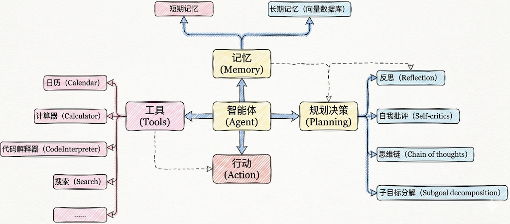
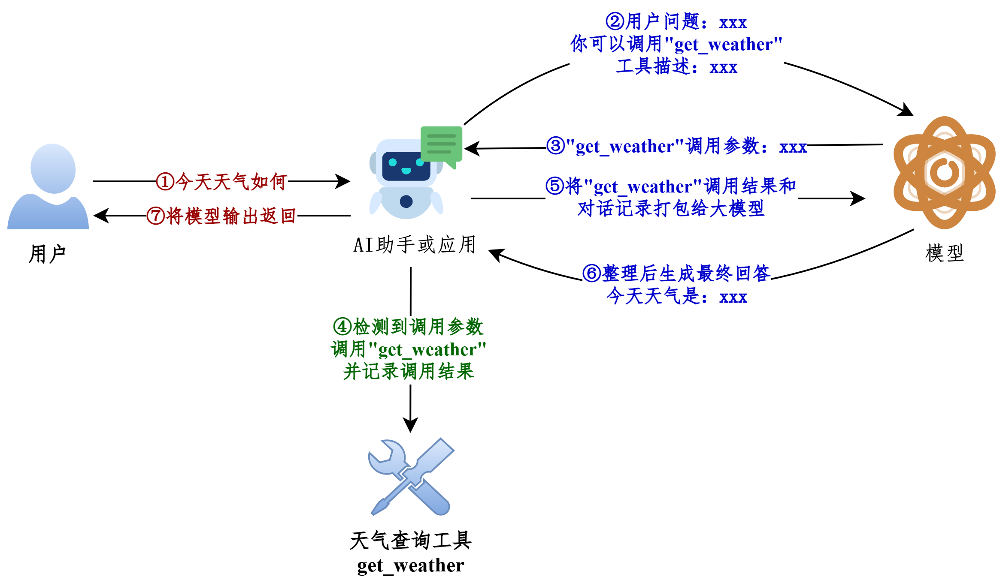
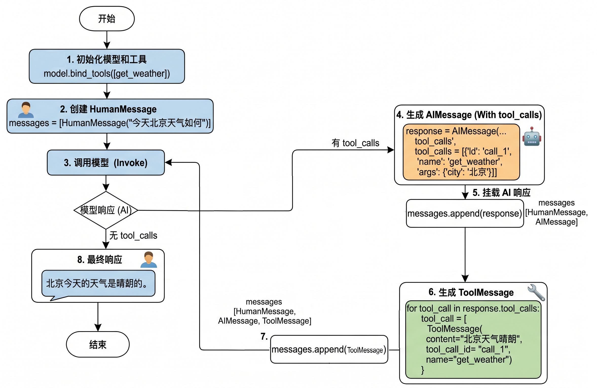

# Tools：工具的定义

## 1、Tools概述

### 1.1 工具的重要性

要构建更强大的AI工程应用，只有生成文本这样的“纸上谈兵”能力自然是不够的。

工具是赋予大语言模型 与外部世界交互能力 的关键组件，从而能让智能体执行搜索、计算、数据库查询、邮件发送或调用第三方API等，进而构建功能强大的AI应用。借助工具，大模型才能从“认识世界”走向“改变世界”。

举例：


工具是构建智能体的核心要素之一！



### 1.2 工具调用的方式

在LangChain中，工具（Tools）实际上是指明确定义了输入和输出的 可调用函数。因此， 工具调用（Tool Calling） 也被称为 函数调用（Function Calling）。

具体有两种调用方式：

**方式1：直接调用**

这种方式，适合测试时使用。

```python
from langchain_core.tools import tool

@tool
def get_weather(city: str) -> str:
    """
    获取指定城市的天气信息

    参数:
        city: 城市名称，如"北京"、"上海"

    返回:
        天气信息字符串
    """
    # 你的实现
    return city + "晴天，温度 15°C"
```

```python
# 使用 .invoke() 方法
result = get_weather.invoke({"city": "北京"})
print(result)
```

```text
北京晴天，温度 15°C
```

**方式2：绑定到模型（主流）**

这种方式，让AI来调用，开发中使用。

```python
from langchain.chat_models import init_chat_model
from dotenv import load_dotenv
import os


# 从.env文件中加载环境变量
load_dotenv(override=True)

CLOSEAI_API_KEY = os.getenv("CLOSEAI_API_KEY")
CLOSEAI_BASE_URL = os.getenv("CLOSEAI_BASE_URL")

model = init_chat_model(
    model="gpt-5.4-mini",
    model_provider="openai",
    api_key=CLOSEAI_API_KEY,
    base_url=CLOSEAI_BASE_URL
)
from langchain_core.tools import tool

# 定义工具
@tool
def get_weather(city: str) -> str:
    """获取指定城市的天气"""
    # 你的实现
    return "晴天，温度 15°C"


# 绑定工具
model_with_tools = model.bind_tools([get_weather])

# AI 可以决定是否调用工具
response = model_with_tools.invoke("北京天气如何？")
# response = model_with_tools.invoke("2 + 3 = ？")

# 检查 AI 是否要调用工具
if response.tool_calls:
    print("AI 想调用工具：", response.tool_calls)
else:
    print("AI 直接回答：", response.content)
```

```text
AI 想调用工具： [{'name': 'get_weather', 'args': {'city': '北京'}, 'id':
'call_fR3LE8Wjqh9lnDosQ61Y892E', 'type': 'tool_call'}]
```

### 1.3 工具调用的整体流程

大模型能根据对话上下文决定何时调用工具以及传递哪些参数。

经典流程如下：



我们现在编写的LangChain应用对应上图中的AI助手或应用。

### 1.4 从Message流转看工具的调用

前提：模型的初始化

```python
from langchain.chat_models import init_chat_model
from dotenv import load_dotenv
import os

# 从.env文件中加载环境变量
load_dotenv(override=True)

CLOSEAI_API_KEY = os.getenv("CLOSEAI_API_KEY")
CLOSEAI_BASE_URL = os.getenv("CLOSEAI_BASE_URL")

model = init_chat_model(
    model="gpt-5.4-mini",
    model_provider="openai",
    api_key=CLOSEAI_API_KEY,
    base_url=CLOSEAI_BASE_URL
)
```

参考1：不使用@tool修饰

```python
from langchain.messages import HumanMessage, ToolMessage


def get_weather(city: str):
    """获取天气的工具"""
    return f"{city}天气晴朗"


# 将模型和工具绑定
model_with_tools = model.bind_tools([get_weather])

messages = [
    HumanMessage("今天北京天气如何")
]

# 模型生成调用工具请求
response = model_with_tools.invoke(messages)

# 添加AIMessage
messages.append(response)

tool_calls = response.tool_calls

for tool_call in tool_calls:
    if tool_call["name"] == "get_weather":
        # 拼接出ToolMessage实例
        tool_response = ToolMessage(
            content=get_weather(**tool_call["args"]),
            tool_call_id=tool_call["id"],
            name=tool_call["name"]
        )
        messages.append(tool_response)
print("=====================> messages <=====================")
for msg in messages:
    msg.pretty_print()
print("=====================> messages <=====================")
final_response = model_with_tools.invoke(messages)
print(f"final_response: \n{final_response}")
```

参考2：使用@tool修饰

```python
from langchain.messages import HumanMessage, ToolMessage

@tool
def get_weather(city: str):
    """获取天气的工具"""
    return f"{city}天气晴朗~"


# 将模型和工具绑定
model_with_tools = model.bind_tools([get_weather])

messages = [
    HumanMessage("今天北京天气如何")
]

# 模型生成调用工具请求
response = model_with_tools.invoke(messages)

# 添加AIMessage
messages.append(response)

tool_calls = response.tool_calls

for tool_call in tool_calls:
    if tool_call["name"] == "get_weather":
        # 返回的是ToolMessage类型消息
        tool_response = get_weather.invoke(tool_call)
        print(type(tool_response))
        messages.append(tool_response)

print("=====================> messages <=====================")
for msg in messages:
    msg.pretty_print()
print("=====================> messages <=====================")
final_response = model_with_tools.invoke(messages)
print(f"final_response: \n{final_response}")
```

说明：被 @tool 修饰的函数可以调用 invoke 接收模型返回的入参信息执行函数，并返回ToolMessage 实例，我们不再需要手动拼接 ToolMessage。

```text
<class 'langchain_core.messages.tool.ToolMessage'>
=====================> messages <=====================
================================ Human Message
=================================

今天北京天气如何
================================== Ai Message
==================================

好的，我来帮你查一下今天北京的天气情况。
Tool Calls:
get_weather (call_00_f65kV4JKjBPK0HhURzO99449)
Call ID: call_00_f65kV4JKjBPK0HhURzO99449
Args:
 city: 北京
================================= Tool Message
=================================
Name: get_weather

北京天气晴朗~
=====================> messages <=====================
final_response:
content='今天北京天气**晴朗** ☀，是个好天气！如果你要出门的话，可以放心出行哦～'
additional_kwargs={'refusal': None} response_metadata={'token_usage':
{'completion_tokens': 24, 'prompt_tokens': 343, 'total_tokens': 367,
'completion_tokens_details': None, 'prompt_tokens_details':
{'audio_tokens': None, 'cached_tokens': 256},
'prompt_cache_hit_tokens': 256, 'prompt_cache_miss_tokens': 87},
'model_provider': 'deepseek', 'model_name': 'deepseek-v4-flash',
'system_fingerprint': 'fp_8b330d02d0_prod0820_fp8_kvcache_20260402',
'id': 'fabbebd6-498e-40f0-b1f6-e9fb43a36297', 'finish_reason': 'stop',
'logprobs': None} id='lc_run--019e5a90-f0ca-7d43-a4e5-3d34379e8208-0'
tool_calls=[] invalid_tool_calls=[] usage_metadata={'input_tokens':
343, 'output_tokens': 24, 'total_tokens': 367, 'input_token_details':
{'cache_read': 256}, 'output_token_details': {}}
```

对应图示（以参考1为例）：



**工具调用流程总结：**

所以如果真正要大模型根据工具调用结果进行回复，完整的调用流程包括如下四个步骤：

步骤1：模型绑定工具：通过model.bind_tools([...])绑定一个或者多个工具。

步骤2：模型生成工具调用请求：用户输入问题，调用模型（比如invoke()）。如果需要调用工具，模型返回包含工具调用信息（如工具名称和参数）的AIMessage。

步骤3：开发者手动执行工具：用户从响应中提取工具调用信息并手动调用对应的工具（比如工具.invoke()）。

步骤4：将工具执行结果ToolMessage传递给模型生成最终结果：将之前用户提问内容和手动执行工具结果ToolMessage返回模型，模型最终生成回复。

特别注意：大模型调用工具是单次推理，直接响应，需要开发者手动执行工具并管理循环，适合简单、确定的任务。

## 2、工具的定义方式1：不使用@tool

### 2.1 模型绑定工具并发送请求

```python
from langchain.chat_models import init_chat_model
from dotenv import load_dotenv
import os

# 从.env文件中加载环境变量
load_dotenv(override=True)

CLOSEAI_API_KEY = os.getenv("CLOSEAI_API_KEY")
CLOSEAI_BASE_URL = os.getenv("CLOSEAI_BASE_URL")

model = init_chat_model(
    model="gpt-5.4-mini",
    model_provider="openai",
    api_key=CLOSEAI_API_KEY,
    base_url=CLOSEAI_BASE_URL
)
```

```python
from rich import print as rprint

# 定义工具
def get_weather(city: str):
    return f"{city}天气晴朗"

# 将模型和工具绑定
model_with_tools = model.bind_tools([get_weather])

response = model_with_tools.invoke(
    "今天北京天气如何"
)

rprint(response)
# print(response.tool_calls)
```

输出如下

```text
AIMessage(
 content='',
 additional_kwargs={'refusal': None},
 response_metadata={
     'token_usage': {
         'completion_tokens': 18,
         'prompt_tokens': 121,
         'total_tokens': 139,
         'completion_tokens_details': {
             'accepted_prediction_tokens': 0,
             'audio_tokens': 0,
             'reasoning_tokens': 0,
             'rejected_prediction_tokens': 0
         },
         'prompt_tokens_details': {'audio_tokens': 0, 'cached_tokens':
0},
         'latency_checkpoint': {
             'engine_tbt_ms': 3,
             'engine_ttft_ms': 41,
             'engine_ttlt_ms': 100,
             'pre_inference_ms': 99,
             'service_tbt_ms': 3,
             'service_ttft_ms': 207,
             'service_ttlt_ms': 260,
             'total_duration_ms': 168,
             'user_visible_ttft_ms': 108
         }
     },
     'model_provider': 'openai',
     'model_name': 'gpt-5.4-mini-2026-03-17',
     'system_fingerprint': None,
     'id': 'chatcmpl-Dif1tWr37cPmJRNpJuCLJNU9Yrxlk',
     'service_tier': 'default',
     'finish_reason': 'tool_calls',
     'logprobs': None
 },
 id='lc_run--019e54a4-6989-71b1-8c7e-6efcfa08d4bb-0',
 tool_calls=[
     {
         'name': 'get_weather',
         'args': {'city': '北京'},
         'id': 'call_ECvZNV7RLTWpKQSjhvdGzKBd',
         'type': 'tool_call'
     }
 ],
 invalid_tool_calls=[],
 usage_metadata={
     'input_tokens': 121,
     'output_tokens': 18,
     'total_tokens': 139,
     'input_token_details': {'audio': 0, 'cache_read': 0},
     'output_token_details': {'audio': 0, 'reasoning': 0}
 }
)
```

### 2.2 工具描述的各部分详解

#### 2.2.1 了解：convert_to_openai_tool

执行 model.bind_tools([get_weather])，底层最终会调用 convert_to_openai_tool 生成工具描述。所以我们可以直接调用后者查看解析后的工具描述。

```python
from langchain_core.utils.function_calling import convert_to_openai_tool

from rich import print as rprint

def get_weather(city: str):
    return f"{city}天气晴朗"

rprint(convert_to_openai_tool(get_weather))
```

输出如下

```text
{
'type': 'function',
'function': {
  'name': 'get_weather',
  'description': '',
  'parameters': {
      'properties': {
          'city': {
              'type': 'string'
          }
      },
      'required': ['city'],
      'type': 'object'
  }
}
}
```

**结果字段说明：**

- （1） type：定义当前数据节点必须是什么数据类型。常见类型有 string, number, integer, boolean,object, array, null。object即是json对象。

- （2） properties：用于定义JSON 对象（Object）中可以包含哪些属性（键），以及每个属性对应的值类型和说明。

- （3） required：当 type为 "object"时使用，是一个数组，列出了对象中必须存在的属性名。

**问题：为什么不使用@tool装饰器修饰的函数，也可以理解为工具呢？**

查看 convert_to_openai_tool 底层源码：

```python
elif isinstance(function, langchain_core.tools.base.BaseTool):
    oai_function = cast("dict", _format_tool_to_openai_function(function))
elif callable(function):
    oai_function = cast(
        "dict", _convert_python_function_to_openai_function(function)
    )
```

相当于加了@tool修饰的函数走上面的分支，没有加@tool修饰的函数走下面的分支，后者会基于函数定义和docstring生成pydantic模式的描述，然后转换为规范的tool_schema。

#### 2.2.2 description说明

convert_to_openai_tool 会从 docstring(文档字符串) 加载工具的描述信息，上面的案例中，docstring 为空，所以抽取的 description 为空。

docstring，文档字符串，使用三个双引号表示开始和结束。

```python
from langchain_core.utils.function_calling import convert_to_openai_tool
from rich import print as rprint

def get_weather(city: str):
    """
    天气查询工具
    """
   return f"{city}天气晴朗"

rprint(convert_to_openai_tool(get_weather))
```

输出

```text
{
 'type': 'function',
 'function': {
     'name': 'get_weather',
     'description': '天气查询工具',
     'parameters': {
         'properties': {
             'city': {
                 'type': 'string'
             }
         },
         'required': ['city'],
         'type': 'object'
     }
 }
}
```

#### 2.2.3 参数说明

convert_to_openai_tool 会从 docstring 加载参数说明，这里的 docstring 必须遵循 Google 风格。

- Google 风格 docstring 说明：<https://google.github.io/styleguide/pyguide.html>

- Google 风格 docstring 示例：<https://www.sphinx-doc.org/en/master/usage/extensions/example_google.html>

- Python docstring 通用约定：<https://peps.python.org/pep-0257/>

基础用法不必完整阅读规范，只需要按照下面的示例仿写即可。

```python
from langchain_core.utils.function_calling import convert_to_openai_tool
from rich import print as rprint

def get_weather(city: str):
    """
    天气查询工具

    Args:
        city: 城市名称
    """
    return f"{city}天气晴朗"

rprint(convert_to_openai_tool(get_weather))
```

使用 Args:、 Returns:、 Raises: 等关键字，这种方式可读性强。Agent通过工具的这些注释来理解工具的用途和调用时机，因此清晰、准确的文档字符串是工具能被正确调用的前提。

输出如下：

```text
{
 'type': 'function',
 'function': {
     'name': 'get_weather',
     'description': '天气查询工具',
     'parameters': {
         'properties': {
             'city': {
                 'description': '城市名称',
                 'type': 'string'
             }
         },
         'required': ['city'],
         'type': 'object'
     }
 }
}
```

AI 依赖 docstring 来理解工具。

```python
# ❌ 不好：太模糊
@tool
def tool1(x: str) -> str:
    """做一些事情"""
    ...
```

```python
# ✅ 好：清晰明确
@tool
def search_products(query: str) -> str:
    """
    在产品数据库中搜索产品

    Args:
        query: 搜索关键词，如"笔记本电脑"、"手机"

    Returns:
        产品列表的 JSON 字符串
    """
    ...
```

#### 2.2.4 参数类型说明

参数类型来源于函数的类型注解。

```python
from langchain_core.utils.function_calling import convert_to_openai_tool
from rich import print as rprint

def get_weather(city):
    """
    天气查询工具
    """
    return f"{city}天气晴朗"

rprint(convert_to_openai_tool(get_weather))
```

输出如下

```text
{
 'type': 'function',
 'function': {
     'name': 'get_weather',
     'description': '天气查询工具',
     'parameters': {
         'properties': {
             'city': {}
      },
         'required': ['city'],
         'type': 'object'
     }
 }
}
```

删除了参数类型注解，则工具描述中不包含参数类型说明

注意：如果docstring中包含参数说明，则对应的参数必须有类型注解，否则报错

```python
from langchain_core.utils.function_calling import convert_to_openai_tool
from rich import print as rprint

def get_weather(city):
    """
    天气查询工具

    Args:
        city: 城市名称
    """
    print("天气晴朗")

rprint(convert_to_openai_tool(get_weather))
```

报错如下：

```text
Traceback...
ValueError: Arg city in docstring not found in function signature.
```

#### 2.2.5 参数默认值说明

如果参数没有默认值，则会包含 在required对应的列表 中。

反之，则参数的描述信息会包含 default 字段，并且 不会出现在required列表 中。

```python
from langchain_core.utils.function_calling import convert_to_openai_tool
from rich import print as rprint

def get_weather(city: str="北京"):
    """
    天气查询工具

    Args:
        city: 城市名称
    """
    return f"{city}天气晴朗"

rprint(convert_to_openai_tool(get_weather))
```

输出如下

```text
{
 'type': 'function',
 'function': {
     'name': 'get_weather',
     'description': '天气查询工具',
     'parameters': {
         'properties': {
             'city': {
                 'default': '北京',
                 'description': '城市名称',
                 'type': 'string'
             }
         },
         'type': 'object'
     }
 }
}
```

目前只有一个参数，并且有默认值，所以required字段被移除了。

举例2：

```python
from langchain_core.utils.function_calling import convert_to_openai_tool
from rich import print as rprint

def get_weather(dt: str, city: str="北京"):
    """
    天气查询工具

    Args:
        dt: 日期
        city: 城市名称
    """
    return f"{city}天气晴朗"

rprint(convert_to_openai_tool(get_weather))
```

输出

```text
{
 'type': 'function',
 'function': {
     'name': 'get_weather',
     'description': '天气查询工具',
     'parameters': {
         'properties': {
             'dt': {
                 'description': '日期',
                 'type': 'string'
             },
             'city': {
                 'default': '北京',
                 'description': '城市名称',
                 'type': 'string'
             }
         },
         'required': [
             'dt'
         ],
         'type': 'object'
     }
 }
}
```

## 3、工具的定义方式2：使用@tool装饰器（推荐）

使用 @tool 装饰器修饰，可以自动将普通 Python 函数转化为智能体可调用的工具。

此方式 最直接，代码量极少，非常适合快速验证想法或创建参数简单的工具。

### 3.1 自定义工具描述：description

#### 情况1：仅提供docstring信息

在bind_tools()调用时，先将函数封装为 BaseTool 类型的对象，再传递给 convert_to_openai_tool  函数，生成工具的描述。

```python
from langchain_core.utils.function_calling import convert_to_openai_tool
from langchain.tools import tool

@tool
def get_weather(city: str):
    return f"{city}天气晴朗"

print(convert_to_openai_tool(get_weather))
```

@tool 会从 docstring 生成描述信息，同样要求遵循 Google docstring 规范。如果没有 docstring则报错，如下。

```text
Traceback...
ValueError: Function must have a docstring if description not provided.
```

补充 docstring

```python
from langchain_core.utils.function_calling import convert_to_openai_tool
from langchain.tools import tool

@tool
def get_weather(city: str):
    """
    天气查询工具
    """
    return f"{city}天气晴朗"

print(convert_to_openai_tool(get_weather))
```

输出如下

```text
{
 'type': 'function',
 'function': {
     'name': 'get_weather',
     'description': '天气查询工具',
     'parameters': {
         'properties': {
             'city': {
                 'type': 'string'
             }
         },
         'required': [
             'city'
         ],
         'type': 'object'
     }
 }
}
```

#### 情况2：添加工具描述：description

@tool 的参数 description 可以更改工具描述，优先级高于 docstring 的函数说明

```python
from langchain_core.utils.function_calling import convert_to_openai_tool
from langchain.tools import tool
from rich import print as rprint

@tool(description="根据城市名称查询当日天气的工具")
def get_weather(city: str):
    """
    天气查询工具
    """
    return f"{city}天气晴朗"

rprint(convert_to_openai_tool(get_weather))
```

输出

```text
{
 'type': 'function',
 'function': {
     'name': 'get_weather',
     'description': '根据城市名称查询当日天气的工具',
     'parameters': {
         'properties': {
             'city': {
                 'type': 'string'
             }
         },
         'required': [
             'city'
         ],
         'type': 'object'
     }
 }
}
```

#### 情况3：解析docstring：parse_docstring

当我们没有向 @tool 传递 description 参数时，默认情况下， tool 会将 docstring 整体视为description，如下

```python
from langchain_core.utils.function_calling import convert_to_openai_tool
from rich import print as rprint

@tool
def get_weather(city: str, units: str = "celsius", include_forecast: bool =
False) -> str:
    """
    获取当日天气，可选择是否同时查询未来五日天气预报

    Args:
        city: 城市
        units: 气温单位，可选：celsius-摄氏度，fahrenheit-华氏度
        include_forecast: 是否包含未来五日的天气预报
    """
    temp = 22 if units == "celsius" else 72
    result = f'{city}当天气温: {temp} {"摄氏度" if units == "celsius" else "华
氏度"}'
    if include_forecast:
        result += "\n未来五天都是晴天"
    return result

rprint(convert_to_openai_tool(get_weather))
```

输出如下

```text
{
 'type': 'function',
 'function': {
     'name': 'get_weather',
     'description': '获取当日天气，可选择是否同时查询未来五日天气预报
\n\nArgs:\n    city: 城市\n    units: 气温单位，可选：celsius-摄氏度，
fahrenheit-华氏度\n    include_forecast: 是否包含未来五日的天气预报',
     'parameters': {
         'properties': {
             'city': {
                 'type': 'string'
             },
             'units': {
                 'default': 'celsius',
                 'type': 'string'
             },
             'include_forecast': {
                 'default': False,
                 'type': 'boolean'
             }
         },
         'required': [
             'city'
         ],
         'type': 'object'
     }
 }
}
```

通过将 parse_docstring 设置为True，docstring会被解析，填充到相应的字段描述中。

```python
from langchain_core.utils.function_calling import convert_to_openai_tool
from rich import print as rprint

@tool(parse_docstring=True)
def get_weather(city: str, units: str = "celsius", include_forecast: bool =
False) -> str:
    """
    获取当日天气，可选择是否同时查询未来五日天气预报

    Args:
        city: 城市
        units: 气温单位，可选：celsius-摄氏度，fahrenheit-华氏度
        include_forecast: 是否包含未来五日的天气预报
    """
    temp = 22 if units == "celsius" else 72
    result = f'{city}当天气温: {temp} {"摄氏度" if units == "celsius" else "华
氏度"}'
    if include_forecast:
        result += "\n未来五天都是晴天"
    return result

rprint(convert_to_openai_tool(get_weather))
```

输出

```text
{
 'type': 'function',
 'function': {
     'name': 'get_weather',
     'description': '获取当日天气，可选择是否同时查询未来五日天气预报',
     'parameters': {
         'properties': {
             'city': {
                 'description': '城市',
                 'type': 'string'
             },
             'units': {
                 'default': 'celsius',
                 'description': '气温单位，可选：celsius-摄氏度，
fahrenheit-华氏度',
                 'type': 'string'
             },
             'include_forecast': {
                 'default': 'False',
                 'description': '是否包含未来五日的天气预报',
                 'type': 'boolean'
             }
         },
         'required': [
             'city'
         ],
         'type': 'object'
     }
 }
}
```

要注意：不使用 @tool 装饰器时，docstring不合法会被视为普通文本，作为 description，但如果使用了 @tool 时 docstring 不合法，将会抛出异常

```python
from langchain_core.utils.function_calling import convert_to_openai_tool

@tool(parse_docstring=True)
def get_weather(city: str, units: str = "celsius", include_forecast: bool =
False) -> str:
    """
    获取当日天气，可选择是否同时查询未来五日天气预报
    Args:
        city: 城市
        units: 气温单位，可选：celsius-摄氏度，fahrenheit-华氏度
        include_forecast: 是否包含未来五日的天气预报
    """
    temp = 22 if units == "celsius" else 72
    result = f'{city}当天气温: {temp} {"摄氏度" if units == "celsius" else "华
氏度"}'
    if include_forecast:
        result += "\n未来五天都是晴天"
    return result

convert_to_openai_tool(get_weather)
```

报错如下

```text
Traceback...
ValueError: Found invalid Google-Style docstring.
```

### 3.2 更改工具名称：name_or_callable

默认情况，使用函数名作为工具名称，但可以向@tool 传参 name_or_callable，以更改工具名称。

```python
from langchain_core.utils.function_calling import convert_to_openai_tool
from langchain.tools import tool

@tool(name_or_callable="getWeather")
def get_weather(city: str):
    """
    天气查询工具
    """
    return f"{city}天气晴朗"

print(convert_to_openai_tool(get_weather))
```

输出如下

```text
{
 'type': 'function',
 'function': {
     'name': 'getWeather',
     'description': '天气查询工具',
     'parameters': {
         'properties': {
             'city': {
                 'type': 'string'
             }
         },
         'required': [
             'city'
         ],
         'type': 'object'
     }
 }
}
```

说明：@tool中参数name_or_callable名称可以省略

```python
from langchain_core.utils.function_calling import convert_to_openai_tool
from langchain.tools import tool

@tool("getWeather")
def get_weather(city: str):
    """
    天气查询工具
    """
    print("天气晴朗")

print(convert_to_openai_tool(get_weather))
```

输出如下

```text
{
 'type': 'function',
 'function': {
     'name': 'getWeather',
     'description': '天气查询工具',
     'parameters': {
         'properties': {
             'city': {
                 'type': 'string'
             }
         },
         'required': [
             'city'
         ],
         'type': 'object'
     }
 }
}
```

说明：不要使用config或runtime作为参数名，这些是LangChain内部保留的。

开发中，习惯使用函数名作为工具名称，不推荐自定义工具名称。

### 3.3 自定义args_schema

#### 3.3.1 方式1：使用Pydantic模型定义

当工具的参数变得复杂，需要 枚举值、 范围限制 或 更复杂的业务逻辑验证 时，Pydantic 模型是理想的选择，提供强大的类型检查和数据验证。

使用Pydantic 的主要优势在于能够精确控制工具参数的格式和验证规则，让大模型更准确地理解如何调用工具。

##### 3.3.1.1 pydantic类型的定义

**① BaseModel基类**

通过继承核心基类 BaseModel 定义数据模型，从而声明字段结构、类型约束、默认值以0及校验规则。

```python
from pydantic import BaseModel

class WeatherInput(BaseModel):
    city: str

print(WeatherInput(city="北京"))
```

输出如下

```text
city='北京'
```

注意：BaseModel子类初始化时，不接收位置参数，字段值必须以关键字参数的形式传入，否则报错。

```python
from pydantic import BaseModel

class WeatherInput(BaseModel):
    city: str

print(WeatherInput("北京"))
```

报错如下

```text
TypeError
......
TypeError: BaseModel.__init__() takes 1 positional argument but 2 were
given
```

这是因为BaseModel的初始化函数签名如下

```python
def __init__(self, /, **data: Any) -> None:
```

由此可知，所有关键字参数都会被收集到字典 data 中，然后 data 会按照参数类型注解进行校验，失败时抛出异常。

**② Field**

Field()：用来“定制字段”的函数，可用于设置默认值、描述等。

举例1：设置默认值

```python
from pydantic import BaseModel, Field

class WeatherInput(BaseModel):
    city: str = Field(
        default= "北京"
    )

print(WeatherInput())
```

输出

```text
city='北京'
```

举例2：设置参数的描述信息每个字段的 description 参数至关重要，它直接影响大模型理解参数含义的能力。

```python
from pydantic import BaseModel, Field

class WeatherInput(BaseModel):
    city: str = Field(
        default= "北京",
        description="城市"
    )
    include_forecast: bool = Field(
        default=False,
        description="是否包含未来五日天气预报"
    )

print(WeatherInput())
```

输出

```text
city='北京' include_forecast=False
```

**③ Literal**

可以使用 Literal类型限定参数为固定选项。

Literal：表示字段不能是任意某种类型的值，而只能是几个固定字面量之一。

举例1：

```python
from pydantic import BaseModel
from typing import Literal

class WeatherInput(BaseModel):
    city: str
    unit: Literal["celsius", "fahrenheit"]

print("===============> 合法 <===============")
print(WeatherInput(city="北京", unit="celsius"))

print("===============> 非法 <===============")
try:
    print(WeatherInput(city="北京", unit="kelvin"))
except Exception as e:
    print("报错类型：", type(e).__name__)
    print(e)
```

输出

```text
===============> 合法 <===============
city='北京' unit='celsius'
===============> 非法 <===============
报错类型： ValidationError
1 validation error for WeatherInput
unit
Input should be 'celsius' or 'fahrenheit' [type=literal_error,
input_value='kelvin', input_type=str]
 For further information visit
<https://errors.pydantic.dev/2.12/v/literal_error>
```

举例2：

```python
from pydantic import BaseModel, Field

class WeatherInput(BaseModel):
    city: str = Field(
        default= "北京",
        description="城市"
    )
    unit: Literal["celsius", "fahrenheit"] = Field(
        default="celsius",
        description="气温单位"
    )
    include_forecast: bool = Field(
        default=False,
        description="是否包含未来五日天气预报"
    )

print(WeatherInput())
```

输出

```text
city='北京' unit='celsius' include_forecast=False
```

##### 3.3.1.2 使用Pydantic定义args_schema

通过 @tool(args_schema=PydanticModelCls) 将这个 Pydantic 模型与工具函数关联。

利用 Pydantic 的类型系统进行参数验证，当大模型需要调用工具前，Pydantic 会自动验证参数的类型和有效性。

举例：

```python
from pydantic import BaseModel, Field
from langchain.tools import tool
from langchain_core.utils.function_calling import convert_to_openai_tool

class WeatherInput(BaseModel):
    city: str = Field(
        default= "北京",
        description="城市"
    )
    unit: Literal["celsius", "fahrenheit"] = Field(
        default="celsius",
        description="气温单位"
    )
    include_forecast: bool = Field(
        default=False,
        description="是否包含未来五日天气预报"
    )

@tool(args_schema=WeatherInput)
def get_weather(city: str, unit: str = "celsius", include_forecast: bool =
False) -> str:
    """获取当日天气，可选未来五日天气预报"""
    temp = 22 if unit == "celsius" else 72
    result = f'{city}当天气温: {temp} {"摄氏度" if unit == "celsius" else "华氏
度"}'
    if include_forecast:
        result += "\n未来五天都是晴天"
    return result

convert_to_openai_tool(get_weather)
```

输出

```text
{
 'type': 'function',
 'function': {
     'name': 'get_weather',
     'description': '获取当日天气，可选未来五日天气预报',
     'parameters': {
         'properties': {
             'city': {
                 'default': '北京',
                 'description': '城市',
                 'type': 'string'
             },
             'unit': {
                 'default': 'celsius',
                 'description': '气温单位',
                 'enum': [
                     'celsius',
                     'fahrenheit'
                 ],
                 'type': 'string'
             },
             'include_forecast': {
                 'default': False,
                 'description': '是否包含未来五日天气预报',
                 'type': 'boolean'
             }
         },
         'type': 'object'
     }
 }
}
```

#### 3.3.2 方式2：使用Json Schema定义

在 LangChain 中，还可以直接使用 JSON Schema 字典 来定义工具的参数模式。这种方式提供了极大的灵活性。

因为工具参数模式可以基于数据库配置或用户输入在 运行时动态生成，所以这种方式特别适合参数结构需要动态生成的场景。

举例：

```json
{
    "type": "function",
    "function": {
        "name": "get_weather",
        "description": "获取当日天气，可选未来五日天气预报",
        "parameters": {
            "type": "object",
            "properties": {
                "location": {"type": "string"},
                "units": {"type": "string"},
                "include_forecast": {"type": "boolean"}
            },
            "required": ["location", "units", "include_forecast"]
        },
    }
}
```

应该传递给args_schema的只有 parameters 对应的JSON字符串，即

```json
{
    "type": "object",
    "properties": {
        "location": {"type": "string"},
        "units": {"type": "string"},
        "include_forecast": {"type": "boolean"}
    },
    "required": ["location", "units", "include_forecast"]
}
```

举例：

通过 @tool(args_schema=json_schema_dict) 将一个符合 JSON Schema 标准的字典与工具函数关联。

```python
from langchain.tools import tool
from langchain_core.utils.function_calling import convert_to_openai_tool

weather_schema = {
    "type": "object",
    "properties": {
        "location": {"type": "string"},
        "units": {"type": "string"},
        "include_forecast": {"type": "boolean"}
    },
    "required": ["location", "units", "include_forecast"]
}

@tool(args_schema=weather_schema)
def get_weather(city: str, unit: str = "celsius", include_forecast: bool =
False) -> str:
    """获取当日天气，可选未来五日天气预报"""
    temp = 22 if unit == "celsius" else 72
    result = f'{city}当天气温: {temp} {"摄氏度" if unit == "celsius" else "华氏
度"}'
    if include_forecast:
        result += "\n未来五天都是晴天"
    return result

print(convert_to_openai_tool(get_weather))
```

输出

```text
{
 'type': 'function',
 'function': {
     'name': 'get_weather',
     'description': '获取当日天气，可选未来五日天气预报',
     'parameters': {
         'type': 'object',
         'properties': {
             'location': {
                 'type': 'string'
             },
             'units': {
                 'type': 'string'
             },
             'include_forecast': {
                 'type': 'boolean'
             }
         },
         'required': [
             'location',
             'units',
             'include_forecast'
         ]
     }
 }
}
```
