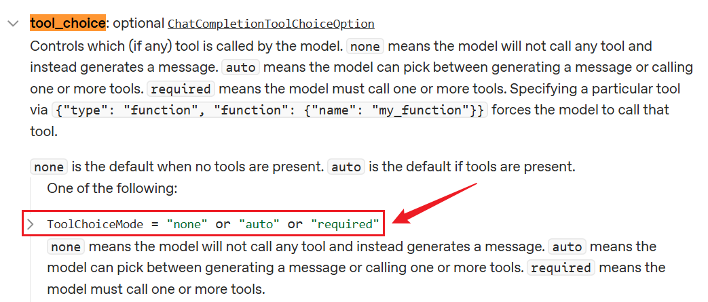
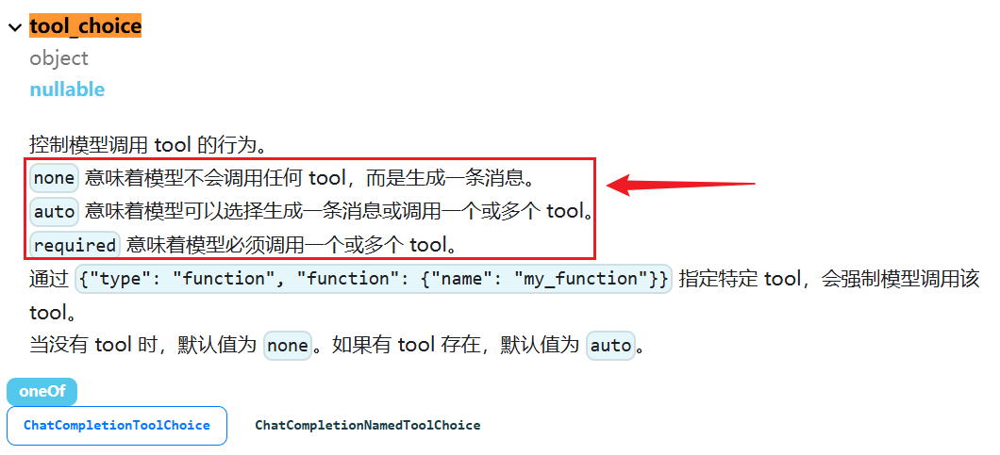

# Tools：应用与实践

## 4、工具的应用案例

### 4.1 案例1：使用args_schema

arg_schema给出明确的参数信息

模型初始化：

```python
from langchain.chat_models import init_chat_model
from dotenv import load_dotenv
import os
# 从.env文件中加载环境变量
load_dotenv(override=True)

CLOSEAI_API_KEY = os.getenv("CLOSEAI_API_KEY")
CLOSEAI_BASE_URL = os.getenv("CLOSEAI_BASE_URL")

model = init_chat_model(
    model="gpt-5.4-mini",
    model_provider="openai",
    api_key=CLOSEAI_API_KEY,
    base_url=CLOSEAI_BASE_URL
)
```

工具的定义与模拟调用：

```python
from pydantic import BaseModel, Field

from langchain.tools import tool
from langchain.messages import HumanMessage
from langchain_core.utils.function_calling import convert_to_openai_tool

class WeatherSchema(BaseModel):
    city: str = Field(default="北京", description="城市名称")
    if_forecast: bool = Field(default=False, description="是否包含明日天气预
报")

@tool("get_weather_and_forecast", description="查询当日天气，可以包含明日天气预
报", args_schema=WeatherSchema)
def get_weather(city: str, if_forecast: bool):
    res = f"{city} 今天天气不错"
    if if_forecast:
        res += "\n明天也不错"
    return res

print(convert_to_openai_tool(get_weather))


model_with_tools = model.bind_tools([get_weather])

messages = [HumanMessage("今天杭州天气如何？明天呢？")]
response = model_with_tools.invoke(messages)
messages.append(response)
tool_calls = response.tool_calls

for tool_call in tool_calls:
    if tool_call["name"] == "get_weather_and_forecast":
        tool_msg = get_weather.invoke(tool_call)
        messages.append(tool_msg)

final_response = model_with_tools.invoke(messages)
messages.append(final_response)
for msg in messages:
    msg.pretty_print()
```

输出

```text
{'type': 'function', 'function': {'name': 'get_weather_and_forecast',
'description': '查询当日天气，可以包含明日天气预报', 'parameters':
{'properties': {'city': {'default': '北京', 'description': '城市名称',
'type': 'string'}, 'if_forecast': {'default': False, 'description': '是
否包含明日天气预报', 'type': 'boolean'}}, 'type': 'object'}}}
================================ Human Message
=================================

今天杭州天气如何？,明天呢？
================================== Ai Message
==================================
Tool Calls:
get_weather_and_forecast (call_c82UrCpAdVAqiHfl4OkZocbg)
Call ID: call_c82UrCpAdVAqiHfl4OkZocbg
Args:
 city: 杭州
 if_forecast: True
================================= Tool Message
=================================
Name: get_weather_and_forecast

杭州 今天天气不错
明天也不错
================================== Ai Message
==================================

杭州今天：天气不错。
杭州明天：也不错。
```

### 4.2 案例2：撰写docstring

可以在docstring中撰写参数的描述信息，此时参数默认值和类型都要通过函数签名传递。

模型初始化：

```python
from langchain.chat_models import init_chat_model
from dotenv import load_dotenv
import os


# 从.env文件中加载环境变量
load_dotenv(override=True)

CLOSEAI_API_KEY = os.getenv("CLOSEAI_API_KEY")
CLOSEAI_BASE_URL = os.getenv("CLOSEAI_BASE_URL")

model = init_chat_model(
    model="gpt-5.4-mini",
    model_provider="openai",
    api_key=CLOSEAI_API_KEY,
    base_url=CLOSEAI_BASE_URL
)
```

工具的定义与模拟调用：

```python
from langchain.tools import tool
from langchain.messages import HumanMessage
from langchain_core.utils.function_calling import convert_to_openai_tool


@tool("get_weather_and_forecast", parse_docstring=True)
def get_weather(city: str="北京", if_forecast: bool=False):
    """
    查询当日天气，可以包含明日天气预报

    Args:
         city: 城市名称
         if_forecast: 是否包含明日天气预报
    """
    res = f"{city} 今天天气不错"
    if if_forecast:
        res += "\n明天要下雨"
    return res

print(convert_to_openai_tool(get_weather))

model_with_tools = model.bind_tools([get_weather])

messages = [HumanMessage("今天杭州天气如何？明天呢？")]
response = model_with_tools.invoke(messages)
messages.append(response)
tool_calls = response.tool_calls

# 将工具调用的结果添加到消息列表中
for tool_call in tool_calls:
    if tool_call["name"] == "get_weather_and_forecast":
        # 返回值tool_msg类型是ToolMessage
        tool_msg = get_weather.invoke(tool_call)
        messages.append(tool_msg)

final_response = model_with_tools.invoke(messages)

messages.append(final_response)

for msg in messages:
    msg.pretty_print()
```

注意：要正确解析docstring，必须在@tool中将 parse_docstring 设置为 True。

输出

```text
{'type': 'function', 'function': {'name': 'get_weather_and_forecast',
'description': '查询当日天气，可以包含明日天气预报', 'parameters':
{'properties': {'city': {'default': '北京', 'description': '城市名称',
'type': 'string'}, 'if_forecast': {'default': False, 'description': '是
否包含明日天气预报', 'type': 'boolean'}}, 'type': 'object'}}}
================================ Human Message
=================================

今天杭州天气如何？明天呢？
================================== Ai Message
==================================
Tool Calls:
get_weather_and_forecast (call_y5vpFccj2DfWSAF6ng5dZOYH)
Call ID: call_y5vpFccj2DfWSAF6ng5dZOYH
 Args:
  city: 杭州
   if_forecast: True
================================= Tool Message
=================================
Name: get_weather_and_forecast

杭州 今天天气不错
明天要下雨
================================== Ai Message
==================================

杭州今天“天气不错”，明天“要下雨”。
如果你愿意，我也可以帮你继续看一下适合出行/穿衣的建议。
```

### 4.3 案例3：多工具调用

大模型调用工具是单次推理，即每次运行调用一个工具，当调用多个工具时，需要用户自己管理多次调用循环。

```python
from langchain_core.tools import tool
from langchain_core.messages import HumanMessage, AIMessage, ToolMessage

# 1.定义工具
# 定义股票查询工具
@tool(parse_docstring=True)
def get_stock_price(company: str, timeframe: str = "today") -> str:
    """获取指定公司的股票价格信息

    Args:
        company: 公司名称（如：苹果公司, 微软公司, 谷歌公司）
        timeframe: 时间范围（today-今日, week-本周, month-本月）
    """
    # 模拟股票数据
    mock_data = {
        "苹果公司": {"today": 185.20, "week": 183.50, "month": 180.75},
        "微软公司": {"today": 415.86, "week": 412.30, "month": 405.42},
        "谷歌公司": {"today": 15.42, "week": 15.20, "month": 14.85}
    }

    if company in mock_data:
        price = mock_data[company].get(timeframe, "未知时间范围")
        return f"{company} {timeframe}价格: {price}美元"
    else:
        return f"未找到股票代码 {company} 的数据"


# 定义新闻搜索工具
@tool(parse_docstring=True)
def search_news(company: str) -> str:
    """搜索指定公司的财经新闻

    Args:
        company: 公司名称
    Returns:
        公司的财经新闻，每个新闻占一行
    """
    # 模拟新闻数据
    mock_news = {
        "苹果公司": [
            "苹果发布新款iPhone，股价上涨3%",
            "苹果与欧盟达成反垄断和解协议",
            "苹果将在印度扩大生产规模"
        ],
        "微软公司": [
            "微软Azure云业务季度增长超预期",
            "微软完成对Nuance的收购",
            "微软推出新一代AI助手Copilot"
        ],
        "谷歌公司": [
            "谷歌发布新AI模型，性能提升20%",
            "谷歌与OpenAI合作，开发新的AI助手",
            "谷歌在欧洲展开AI研究项目"
        ]
    }

    news_list = mock_news.get(company, [f"未找到{company}的相关新闻"])
    return "\n".join(news_list)


# rprint(convert_to_openai_tool(search_news))

# 2.初始化模型并绑定工具
tools = [get_stock_price, search_news]
model_with_tools = model.bind_tools(tools)

message_list = []
human_message = HumanMessage(content="苹果公司今天的股价是多少？最近有什么新闻？")
# human_message = HumanMessage(content="比较一下微软和苹果的股价")
# human_message = HumanMessage(content="腾讯最近有什么重大新闻？")
# human_message = HumanMessage(content="海水为什么是咸的？")
message_list.append(human_message)

# 3.工具调用
while True:
    response = model_with_tools.invoke(message_list)

    message_list.append(response)

    # 如果模型不需要调用工具，直接退出循环
    if not response.tool_calls:
        print("没有工具调用，直接返回答案")
        break

    # 如果有调用工具，处理工具调用响应
    # 4.开发者根据模型的响应，调用工具并获取结果
    for tool_call in response.tool_calls:
        if tool_call["name"] == "get_stock_price":
            stock_result = get_stock_price.invoke(tool_call)
            print("stock_result", stock_result)
            message_list.append(stock_result)
        if tool_call["name"] == "search_news":
            news_result = search_news.invoke(tool_call)
            print("news_result", news_result)
            message_list.append(news_result)


# print("response", response)
# print(response.content)

for msg in message_list:
    msg.pretty_print()
```

输出：

```text
stock_result content='苹果公司 today价格: 185.2美元'
name='get_stock_price' tool_call_id='call_cpGOhWce8rlIFSZ2G9w7ouON'
news_result content='苹果发布新款iPhone，股价上涨3%\n苹果与欧盟达成反垄断和解协
议\n苹果将在印度扩大生产规模' name='search_news'
tool_call_id='call_W9zjkAO8TNCmUbed2ld9tsxl'
没有工具调用，直接返回答案
================================ Human Message
=================================

苹果公司今天的股价是多少？最近有什么新闻？
================================== Ai Message
==================================
Tool Calls:
get_stock_price (call_cpGOhWce8rlIFSZ2G9w7ouON)
Call ID: call_cpGOhWce8rlIFSZ2G9w7ouON
Args:
 company: 苹果公司
 timeframe: today
search_news (call_W9zjkAO8TNCmUbed2ld9tsxl)
Call ID: call_W9zjkAO8TNCmUbed2ld9tsxl
Args:
 company: 苹果公司
================================= Tool Message
=================================
Name: get_stock_price

苹果公司 today价格: 185.2美元
================================= Tool Message
=================================
Name: search_news

苹果发布新款iPhone，股价上涨3%
苹果与欧盟达成反垄断和解协议
苹果将在印度扩大生产规模
================================== Ai Message
==================================

苹果公司今天股价是 **185.2 美元**。

最近新闻包括：
- 苹果发布了**新款 iPhone**，带动股价上涨约 **3%**
- 苹果与欧盟达成了**反垄断和解协议**
- 苹果计划在**印度扩大生产规模**
如果你愿意，我也可以帮你继续整理这些新闻对苹果股价的可能影响。
```

### 4.4 案例4：多工具调用

```python
from langchain.tools import tool
from langchain.messages import HumanMessage


@tool(parse_docstring=True)
def get_weather(city: str) -> str:
    """
    获取当日天气

    Args:
        city: 城市名称
    """
    return f'{city}当天晴朗'

@tool(parse_docstring=True)
def get_news() -> str:
    """
    获取当日新闻
    """
    return "近期，受全球储蓄芯片短缺等多重因素影响，多地回收商称废旧手机回收市场迎来“火热
潮”，回收价格普遍上涨，旧手机成“香饽饽”。"

model_with_tools = model.bind_tools([get_weather, get_news])

messages = [
    HumanMessage("今天杭州天气如何？今天新闻是什么？别瞎编")
]

response = model_with_tools.invoke(messages)
response.pretty_print()
```

输出

```text
==================================•[1m Ai Message
•[0m==================================

我来帮您查询杭州的天气和今日新闻。
Tool Calls:
get_weather (call_00_uspkbqR7N7wIewhr8hHZAXoM)
Call ID: call_00_uspkbqR7N7wIewhr8hHZAXoM
Args:
city: 杭州
get_news (call_01_ksyZoO2kXFBXXp1dH4dnxZAN)
Call ID: call_01_ksyZoO2kXFBXXp1dH4dnxZAN
Args:
```

此时可以遍历tool_calls列表，挨个调用工具。

```python
messages.append(response)
for tool_call in response.tool_calls:
    if tool_call["name"] == "get_weather":
        tool_msg = get_weather.invoke(tool_call)
        print(tool_msg)
        messages.append(tool_msg)
    elif tool_call["name"] == "get_news":
        tool_msg = get_news.invoke(tool_call)
        print(tool_msg)
        messages.append(tool_msg)
    else:
        raise Exception("不存在的工具")

final_response = model.invoke(messages)
messages.append(final_response)

for msg in messages:
    msg.pretty_print()
```

输出

```text
content='杭州当天晴朗' name='get_weather'
tool_call_id='call_00_PhpRzVvHYLkqOgQMj4keeAso'
content='近期，受全球储蓄芯片短缺等多重因素影响，多地回收商称废旧手机回收市场迎来“火
热潮”，回收价格普遍上涨，旧手机成“香饽饽”。' name='get_news'
tool_call_id='call_01_ALWxzasKCDJzm7fgwiXVBorg'
================================•[1m Human Message
•[0m=================================

今天杭州天气如何？今天新闻是什么？别瞎编
==================================•[1m Ai Message
•[0m==================================

我来帮您查询杭州的天气和今天的新闻。
Tool Calls:
get_weather (call_00_PhpRzVvHYLkqOgQMj4keeAso)
Call ID: call_00_PhpRzVvHYLkqOgQMj4keeAso
Args:
city: 杭州
get_news (call_01_ALWxzasKCDJzm7fgwiXVBorg)
Call ID: call_01_ALWxzasKCDJzm7fgwiXVBorg
Args:
=================================•[1m Tool Message
•[0m=================================
Name: get_weather

杭州当天晴朗
=================================•[1m Tool Message
•[0m=================================
Name: get_news

近期，受全球储蓄芯片短缺等多重因素影响，多地回收商称废旧手机回收市场迎来“火热潮”，回
收价格普遍上涨，旧手机成“香饽饽”。
==================================•[1m Ai Message
•[0m==================================

根据查询结果：
**杭州天气**：今天杭州天气晴朗。

**今日新闻**：近期，受全球芯片短缺等多重因素影响，多地回收商称废旧手机回收市场迎来“火
热潮”，回收价格普遍上涨，旧手机成“香饽饽”。

以上信息基于实时查询，供您参考。
```

## 5、拓展：强制使用工具

### 5.1 tool_choice参数说明

bind_tools 可以传递参数 tool_choice，用于控制是否强制使用工具。

该字段最终会作为 payload 的 tool_choice 字段传递给模型，OpenAI和Deepseek的官方API服务对于tool_choice 的取值做了相同的规定。

OpenAI官方文档



Deepseek官方文档



none：模型不会调用任何工具。

auto： 默认值，模型可以自主决定不调用或调用任意数量的工具。

required：模型必须调用工具，数量不限。此外， tool_choice 还支持传递 any，等价于 required。

### 5.2 none值举例

模型初始化：

```python
from langchain.chat_models import init_chat_model
from dotenv import load_dotenv
import os

# 从.env文件中加载环境变量
load_dotenv(override=True)

CLOSEAI_API_KEY = os.getenv("CLOSEAI_API_KEY")
CLOSEAI_BASE_URL = os.getenv("CLOSEAI_BASE_URL")

model = init_chat_model(
    model="gpt-5.4-mini",
    model_provider="openai",
    api_key=CLOSEAI_API_KEY,
    base_url=CLOSEAI_BASE_URL
)
```

举例：

```python
from langchain.tools import tool
from langchain.messages import HumanMessage


@tool(parse_docstring=True)
def get_weather(city: str) -> str:
    """
    获取当日天气

    Args:
        city: 城市名称
    """
    return f'{city}当天晴朗'

model_with_tools = model.bind_tools([get_weather], tool_choice="none")

messages = [
    HumanMessage("今天北京天气如何？别瞎编")
]

response = model_with_tools.invoke(messages)
response.pretty_print()
```

用户要求查询天气，并提供了天气查询工具，但模型不会调用。

输出

```text
==================================•[1m Ai Message
•[0m==================================

我无法直接获取实时天气数据。
如果您需要查询今天北京的准确天气情况，建议您：
1. 打开手机天气应用（如苹果天气、墨迹天气等）。
2. 在搜索引擎（如百度、谷歌）搜索“北京天气”。
3. 查看中国气象局官网（<http://www.weather.com.cn>）或权威天气平台。

这样可以确保您获得最准确的实时信息。
```

### 5.3 auto值举例

tool_choice 的默认值就是 auto。

**举例1：需要调用工具的场景**

```python
from langchain.tools import tool
from langchain.messages import HumanMessage


@tool(parse_docstring=True)
def get_weather(city: str) -> str:
    """
    获取当日天气

    Args:
        city: 城市名称
    """
    return f'{city}当天晴朗'

model_with_tools = model.bind_tools([get_weather], tool_choice="auto")

messages = [
    HumanMessage("今天杭州天气如何？别瞎编")
]

response = model_with_tools.invoke(messages)
response.pretty_print()
```

输出

```text
==================================•[1m Ai Message
•[0m==================================

我来帮您查询杭州今天的天气情况。
Tool Calls:
get_weather (call_00_yMeVRVUhjsGETejnWXdW4Hhp)
Call ID: call_00_yMeVRVUhjsGETejnWXdW4Hhp
Args:
 city: 杭州
```

**举例2：不需要调用工具的场景**

```python
from langchain.tools import tool
from langchain.messages import HumanMessage
@tool(parse_docstring=True)
def get_weather(city: str) -> str:
    """
    获取当日天气

    Args:
        city: 城市名称
    """
    return f'{city}当天晴朗'

model_with_tools = model.bind_tools([get_weather], tool_choice="auto")

messages = [
    HumanMessage("你好啊")
]

response = model_with_tools.invoke(messages)
response.pretty_print()
```

输出

```text
==================================•[1m Ai Message
•[0m==================================

你好！很高兴见到你！有什么我可以帮助你的吗？
```

### 5.4 required值举例

**举例1：需要调用工具的场景**

```python
from langchain.tools import tool
from langchain.messages import HumanMessage

@tool(parse_docstring=True)
def get_weather(city: str) -> str:
    """
    获取当日天气

    Args:
        city: 城市名称
    """
    return f'{city}当天晴朗'

model_with_tools = model.bind_tools([get_weather], tool_choice="required")

messages = [
    HumanMessage("今天杭州天气如何？别瞎编")
]

response = model_with_tools.invoke(messages)
response.pretty_print()
```

输出

```text
==================================•[1m Ai Message
•[0m==================================
Tool Calls:
get_weather (call_00_7JaeJXjd5Dc4GT9YIDV0ayJU)
Call ID: call_00_7JaeJXjd5Dc4GT9YIDV0ayJU
Args:
 city: 杭州
```

**举例2：不需要调用工具的场景**

```python
from langchain.tools import tool
from langchain.messages import HumanMessage


@tool(parse_docstring=True)
def get_weather(city: str) -> str:
    """
    获取当日天气

    Args:
        city: 城市名称
    """
    return f'{city}当天晴朗'

model_with_tools = model.bind_tools([get_weather], tool_choice="required")

messages = [
    HumanMessage("你好啊")
]

response = model_with_tools.invoke(messages)
response.pretty_print()
```

即便此时不需要，模型依然会调用工具

输出

```text
==================================•[1m Ai Message
•[0m==================================
Tool Calls:
get_weather (call_00_4bLIBRda88ZcvFL70f7XOEmg)
Call ID: call_00_4bLIBRda88ZcvFL70f7XOEmg
Args:
 city: 北京
```

此外， any 行为和 required 一致。举例：略

### 5.5 强制调用特定的工具

某些场景下我们希望调用特定的工具，仍然可以用 tool_choice 解决。

```python
from langchain.tools import tool
from langchain.messages import HumanMessage
@tool(parse_docstring=True)
def get_weather1(city: str) -> str:
    """
    获取当日天气

    Args:
        city: 城市名称
    """
    return f'{city}当天晴朗'

@tool(parse_docstring=True)
def get_weather2(city: str) -> str:
    """
    获取当日天气

    Args:
        city: 城市名称
    """
    return f'{city}当天晴朗'

model_with_tools = model.bind_tools([get_weather1, get_weather2],
tool_choice="get_weather2")

messages = [
    HumanMessage("杭州今天天气如何？")
]

response = model_with_tools.invoke(messages)
response.pretty_print()
```

输出

```text
==================================•[1m Ai Message
•[0m==================================
Tool Calls:
get_weather2 (call_00_mO5sCOWWnE3bWfNXtNhOjPNq)
Call ID: call_00_mO5sCOWWnE3bWfNXtNhOjPNq
Args:
 city: 杭州
```

反过来指定 get_weather1

```python
from langchain.tools import tool
from langchain.messages import HumanMessage


@tool(parse_docstring=True)
def get_weather1(city: str) -> str:
    """
    获取当日天气

    Args:
        city: 城市名称
    """
    return f'{city}当天晴朗'
@tool(parse_docstring=True)
def get_weather2(city: str) -> str:
    """
    获取当日天气

    Args:
        city: 城市名称
    """
    return f'{city}当天晴朗'

model_with_tools = model.bind_tools([get_weather1, get_weather2],
tool_choice="get_weather1")

messages = [
    HumanMessage("杭州今天天气如何？")
]

response = model_with_tools.invoke(messages)
response.pretty_print()
```

输出

```text
==================================•[1m Ai Message
•[0m==================================
Tool Calls:
get_weather1 (call_00_NK8ukyIAIzFL9FK1G3W4sK0s)
Call ID: call_00_NK8ukyIAIzFL9FK1G3W4sK0s
Args:
 city: 杭州
```

## 6、实践经验总结

**1. 清晰的描述**

```python
# ✅ 好
@tool(parse_docstring=True)
def search_flights(origin: str, destination: str, date: str) -> str:
    """
    搜索航班信息

    Args:
        origin: 出发城市，如"北京"
        destination: 目的地城市，如"上海"
        date: 出发日期，格式 YYYY-MM-DD

    Returns:
        可用航班的 JSON 列表
    """
```

**2. 功能单一**

```python
# ❌ 不好：一个工具做太多事
@tool
def do_everything(action: str, data: str) -> str:
    """做各种事情"""
    if action == "weather": ...
    elif action == "calculate": ...
    elif action == "search": ...

# ✅ 好：每个工具做一件事
@tool
def get_weather(city: str) -> str:
    """获取天气"""
    ...

@tool
def calculator(operation: str, a: float, b: float) -> str:
    """计算"""
    ...
```

**3. 如何处理工具失败？**

三层防护：

第1层：工具内部处理

```python
@tool
def divide(a: float, b: float) -> str:
    """
    除法计算

    Args:
        a: 被除数
        b: 除数
    """
    try:
        if b == 0:
            return "错误：除数不能为零"
        result = a / b
        return f"{a} / {b} = {result}"
    except Exception as e:
        return f"计算错误：{e}"
```

第2层：Agent 级重试（使用 prompt）

```python
agent = create_agent(
    model=model,
    tools=[...],
    prompt="如果工具失败，尝试使用其他方法解决问题。"
)
```

第3层：调用级重试

在大模型应用（如 LangChain）中，网络请求和外部工具调用是最容易掉链子的地方。 @retry  就像是一个 容错保险。

```python
from tenacity import retry, stop_after_attempt

# 1. 配置重试规则：如果失败，最多尝试 3 次（即第 1 次正常调用 + 2 次重试）
@retry(stop=stop_after_attempt(3))
def call_agent(question):
    # 2. 核心业务逻辑：调用 LangChain 的 Agent
    return agent.invoke({"messages": [{"role": "user", "content":
question}]})
```

它的工作流程：

① 你调用 call_agent("你好")。

② 程序进入函数，执行 agent.invoke(...)。

③ 如果执行成功：正常返回结果， @retry  什么都不做。

④ 如果执行失败（报错）： @retry  会拦截这个错误，不让程序直接崩溃。它会默默地帮你再次触发agent.invoke(...)。

⑤ 如果连续 3 次都报错：它终于放弃了，把第 3 次的报错真正抛出来，程序此时才会报错中止。

**4. 返回字符串**

```python
# ✅ 好：返回字符串
@tool
def get_user_info(user_id: str) -> str:
    """获取用户信息"""
    user = {"id": user_id, "name": "张三"}
    return json.dumps(user, ensure_ascii=False)  # 转成 JSON 字符串


# ❌ 不好：返回字典（某些情况可能有问题）
@tool
def get_user_info(user_id: str) -> dict:
    """获取用户信息"""
    return {"id": user_id, "name": "张三"}
```

在编写传统的 Python 代码时，返回字典（dict）显然更方便后续代码处理。但在 LangChain 的工具（Tools）生态中，强烈建议工具返回字符串（str）。因为：

1）大模型（LLM）的本质只吃“文本”

2）避免大模型“胡思乱想”（乱码与格式问题）

如果你返回一个包含中文的字典 {"name": "张三"}，LangChain 在强制将其转换为字符串时，默认可能会采用 Unicode 编码，变成 {"name": "\u5f20\u4e09"}。

大模型虽然能理解 Unicode，但极易受到干扰。直接看到中文 张三 的大模型，和看到\u5f20\u4e09  的大模型，其输出的稳定性和准确率是有差距的。通过手动 json.dumps(...,ensure_ascii=False)，你确保了喂给大模型的是最干净、最直观的纯文本。

json.dumps()是 Python 标准库 json模块中的函数，用于将 Python 对象（如字典、列表）序列化成一个 JSON 格式的字符串。

ensure_ascii=False : 这个参数默认值为 True，表示所有非 ASCII 字符（如中文）会被转换成\uXXXX形式的转义序列。设置为 False后，中文、表情符号等字符就能在 JSON 字符串中正常显示，而不是一堆乱码。

**5. 选择同步 vs 异步**

- 同步工具：简单场景，CPU 密集型任务

- 异步工具：IO 密集型（API 调用、数据库、文件操作）

```python
# 同步
@tool
def sync_tool(x: str) -> str:
    return process(x)

# 异步
@tool
async def async_tool(x: str) -> str:
    return await async_process(x)
```
