# 智能体：基本用法

## 1、理解Agents

通用人工智能（AGI）将是AI的终极形态，几乎已成为业界共识。同样，构建智能体（Agent）则是AI工程应用当下的“终极形态”，即Agent是大模型应用开发的核心。

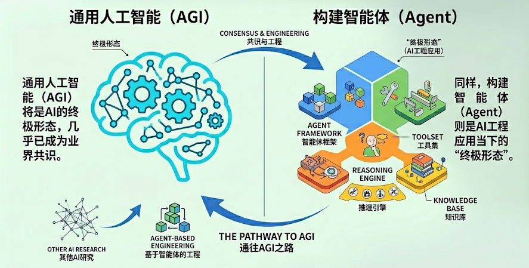

### 1.1 什么是Agent？

在大模型应用开发中，智能体通常指一种以大语言模型为推理与决策核心，结合记忆、工具调用与环境交互能力，能够进行规划决策并执行复杂任务以达成目标的软件系统。

**Agent的关键能力**

- 理解用户问题

- 如何拆解任务

- 判断是否需要工具

- 需要调用哪些工具

- 如何利用好工具结果生成回答&推进任务

### 1.3 Agent的核心组件

前面讲过现在AI Agent的架构：

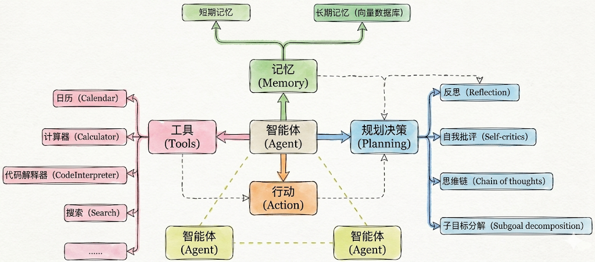

实际开发中几个要素并不需要同时出现，一句话总结

- 必须的：行动（Action）

- 几乎总是存在的：工具（Tool）

- 有条件存在的：规划决策（Planning）

- 最容易被省略的：记忆（Memory）

### 1.4 Agent创建与调用

#### 1.4.1 历史上的调用

在 LangChain 0.x 时代，框架内的 Agent 系统经历了“碎片化”阶段。当时的设计理念是 “针对场景设计特定 Agent”：

- 如果你要实现思维链推理（ReAct），就用 create_react_agent；

- 如果需要结构化输出，就用 create_structured_chat_agent；

- 要工具调用，则用 create_tool_calling_agent。

举例：❌ v0.x 的复杂方式

```python
# 需要多个步骤
from langchain_openai import ChatOpenAI
from langchain.agents import AgentExecutor, create_react_agent
from langchain_core.prompts import PromptTemplate

# 1. 模型初始化
model = ChatOpenAI(model="gpt-4o-mini")

# 2. 创建提示词模板
prompt = PromptTemplate.from_template("""
You are a helpful assistant.

Tools: {tools}
Tool Names: {tool_names}

{agent_scratchpad}
""")

# 3. 创建 agent
agent = create_react_agent(
    llm=model,
    tools=tools,
    prompt=prompt
)

# 4. 创建 executor
executor = AgentExecutor(
    agent=agent,
    tools=tools,
    verbose=True
)

# 5. 调用
result = executor.invoke({"input": "问题"})
```

这种方式灵活，但也带来了三个明显问题：

1. 心智负担高——每种 Agent 都要单独记忆 API 与参数；

2. 可组合性差——多个 Agent 之间无法统一调度；

3. 生态碎片化——不同模块难以复用或协同演化。

#### 1.4.2 全新的调用

LangChain 在 1.0 版本后，团队做出了彻底重构：将所有 Agent 的创建方式统一为一个入口：create_agent()。它取代了旧版本中的 create_react_agent、create_json_agent、create_tool_calling_agent 等多种分支函数，真正让开发者用一行代码即可创建任何类型的智能体。

同时在底层通过“中间件机制（Middleware）”和“标准模型接口（invoke / stream）”实现全局统一。这让框架更轻、更稳，也更易于被集成到其他 Agent 平台中。

举例：✅ v1.x 的简洁方式：

```python
from langchain.chat_models import init_chat_model
from langchain.agents import create_agent

# 1. 初始化模型
model = init_chat_model("gpt-4o-mini", model_provider="openai")

# 2. 创建 agent（一步完成）
agent = create_agent(
    model=model,
    tools=[tool1, tool2],
    system_prompt="Agent 的行为指令"  # 可选
)

# 3. 调用
result = agent.invoke({
    "messages": [{"role": "user", "content": "问题"}]
})
```

## 2、Agent的基本用法1：模型的传入方式

在 LangChain 1.2 中，create_agent 是构建智能体的核心方式，底层基于LangGraph 实现。

**create_agent 完整参数：**

```python
from langchain.agents import create_agent

agent = create_agent(
    model: str | BaseChatModel,            # 必需：聊天模型
    tools: List[BaseTool],                 # 必需：工具列表
    *,
    system_prompt: str = "",               # 系统提示词
    middleware: Seguence[AgentMiddleware[StateT_co, ContextT]] = () # 中间件
    interrupt_before: List[str] = None,    # 在某些工具前暂停（人机协作）
    interrupt_after: List[str] = None,     # 在某些工具后暂停
    debug: bool = False                    # 调试模式
    name: str 丨 None = None,              # 设置模型名称
)
```

Agent在创建时，涉及到模型（Agent使用的模型）、可调用工具、系统提示词等参数的设置。

更多参数参考：<https://reference.langchain.com/python/langchain/agents/factory/create_agent>

**Agent中模型的传入方式：**

本节我们只关注模型的传入。

模型是 Agent 的“大脑”，负责决策和推理。根据模型传入agent方式的不同，分为两种方式。

### 2.1 传入模型字符串

Agent根据传入的模型字符串，自主创建模型对象

```python
from langchain.agents import create_agent

from dotenv import load_dotenv

load_dotenv(override=True)

agent = create_agent("deepseek-v4-flash")
print(type(agent))

from IPython.display import Image, display
display(Image(agent.get_graph().draw_mermaid_png()))
```

输出

```text
<class 'langgraph.graph.state.CompiledStateGraph'>
```


由上可知，agent本质上是LangGraph的CompiledStateGraph实例，底层实现是一个图结构。

通过上述代码最后一行可以看到agent的图结构。

### 2.2 传入模型对象

```python
from langchain.chat_models import init_chat_model
from langchain.agents import create_agent
from langchain_deepseek import ChatDeepSeek
from dotenv import load_dotenv
import os
load_dotenv(override=True)

# 以ChatDeepSeek为例
# model = ChatDeepSeek(model="deepseek-v4-flash")

# 以init_chat_model为例
model = init_chat_model(
    model="gpt-5.4-mini",
    model_provider="openai",
    api_key=os.getenv("CLOSEAI_API_KEY"),
    base_url=os.getenv("CLOSEAI_BASE_URL")
)


agent = create_agent(model)

print(type(agent))

from IPython.display import Image, display
display(Image(agent.get_graph().draw_mermaid_png()))
```

输出同上

```text
<class 'langgraph.graph.state.CompiledStateGraph'>
```

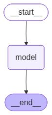

## 3、Agent的基本用法2：如何调用Agent

agent.invoke() 是Agent 最基本的同步调用方法，它会阻塞程序执行直到返回最终结果。具体的：

- 输入：传入的参数为字典类型，字典内通过messages字段传递消息列表。即：“ {"messages":[{"role": "...", "content": "..."}]} ”

- 输出：通过invoke调用Agent，底层可能会经历多轮交互，返回的是完整的消息列表，被封装在字典中，是messages字段的值。

```python
response = agent.invoke({"messages": [...]})

# response 是字典类型
{
    "messages": [
        HumanMessage(...),       # 用户问题
        AIMessage(...),          # AI 工具调用
        ToolMessage(...),        # 工具返回结果
        AIMessage(...)           # 最终回答 ← 通常取这个
    ]
}

# 获取最终回答
final_answer = response['messages'][-1].content
```

举例1：

```python
from langchain.agents import create_agent
from langchain.chat_models import init_chat_model
from dotenv import load_dotenv
import os
load_dotenv(override=True)
from rich import print as rprint

# 以init_chat_model为例
model = init_chat_model(
    model="gpt-5.4-mini",
    model_provider="openai",
    api_key=os.getenv("CLOSEAI_API_KEY"),
    base_url=os.getenv("CLOSEAI_BASE_URL")
)

agent = create_agent(model=model)

response = agent.invoke({"messages": ["你好"]}) # 默认是HumanMessage
print(type(response))
rprint(response)
```

输出如下

```python
{
 'messages': [
     HumanMessage(
         content='你好',
         additional_kwargs={},
         response_metadata={},
         id='93ffcb22-179a-4cab-81a7-a3bd3a1795d4'
     ),
     AIMessage(
         content='你好！有什么我可以帮你的吗？',
         additional_kwargs={'refusal': None},
         response_metadata={
             'token_usage': {
                 'completion_tokens': 13,
                 'prompt_tokens': 7,
                 'total_tokens': 20,
                 'completion_tokens_details': {
                     'accepted_prediction_tokens': 0,
                     'audio_tokens': 0,
                     'reasoning_tokens': 0,
                     'rejected_prediction_tokens': 0
                 },
                 'prompt_tokens_details': {'audio_tokens': 0,
'cached_tokens': 0},
                 'latency_checkpoint': {
                     'engine_tbt_ms': 3,
                     'engine_ttft_ms': 48,
                     'engine_ttlt_ms': 90,
                     'pre_inference_ms': 95,
                     'service_tbt_ms': 4,
                     'service_ttft_ms': 673,
                     'service_ttlt_ms': 712,
                     'total_duration_ms': 626,
                     'user_visible_ttft_ms': 578
                 }
             },
             'model_provider': 'openai',
             'model_name': 'gpt-5.4-mini-2026-03-17',
             'system_fingerprint': None,
             'id': 'chatcmpl-DlUJdEGrlJtKPHQ9wgdp1KsrEjIDc',
             'service_tier': 'default',
             'finish_reason': 'stop',
             'logprobs': None
         },
         id='lc_run--019e7ccd-c08b-7f60-8b07-32324cccf2c2-0',
         tool_calls=[],
         invalid_tool_calls=[],
         usage_metadata={
             'input_tokens': 7,
             'output_tokens': 13,
             'total_tokens': 20,
             'input_token_details': {'audio': 0, 'cache_read': 0},
             'output_token_details': {'audio': 0, 'reasoning': 0}
         }
     )
 ]
}
```

举例2：

invoke调用的核心就是输入一系列消息（messages），每条消息通常包含 role（如 "user", "assistant","system", "tool"）和 "content"。

我们也可以在message列表的开头加入"system"角色的消息来定义Agent的行为。

```python
from langchain.agents import create_agent
from langchain.chat_models import init_chat_model
from dotenv import load_dotenv
import os
load_dotenv(override=True)
from rich import print as rprint

# 以init_chat_model为例
model = init_chat_model(
    model="gpt-5.4-mini",
    model_provider="openai",
    api_key=os.getenv("CLOSEAI_API_KEY"),
    base_url=os.getenv("CLOSEAI_BASE_URL")
)

agent = create_agent(model)

resp = agent.invoke( {
    "messages": [
        {"role": "system", "content": "你是一个小学数学老师，耐心，幽默，讲解深入浅
出"},
        {"role": "user", "content": "100加上50等于多少？"}
    ]
})

rprint(resp)
{
 'messages': [
     SystemMessage(
         content='你是一个小学数学老师，耐心，幽默，讲解深入浅出',
         additional_kwargs={},
         response_metadata={},
         id='6e02c29f-0360-499a-9d31-f6fcf5921310'
     ),
     HumanMessage(
         content='100加上50等于多少？',
         additional_kwargs={},
         response_metadata={},
         id='7a70d206-28d9-4081-9bb3-2f387aba2fd3'
     ),
     AIMessage(
         content='100 加上 50 等于 **150**。  \n\n可以这样想：  \n- 100 是
1 个百  \n- 再加 50，也就是 5 个十
\n- 合起来就是 **150**\n\n如果你愿意，我还可以教你怎么用“数数法”快速算这种题。',
         additional_kwargs={'refusal': None},
         response_metadata={
             'token_usage': {
                 'completion_tokens': 71,
                 'prompt_tokens': 36,
                 'total_tokens': 107,
                 'completion_tokens_details': {
                     'accepted_prediction_tokens': 0,
                     'audio_tokens': 0,
                     'reasoning_tokens': 0,
                     'rejected_prediction_tokens': 0
                 },
                 'prompt_tokens_details': {'audio_tokens': 0,
'cached_tokens': 0},
                 'latency_checkpoint': {
                     'engine_tbt_ms': 6,
                     'engine_ttft_ms': 33,
                     'engine_ttlt_ms': 426,
                     'pre_inference_ms': 75,
                     'service_tbt_ms': 6,
                     'service_ttft_ms': 253,
                     'service_ttlt_ms': 638,
                     'total_duration_ms': 572,
                     'user_visible_ttft_ms': 178
                 }
             },
             'model_provider': 'openai',
             'model_name': 'gpt-5.4-mini-2026-03-17',
             'system_fingerprint': None,
             'id': 'chatcmpl-DlUOHPXmUQEGFyu46rJf2kmbbjWrG',
             'service_tier': 'default',
             'finish_reason': 'stop',
             'logprobs': None
         },
         id='lc_run--019e7cd2-260e-7ae0-a8c0-e247fbdf767e-0',
         tool_calls=[],
         invalid_tool_calls=[],
         usage_metadata={
             'input_tokens': 36,
             'output_tokens': 71,
             'total_tokens': 107,
             'input_token_details': {'audio': 0, 'cache_read': 0},
             'output_token_details': {'audio': 0, 'reasoning': 0}
         }
     )
 ]
}
```

## 4、Agent的基本用法3：绑定工具

只有接入了一些工具，create_agent完成Agent创建才算完整。

Agent支持静态和动态绑定工具，后者需要用到中间件，后面会讲。在执行时：

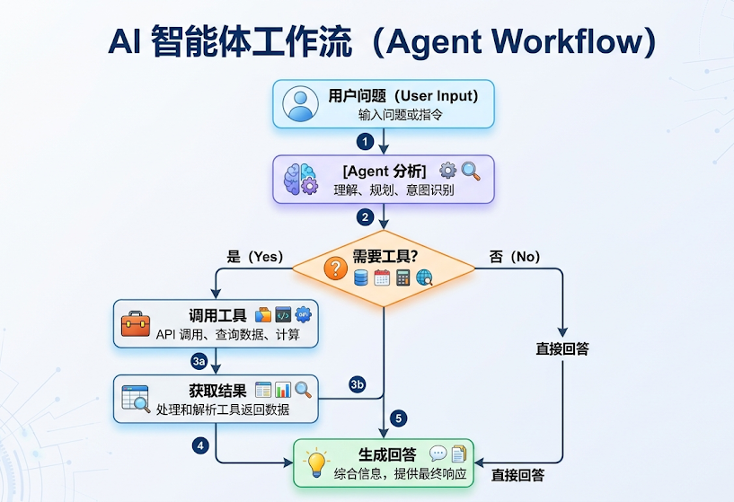

这里的工具可以是LangChain内置的，也可以是自定义的。LangChain生态中已经内置集成了非常多的实用工具，开发者可以快速调用这些工具完成更加复杂工作流的开发。

LangChain内置工具列表：<https://docs.langchain.com/oss/python/integrations/tools>

其中典型的工具如下：

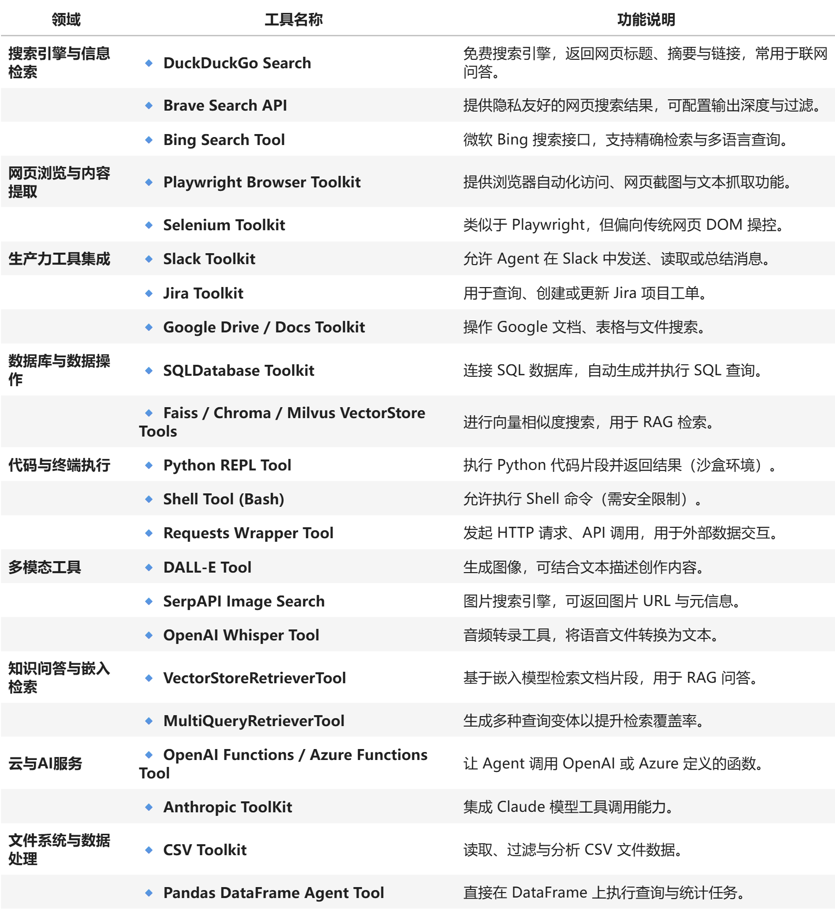

### 4.1 基本用法

Agents支持绑定一或多个工具。

#### 举例1：绑定一个工具

调用查询天气工具进行天气查询

```python
from langchain.agents import create_agent
from langchain.tools import tool
from rich import print as rprint


@tool(parse_docstring=True)
def get_weather(city: str) -> str:
    """
    天气查询工具

    Args:
        city: 城市名称
    """
    return f"{city}的天气为晴朗，25°C。"


agent = create_agent(
    model = model,
    tools=[get_weather]
)

resp = agent.invoke( {
    "messages": [
        {"role": "system", "content": "你是一个天气查询助手，只回答天气相关的问题，
其他问题请直接回答：我不清楚这问题答案。"},
        {"role": "user", "content": "北京的天气怎么样？"}
        # {"role": "user", "content": "100加上50等于多少？"}
    ]
})

rprint(resp)
```

以上代码运行结果如下：

```python
{
 'messages': [
     SystemMessage(
         content='你是一个天气查询助手，只回答天气相关的问题，其他问题请直接回
答：我不清楚这问题答案。',
         additional_kwargs={},
         response_metadata={},
         id='6f754fe0-7cd2-4e6b-a3a0-7592a71a7d20'
     ),
     HumanMessage(
         content='北京的天气怎么样？',
         additional_kwargs={},
         response_metadata={},
         id='ecf89457-2901-41d3-b960-ac8f7484d48e'
     ),
     AIMessage(
         content='',
         additional_kwargs={'refusal': None},
         response_metadata={
             'token_usage': {
                 'completion_tokens': 18,
                 'prompt_tokens': 162,
                 'total_tokens': 180,
                 'completion_tokens_details': {
                     'accepted_prediction_tokens': 0,
                     'audio_tokens': 0,
                     'reasoning_tokens': 0,
                     'rejected_prediction_tokens': 0
                 },
                 'prompt_tokens_details': {'audio_tokens': 0,
'cached_tokens': 0},
                 'latency_checkpoint': {
                     'engine_tbt_ms': 3,
                     'engine_ttft_ms': 48,
                     'engine_ttlt_ms': 110,
                     'pre_inference_ms': 102,
                     'service_tbt_ms': 4,
                     'service_ttft_ms': 312,
                     'service_ttlt_ms': 368,
                     'total_duration_ms': 274,
                     'user_visible_ttft_ms': 210
                 }
             },
             'model_provider': 'openai',
             'model_name': 'gpt-5.4-mini-2026-03-17',
             'system_fingerprint': None,
             'id': 'chatcmpl-DlavpIfl1rVj1nwpU8F39s8IAkexg',
             'service_tier': 'default',
             'finish_reason': 'tool_calls',
             'logprobs': None
         },
         id='lc_run--019e7e51-d485-7331-aa8b-cf03d9e23d7f-0',
         tool_calls=[
             {
                 'name': 'get_weather',
                 'args': {'city': '北京'},
                 'id': 'call_4dp4PGy6Ghaj5m6WcNkrwKFe',
                 'type': 'tool_call'
             }
         ],
         invalid_tool_calls=[],
         usage_metadata={
             'input_tokens': 162,
             'output_tokens': 18,
             'total_tokens': 180,
             'input_token_details': {'audio': 0, 'cache_read': 0},
             'output_token_details': {'audio': 0, 'reasoning': 0}
         }
     ),
     ToolMessage(
         content='北京的天气为晴朗，25°C。',
         name='get_weather',
         id='b5b82403-973c-463b-b9f2-2aa76e0bff77',
         tool_call_id='call_4dp4PGy6Ghaj5m6WcNkrwKFe'
     ),
     AIMessage(
         content='北京天气晴朗，25°C。',
         additional_kwargs={'refusal': None},
         response_metadata={
             'token_usage': {
                 'completion_tokens': 12,
                 'prompt_tokens': 200,
                 'total_tokens': 212,
                 'completion_tokens_details': {
                     'accepted_prediction_tokens': 0,
                     'audio_tokens': 0,
                     'reasoning_tokens': 0,
                     'rejected_prediction_tokens': 0
                 },
                 'prompt_tokens_details': {'audio_tokens': 0,
'cached_tokens': 0},
                 'latency_checkpoint': {
                     'engine_tbt_ms': 3,
                     'engine_ttft_ms': 34,
                     'engine_ttlt_ms': 71,
                     'pre_inference_ms': 94,
                     'service_tbt_ms': 3,
                     'service_ttft_ms': 272,
                     'service_ttlt_ms': 303,
                     'total_duration_ms': 219,
                     'user_visible_ttft_ms': 178
                 }
             },
             'model_provider': 'openai',
             'model_name': 'gpt-5.4-mini-2026-03-17',
             'system_fingerprint': None,
             'id': 'chatcmpl-Dlavq02DEdjb4JOBx3MTblngJKbTQ',
             'service_tier': 'default',
             'finish_reason': 'stop',
             'logprobs': None
         },
         id='lc_run--019e7e51-d9d7-7e81-bed0-cc990abfa293-0',
         tool_calls=[],
         invalid_tool_calls=[],
         usage_metadata={
             'input_tokens': 200,
             'output_tokens': 12,
             'total_tokens': 212,
             'input_token_details': {'audio': 0, 'cache_read': 0},
             'output_token_details': {'audio': 0, 'reasoning': 0}
         }
     )
 ]
}
```

进一步：

```python
from IPython.display import Image, display

display(Image(agent.get_graph().draw_mermaid_png()))
```

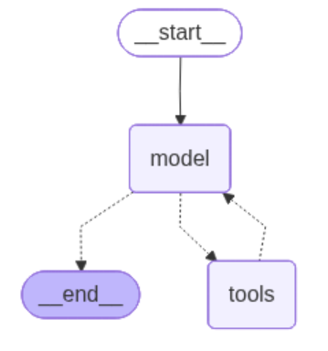

#### 举例2：接入内置工具

绑定内置的TavilySearch搜索工具，可以借助Tavily进行网络搜索和信息爬取。

这里我们需要先在tavily官网注册并获得API-KEY（每月有免费额度）：<https://www.tavily.com/>。

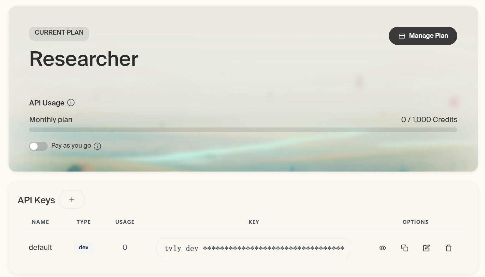

然后将API-KEY写到本地.env中的TAVILY_API_KEY 变量中，即可进行调用了。

```python
from langchain_tavily import TavilySearch
from dotenv import load_dotenv
import os

load_dotenv(override=True)

web_search = TavilySearch(
    tavily_api_key=os.getenv("TAVILY_API_KEY"),
    max_results=2
)

#这是一个高度封装的网络搜索工具，可以直接调用：
web_search.invoke("请问2026年足球世界杯有哪些参赛队？")
{'query': '请问2026年足球世界杯有哪些参赛队？',
'follow_up_questions': None,
'answer': None,
'images': [],
'results': [{'url': 'https://www.instagram.com/p/DWk8mU-geNg',
'title': '你準備好了嗎？ 2026 FIFA世界盃™ 48支隊伍全數到齊 ... - Instagram',
'content': '本屆賽事由美國、加拿大、墨西哥三國聯合主辦，總共48 支球隊、104 場比
賽、39 天賽程，這次的世界盃賽程本身就是前所未見的規模。',
'score': 0.9974885,
'raw_content': None},
{'url': 'https://zh.wikipedia.org/zh-
hans/2026%E5%B9%B4%E5%9C%8B%E9%9A%9B%E8%B6%B3%E5%8D%94%E4%B8%96%E7%95%8
C%E7%9B%83%E5%A4%96%E5%9C%8D%E8%B3%BD',
'title': '2026年国际足联世界杯预选赛 - 维基百科',
'content': '2026年国际足联世界杯预选赛是一项国家队足球预选赛赛事，以决定出哪些球队
能够参与由加拿大、墨西哥和美国联合举办的2026年国际足联世界杯。本届世界杯决赛周名额
增',
'score': 0.9974291,
'raw_content': None}],
'response_time': 0.79,
'request_id': 'dc00f93f-1b75-4222-86cc-4b6af567edf1'}
```

可以直接带入create_agent中作为外部工具。

```python
from langchain.chat_models import init_chat_model
from langchain.agents import create_agent
from langchain_tavily import TavilySearch
from dotenv import load_dotenv
import os
load_dotenv(override=True)
from rich import print as rprint

# 1.模型初始化
model = init_chat_model(
    model="gpt-5.4-mini",
    model_provider="openai",
    api_key=os.getenv("CLOSEAI_API_KEY"),
    base_url=os.getenv("CLOSEAI_BASE_URL")
)
# 2.工具实例化
web_search = TavilySearch(max_results=2)

# 3.创建Agent
agent = create_agent(
    model=model,
    tools=[web_search],
    #system_prompt="你是一名多才多艺的智能助手，可以调用工具帮助用户解决问题。"
)

# 4.运行Agent获得结果
result = agent.invoke(
    {"messages": [{"role": "user", "content": "请帮我查询2024年诺贝尔物理学奖得主
是谁？"}]}
)

# rprint(result)
print(result['messages'][-1].content)
2024年诺贝尔物理学奖得主是：

- **John J. Hopfield**
- **Geoffrey E. Hinton**

授奖理由是：**“为实现机器学习的人工神经网络奠定基础性的发现和发明”**。
```

如果仔细观察本次运行过程，本次工具调用仍然是一次典型的Function calling执行流程，包括用户首次发起消息在内，总共创建了4条消息，分别是human message、ai message (涉及function call message）、tool message（涉及function response message）以及ai message（涉及final responses）。

一次完整的Function calling 执行流程如下：

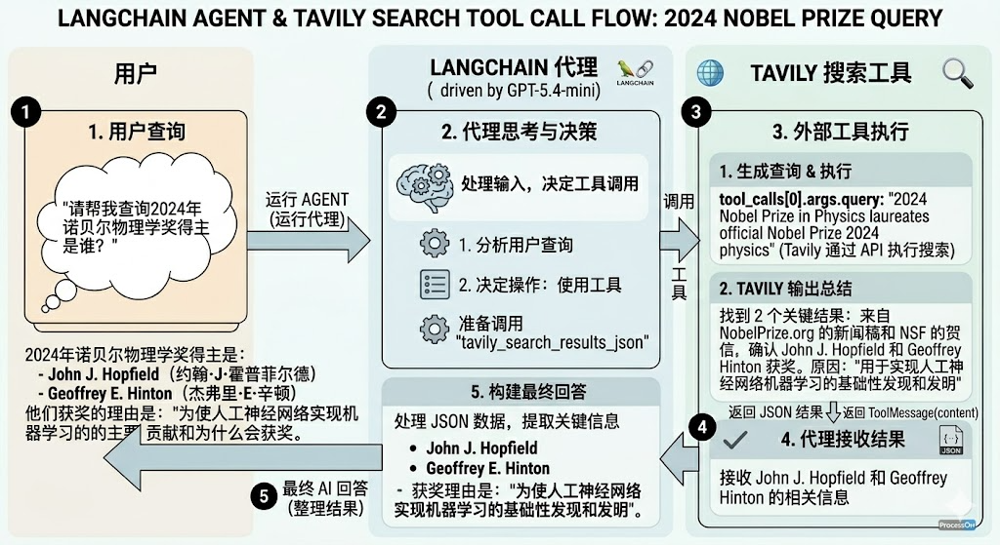

#### 举例3：绑定多个工具

```python
from langchain.agents import create_agent
from langchain.tools import tool
from dotenv import load_dotenv
from rich import print as rprint

load_dotenv()

@tool(parse_docstring=True)
def get_weather(city: str):
    """
    天气查询工具

    Args:
        city: 城市名称
    """
    return f"{city}今天天气挺好"

@tool(parse_docstring=True)
def get_news():
    """
    新闻查询工具
    """
    return "近期，受全球储蓄芯片短缺等多重因素影响，多地回收商称废旧手机回收市场迎来“火热
潮”，回收价格普遍上涨，旧手机成“香饽饽”。"

agent = create_agent(
    model,
    tools=[get_weather, get_news]
)
response = agent.invoke({
    "messages": ["你好，杭州今天的天气如何？今天有哪些新闻？"]
})

rprint(response)
```

输出

```python
{
 'messages': [
     HumanMessage(
         content='你好，杭州今天的天气如何？今天有哪些新闻？',
         additional_kwargs={},
         response_metadata={},
         id='6f69ed6d-76fe-4d1d-9e31-c00a4bedf623'
     ),
     AIMessage(
         content='',
         additional_kwargs={'refusal': None},
         response_metadata={
             'token_usage': {
                 'completion_tokens': 46,
                 'prompt_tokens': 152,
                 'total_tokens': 198,
                 'completion_tokens_details': {
                     'accepted_prediction_tokens': 0,
                     'audio_tokens': 0,
                     'reasoning_tokens': 0,
                     'rejected_prediction_tokens': 0
                 },
                 'prompt_tokens_details': {'audio_tokens': 0,
'cached_tokens': 0},
                 'latency_checkpoint': {
                     'engine_tbt_ms': 4,
                     'engine_ttft_ms': 32,
                     'engine_ttlt_ms': 197,
                     'pre_inference_ms': 90,
                     'service_tbt_ms': 4,
                     'service_ttft_ms': 272,
                     'service_ttlt_ms': 429,
                     'total_duration_ms': 348,
                     'user_visible_ttft_ms': 182
                 }
             },
             'model_provider': 'openai',
             'model_name': 'gpt-5.4-mini-2026-03-17',
             'system_fingerprint': None,
             'id': 'chatcmpl-DlcRS3bbpm4iVX6laeXtWj2vYnYMm',
             'service_tier': 'default',
             'finish_reason': 'tool_calls',
             'logprobs': None
         },
         id='lc_run--019e7eaa-6712-7323-91e6-8af52084b894-0',
         tool_calls=[
             {
                 'name': 'get_weather',
                 'args': {'city': '杭州'},
                 'id': 'call_w9ARuAgN8iqfG2GR7gv00iBq',
                 'type': 'tool_call'
             },
             {'name': 'get_news', 'args': {}, 'id':
'call_vOLekRymIme8bWuVQdIew4vu', 'type': 'tool_call'}
         ],
         invalid_tool_calls=[],
         usage_metadata={
             'input_tokens': 152,
             'output_tokens': 46,
             'total_tokens': 198,
             'input_token_details': {'audio': 0, 'cache_read': 0},
             'output_token_details': {'audio': 0, 'reasoning': 0}
         }
     ),
     ToolMessage(
         content='杭州今天天气挺好',
         name='get_weather',
         id='21da1cc4-1d26-4d5b-a04a-a836644274fc',
         tool_call_id='call_w9ARuAgN8iqfG2GR7gv00iBq'
     ),
     ToolMessage(
         content='近期，受全球储蓄芯片短缺等多重因素影响，多地回收商称废旧手机回
收市场迎来“火热潮”，回收价格普遍
上涨，旧手机成“香饽饽”。',
         name='get_news',
         id='d1fd947b-3d0f-47f5-9942-c4330f4d7fc6',
         tool_call_id='call_vOLekRymIme8bWuVQdIew4vu'
     ),
     AIMessage(
         content='杭州今天天气挺好。\n\n今天的新闻：\n1.
近期受全球储蓄芯片短缺等多重因素影响，多地回收商称废旧手机回收市场迎来“火热潮”，回收
价格普遍上涨，旧手机成了“香饽饽
”。\n\n如果你愿意，我也可以帮你继续整理成“天气 + 新闻摘要”的简版。',
         additional_kwargs={'refusal': None},
         response_metadata={
             'token_usage': {
                 'completion_tokens': 91,
                 'prompt_tokens': 272,
                 'total_tokens': 363,
                 'completion_tokens_details': {
                     'accepted_prediction_tokens': 0,
                     'audio_tokens': 0,
                     'reasoning_tokens': 0,
                     'rejected_prediction_tokens': 0
                 },
                 'prompt_tokens_details': {'audio_tokens': 0,
'cached_tokens': 0},
                 'latency_checkpoint': {
                     'engine_tbt_ms': 5,
                     'engine_ttft_ms': 38,
                     'engine_ttlt_ms': 466,
                     'pre_inference_ms': 83,
                     'service_tbt_ms': 5,
                     'service_ttft_ms': 265,
                     'service_ttlt_ms': 686,
                     'total_duration_ms': 610,
                     'user_visible_ttft_ms': 183
                 }
             },
             'model_provider': 'openai',
             'model_name': 'gpt-5.4-mini-2026-03-17',
             'system_fingerprint': None,
             'id': 'chatcmpl-DlcRTgUZZHsugIYnroPNDk3PXXQwW',
             'service_tier': 'default',
             'finish_reason': 'stop',
             'logprobs': None
         },
         id='lc_run--019e7eaa-6cac-7901-b58c-d677bf6135be-0',
         tool_calls=[],
         invalid_tool_calls=[],
         usage_metadata={
             'input_tokens': 272,
             'output_tokens': 91,
             'total_tokens': 363,
             'input_token_details': {'audio': 0, 'cache_read': 0},
             'output_token_details': {'audio': 0, 'reasoning': 0}
         }
     )
 ]
}
from IPython.display import Image, display

display(Image(agent.get_graph().draw_mermaid_png()))
```

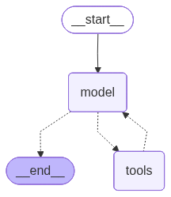

注意：只给 Agent 需要的工具，工具太多会混淆。一般2-5 个工具最佳

### 4.2 工具调用流程分析

LangChain 的 Agent 会将模型与工具结合起来，在实现上由一个基于 LangGraph 的图结构来编排执行流程，如下所示。

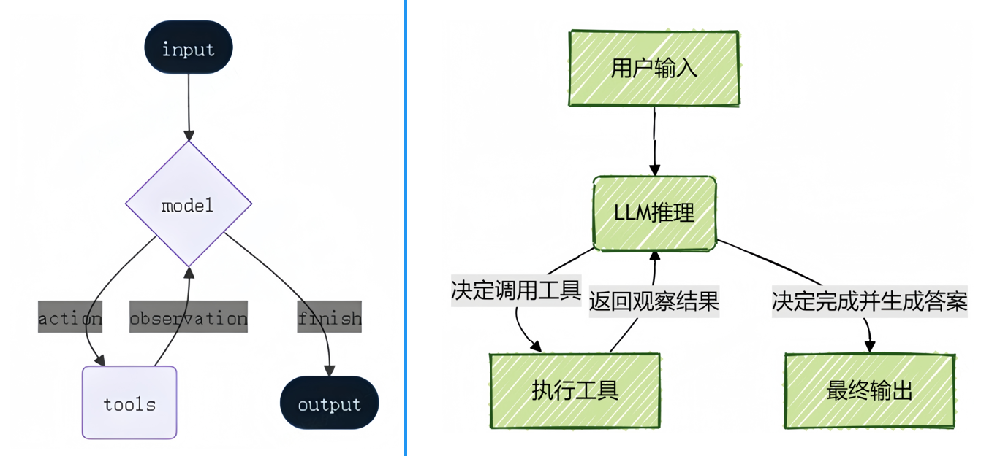

这与前文得到的 Agent 图结构是一致的，本质上就是经典的 ReAct 结构：一个具备“ 思考-行动-观察”不断循环的自主工作者。

```text
用户问题 → AI 思考 → 调用工具 → 观察结果 → 继续思考 → ... → 最终答案
```

当用户提出一个复杂需求时，Agent会像人类一样，先理解任务、规划步骤、使用合适的工具（如搜索网络、查询数据库、执行计算）获取信息，Agent 会在一个循环中反复调用模型和工具，直到某次模型输出中不再包含工具调用则结束，最后综合所有信息给出最终答案。

完整流程：

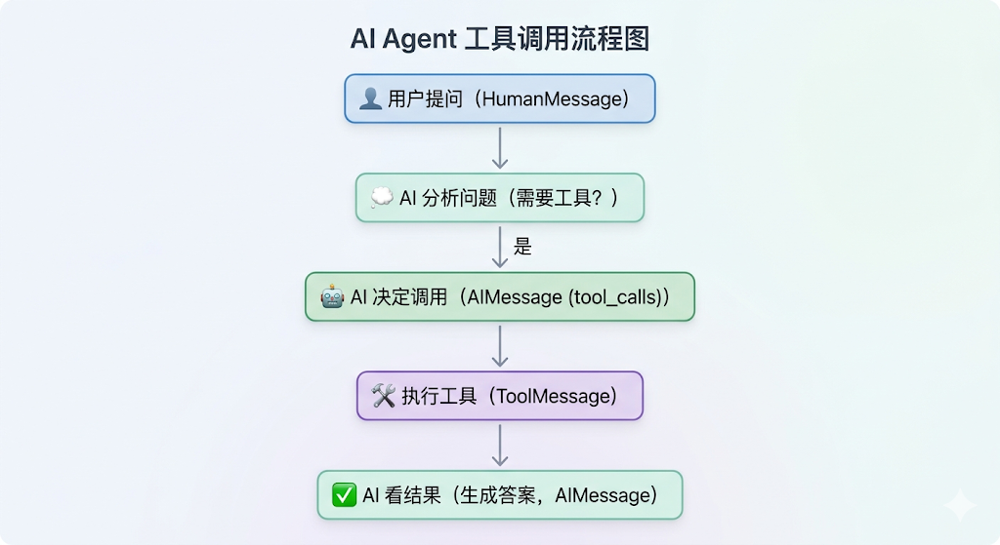

**举例：用户问题：“找出当前最流行的无线耳机并检查库存”的任务。**

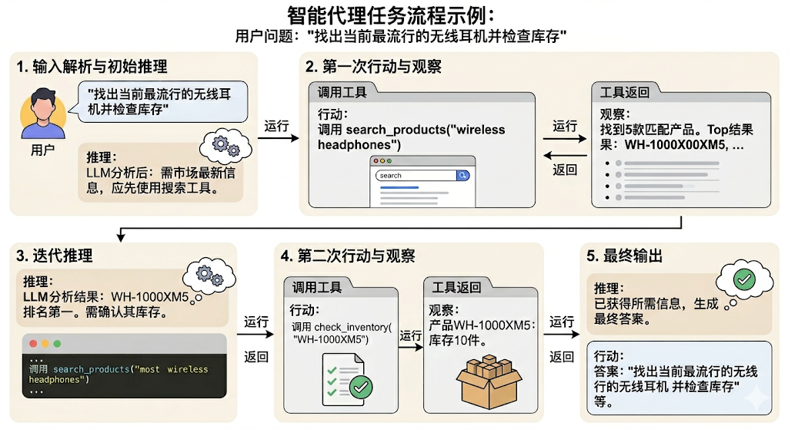

1、输入解析与初始推理

- 输入：用户查询：“找出当前最流行的无线耳机并检查库存”。

- 推理：LLM分析任务后认为：“要找出‘最流行’的产品，需要最新的市场信息，我应该先使用搜索工具。”

2、第一次行动(action)与观察(observation)

- 行动：Agent调用search_products工具，参数为“wireless headphones”。

- 观察：工具返回结果：“找到5款匹配产品。Top结果：WH-1000XM5, ...”

3、迭代推理

- 推理：LLM根据搜索结果分析：“WH-1000XM5是排名第一的型号。现在需要确认其库存状态才能回答用户问题。”

4、第二次行动(action)与观察(observation)

- 行动：Agent调用check_inventory工具，参数为“WH-1000XM5”。

- 观察：工具返回：“产品WH-1000XM5：库存10件。”

5、最终输出

- 推理：LLM综合所有信息后认为：“已获得所需信息，可以生成最终答案。”

- 行动：模型生成最终答案，不再调用工具。

### 4.3 重试机制

Agent可以在工具调用结果不满足要求时，自主重试。

```python
from langchain.agents import create_agent
from langchain.tools import tool
from langchain.messages import SystemMessage, HumanMessage
from dotenv import load_dotenv
from rich import print as rprint

load_dotenv(override=True)

flag = 0

@tool
def get_weather(city: str):
    """
    天气查询工具

    Args:
        city: 城市名称
    """
    global flag
    flag += 1

    if flag < 3:
        # raise Exception("暂时无法访问")
        return "TEMP_UNAVAILABLE: 天气服务暂时不可用，请稍后重试"

    return f"{city}今天天气挺好"


messages = [
    SystemMessage("""
    你是一个天气助手。
    当工具返回以 'TEMP_UNAVAILABLE:' 开头的结果时，
    说明是临时故障，不要立即放弃；
    你应再次调用同一个工具，最多重试 3 次。
    如果 3 次后仍失败，再向用户说明服务暂时不可用。
    """),
    HumanMessage("你好，杭州今天的天气如何？")
]
agent = create_agent(model, tools=[get_weather])
response = agent.invoke({"messages": messages})

# rprint(response)

for msg in response["messages"]:
    msg.pretty_print()
```

输出

```text
================================ System Message
================================


 你是一个天气助手。
 当工具返回以 'TEMP_UNAVAILABLE:' 开头的结果时，
 说明是临时故障，不要立即放弃；
 你应再次调用同一个工具，最多重试 3 次。
 如果 3 次后仍失败，再向用户说明服务暂时不可用。

================================ Human Message
=================================

你好，杭州今天的天气如何？
================================== Ai Message
==================================
Tool Calls:
  get_weather (call_cvICuCPSk4U7aWk6YYkAzI5o)
Call ID: call_cvICuCPSk4U7aWk6YYkAzI5o
Args:
 city: 杭州
================================= Tool Message
=================================
Name: get_weather

TEMP_UNAVAILABLE: 天气服务暂时不可用，请稍后重试
================================== Ai Message
==================================
Tool Calls:
get_weather (call_UQL2QTDxKaTCOXbY5Crwbae0)
Call ID: call_UQL2QTDxKaTCOXbY5Crwbae0
  Args:
 city: 杭州
================================= Tool Message
=================================
Name: get_weather

TEMP_UNAVAILABLE: 天气服务暂时不可用，请稍后重试
================================== Ai Message
==================================
Tool Calls:
get_weather (call_gZKuGbhp36wEyhjYgeupfu3b)
Call ID: call_gZKuGbhp36wEyhjYgeupfu3b
Args:
   city: 杭州
================================= Tool Message
=================================
Name: get_weather

杭州今天天气挺好
================================== Ai Message
==================================

杭州今天天气挺好。
```

模型三次调用get_weather，最终获得了满意的结果。

### 4.4 常见问题

**问题1：Agent 如何选择工具？**

依据：工具的 docstring

```python
@tool
def get_weather(city: str) -> str:
    """获取指定城市的天气信息"""  # ← AI Agent读这个！
    ...

@tool
def calculator(operation: str, a: float, b: float) -> str:
    """执行基本的数学计算"""  # ← AI Agent也读这个！
    ...
```

AI 会根据：

1. 问题内容

2. 每个工具的描述

3. 自动选择最匹配的工具

**问题2：Agent 为什么没有调用工具？**

原因：

- 工具的 docstring 不清晰

- 问题表述不明确

- 模型认为不需要工具

解决：

```python
# ❌ 不好
@tool
def tool1(x: str) -> str:
    """做一些事情"""  # 太模糊


# ✅ 好
@tool
def get_weather(city: str) -> str:
    """
    获取指定城市的实时天气信息

    Args:
        city: 城市名称，如"北京"、"上海"
    """
```

**问题3：Agent 选错工具？**

原因：

- 多个工具的功能描述相似

- 工具太多导致混淆

解决：

- 只给必要的工具

- 工具描述要有明确区分

- 在 system_prompt 中说明工具使用场景

```python
# ✅ 好：只给需要的工具
agent = create_agent(
    model=model,
    tools=[get_weather, calculator]  # 2-5 个工具最佳
)

# ❌ 不好：工具太多
agent = create_agent(
    model=model,
    tools=[tool1, tool2, ..., tool20]  # 会混淆
)
```

**问题4：如何知道 Agent 何时完成？**

当 AIMessage 不包含 tool_calls 时：

```python
for msg in response['messages']:
    if isinstance(msg, AIMessage):
        if hasattr(msg, 'tool_calls') and msg.tool_calls:
            print("还在调用工具...")
        else:
            print("完成！最终答案：", msg.content)
```

**问题5：Agent 可以调用多少次工具？**

默认没有限制，直到得到最终答案。但可能会：

- 超时

- 达到 token 限制

- 模型决定停止

**问题6：如何限制工具调用次数？**

LangChain 1.0 的 create_agent 默认使用 LangGraph，可以通过配置限制：

```python
# 注意：这是高级用法，后续会详细学习
config = {
    "recursion_limit": 5  # 最多 5 步
}

response = agent.invoke(input, config=config)
```
