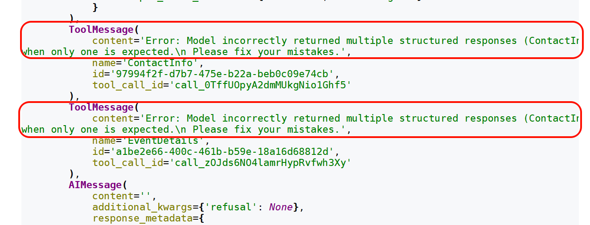
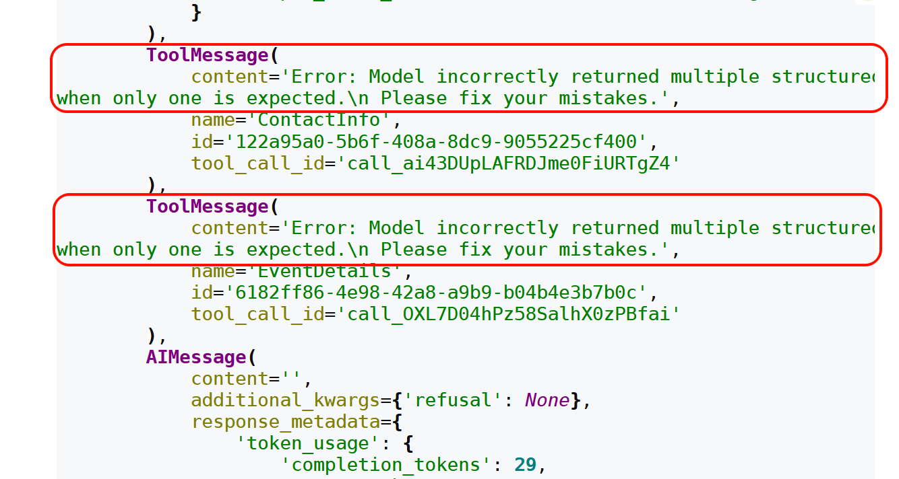
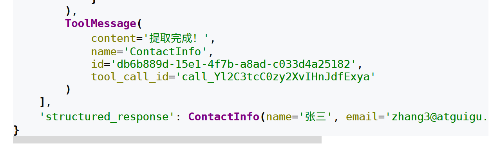
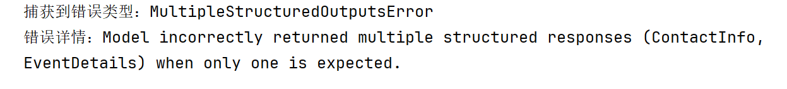
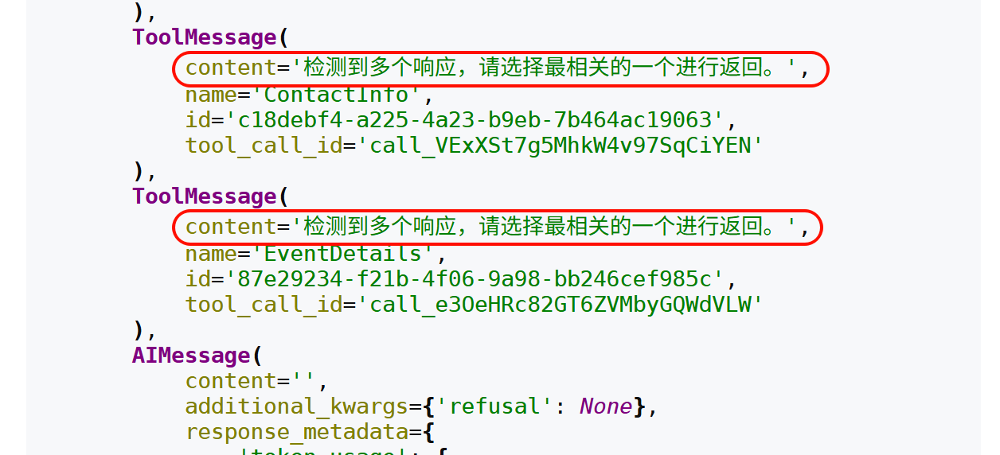

# 智能体：结构化输出

## 7、Agent的高级用法3：结构化输出

结构化输出是Agent的核心功能之一，它允许Agent以特定、可预测的格式返回数据，而不是传统的自然语言响应。通过结构化输出，开发者可以直接获得Pydantic模型、JSON对象或数据类等结构化数据，这些数据能够被应用程序直接使用，无需复杂的解析过程。

### 7.1 模型 vs Agent的结构化输出对比

第06章已经介绍过结构化输出，当时的重点是与模型对象的绑定，这里与Agent的结构化输出做对比：

**维度模型的结构化输出Agent 结构化输出**

**操作**

对象作用于大模型对象作用于Agent

**解析**

**时机**

**数据**

流转模型结构化对象模型工具反思...结构化对象

**绑定**

方式使用with_structured_output使用response_format 参数

**适用**

**场景**

### 7.2 结构化输出的4种策略

LangChain的create_agent()函数自动处理结构化输出的全过程。用户只需通过“response_format”参数设置期望的输出模式（Schema）。

当模型生成结构化数据时，系统会自动捕获、验证并将结果存储在Agent状态的structured_response键中。

```python
def create_agent(
    ...
    response_format: Union[
        ToolStrategy[StructuredResponseT],
        ProviderStrategy[StructuredResponseT],
        type[StructuredResponseT],
        None,
    ]
```

create_agent函数中的response_format参数支持四种不同的策略设置方式：

#### ① ProviderStrategy

使用模型提供商的原生结构化输出功能实现结构化输出。

- 这里所说的“原生结构化输出”指的是大语言模型（LLM）提供商通过其API直接提供的、在模型响应阶段就强制保证输出格式符合预定规范的能力，这种能力能够在模型生成内容的源头确保结构化准确性。

- 适用于支持原生结构化输出的模型，比如OpenAI、Anthropic Claude或xAI Grok等。

举例：

```python
from pydantic import BaseModel, Field
from langchain.agents import create_agent
from langchain.agents.structured_output import ProviderStrategy
from langchain.messages import HumanMessage
from rich import print as rprint
from langchain.chat_models import init_chat_model
from dotenv import load_dotenv
import os

load_dotenv(override=True)

# 1.模型初始化
model = init_chat_model(
    model="gpt-5.4-mini",
    model_provider="openai",
    api_key=os.getenv("CLOSEAI_API_KEY"),
    base_url=os.getenv("CLOSEAI_BASE_URL")
)
# 2.Pydantic结构化方式定义
class ContactInfo(BaseModel):
    """用户的联系方式"""
    name: str = Field(description="用户姓名")
    email: str = Field(description="用户邮箱地址")
    phone: str = Field(description="用户的手机号")

# 3.agent初始化
agent = create_agent(
    model=model,
    response_format=ProviderStrategy(ContactInfo)
)

# 4.调用
response = agent.invoke({
        "messages": [
            HumanMessage("从这段话中抽取结构化信息：小明的邮箱地址为：
shkstart@atguigu.com，手机号：12345678912")
        ]
    }
)

# rprint(response)

for msg in response["messages"]:
    msg.pretty_print()
```

输出

```text
================================ Human Message
=================================

从这段话中抽取结构化信息：小明的邮箱地址为：shkstart@atguigu.com，手机号：
12345678912
================================== Ai Message
==================================

{"name":"小明","email":"shkstart@atguigu.com","phone":"12345678912"}
```

#### ② ToolStrategy

对于不支持原生结构化输出的模型，LangChain采用“ToolStrategy”工具调用的方式实现结构化输出。

此策略兼容绝大多数支持工具调用的现代模型，其核心原理是动态创建一个" 虚拟工具"，该工具的输入参数对应着期望的数据结构。

当模型需要生成最终答案时，系统会引导模型"调用"这个虚拟工具，从而间接产生符合要求的结构化数据。

举例：

```python
from pydantic import BaseModel
from langchain.agents import create_agent
from langchain.agents.structured_output import ToolStrategy
from langchain.chat_models import init_chat_model
from dotenv import load_dotenv
import os

load_dotenv(override=True)

# 1.模型初始化
model = init_chat_model(
    model="gpt-5.4-mini",
    model_provider="openai",
    api_key=os.getenv("CLOSEAI_API_KEY"),
    base_url=os.getenv("CLOSEAI_BASE_URL")
)

# 2.Pydantic结构化方式定义
class ContactInfo(BaseModel):
    name: str = Field(description="姓名")
    email: str = Field(description="邮箱")
    phone: str = Field(description="电话")

# 3.工具的定义（根据需要定义）
@tool
def search_tool(query: str) -> str:
    """这是一个搜索引擎。当大模型发现给定的上下文里缺少必要的联系人信息，
    需要去互联网上查询时，才会调用这个工具。
    """
    return f"搜索结果: 未找到关于 '{query}' 的更多额外信息。"

# 3.agent初始化
agent = create_agent(
    model=model,
    tools=[search_tool],
    response_format=ToolStrategy(ContactInfo)
)

result = agent.invoke({
    "messages": [{"role": "user", "content": "联系人信息: John Doe,
john@atguigu.com, (010) 56253825"}]
})

# print(result)
print(result["structured_response"])
name='John Doe' email='john@atguigu.com' phone='(010) 56253825'
```

#### ③ type / AutoStrategy

官方没有在参数列表或官方文档列出这种策略，但阅读源码可以看到。

```text
ResponseFormat = ToolStrategy[SchemaT] | ProviderStrategy[SchemaT] |
AutoStrategy[SchemaT]
"""Union type for all supported response format strategies."""
```

当我们直接传入一个定义类型时，LangChain会自动包装为AutoStrategy，触发自动选择策略：如果模型支持原生结构化输出（如OpenAI、Anthropic Claude或xAI Grok），则优先使用ProviderStrategy；否则使用ToolStrategy。

举例1：

```python
from langchain.agents.structured_output import AutoStrategy
from pydantic import BaseModel, Field
from langchain.agents import create_agent


class ContactInfo(BaseModel):
    """联系人信息"""
    name: str = Field(description="姓名")
    email: str = Field(description="邮箱")
    phone: str = Field(description="电话")


agent = create_agent(
    model=model,
    response_format=AutoStrategy(ContactInfo)
)

result = agent.invoke({
    "messages": [{"role": "user", "content": "联系人信息: John Doe,
john@atguigu.com, (010) 56253825"}]
})

# print(result)
print(result["structured_response"])
```

输出

```text
name='John Doe' email='john@atguigu.com' phone='(010) 56253825'
```

特别注意：在LangChain 1.0及以上版本中，直接传递模式（如response_format=ContactInfo）不再支持，必须显式使用ToolStrategy或ProviderStrategy。（经过测试，目前LangChain 1.2版本还可使用）。

举例2：

```python
from pydantic import BaseModel, Field
from langchain.agents import create_agent


class ContactInfo(BaseModel):
    """联系人信息"""
    name: str = Field(description="姓名")
    email: str = Field(description="邮箱")
    phone: str = Field(description="电话")

agent = create_agent(
    model=model,
    response_format=ContactInfo  # Auto-selects ProviderStrategy
)

result = agent.invoke({
    "messages": [{"role": "user", "content": "联系人信息: John Doe,
john@atguigu.com, (010) 56253825"}]
})

# print(result)
print(result["structured_response"])
name='John Doe' email='john@atguigu.com' phone='(010) 56253825'
```

#### ④ None

默认配置，表示不以结构化输出，以自然语言响应用户问题。

**总结：**

在实际大模型Agent开发场景中，如果使用到了结构化输出，推荐使用“ToolStrategy”策略，所以后续重点介绍这种策略方式结构化输出。

### 7.3 ToolStrategy使用详解

ToolStrategy通过工具调用（Tool Calling/Function Calling）实现结构化输出，所以LangChain会在消息列表末尾追加一条ToolMessage，让整个链路完整。但实际上没有实际的工具执行，这是一条伪消息。

ToolStrategy适用于任何支持工具调用的现代模型。

ToolStrategy的配置包含三个主要参数：

```python
class ToolStrategy(Generic[SchemaT]):
    schema: type[SchemaT]
    tool_message_content: str | None
    handle_errors: Union[bool, str, type[Exception], tuple[type[Exception],
...], Callable[[Exception], str]]
```

- schema（必需参数）：与提供商策略的schema参数功能一致，支持Pydantic模型、TypedDict、JSON Schema、数据类(@dataclass)，同时还支持联合类型Union[类型1, 类型2] （允许模型根据输入内容选择最匹配的数据结构）。

- tool_message_content（可选参数）：用于自定义生成结构化输出时，会话历史中记录的提示信息。默认使用展示输出数据的标准响应语句。

- handle_errors（可选参数）：用于指定数据校验失败时的重试策略，默认值为True。

#### 7.3.1 结构化输出：schema参数

下面演示四种Schema进行结构化输出代码实现。

提前说明：因为涉及到不同的Schema在不同模型供应商下表现的支持力度不同（上一章有说明，这里提供了两个模型供应商，大家自己选择）

使用CloseAI平台的模型：

```python
from langchain.chat_models import init_chat_model
from dotenv import load_dotenv
import os

# 从.env文件中加载环境变量
load_dotenv(override=True)

CLOSEAI_API_KEY = os.getenv("CLOSEAI_API_KEY")
CLOSEAI_BASE_URL = os.getenv("CLOSEAI_BASE_URL")

model = init_chat_model(
    model="gpt-5.4-mini",
    model_provider="openai",
    api_key=CLOSEAI_API_KEY,
    base_url=CLOSEAI_BASE_URL
)
```

使用OpenRouter平台的模型（使用梯子）：

```python
from langchain_openrouter import ChatOpenRouter
from dotenv import load_dotenv
import os

load_dotenv(override=True)

OPENROUTER_API_KEY = os.getenv("OPENROUTER_API_KEY")
OPENROUTER_API_BASE = os.getenv("OPENROUTER_API_BASE")

model = ChatOpenRouter(
    model="openai/gpt-5.4-mini",
    api_key=OPENROUTER_API_KEY,
    base_url=OPENROUTER_API_BASE,
)
```

**输出模式1：Pydantic类型**

Pydantic类型的Schema支持数据验证，是优先推荐使用的方式。

举例1：

```python
from pydantic import BaseModel, Field
from langchain.agents.structured_output import ToolStrategy
from langchain.agents import create_agent
from langchain.messages import HumanMessage

class ContactInfo(BaseModel):
    """用户的联系方式"""
    name: str = Field(description="用户姓名")
    email: str = Field(description="用户邮箱地址")
    phone: str = Field(description="用户的手机号")


agent = create_agent(
    model=model,
    response_format=ToolStrategy(ContactInfo)
)

response = agent.invoke({
        "messages": [
            HumanMessage("从这段话中抽取结构化信息：小明的邮箱地址为：
songhk@atguigu.com，手机号：12345678912")
        ]
    }
)

for msg in response["messages"]:
    msg.pretty_print()

# print(response["structured_response"])
```

输出

```text
================================ Human Message
=================================

从这段话中抽取结构化信息：小明的邮箱地址为：songhk@atguigu.com，手机号：
12345678912
================================== Ai Message
==================================
Tool Calls:
 ContactInfo (call_0ULr5y5MWny1wAgv2JXLDDyO)
Call ID: call_0ULr5y5MWny1wAgv2JXLDDyO
 Args:
    name: 小明
    email: songhk@atguigu.com
    phone: 12345678912
================================= Tool Message
=================================
Name: ContactInfo

Returning structured response: name='小明' email='songhk@atguigu.com'
phone='12345678912'
```

观察日志可知，这种方式将结构化信息作为伪工具传递，显然使用了Function Calling方法。

举例2：

```python
from langchain_core.messages import SystemMessage
from pydantic import BaseModel, Field
from typing import Literal
from langchain.agents import create_agent
from langchain.agents.structured_output import ToolStrategy
from langchain.tools import tool
from rich import print as rprint

# 定义工具
@tool(parse_docstring=True)
def search_customer_database(query: str) -> str:
    """
    在客户数据库中搜索信息

    Args:
        query (str): 客户查询字符串，例如 "张三" 或 "李四"

    Returns:
        str: 客户记录字符串，包含客户姓名、等级、最近购买日期和累计消费
    """
    # 模拟数据库查询结果
    if "张三" in query.lower():
        return "客户记录：张三，VIP客户，最近购买日期：2026-01-15，累计消费：
$15,000"
    elif "李四" in query.lower():
        return "客户记录：李四，普通客户，最近购买日期：2025-12-20，累计消费：$3,200"
    else:
        return f"关于客户{query}，无记录"


@tool(parse_docstring=True)
def send_email(customer: str) -> str:
    """
    发送感谢邮件

    Args:
        customer (str): 客户名称，例如 "张三" 或 "李四"

    Returns:
        str: 确认消息，包含已发送的客户名称
    """
    return f"已向 {customer} 发送感谢邮件"


# 定义Pydantic Schema
class CustomerAnalysis(BaseModel):
    """客户分析报告"""
    customer_name: str = Field(None, description="客户姓名")
    customer_tier: Literal["潜在客户", "普通客户", "VIP客户", "流失风险"] =
Field("潜在客户",description="客户等级,只能是潜在客户、普通客户、VIP客户或流失风险")
    recent_activity: str = Field(None, description="最近活动")
    spending_level: Literal["低", "中", "高"] = Field(None, description="消费
水平")
    send_email: bool = Field(False, description="是否已发送感谢邮件")


# 创建智能体
agent = create_agent(
    model=model,
    system_prompt=SystemMessage(content=""
                                        "请分析指定客户的情况："
                                        "1. 先搜索客户数据库了解最新情况 "
                                        "2. 如果是VIP客户，则发送感谢邮件 "
                                        "3. 基于搜索结果生成结构化分析报告 "
                                        "4. 如果用户提问与客户记录无关或找不到客户
信息，则返回空对象，不发送感谢邮件"
                                ),
    tools=[search_customer_database, send_email],
    response_format=ToolStrategy(CustomerAnalysis)
)

# 执行分析
result = agent.invoke({
    "messages": [{"role": "user", "content": "请分析客户张三"}]
    # "messages": [{"role": "user","content": "请分析客户李四"}]
    # "messages": [{"role": "user","content": "请分析客户王五"}]
    # "messages": [{"role": "user","content": "今天天气如何"}]
})

# 处理结果
# rprint(result)

if "structured_response" in result:
    analysis = result["structured_response"]
    print(analysis)
customer_name='张三' customer_tier='VIP客户' recent_activity='最近购买日期：
2026-01-15' spending_level='高' send_email=True
```

注意：

1. 如果是结构化输出，在系统提示词中最后提示结构化输出结果，如果提示词中先结构化输出结果

（Agent已经执行完成），可能会导致一些工具不会再被调用。

2. 系统提示词中最后加入“未找到用户”时的处理提示，避免程序一直调用工具尝试查找对应用户信

息。

**输出模式2：TypedDict类型**

TypedDict 允许为字典对象定义固定的键名和对应的值类型，是带有类型提示的字典结构。具体的：

1. TypedDict字段定义采用 Annotated[类型，默认值，"描述"]格式

2. 可选字段使用 Optional包装，默认值在 Annotated 中指定

3. TypedDict 不支持运行时验证。

举例1：

```python
from typing import TypedDict, Annotated
from langchain.agents.structured_output import ToolStrategy
from langchain.agents import create_agent
from langchain.messages import HumanMessage


class ContactInfo(TypedDict):
    """用户的联系方式"""
    name: Annotated[str, ..., "用户姓名"]
    email: Annotated[str, ..., "用户邮箱地址"]
    phone: Annotated[str, ..., "用户的手机号"]

agent = create_agent(
    model=model,
    response_format=ToolStrategy(ContactInfo)
)

response = agent.invoke({
        "messages": [
            HumanMessage("从这段话中抽取结构化信息：小明的邮箱地址为：
songhk@atguigu.com，手机号：12345678912")
        ]
    }
)

for msg in response["messages"]:
    msg.pretty_print()

# print(response["structured_response"])
================================ Human Message
=================================

从这段话中抽取结构化信息：小明的邮箱地址为：songhk@atguigu.com，手机号：
12345678912
================================== Ai Message
==================================
Tool Calls:
ContactInfo (call_cyte01flJ8pJnPcsq7Gkb5V7)
Call ID: call_cyte01flJ8pJnPcsq7Gkb5V7
Args:
 name: 小明
 email: songhk@atguigu.com
 phone: 12345678912
================================= Tool Message
=================================
Name: ContactInfo

Returning structured response: {'name': '小明', 'email':
'songhk@atguigu.com', 'phone': '12345678912'}
```

举例2：

```python
from langchain_core.messages import SystemMessage
from typing import Literal, Optional
from langchain.agents import create_agent
from langchain.agents.structured_output import ToolStrategy
from langchain.tools import tool


# 定义工具
@tool(parse_docstring=True)
def search_customer_database(query: str) -> str:
    """
    在客户数据库中搜索信息

    Args:
        query (str): 客户查询字符串，例如 "张三" 或 "李四"

    Returns:
        str: 客户记录字符串，包含客户姓名、等级、最近购买日期和累计消费
    """
    # 模拟数据库查询结果
    if "张三" in query.lower():
        return "客户记录：张三，VIP客户，最近购买日期：2026-01-15，累计消费：
$15,000"
    elif "李四" in query.lower():
        return "客户记录：李四，普通客户，最近购买日期：2025-12-20，累计消费：$3,200"
    else:
        return f"关于客户{query}，无记录"


@tool(parse_docstring=True)
def send_email(customer: str) -> str:
    """
    发送感谢邮件

    Args:
        customer (str): 客户名称，例如 "张三" 或 "李四"

    Returns:
        str: 确认消息，包含已发送的客户名称
    """
    return f"已向 {customer} 发送感谢邮件"


# 使用 TypedDict 定义客户分析报告 Schema
class CustomerAnalysis(TypedDict):
    """客户分析报告"""
    customer_name: Annotated[Optional[str], None, "客户姓名"]
    customer_tier: Annotated[Literal["潜在客户", "普通客户", "VIP客户", "流失风
险"], "潜在客户", "客户等级"]
    recent_activity: Annotated[Optional[str], None, "最近活动"]
    spending_level: Annotated[Optional[Literal["低", "中", "高"]], None, "消费
水平"]
    send_email: Annotated[bool, False, "是否已发送感谢邮件"]


# 创建智能体
agent = create_agent(
    model=model,
    system_prompt=SystemMessage(content=""
                                        "请分析指定客户的情况："
                                        "1. 先搜索客户数据库了解最新情况 "
                                        "2. 如果是VIP客户，则发送感谢邮件 "
                                        "3. 基于搜索结果生成结构化分析报告 "
                                        "4. 如果用户提问与客户记录无关或找不到客户
信息，则返回空对象，不发送感谢邮件"
                                ),
    tools=[search_customer_database, send_email],
    response_format=ToolStrategy(CustomerAnalysis)
)

# 执行分析
result = agent.invoke({
    "messages": [{"role": "user", "content": "请分析客户张三"}]
    # "messages": [{"role": "user","content": "请分析客户李四"}]
    # "messages": [{"role": "user","content": "请分析客户王五"}]
    # "messages": [{"role": "user","content": "今天天气如何"}]
})

# 处理结果
# print("result:", result)
if "structured_response" in result:
    analysis = result["structured_response"]
    print(analysis)
{'customer_name': '张三', 'customer_tier': 'VIP客户', 'recent_activity':
'最近购买日期：2026-01-15，累计消费：$15,000', 'spending_level': '高',
'send_email': True}
```

**输出模式3：JsonSchema类型**

JSON Schema是提供一个标准的 JSON Schema 字典来定义结构。适合需要与多种编程语言交互或进行复杂数据约束定义的场景。

举例1：

```python
from langchain.agents import create_agent
from langchain.messages import HumanMessage


json_schema = {
    "title": "ContactInfo",
    "description": "用户的联系方式",
    "type": "object",
    "properties": {
        "name": {
            "description": "用户姓名",
            "type": "string"
        },
        "email": {
            "description": "用户邮箱地址",
            "type": "string"
        },
        "phone": {
            "description": "用户的手机号",
            "type": "string"
        }
    },
    "required": [
        "name",
        "email",
        "phone"
    ]
}

agent = create_agent(
    model=model,
    response_format=ToolStrategy(json_schema)
)

response = agent.invoke(
    {
        "messages": [
            HumanMessage("从这段话中抽取结构化信息：小明的邮箱地址为：
songhk@atguigu.com，手机号：12345678912")
        ]
    }
)

for msg in response["messages"]:
    msg.pretty_print()

# print(response["structured_response"])
```

输出

```text
================================ Human Message
=================================

从这段话中抽取结构化信息：小明的邮箱地址为：songhk@atguigu.com，手机号：
12345678912
================================== Ai Message
==================================
Tool Calls:
ContactInfo (call_4Q8JPgCttdnV9AHZEpNgSyuM)
Call ID: call_4Q8JPgCttdnV9AHZEpNgSyuM
Args:
 name: 小明
 email: songhk@atguigu.com
 phone: 12345678912
================================= Tool Message
=================================
Name: ContactInfo

Returning structured response: {'name': '小明', 'email':
'songhk@atguigu.com', 'phone': '12345678912'}
```

举例2：

```python
from langchain_core.messages import SystemMessage
from typing import Literal, Optional
from langchain.agents import create_agent
from langchain.agents.structured_output import ToolStrategy
from langchain.tools import tool


# 定义工具
@tool(parse_docstring=True)
def search_customer_database(query: str) -> str:
    """
    在客户数据库中搜索信息

    Args:
        query (str): 客户查询字符串，例如 "张三" 或 "李四"

    Returns:
        str: 客户记录字符串，包含客户姓名、等级、最近购买日期和累计消费
    """
    # 模拟数据库查询结果
    if "张三" in query.lower():
        return "客户记录：张三，VIP客户，最近购买日期：2026-01-15，累计消费：
$15,000"
    elif "李四" in query.lower():
        return "客户记录：李四，普通客户，最近购买日期：2025-12-20，累计消费：
$3,200"
    else:
        return f"关于客户{query}，无记录"


@tool(parse_docstring=True)
def send_email(customer: str) -> str:
    """
    发送感谢邮件

    Args:
        customer (str): 客户名称，例如 "张三" 或 "李四"

    Returns:
        str: 确认消息，包含已发送的客户名称
    """
    return f"已向 {customer} 发送感谢邮件"


# 定义 JSON Schema 替代 Pydantic 模型
customer_analysis_schema = {
    "title": "CustomerAnalysis",
    "type": "object",
    "description": "客户分析报告",
    "properties": {
        "customer_name": {
            "type": "string",
            "default": "",
            "description": "客户姓名"
        },
        "customer_tier": {
            "type": "string",
            "enum": ["潜在客户", "普通客户", "VIP客户", "流失风险"],
            "default": "潜在客户",
            "description": "客户等级"
        },
        "recent_activity": {
            "type": "string",
            "default": "",
            "description": "最近活动"
        },
        "spending_level": {
            "type": "string",
            "enum": ["低", "中", "高"],
            "default": "低",
            "description": "消费水平"
        },
        "send_email": {
            "type": "boolean",
            "default": False,
            "description": "是否已发送感谢邮件"
        }
    },
    # 所有字段都是必须输出的
    "required": ["customer_name", "customer_tier", "recent_activity",
"spending_level"]
}

# 创建智能体
agent = create_agent(
    model=model,
    system_prompt=SystemMessage(content=""
                                        "请分析指定客户的情况："
                                        "1. 先搜索客户数据库了解最新情况 "
                                        "2. 如果是VIP客户，则发送感谢邮件 "
                                        "3. 基于搜索结果生成结构化分析报告 "
                                        "4. 如果用户提问与客户记录无关或找不到客
户信息，则返回空对象，不发送感谢邮件"
                                ),
    tools=[search_customer_database, send_email],
    response_format=ToolStrategy(customer_analysis_schema)
)

# 执行分析
result = agent.invoke({
    "messages": [{"role": "user", "content": "请分析客户张三"}]
    # "messages": [{"role": "user","content": "请分析客户李四"}]
    # "messages": [{"role": "user","content": "请分析客户王五"}]
    # "messages": [{"role": "user","content": "今天天气如何"}]
})

# 处理结果
# print("result:", result)
if "structured_response" in result:
    analysis = result["structured_response"]
    print(analysis)
{'customer_name': '张三', 'customer_tier': 'VIP客户', 'recent_activity':
'最近购买日期：2026-01-15，累计消费：$15,000', 'spending_level': '高',
'send_email': True}
```

注意以上代码中定义json_schema的时候指定的title, description, type, properties, required是遵循JSON Schema 规范的标准关键字，是固定写法。具体细节在第06章2.3节已经介绍过了。

**输出模式4：@dataclass类型**

@dataclass是Python 3.7引入的一个装饰器，用于简化数据存储类的定义。

举例1：

```python
from dataclasses import dataclass
from langchain.agents import create_agent
from langchain.messages import HumanMessage

@dataclass
class ContactInfo:
    """用户的联系方式"""
    name: str = Field(description="用户姓名")
    email: str = Field(description="用户邮箱地址")
    phone: str = Field(description="用户的手机号")


agent = create_agent(
    model=model,
    response_format=ToolStrategy(ContactInfo)
)

response = agent.invoke(
    {
        "messages": [
            HumanMessage("从这段话中抽取结构化信息：小明的邮箱地址为：
songhk@atguigu.com，手机号：12345678912")
        ]
    }
)

for msg in response["messages"]:
    msg.pretty_print()

# print(response["structured_response"])
================================ Human Message
=================================

从这段话中抽取结构化信息：小明的邮箱地址为：songhk@atguigu.com，手机号：
12345678912
================================== Ai Message
==================================
Tool Calls:
ContactInfo (call_3MRoBpJHDaoYB6jK7plgW1YF)
Call ID: call_3MRoBpJHDaoYB6jK7plgW1YF
Args:
 name: 小明
 email: songhk@atguigu.com
 phone: 12345678912
================================= Tool Message
=================================
Name: ContactInfo

Returning structured response: ContactInfo(name='小明',
email='songhk@atguigu.com', phone='12345678912')
```

举例2：

```python
from langchain_core.messages import SystemMessage
from pydantic import BaseModel, Field
from typing import Literal
from langchain.agents import create_agent
from langchain.agents.structured_output import ToolStrategy
from langchain.tools import tool


# 定义工具
@tool(parse_docstring=True)
def search_customer_database(query: str) -> str:
    """
    在客户数据库中搜索信息

    Args:
        query (str): 客户查询字符串，例如 "张三" 或 "李四"

    Returns:
        str: 客户记录字符串，包含客户姓名、等级、最近购买日期和累计消费
    """
    # 模拟数据库查询结果
    if "张三" in query.lower():
        return "客户记录：张三，VIP客户，最近购买日期：2026-01-15，累计消费：
$15,000"
    elif "李四" in query.lower():
        return "客户记录：李四，普通客户，最近购买日期：2025-12-20，累计消费：$3,200"
    else:
        return f"关于客户{query}，无记录"


@tool(parse_docstring=True)
def send_email(customer: str) -> str:
    """
    发送感谢邮件

    Args:
        customer (str): 客户名称，例如 "张三" 或 "李四"

    Returns:
        str: 确认消息，包含已发送的客户名称
    """
    return f"已向 {customer} 发送感谢邮件"


# 使用Dataclass定义Schema
@dataclass
class CustomerAnalysis:
    """客户分析报告"""
    customer_name: str = Field(None, description="客户姓名")
    customer_tier: Literal["潜在客户", "普通客户", "VIP客户", "流失风险"] =
Field("潜在客户",

     description="客户等级,只能是潜在客户、普通客户、VIP客户或流失风险")
    recent_activity: str = Field(None, description="最近活动")
    spending_level: Literal["低", "中", "高"] = Field(None, description="消费
水平")
    send_email: bool = Field(False, description="是否已发送感谢邮件")


# 创建智能体
agent = create_agent(
    model=model,
    system_prompt=SystemMessage(content=""
                                        "请分析指定客户的情况："
                                        "1. 先搜索客户数据库了解最新情况 "
                                        "2. 如果是VIP客户，则发送感谢邮件 "
                                        "3. 基于搜索结果生成结构化分析报告 "
                                        "4. 如果用户提问与客户记录无关或找不到客户
信息，则返回空对象，不发送感谢邮件"
                                ),
    tools=[search_customer_database, send_email],
    response_format=ToolStrategy(CustomerAnalysis)
)

# 执行分析
result = agent.invoke({
    "messages": [{"role": "user", "content": "请分析客户张三"}]
    # "messages": [{"role": "user","content": "请分析客户李四"}]
    # "messages": [{"role": "user","content": "请分析客户王五"}]
    # "messages": [{"role": "user","content": "今天天气如何"}]
})

# 处理结果
# print("result:", result)
if "structured_response" in result:
    analysis = result["structured_response"]
    print(analysis)
CustomerAnalysis(customer_name='张三', customer_tier='VIP客户',
recent_activity='最近购买日期：2026-01-15', spending_level='高',
send_email=True)
```

**多schema联合模式**

ToolStrategy允许指定多个类型“ Union[类型1, 类型2] ”这种写法，LLM能够根据输入文本的内容，智能地选择最合适的一个数据模型（Schema）来生成结构化输出，但是最终会只有一种类型输出。

适用于根据不同输入内容，生成不同的结构化输出的场景，但是底层工具转换结构化输出只会转换成一种结构化类型输出。

```python
from pydantic import BaseModel, Field
from typing import Union
from langchain.agents import create_agent
from langchain.agents.structured_output import ToolStrategy
from langchain.messages import HumanMessage


class ContactInfo(BaseModel):
    """用户的联系方式"""
    name: str = Field(description="用户姓名")
    email: str = Field(description="用户邮箱地址")
    phone: str = Field(description="用户的手机号")

class EventInfo(BaseModel):
    """事件详情"""
    event_name: str = Field(description="事件名称")
    date: str = Field(description="事件发生日期")

agent = create_agent(
    model=model,
    response_format=ToolStrategy(
        Union[ContactInfo, EventInfo]
    )
)

response = agent.invoke(
    {
        "messages": [
            HumanMessage("从这段话中抽取结构化信息：小明的邮箱地址为：
shkstart@atguigu.com，手机号：12345678912")
        ]
    }
)

for msg in response["messages"]:
    msg.pretty_print()

print(response["structured_response"])
```

输出

```text
================================ Human Message
=================================

从这段话中抽取结构化信息：小明的邮箱地址为：shkstart@atguigu.com，手机号：
12345678912
================================== Ai Message
==================================
Tool Calls:
ContactInfo (call_teJAkORKANUHugePT4Flnrut)
Call ID: call_teJAkORKANUHugePT4Flnrut
Args:
 name: 小明
 email: shkstart@atguigu.com
 phone: 12345678912
================================= Tool Message
=================================
Name: ContactInfo

Returning structured response: name='小明' email='shkstart@atguigu.com'
phone='12345678912'
name='小明' email='shkstart@atguigu.com' phone='12345678912'
```

继续：

```python
response = agent.invoke(
    {
        "messages": [
            HumanMessage("从这段话中抽取结构化信息：2026年高考报名人数突破1200万")
        ]
    }
)

for msg in response["messages"]:
    msg.pretty_print()

print(response["structured_response"])
```

输出

```text
================================ Human Message
=================================

从这段话中抽取结构化信息：2026年高考报名人数突破1200万
================================== Ai Message
==================================
Tool Calls:
EventInfo (call_BrkVCSmkMZqWthLaW3sDaOzr)
Call ID: call_BrkVCSmkMZqWthLaW3sDaOzr
Args:
 event_name: 高考报名人数突破1200万
 date: 2026年
================================= Tool Message
=================================
Name: EventInfo

Returning structured response: event_name='高考报名人数突破1200万'
date='2026年'
event_name='高考报名人数突破1200万' date='2026年'
```

#### 7.3.2 自定义工具消息：tool_message_content参数

如果采用ToolStrategy策略处理结构化输出时，LangChain会在消息列表末尾追加一条Tool_message，让整个链路完整。但实际上没有实际的工具执行，这是一条伪消息。

我们可以通过ToolStrategy的 tool_message_content 参数定制其消息内容，将指定的内容写入对话历史的提示信息，这样做的好处如下：

1. 在最终用户可见的对话流中，使用更自然的消息替代原始数据。

2. 用简短的确认信息替代可能很长的数据块，减少token消耗。

举例：

当不设置 tool_message_content时，模型收到的 ToolMessage里就包含了像 {'name': '张三', 'email':'zhangsan@email.com'... ...} 这样的具体数据。当设置了tool_message_content时，模型收到的ToolMessage只是一个预定义的确认信息，如“ 格式化输出成功！”。这种方式节省了上下文窗口的令牌消耗，并且让对话流对最终用户更友好。

说明： 无论 tool_message_content如何设置，成功提取的结构化数据最终都会正确存入result["structured_response"] 返回，自定义消息仅影响对话历史中的一条记录。

举例：

默认情况

```python
from pydantic import BaseModel, Field
from langchain.agents.structured_output import ToolStrategy
from langchain.agents import create_agent
from langchain.messages import HumanMessage
from rich import print as rprint

class ContactInfo(BaseModel):
    """用户的联系方式"""
    name: str = Field(description="用户姓名")
    email: str = Field(description="用户邮箱地址")
    phone: str = Field(description="用户的手机号")


agent = create_agent(
    model=model,
    response_format=ToolStrategy(ContactInfo)
)

response = agent.invoke({
        "messages": [
            HumanMessage("从这段话中抽取结构化信息：小明的邮箱地址为：
songhk@atguigu.com，手机号：12345678912")
        ]
    }
)

rprint(response)
```

输出

```python
{
 'messages': [
     HumanMessage(
         content='从这段话中抽取结构化信息：小明的邮箱地址为：
songhk@atguigu.com，手机号：12345678912',
         additional_kwargs={},
         response_metadata={},
         id='cee8f1fc-fb73-43b0-827f-3c7db875b21f'
     ),
     AIMessage(
         content='',
         additional_kwargs={},
         response_metadata={
             'model_name': 'openai/gpt-5.4-mini-20260317',
             'id': 'gen-1780468963-yh9c7lZAjqiNoxJJwr5f',
             'created': 1780468963,
             'object': 'chat.completion',
             'finish_reason': 'tool_calls',
             'logprobs': None,
             'model_provider': 'openrouter'
         },
         id='lc_run--019e8c38-53c3-7801-9c2d-073587f3aea5-0',
         tool_calls=[
             {
                 'name': 'ContactInfo',
                 'args': {'name': '小明', 'email': 'songhk@atguigu.com',
'phone': '12345678912'},
                 'id': 'call_qPF7AApZBYkhS8Lv5DuXWYtr',
                 'type': 'tool_call'
             }
         ],
         invalid_tool_calls=[],
         usage_metadata={
             'input_tokens': 91,
             'output_tokens': 35,
             'total_tokens': 126,
             'input_token_details': {'cache_read': 0, 'cache_creation':
0},
             'output_token_details': {'reasoning': 0}
         }
     ),
     ToolMessage(
         content="Returning structured response: name='小明'
email='songhk@atguigu.com' phone='12345678912'",
         name='ContactInfo',
         id='3d644146-3292-4817-b3e0-fffced5b55f1',
         tool_call_id='call_qPF7AApZBYkhS8Lv5DuXWYtr'
     )
 ],
 'structured_response': ContactInfo(name='小明',
email='songhk@atguigu.com', phone='12345678912')
}
```

自定义tool_message_content

```python
from pydantic import BaseModel, Field
from langchain.agents.structured_output import ToolStrategy
from langchain.agents import create_agent
from langchain.messages import HumanMessage
from rich import print as rprint

class ContactInfo(BaseModel):
    """用户的联系方式"""
    name: str = Field(description="用户姓名")
    email: str = Field(description="用户邮箱地址")
    phone: str = Field(description="用户的手机号")


agent = create_agent(
    model=model,
    response_format=ToolStrategy(ContactInfo,tool_message_content="已成功抽取
信息")
)

response = agent.invoke({
        "messages": [
            HumanMessage("从这段话中抽取结构化信息：小明的邮箱地址为：
songhk@atguigu.com，手机号：12345678912")
        ]
    }
)

rprint(response)
```

输出

```python
{
 'messages': [
     HumanMessage(
         content='从这段话中抽取结构化信息：小明的邮箱地址为：
songhk@atguigu.com，手机号：12345678912',
         additional_kwargs={},
         response_metadata={},
         id='189ac7ea-a632-4391-ab01-dba014fe8e89'
     ),
     AIMessage(
         content='',
         additional_kwargs={},
         response_metadata={
             'model_name': 'openai/gpt-5.4-mini-20260317',
             'id': 'gen-1780469017-pHgxPoxhnVjrXf30SKgy',
             'created': 1780469017,
             'object': 'chat.completion',
             'finish_reason': 'tool_calls',
             'logprobs': None,
             'model_provider': 'openrouter'
         },
         id='lc_run--019e8c39-26df-7bb3-afb1-19cda137f52a-0',
         tool_calls=[
             {
                 'name': 'ContactInfo',
                 'args': {'name': '小明', 'email': 'songhk@atguigu.com',
'phone': '12345678912'},
                 'id': 'call_3WLGnyP5fjHRcBe5JjJX3eIa',
                 'type': 'tool_call'
             }
         ],
         invalid_tool_calls=[],
         usage_metadata={
             'input_tokens': 91,
             'output_tokens': 35,
             'total_tokens': 126,
             'input_token_details': {'cache_read': 0, 'cache_creation':
0},
             'output_token_details': {'reasoning': 0}
         }
     ),
     ToolMessage(
         content='已成功抽取信息',
         name='ContactInfo',
         id='0db7198c-edc2-4401-a09f-13aca5a7d3ae',
         tool_call_id='call_3WLGnyP5fjHRcBe5JjJX3eIa'
     )
 ],
 'structured_response': ContactInfo(name='小明',
email='songhk@atguigu.com', phone='12345678912')
}
```

#### 7.3.3 错误处理：handle_errors参数

受限于模型能力，大模型输出的内容可能并不符合格式要求，ToolStrategy通过其handle_errors参数提供了结构化过程错误处理策略，以下是主要的几种方式及其用途：

- handle_errors=True：LangChain默认方式，捕获所有异常，并使用LangChain 内置的、信息明确的错误消息模板提示模型重试，确保最终能得到符合预定格式的有效数据。适用于大多数希望自动处理错误的通用场景。

- handle_errors=False：关闭自动重试机制，任何异常都会直接抛出，会中断程序运行。

- handle_errors="自定义字符串"：捕获所有异常，但使用开发者预设的固定字符串作为错误消息。适用于需要统一、友好的用户提示，或进行特定业务引导的场景。

- handle_errors=ExceptionType：仅捕获指定类型（如ValueError） 或元组中的异常类型并进行重试，其他异常直接抛出。适用于需要精准控制，只对特定错误进行重试的场景。

- handle_errors=callable：灵活性最高的方式，使用开发者自定义的函数来处理异常，可根据不同的异常类型返回差异化的提示信息。适用于需要复杂、精细化错误处理的场景。

**情况1：设置为True/False/固定字符串**

设计思路：模型对于单条信息的格式化输出请求，输出了多个工具调用请求。也称为多结构化输出错误。

```python
from pydantic import BaseModel, Field
from typing import Union
from langchain.agents import create_agent
from langchain.agents.structured_output import ToolStrategy
from rich import print as rprint

class ContactInfo(BaseModel):
    """个人联系信息"""
    name: str = Field(description="姓名")
    email: str = Field(description="电子邮箱")


class EventDetails(BaseModel):
    """活动详情"""
    event_name: str = Field(description="活动名称")
    date: str = Field(description="活动日期")


agent = create_agent(
    model=model,
    response_format=ToolStrategy(
        Union[ContactInfo, EventDetails],
        tool_message_content="提取完成！",
        handle_errors=True
        #handle_errors="请检查输入数据"
    )
)

result = agent.invoke({
    "messages": [{
        "role": "user",
        "content": f"请提取以下文本中内容：姓名：张三，电子邮箱：
zhang3@atguigu.com，活动名称：公司年会，活动日期：2026-07-15"
    }]
})

rprint(result)

# for msg in result["messages"]:
#     msg.pretty_print()
#
# report_data = result["structured_response"]
# print(report_data)
```

**1）handle_errors设置为True**

运行后结果如下：



模型接收到错误反馈后，再次生成新的调用请求，直至成功或达到内部的最大重试次数。

ToolStrategy中自定义的tool_message_content控制的是成功后的消息内容，不影响错误消息内容。

**2）handle_errors设置为False**

运行后结果如下：

```text
MultipleStructuredOutputsError: Model incorrectly returned multiple
structured responses (ContactInfo, EventDetails) when only one is
expected.
During task with name 'model' and id 'db9a512a-d2a9-f6e4-0051-
fc5703dcb9c0'
```

**3）handle_errors设置为“请检查输入数据”**

运行后结果如下：

```python
}
{
 'messages': [
     HumanMessage(
         content='请提取以下文本中内容：姓名：张三，电子邮箱：
zhang3@atguigu.com，活动名称：公司年会，活动日期：
2026-07-15',
         additional_kwargs={},
         response_metadata={},
         id='fc016142-2bba-4d7d-ae9d-a049d89339bb'
     ),
     AIMessage(
         content='',
         additional_kwargs={'refusal': None},
         response_metadata={
             'token_usage': {
                 'completion_tokens': 71,
                 'prompt_tokens': 208,
                 'total_tokens': 279,
                 'completion_tokens_details': {
                     'accepted_prediction_tokens': 0,
                     'audio_tokens': 0,
                     'reasoning_tokens': 0,
                     'rejected_prediction_tokens': 0
                 },
                 'prompt_tokens_details': {'audio_tokens': 0,
'cached_tokens': 0},
                 'latency_checkpoint': {
                     'engine_tbt_ms': 3,
                     'engine_ttft_ms': 33,
                     'engine_ttlt_ms': 276,
                     'pre_inference_ms': 88,
                     'service_tbt_ms': 3,
                     'service_ttft_ms': 375,
                     'service_ttlt_ms': 609,
                     'total_duration_ms': 531,
                     'user_visible_ttft_ms': 288
                 }
             },
             'model_provider': 'openai',
             'model_name': 'gpt-5.4-mini-2026-03-17',
             'system_fingerprint': None,
             'id': 'chatcmpl-DmaeBotSr05l6BGYZkf2AfZiXCW4j',
             'service_tier': 'default',
             'finish_reason': 'tool_calls',
             'logprobs': None
         },
         id='lc_run--019e8c75-b72e-7121-8492-c4850c549ba7-0',
         tool_calls=[
             {
                 'name': 'ContactInfo',
                 'args': {'name': '张三', 'email':
'zhang3@atguigu.com'},
                 'id': 'call_NBLcCvMstWj1CK8PiOJ3yH4Z',
                 'type': 'tool_call'
             },
             {
                 'name': 'EventDetails',
                 'args': {'event_name': '公司年会', 'date': '2026-07-
15'},
                 'id': 'call_74mfheDESm2LsUcO2SpC9rRD',
                 'type': 'tool_call'
             }
         ],
         invalid_tool_calls=[],
         usage_metadata={
             'input_tokens': 208,
             'output_tokens': 71,
             'total_tokens': 279,
             'input_token_details': {'audio': 0, 'cache_read': 0},
             'output_token_details': {'audio': 0, 'reasoning': 0}
         }
     ),
     ToolMessage(
         content='请检查输入数据',
         name='ContactInfo',
         id='e4c86dc2-c481-489b-b47a-a3a4a1c6fc17',
         tool_call_id='call_NBLcCvMstWj1CK8PiOJ3yH4Z'
     ),
     ToolMessage(
         content='请检查输入数据',
         name='EventDetails',
         id='d7675b23-eb5e-4bc4-adcc-7a1d82399edf',
         tool_call_id='call_74mfheDESm2LsUcO2SpC9rRD'
     ),
     AIMessage(
         content='',
         additional_kwargs={'refusal': None},
         response_metadata={
             'token_usage': {
                 'completion_tokens': 71,
                 'prompt_tokens': 303,
                 'total_tokens': 374,
                 'completion_tokens_details': {
                     'accepted_prediction_tokens': 0,
                     'audio_tokens': 0,
                     'reasoning_tokens': 0,
                     'rejected_prediction_tokens': 0
                 },
                 'prompt_tokens_details': {'audio_tokens': 0,
'cached_tokens': 0},
                 'latency_checkpoint': {
                     'engine_tbt_ms': 3,
                     'engine_ttft_ms': 31,
                     'engine_ttlt_ms': 254,
                     'pre_inference_ms': 79,
                     'service_tbt_ms': 4,
                     'service_ttft_ms': 414,
                     'service_ttlt_ms': 623,
                     'total_duration_ms': 636,
                     'user_visible_ttft_ms': 335
                 }
             },
             'model_provider': 'openai',
             'model_name': 'gpt-5.4-mini-2026-03-17',
             'system_fingerprint': None,
             'id': 'chatcmpl-DmaeCOCB5Uxpn7FAtTGpNOPsBgSZm',
             'service_tier': 'default',
             'finish_reason': 'tool_calls',
             'logprobs': None
         },
         id='lc_run--019e8c75-c0c0-76f1-95cb-a350fc846794-0',
         tool_calls=[
             {
                 'name': 'ContactInfo',
                 'args': {'name': '张三', 'email':
'zhang3@atguigu.com'},
                 'id': 'call_jlVDo6MSOODjW3S6qQ2Rks47',
                 'type': 'tool_call'
             },
             {
                 'name': 'EventDetails',
                 'args': {'event_name': '公司年会', 'date': '2026-07-
15'},
                 'id': 'call_0yyMPD4ff2P5BlB7tZP1g3lX',
                 'type': 'tool_call'
             }
         ],
         invalid_tool_calls=[],
         usage_metadata={
             'input_tokens': 303,
             'output_tokens': 71,
             'total_tokens': 374,
             'input_token_details': {'audio': 0, 'cache_read': 0},
             'output_token_details': {'audio': 0, 'reasoning': 0}
         }
     ),
     ToolMessage(
         content='请检查输入数据',
         name='ContactInfo',
         id='8fc7e28a-c20a-459b-a1cf-4975561d6037',
         tool_call_id='call_jlVDo6MSOODjW3S6qQ2Rks47'
     ),
     ToolMessage(
         content='请检查输入数据',
         name='EventDetails',
         id='620c3d86-ff48-4af4-aa81-07370d56c548',
         tool_call_id='call_0yyMPD4ff2P5BlB7tZP1g3lX'
     ),
     AIMessage(
         content='',
         additional_kwargs={'refusal': None},
         response_metadata={
             'token_usage': {
                 'completion_tokens': 71,
                 'prompt_tokens': 398,
                 'total_tokens': 469,
                 'completion_tokens_details': {
                     'accepted_prediction_tokens': 0,
                     'audio_tokens': 0,
                     'reasoning_tokens': 0,
                     'rejected_prediction_tokens': 0
                 },
                 'prompt_tokens_details': {'audio_tokens': 0,
'cached_tokens': 0},
                 'latency_checkpoint': {
                     'engine_tbt_ms': 4,
                     'engine_ttft_ms': 46,
                     'engine_ttlt_ms': 310,
                     'pre_inference_ms': 128,
                     'service_tbt_ms': 3,
                     'service_ttft_ms': 487,
                     'service_ttlt_ms': 687,
                     'total_duration_ms': 571,
                     'user_visible_ttft_ms': 359
                 }
             },
             'model_provider': 'openai',
             'model_name': 'gpt-5.4-mini-2026-03-17',
             'system_fingerprint': None,
             'id': 'chatcmpl-DmaeDvP6HV3Zn4eEv5fRqEXV92Nhy',
             'service_tier': 'default',
             'finish_reason': 'tool_calls',
             'logprobs': None
         },
         id='lc_run--019e8c75-c65d-7d42-881f-3557838a3f03-0',
         tool_calls=[
             {
                 'name': 'ContactInfo',
                 'args': {'name': '张三', 'email':
'zhang3@atguigu.com'},
                 'id': 'call_o935XfYmmwgt5ZimBJVg8fS7',
                 'type': 'tool_call'
             },
             {
                 'name': 'EventDetails',
                 'args': {'event_name': '公司年会', 'date': '2026-07-
15'},
                 'id': 'call_loG60u2yeX3cSToqvEwjG4DI',
                 'type': 'tool_call'
             }
         ],
         invalid_tool_calls=[],
         usage_metadata={
             'input_tokens': 398,
             'output_tokens': 71,
             'total_tokens': 469,
             'input_token_details': {'audio': 0, 'cache_read': 0},
             'output_token_details': {'audio': 0, 'reasoning': 0}
         }
     ),
     ToolMessage(
         content='请检查输入数据',
         name='ContactInfo',
         id='6a5dc8d1-1a9f-4934-83a2-6dc037296b69',
         tool_call_id='call_o935XfYmmwgt5ZimBJVg8fS7'
     ),
     ToolMessage(
         content='请检查输入数据',
         name='EventDetails',
         id='fc8b46e9-cfb9-42cb-b92f-97c650f91937',
         tool_call_id='call_loG60u2yeX3cSToqvEwjG4DI'
     ),
     AIMessage(
         content='',
         additional_kwargs={'refusal': None},
         response_metadata={
             'token_usage': {
                 'completion_tokens': 29,
                 'prompt_tokens': 493,
                 'total_tokens': 522,
                 'completion_tokens_details': {
                     'accepted_prediction_tokens': 0,
                     'audio_tokens': 0,
                     'reasoning_tokens': 0,
                     'rejected_prediction_tokens': 0
                 },
                 'prompt_tokens_details': {'audio_tokens': 0,
'cached_tokens': 0},
                 'latency_checkpoint': {
                     'engine_tbt_ms': 4,
                     'engine_ttft_ms': 39,
                     'engine_ttlt_ms': 166,
                     'pre_inference_ms': 126,
                     'service_tbt_ms': 5,
                     'service_ttft_ms': 405,
                     'service_ttlt_ms': 525,
                     'total_duration_ms': 414,
                     'user_visible_ttft_ms': 279
                 }
             },
             'model_provider': 'openai',
             'model_name': 'gpt-5.4-mini-2026-03-17',
             'system_fingerprint': None,
             'id': 'chatcmpl-DmaeF5dnz4cKcsowkMwqaysAyy4s2',
             'service_tier': 'default',
             'finish_reason': 'tool_calls',
             'logprobs': None
         },
         id='lc_run--019e8c75-cce4-7403-81f6-dbd0cd24ce63-0',
         tool_calls=[
             {
                 'name': 'ContactInfo',
                 'args': {'name': '张三', 'email':
'zhang3@atguigu.com'},
                 'id': 'call_FXgGHA6Q2eYrXIqtyp7rLb37',
                 'type': 'tool_call'
             }
         ],
         invalid_tool_calls=[],
         usage_metadata={
             'input_tokens': 493,
             'output_tokens': 29,
             'total_tokens': 522,
             'input_token_details': {'audio': 0, 'cache_read': 0},
             'output_token_details': {'audio': 0, 'reasoning': 0}
         }
     ),
     ToolMessage(
         content='提取完成！',
         name='ContactInfo',
         id='ff4ca4b0-eec0-485a-972b-4fc07fb0f799',
         tool_call_id='call_FXgGHA6Q2eYrXIqtyp7rLb37'
     )
 ],
 'structured_response': ContactInfo(name='张三',
email='zhang3@atguigu.com')
}
```

以上代码中注意如下几点：

1. ToolStrategy允许指定多个类型“Union[ContactInfo, EventDetails]”这种写法，但是最终只会转换

成一种结构化类型输出。

2. 当ToolStrategy通过“Union[ContactInfo, EventDetails]”指定多个类型时，在内部调用生成结构化

类型工具会报错。此时：

handle_errors=True（默认值）开始发挥作用，系统会生成一个ToolMessage，明确告诉LLM“Error: Model incorrectly returned multiple structured responses (ContactInfo,EventDetails) when only one is expected.”，大模型收到这个精准的反馈后，会重新进行推理，最终选择并输出一个最符合要求的Schema。如果handle_errors 设置为False，执行代码过程直接报错。

3. 当格式化输出有错误时，Agent内部会进行工具调用重试，直到符合要求格式化输出前，可能会进

行多次重试。

**情况2：设置为指定异常类型**

默认情况下，LangChain会处理结构化输出处理时抛出的两类异常：

**1. MultipleStructuredOutputsError**

多结构化输出错误，当返回的工具调用请求数量大于1时，抛出该异常，默认情况下LangChain会拦截异常并提醒模型重试。

**2. StructuredOutputValidationError**

输出结构化验证错误，当输出格式不符合结构化要求时，抛出上述异常。

默认情况下LangChain会拦截该异常并自动重试。

```python
from pydantic import BaseModel, Field
from typing import Union
from langchain.agents import create_agent
from langchain.agents.structured_output import ToolStrategy,
StructuredOutputValidationError,    MultipleStructuredOutputsError
from rich import print as rprint

class ContactInfo(BaseModel):
    """个人联系信息"""
    name: str = Field(description="姓名")
    email: str = Field(description="电子邮箱")


class EventDetails(BaseModel):
    """活动详情"""
    event_name: str = Field(description="活动名称")
    date: str = Field(description="活动日期")


agent = create_agent(
    model=model,
    response_format=ToolStrategy(
        Union[ContactInfo, EventDetails],
        tool_message_content="提取完成！",
        handle_errors=
(MultipleStructuredOutputsError,StructuredOutputValidationError)
        # handle_errors=(StructuredOutputValidationError)
    )
)

result = agent.invoke({
    "messages": [{
        "role": "user",
        "content": f"请提取以下文本中内容：姓名：张三，电子邮箱：
zhang3@atguigu.com，活动名称：公司年会，活动日期：2026-07-15"
    }]
})

rprint(result)
```

输出如下：





**情况3：设置为自定义错误处理函数**

指定异常处理函数并返回字符串时，LangChain会在遇到异常时自动重试并将异常处理函数的返回值作为ToolMessage的内容。

我们也可以选择在异常处理函数中抛出异常。

```python
from pydantic import BaseModel, Field
from typing import Union
from langchain.agents import create_agent
from langchain.agents.structured_output import ToolStrategy,
StructuredOutputValidationError,    MultipleStructuredOutputsError
from rich import print as rprint

# 自定义错误处理函数
def custom_error_handler(error: Exception) -> str:
    """自定义错误处理器"""
    error_str = str(error)

    print(f"捕获到错误类型：{type(error).__name__}")
    print(f"错误详情：{error_str}")

    if isinstance(error, StructuredOutputValidationError):
        return "数据格式有误，请检查字段是否符合要求。"
    elif isinstance(error, MultipleStructuredOutputsError):
        return "检测到多个响应，请选择最相关的一个进行返回。"
    else:
        return f"Error: {error_str}"


class ContactInfo(BaseModel):
    """个人联系信息"""
    name: str = Field(description="姓名")
    email: str = Field(description="电子邮箱")


class EventDetails(BaseModel):
    """活动详情"""
    event_name: str = Field(description="活动名称")
    date: str = Field(description="活动日期")


agent = create_agent(
    model=model,
    response_format=ToolStrategy(
        Union[ContactInfo, EventDetails],
        tool_message_content="提取完成！",
        handle_errors=custom_error_handler
    )
)

result = agent.invoke({
    "messages": [{
        "role": "user",
        "content": f"请提取以下文本中内容：姓名：张三，电子邮箱：
zhang3@atguigu.com，活动名称：公司年会，活动日期：2026-07-15"
    }]
})

rprint(result)
```

handle_errors指定自定义错误处理，运行后结果如下：




