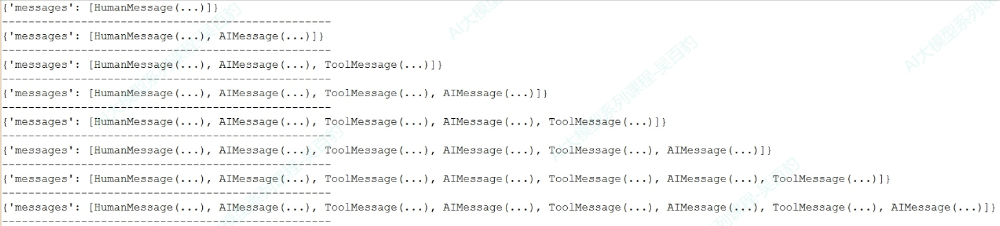
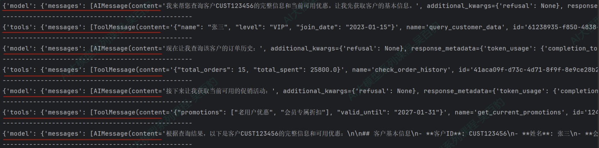
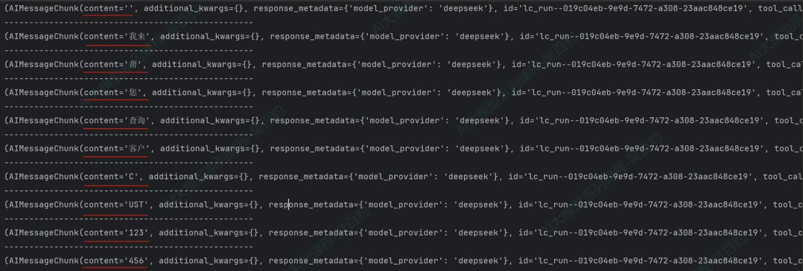
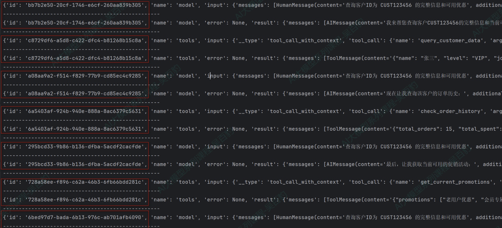
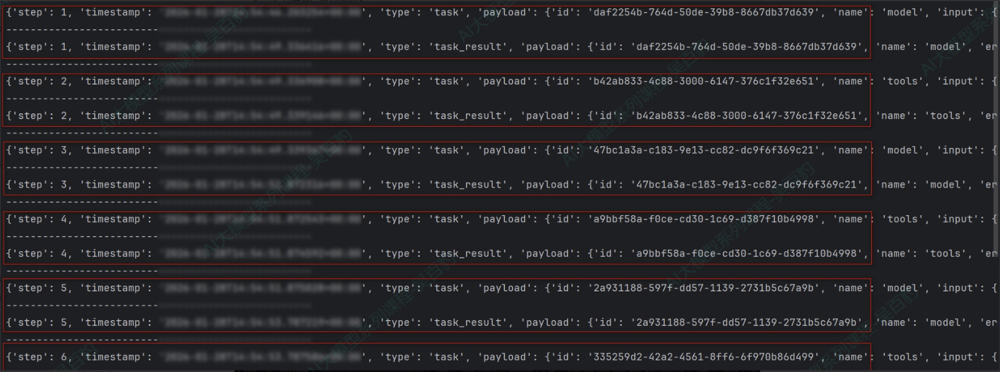
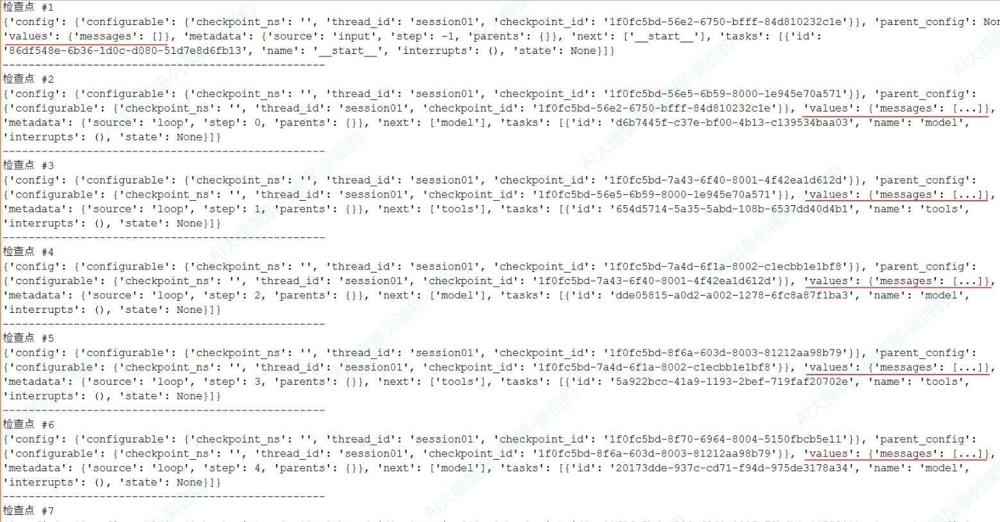
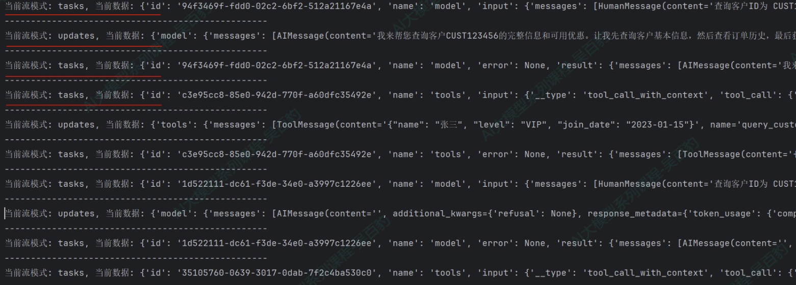

# 智能体：流式输出与实战

## 8、Agent的高级用法4：流式输出及模式

### 8.1 流式输出的说明

通过invoke 调用Agent时，内部可能经历多次调用，长时间看不到调用情况，用户体验不好，可以通过流式调用（渐进式显示输出）优化用户体验，实时显示 Agent 运行过程中的更新。特别是在处理LLM 延迟时尤其有效。

**流式输出好处：**

- 大型语言模型生成完整响应通常需要几秒钟时间，对于长输出可能达到10-20 秒，用户期望即时反馈，流式传输让等待过程更加可控。

- 相比非流式传输需要用户长时间等待完整响应，流式传输可以立即显示文字逐渐出现的效果，大幅降低用户的等待焦虑。

**设置方式：**

通过“ agent.stream（stream_mode=指定模式） ”来指定。具体模式有：values、updates（默认）、messages、custom、checkpoints、tasks、debug。

### 8.2 具体的输出模式

#### 8.2.1 values输出模式

当stream_mode 设置为values模式时，每个步骤执行后，都会输出完整的状态信息，适用于每一步都要获取完整状态、状态持久化场景。

举例：

```python
from langchain.agents import create_agent
from langchain.tools import tool
from typing import Dict, Any
from rich import print as rprint

@tool
def query_customer_data(customer_id: str) -> Dict[str, Any]:
    """
    查询客户基本信息

    Args:
        customer_id: 客户ID，用于唯一标识客户

    Returns:
        包含客户基本信息的字典，如姓名、等级、加入日期等
    """
    # 模拟数据库查询
    return {"name": "张三","level": "VIP","join_date": "2023-01-15"}


@tool
def check_order_history(customer_id: str) -> Dict[str, Any]:
    """
    查询客户订单历史

    Args:
        customer_id: 客户ID，用于唯一标识客户

    Returns:
        包含客户订单历史的字典，如总订单数、总花费等
    """
    return {"total_orders": 15,"total_spent": 25800.00}


@tool
def get_current_promotions() -> Dict[str, Any]:
    """
    获取当前可用促销活动

    Returns:
        包含当前可用促销活动的字典，如活动名称、有效日期等
    """
    return {
        "promotions": ["老用户优惠", "会员专属折扣"],
        "valid_until": "2027-01-31"
    }


# 创建客户服务Agent
customer_service_agent = create_agent(
    model=model,
    tools=[query_customer_data, check_order_history, get_current_promotions]
)


for chunk in customer_service_agent.stream(

        {"messages": [{"role": "user","content": "查询客户ID为 CUST123456 的个
人信息、历史订单和可用优惠"}]},
        stream_mode="values"
):
    rprint(chunk)
    print("-" * 50)
```

代码运行后示意结果如下：



#### 8.2.2 updates输出模式

这种模式就是默认模式。该模式中，每个步骤执行后，只增量更新状态中发生变化的内容，用于监控Agent 执行进度，例如观察Agent决定调用工具、工具执行结果等步骤。

代码如下：

```python
# 其他工具代码同上，保持不变
# ... ...
for chunk in customer_service_agent.stream(
        {"messages": [{"role": "user","content": "查询客户ID为 CUST123456 的完整
信息和可用优惠"}]},
        stream_mode="updates"
):
    rprint(chunk)
    print("-" * 50)
```

运行结果如下：



#### 8.2.3 messages输出模式

该模式中会输出流式返回的Token以及相关的元数据（如：来自哪个节点），可以用在实现类似ChatGPT 的打字机效果场景，为聊天机器人等交互式应用提供最佳的实时体验。

代码如下：

```python
# 其他工具代码同上，保持不变
# ... ...
for chunk in customer_service_agent.stream(
        {"messages": [{"role": "user","content": "查询客户ID为 CUST123456 的完
整信息和可用优惠"}]},
        stream_mode="messages"
):
    print(chunk)
    print("-" * 50)

    # print(chunk[0].content,end="",flush=True)
```

运行结果如下：



#### 8.2.4 tasks输出模式

该模式会输出当前task任务开始和结束的时间，包含任务的结果和错误信息，该模式用于监控任务的生命周期。

代码如下：

```python
# 其他工具代码同上，保持不变
# ... ...
for chunk in customer_service_agent.stream(
        {"messages": [{"role": "user","content": "查询客户ID为 CUST123456 的完整
信息和可用优惠"}]},
        stream_mode="tasks"
):
    print(chunk)
    print("-" * 50)
```

运行结果如下：



#### 8.2.5 debug输出模式

该模式与tasks模式类似，比task模式多输出任务步骤、时间戳、task类型（task/task_result），该模式用于调试、监控task任务的生命周期。

代码如下：

```python
# 其他工具代码同上，保持不变
# ... ...
for chunk in customer_service_agent.stream(
        {"messages": [{"role": "user","content": "查询客户ID为 CUST123456 的完整
信息和可用优惠"}]},
        stream_mode="debug"
):
    print(chunk)
    print("-" * 50)
```

运行结果如下：



#### 8.2.6 checkpoints输出模式

该模式中，每当检查点（checkpoint）被创建时会触发输出，输出包含检查点中的状态，用于需要状态持久化、工作流恢复或分布式执行跟踪的高级场景。

代码案例如下：

```python
from langgraph.checkpoint.memory import InMemorySaver

# 其他工具代码同上，保持不变
# ... ...
# 1. 创建内存检查点存储
checkpointer = InMemorySaver()

# 2. 创建Agent
customer_service_agent = create_agent(
    model=model,
    tools=[query_customer_data, check_order_history,
get_current_promotions],
    checkpointer=checkpointer  # 启用检查点
)

# 3. 创建唯一的会话ID
config = {"configurable": {"thread_id": "session01"}}

# 4. 调用Agent
checkpoint_count = 0

# 使用checkpoints模式进行流式监控
for chunk in customer_service_agent.stream(
        {"messages": [{"role": "user","content": "查询客户ID为 CUST123456 的完
整信息和可用优惠"}]},
        config=config,
        stream_mode="checkpoints"
):
    checkpoint_count += 1
    print(f"检查点 #{checkpoint_count}")
    print(chunk)
    print("-" * 50)
```

运行结果如下，每次输出都会将相关MESSAGE追加到values.messages中。



#### 8.2.7 custom输出模式

开发者通过get_stream_writer 在工具或节点内部自定义发送的数据，用于输出业务逻辑相关的进度信息（如“已处理10/100条记录”）、自定义日志或指标。

举例：生成销售报告和库存报告Agent

```python
from langchain.agents import create_agent
from langgraph.config import get_stream_writer
from langchain.tools import tool
import time

@tool
def generate_sales_report() -> str:
    """生成销售报告"""
    writer = get_stream_writer()

    writer({"type": "生成销售报告", "message": "开始生成销售报告"})

    # 模拟数据处理
    for i in range(1, 4):
        time.sleep(0.5)
        writer({"type": "生成销售报告","message": f"生成销售报告进度百分比：{i *
25}%"})

    writer({"type": "生成销售报告", "message": "报告生成完成"})

    return f"销售报告：总收入150万元，同比增长12%"


@tool
def generate_inventory_report() -> str:
    """生成库存报告"""
    writer = get_stream_writer()
    writer("开始库存分析...")
    time.sleep(0.5)
    writer("检查当前库存量...")
    time.sleep(0.5)
    writer("生成库存报告...")

    return "当前库存量为10000件，库存充足，无异常"


# 创建报告生成agent
reporting_agent = create_agent(
    model=model,
    tools=[generate_sales_report, generate_inventory_report]
)

for chunk in reporting_agent.stream(
        {"messages": [{"role": "user","content": "生成销售报告和库存报告"}]},
        stream_mode="custom"
):
    print(chunk)
    print("-" * 50)
```

运行结果如下：

```text
{'type': '生成销售报告', 'message': '开始生成销售报告'}
--------------------------------------------------
开始库存分析...
--------------------------------------------------
{'type': '生成销售报告', 'message': '生成销售报告进度百分比：25%'}
--------------------------------------------------
检查当前库存量...
--------------------------------------------------
{'type': '生成销售报告', 'message': '生成销售报告进度百分比：50%'}
--------------------------------------------------
生成库存报告...
--------------------------------------------------
{'type': '生成销售报告', 'message': '生成销售报告进度百分比：75%'}
--------------------------------------------------
{'type': '生成销售报告', 'message': '报告生成完成'}
--------------------------------------------------
```

### 8.3 流式输出模式总结

如下是LangChain Agent输出模式对比：

**模式输出内容使用场景**

values每个步骤执行后，都会输出完整的状态

适用于每一步都要获取完整状态、状

信息

用于监控Agent 执行进度，例如观察

updates（默

Agent决定调用工具、工具执行结果

认）

等步骤

实现类似ChatGPT 的打字机效果，为

messages输出流式返回的Token以及相关的元数

聊天机器人等交互式应用提供最佳的

据（如：来自哪个节点model/tool）

实时体验

tasks输出当前task任务开始和结束的时间，

包含任务的结果和错误信息该模式用于监控任务的生命周期

与tasks模式类似，比task模式多输出

该模式用于调试、监控task任务的生

debug

命周期

（task/task_result）

checkpoints当检查点（checkpoint）被创建时会

用于需要状态持久化、工作流恢复或

触发输出，输出包含检查点中的状态

用于输出业务逻辑相关的进度信息

custom通过get_stream_writer在工具或节点

（如“已处理10/100条记录”）、自定

内部自定义发送的数据

义日志或指标

我们可以根据不同的目标来选择不同的输出模式。例如：

- 实现实时对话交互，优先选择messages模式；

- 观察Agent的思考与执行步骤，优先选择updates模式；

- 需要查看每一步状态优先选择values/tasks/debug模式；

- 在工具执行时输出自定义业务日志优先选择custom模式。

此外，以上这些模式还可以组合使用，例如，可以同时指定stream_mode=[“tasks”，“updates”]，这样在同一个循环里既能查看Agent task任务执行内容，又能显示Agent每步的更新。

举例：

```python
# 其他工具代码同上，保持不变
# ... ...
# 创建客户服务Agent
customer_service_agent = create_agent(
    model=model,
    tools=[query_customer_data, check_order_history, get_current_promotions]
)


for stream_mode, chunk in customer_service_agent.stream(
        {"messages": [{"role": "user","content": "查询客户ID为 CUST123456 的完
整信息和可用优惠"}]},
        stream_mode=["tasks", "updates"]
):
    print(f"当前流模式: {stream_mode}, 当前数据: {chunk}")
    print("-" * 50)
```

当指定多模式后，可以通过“ for stream_mode, chunk in customer_service_agent.stream... ”来遍历dict，dict的key(stream_mode)是执行模式，value(chunk)是该模式输出的结果。代码运行输出结果如下：



## 9、实战：多功能智能助手

项目需求：开发一个多功能智能助手，支持：

1. 天气查询：查询城市天气

2. 数学计算：复杂数学运算

3. 时间查询：获取当前时间、日期计算

4. 货币转换：多种货币之间转换

5. 信息搜索：搜索产品、新闻等信息

### 9.1 模型的初始化

```python
# 1、模型的初始化
import os
from dotenv import load_dotenv
from langchain.chat_models import init_chat_model

# 从.env文件中加载环境变量
load_dotenv(override=True)

# 模型的初始化
model = init_chat_model(
    model="gpt-5.4-mini",
    model_provider="openai",
    api_key=os.getenv("CLOSEAI_API_KEY"),
    base_url=os.getenv("CLOSEAI_BASE_URL")
)
```

### 9.2 工具的定义

```python
# ==================== 工具定义 ====================
from langchain_core.tools import tool
import math
from datetime import datetime, timedelta

@tool
def get_weather(city: str) -> str:
    """获取指定城市的实时天气信息

    支持中国主要城市的天气查询

    Args:
        city: 城市名称，如"北京"、"上海"、"深圳"等

    Returns:
        包含温度、天气状况、空气质量的详细信息

    Examples:
        get_weather("北京") 返回 "多云，15-22℃，空气质量良"
    """
    weather_db = {
        "北京": "多云，15-22℃，空气质量良，湿度 45%",
        "上海": "晴天，18-25℃，空气质量优，湿度 60%",
        "深圳": "小雨，22-28℃，空气质量优，湿度 75%",
        "成都": "阴天，16-23℃，空气质量良，湿度 70%",
        "杭州": "晴天，17-24℃，空气质量优，湿度 55%",
        "广州": "多云，21-29℃，空气质量良，湿度 72%"
    }

    result = weather_db.get(city)
    if result:
        return f"{city}：{result}"
    else:
        return f"抱歉，暂不支持查询{city}的天气信息。当前支持：北京、上海、深圳、成
都、杭州、广州"

@tool
def calculator(expression: str) -> str:
    """执行数学计算

    支持基本运算符（+、-、*、/、**）和常用数学函数

    Args:
        expression: 数学表达式，可以包含：
            - 基本运算：2 + 3, 10 * 5, 100 / 4
            - 幂运算：2 ** 10
            - 函数：sqrt(16), abs(-5), pow(2, 3)

    Returns:
        计算结果或错误信息

    Examples:
        calculator("2 + 3 * 4") 返回 "14"
        calculator("sqrt(16)") 返回 "4.0"
    """
    try:
        # 安全的数学运算环境
        safe_functions = {
            "sqrt": math.sqrt,
            "pow": pow,
            "abs": abs,
            "round": round,
            "sin": math.sin,
            "cos": math.cos,
            "tan": math.tan,
            "log": math.log,
            "pi": math.pi,
            "e": math.e
        }

        result = eval(expression, {"__builtins__": {}}, safe_functions)
        return f"{expression} = {result}"
    except Exception as e:
        return f"计算出错：{str(e)}\n提示：请检查表达式格式，支持的函数有 sqrt,
abs, pow, sin, cos, tan, log"

@tool
def get_time_info(query_type: str = "current") -> str:
    """获取时间相关信息

    Args:
        query_type: 查询类型
            - "current": 当前时间
            - "date": 今天日期
            - "tomorrow": 明天日期
            - "yesterday": 昨天日期
            - "weekday": 星期几

    Returns:
        时间信息字符串

    Examples:
        get_time_info("current") 返回 "2025年1月25日 14:30:25"
        get_time_info("weekday") 返回 "星期六"
    """
    now = datetime.now()

    if query_type == "current":
        return now.strftime("当前时间：%Y年%m月%d日 %H:%M:%S")
    elif query_type == "date":
        return now.strftime("今天是：%Y年%m月%d日")
    elif query_type == "tomorrow":
        tomorrow = now + timedelta(days=1)
        return tomorrow.strftime("明天是：%Y年%m月%d日")
    elif query_type == "yesterday":
        yesterday = now - timedelta(days=1)
        return yesterday.strftime("昨天是：%Y年%m月%d日")
    elif query_type == "weekday":
        weekdays = ["星期一", "星期二", "星期三", "星期四", "星期五", "星期六",
"星期日"]
        return f"今天是{weekdays[now.weekday()]}"
    else:
        return f"不支持的查询类型：{query_type}。支持：current, date, tomorrow,
yesterday, weekday"

@tool
def convert_currency(amount: float, from_curr: str, to_curr: str) -> str:
    """货币转换工具
    支持主要货币之间的实时汇率转换

    Args:
        amount: 金额数值
        from_curr: 源货币代码（CNY/USD/EUR/GBP/JPY/HKD）
        to_curr: 目标货币代码（CNY/USD/EUR/GBP/JPY/HKD）

    Returns:
        转换结果

    Examples:
        convert_currency(100, "CNY", "USD") 返回 "100 CNY = 14.00 USD"
    """
    # 汇率表（相对于 CNY）
    exchange_rates = {
        "CNY": 1.0,      # 人民币
        "USD": 0.14,     # 美元
        "EUR": 0.13,     # 欧元
        "GBP": 0.11,     # 英镑
        "JPY": 20.8,     # 日元
        "HKD": 1.09      # 港币
    }

    # 货币名称
    currency_names = {
        "CNY": "人民币", "USD": "美元", "EUR": "欧元",
        "GBP": "英镑", "JPY": "日元", "HKD": "港币"
    }

    from_curr = from_curr.upper()
    to_curr = to_curr.upper()

    if from_curr not in exchange_rates:
        return f"不支持的源货币：{from_curr}。支持的货币：CNY, USD, EUR, GBP,
JPY, HKD"
    if to_curr not in exchange_rates:
        return f"不支持的目标货币：{to_curr}。支持的货币：CNY, USD, EUR, GBP,
JPY, HKD"

    # 转换逻辑：先转为 CNY，再转为目标货币
    cny_amount = amount / exchange_rates[from_curr]
    result_amount = cny_amount * exchange_rates[to_curr]

    from_name = currency_names[from_curr]
    to_name = currency_names[to_curr]

    return f"{amount} {from_name}（{from_curr}）= {result_amount:.2f}
{to_name}（{to_curr}）"

@tool
def search_info(keyword: str, category: str = "all") -> str:
    """搜索各类信息

    Args:
        keyword: 搜索关键词
        category: 搜索分类
            - "product": 搜索产品
            - "news": 搜索新闻
            - "all": 搜索所有

    Returns:
        搜索结果
    """
    # 模拟数据库
    products = {
        "手机": "iPhone 15 (¥5999), 小米14 (¥3999), 华为Mate60 (¥6999)",
        "笔记本": "MacBook Pro (¥12999), ThinkPad X1 (¥9999), 华为MateBook
(¥7999)",
        "耳机": "AirPods Pro (¥1999), Sony WH-1000XM5 (¥2499)"
    }

    news = {
        "AI": "1. GPT-5 即将发布  2. AI 芯片市场增长 30%  3. 新AI法规出台",
        "科技": "1. 量子计算新突破  2. 6G 技术测试  3. 新能源汽车销量创新高"
    }

    results = []

    if category in ["product", "all"]:
        for key, value in products.items():
            if keyword in key:
                results.append(f"【产品】{key}：{value}")

    if category in ["news", "all"]:
        for key, value in news.items():
            if keyword in key or keyword in value:
                results.append(f"【新闻】{key} 相关：{value}")

    if results:
        return "\n".join(results)
    else:
        return f"未找到关于 '{keyword}' 的{category}信息"
```

### 9.3 agent的创建

```python
from langchain.agents import create_agent


class SmartAssistant:
    """多功能智能助手"""
    def __init__(self):
        # 初始化模型
        self.model = model

        # 工具列表
        self.tools = [
            get_weather,
            calculator,
            get_time_info,
            convert_currency,
            search_info
        ]

        # 系统提示词
        system_prompt = """你是一个多功能智能助手，可以帮助用户：

          🌤 查询天气：使用 get_weather 工具
          🔢 数学计算：使用 calculator 工具
          ⏰ 时间查询：使用 get_time_info 工具
          💱 货币转换：使用 convert_currency 工具
          🔍 信息搜索：使用 search_info 工具

          重要提示：
          1. 仔细阅读用户问题，确定需要使用哪个工具
          2. 如果需要多个工具，按顺序调用
          3. 总是用友好、专业的语气回答
          4. 如果工具返回了数据，要用通俗易懂的语言解释给用户
          5. 如果无法完成任务，诚实地告诉用户原因

          请始终使用中文回答。"""

        # ✅ 创建 agent
        self.agent = create_agent(
            model=self.model,
            tools=self.tools,
            system_prompt=system_prompt
        )

        # 对话历史
        self.messages = []

    def chat(self, user_input: str) -> str:
        """对话接口"""
        # 添加用户消息
        self.messages.append({"role": "user", "content": user_input})

        # 调用 agent
        result = self.agent.invoke({"messages": self.messages})

        # 更新消息历史
        self.messages = result["messages"]

        # 返回最后一条 AI 消息
        for msg in reversed(self.messages):
            if msg.type == "ai" and msg.content:
                return msg.content

        return "抱歉，我无法处理这个请求。"

    def reset(self):
        """重置对话历史"""
        self.messages = []
```

### 9.4 主程序

```python
# ==================== 主程序 ====================

def main():
    assistant = SmartAssistant()

    print("=" * 40)
    print("🤖 多功能智能助手（LangChain 1.2）")
    print("=" * 40)
    print("\n我可以帮你：")
    print("  🌤  查询天气")
    print("  🔢 数学计算")
    print("  ⏰ 时间查询")
    print("  💱 货币转换")
    print("  🔍 信息搜索")
    print("\n输入 'quit' 退出，输入 'reset' 重置对话\n")

    demos = [
        "北京今天天气怎么样？",
        "帮我算一下 (25 + 17) * 3",
        "现在几点了？",
        "100 美元等于多少人民币？"
    ]

    for demo in demos:
        print(f"👤 {demo}")
        response = assistant.chat(demo)
        print(f"🤖 {response}\n")

    # 重置对话
    assistant.reset()

    # 交互模式
    print("=" * 40)
    print("💬 进入交互模式")
    print("=" * 40)

    while True:
        user_input = input("\n👤 你: ")

        if user_input.lower() == 'quit':
            print("再见！👋")
            break

        if user_input.lower() == 'reset':
            assistant.reset()
            print("✅ 对话已重置")
            continue

        if not user_input.strip():
            continue

        # 调用助手
        response = assistant.chat(user_input)
        print(f"🤖 助手: {response}")

if __name__ == "__main__":
    main()
```

输出：

```text
========================================
🤖 多功能智能助手（LangChain 1.2）
========================================

我可以帮你：
🌤  查询天气
🔢 数学计算
⏰ 时间查询
💱 货币转换
🔍 信息搜索

输入 'quit' 退出，输入 'reset' 重置对话

👤 北京今天天气怎么样？
🤖 北京今天天气是：**多云，15–22℃**，**空气质量良**，湿度 **45%**。
整体来说比较适合外出，建议穿**轻薄外套**会更舒服。

👤 帮我算一下 (25 + 17) * 3
🤖 计算结果是：**126**。

👤 现在几点了？
🤖 现在是：**2026年06月03日 19:45:40**。

👤 100 美元等于多少人民币？
🤖 **100 美元（USD）约等于 714.29 人民币（CNY）**。

========================================
💬 进入交互模式
========================================
再见！👋
```
