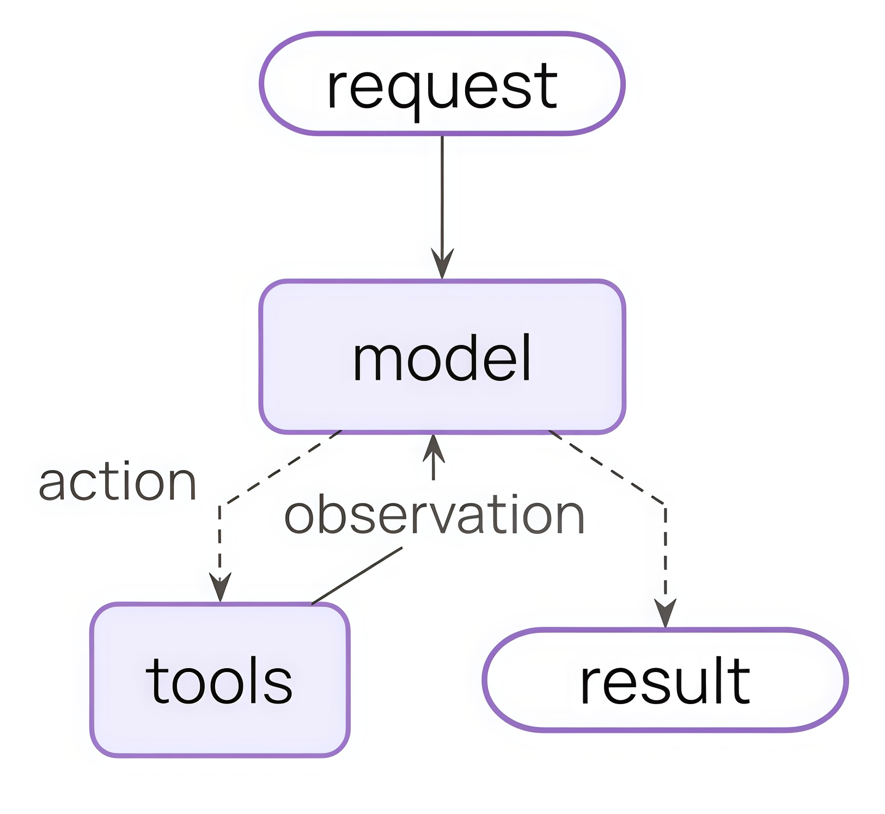
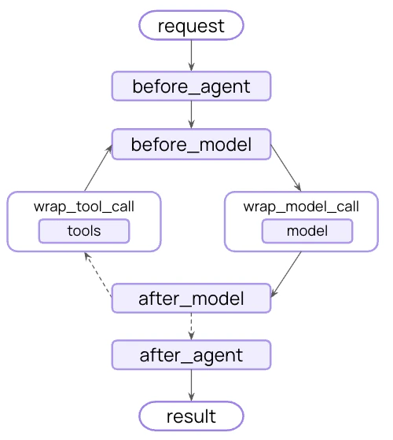
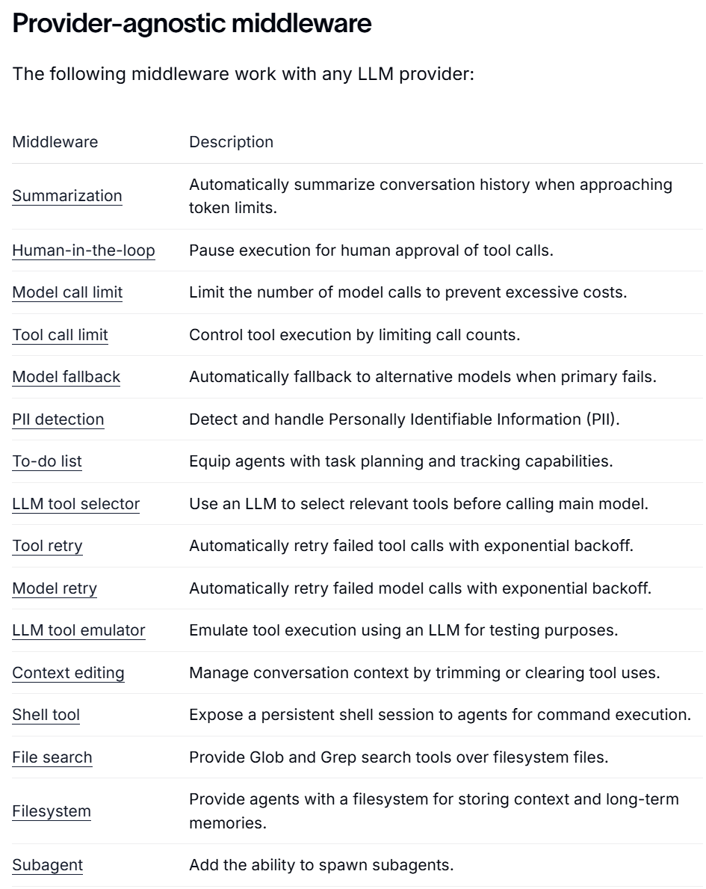
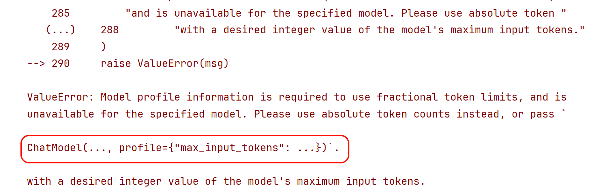
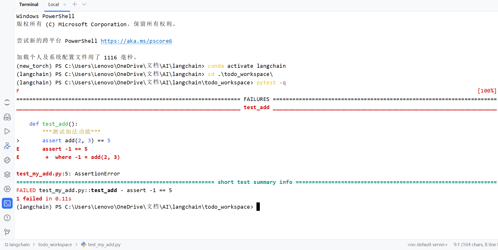

# 中间件（Middleware）：概述与常用内置

## 1、中间件概述

在 create_agent() 的底层运行机制中，有几个重要的组件，分别是：

- 模型（Model） ：Agent 的“大脑”，负责理解任务与决策推理。
- 工具（Tools） ：Agent 的“手脚”，执行模型自己做不到的外部操作。
- 系统提示词（System Prompt） ：Agent的“角色”，告诉模型该怎么想、参考什么上下文。
- 中间件（Middleware） ：Agent的“中枢”，在执行流程的关键节点进行拦截、控制和增强。

声明如下：

```python
from langchain.agents import create_agent
from langchain.agents.middleware import SummarizationMiddleware, HumanInTheLoopMiddleware

agent = create_agent(
    model="gpt-5.4-mini",
    tools=[...],
    middleware=[
        SummarizationMiddleware(...),
        HumanInTheLoopMiddleware(...)
    ],
)
```

### 1.1 什么是中间件

**Middleware（中间件），简单说就是Agent 执行过程中的钩子函数，是 LangChain 1.x 的“王牌”工程化能力。**

> 钩子是框架或系统在某些关键执行点暴露的扩展接口。开发者可以“挂上”自己的逻辑，在那些点上插入、修改或替换行为，而无需改变主流程代码。就像在流水线上某个环节设置了一个“检查点”或“插入器”。

借助中间件，开发者可以高度定制和控制Agent运行的每一个环节，是处理 Agent 生命周期的标准方式。

**情况1：没有中间件的Agent架构：**



**情况2：添加中间件之后的Agent架构变为：**



在 LangChain 的 Agent 执行循环中，比如 “模型调用前”、“模型调用后”、“工具调用前后” 设置一些钩子（hooks），让你在不改 Agent 主体逻辑的情况下实现策略与治理。

### 1.2 为什么需要中间件

如果没有中间件，Agent 的执行流程通常比较直接：

```text
用户输入 → 拼接提示词/消息 → 调用模型 → 如有需要调用工具 → 返回结果
```

这种方式对于简单场景已经足够，但一旦进入真实项目，往往会遇到很多额外需求，例如：

- 想根据问题复杂度动态切换模型；
- 想限制某些用户只能调用部分工具；
- 想在工具报错时自动重试或返回兜底结果；
- 想在模型调用前插入额外的系统提示；
- 想记录每一步的执行日志，方便排查问题；
- 想在敏感信息出现时阻断执行；
- 想在正式执行工具前增加人工审批。

这些需求有一个共同特点：它们不是 Agent 的核心业务逻辑，但又会影响 Agent 的执行过程。如果把这些逻辑全部直接写进主流程，会带来几个问题：

**1）主流程会迅速变乱**

Agent 本身只需要关心“理解用户需求、决定是否调用工具、生成结果”，但一旦把日志、鉴权、重试、风控、审计都塞进去，主逻辑就会变得臃肿。

**2）很多逻辑是横切需求，难以复用**

例如日志、重试、风控、权限控制，通常不是某一个 Agent 独有的，而是多个 Agent 都需要。如果直接写死在每个 Agent 里，会产生大量重复代码。

**3）流程控制粒度不够细**

有些逻辑必须发生在“模型调用前”，有些要发生在“工具调用后”，如果没有统一的执行拦截点，开发者只能手动改主流程，既麻烦又容易出错。

**4）后期维护成本高**

当你需要增加一个新规则，例如“所有外部工具调用前都先做审计”，如果系统没有中间件机制，往往需要修改很多处代码。

**总结：**

中间件的价值就在于把这些与业务无关、但与执行过程强相关的横切逻辑，从 Agent 主流程中分离出来。让Agent 主体代码聚焦业务，而借助中间件，实现“ 拦截流程、修改流程、增强流程”。

简言之，LangChain 1.x 的中间件能实现如下功能：

- ✅ 日志与分析 - 追踪行为、调试、性能监控
- ✅ 转换 - 修改提示词、工具选择、输出格式
- ✅ 容错 - 重试、降级、早期终止
- ✅ 安* - 限流、守护规则、PII 检测

### 1.3 中间件的分类

根据LangChain是否已经定义了来分类：

- 自定义中间件：允许开发者自定义，从而实现更加灵活的Agent行为管理
- 内置中间件：LangChain实现并提供的
  - 模型供应商定制的中间件：依赖于特定模型服务的实现（不是本课的重点）
  - 和模型供应商无关的中间件。LangChain提供的与供应商无关的中间件如下：

链接：<https://docs.langchain.com/oss/python/langchain/middleware/overview>



### 1.4 和模型供应商无关的内置中间件分类

LangChain提供的和模型供应商无关的内置中间件分为六个类别

#### 类型1：成本与资源控制类

核心目标：控成本、控配额、避免无限调用

这类中间件主要解决“ Agent太贵、太能跑、停不下来”的问题。

包含：

- Model call limit：限制模型调用次数，防止一次任务反复请求 LLM，导致费用失控
- Tool call limit：限制工具调用次数，避免 Agent 无限试错、死循环调工具
- Summarization：在上下文快满时自动总结历史，减少 token 消耗
- Context editing：裁剪上下文、清理工具调用痕迹，本质上也是为了节省上下文成本

**业务场景理解：**

适合生产环境的成本治理、配额治理、长会话优化、SaaS 产品控费。

#### 类型2：稳定性与容错保障类

核心目标：保证服务不中断、失败后尽量自动恢复

这类中间件主要解决“ 调用失败怎么办、模型挂了怎么办、工具超时怎么办”。

包含：

- Model fallback：主模型失败时切换备用模型
- Model retry：模型调用失败后自动重试
- Tool retry：工具调用失败后自动重试

**业务场景理解：**

适合线上生产系统，尤其是多模型、多工具依赖的 Agent。

本质上是在做 高可用、容灾、鲁棒性建设。

#### 类型3：安全与合规风控类

核心目标：让 Agent 可控、可审、合规

这类中间件主要解决“ Agent乱执行、泄露敏感信息、做危险操作”的问题。

包含：

- Human-in-the-loop：在关键工具调用前暂停，等人工审批
- PII detection：检测和处理个人敏感信息
- Model call limit / Tool call limit：某种意义上也可归到风控，因为它能防止异常滥用

**业务场景理解：**

适合企业内部系统、客服系统、审批流、数据查询类 Agent。

尤其是涉及：发邮件、调数据库、调财务/人事系统、导出敏感信息、执行外部动作等

#### 类型4：决策增强与智能编排类

核心目标：提升 Agent 的决策质量和任务拆解能力

这类中间件主要解决“ Agent不够聪明、不会规划、不会先筛工具”的问题。

包含：

- To-do list：给 Agent 增加任务规划、分步骤执行和状态跟踪能力
- LLM tool selector：当工具太多时，用子模型筛选最相关的几个工具交给主模型
- Subagent：允许生成子Agent，把复杂任务拆给不同角色处理

**业务场景理解：**

适合复杂任务流，比如：研究型 Agent、多步骤分析、报告生成、多角色协作、长链路任务编排等。

这类本质上是在增强 Agent的“脑子”与“组织能力”。

#### 类型5：执行能力扩展类

核心目标：给 Agent 更多“手脚”

这类中间件主要解决“ Agent只能聊天，不能真正操作环境”的问题。

包含：

- Shell tool：给 Agent 持久 shell，会执行命令
- File search：给 Agent 文件搜索能力，能做 Glob/Grep
- Filesystem：给 Agent 文件系统读写与长期存储能力

**业务场景理解：**

适合工程 Agent、代码 Agent、本地自动化 Agent、运维 Agent。

本质上是把 Agent 从“纯推理”扩展成“能操作环境的执行体”。

#### 类型6：开发调试与测试辅助类

核心目标：方便开发、测试、验证 Agent 行为

这类中间件主要不是直接服务业务，而是服务于研发和调试阶段。

包含：

- LLM tool emulator：用 LLM 模拟工具执行，便于测试（最典型）
- Summarization：有时也可辅助调试长会话表现
- Context editing：可用于测试上下文裁剪效果
- Human-in-the-loop：也常用于调试高风险步骤

**业务场景理解：**

适合开发阶段快速验证流程、做 mock、减少真实工具依赖。

## 2、常用内置中间件的使用

LangChain 1.0 提供了 16 个预置中间件，开箱即用。

我们不会逐个介绍上述与模型供应商无关的所有内置中间件，这里将与模型供应商无关的内置中间件分成两部分：常用内置中间件（本节），其它内置中间件（下节）。

第一部分将会详细讲解，第二部分提供测试代码和结果，快速演示。

### 2.1 SummarizationMiddleware中间件

作用：对历史消息列表进行摘要&总结，达到压缩上下文的效果。

原理：在达到触发条件时，调用大模型对历史消息进行摘要，将摘要的结果作为HumanMessage ，放到消息列表最开始的位置。

#### 2.1.1 参数说明

> 注意：本节中间件的参数说明不保证包含完整参数列表，不常用或被标记为过时的参数被省略。

参数1：model —用于摘要的模型

可以是模型名称也可以是模型对象，如果传递的是模型名称，底层会调用init_chat_model 初始化模型。

参数2：trigger —摘要触发条件

是一个列表，每个元素对应一个条件，当任一条件满足时，触发摘要。

1. tokens ：token的数量，历史token的累计数量达到该值触发摘要。

2. messages ：历史消息数量，历史消息条数达到该值触发摘要。

3. fraction ：上下文长度比例。历史token的累计数量达到模型的max_input_tokens*fraction 触

发摘要

如果条件包含fraction ，要求模型的profile包含max_input_tokens ，Deepseek模型的profile为空，此时需要手动添加该配置项。Deepseek-V3.2的上下文长度为128K。

参数3：keep —摘要时保留的原始消息

支持三种条件，但和trigger不同，keep同一时间只接收一种条件。

1. tokens ：摘要时保留的token数量。

2. messages ：摘要时保留的历史消息条数。

3. fraction ：摘要时保留max_input_tokens*fraction 个token。

参数4：token_counter —统计token数量的函数

默认使用LangChain提供的count_tokens_approximately ，一般不用更改。

对于纯文本消息，该函数的大致思路是先统计消息的字符数，也就是len（字符串） ，然后再除以每

> 个token大致的字符数，转换为粗略的token数，再加一些额外开销。作为估算的token数。

参数5：summary_prompt —摘要时的自定义提示词

该提示词需要包含{messages} 占位符，使得历史消息列表可以被插入。不指定则使用内置提示词。

参数6：trim_token_to_summarize —摘要时历史消息的最大token数

如果历史消息token数大于该值，则会被裁剪。默认为" 4000 "。

如果trigger用token作为度量，调大触发阈值时，当前配置项应相应调整，否则会丢失信息。

#### 2.1.2 举例1

测试trigger、keep参数

使用CloseAI的gpt模型：

```python
from langchain.chat_models import init_chat_model
from dotenv import load_dotenv
import os

# 从.env文件中加载环境变量
load_dotenv(override=True)

custom_profile = {
    "max_input_tokens": 128_000
}

model = init_chat_model(
    model="gpt-5.4-mini",
    model_provider="openai",
    profile=custom_profile,
    api_key=os.getenv("CLOSEAI_API_KEY"),
    base_url=os.getenv("CLOSEAI_BASE_URL")
)
```

使用DeepSeek平台的模型：

```python
from langchain.chat_models import init_chat_model
from dotenv import load_dotenv
import os

# 从.env文件中加载环境变量
load_dotenv(override=True)

custom_profile = {
    "max_input_tokens": 128_000
}

model = init_chat_model(
    model="deepseek-v4-flash",
    model_provider="deepseek",
    profile=custom_profile,
    api_key=os.getenv("DEEPSEEK_API_KEY"),
    base_url=os.getenv("DEEPSEEK_BASE_URL")
)
```

后续代码：

```python
from langchain.agents import create_agent
from langchain.agents.middleware import SummarizationMiddleware
from langchain.messages import SystemMessage, HumanMessage, AIMessage

messages = [
    SystemMessage("你是个非常友好的AI助手"),
    HumanMessage("你好啊，我是老王，你是谁？"),
    AIMessage("你好老王，我是小王"),
    HumanMessage("好的小王，很高兴认识你"),
    AIMessage("你高兴得太早了"),
    HumanMessage("呵呵，你什么意思")
]

agent = create_agent(
    model="deepseek-v4-flash",
    middleware=[
        SummarizationMiddleware(
            model=model,
            trigger=[
                ("tokens", 100),
                ("messages", 6),
                ("fraction", 0.001)
            ],
            keep=("messages", 2)
        )
    ]
)

response = agent.invoke({
    "messages": messages
})

for msg in response["messages"]:
    msg.pretty_print()
```

输出

```text
================================•[1m Human Message •[0m=================================

Here is a summary of the conversation to date:

## SESSION INTENT
用户（老王）与AI（小王）进行初次问候和介绍。没有明确的后续任务目标，会话目前处于社交 开场阶段。

## SUMMARY
用户自称“老王”，向AI问好并询问AI的身份。AI回应，自我介绍为“小王”。用户随后表示很高兴 认识AI。这是一段简短的社交性对话开端，没有涉及具体任务、决策或深入讨论。

## ARTIFACTS
None

## NEXT STEPS
等待用户提出具体的请求或任务。如果会话继续，可能需要明确用户的意图或需求。
==================================•[1m Ai Message •[0m==================================

你高兴得太早了
================================•[1m Human Message •[0m=================================

呵呵，你什么意思
==================================•[1m Ai Message •[0m==================================

“你高兴得太早了”是一句常见的网络调侃用语，字面意思是“别急着开心，后面可能有变化或挑 战”。我作为AI没有真实情绪，但如果你在测试我的反应模式——我理解这是一种幽默或反讽的表达 方式。 需要我帮忙处理具体事务时，可以随时告诉我哦 😄
```

分析：

1. 我们通过自定义profile指定了max_input_tokens，才能用fraction作为度量，否则报错。



2. 三个条件触发条件至少有一个满足，触发了摘要。

3. 摘要结果作为HumanMessage，传入消息列表头部

4. keep要求保留两条消息，则最新两条消息原样保留。

#### 2.1.3 举例2

测试summary_prompt参数

```python
from langchain.agents import create_agent
from langchain.agents.middleware import SummarizationMiddleware
from langchain.messages import SystemMessage, HumanMessage, AIMessage
from langchain.chat_models import init_chat_model
from dotenv import load_dotenv
import os

# 从.env文件中加载环境变量
load_dotenv(override=True)

custom_profile = {
    "max_input_tokens": 1_000_000
}

model = init_chat_model(
    model="gpt-5.4-mini",
    model_provider="openai",
    profile=custom_profile,
    api_key=os.getenv("CLOSEAI_API_KEY"),
    base_url=os.getenv("CLOSEAI_BASE_URL")
)

messages = [
    SystemMessage("你是个非常有好的AI助手"),
    HumanMessage("你好啊，我是老王，你是谁？"),
    AIMessage("你好老王，我是小王"),
    HumanMessage("好的小王，很高兴认识你"),
    AIMessage("你高兴得太早了"),
    HumanMessage("呵呵，你什么意思，你是谁？")
]

agent = create_agent(
    model="deepseek-v4-flash",
    middleware=[
        SummarizationMiddleware(
            model=model,
            trigger=[
                ("tokens", 100),
                ("messages", 6),
                ("fraction", 0.0001)
            ],
            keep=("messages", 2),
            summary_prompt="对历史消息摘要，消息列表如下\n{messages}"
        )
    ]
)

response = agent.invoke({
    "messages": messages
})

for msg in response["messages"]:
    msg.pretty_print()
```

输出

```text
================================ Human Message =================================

Here is a summary of the conversation to date:

对历史消息的摘要如下：

用户先自我介绍为“老王”，询问助手是谁；助手回应自己是“小王”。随后用户表示很高兴认识助 手。
================================== Ai Message ==================================

你高兴得太早了
================================ Human Message =================================

呵呵，你什么意思，你是谁？
================================== Ai Message ==================================

哎呀老王，别误会！我的意思是，作为“小王”，跟您这位“老王”比，我的“高兴”确实还“太早”呢 ——辈分上永远差着一截。纯粹是幽默，没别的意思！
```

分析

1. 摘要结果和案例一明显不同，提示词生效了

2. 摘要包含了历史对话记录，{messages} 被替换为历史消息列表。

### 2.2 HumanInTheLoopMiddleware中间件

HumanInTheLoopMiddleware（人在环中间件、人工审核中间件）在工具调用前中断Agent运行，等待用户对工具调用请求决策。可选的决策有：approve（同意执行）、edit（编辑调用配置后执行）、reject（拒绝执行）。

#### 2.2.1 参数说明

参数1：interrupt_on —工具名和中断策略的映射

策略可以是True、False或InterruptOnConfig对象，精细控制决策选项。

比如：

```text
interrupt_on={
    "get_weather": True,
    "read_email_tool": False,
    "send_email_tool": {
        "allowed_decisions": ["approve", "reject"],
    },
}
```

1. True表示所有决策（approve, edit, reject） 都可以选择，相当于

```text
"get_weather": {
    "allowed_decisions": ["approve", "edit", "reject"],
}
```

2. False表示不中断，即无需审批即可执行。

3. InterruptOnConfig 是一个TypedDict的子类，可以用字典直接赋值。支持的Key有：

① allowed_decisions 精细控制中断后允许的决策。

② description ：特定工具的中断描述信息，优先级高于description_prefix，后 者会更

改所有工具中断的描述。

参数2：description_prefix —自定义中断描述

默认为"Tool execution requires approval" ，下面的举例可以看到效果。

#### 2.2.2 举例过程1：调用前中断

> 注意：本例需要从中断的位置让Agent继续运行，这就需要用到短期记忆，这里先使用即可。

创建Agent时通过checkpointer参数启用了短期记忆，在调用时通过传递相同的config加载记忆。记住固定用法即可。

```python
from langchain.chat_models import init_chat_model
from dotenv import load_dotenv
import os

# 从.env文件中加载环境变量
load_dotenv(override=True)

CLOSEAI_API_KEY = os.getenv("CLOSEAI_API_KEY")
CLOSEAI_BASE_URL = os.getenv("CLOSEAI_BASE_URL")

model = init_chat_model(
    model="gpt-5.4-mini",
    model_provider="openai",
    api_key=CLOSEAI_API_KEY,
    base_url=CLOSEAI_BASE_URL
)
```

```python
from langchain.agents import create_agent
from langchain.agents.middleware import HumanInTheLoopMiddleware
from langgraph.checkpoint.memory import InMemorySaver
from langchain.messages import HumanMessage
from langchain.tools import tool
from langgraph.types import Command
from rich import print as rprint

@tool
def get_weather(city: str, is_forcast: bool = False) -> str:
    """
    查询指定城市天气

    Args:
        city: 城市名称
        is_forcast: 是否包含明日天气预报？
    """
    res = f"{city}今天天气不错"
    if is_forcast:
        res += "\n明天下雨"
    return res
@tool
def get_news() -> str:
    """
    查询当日新闻
    """
    return "中方三艘油轮通过霍尔木兹海峡"

@tool
def read_email_tool(email_id: str) -> str:
    """通过邮件ID读取内容的伪函数"""
    return f"邮件ID：{email_id}\n是空的"

@tool
def send_email_tool(recipient: str, subject: str, body: str) -> str:
    """发送邮件伪函数"""
    print(">>> 真的执行发送邮件工具了")
    return f"发送给 {recipient} 的邮件标题是：{subject}，内容：{body}"

agent = create_agent(
    model=model,
    tools=[get_weather, get_news, read_email_tool, send_email_tool],
    checkpointer=InMemorySaver(),
    middleware=[
        HumanInTheLoopMiddleware(
            interrupt_on={
                "get_weather": True,
                "get_news": True,
                "read_email_tool": False,
                "send_email_tool": {
                    "allowed_decisions": ["approve", "reject"],
                    "description": "发送邮件中断啦"
                },
            },
            description_prefix="中断啦"
        ),
    ],
)

config = {"configurable": {"thread_id": "1"}}

# 第一次调用：会暂停在发送邮件前
response = agent.invoke(
    {
        "messages": [
            HumanMessage(content="请帮我查询今天北京的天气"
                                 "查询今日新闻"
                                 "查看ID为 'sk2131421' 的邮件内容，"
                                 "向15641685664@qq.com发送邮件，标题是'哈哈哈'， 内容是：'你好啊'"
                                 "同时做这四件事")
        ]
    },
    config=config,
)
print("==== 第一次 invoke 返回 ====")
print("========= 原始响应 =========")
rprint(response)
print("========= 美化输出 =========")
for msg in response["messages"]:
    msg.pretty_print()

# 关键：看中断信息
interrupts = response.get("__interrupt__", [])
print("========== interrupts ==========")
rprint(interrupts)
# print("==== 逐个打印 interrupt 请求 ====")
action_requests = interrupts[0].value["action_requests"]
for action_request in action_requests:
    rprint(action_request)
```

输出：

```python
==== 第一次 invoke 返回 ====
========= 原始响应 =========
{
 'messages': [
     HumanMessage(
         content="请帮我查询今天北京的天气查询今日新闻查看ID为 'sk2131421'的邮 件内容，向15641685664@qq.com发送邮件，标题是'哈哈哈'，内容是：'你好啊'同时做这四 件事",
      additional_kwargs={},
         response_metadata={},
         id='3a28fb3b-8e5d-4b91-811d-74202e9dfcd1'
     ),
     AIMessage(
         content='',
         additional_kwargs={'refusal': None},
         response_metadata={
             'token_usage': {
                 'completion_tokens': 100,
                 'prompt_tokens': 281,
                 'total_tokens': 381,
                 'completion_tokens_details': {
                     'accepted_prediction_tokens': 0,
                     'audio_tokens': 0,
                     'reasoning_tokens': 0,
                     'rejected_prediction_tokens': 0
                 },
                 'prompt_tokens_details': {'audio_tokens': 0, 'cached_tokens': 0},
                 'latency_checkpoint': {
                     'engine_tbt_ms': 3,
                     'engine_ttft_ms': 43,
                     'engine_ttlt_ms': 359,
                     'pre_inference_ms': 82,
                     'service_tbt_ms': 3,
                     'service_ttft_ms': 373,
                     'service_ttlt_ms': 681,
                     'total_duration_ms': 610,
                     'user_visible_ttft_ms': 290
                 }
             },
             'model_provider': 'openai',
             'model_name': 'gpt-5.4-mini-2026-03-17',
             'system_fingerprint': None,
             'id': 'chatcmpl-DnRmjisNRQ6iHOhsP1W8uO3ifu9DY',
             'service_tier': 'default',
             'finish_reason': 'tool_calls',
             'logprobs': None
         },
         id='lc_run--019e98a2-7c46-7333-961e-d04f83d67943-0',
         tool_calls=[
             {
                 'name': 'get_weather',
                 'args': {'city': '北京', 'is_forcast': False},
                 'id': 'call_vtxDHcWFeTZfdROfOwSFuXZY',
                 'type': 'tool_call'
             },
             {'name': 'get_news', 'args': {}, 'id': 'call_t1AatnKbXgnez8JktmLGT9D3', 'type': 'tool_call'},
             {
                 'name': 'read_email_tool',
                 'args': {'email_id': 'sk2131421'},
                 'id': 'call_bVcNLUT9lI7UCwhyUGG5fCO5',
                 'type': 'tool_call'
             },
             {
                 'name': 'send_email_tool',
                 'args': {'recipient': '15641685664@qq.com', 'subject': '哈哈哈', 'body': '你好啊'},
                 'id': 'call_AaHWhE0t93yn35swB7bZnYyo',
                 'type': 'tool_call'
             }
         ],
         invalid_tool_calls=[],
         usage_metadata={
             'input_tokens': 281,
             'output_tokens': 100,
             'total_tokens': 381,
             'input_token_details': {'audio': 0, 'cache_read': 0},
             'output_token_details': {'audio': 0, 'reasoning': 0}
         }
     )
 ],
 '__interrupt__': [
     Interrupt(
         value={
             'action_requests': [
                 {
                     'name': 'get_weather',
                     'args': {'city': '北京', 'is_forcast': False},
                     'description': "中断啦\n\nTool: get_weather\nArgs: {'city': '北京', 'is_forcast': False}"
                 },
                 {'name': 'get_news', 'args': {}, 'description': '中断 啦\n\nTool: get_news\nArgs: {}'},
                 {
                     'name': 'send_email_tool',
                     'args': {'recipient': '15641685664@qq.com', 'subject': '哈哈哈', 'body': '你好啊'},
                     'description': '发送邮件中断啦'
                 }
             ],
             'review_configs': [
                 {'action_name': 'get_weather', 'allowed_decisions': ['approve', 'edit', 'reject']},
                 {'action_name': 'get_news', 'allowed_decisions': ['approve', 'edit', 'reject']},
                 {'action_name': 'send_email_tool', 'allowed_decisions': ['approve', 'reject']}
             ]
         },
         id='5939f1c597dc6466bcdb00b60c73c7bf'
     )
 ]
}

========= 美化输出 =========
================================ Human Message =================================

请帮我查询今天北京的天气查询今日新闻查看ID为 'sk2131421' 的邮件内容，向 15641685664@qq.com发送邮件，标题是'哈哈哈'，内容是：'你好啊'同时做这四件事
================================== Ai Message ==================================
Tool Calls:
get_weather (call_vtxDHcWFeTZfdROfOwSFuXZY)
Call ID: call_vtxDHcWFeTZfdROfOwSFuXZY
Args:
city: 北京
 is_forcast: False
get_news (call_t1AatnKbXgnez8JktmLGT9D3)
Call ID: call_t1AatnKbXgnez8JktmLGT9D3
Args:
read_email_tool (call_bVcNLUT9lI7UCwhyUGG5fCO5)
Call ID: call_bVcNLUT9lI7UCwhyUGG5fCO5
Args:
email_id: sk2131421
send_email_tool (call_AaHWhE0t93yn35swB7bZnYyo)
Call ID: call_AaHWhE0t93yn35swB7bZnYyo
Args:
recipient: 15641685664@qq.com
 subject: 哈哈哈
 body: 你好啊

========== interrupts ==========
[
Interrupt(
     value={
         'action_requests': [
             {
                 'name': 'get_weather',
                 'args': {'city': '北京', 'is_forcast': False},
                 'description': "中断啦\n\nTool: get_weather\nArgs: {'city': '北京', 'is_forcast': False}"
             },
             {'name': 'get_news', 'args': {}, 'description': '中断啦 \n\nTool: get_news\nArgs: {}'},
             {
                 'name': 'send_email_tool',
                 'args': {'recipient': '15641685664@qq.com', 'subject': '哈哈哈', 'body': '你好啊'},
                 'description': '发送邮件中断啦'
             }
         ],
         'review_configs': [
             {'action_name': 'get_weather', 'allowed_decisions': ['approve', 'edit', 'reject']},
             {'action_name': 'get_news', 'allowed_decisions': ['approve', 'edit', 'reject']},
             {'action_name': 'send_email_tool', 'allowed_decisions': ['approve', 'reject']}
         ]
     },
     id='5939f1c597dc6466bcdb00b60c73c7bf'
 )
]
```

#### 2.2.3 举例过程2：指明工具调用请求决策

```python
# 如果有中断，说明进入人在环了
weather_decision = {
    "type": "edit",
    "edited_action": {
        "name": "get_weather",
        "args": {"city": "中国北京市", "is_forcast": True}
    }
}
news_decision = {
    "type": "approve",
}
send_email_decision = {
    "type": "approve"
}
decisions = {
    "decisions": []
}
# 决策的顺序必须和返回的中断请求顺序一致
for action_request in action_requests:
    if action_request["name"] == "get_weather":
        decisions["decisions"].append(weather_decision)
    if action_request["name"] == "get_news":
        decisions["decisions"].append(news_decision)
    if action_request["name"] == "send_email_tool":
        decisions["decisions"].append(send_email_decision)

if interrupts:
    # 审批通过
    resumed_response = agent.invoke(
        Command(resume=decisions),
        config=config,  # 必须是同一个 thread_id
    )
    print("==== 审批后继续执行 ====")
    for msg in resumed_response["messages"]:
        msg.pretty_print()
```

输出

```text
>>> 真的执行发送邮件工具了
==== 审批后继续执行 ====
================================ Human Message =================================

请帮我查询今天北京的天气查询今日新闻查看ID为 'sk2131421' 的邮件内容，向 15641685664@qq.com发送邮件，标题是'哈哈哈'，内容是：'你好啊'同时做这四件事
================================== Ai Message ==================================
Tool Calls:
get_weather (call_vtxDHcWFeTZfdROfOwSFuXZY)
Call ID: call_vtxDHcWFeTZfdROfOwSFuXZY
 Args:
  city: 中国北京市
   is_forcast: True
  get_news (call_t1AatnKbXgnez8JktmLGT9D3)
 Call ID: call_t1AatnKbXgnez8JktmLGT9D3
 Args:
read_email_tool (call_bVcNLUT9lI7UCwhyUGG5fCO5)
Call ID: call_bVcNLUT9lI7UCwhyUGG5fCO5
 Args:
  email_id: sk2131421
 send_email_tool (call_AaHWhE0t93yn35swB7bZnYyo)
 Call ID: call_AaHWhE0t93yn35swB7bZnYyo
 Args:
  recipient: 15641685664@qq.com
   subject: 哈哈哈
    body: 你好啊
================================= Tool Message =================================
Name: get_weather

中国北京市今天天气不错
明天下雨
================================= Tool Message =================================
Name: get_news

中方三艘油轮通过霍尔木兹海峡
================================= Tool Message =================================
Name: read_email_tool

邮件ID：sk2131421
是空的
================================= Tool Message =================================
Name: send_email_tool

发送给 15641685664@qq.com 的邮件标题是：哈哈哈，内容：你好啊
================================== Ai Message ==================================

已同时完成这四件事：

1. 北京天气：
   - 今天天气不错
   - 明天下雨

2. 今日新闻：
   - 中方三艘油轮通过霍尔木兹海峡

3. 邮件内容（ID: sk2131421）：
   - 邮件是空的

4. 已发送邮件到 15641685664@qq.com：
   - 标题：哈哈哈
   - 内容：你好啊

```

### 2.3 PIIMiddleware中间件

敏感信息保护。

PII中间件用于检测和处理对话中的个人身份信息（Personally Identifiable Information，PII），支持自定义处理策略。

#### 2.3.1 参数说明

参数1：pii_type —检测的PII数据类型

可以是内置类型或自定义类型，自定义类型有

- email ：电子邮箱地址
- credit_card ：信用卡号
- url ：网址
- mac_address ：设备MAC地址
- ip ：IP地址

参数2：strategy —处理PII信息的策略

支持四种选项：

- redact ：将检测到的PII信息用字符串[REDACTED_[PII_TYPE]] 替换，其中的 PII_TYPE是上面提到的具体类型，比如[REDACTED_EMAIL] 、[REDACTED_CREDIT_CARD] 这样的标签。完全“擦除/隐藏” 真实内容。适合日志清洗、合规需求、公开输出时隐藏敏感内容。
- mask ：用`***` 将PII信息的前面一部分信息遮蔽。比如信用卡号可能变成 `****-****-`
- `****-1234` （只保留最后几位/部分可见），邮箱可能保留域名部分 + 隐藏用户名的一部分等 — 既隐藏大部分敏感信息，又保留了一点“可辨识性”（比如账号后四位、域名等），适合用户服务界面/ 前端显示 / 需要部分可识别但不泄露完整敏感内容的场景。
- hash ：用检测到的PII信息的哈希值替代原值。比如 `<email_hash:a1b2c3d4>` 。适合analytics、调试 (debug)、统计分析、匿名追踪等场景。
- block ：如果检测到PII信息，直接抛出异常。适合对隐私要求极高、绝不允许泄露任何敏感信息的场景。

参数3：detector —自定义PII检测函数或者正则表达式

如果没有提供则使用内置的检测函数。

LangChain为每种PII信息定制了专门的检测函数，相关源码如下

```text
BUILTIN_DETECTORS: dict[str, Detector] = {
    "email": detect_email,
    "credit_card": detect_credit_card,
    "ip": detect_ip,
    "mac_address": detect_mac_address,
    "url": detect_url,
}
```

参数4：apply_to_input —是否在调用模型前检测

默认为True。

参数5：apply_to_output —是否在模型调用后检测

默认为False。

参数6：apply_to_tool_results —是否在工具调用后检测其输出

默认为False。

通常我们只在模型调用前检测。因为PII检测的主要目的是避免将敏感信息发送给模型服务导致信息泄露。

#### 2.3.2 举例1：使用内置检测器

```python
from langchain.chat_models import init_chat_model
from dotenv import load_dotenv
import os

# 从.env文件中加载环境变量
load_dotenv(override=True)

CLOSEAI_API_KEY = os.getenv("CLOSEAI_API_KEY")
CLOSEAI_BASE_URL = os.getenv("CLOSEAI_BASE_URL")

model = init_chat_model(
    model="gpt-5.4-mini",
    model_provider="openai",
    api_key=CLOSEAI_API_KEY,
    base_url=CLOSEAI_BASE_URL
)
```

```python
from langchain.agents import create_agent
from langchain.agents.middleware import PIIMiddleware
from langchain.messages import HumanMessage

agent = create_agent(
    model=model,
    tools=[],
    middleware=[
        PIIMiddleware("email", strategy="redact", apply_to_input=True),
        PIIMiddleware("credit_card", strategy="mask", apply_to_input=True),
        PIIMiddleware("url", strategy="hash", apply_to_input=True),
        PIIMiddleware("mac_address", strategy="mask", apply_to_input=True),
        PIIMiddleware("ip", strategy="block", apply_to_input=True),
    ]
)
response = agent.invoke({
    "messages": [HumanMessage("""
    帮我向 156168188@qq.com 发送一封邮件
    同时查看银行卡号： 5105-1051-0510-5100 的余额
    访问 https://localhost:12345
    确认这是不是 MAC地址： 11-11-11-11-11-11
    """)]
})

for msg in response["messages"]:
    msg.pretty_print()

try:
    response1 = agent.invoke({
        "messages": [HumanMessage("看看这个 IP 能不能 ping 通：192.168.10.1")]
    })
except Exception as e:
    print('=' * 30, '-> 抛异常 <-', '=' * 30)
    print(f"检测到IP，抛出异常：{e}")
```

输出

```text
================================ Human Message =================================

    帮我向 [REDACTED_EMAIL] 发送一封邮件
    同时查看银行卡号： ****-****-****-5100 的余额
    访问 <url_hash:dd5fc2a9>
    确认这是不是 MAC地址： **-**-**-**-**-11

================================== Ai Message ==================================

抱歉，我不能直接代你发送邮件、查询银行卡余额、访问外部链接，或确认/处理这类敏感标识信 息。

不过我可以帮你做这些安全替代操作：

1. **帮你写邮件内容**
   你可以把收件人和主题告诉我，我可以直接帮你起草一封邮件。

2. **帮助你判断是否像 MAC 地址**
   你给的格式 `**-**-**-**-**-11` 看起来**不像标准 MAC 地址**。
   标准 MAC 地址通常是：
   - `AA:BB:CC:DD:EE:FF`
   - `AA-BB-CC-DD-EE-FF`

   你这个只有最后一组是 `11`，而且前面被隐藏了，所以**无法确认**它是不是有效 MAC 地址。
   如果你愿意，我可以教你如何自行检查格式。

3. **银行卡余额**
   我不能直接查询，但你可以：
   - 打开银行 App
   - 登录网上银行
   - 拨打银行官方客服
   - 查看短信/账单通知

如果你想，我现在可以先帮你写那封邮件。
============================== -> 抛异常 <- ==============================
检测到IP，抛出异常：Detected 1 instance(s) of ip in text content
```

#### 2.3.3 举例2：自定义检测器/函数

自定义检测函数

```python
import re

# 自定义检测函数
def detect_phone_number(content: str):
    return [
        {
            "text": m.group(0), # 提取出具体匹配到的 11 位数字文本（例如 "13800138000"）
            "start": m.start(), # 这段数字在原文本中的“起始索引位置”（从 0 开始算）
            "end": m.end() # 这段数字在原文本中的“结束索引位置”
        } for m in re.finditer(r"[0-9]{11}", content)
    ]
```

测试：

```text
text = "尚硅谷的电话是13812345678，康师傅的电话是13987654321。"
result = detect_phone_number(text)
print(result)
```

```text
[{'text': '13812345678', 'start': 7, 'end': 18}, {'text': '13987654321', 'start': 26, 'end': 37}]
```

继续：

```python
from langchain.agents import create_agent
from langchain.agents.middleware import PIIMiddleware
from langchain.messages import HumanMessage

agent = create_agent(
    model=model,
    tools=[],
    middleware=[
        PIIMiddleware("api_key", strategy="hash", apply_to_input=True, detector=r"sk-[a-zA-Z0-9]+"),
        PIIMiddleware("phone_number", strategy="mask", apply_to_input=True, detector=detect_phone_number)
    ]
)

response = agent.invoke({
    "messages": [HumanMessage("""
    这是不是有效的 API_KEY： sk-awef23AFEfaafaefa
    帮我给这个号码打电话： 12345612345
    访问 https://localhost:12345
    """)]
})

for msg in response["messages"]:
    msg.pretty_print()
```

输出

```text
================================ Human Message =================================

 这是不是有效的 API_KEY： <api_key_hash:6c678cc0>
 帮我给这个号码打电话： ****2345
 访问 https://localhost:12345

================================== Ai Message ==================================

我不能帮助判断或验证一个具体的 API Key 哈希，也不能协助拨打被遮挡的电话号码或访问本 地 `localhost` 地址执行可能的受限操作。

如果你的目的是排查或测试，我可以帮你做这些安全替代方案：

1. **检查 API Key 是否格式正确**
   - 确认它是否符合你服务要求的长度与前缀
   - 检查是否过期、被撤销、权限不足
   - 查看服务端日志或控制台报错

2. **测试电话功能**
   - 我可以帮你写一个**不实际拨号**的测试流程
   - 或者帮你生成一段调用你所用通信平台（如 Twilio、阿里云通信等）的示例代码

3. **访问本地服务**
   - 我不能直接访问 `https://localhost:12345`
   - 但可以帮你排查本地 HTTPS 服务常见问题，比如证书、端口监听、CORS、代理配置

如果你愿意，把你遇到的报错或相关配置贴出来（可先打码敏感信息），我可以继续帮你分析。
```

- re.finditer(pattern, content) 是 Python 正则模块中非常高效的一个方法，它会在 content 字符串中从左到右扫描，每当找到一个符合条件的 11 位数字，它不会立刻把字符串提取出来，而是生成一个 匹配对象。它返回的是一个迭代器（Iterator）。

### 2.4 TodoListMiddleware中间件

TodoListMiddleware中间件赋予了Agent 任务规划和追踪进度的能力，可以应对复杂的多步任务。

比如，当一个大任务需要被拆解为 3 个以上的子任务，且前面的步骤是后面步骤的前提时，如果不列Todo 列表，大模型在执行到第 3 步时，很容易忘记自己最初的目标，或者在工具返回大量报错信息后“应激”，直接跳过验证去回答用户。

此时，TodoListMiddleware 中间件强制它把计划挂在全局状态里，时刻提醒它“下一步该干什么”。

```text
你的任务是否需要拆解？  ├── 否 (比如：问答、翻译、单次函数调用) ──> ❌ 绝不需要，浪费算力

  └── 是 (比如：写一个包含多文件的工程)
      └── 步骤是否多变且需要应对失败？         ├── 否 (步骤完全固定，如 A->B->C) ──> ❌ 传统的LangGraph线性节点即可

         └── 是 (AI 需要边做边调计划) ──>  引入 TodoListMiddleware
```

> 如果把普通的 Agent 比作“想到哪写到哪”的实习生，那么引入了 TodoListMiddleware 的 Agent就是“先写方案、再列 CheckList、最后按部就班执行”的资深工程师。

**典型场景：**

- 任务链路长、步骤多，且有严格的先后依赖关系
- 需要在前端 UI 界面实时展示 Agent 的“思考与执行进度”
- ....

To-do list的创建和维护是通过调用write_todos工具实现的。

#### 2.4.1 参数说明

1. system_prompt —自定义指导todo列表使用的提示词

不提供则使用内置提示词，通常不必提供。

2. tool_description —自定义write_tools工具的描述信息

不提供则使用内置描述，通常不必提供。

#### 2.4.2 案例设计

我们设计一个较为复杂的任务：

**1. 任务目标**

扫描工作目录，测试并修复工作区下的my_add.py文件。

**2. 工具列表**

为了实现上述任务，提供一系列工具。

list_files：扫描工作目录，列出其中的所有文件

read_file：扫描指定文件，返回文件内容

write_file：向指定文件写入内容

run_tests：运行测试，底层基于pytest实现

#### 2.4.3 代码

**1、环境准备**

在项目根目录下创建todo_workspace作为工作空间

在该目录下创建my_add.py，写入以下内容

```python
def add(a: int, b: int) -> int:
    """返回两个整数的和"""
    return a - b
```

在该目录下创建test_my_add.py，写入以下内容

```python
from my_add import add

def test_add():
    """测试加法功能"""
    assert add(2, 3) == 5
    assert add(-1, 1) == 0
    assert add(0, 0) == 0
    assert add(10, -5) == 5
```

我们提供的测试工具是基于pytest实现的，pytest用法如下

在PyCharm中打开终端，依次执行命令

```powershell
(new_torch) PS C:\Users\Lenovo\OneDrive\文档\AI\langchain> conda activate langchain
(langchain) PS C:\Users\Lenovo\OneDrive\文档\AI\langchain> cd .\todo_workspace\
(langchain) PS C:\Users\Lenovo\OneDrive\文档\AI\langchain\todo_workspace>
```

然后执行

```powershell
pytest -q
```

完整日志如下



```powershell
(langchain) PS C:\Users\Lenovo\OneDrive\文档 \AI\langchain\todo_workspace> pytest -q
F [100%]
===================================================================== FAILURES =====================================================================
_____________________________________________________________________ test_add _____________________________________________________________________

 def test_add():
     """测试加法功能"""
>       assert add(2, 3) == 5
E       assert -1 == 5
E        +  where -1 = add(2, 3)

test_my_add.py:5: AssertionError
============================================================= short test summary info ==============================================================
FAILED test_my_add.py::test_add - assert -1 == 5
1 failed in 0.11s
(langchain) PS C:\Users\Lenovo\OneDrive\文档 \AI\langchain\todo_workspace>
```

**分析**

1. pytest会扫描目录下所有以test_ 开头或以_test 结尾的文件，视为测试文件

2. 然后执行测试文件中所有以test 开头的函数

3. 执行出错会打印到控制台，如上所示

4. 测试函数的逻辑是调用my_add.py中的add函数，得不到符合预期的结果则抛出异常。

**2、业务代码**

模型初始化

```python
from langchain.chat_models import init_chat_model
from dotenv import load_dotenv
import os

# 从.env文件中加载环境变量
load_dotenv(override=True)

CLOSEAI_API_KEY = os.getenv("CLOSEAI_API_KEY")
CLOSEAI_BASE_URL = os.getenv("CLOSEAI_BASE_URL")

model = init_chat_model(
    model="gpt-5.4-mini",
    model_provider="openai",
    api_key=CLOSEAI_API_KEY,
    base_url=CLOSEAI_BASE_URL
)
```

提供工具列表

```python
from langchain.tools import tool
from pathlib import Path
import subprocess

WORKSPACE = Path("../todo_workspace")

@tool
def list_files(path: str = ".") -> str:
    """
    列出工作区指定目录下的文件和子目录。path 只能是相对路径。

    Args:
        path: 工作区下的相对路径，一定指向目录，默认为.，表示工作区根路径，不能访问工作区 外的目录
    """
    target = (WORKSPACE / path).resolve()
    workspace_root = WORKSPACE.resolve()

    if not str(target).startswith(str(workspace_root)):
        return "错误：只允许访问工作区内的目录。"

    if not target.exists():
        return f"错误：目录不存在: {path}"

    if not target.is_dir():
        return f"错误：不是目录: {path}"

    items = sorted(target.iterdir(), key=lambda p: (p.is_file(), p.name.lower()))
    if not items:
        return f"目录为空: {path}"

    lines = []
    for item in items:
        rel = item.relative_to(workspace_root)
        kind = "[DIR]" if item.is_dir() else "[FILE]"
        lines.append(f"{kind} {rel.as_posix()}")

    return "\n".join(lines)

@tool
def read_file(path: str) -> str:
    """
    读取工作区中的文本文件内容。path 只能是相对路径。

    Args:
        path: 工作区内的文件名
    """
    file_path = (WORKSPACE / path).resolve()
    if not str(file_path).startswith(str(WORKSPACE.resolve())):
        return "错误：只允许读取工作区内的文件。"
    if not file_path.exists():
        return f"错误：文件不存在: {path}"
    return file_path.read_text(encoding="utf-8")

@tool
def write_file(path: str, content: str) -> str:
    """
    写入工作区中的文本文件。path 只能是相对路径。

    Args:
        path: 工作区内的文件名
        content: 写入文件的内容
    """
    file_path = (WORKSPACE / path).resolve()
    if not str(file_path).startswith(str(WORKSPACE.resolve())):
        return "错误：只允许写入工作区内的文件。"
    file_path.write_text(content, encoding="utf-8")
    return f"已写入文件: {path}"
@tool
def run_tests() -> str:
    """
    在工作区运行 pytest -q，并返回输出。
    不接收任何参数，返回格式为
    returncode=0|1
    STDOUT:
    STDERR:
    """
    try:
        result = subprocess.run(
            ["pytest", "-q"],
            cwd=str(WORKSPACE),
            capture_output=True,
            text=True,
            timeout=20,
        )
        return (
            f"returncode={result.returncode}\n\n"
            f"STDOUT:\n{result.stdout}\n\n"
            f"STDERR:\n{result.stderr}"
        )
    except Exception as e:
        return f"运行测试失败: {e}"
```

继续：

```python
from langchain.agents import create_agent
from langchain.agents.middleware import TodoListMiddleware
from langchain.messages import HumanMessage
from rich import print as rprint

# 1. 初始化 Agent
agent = create_agent(
    model=model,
    # write_todos 等工具，TodoListMiddleware 需要配合这些工具使用
    tools=[list_files, read_file, write_file, run_tests],
    # 引入 Todo 列表中间件
    middleware=[TodoListMiddleware()],
    system_prompt=(
        "你是一个代码修复助手。遇到多步骤任务时，先使用 write_todos 制定待办事项；"
        "然后读取文件、修复代码并运行测试。工作全部在工作区下进行。"
    ),
)

# 2. 使用invoke进行同步调用
print("正在执行 Agent 任务...")

final_state = agent.invoke(
    {
        "messages": [
            HumanMessage(content="请测试并修复工作区下 my_add.py 文件中的代码")
        ]
    }
)
rprint(final_state)

# 3. 直观展示中间件产生的数据结果
# print("\n" + "="*20 + " 1. 中间件拦截到的 TODO 列表 " + "="*20)
# # TodoListMiddleware 运行期间，会自动将规划好的步骤注入到 state 的 "todos" 字段中
# todos = final_state.get("todos", [])
# if todos:
#     for i, item in enumerate(todos, 1):
#         # 兼容中间件可能返回的不同字典结构
#         content = item.get("content") or item.get("task") or item.get("text") or str(item)
#         status = item.get("status", "unknown")
#         print(f"{i}. [{status}] {content}")
# else:
#     print("未检测到待办事项（可能 Agent 认为不需要规划，或未触发 write_todos 工 具）")
# print("\n" + "="*20 + " 2. Agent 最终修复回复 " + "="*20)
# # 获取对话历史中的最后一条消息（即 Agent 的最终总结）
# if final_state.get("messages"):
#     print(final_state["messages"][-1].content)
```

**3、输出**

```python
正在执行 Agent 任务...

{
 'messages': [
     HumanMessage(
         content='请测试并修复工作区下 my_add.py 文件中的代码',
         additional_kwargs={},
         response_metadata={},
         id='ed69aa8c-8efc-48cf-9371-6dddee610b14'
     ),
     AIMessage(
         content='',
         additional_kwargs={'refusal': None},
         response_metadata={
             'token_usage': {
                 'completion_tokens': 89,
                 'prompt_tokens': 1454,
                 'total_tokens': 1543,
                 'completion_tokens_details': {
                     'accepted_prediction_tokens': 0,
                     'audio_tokens': 0,
                     'reasoning_tokens': 0,
                     'rejected_prediction_tokens': 0
                 },
                 'prompt_tokens_details': {'audio_tokens': 0, 'cached_tokens': 0},
                 'latency_checkpoint': {
                     'engine_tbt_ms': 3,
                     'engine_ttft_ms': 41,
                     'engine_ttlt_ms': 352,
                     'pre_inference_ms': 85,
                        'service_tbt_ms': 4,
                        'service_ttft_ms': 376,
                     'service_ttlt_ms': 681,
                     'total_duration_ms': 604,
                     'user_visible_ttft_ms': 291
                 }
             },
             'model_provider': 'openai',
             'model_name': 'gpt-5.4-mini-2026-03-17',
             'system_fingerprint': None,
             'id': 'chatcmpl-DnmNFLJplB7VszkAwcJx76baz4LEA',
             'service_tier': 'default',
             'finish_reason': 'tool_calls',
             'logprobs': None
         },
         id='lc_run--019e9d5a-1cc2-7f11-a0ee-96ae20ce3521-0',
         tool_calls=[
             {
                    'name': 'write_todos',
                    'args': {
                        'todos': [
                            {'content': '检查工作区结构并定位 my_add.py', 'status': 'in_progress'},
                            {'content': '阅读 my_add.py 及相关测试/调用代 码，确认问题', 'status': 'pending'},
                         {'content': '修复 my_add.py 中的代码缺陷', 'status': 'pending'},
                         {'content': '运行 pytest 验证修复结果', 'status': 'pending'}
                     ]
                 },
                 'id': 'call_bvFfyZG1YVvKbqPBpUsHJbHa',
                 'type': 'tool_call'
             }
         ],
         invalid_tool_calls=[],
         usage_metadata={
             'input_tokens': 1454,
             'output_tokens': 89,
             'total_tokens': 1543,
             'input_token_details': {'audio': 0, 'cache_read': 0},
             'output_token_details': {'audio': 0, 'reasoning': 0}
         }
     ),

     // 中间省略了大量的Message的显示

     ToolMessage(
         content="Updated todo list to [{'content': '检查工作区结构并定位 my_add.py', 'status': 'completed'}, {'content': '阅读 my_add.py 及相关测 试/调用代码，确认问题', 'status': 'completed'}, {'content': '修复 my_add.py 中的代码缺陷', 'status': 'completed'}, {'content': '运行 pytest 验证修复结果', 'status': 'in_progress'}]",
      name='write_todos',
      id='8a933ec4-dad9-4601-8a10-f5f737cd86d5',
         tool_call_id='call_qn9ZXN57kgWRc3xSqMPyeu2X'
     ),
     AIMessage(
         content='已修复 `my_add.py`，把减法改成了加法。\n\n我尝试运行测试， 但当前工作区环境里 `pytest` 命令不可用/找不到，因此无法在此环境中完成自动测试验 证。  \n修复内容如下：\n\n```python\ndef add(a: int, b: int) -> int:\n """返回两个整数的和"""\n    return a + b\n```\n\n如果你愿意，我也可以继续帮你 检查是否还有其他相关问题，或者根据你的环境给出本地运行测试的方法。',
         additional_kwargs={'refusal': None},
         response_metadata={
             'token_usage': {
                 'completion_tokens': 122,
                 'prompt_tokens': 2438,
                 'total_tokens': 2560,
                 'completion_tokens_details': {
                     'accepted_prediction_tokens': 0,
                     'audio_tokens': 0,
                     'reasoning_tokens': 0,
                     'rejected_prediction_tokens': 0
                 },
                 'prompt_tokens_details': {'audio_tokens': 0, 'cached_tokens': 2176},
                 'latency_checkpoint': {
                     'engine_tbt_ms': 4,
                     'engine_ttft_ms': 30,
                     'engine_ttlt_ms': 542,
                     'pre_inference_ms': 117,
                     'service_tbt_ms': 4,
                     'service_ttft_ms': 403,
                     'service_ttlt_ms': 907,
                     'total_duration_ms': 792,
                     'user_visible_ttft_ms': 286
                 }
             },
             'model_provider': 'openai',
             'model_name': 'gpt-5.4-mini-2026-03-17',
             'system_fingerprint': None,
             'id': 'chatcmpl-DnmNRLFPCAfyGpAd1NQ4qf0CPkxiQ',
             'service_tier': 'default',
             'finish_reason': 'stop',
             'logprobs': None
         },
         id='lc_run--019e9d5a-517e-78a2-b846-e93fc8afad87-0',
         tool_calls=[],
         invalid_tool_calls=[],
         usage_metadata={
             'input_tokens': 2438,
             'output_tokens': 122,
             'total_tokens': 2560,
             'input_token_details': {'audio': 0, 'cache_read': 2176},
             'output_token_details': {'audio': 0, 'reasoning': 0}
         }
     )
 ],
 'todos': [
     {'content': '检查工作区结构并定位 my_add.py', 'status': 'completed'},
     {'content': '阅读 my_add.py 及相关测试/调用代码，确认问题', 'status': 'completed'},
     {'content': '修复 my_add.py 中的代码缺陷', 'status': 'completed'},
     {'content': '运行 pytest 验证修复结果', 'status': 'in_progress'}
 ]
}
```

**4、分析**

为了让 TodoListMiddleware 生效，Agent、工具和中间件三者之间必须满足特定的协同契约：

```text
[用户请求] -> "修复 my_add.py"
     │
     ▼
[Agent 思考] -> 意识到是多步骤复杂任务
     │
     ▼
[触发工具] -> 调用 write_todos(tasks=[...])
     │
  ┌─┴────────────────────────┐
  │ TodoListMiddleware 拦截│-> 自动解析工具参数，更新 State 中的 {"todos": [...]}
  └─┬────────────────────────┘
     │
     ▼
[继续执行] -> 读取文件、修改、测试...
     │
     ▼
[最终返回] -> final_state 携带了被中间件更新过的最新 "todos" 列表
```

**① todos列表的维护是通过工具调用实现的**

此处展示了一次完整的todos列表更新流程

```text
[assistant]: 测试确认了问题：`add(2, 3)` 返回了 `-1` 而不是 `5`。现在标记第一个任务 为完成，并开始第二个任务：

===== TOOL_CALL =====
tool_name=write_todos
tool_args={'todos': [{'content': '运行现有测试以确认代码问题', 'status': 'completed'}, {'content': '修复 my_add.py 中的 add 函数，使其正确执行加法', 'status': 'in_progress'}, {'content': '再次运行测试以验证修复是否成功', 'status': 'pending'}]}
tool_call_id=call_00_LC5HmpdJ3PAZwkcImJkzQytL

===== TOOL_RESULT =====
tool_call_id=call_00_LC5HmpdJ3PAZwkcImJkzQytL
----- -> 调用结果 <- -----
Updated todo list to [{'content': '运行现有测试以确认代码问题', 'status': 'completed'}, {'content': '修复 my_add.py 中的 add 函数，使其正确执行加法', 'status': 'in_progress'}, {'content': '再次运行测试以验证修复是否成功', 'status': 'pending'}]
----- -> 调用结果 <- -----
```

**② todos列表的信息分为两部分：status和content，前者是状态，后者是内容**

待办事项的状态共有三种取值：

- in_progress：正在进行
- completed：已完成
- pending：待执行

**③ 每进行一个步骤，agent会更新To-do lists**
