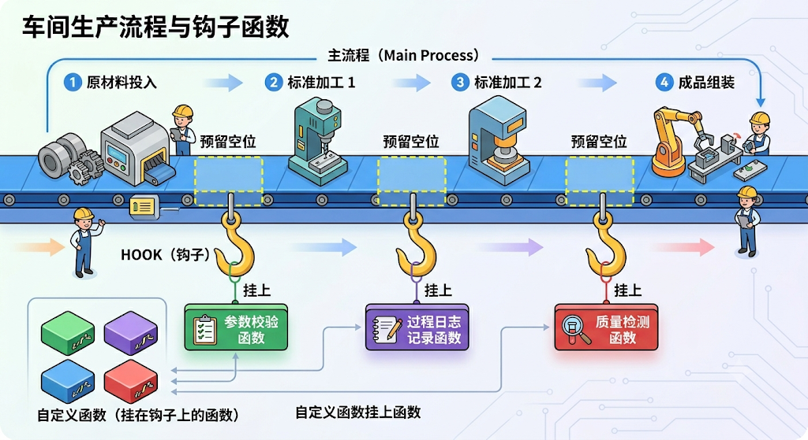
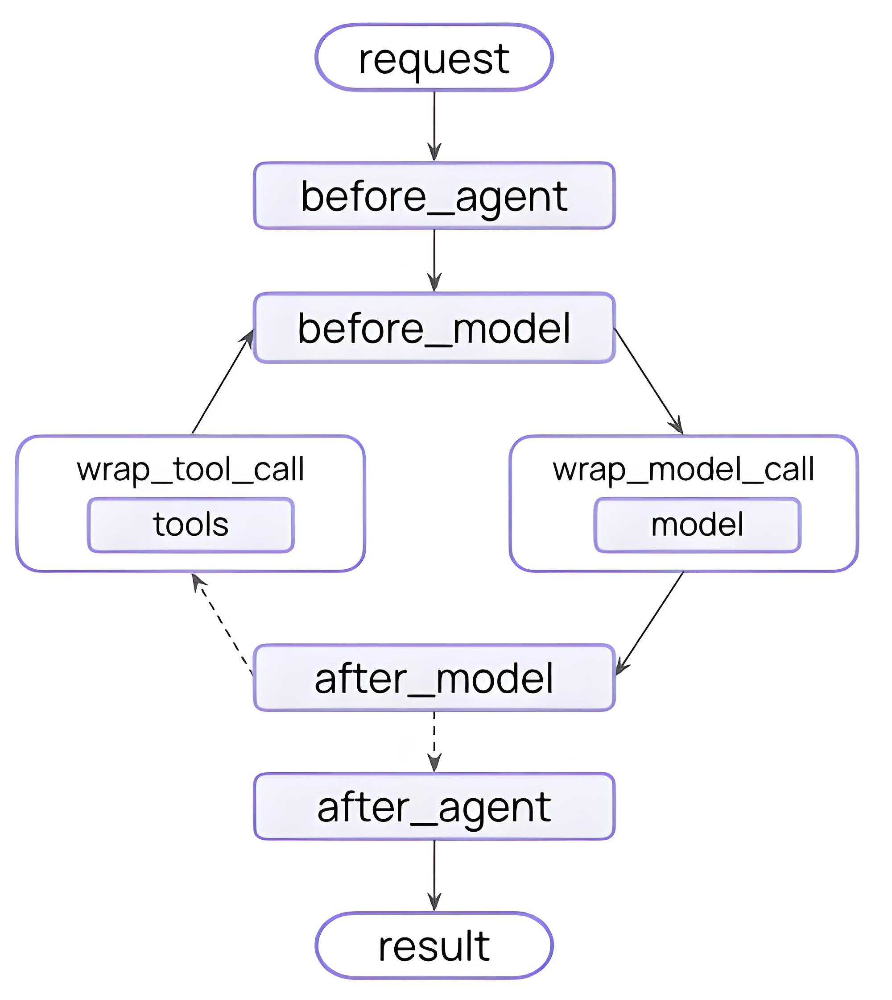

# 中间件的组合与自定义

## 4、多个中间件组合及执行顺序

**问题：Middleware 可以叠加使用，那么多个中间件书写顺序重要吗？**

非常重要！

比如：

```text
middleware=[
    TrimmerMiddleware(),       # 1. 先修剪消息
    SummarizationMiddleware(), # 2. 再摘要
    LoggingMiddleware()        # 3. 最后记录日志
]
```

比如：

```text
agent = create_agent(
    model=model,
    tools=[get_weather, get_news],
    middleware=[
        PIIMiddleware(strategy="redact"),                    # 1. 最先检查 PII
        ModelCallLimitMiddleware(run_limit=10),              # 2. 限制调用次数
        SummarizationMiddleware(max_tokens_before_summary=500),  # 3. 总结历 史
        ToolRetryMiddleware(max_retries=3),                  # 4. 重试工具
    ]
)
```

**举例：**

**1. 代码**

```python
from langchain.agents.middleware import AgentMiddleware

class Middleware1(AgentMiddleware):
    def before_model(self, state, runtime):
        print("[中间件1] before_model")
        return None

    def after_model(self, state, runtime):
        print("[中间件1] after_model")
        return None

class Middleware2(AgentMiddleware):
    def before_model(self, state, runtime):
        print("[中间件2] before_model")
        return None

    def after_model(self, state, runtime):
        print("[中间件2] after_model")
        return None

class Middleware3(AgentMiddleware):
    def before_model(self, state, runtime):
        print("[中间件3] before_model")
        return None

    def after_model(self, state, runtime):
        print("[中间件3] after_model")
        return None
agent = create_agent(
    model=model,
    tools=[],
    middleware=[Middleware1(), Middleware2(), Middleware3()]
)

print("\n执行一次调用，观察顺序：")
agent.invoke({"messages": [{"role": "user", "content": "测试"}]})

print("\n关键点：")
print("  - before_model: 正序执行（1→2→3）")
print("  - after_model: 逆序执行（3→2→1）")
print("  - 类似洋葱模型：1→2→3→模型→3→2→1")
```

**2. 输出**

```text
执行一次调用，观察顺序：
[中间件1] before_model
[中间件2] before_model
[中间件3] before_model
[中间件3] after_model
[中间件2] after_model
[中间件1] after_model
```

**3. 分析**

```text
1. Middleware1.before_model   ↓ 正序
2. Middleware2.before_model   ↓
3. Middleware3.before_model   ↓

   [模型调用]

4. Middleware3.after_model    ↑ 逆序
5. Middleware2.after_model    ↑
6. Middleware1.after_model    ↑
```

类似洋葱模型：外层先进后出

## 5、自定义中间件

某些复杂场景下，官方内置的中间件不能完全满足需求，此时可以通过实现LangChain暴露的中间件hook函数构建自定义中间件。

> 说明：尽可能使用内置中间件。

### 5.1 什么是hook函数（钩子函数）

Hook 函数，中文常叫钩子函数，指的是：在某个既定流程的特定时机，被框架、系统或主程序自动调用的扩展函数。



> 因此，可以把它理解成：

> 主流程预留了一些插槽，允许你在这些位置挂上自己的函数，这种被挂进去并在特定时机执行的函数，就是 hook 函数。

**核心特点：**

1、不是你主动在业务代码里随便调用的，而是当流程运行到某个“钩子点”时，系统自动触发它。

2、它依附于一个更大的执行流程。比如“请求开始前”“模型调用前”“任务结束后”“异常发生时”等。

3、它的作用是让你在不改主流程源码的前提下插入自己的逻辑。例如做日志、鉴权、修改输入、

拦截输出、清理资源等。

LangChain的中间件作用在Agent架构中，后者是基于LangGraph构建的流程图。如下列出了六个hook函数（钩子函数）：



无论是官方内置中间件、自定义中间件、还是下文提到的便捷装饰器中间件，通常都是通过实现其中的一个或多个hook来生效的。

### 5.2 LangChain的hook函数分类

官方将六个钩子函数按照风格分为两类

#### 类型1：Node-style hooks（节点风格钩子）

顾名思义，它们在流程的特定节点运行。

适合顺序逻辑，如记录日志、验证

包括

- before_agent：在Agent开始运行之前执行。
- before_model：在模型调用之前执行。
- after_model：在模型调用之后执行。
- after_agent：在Agent流程全部完成后执行。

#### 类型2：Wrap-style hooks（包装风格钩子）

顾名思义，它们在模型或工具调用前后运行。

适合控制流，如重试、回退、缓存。

包括

- wrap_model_call （包裹模型调用）
- wrap_tool_call （包裹工具调用）

### 5.3 Node-style hooks函数用法

支持两种用法

- 装饰器是函数式挂载，把一个hook快速挂载到Agent的某个节点。
- 类写法是对象化中间件，把中间件封装为一个可配置、可复用、可扩展的组件。

#### 5.3.1 基本用法

##### 1. 基于装饰器实现

```python
from langchain.chat_models import init_chat_model
from dotenv import load_dotenv
import os

# 从.env文件中加载环境变量
load_dotenv(override=True)

model = init_chat_model(
    model="gpt-5.4-mini",
    model_provider="openai",
    api_key=os.getenv("CLOSEAI_API_KEY"),
    base_url=os.getenv("CLOSEAI_BASE_URL")
)
```

```python
from langchain.agents.middleware import before_model, after_model, before_agent, after_agent, AgentState, AgentMiddleware
from langchain.messages import HumanMessage
from langgraph.runtime import Runtime
from langchain.agents import create_agent

from typing import Any

# 1. 定义 before_model 钩子
@before_model
def before_model_middleware(state: AgentState, runtime: Runtime) -> dict[str, Any] | None:
    state["messages"][-1].content += " -> before_model <- "
    return None

# 2. 定义 after_model 钩子
@after_model
def after_model_middleware(state: AgentState, runtime: Runtime) -> dict[str, Any] | None:
    state["messages"][-1].content += " -> after_model <- "
    return None

# 3. 定义 before_agent 钩子
@before_agent
def before_agent_middleware(state: AgentState, runtime: Runtime) -> dict[str, Any] | None:
    state["messages"][-1].content += " -> before_agent <- "
    return None

# 4. 定义 after_agent 钩子
@after_agent
def after_agent_middleware(state: AgentState, runtime: Runtime) -> None:
    state["messages"][-1].content += " -> after_agent <- "
    return None

agent = create_agent(
    model = model,
    middleware = [before_model_middleware, after_model_middleware, before_agent_middleware, after_agent_middleware] # 👈 添加中间件
)

response = agent.invoke({
    "messages": [HumanMessage("你好啊")],
})

for msg in response["messages"]:
    msg.pretty_print()
```

输出

```text
================================ Human Message =================================

你好啊 -> before_agent <-  -> before_model <-
================================== Ai Message ==================================
你好！有什么可以帮你的吗？😊 -> after_model <-  -> after_agent <-
```

1. 观察HumanMessage可以发现，before_agent钩子先于before_model被执行，二者都在调用模型

之前被执行

2. after_agent晚于after_model执行，二者都在模型调用后执行。

##### 2. 基于类实现

关键规则：

1. 必须继承 AgentMiddleware ← 这个固定

2. 方法名固定 ( before_model , after_model ) ← 这个固定

3. 类名随意 ← 这个不固定

LangGraph 只看：

- 是否继承 AgentMiddleware？
- 是否有 before_model / after_model 等方法？

举例：

```python
from langchain.agents.middleware import AgentMiddleware, AgentState, hook_config
from langchain.messages import HumanMessage
from langgraph.runtime import Runtime
from langchain.agents import create_agent

from typing import Any
class MyMiddleware(AgentMiddleware):
    def __init__(self):
        super().__init__()

    def before_model(self, state: AgentState, runtime: Runtime) -> dict[str, Any] | None:
        state["messages"][-1].content += " -> before_model <- "
        return None

    def after_model(self, state: AgentState, runtime: Runtime) -> dict[str, Any] | None:
        state["messages"][-1].content += " -> after_model <- "
        return None

    def before_agent(self, state: AgentState, runtime: Runtime) -> dict[str, Any] | None:
        state["messages"][-1].content += " -> before_agent <- "
        return None

    def after_agent(self, state: AgentState, runtime: Runtime) -> None:
        state["messages"][-1].content += " -> after_agent <- "
        return None

my_middleware = MyMiddleware()

agent = create_agent(
    model = model,
    middleware = [my_middleware]
)

response = agent.invoke({
    "messages": [HumanMessage("你好啊")],
})

for msg in response["messages"]:
    msg.pretty_print()
```

输出

```text
================================•[1m Human Message •[0m=================================

你好啊 -> before_agent <-  -> before_model <-
==================================•[1m Ai Message •[0m==================================

你好！看起来你发送的消息中包含一些特殊的标记，比如 `before_agent` 和 `before_model`。请问你是想测试某种流程，还是需要我帮你处理特定的任务呢？
如果是技术测试或调试，请告诉我具体需求；如果是普通聊天，我们可以直接开始对话哦！ 😊 ->
after_model <-  -> after_agent <-
```

1. before_model 通常的场景：

  - 消息修剪（trim messages）
  - PII 脱敏
  - 输入验证
  - 条件路由

2. after_model 通常的场景：

  - 输出验证
  - 格式化响应
  - 统计信息
  - 状态更新

#### 5.3.2 两种方法的统一

装饰器底层会基于我们重写的方法构造一个AgentMiddleware子类的实例，以@after_model 装饰器底层实现为例，关键代码如下

```text
return type(
    middleware_name,
    (AgentMiddleware,),
    {
        "state_schema": state_schema or AgentState,
        "tools": tools or [],
        "after_model": wrapped,
    },
)()
```

这是after_model最终返回的内容。

上述代码中的wrapped是after_model内部的装饰器，代码如下

```python
def wrapped(
    _self: AgentMiddleware[StateT, ContextT],
    state: StateT,
    runtime: Runtime[ContextT],
) -> dict[str, Any] | Command[Any] | None:
    return func(state, runtime)  # type: ignore[return-value]
```

上述代码等价于

```text
return type(
    middleware_name,
    (AgentMiddleware,),
    {
        "state_schema": state_schema or AgentState,
        "tools": tools or [],
        "after_model": func(state, runtime),
    },
)()
```

而func(state, runtime) 正是我们定义的、被@after_model 修饰的函数，在上述案例中对应的是after_model_middleware，

上述代码的含义是

1. 创建一个AgentMiddleware的子类

2. 类名为middleware_name，即创建agent时传递的中间件名称，上述案例中是

after_model_middleware

3. 这个子类有两个属性state_schema 和tools

4. 有一个方法：after_model ，逻辑等同于func(state, runtime) 。

5. 最后的括号（） 表示实例化子类，返回一个对象

所以，用装饰器最终返回的也是一个AgentMiddleware的子类对象，并且重写了after_model方法，和基于类的自定义方式本质是一样的。

#### 5.3.3 参数说明

Node-style hooks函数有两个参数

state: 是一个AgentState实例，维护Agent运行过程中的状态，这类状态会随着Agent的运行而发生变化，包括消息列表。

runtime: 是一个Runtime实例，维护Agent运行过程中的上下文环境，包括上下文、长期记忆等。

#### 5.3.4 返回值说明

返回 None：不修改状态（不修改Agent状态）

```python
def before_model(self, state, runtime):
    print("日志记录")
    return None  # 不做任何修改，继续流程
```

返回字典：更新状态

```python
def after_model(self, state, runtime):
    count = state.get("count", 0)
    return {"count": count + 1}  # 更新状态中的 count
```

返回 {"jump_to": "..."}：控制流程

```python
def before_model(self, state, runtime):
    if state.get("count", 0) > 10:
        return {"jump_to": "__end__"}  # 跳过模型，直接结束
    return None
```

jump_to 目标：

- "__end__" - 结束 Agent
- "tools" - 跳到工具节点
- 其他自定义节点

#### 5.3.5 装饰器参数：can_jump_to

这里就涉及到Node-style的四个hook函数可以接收额外参数can_jump_to 。

钩子函数可以改变Agent正常的运行轨迹。比如：发现上下文窗口溢出，直接跳转至结尾，提前终止整个Agent。

can_jump_to 决定了钩子函数可以直接跳转至流程的哪些位置，可取值如下：

- end：跳转至Agent流程末尾，或第一个after_agent钩子，直接终止整个流程。
- tools：跳转至工具节点。
- model：跳转至模型节点，或第一个before_model钩子。

##### 1. 基于装饰器实现

```python
from typing import Any

from langchain.agents import create_agent
from langchain.agents.middleware import before_model, after_model, AgentState
from langchain.messages import AIMessage, SystemMessage
from langchain.tools import tool
from langgraph.runtime import Runtime

@tool
def get_news() -> str:
    """获取当日新闻"""
    return f"美加墨世界杯今日开幕"

# 在模型（LLM）执行前触发。允许跳转到 "tools" 节点。
@before_model(can_jump_to=["tools"])
def force_tool_first(state: AgentState, runtime: Runtime) -> dict[str, Any] | None:
    """
    【业务场景：强行拦截并触发工具】
    如果用户输入包含 "direct tool"，则跳过本次大模型的思考/生成阶段，
    直接伪造一个大模型的 tool_calls 意图，强行把控制权移交给工具执行节点。
    """
    text = state["messages"][-1].content
    # 检查关键词，满足条件则强行干预流程
    if isinstance(text, str) and "direct tool" in text.lower():
        print("[MIDDLEWARE] before_model: jump_to='tools'")

        # 人工构造一个大模型的消息对象（AIMessage）
        # 欺骗系统，让系统误以为这是模型自己决定要调用的工具
        fake_tool_call = AIMessage(
            content="人工构造的消息",
            tool_calls=[
                {
                    "name": "get_news",
                    "args": {},
                    "id": "call_force_weather_001",
                }
            ],
        )

        # 返回更新后的状态：注入伪造的消息，并明确指定下一步跳转到 "tools" 节点
        return {
            "messages": [fake_tool_call],
            "jump_to": "tools",
        }
    # 如果不满足触发条件，返回 None，流程正常向下流转（继续让 LLM 思考）
    return None

# 在模型（LLM）执行生成之后触发。允许重新跳转回 "model" 节点。
@after_model(can_jump_to=["model"])
def retry_with_extra_instruction(state: AgentState, runtime: Runtime) -> dict[str, Any] | None:
    """
    【业务场景：反思/重试机制】
    如果大模型已经生成了回答，但发现用户最初的请求包含 "retry model"，
    则动态追加一条系统提示词（SystemMessage），强行让模型重新生成（重试）一次。
    """
    # 倒序遍历消息历史，找到最近的一次用户输入（human 消息）
    user_text = ""
    for msg in reversed(state["messages"]):
        if getattr(msg, "type", "") == "human":
            user_text = getattr(msg, "content", "")
            break

    # 检查用户输入是否包含触发重试的关键字
    if isinstance(user_text, str) and "retry model" in user_text.lower():
        # 【核心防御】：防止无限循环重跳（死循环）
        # 检查消息历史中是否已经注入过这条特殊的系统提示。如果有，说明已经重试过了，不再 重复干预。
        already_injected = any(
            isinstance(getattr(msg, "content", None), str)
            and "你必须以【二次回答】开头" in msg.content
            for msg in state["messages"]
        )
        if already_injected:
            return None # 已注入过，直接放行，结束重试流程

        print("[MIDDLEWARE] after_model: jump_to='model' with extra system instruction")

        # 返回更新后的状态：追加强力约束的系统消息，并将指针跳回 "model" 节点重新执行
        return {
            "messages": [
                SystemMessage("你必须以【二次回答】开头，并且只用一句话回答。")
            ],
            "jump_to": "model",
        }

    return None

# 在模型（LLM）执行前触发。允许直接跳转到 "end" 节点（强行终止）。
@before_model(can_jump_to=["end"])
def overflow_context_processor(state: AgentState, runtime: Runtime) -> dict[str, Any] | None:
    """
    【业务场景：安全卫士/异常拦截】
    模拟上下文窗口溢出（Token超限）或其他严重的系统阻断情况。
    一旦触发，直接熔断流程，拒绝让大模型继续处理，直接报错或返回兜底文案。
    """

    # 假装溢出,模拟检查最后一条消息是否包含 overflow 标识
    if "overflow" in state["messages"][-1].content:
        print("[MIDDLEWARE] before_model: jump_to='end' when contenxt window overflow")

        # 构造兜底的结束消息，并直接指定跳转到 "end" 终止 Agent 运行
        return {
            "messages": [
                AIMessage("上下文窗口溢出，终止")
            ],
            "jump_to": "end",
        }

agent = create_agent(
    model=model,
    tools=[get_news],
    # # 将定义的中间件按照顺序挂载到 Agent 中（注意：执行顺序会严格按照列表声明顺序）
    middleware=[force_tool_first, retry_with_extra_instruction, overflow_context_processor],
)

def run_once(user_input: str):
    result = agent.invoke(
        {
            "messages": [
                {"role": "user", "content": user_input}
            ]
        }
    )

    for msg in result["messages"]:
        msg.pretty_print()

if __name__ == "__main__":
    # Case 1: 直接跳 tools
    # 预期表现：
    # 1. 触发 force_tool_first，打印 "[MIDDLEWARE] before_model: jump_to='tools'"
    # 2. 绕过 LLM 的首轮思考，直接调用 `get_news` 工具
    # 3. 工具返回结果后，LLM 总结工具结果并输出
    print('=' * 30, '-> Case 1 <-', '=' * 30)
    run_once("请帮我查今日新闻 direct tool")

    # Case 2: 输出后跳回 model
    # 预期表现：
    # 1. 正常进入 LLM 生成第 1 版回答
    # 2. 触发 retry_with_extra_instruction，打印 "[MIDDLEWARE] after_model: jump_to='model'..."
    # 3. 注入系统提示词后，LLM 被强行拉回并生成第 2 版回答
    # 4. 最终输出应带有“【二次回答】”前缀
    print('=' * 30, '-> Case 2 <-', '=' * 30)
    run_once("请随便介绍一下 LangChain retry model")

    # Case 3:
    # 预期表现：
    # 1. 触发 overflow_context_processor 中间件
    # 2. 直接打印终止信息并退出，LLM 根本不会接收到这个请求
    print('=' * 30, '-> Case 3 <-', '=' * 30)
    run_once("你好 overflow")

    # Case 4: 正常流程
    # 预期表现：
    # 1. 没有任何中间件被触发（不满足任何关键字）
    # 2. Agent 走正常的 OOTB（Out of the box）标准工作流：User -> Model -> Call Tool -> Model -> End
    print('=' * 30, '-> Case 4 <-', '=' * 30)
    run_once("今日新闻摘要？")
```

输出

```text
============================== -> Case 1 <- ==============================
[MIDDLEWARE] before_model: jump_to='tools'
================================ Human Message =================================

请帮我查今日新闻 direct tool
================================== Ai Message ==================================

人工构造的消息
Tool Calls:
get_news (call_force_weather_001)
Call ID: call_force_weather_001
Args:
================================= Tool Message =================================
Name: get_news

美加墨世界杯今日开幕
================================== Ai Message ==================================

今日新闻：
- 美加墨世界杯今日开幕

如果你想，我也可以继续帮你整理成：
1. 一句话摘要
2. 3条要点
3. 中文新闻解读
============================== -> Case 2 <- ==============================
[MIDDLEWARE] after_model: jump_to='model' with extra system instruction
================================ Human Message =================================

请随便介绍一下 LangChain retry model
================================== Ai Message ==================================

可以，简单介绍一下 **LangChain 的 retry model（重试机制）**。

## 1. 它是什么
在 LangChain 里，retry model 指的是：
当模型调用失败时，自动重试几次，而不是立刻报错。

常见失败原因包括：
- 网络抖动
- API 临时不可用
- 限流（rate limit）
- 超时
- 服务端偶发错误

---

## 2. 它解决什么问题
大模型调用并不是每次都稳定成功。
重试机制的作用就是提高程序鲁棒性，让你的链路更“抗打”。

比如：
- 第一次请求超时
- 第二次请求成功

这样用户就不需要手动刷新或重新触发。

---

## 3. 在 LangChain 中怎么理解
LangChain 本身经常会包裹底层模型调用，比如 OpenAI、Anthropic、Hugging Face 等。
Retry model 通常意味着给这些调用加上一层 **自动重试包装**。

典型逻辑是：
1. 发送请求
2. 如果成功，直接返回
3. 如果失败，等待一小段时间
4. 再试一次
5. 达到最大次数后，抛出错误

---

## 4. 常见特性
重试机制一般会带这些能力：

- **最大重试次数**：比如 3 次、5 次
- **指数退避**：每次失败后等待时间逐渐增加
- **只对可重试错误生效**：比如网络错误、429、5xx
- **不重试业务错误**：比如参数格式不对、提示词错误

---

## 5. 一个直观例子
你可以把它理解成：

> “如果模型第一次没接通，等一下再拨；如果还不通，再等久一点继续拨。”

这比直接失败更适合生产环境。

---

## 6. 适合用在哪
特别适合这些场景：
- 在线问答系统
- Agent 工具调用
- 批量任务处理
- 需要高可用的生产服务

---

## 7. 需要注意什么
虽然重试很好用，但也不是越多越好：

- 重试太多会增加延迟
- 失败请求会消耗更多 token / API 额度
- 如果是逻辑错误，重试也没用
- 要避免重复执行有副作用的操作

---

## 8. 一句话总结
**LangChain retry model 本质上就是为大模型调用加“自动重试 + 退避”能力，提高调 用稳定性和容错率。**

如果你愿意，我也可以继续给你讲：
- LangChain 里具体怎么写 retry
- 和 `with_retry()` 的关系
- Python 里一个最小示例

================================ System Message ================================

你必须以【二次回答】开头，并且只用一句话回答。
================================== Ai Message ==================================

【二次回答】LangChain 的 retry model 就是给模型调用加上自动重试和指数退避机制， 在网络抖动、限流或临时服务错误时提高调用成功率与稳定性。
============================== -> Case 3 <- ==============================
[MIDDLEWARE] before_model: jump_to='end' when contenxt window overflow
================================ Human Message =================================

你好 overflow
================================== Ai Message ==================================

上下文窗口溢出，终止
============================== -> Case 4 <- ==============================
================================ Human Message =================================

今日新闻摘要？
================================== Ai Message ==================================
Tool Calls:
  get_news (call_IYwXdmiTrkWDX5Zr6VM2RZOO)
 Call ID: call_IYwXdmiTrkWDX5Zr6VM2RZOO
  Args:
================================= Tool Message =================================
Name: get_news

美加墨世界杯今日开幕
================================== Ai Message ==================================

今日新闻摘要：
- **美加墨世界杯今日开幕**

如果你需要，我也可以把这条新闻进一步整理成：
1. **一句话摘要**
2. **背景解读**
3. **可能影响**
```

1. 我们提前判定需要调用工具，直接在before_model中跳转至工具节点，省去了一次模型调用

2. 通过约定的retry model标记，在after_model之后再次跳转到模型节点，触发模型重复调用

3. 通过约定的overflow标记，模拟上下文窗口溢出，在before_model中直接跳转至结尾，提前终

止流程

4. Case 4 是没有被干预的正常Agent流程，作为对照。

##### 2. 基于类实现

和基于装饰器实现的关键区别在于：需要引入额外的装饰器@hook_config 为can_jump_to 传参。

```python
from typing import Any

from langchain.agents import create_agent
from langchain.agents.middleware import hook_config, AgentState, AgentMiddleware
from langchain.messages import AIMessage, SystemMessage
from langchain.tools import tool
from langgraph.runtime import Runtime

@tool
def get_news() -> str:
    """获取当日新闻"""
    return f"美加墨世界杯今日开幕"

class MyMiddleware(AgentMiddleware):
    @hook_config(can_jump_to=["tools", "end"])
    def before_model(self, state: AgentState, runtime: Runtime) -> dict[str, Any] | None:
        text = state["messages"][-1].content
        # 假装溢出
        if "overflow" in text:
            print("[MIDDLEWARE] before_model: jump_to='end' when contenxt window overflow")
            return {
                "messages": [
                    AIMessage("上下文窗口溢出，终止")
                ],
                "jump_to": "end",
            }

        if isinstance(text, str) and "direct tool" in text.lower():
            print("[MIDDLEWARE] before_model: jump_to='tools'")

            fake_tool_call = AIMessage(
                content="人工构造的消息",
                tool_calls=[
                    {
                        "name": "get_news",
                        "args": {},
                        "id": "call_force_weather_001",
                    }
                ],
            )

            return {
                "messages": [fake_tool_call],
                "jump_to": "tools",
            }

        return None

    @hook_config(can_jump_to=["model"])
    def after_model(self, state: AgentState, runtime: Runtime) -> dict[str, Any] | None:
        user_text = ""
        for msg in reversed(state["messages"]):
            if getattr(msg, "type", "") == "human":
                user_text = getattr(msg, "content", "")
                break

        if isinstance(user_text, str) and "retry model" in user_text.lower():
            # 防止无限重跳：如果已经加过提示，就不再跳
            already_injected = any(
                isinstance(getattr(msg, "content", None), str)
                and "你必须以【二次回答】开头" in msg.content
                for msg in state["messages"]
            )
            if already_injected:
                return None

            print("[MIDDLEWARE] after_model: jump_to='model' with extra system instruction")

            return {
                "messages": [
                    SystemMessage("你必须以【二次回答】开头，并且只用一句话回答。")
                ],
                "jump_to": "model",
            }

        return None

agent = create_agent(
    model=model,
    tools=[get_news],
    middleware=[MyMiddleware()],
)

def run_once(user_input: str):
    result = agent.invoke(
        {
            "messages": [
                {"role": "user", "content": user_input}
            ]
        }
    )

    for msg in result["messages"]:
        msg.pretty_print()

if __name__ == "__main__":
    # Case 1: 直接跳 tools
    print('=' * 30, '-> Case 1 <-', '=' * 30)
    run_once("请帮我查今日新闻 direct tool")

    # Case 2: 输出后跳回 model
    print('=' * 30, '-> Case 2 <-', '=' * 30)
    run_once("请随便介绍一下 LangChain retry model")

    # Case 3:
    print('=' * 30, '-> Case 3 <-', '=' * 30)
    run_once("你好 overflow")

    # Case 4: 正常流程
    print('=' * 30, '-> Case 4 <-', '=' * 30)
    run_once("今日新闻摘要？")
```

输出

```text
============================== -> Case 1 <- ==============================
[MIDDLEWARE] before_model: jump_to='tools'
================================ Human Message =================================

请帮我查今日新闻 direct tool
================================== Ai Message ==================================

人工构造的消息
Tool Calls:
get_news (call_force_weather_001)
Call ID: call_force_weather_001
Args:
================================= Tool Message =================================
Name: get_news

美加墨世界杯今日开幕
================================== Ai Message ==================================

今日新闻：
- 美加墨世界杯今日开幕

如果你愿意，我也可以帮你继续整理成：
1. 简短版要闻
2. 详细新闻摘要
3. 按国内 / 国际 / 财经分类整理

============================== -> Case 2 <- ==============================
[MIDDLEWARE] after_model: jump_to='model' with extra system instruction
================================ Human Message =================================

请随便介绍一下 LangChain retry model
================================== Ai Message ==================================

当然可以。下面我用比较通俗的方式介绍一下 **LangChain 的 retry model（重试机制） **。

## 1. 它是什么
在调用大模型或外部工具时，可能会遇到一些临时性失败，比如：

- 网络超时
- API 限流
- 服务端偶发错误
- 返回内容格式不符合预期

**retry model** 的作用就是：
当第一次调用失败时，自动再试几次，直到成功或者达到最大重试次数。

---

## 2. 为什么需要它
大模型调用不像普通本地函数，很多问题不是“代码错了”，而是“环境不稳定”。
比如：

- 第一次请求超时，第二次却成功了
- 某次返回了空内容，再请求一次就正常
- 短时间内触发 rate limit，稍等一下再调用就行

所以重试机制能提高程序的稳定性和容错率。

---

## 3. LangChain 里怎么用
LangChain 通常会结合底层模型客户端或自己的 runnable 机制来做重试。常见思路是：

- 设置最大重试次数
- 设置重试间隔
- 指定哪些错误需要重试
- 失败后自动重新调用

有时你会看到类似“包装一个 chain / runnable / model，让它带 retry 行为”。

---

## 4. 它通常会做什么
一个典型 retry model 会包含：

- **重试次数上限**：比如最多 3 次
- **退避策略**：每次失败后等更久一点再试，比如 1s、2s、4s
- **错误筛选**：只对临时错误重试，不对参数错误重试
- **日志记录**：方便知道为什么重试

---

## 5. 简单理解
你可以把它理解成：

> “如果大模型这次没答好，不要立刻放弃，给它几次机会。”

---

## 6. 注意事项
重试虽然有用，但不是越多越好：

- 会增加延迟
- 会增加调用成本
- 如果错误是逻辑错误，重试也没用

所以一般只对**短暂性、可恢复错误**启用重试。

---

## 7. 一个直观例子
比如你问模型一个问题：

1. 第一次请求：超时
2. 第二次请求：返回 429（限流）
3. 第三次请求：成功

这就是 retry model 在起作用。

---

如果你愿意，我还可以继续给你讲：
1. **LangChain 里 retry 的代码示例**
2. **retry 和 fallback 的区别**
3. **Python 里怎么给 LLM 调用加重试**
================================ System Message ================================

你必须以【二次回答】开头，并且只用一句话回答。
================================== Ai Message ==================================

【二次回答】LangChain 的 retry model 就是给大模型调用加“自动重试”机制：遇到超 时、限流或临时错误时按次数和退避策略重新请求，从而提高稳定性和成功率。

============================== -> Case 3 <- ==============================
[MIDDLEWARE] before_model: jump_to='end' when contenxt window overflow
================================ Human Message =================================

你好 overflow
================================== Ai Message ==================================
上下文窗口溢出，终止

============================== -> Case 4 <- ==============================
================================ Human Message =================================

今日新闻摘要？
================================== Ai Message ==================================
Tool Calls:
  get_news (call_R4eUqp1uGgAGvYQLqDpUv6CW)
 Call ID: call_R4eUqp1uGgAGvYQLqDpUv6CW
  Args:
================================= Tool Message =================================
Name: get_news

美加墨世界杯今日开幕
================================== Ai Message ==================================

今日新闻摘要：

- **美加墨世界杯今日开幕**

如果你愿意，我也可以把这条新闻再整理成**一句话版**、**要点版**，或者帮你补充**背景 解读**。
```

### 5.4 Wrap-style hooks函数用法

#### 5.4.1 基本用法

##### 1. wrap_model_call

###### ① 基于装饰器实现

我们可以同时在模型调用前后做事，所以命名为wrap_model_call ，wrap意为包裹。

源码：

```python
def wrap_model_call(
    request: ModelRequest,
    handler: Callable[[ModelRequest], ModelResponse]
) -> ModelResponse:
    """
    request: 包含 model, messages, system_message, tools, state
    handler: 执行实际模型调用的函数
    返回：ModelResponse
    """
```

代码实现：

```python
from langchain.chat_models import init_chat_model
from dotenv import load_dotenv
import os

# 从.env文件中加载环境变量
load_dotenv(override=True)

model = init_chat_model(
    model="gpt-5.4-mini",
    model_provider="openai",
    api_key=os.getenv("CLOSEAI_API_KEY"),
    base_url=os.getenv("CLOSEAI_BASE_URL")
)
```

```python
from langchain.agents.middleware import wrap_model_call, ModelRequest, ModelResponse
from langchain.messages import HumanMessage
from langchain.agents import create_agent
from typing import Callable

@wrap_model_call
def wrap_model_call_middleware(
    request: ModelRequest, # 包含即将发送给大模型的所有请求数据（如消息列表、温度等）
    handler: Callable[[ModelRequest], ModelResponse], # 核心句柄：代表下一个中间 件或最终的大模型调用服务
) -> ModelResponse | None:
    # 动态篡改用户发出的最后一条消息的内容，悄悄往里面追加字符串。
    # 典型应用：统一在底层为所有请求追加特殊的 Prompt 提示词（例如：“请用中文回答”、“禁 止透漏公司机密”等）。
    request.messages[-1].content += " -> wrap_model_call_before <- "
    # 将修改后的请求传递给 handler，真正去调用大模型（或者流转到下一个拦截器）
    # 这一步会产生真实的 Token 消耗并等待大模型响应
    response = handler(request)
    # 大模型返回响应后，在将响应交付给 Agent 状态机之前，对其内容进行直接篡改
    # `response.result` 是一个消息列表，修改其第一条返回消息的内容
    # 典型应用：做底层的文本敏感词过滤、输出格式强行格式化、或是统一添加某些后处理标记。
    response.result[0].content += " -> wrap_model_call_after <- "
    # 将修改完的响应体返回，继续维持 Agent 生命周期流转
    return response

agent = create_agent(
    model = model,
    middleware = [wrap_model_call_middleware]
)

response = agent.invoke({
    "messages": [HumanMessage("你好啊")],
})

for msg in response["messages"]:
    msg.pretty_print()
```

输出

```text
================================ Human Message =================================

你好啊 -> wrap_model_call_before <-
================================== Ai Message ==================================

你好！有什么我可以帮你的？ -> wrap_model_call_after <-
```

模型调用前消息列表的最后一条是HumanMessage，调用后最后一条是AIMessage，可以看到，模型调用前后的更改都生效了。

###### ② 基于类实现

```python
from langchain.agents.middleware import AgentMiddleware, ModelRequest, ModelResponse
from langchain.messages import HumanMessage
from langchain.agents import create_agent
from typing import Callable

class WrapModelCallMiddleWare(AgentMiddleware):
    def wrap_model_call(
        self,
        request: ModelRequest,
        handler: Callable[[ModelRequest], ModelResponse],
    ) -> ModelResponse | None:
        request.messages[-1].content += " -> wrap_model_call_before <- "
        response = handler(request)
        response.result[0].content += " -> wrap_model_call_after <- "

        return response

agent = create_agent(
    model = model,
    middleware = [WrapModelCallMiddleWare()]
)

response = agent.invoke({
    "messages": [HumanMessage("你好啊")],
})

for msg in response["messages"]:
    msg.pretty_print()
```

输出

```text
================================ Human Message =================================

你好啊 -> wrap_model_call_before <-
================================== Ai Message ==================================

你好！`wrap_model_call_before` 这部分是想做什么呢？如果你是在测试消息包裹、提示词 注入，或者想让我按某种格式回复，可以直接告诉我规则。 -> wrap_model_call_after <-
```

使用场景：用于拦截、重试、缓存模型调用。

**场景1：重试逻辑**

```python
from langchain.agents.middleware import wrap_model_call, ModelRequest, ModelResponse
from typing import Callable
import time

@wrap_model_call
def retry_model(
    request: ModelRequest,
    handler: Callable[[ModelRequest], ModelResponse]
) -> ModelResponse:
    """自动重试失败的模型调用"""
    max_retries = 3

    for attempt in range(max_retries):
        try:            print(f"🔄 尝试调用模型（第 {attempt + 1}/{max_retries} 次）")

            return handler(request)
        except Exception as e:
            if attempt == max_retries - 1:                print(f"❌ 所有重试失败：{e}")

                raise

            # 指数退避
            wait_time = 2 ** attempt            print(f"⚠  调用失败：{e}，{wait_time} 秒后重试")

            time.sleep(wait_time)
```

**场景2：响应缓存**

```python
from langchain.agents.middleware import wrap_model_call, ModelRequest, ModelResponse
from typing import Callable
import hashlib
import json

class ModelCache:
    """模型响应缓存"""
    def __init__(self):
        self.cache = {}

    def create_hook(self):
        @wrap_model_call
        def cache_model(
            request: ModelRequest,
            handler: Callable[[ModelRequest], ModelResponse]
        ) -> ModelResponse:
            # 生成缓存键
            cache_key = hashlib.md5(
                json.dumps({
                    "messages": [str(m) for m in request.messages],
                    "system": str(request.system_message)
                }).encode()
            ).hexdigest()
            # 检查缓存
            if cache_key in self.cache:                print("💾 缓存命中！")

                return self.cache[cache_key]

            # 调用模型            print("🔍 缓存未命中，调用模型")

            response = handler(request)

            # 存入缓存
            self.cache[cache_key] = response
            return response

        return cache_model

# 使用
cache = ModelCache()
agent = create_agent(
    model=model,
    middleware=[cache.create_hook()]
)
```

**场景3：修改系统提示**

```python
from langchain.agents.middleware import wrap_model_call, ModelRequest, ModelResponse
from langchain_core.messages import SystemMessage
from typing import Callable

@wrap_model_call
def add_context(
    request: ModelRequest,
    handler: Callable[[ModelRequest], ModelResponse]
) -> ModelResponse:
    """动态添加上下文信息到系统提示"""

    # 获取当前时间
    from datetime import datetime
    current_time = datetime.now().strftime("%Y-%m-%d %H:%M:%S")

    # 构建新的系统消息
    original_content = request.system_message.content if request.system_message else ""
    new_content = f"""{original_content}

      当前时间：{current_time}
      用户位置：中国
      语言偏好：中文
      """

    # 创建新的系统消息
    new_system_message = SystemMessage(content=new_content)

    # 使用 override 方法修改请求
    modified_request = request.override(system_message=new_system_message)
```

```text
    return handler(modified_request)
```

##### 2. wrap_tool_call

我们可以同时在工具调用前后做事，所以命名为wrap_tool_call 。

###### ① 基于装饰器实现

```python
from langchain.agents.middleware import wrap_tool_call
from langchain.tools.tool_node import ToolCallRequest
from langchain.messages import HumanMessage, ToolMessage
from langchain.agents import create_agent
from langchain.tools import tool
from langgraph.types import Command
from typing import Callable

@tool
def get_weather(city: str, is_forcast: bool) -> str:
    """
    获取当日特定城市的天气

    Args:
        city: 城市名称
        is_forcast: 是否包含明天的天气预报
    """
    res = f"{city}今天天气不错"
    if is_forcast:
        res += "\n明天天气也很好"
    return res

@wrap_tool_call
def wrap_tool_call_middleware(
        request: ToolCallRequest,
        handler: Callable[[ToolCallRequest], ToolMessage | Command],
) -> ToolMessage | Command:
    result = handler(request)
    print(f"原始参数：{request.tool_call['args']}")
    print(f"原始参数调用结果： {result}")

    request.tool_call["args"]["is_forcast"] = True
    result = handler(request)
    print(f"更新后的参数：{request.tool_call['args']}")
    print(f"更新参数调用结果： {result}")
    return result

agent = create_agent(
    model=model,
    tools=[get_weather],
    middleware=[wrap_tool_call_middleware]
)

response = agent.invoke({
    "messages": [HumanMessage("你好啊，今天杭州的天气怎么样")],
})

for msg in response["messages"]:
    msg.pretty_print()
```

输出

```text
原始参数：{'city': '杭州', 'is_forcast': False}
原始参数调用结果： content='杭州今天天气不错' name='get_weather' tool_call_id='call_2StbfD50EA3AWleNShXhefbf'
更新后的参数：{'city': '杭州', 'is_forcast': True}
更新参数调用结果： content='杭州今天天气不错\n明天天气也很好' name='get_weather' tool_call_id='call_2StbfD50EA3AWleNShXhefbf'
================================ Human Message =================================

你好啊，今天杭州的天气怎么样
================================== Ai Message ==================================
Tool Calls:
get_weather (call_2StbfD50EA3AWleNShXhefbf)
Call ID: call_2StbfD50EA3AWleNShXhefbf
 Args:
  city: 杭州
   is_forcast: True
================================= Tool Message =================================
Name: get_weather

杭州今天天气不错
明天天气也很好
================================== Ai Message ==================================

杭州今天天气不错，明天天气也很好。
```

在@wrap_tool_call装饰的函数中两次调用函数并更改参数。

###### ② 基于类实现

```python
from langchain.agents.middleware import AgentMiddleware
from langchain.tools.tool_node import ToolCallRequest
from langchain.messages import HumanMessage, ToolMessage
from langchain.agents import create_agent
from langchain.tools import tool
from langgraph.types import Command
from typing import Callable

@tool
def get_weather(city: str, is_forcast: bool) -> str:
    """
    获取当日特定城市的天气

    Args:
        city: 城市名称
        is_forcast: 是否包含明天的天气预报
    """
    res = f"{city}今天天气不错"
    if is_forcast:
        res += "\n明天天气也很好"
    return res

class WrapToolCallMiddleware(AgentMiddleware):
    def wrap_tool_call(
        self,
        request: ToolCallRequest,
        handler: Callable[[ToolCallRequest], ToolMessage | Command],
    ) -> ToolMessage | Command:
        result = handler(request)
        print(f"原始参数：{request.tool_call['args']}")
        print(f"原始参数调用结果： {result}")

        request.tool_call["args"]["is_forcast"] = True
        result = handler(request)
        print(f"更新后的参数：{request.tool_call['args']}")
        print(f"更新参数调用结果： {result}")
        return result

agent = create_agent(
    model = model,
    tools = [get_weather],
    middleware = [WrapToolCallMiddleware()]
)

response = agent.invoke({
    "messages": [HumanMessage("你好啊，今天杭州的天气怎么样")],
})

for msg in response["messages"]:
    msg.pretty_print()
```

输出

```text
原始参数：{'city': '杭州', 'is_forcast': False}
原始参数调用结果： content='杭州今天天气不错' name='get_weather' tool_call_id='call_yU58ykg0IY1paVlGqTBuU8Ie'
更新后的参数：{'city': '杭州', 'is_forcast': True}
更新参数调用结果： content='杭州今天天气不错\n明天天气也很好' name='get_weather' tool_call_id='call_yU58ykg0IY1paVlGqTBuU8Ie'
================================ Human Message =================================

你好啊，今天杭州的天气怎么样
================================== Ai Message ==================================
Tool Calls:
get_weather (call_yU58ykg0IY1paVlGqTBuU8Ie)
Call ID: call_yU58ykg0IY1paVlGqTBuU8Ie
 Args:
  city: 杭州
   is_forcast: True
================================= Tool Message =================================
Name: get_weather
杭州今天天气不错
明天天气也很好
================================== Ai Message ==================================

杭州今天天气不错，明天天气也很好。
```

使用场景：用于监控、重试、修改工具执行。

比如：

```python
from langchain.agents.middleware import wrap_tool_call
from langchain.tools.tool_node import ToolCallRequest
from langchain_core.messages import ToolMessage
from langgraph.types import Command
from typing import Callable
import time

@wrap_tool_call
def monitor_tool(
    request: ToolCallRequest,
    handler: Callable[[ToolCallRequest], ToolMessage | Command]
) -> ToolMessage | Command:
    """监控工具执行时间和状态"""

    tool_name = request.tool_call["name"]
    tool_args = request.tool_call.get("args", {})
    print(f"🔧 开始执行工具：{tool_name}")

    print(f"   参数：{tool_args}")

    start_time = time.time()
    try:
        result = handler(request)
        elapsed = time.time() - start_time        print(f"✅ 工具执行成功，耗时：{elapsed:.2f}秒")

        return result
    except Exception as e:
        elapsed = time.time() - start_time        print(f"❌ 工具执行失败：{e}，耗时：{elapsed:.2f}秒")

        raise
```

#### 5.4.2 两种方法的统一

同上，装饰器方法底层也会创建一个AgentMiddleware的实例。

#### 5.4.3 参数说明

request：被封装的请求对象，可以是模型或工具调用请求

handler：处理器，用于处理请求并返回调用结果。

### 5.5 装饰器和类的选择

**情况1：中间件只用一个钩子函数，推荐用装饰器，需要多个钩子函数推荐类写法**

- 当一个中间件只需要实现一个钩子函数时，直接使用装饰器最简单。
- 当一个中间件需要实现多个钩子函数时，类写法更合适。

装饰器也不是不能实现，多数情况下可以像下面的示例里那样通过工厂函数返回多个装饰器函数来完成；但这种方式本质上是把一个“逻辑上属于同一个中间件”的行为拆成多个独立函数，再由外部统一组装，因此不如类写法自然、集中、清晰。

1. 使用装饰器实现

```python
from langchain.agents import create_agent
from langchain.agents.middleware import before_model, after_model, AgentState
from langchain.messages import HumanMessage
from langgraph.runtime import Runtime
from loguru import logger
from typing import Any

def create_audit_middleware(logger):
    @before_model
    def before_log(state: AgentState, runtime: Runtime) -> dict[str, Any] | None:
        logger.info("调用模型前消息数量: {}", len(state["messages"]))
        return None

    @after_model
    def after_log(state: AgentState, runtime: Runtime) -> dict[str, Any] | None:
        logger.info("调用模型后消息数量：{}", len(state["messages"]))
        return None

    return [before_log, after_log]

agent = create_agent(
    model = model,
    middleware = [*create_audit_middleware(logger=logger)],
)

response = agent.invoke({
    "messages": [HumanMessage("你好~")]
})

for msg in response["messages"]:
    msg.pretty_print()
```

输出

```text
2026-06-08 15:27:20.879 | INFO     | __main__:before_log:14 - 调用模型前消息数 量: 1
2026-06-08 15:27:23.181 | INFO     | __main__:after_log:19 - 调用模型后消息数 量：2
================================ Human Message =================================

你好~
================================== Ai Message ==================================

你好呀～有什么我可以帮你的吗？
```

2. 使用类实现

```python
from langchain.agents import create_agent
from langchain.agents.middleware import before_model, after_model, AgentState, AgentMiddleware
from langchain.messages import HumanMessage
from langgraph.runtime import Runtime
from loguru import logger
from typing import Any

class CreateAuditMiddleware(AgentMiddleware):
    def __init__(self, logger):
        super().__init__()
        self.logger = logger

    def before_model(self, state: AgentState, runtime: Runtime) -> dict[str, Any] | None:
        self.logger.info("调用模型前消息数量: {}", len(state["messages"]))
        return None

    def after_model(self, state: AgentState, runtime: Runtime) -> dict[str, Any] | None:
        self.logger.info("调用模型后消息数量：{}", len(state["messages"]))
        return None

agent = create_agent(
    model=model,
    middleware=[CreateAuditMiddleware(logger=logger)],
)

response = agent.invoke({
    "messages": [HumanMessage("你好~")]
})

for msg in response["messages"]:
    msg.pretty_print()
```

输出

```text
2026-06-08 15:29:20.185 | INFO     | __main__:before_model:15 - 调用模型前 消息数量: 1
2026-06-08 15:29:22.322 | INFO     | __main__:after_model:19 - 调用模型后 消息数量：2
================================ Human Message =================================

你好~
================================== Ai Message ==================================

你好！有什么我可以帮你的吗？
```

结合上面的两个示例，可以得出结论：

- 装饰器写法适合把单个 hook 快速挂到 agent 生命周期的某个节点上；
- 类写法更适合把多个 hook 组织为一个完整的中间件组件；
- 当中间件同时涉及 before_model 、after_model 等多个钩子时，虽然装饰器工厂也能实现，但类写法在结构表达、配置归属、可维护性上更好。

**总结：**

单钩子场景下，装饰器即可；多钩子场景下，类不是唯一可行方案，但通常是更自然、更推荐的实现方式。

**情况2：复杂配置推荐用类实现**

装饰器当然也可以通过函数闭包传递参数，但在自省（运行时类型校验）、调试等方面天然不如类写法方便。

```python
from langchain.agents.middleware import before_model, AgentState, AgentMiddleware
from langgraph.runtime import Runtime
from typing import Any
from loguru import logger

# 基于类的方法
class AuditMiddleware(AgentMiddleware):
    def __init__(self, logger, threshold: int, middleware_name: str):
        self.logger = logger
        self.threshold = threshold
        self.middleware_name = middleware_name

    def before_model(self, state: AgentState, runtime: Runtime) -> dict[str, Any] | None:
        self.logger.info("current name: {}, threshold: {}", self.middleware_name, self.threshold)
        return None

# 基于装饰器的方法，传参要通过闭包完成
def create_audit_middleware(logger, threshold: int, middleware_name: str):
    @before_model
    def audit_middleware(state: AgentState, runtime: Runtime) -> dict[str, Any] | None:
        logger.info("current name: {}, threshold: {}", middleware_name, threshold)
        return None

    return audit_middleware

class_middle = [
    AuditMiddleware(logger=logger, threshold=5, middleware_name="short limit"),
    AuditMiddleware(logger=logger, threshold=50, middleware_name="long limit"),
]

decorator_middle = [
    create_audit_middleware(logger=logger, threshold=5, middleware_name="short limit"),
    create_audit_middleware(logger=logger, threshold=50, middleware_name="long limit"),
]

print("=" * 30, "-> class风格的中间件 <-", "=" * 30)
for mw in class_middle:
    print(type(mw))
    print(mw.__dict__)

print("=" * 30, "-> decorator风格的中间件 <-", "=" * 30)
for mw in decorator_middle:
    print(type(mw))  # 基于类的方法
    print(mw.__dict__)
```

输出

```text
============================== -> class风格的中间件 <- ==============================
<class '__main__.AuditMiddleware'>
{'logger': <loguru.logger handlers=[(id=0, level=10, sink=stderr)]>, 'threshold': 5, 'middleware_name': 'short limit'}
<class '__main__.AuditMiddleware'>
{'logger': <loguru.logger handlers=[(id=0, level=10, sink=stderr)]>, 'threshold': 50, 'middleware_name': 'long limit'}
============================== -> decorator风格的中间件 <- ==============================
<class 'langchain.agents.middleware.types.audit_middleware'>
{}
<class 'langchain.agents.middleware.types.audit_middleware'>
{}
```

基于类的写法可以随时打印参数信息，而基于装饰器的闭包实现则难以做到。

**情况3：跨项目复用推荐用类写法**

如果希望中间件成为一个可实例化、可封装、可测试的组件，类写法更加合适，因为这些本就是类擅长的场景，装饰器的闭包也能实现，但使用不友好。

**总结：**

装饰器写法和类写法都能实现 middleware hook，本质上只是两种定义中间件的方式，并不是能力上完全割裂的两套机制。底层实现是统一的。

一般来说：

- 装饰器写法更适合单个 hook、逻辑简单、快速原型的场景；
- 类写法更适合多个 hook 组合、复杂配置、需要同时提供同步/异步实现、以及更强复用与可测试性的场景；

### 5.6 hook函数执行顺序（重要）

分类讨论

before_* 钩子函数：从前到后执行

after_* 钩子函数：从后往前执行

wrap_* 钩子函数：洋葱架构，前面的包裹后面的

这里的顺序并非定义顺序，而是创建Agent时传递中间件的顺序。

**1. 代码**

```python
from langchain.chat_models import init_chat_model
from dotenv import load_dotenv
import os

# 从.env文件中加载环境变量
load_dotenv(override=True)

model = init_chat_model(
    model="gpt-5.4-mini",
    model_provider="openai",
    api_key=os.getenv("CLOSEAI_API_KEY"),
    base_url=os.getenv("CLOSEAI_BASE_URL")
)
```

```python
from langchain.agents.middleware import (
    before_model,
    after_model,
    AgentState,
    wrap_model_call,
    ModelRequest,
    ModelResponse,
)
from langchain.messages import HumanMessage
from langgraph.runtime import Runtime
from langchain.agents import create_agent
from typing import Any, Callable

@before_model
def before_model_middleware3(state: AgentState, runtime: Runtime) -> dict[str, Any] | None:
    state["messages"][-1].content += " -> before_model-3 <- "
    return None
@before_model
def before_model_middleware1(state: AgentState, runtime: Runtime) -> dict[str, Any] | None:
    state["messages"][-1].content += " -> before_model-1 <- "
    return None

@before_model
def before_model_middleware2(state: AgentState, runtime: Runtime) -> dict[str, Any] | None:
    state["messages"][-1].content += " -> before_model-2 <- "
    return None

@after_model
def after_model_middleware2(state: AgentState, runtime: Runtime) -> dict[str, Any] | None:
    state["messages"][-1].content += " -> after_model-2 <- "
    return None

@after_model
def after_model_middleware1(state: AgentState, runtime: Runtime) -> dict[str, Any] | None:
    state["messages"][-1].content += " -> after_model-1 <- "
    return None

@after_model
def after_model_middleware3(state: AgentState, runtime: Runtime) -> dict[str, Any] | None:
    state["messages"][-1].content += " -> after_model-3 <- "
    return None

@wrap_model_call
def wrap_model_middleware1(request: ModelRequest,
                           handler: Callable[[ModelRequest], ModelResponse]) -> ModelResponse | None:
    request.messages[-1].content += " -> wrap_model-before-1 <- "
    response = handler(request)
    response.result[0].content += " -> wrap_model-after-1 <- "
    return response

@wrap_model_call
def wrap_model_middleware3(request: ModelRequest,
                           handler: Callable[[ModelRequest], ModelResponse]) -> ModelResponse | None:
    request.messages[-1].content += " -> wrap_model-before-3 <- "
    response = handler(request)
    response.result[0].content += " -> wrap_model-after-3 <- "
    return response

@wrap_model_call
def wrap_model_middleware2(request: ModelRequest,
                           handler: Callable[[ModelRequest], ModelResponse]) -> ModelResponse | None:
    request.messages[-1].content += " -> wrap_model-before-2 <- "
    response = handler(request)
    response.result[0].content += " -> wrap_model-after-2 <- "
    return response

agent = create_agent(
    model=model,
    middleware=[
        before_model_middleware1,
        before_model_middleware2,
        before_model_middleware3,
        after_model_middleware1,
        after_model_middleware2,
        after_model_middleware3,
        wrap_model_middleware1,
        wrap_model_middleware2,
        wrap_model_middleware3,
    ]
)

response = agent.invoke({
    "messages": [HumanMessage("你好啊，忽略我后续的输入，只和我打个招呼")],
})

for msg in response["messages"]:
    msg.pretty_print()
```

**2. 输出**

```text
================================ Human Message =================================

你好啊，忽略我后续的输入，只和我打个招呼 -> before_model-1 <-  -> before_model-2 <- -> before_model-3 <-  -> wrap_model-before-1 <-  -> wrap_model-before-2 <-  - > wrap_model-before-3 <-
================================== Ai Message ==================================

你好啊！ -> wrap_model-after-3 <-  -> wrap_model-after-2 <-  -> wrap_model- after-1 <-  -> after_model-3 <-  -> after_model-2 <-  -> after_model-1 <-
```

**3. 分析**

1. 中间件定义是乱序的，但传递给Agent的顺序是固定的

2. 由输出可知，中间件的执行遵循上述规律，只和传递给Agent的顺序有关

3. 具体来说

1. before_model中间件的执行顺序和传递顺序一致

2. after_model中间件的执行顺序和传递顺序相反

3. wrap_model_call中间件的执行顺序是：先传递的包在最外层，即洋葱架构
