# RAG（Retrieval）：概述与流程

Retrieval直接翻译过来即“检索”，本章Retrieval模块包括与检索步骤相关的所有内容，例如数据的获取、切分、向量化、向量存储、向量检索等模块。

官方文档地址：<https://docs.langchain.com/oss/python/langchain/retrieval>

## 1、Retrieval模块的设计意义

### 1.1 大模型的局限

**1）知识滞后**

LLM 训练数据有截止日期，无法及时反映最新的信息或动态变化。比如：难以应对诸如“请推荐当前热门影片”等时间敏感性问题。

**2）知识缺失**

大型语言模型（LLM）的训练依赖于网络上海量公开的静态数据，而某些特定领域（如企业内部资料、专有技术文档等）或你的私有数据是缺乏的，导致模型回复时生成不准确甚至虚构的回复。

**3）幻觉**

LLM 在生成回答时，可能会“胡言乱语” ，这种现象称之为 LLM 的“幻觉”。“幻觉”可以体现为错误陈述、编造事实、错误的复杂推理或者复杂语境下理解能力不足等。

**幻觉问题的严重性：**

大模型生成内容的不可控，尤其是在金融和医疗领域等领域，一次金额评估的错误，一次医疗诊断的失误，哪怕只出现一次都是致命的。但，对于非专业人士来说可能难以辨识。目前还没有能够百分之百解决这种情况的方案。

**幻觉产生的原因：**

- 训练知识存在偏差，这些错误信息被 LLM 学习后在输出中复现

- LLM 训练时过度泛化，将普通的模式应用在特定场合导致不准确输出

- LLM 本身没有真正学习到训练数据中深层次的含义，导致在一些需要深入理解或复杂推理的任务中出错

- LLM 缺乏某些领域的相关知识，在面临这些领域的相关问题时编造不存在的信息

**当前大家普遍达成共识的一个方案：**

首先，为大模型提供一定的上下文信息，让其输出会变得更稳定。其次，利用本章的RAG，将检索出来的文档和提示词输送给大模型，生成更可靠的答案。

### 1.2 什么是RAG

RAG（Retrieval-Augmented Generation，检索增强生成）是一种结合信息检索（Retrieval）与文本生成（Generation）的技术，旨在提升大语言模型在回答专业问题时的准确性和可靠性。

**典型的检索流程如下：（官方）**

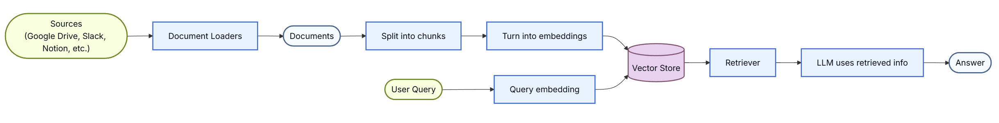

即：

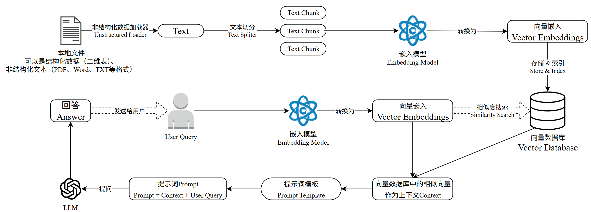

**简单举例：**

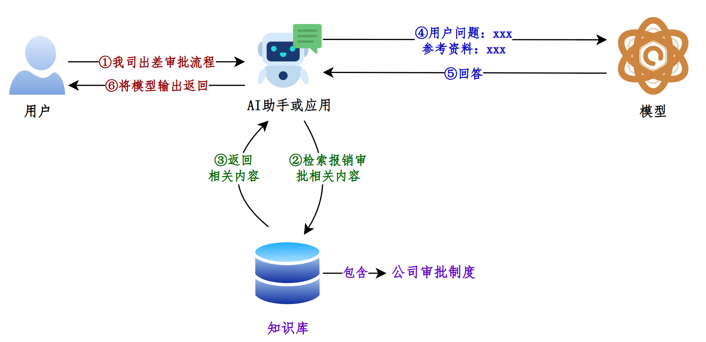

> 如果说LangChain相当于给LLM这个“大脑”安装了“四肢和躯干”，RAG则是为LLM提供了接入“人类知识图书馆”的能力。

**RAG的项目举例：**

目前，已经出现了非常多的产品几乎完全建立在 RAG 之上，包括客服系统、基于大模型的数据分析，以及成千上万的数据驱动聊天应用，应用场景五花八门。

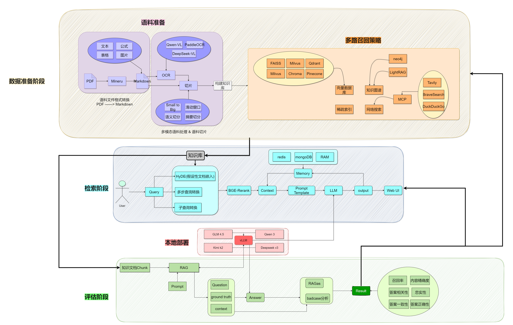

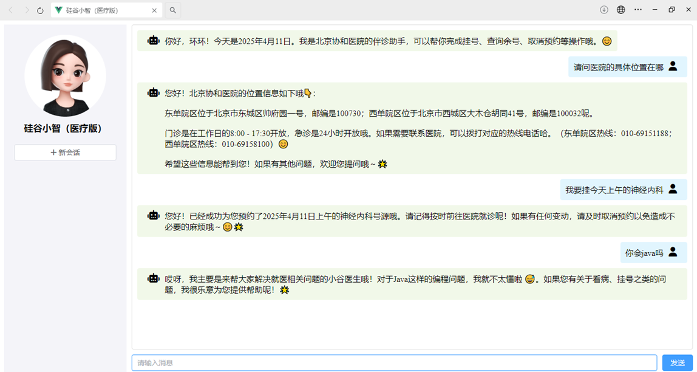

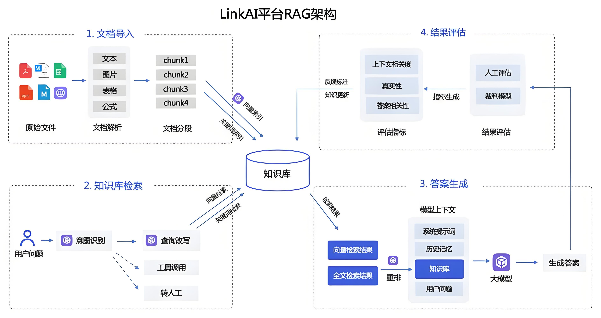

### 1.3 RAG优缺点

**RAG的优点**

1）相比提示词工程，RAG有更丰富的上下文和数据样本，可以不需要用户提供过多的背景描述，就能生成比较符合用户预期的答案。

2）相比于模型微调，RAG可以提升问答内容的时效性和可靠性

3）在一定程度上保护了业务数据的隐私性。

**RAG的缺点**

1）由于每次问答都涉及外部系统数据检索，因此RAG的响应时延相对较高。

2）引用的外部知识数据会消耗大量的模型Token 资源。

### 1.4 RAG工作流程

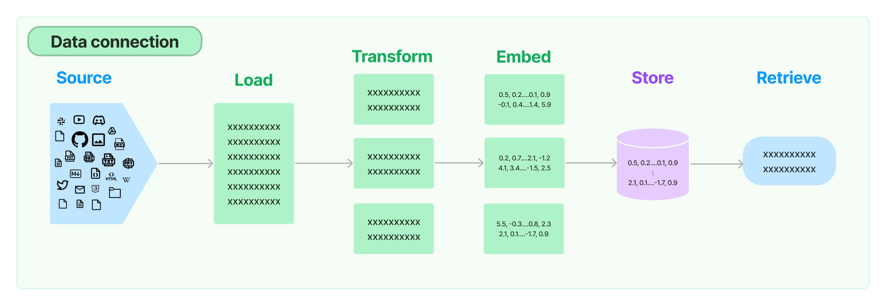

**环节1：Source（数据源）**

指的是RAG架构中所外挂的知识库。这里有三点说明：

1、原始数据源类型多样：如：视频、图片、文本、代码、文档等

2、形式的多样性：

- 可以是上百个.csv文件，可以是上千个.json文件，也可以是上万个.pdf文件

- 可以是某一个业务流程外放的API，可以是某个网站的实时数据等

**环节2：Load（加载）**

文档加载器（Document Loaders）负责将来自不同数据源的非结构化文本，加载到内存，成为文档(Document)对象。

文档对象包含文档内容和相关元数据信息，例如TXT、CSV、HTML、JSON、Markdown、PDF，甚至 YouTube 视频转录等。

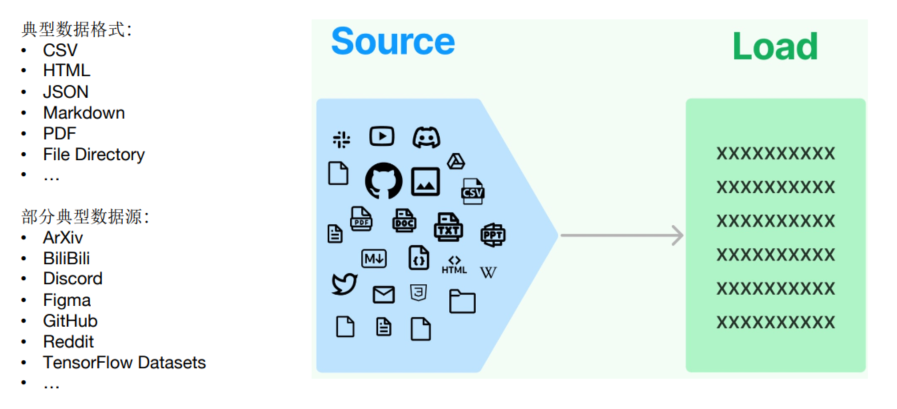

文档加载器还支持“ 延迟加载”模式，以缓解处理大文件时的内存压力。

LangChain封装好的loader地址：<https://docs.langchain.com/oss/python/integrations/document_loaders>

文档加载器的编程接口使用起来非常简单，以下给出加载TXT格式文档的例子。

```python
from langchain.document_loadersimport TextLoader

loader = TextLoader("./test.txt")
print(loader.load())
```

**环节3：Transform（转换）**

文档转换器(Document Transformers) 负责对加载的文档进行转换和处理，以便更好地适应下游任务的需求。

文档转换器提供了一致的接口（工具）来操作文档，主要包括以下几类：

- 文本拆分器(Text Splitters) ：将长文本拆分成语义上相关的小块，以适应语言模型的上下文窗口限制。

- 冗余过滤器(Redundancy Filters) ：识别并过滤重复的文档。

- 元数据提取器(Metadata Extractors) ：从文档中提取标题、语调等结构化元数据。

- 多语言转换器(Multi-lingual Transformers) ：实现文档的机器翻译。

- 对话转换器(Conversational Transformers) ：将非结构化对话转换为问答格式的文档。

总的来说，文档转换器是 LangChain 处理管道中非常重要的一个组件，它丰富了框架对文档的表示和操作能力。

在这些功能中，文档拆分器是必须的操作。下面单独说明。

**环节3.1：Text Splitting（文档拆分）**

- 拆分/分块的必要性：前一个环节加载后的文档对象可以直接传入文档拆分器进行拆分，而文档切块后才能向量化并存入数据库中。

- 文档拆分器的多样性：LangChain提供了丰富的文档拆分器，不仅能够切分普通文本，还能切分Markdown、JSON、HTML、代码等特殊格式的文本。

- 拆分/分块的挑战性：实际拆分操作中需要处理许多细节问题，不同类型的文本、不同的使用场景都需要采用不同的分块策略。（具体策略见2.3.2）

在构建RAG应用程序的整个流程中，拆分/分块是最具挑战性的环节之一，它显著影响检索效果。目前还没有通用的方法可以明确指出哪一种分块策略最为有效。不同的使用场景和数据类型都会影响分块策略的选择。

**环节4：Embed（嵌入）**

文档嵌入模型（Text Embedding Models）负责将文本转换为向量表示，即模型赋予了文本计算机可理解的数值表示，使文本可用于向量空间中的各种运算，大大拓展了文本分析的可能性，是自然语言处理领域非常重要的技术。

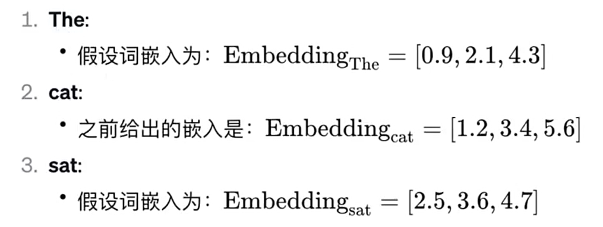

- 实现原理：通过特定算法（如Word2Vec）将语义信息编码为固定维度的向量，具体算法细节需后续深入。

- 关键特性：相似的词在向量空间中距离相近，例如"猫"和"犬"的向量夹角小于"猫"和"汽车"。

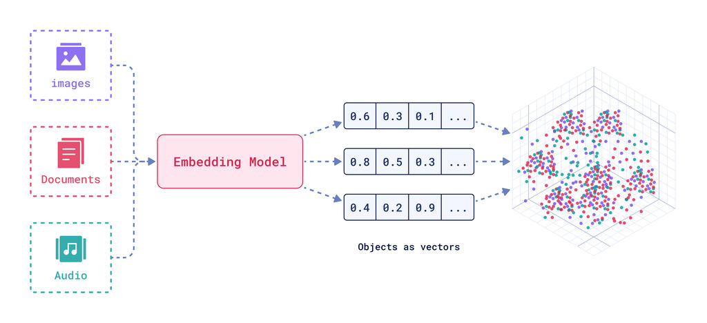

文本嵌入为 LangChain 中的问答、检索、推荐等功能提供了重要支持。具体为：

- 语义匹配：通过计算两个文本的向量余弦相似度，判断它们在语义上的相似程度，实现语义匹配。

- 文本检索：通过计算不同文本之间的向量相似度，可以实现语义搜索，找到向量空间中最相似的文本。

- 信息推荐：根据用户的历史记录或兴趣嵌入生成用户向量，计算不同信息的向量与用户向量的相似度，推荐相似的信息。

- 知识挖掘：可以通过聚类、降维等手段分析文本向量的分布，发现文本之间的潜在关联，挖掘知识。

- 自然语言处理：将词语、句子等表示为稠密向量，为神经网络等下游任务提供输入。

**环节5：Store（存储）**

LangChain 还支持把文本嵌入存储到向量存储或临时缓存，以避免需要重新计算它们。这里就出现了数据库，支持这些嵌入的高效存储和搜索的需求。

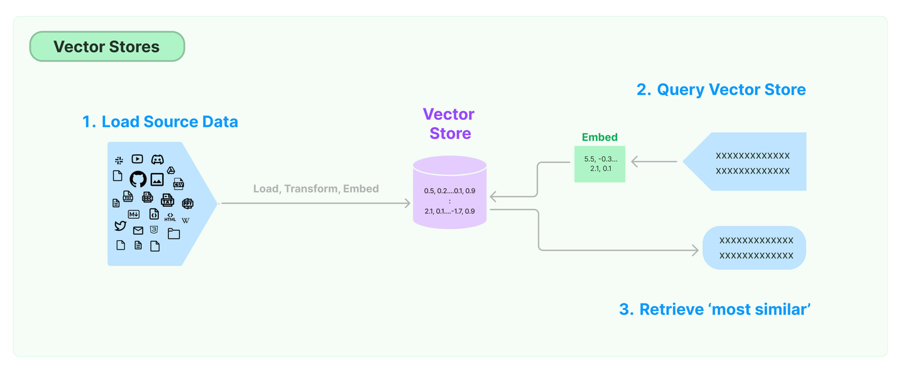

**环节6：Retrieve（检索）**

检索器（Retrievers）是一种用于响应非结构化查询的接口，它可以返回符合查询要求的文档。

LangChain 提供了一些常用的检索器，如向量检索器、文档检索器、网站研究检索器等。

通过配置不同的检索器，LangChain 可以灵活地平衡检索的精度、召回率与效率。检索结果将为后续的问答生成提供信息支持，以产生更加准确和完整的回答。

## 2、详细使用流程

### 2.1 环境准备

#### 2.1.1 安装依赖

我们在《第02章-模型调用》章节已经通过requirements.txt 文件安装过课程的依赖。当时考虑到本章RAG模块涉及的依赖较多且大，所以不在之前的依赖文件中。所以，这里大家需要补充安装RAG涉及到的依赖。完整版文件见《02-资料\requirements_full.txt》

```bash
pip install -r requirements_full.txt
```

检查冲突

```bash
pip check
```

如果环境安装正确，则日志如下

```powershell
(langchain1.2) PS C:\Users\shkstart\OneDrive\文档\AI\langchain> pip check

No broken requirements found.
(langchain1.2) PS C:\Users\shkstart\OneDrive\文档\AI\langchain>
```

#### 2.1.2 准备数据

将 knowledge.txt 置于项目根目录下

将 asset文件夹 解压后置于项目根目录下
