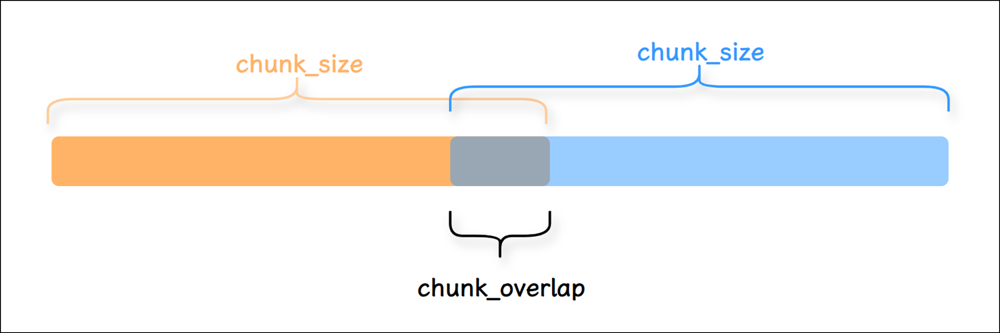
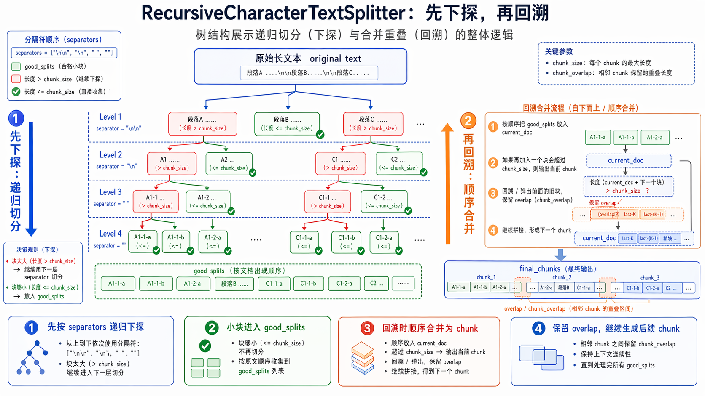

# RAG：文档切分器 Text Splitters

## 2.3 文档切分器 Text Splitters

### 2.3.1 为什么分割/切分/分块？

获取 Document 对象后，需要将其切分成一个个小块（Chunk）。之所以要进行切分是出于以下考虑：

- 长文档问题：大模型存在最大输入的 Token 限制，如果一个 Document 非常大，在输入大模型时会被截断，导致信息缺失。

- 检索精度：Document 可能包含非常多无关的信息，这些无效信息会干扰大模型的生成，而小块检索更精准。

- 成本控制：减少不必要的 token 消耗。

无论是在存储还是检索过程中，都以这些块(chunk) 为基本单位，这样能有效地避免内容噪声干扰和超出最大 Token 的问题。

### 2.3.2 Chunking拆分的策略

方法1：根据句子切分：这种方法按照自然句子边界进行切分，以保持语义完整性。

方法2：按照固定字符数来切分：这种策略根据特定的字符数量来划分文本，但可能会在不适当的位置切断句子。

方法3：按固定字符数来切分，结合重叠窗口（overlapping windows）：此方法与按字符数切分相似，但通过重叠窗口技术避免切分关键内容，确保信息连贯性。

方法4：递归字符切分方法：通过递归字符方式动态确定切分点，这种方法可以根据文档的复杂性和内容密度来调整块的大小。

方法5：根据语义内容切分：这种高级策略依据文本的语义内容来划分块，旨在保持相关信息的集中和完整，适用于需要高度语义保持的应用场景。

> 第2种方法（按照字符数切分）和第3种方法（按固定字符数切分结合重叠窗口）主要基于字符进行文本的切分，而不考虑文章的实际内容和语义。这种方式虽简单，但可能会导致主题或语义上的断裂。

> 相对而言，第4种递归方法更加灵活和高效，它结合了固定长度切分和语义分析。通常是首选策略，因为它能够更好地确保每个段落包含一个完整的主题。

> 而第5种方法，基于语义的分割虽然能精确地切分出完整的主题段落，但这种方法效率较低。它需要运行复杂的分段算法（segmentation algorithm），处理速度较慢，并且段落长度可能极不均匀（有的主题段落可能很长，而有的则较短）。因此，尽管它在某些需要高精度语义保持的场景下有其应用价值，但并不适合所有情况。

这些方法各有优势和局限，选择适当的分块策略取决于具体的应用需求和预期的检索效果。接下来我们依次尝试用常规手段应该如何实现上述几种方法的文本切分。

### 2.3.3 TextSplitter 源码分析

```python
class TextSplitter(BaseDocumentTransformer, ABC):
 """用于将文本切分为多个块的接口。"""

 def __init__(
     self,
     chunk_size: int = 4000,
     chunk_overlap: int = 200,
     length_function: Callable[[str], int] = len,
     keep_separator: bool | Literal["start", "end"] = False,  # noqa:
FBT001,FBT002
     add_start_index: bool = False,  # noqa: FBT001,FBT002
     strip_whitespace: bool = True,  # noqa: FBT001,FBT002
 ) -> None:
     """创建一个新的 `TextSplitter`。

     Args:
         chunk_size: 返回的文本块的最大大小。
         chunk_overlap: 文本块之间重叠的字符数。
         length_function: 用于衡量给定文本块长度的函数。
         keep_separator: 是否保留分隔符，以及将其放在对应文本块中的哪个位置
             `(True='start')`。
         add_start_index: 如果为 `True`，则在元数据中包含文本块的起始索引。
         strip_whitespace: 如果为 `True`，则去除每个文档开头和结尾的空白字符。

     Raises:
         ValueError: 如果 `chunk_size` 小于或等于 0。
         ValueError: 如果 `chunk_overlap` 小于 0。
         ValueError: 如果 `chunk_overlap` 大于 `chunk_size`。
     """
     if chunk_size <= 0:
         msg = f"chunk_size must be > 0, got {chunk_size}"
         raise ValueError(msg)
     if chunk_overlap < 0:
         msg = f"chunk_overlap must be >= 0, got {chunk_overlap}"
         raise ValueError(msg)
     if chunk_overlap > chunk_size:
         msg = (
             f"Got a larger chunk overlap ({chunk_overlap}) than chunk
size "
             f"({chunk_size}), should be smaller."
         )
         raise ValueError(msg)
     self._chunk_size = chunk_size
     self._chunk_overlap = chunk_overlap
     self._length_function = length_function
     self._keep_separator = keep_separator
     self._add_start_index = add_start_index
     self._strip_whitespace = strip_whitespace

 @abstractmethod
 def split_text(self, text: str) -> list[str]:
     """将文本切分为多个组成部分。

     Args:
         text: 要切分的文本。

     Returns:
         文本块列表。
     """

 def create_documents(
     self, texts: list[str], metadatas: list[dict[Any, Any]] | None =
None
```

```python
 ) -> list[Document]:
     """根据文本列表创建一组 `Document` 对象。

     Args:
         texts: 需要被切分并转换为文档的文本列表。
         metadatas: 可选的元数据列表，用于关联到每个文档。

     Returns:
         `Document` 对象列表。
     """
     metadatas_ = metadatas or [{}] * len(texts)
     documents = []
     for i, text in enumerate(texts):
         index = 0
         previous_chunk_len = 0
         for chunk in self.split_text(text):
             metadata = copy.deepcopy(metadatas_[i])
             if self._add_start_index:
                 offset = index + previous_chunk_len -
self._chunk_overlap
                 index = text.find(chunk, max(0, offset))
                 metadata["start_index"] = index
                 previous_chunk_len = len(chunk)
             new_doc = Document(page_content=chunk, metadata=metadata)
             documents.append(new_doc)
     return documents

 def split_documents(self, documents: Iterable[Document]) ->
list[Document]:
     """切分文档。

     Args:
         documents: 要切分的文档。

     Returns:
         切分后的文档列表。
     """
     texts, metadatas = [], []
     for doc in documents:
         texts.append(doc.page_content)
         metadatas.append(doc.metadata)
     return self.create_documents(texts, metadatas=metadatas)

 def _join_docs(self, docs: list[str], separator: str) -> str | None:
     text = separator.join(docs)
     if self._strip_whitespace:
         text = text.strip()
     return text or None

 def _merge_splits(self, splits: Iterable[str], separator: str) ->
list[str]:
     # 现在我们希望将这些较小的片段组合成中等大小的
     # 文本块，以便发送给 LLM。
     # 实现细节省略...

 @classmethod
 def from_huggingface_tokenizer(
     cls, tokenizer: PreTrainedTokenizerBase, **kwargs: Any
 ) -> TextSplitter:
     """使用 Hugging Face tokenizer 计算长度的文本切分器。

     Args:
         tokenizer: 要使用的 Hugging Face tokenizer。

     Returns:
         一个使用 Hugging Face tokenizer 进行长度计算的 `TextSplitter` 实
例。
     """
     # 实现细节省略...

 @classmethod
 def from_tiktoken_encoder(
     cls,
     encoding_name: str = "gpt2",
     model_name: str | None = None,
     allowed_special: Literal["all"] | AbstractSet[str] = set(),
     disallowed_special: Literal["all"] | Collection[str] = "all",
     **kwargs: Any,
 ) -> Self:
     """使用 `tiktoken` 编码器计算长度的文本切分器。

     Args:
         encoding_name: 要使用的 tiktoken 编码名称。
         model_name: 要使用的模型名称。

             如果提供该参数，它将覆盖 `encoding_name`。
         allowed_special: 编码过程中允许的特殊 token。
         disallowed_special: 编码过程中不允许的特殊 token。

     Returns:
         一个使用 tiktoken 进行长度计算的 `TextSplitter` 实例。

     Raises:
         ImportError: 如果未安装 tiktoken 包。
     """
     # 实现细节省略...

 @override
 def transform_documents(
     self, documents: Sequence[Document], **kwargs: Any
 ) -> Sequence[Document]:
     """通过切分文档来转换文档序列。

     Args:
         documents: 要切分的文档序列。

     Returns:
         切分后的文档列表。
     """
     return self.split_documents(list(documents))
```

小结：几个常用的文档切分器的方法的调用

```text
# 方式1：传入的参数类型：str；返回值类型：list[str]
split_text(text)
# 用法：传入单个字符串，切分成多个字符串块
# 调用关系：抽象方法，由子类实现具体切分逻辑

# 方式2：传入的参数类型：list[str]；返回值类型：list[Document]
create_documents(texts, metadatas=None)
# 用法：传入字符串列表，将每个字符串切分后封装成 Document
# 调用关系：底层遍历 texts，并对每个 text 调用 split_text(text)

# 方式3：传入的参数类型：Iterable[Document]；返回值类型：list[Document]
split_documents(documents)
# 用法：传入 Document 集合，取出 page_content 和 metadata 后重新切分成 Document
# 调用关系：底层调用 create_documents(texts, metadatas=metadatas)，再间接调用
split_text(text)

# 总调用链
split_documents(documents)
 -> create_documents(texts, metadatas=metadatas)
     -> split_text(text)
```

此外，这里提供了一个可视化展示文本如何分割的工具，<https://chunkviz.up.railway.app/>

### 2.3.4 具体实现

LangChain提供了许多不同类型的文档切分器

官网地址：<https://python.langchain.com/api_reference/text_splitters/index.html>

#### ① CharacterTextSplitter：Split by character

参数情况说明：

- chunk_size ：每个切块的最大字符数量，默认值为4000。

- chunk_overlap ：相邻两个切块之间的最大重叠字符数量，默认值为200。为了保证段之间语义完整，可以设置每个块之间有一部分重叠。

- separator ：分割使用的分隔符，默认值为"\n\n"。

- length_function ：用于计算切块长度的方法。默认赋值为父类TextSplitter的len函数。



举例1：字符串文本的分割

```python
# 1.导入相关依赖
from langchain_text_splitters import CharacterTextSplitter

# 2.示例文本
text = """
LangChain 是一个用于开发由语言模型驱动的应用程序的框架的。它提供了一套工具和抽象，使开发者
能够更容易地构建复杂的应用程序。
"""
# 3.定义字符分割器
splitter = CharacterTextSplitter(
 chunk_size=50, # 每块大小
 chunk_overlap=5,# 块与块之间的重复字符数
 #length_function=len,
 separator=""   # 设置为空字符串时，表示禁用分隔符优先
)

# 4.分割文本
texts = splitter.split_text(text)

# 5.打印结果
for i, chunk in enumerate(texts):
 print(f"块 {i+1}:长度：{len(chunk)}")
 print(chunk)
 print("-" * 50)
```

```text
块 1:长度：49
LangChain 是一个用于开发由语言模型驱动的应用程序的框架的。它提供了一套工具和抽象，使
开发
--------------------------------------------------
块 2:长度：22
象，使开发者能够更容易地构建复杂的应用程序。
--------------------------------------------------
```

说明：若必须禁用分隔符（如处理无空格文本），需容忍实际块长略小于 chunk_size （尤其对中文）

举例2：指定分割符

```python
# 1.导入相关依赖
from langchain.text_splitter import CharacterTextSplitter

# 2.定义要分割的文本
text = "这是一个示例文本啊。我们将使用CharacterTextSplitter将其分割成小块。分割基于字
符数。"

# text = """
# LangChain 是一个用于开发由语言模型。驱动的应用程序的框架的。它提供了一套工具和抽象。使
开发者能够更容易地构建复杂的应用程序。
# """

# 3.定义分割器实例
text_splitter = CharacterTextSplitter(
 chunk_size=30,   # 每个块的最大字符数
 chunk_overlap=5, # 块之间的重叠字符数
 separator="。",  # 按句号分割优先
)

# 4.开始分割
chunks = text_splitter.split_text(text)

# 5.打印效果
for  i,chunk in enumerate(chunks):
 print(f"块 {i + 1}:长度：{len(chunk)}")
 print(chunk)
 print("-"*50)
```

```text
Created a chunk of size 33, which is longer than the specified 30

块 1:长度：9
这是一个示例文本啊
--------------------------------------------------
块 2:长度：33
我们将使用CharacterTextSplitter将其分割成小块
--------------------------------------------------
块 3:长度：7
分割基于字符数
--------------------------------------------------
```

**注意：无重叠。**

separator优先原则：当设置了 separator （如"。"），分割器会首先尝试在分隔符处分割，然后再考虑 chunk_size。这是为了避免在句子中间硬性切断。这种设计是为了：

> 1. 优先保持语义完整性（不切断句子）2. 避免产生无意义的碎片（如半个单词/不完整句子）3. 如果 chunk_size 比片段小，无法拆分片段，导致 overlap失效。4. chunk_overlap仅在合并后的片段之间生效（如果 chunk_size 足够大）。如果没有合并的片段，

- 则 overlap失效。

举例3：指定分割符

注意：有重叠。此时，文本“这是第二段内容。”的token正好就是8。

```python
# 1.导入相关依赖
from langchain_text_splitters import CharacterTextSplitter

# 2.定义要分割的文本
text = "这是第一段文本。这是第二段内容。最后一段结束。"

# 3.定义字符分割器
text_splitter = CharacterTextSplitter(
 separator="。",
 chunk_size=20,
 chunk_overlap=8,
 keep_separator=True #chunk中是否保留切割符
)

# 4.分割文本
chunks = text_splitter.split_text(text)

# 5.打印结果
for  i,chunk in enumerate(chunks):
 print(f"块 {i + 1}:长度：{len(chunk)}")
 print(chunk)
 print("-"*50)
```

```text
块 1:长度：15
这是第一段文本。这是第二段内容
--------------------------------------------------
块 2:长度：16
。这是第二段内容。最后一段结束。
--------------------------------------------------
```

#### ② RecursiveCharacterTextSplitter：最常用

文档切分器中较常用的是RecursiveCharacterTextSplitter （递归字符文本切分器） ，遇到特定字符时进行分割。默认情况下，它尝试进行切割的字符包括 ["\n\n", "\n", " ", ""] 。

RecursiveCharacterTextSplitter 代表了一类很典型的 RAG 切分思路：

优先按更自然的文本边界切分（使用切割的字符），若切分后的片段仍过大，再逐级退化到更细粒度的分隔符，以此类推。最后再按 chunk_size 与 chunk_overlap 组织为最终 chunk。

> 它的价值在于：尽量保留语义完整性，同时把片段控制在 embedding 与检索更友好的长度范围内。

此外，还可以自定义的方式添加，。等分割字符。

特点：

- 保留上下文：优先在自然语言边界（如段落、句子结尾）处分割，减少信息碎片化。

- 智能分段：通过递归尝试多种分隔符，将文本分割为大小接近chunk_size 的片段。

- 灵活适配：适用于多种文本类型（代码、Markdown、普通文本等），是LangChain中最通用的文本拆分器。

可以指定的参数包括：

- chunk_size ：同TextSplitter（父类） 。

- chunk_overlap ：同TextSplitter（父类） 。

- length_function ：同TextSplitter（父类） 。

- add_start_index ：同TextSplitter（父类） 。

举例1：使用split_text()方法演示

```python
# 1.导入相关依赖
from langchain_text_splitters import RecursiveCharacterTextSplitter

# 2.定义RecursiveCharacterTextSplitter分割器对象
text_splitter = RecursiveCharacterTextSplitter(
 chunk_size=10,
 chunk_overlap=0,
 add_start_index=True,
)

# 3.定义拆分的内容
text="LangChain框架特性\n\n多模型集成(GPT/Claude)\n记忆管理功能\n链式调用设计。文档
分析场景示例：需要处理PDF/Word等格式。"

# 4.拆分器分割
paragraphs = text_splitter.split_text(text)

for i,chunk in enumerate(paragraphs):
 print(f"块{i + 1},长度：{len(chunk)}")
 print(chunk)
 print('-' * 50)
```

```text
块1,长度：10
LangChain框
--------------------------------------------------
块2,长度：3
架特性
--------------------------------------------------
块3,长度：9
多模型集成(GPT
--------------------------------------------------
块4,长度：8
/Claude)
--------------------------------------------------
块5,长度：6
记忆管理功能
--------------------------------------------------
块6,长度：9
链式调用设计。文档
--------------------------------------------------
块7,长度：10
分析场景示例：需要处
--------------------------------------------------
块8,长度：10
理PDF/Word等
--------------------------------------------------
块9,长度：3
格式。
--------------------------------------------------
```

举例2：使用create_documents()方法演示，传入字符串列表，返回Document对象列表

```python
# 1.导入相关依赖
from langchain_text_splitters import RecursiveCharacterTextSplitter

# 2.定义RecursiveCharacterTextSplitter分割器对象
text_splitter = RecursiveCharacterTextSplitter(
 chunk_size=10,
 chunk_overlap=0,
 add_start_index=True,
)

# 3.定义分割的内容
# text="LangChain框架特性\n\n多模型集成(GPT/Claude)\n记忆管理功能\n链式调用设计。文
档分析场景示例：需要处理PDF/Word等格式。"

list=["LangChain框架特性\n\n多模型集成(GPT/Claude)\n记忆管理功能\n链式调用设计。文档
分析场景示例：需要处理PDF/Word等格式。"]

# 4.分割器分割
# create_documents()：形参是字符串列表，返回值是Document的列表
paragraphs = text_splitter.create_documents(list)


for para in paragraphs:
 print(para)
 print('-------')
```

```text
page_content='LangChain框' metadata={'start_index': 0}
-------
page_content='架特性' metadata={'start_index': 10}
-------
page_content='多模型集成(GPT' metadata={'start_index': 15}
-------
page_content='/Claude)' metadata={'start_index': 24}
-------
page_content='记忆管理功能' metadata={'start_index': 33}
-------
page_content='链式调用设计。文档' metadata={'start_index': 40}
-------
page_content='分析场景示例：需要处' metadata={'start_index': 49}
-------
page_content='理PDF/Word等' metadata={'start_index': 59}
-------
page_content='格式。' metadata={'start_index': 69}
-------
```

**逐步分割过程**

**第一阶段：顶级分割（按\n\n ）**

> 1. 首次分割：

```text
text.split("\n\n") →
[
 "LangChain框架特性",
 "多模型集成(GPT/Claude)\n记忆管理功能\n链式调用设计。文档分析场景示例：需要处理
PDF/Word等格式。"
]
```

  - 第一部分长度：13字符 > 10 → 需要继续分割第二部分长度：79字符 > 10 → 需要继续分割

**第二阶段：递归分割第一部分 "LangChain框架特性"**

> 1. 尝试\n ：无匹配

> 2. 尝试（空格）：

  - 检查字符串："LangChain框架特性" （无空格）

> 3. 回退到"" （字符级分割）：

```text
list("LangChain框架特性") →
['L','a','n','g','C','h','a','i','n','框','架','特','性']
```

  - 前10字符："LangChain框"剩余部分："架特性"

**第三阶段：递归分割第二部分（长段落）**

> 1. 按\n 分割：

```text
"多模型集成(GPT/Claude)\n记忆管理功能\n链式调用设计。文档...".split("\n") →
[
 "多模型集成(GPT/Claude)",  # 17字符
 "记忆管理功能",           # 6字符
 "链式调用设计。文档分析场景示例：需要处理PDF/Word等格式。"  # 36字符
]
```

  - 第1块：17字符 > 10 → 继续分割第2块：6字符 ≤ 10 → 直接保留第3块：36字符 > 10 → 继续分割

> 2. 分割"多模型集成(GPT/Claude)" ：

  - 尝试：无空格

  - 回退到"" ：

    - 前10字符："多模型集成(GPT"

    - 剩余7字符："/Claude)"

> 3. 分割"链式调用设计。文档分析场景示例：需要处理PDF/Word等格式。" ：

  - 尝试：无空格

  - 回退到"" ：

    - 按10字符分段：

```text
"链式调用设计。文档分析场景示例：需要处理PDF/Word等格式。"
→
[
 "链式调用设计。文档",
 "分析场景示例：需要处",
 "理PDF/Word等",
 "格式。"
]
```

举例3：使用create_documents()方法演示，将本地文件内容加载成字符串，进行拆分

```python
# 1.导入相关依赖
from langchain_text_splitters import RecursiveCharacterTextSplitter

# 2.打开.txt文件
with open("../asset/load/09-ai.txt", encoding="utf-8") as f:
 state_of_the_union = f.read()  #返回的是字符串

# 3.定义RecursiveCharacterTextSplitter（递归字符分割器）
text_splitter = RecursiveCharacterTextSplitter(
 chunk_size=100,
 chunk_overlap=20,
 #chunk_overlap=0,
 length_function=len
)

# 4.分割文本
texts = text_splitter.create_documents([state_of_the_union])

# 5.打印分割文本
for text in texts:
 print(f"🔥{text.page_content}")
```

```text
🔥人工智能（AI）是什么？

🔥人工智能（Artificial

🔥Intelligence，简称AI）是指由计算机系统模拟人类智能的技术，使其能够执行通常需要人

类认知能力的任务，如学习、推理、决策和语言理解。AI的核心目标是让机器具备感知环境、处
理信息并自主行动的
🔥让机器具备感知环境、处理信息并自主行动的能力。

🔥1. AI的技术基础

AI依赖多种关键技术：

机器学习（ML）：通过算法让计算机从数据中学习规律，无需显式编程。例如，推荐系统通过用
户历史行为预测偏好。
🔥深度学习：基于神经网络的机器学习分支，擅长处理图像、语音等复杂数据。AlphaGo击败围

棋冠军便是典型案例。

自然语言处理（NLP）：使计算机理解、生成人类语言，如ChatGPT的对话能力。
🔥2. AI的应用场景

AI已渗透到日常生活和各行各业：

医疗：辅助诊断（如AI分析医学影像）、药物研发加速。

交通：自动驾驶汽车通过传感器和AI算法实现安全导航。
🔥金融：欺诈检测、智能投顾（如风险评估模型）。


教育：个性化学习平台根据学生表现调整教学内容。

3. AI的挑战与未来
尽管前景广阔，AI仍面临问题：
🔥伦理争议：数据隐私、算法偏见（如招聘AI歧视特定群体）。


就业影响：自动化可能取代部分人工岗位，但也会创造新职业。

技术瓶颈：通用人工智能（AGI）尚未实现，当前AI仅擅长特定任务。
🔥未来，AI将与人类协作而非替代：医生借助AI提高诊断效率，教师利用AI定制课程。其发展需

平衡技术创新与社会责任，确保技术造福全人类。
```

举例4：使用split_documents()方法演示，利用PDFLoader加载文档，对文档的内容用递归切割器切割

```python
# 1.导入相关依赖
from langchain_community.document_loaders import PyPDFLoader
from langchain_text_splitters import RecursiveCharacterTextSplitter

# 2.定义PyPDFLoader加载器
loader = PyPDFLoader("../asset/load/04-load.pdf")

# 3.加载和切割文档对象
docs = loader.load()   # 返回Document对象构成的list
# print(f"第0页：\n{docs[0]}")

# 4.定义切割器
text_splitter = RecursiveCharacterTextSplitter(
 chunk_size=200,
 #chunk_size=120,
 chunk_overlap=0,
 # chunk_overlap=100,
 length_function=len,
 add_start_index=True,
)
# 5.对pdf内容进行切割得到文档对象
paragraphs = text_splitter.split_documents(docs)

for para in paragraphs:
 print(para)
 print('-------')
```

```text
page_content='"他的车，他的命！ 他忽然想起来，一年，二年，至少有三四年；一滴汗，两
滴汗，不
知道多少万滴汗，才挣出那辆车。从风里雨里的咬牙，从饭里茶里的自苦，才赚出那辆车。
那辆车是他的一切挣扎与困苦的总结果与报酬，像身经百战的武士的一颗徽章。……他老想
着远远的一辆车，可以使他自由，独立，像自己的手脚的那么一辆车。"

"他吃，他喝，他嫖，他赌，他懒，他狡猾， 因为他没了心，他的心被人家摘了去。他'
metadata={'producer': 'Microsoft® Word 2019', 'creator': 'Microsoft®
Word 2019', 'creationdate': '2025-06-20T17:18:19+08:00', 'moddate':
'2025-06-20T17:18:19+08:00', 'source': '../asset/load/04-load.pdf',
'total_pages': 1, 'page': 0, 'page_label': '1', 'start_index': 0}
-------
page_content='只剩下那个高大的肉架子，等着溃烂，预备着到乱死岗子去。……体面的、要强
的、好梦想
的、利己的、个人的、健壮的、伟大的祥子，不知陪着人家送了多少回殡；不知道何时何地
会埋起他自己来， 埋起这堕落的、 自私的、 不幸的、 社会病胎里的产儿， 个人主义的末路
鬼！
"' metadata={'producer': 'Microsoft® Word 2019', 'creator': 'Microsoft®
Word 2019', 'creationdate': '2025-06-20T17:18:19+08:00', 'moddate':
'2025-06-20T17:18:19+08:00', 'source': '../asset/load/04-load.pdf',
'total_pages': 1, 'page': 0, 'page_label': '1', 'start_index': 198}
-------
```

举例5：自定义分隔符

有些书写系统没有单词边界，例如中文、日文和泰文。使用默认分隔符列表["\n\n", "\n", " ", ""]分割文本可能导致单词错误的分割。为了保持单词在一起，你可以自定义分割字符，覆盖分隔符列表以包含额外的标点符号。

```text
text_splitter = RecursiveCharacterTextSplitter(
 chunk_size=200,
 chunk_overlap=20,  # 增加重叠字符
 separators=["\n\n", "\n", "。", "！", "？", "……", "，", ""],  # 添加中文标点
 length_function=len,
 keep_separator=True #保留句尾标点（如 ……），避免切割后丢失语气和逻辑
)
```

效果：算法优先在句号、省略号处切割，保持句子完整性。

**RecursiveCharacterTextSplitter 底层处理逻辑（了解即可）：**

**① 先拆分**

> 1. 底层的self._split_text() 按照分隔符列表的顺序应用当前递归层可用的第一个分隔符，将文档切

- 成若干块。

> 2. 如果切分后的块大小>chunk_size 则调用self._split_text() 用下一个分隔符递归处理大块3. 直至所有块大小都不超过chunk_size ，停止递归

**② 后合并**

合并过程不是一次完成的，为便于理解抽象为一次合并，最终得到的完整块列表为final_chunks

> 1. 遍历切分后的 chunk 列表。对每个当前 chunk，先判断若将其加入候选窗口后，是否会使候选窗

- 口长度（包含必要的合并分隔符（默认为""））超过 chunk_size 。若超过，则先将历史块合并为整体，添加到 final_chunks 。

> 2. 然后从候选列表左侧逐个弹出chunk，直至：

  - 1. 剩余chunk拼接后的累计长度不大于 chunk_overlap2. 并且剩余部分+下一个chunk的长度+合并分隔符长度之和不超过chunk_size3. 这样可以让拆分过细的小块同时出现在前后两个相邻的块中

> 3. 处理完成后，就得到了满足 chunk_size 约束，并且按照 chunk_overlap 保留重叠区域的

- chunk 列表

**③ 直观理解**

拆分可以理解为下探：即对超长块继续递归细分

合并可以理解为回溯：即将已经得到的合格小块按顺序重新组织为最终 chunk，并在相邻 chunk 之间保留 overlap

流程如下



#### ③ TokenTextSplitter/CharacterTextSplitter：Split by tokens

当我们将文本拆分为块时，除了字符以外，还可以：按Token的数量分割（而非字符或单词数），将长文本切分成多个小块。

**什么是Token？**

- 对模型而言，Token是文本的最小处理单位。例如：

  - 英文："hello" → 1个Token，"ChatGPT" → 2个Token（"Chat" + "GPT" ）。中文："人工智能" → 可能拆分为2-3个Token（取决于分词器）。

**为什么按Token分割？**

- 语言模型对输入长度的限制是基于Token数（如GPT-4的8k/32k Token上限），直接按字符或单词分割可能导致实际Token数超限。（确保每个文本块不超过模型的Token上限）

- 大语言模型(LLM)通常是以token的数量作为其计量（或收费） 的依据，所以采用token分割也有助于我们在使用时更方便的控制成本。

**TokenTextSplitter 使用说明：**

- 核心依据：Token数量 + 自然边界。（TokenTextSplitter 严格按照 token 数量进行分割，但同时会优先在自然边界（如句尾）处切断，以尽量保证语义的完整性。）

- 优点：与LLM的Token计数逻辑一致，能尽量保持语义完整

- 缺点：对非英语或特定领域文本，Token化效果可能不佳

- 典型场景：需要精确控制Token数输入LLM的场景

**编码器说明**

TokenTextSplitter 底层会用到 token 编码器，后者的主要功能是将输入的文本切分为token序列，并将token序列映射为ID序列，本质上是一个tokenizer 。

举例1：使用TokenTextSplitter

```python
# 1.导入相关依赖
from langchain_text_splitters import TokenTextSplitter

# 2.初始化 TokenTextSplitter
text_splitter = TokenTextSplitter(
 chunk_size=33,  # 最大 token 数为 33
 chunk_overlap=0, # 重叠 token 数为 0
 # model_name="gpt-4", # 选择 GPT-4 模型的编码器
 encoding_name="cl100k_base",  # 使用 OpenAI 的编码器,将文本转换为 token 序列
)
# 3.定义文本
text = "人工智能是一个强大的开发框架。它支持多种语言模型和工具链。人工智能是指通过计算机程
序模拟人类智能的一门科学。自20世纪50年代诞生以来，人工智能经历了多次起伏。"

# 4.开始切割
texts = text_splitter.split_text(text)

# 打印分割结果
print(f"原始文本被分割成了 {len(texts)} 个块:")
for i, chunk in enumerate(texts):
 print(f"块 {i+1}: 长度：{len(chunk)} 内容：{chunk}")
 print("-" * 50)
```

```text
原始文本被分割成了 3 个块:
块 1: 长度：29 内容：人工智能是一个强大的开发框架。它支持多种语言模型和工具链。
--------------------------------------------------
块 2: 长度：32 内容：人工智能是指通过计算机程序模拟人类智能的一门科学。自20世纪50
--------------------------------------------------
块 3: 长度：19 内容：年代诞生以来，人工智能经历了多次起伏。
--------------------------------------------------
```

**为什么会出现这样的分割？**

1、第一块 （29字符） ：内容是一个完整的句子，以句号结尾。TokenTextSplitter识别到这是一个自然的语义边界，即使这里的 token 数量可能尚未达到 33，它也选择在此处切割，以保证第一块语义的完整性。

2、第二块 （32字符） ：内容包含了另一个完整句子 “人工智能是指...一门科学。” 以及下一句的开头“自20世纪50” 。分割器在处理完第一个句子的 token 后，可能 token 数量已经接近 chunk_size ，于是在下一个自然边界（这里是句号）之后继续读取了少量 token（“自20世纪50”），直到非常接近 33 token 的限制。注意：“50” 之后被切断，是因为编码器很可能将“50”识别为一个独立的 token，而“年代”是另一个

token。为了保证 token 的完整性，它不会在“50”字符中间切断。

3、第三块 （19字符） ：是第二块中断内容的剩余部分，形成了一个较短的块。这是因为剩余内容本身的token 数量就较少。

特别注意：字符长度不等于 Token 数量。

**参数说明**

可选编码器位于openai_public.py 文件的全局变量中，如下所示

```text
ENCODING_CONSTRUCTORS = {
 "gpt2": gpt2,
 "r50k_base": r50k_base,
 "p50k_base": p50k_base,
 "p50k_edit": p50k_edit,
 "cl100k_base": cl100k_base,
 "o200k_base": o200k_base,
 "o200k_harmony": o200k_harmony,
}
```

举例2：使用CharacterTextSplitter

```python
# 1.导入相关依赖
from langchain_text_splitters import CharacterTextSplitter
import tiktoken  # 用于计算Token数量


# 2.定义通过Token切割器
text_splitter = CharacterTextSplitter.from_tiktoken_encoder(
 encoding_name="cl100k_base", # 使用 OpenAI 的编码器
 chunk_size=18,
 chunk_overlap=0,
 separator="。",  # 指定中文句号为分隔符
 keep_separator=False,  # chunk中是否保留分隔符
)
# 3.定义文本
text = "人工智能是一个强大的开发框架。它支持多种语言模型和工具链。今天天气很好，想出去踏
青。但是又比较懒不想出去，怎么办"

# 4.开始切割
texts = text_splitter.split_text(text)
print(f"分割后的块数: {len(texts)}")
```

```text
分割后的块数: 4
块 1: 17 Token
内容: 人工智能是一个强大的开发框架

块 2: 14 Token
内容: 它支持多种语言模型和工具链

块 3: 18 Token
内容: 今天天气很好，想出去踏青

块 4: 21 Token
内容: 但是又比较懒不想出去，怎么办
```

#### ④ SemanticChunker：语义分块

SemanticChunking（语义分块）是 LangChain 中一种更高级的文本分割方法，它超越了传统的基于字符或固定大小的分块方式，而是根据文本的语义结构进行智能分块，使每个分块保持语义完整性，从而提高检索增强生成(RAG)等应用的效果。

**语义分割 vs 传统分割**

| 特性 | 语义分割（SemanticChunker） | 传统字符分割（RecursiveCharacter） |
|---|---|---|
| 分割依据 | 嵌入向量相似度 | 固定字符／换行符 |
| 语义完整性 | ✅ 保持主题连贯 | ❌ 可能切断句子逻辑 |
| 计算成本 | ❌ 高（需嵌入模型） | ✅ 低 |
| 适用场景 | 需要高语义一致性的任务 | 简单文本预处理 |

通过将文本转化为向量（Embedding），去计算前后句子的语义差异，当发现前后两句话的语义变化很大（超过设定的阈值）时，就在这里一刀切断。这样能保证切分出来的每一个文本块（Chunk）在含义上是完整、连贯的。

举例：

```python
# pip install langchain_experimental
from langchain_experimental.text_splitter import SemanticChunker
from langchain_openai.embeddings import OpenAIEmbeddings
from langchain.embeddings import init_embeddings
import os
from dotenv import load_dotenv

load_dotenv(override=True)

# 加载文本
with open("../asset/load/09-ai1.txt", encoding="utf-8") as f:
 state_of_the_union = f.read()  #返回字符串

# 获取嵌入模型
embedding_model = init_embeddings(
 model="openai:text-embedding-3-large",
 api_key=os.getenv("CLOSEAI_API_KEY"),
 base_url=os.getenv("CLOSEAI_BASE_URL"),
)
# embedding_model = OpenAIEmbeddings(
#     model="BAAI/bge-m3", # 付费模型 ID： Pro/BAAI/bge-m3
#     base_url=os.getenv("SILICONFLOW_BASE_URL"),
#     api_key=os.getenv("SILICONFLOW_API_KEY"),
#     dimensions=1024
# )


# 获取切割器
text_splitter = SemanticChunker(
 embeddings=embedding_model,
 breakpoint_threshold_type="percentile", # 断点阈值类型：字面值["百分位数",
"标准差", "四分位距", "梯度"] 选其一
 breakpoint_threshold_amount=65.0, # 断点阈值数量 (极低阈值 → 高分割敏感度)
 sentence_split_regex=r"(?<=[。？！])\s+" # 句子切分正则:遇到中文的句号、感叹
号、问号（。？！）且后面带有空格时，先将其切分为独立的“句子”。
)

# 切分文档
docs = text_splitter.create_documents(texts = [state_of_the_union])

print(len(docs))
for doc in docs:
 print(f"🔍 文档: {doc}")
```

输出如下

> 7🔍 文档： page_content='人工智能综述：发展、应用与未来展望

> 摘要人工智能（Artificial Intelligence，AI）作为计算机科学的一个重要分支，近年来取得了突飞猛进的发展。本文综述了人工智能的发展历程、核心技术、应用领域以及未来发展趋势。通过对人工智能的定义、历史背景、主要技术（如机器学习、深度学习、自然语言处理等）的详细介绍，探讨了人工智能在医疗、金融、教育、交通等领域的应用，并分析了人工智能发展过程中面临的挑战与机遇。最后，本文对人工智能的未来发展进行了展望，提出了可能的突破方向。 1. 引言人工智能是指通过计算机程序模拟人类智能的一门科学。自20世纪50年代诞生以来，人工智能经历了多次起伏，近年来随着计算能力的提升和大数据的普及，人工智能技术取得了显著的进展。人工智能的应用已经渗透到日常生活的方方面面，从智能手机的语音助手到自动驾驶汽车，从医疗诊断到金融分析，人工智能正在改变着人类社会的运行方式。'🔍 文档： page_content='2. 人工智能的发展历程2.1 早期发展人工智能的概念最早可以追溯到20世纪50年代。1956年，达特茅斯会议（DartmouthConference）被认为是人工智能研究的正式开端。在随后的几十年里，人工智能研究经历了多次高潮与低谷。早期的研究主要集中在符号逻辑和专家系统上，但由于计算能力的限制和算法的不足，进展缓慢。 2.2 机器学习的兴起20世纪90年代，随着统计学习方法的引入，机器学习逐渐成为人工智能研究的主流。支持向量机（SVM）、决策树、随机森林等算法在分类和回归任务中取得了良好的效果。这一时期，机器学习开始应用于数据挖掘、模式识别等领域。 2.3 深度学习的突破2012年，深度学习在图像识别领域取得了突破性进展，标志着人工智能进入了一个新的阶段。深度学习通过多层神经网络模拟人脑的工作方式，能够自动提取特征并进行复杂的模式识别。卷积神经网络（CNN）、循环神经网络（RNN）和长短期记忆网络（LSTM）等深度学习模型在图像处理、自然语言处理、语音识别等领域取得了显著成果。 3. 人工智能的核心技术3.1 机器学习机器学习是人工智能的核心技术之一，通过算法使计算机从数据中学习并做出决策。常见的机器学

> 习算法包括监督学习、无监督学习和强化学习。监督学习通过标记数据进行训练，无监督学习则从未标记数据中寻找模式，强化学习则通过与环境交互来优化决策。 3.2 深度学习深度学习是机器学习的一个子领域，通过多层神经网络进行特征提取和模式识别。深度学习在图像识别、自然语言处理、语音识别等领域取得了显著成果。常见的深度学习模型包括卷积神经网络（CNN）、循环神经网络（RNN）和长短期记忆网络（LSTM）。 3.3 自然语言处理自然语言处理（NLP）是人工智能的一个重要分支，致力于使计算机能够理解和生成人类语言。NLP技术广泛应用于机器翻译、情感分析、文本分类等领域。近年来，基于深度学习的NLP模型（如BERT、GPT）在语言理解任务中取得了突破性进展。 3.4 计算机视觉计算机视觉是人工智能的另一个重要分支，致力于使计算机能够理解和处理图像和视频。计算机视觉技术广泛应用于图像识别、目标检测、人脸识别等领域。深度学习模型（如CNN）在计算机视觉任务中取得了显著成果。'🔍 文档： page_content='4. 人工智能的应用领域4.1 医疗健康人工智能在医疗健康领域的应用包括疾病诊断、药物研发、个性化医疗等。通过分析医学影像和患者数据，人工智能可以帮助医生更准确地诊断疾病，提高治疗效果。'🔍 文档： page_content='4.2 金融人工智能在金融领域的应用包括风险评估、欺诈检测、算法交易等。通过分析市场数据和交易记录，人工智能可以帮助金融机构做出更明智的决策，提高运营效率。 4.3 教育人工智能在教育领域的应用包括个性化学习、智能辅导、自动评分等。通过分析学生的学习数据，人工智能可以为学生提供个性化的学习建议，提高学习效果。'🔍 文档： page_content='4.4 交通人工智能在交通领域的应用包括自动驾驶、交通管理、智能导航等。通过分析交通数据和路况信息，人工智能可以帮助优化交通流量，提高交通安全。'🔍 文档： page_content='5. 人工智能的挑战与机遇5.1 挑战人工智能发展过程中面临的主要挑战包括数据隐私、算法偏见、安全性问题等。数据隐私问题涉及到个人数据的收集和使用，算法偏见问题则涉及到算法的公平性和透明度，安全性问题则涉及到人工智能系统的可靠性和稳定性。 5.2 机遇尽管面临挑战，人工智能的发展也带来了巨大的机遇。人工智能技术的进步将推动各行各业的创新，提高生产效率，改善生活质量。未来，人工智能有望在更多领域取得突破，为人类社会带来更多的便利和福祉。'🔍 文档： page_content='6. 未来展望6.1 技术突破未来，人工智能技术有望在以下几个方面取得突破：一是算法的优化和创新，提高模型的效率和准确性；二是计算能力的提升，支持更复杂的模型和更大规模的数据处理；三是跨学科研究的深入，推动人工智能与其他领域的融合。 6.2 应用拓展随着技术的进步，人工智能的应用领域将进一步拓展。未来，人工智能有望在更多领域发挥重要作用，如环境保护、能源管理、智能制造等。人工智能将成为推动社会进步的重要力量。 7. 结论人工智能作为一门快速发展的科学，正在改变着人类社会的运行方式。通过不断的技术创新和应用拓展，人工智能将为人类社会带来更多的便利和福祉。然而，人工智能的发展也面临着诸多挑战，需要社会各界共同努力，推动人工智能的健康发展。'

**关于参数的说明：**

> 1. breakpoint_threshold_type （断点阈值类型）

- 作用：定义文本语义边界的检测算法，决定何时分割文本块。

- 可选值及原理：

| 类型 | 原理说明 | 适用场景 |
|---|---|---|
| `percentile` | 计算相邻句子嵌入向量的余弦距离，取距离分布的第 N 百分位值作为阈值，高于此值则分割 | 常规文本（如文章、报告） |
| `standard_deviation` | 以均值 + N 倍标准差为阈值，识别语义突变点 | 语义变化剧烈的文档（如技术手册） |
| `interquartile` | 用四分位距（IQR）定义异常值边界，超过则分割 | 长文档（如书籍） |
| `gradient` | 基于嵌入向量变化的梯度检测分割点（需自定义实现） | 实验性需求 |

> 2. breakpoint_threshold_amount （断点阈值量）

- 作用：控制分割的粒度敏感度，值越小分割越细（块越多），值越大分割越粗（块越少）。

- 取值范围与示例：

  - percentile 模式：0.0~100.0，用户代码设 65.0 表示只有当某两个相邻句子的语义差距，超过了全篇 65% 的句子间距时，才进行切分 。默认值是：95.0。

    - 数值越小（比如 20）：切分越敏感，语义稍微有一点点不一样就切开，碎片会很多、很小。

    - 数值越大（比如 95）：切分越迟钝，只有话题发生剧烈转变时才切开，文档块会很大。standard_deviation 模式：浮点数（如 1.5 表示均值+1.5倍标准差）。

  - interquartile 模式：倍数（如 1.5 是IQR标准值）。

> 3. sentence_split_regex （句子切分的正则表达式）

- 作用：自定义切分文本的正则表达式。如果不传递，默认表达式为r"(?<=[.?!])\s+" 。

- 代码中r"(?<=[。？！])\s+" 表示：遇到中文的句号、感叹号、问号（。？！）且后面带有空格时，先将其切分为独立的“句子”。

SemanticChunker 的底层逻辑是先按照正则表达式切分为chunk 列表，然后计算相邻chunk之间的距离，按照breakpoint_threshold_type 和breakpoint_threshold_amount 的规则确定满足规则的切分位置，按照切分位置合并相邻块。

#### ⑤ HTMLHeaderTextSplitter(了解)

**HTMLHeaderTextSplitter：Split by HTML header**

HTMLHeaderTextSplitter是一种专门用于处理HTML文档的文本分割方法，它根据HTML的标题标签（如`<h1>`、`<h2>`等）将文档划分为逻辑分块，同时保留标题的层级结构信息。

举例：

```python
# 1.导入相关依赖
from langchain_text_splitters import HTMLHeaderTextSplitter

# 2.定义HTML文件
html_string = """
<!DOCTYPE html>
<html>
<body>
 <div>
     <h1>欢迎来到尚硅谷！</h1>
     <p>尚硅谷是专门培训IT技术方向</p>
     <div>
         <h2>尚硅谷老师简介</h2>
         <p>尚硅谷老师拥有多年教学经验，都是从一线互联网下来</p>
         <h3>尚硅谷北京校区</h3>
         <p>北京校区位于宏福科技园区</p>
     </div>
 </div>
</body>
</html>
"""

# 4.用于指定要根据哪些HTML标签来分割文本
headers_to_split_on = [
 ("h1", "标题1"),
 ("h2", "标题2"),
 ("h3", "标题3"),
]

# 5.定义HTMLHeaderTextSplitter分割器
html_splitter =
HTMLHeaderTextSplitter(headers_to_split_on=headers_to_split_on)

# 6.分割器分割
html_header_splits = html_splitter.split_text(html_string)

html_header_splits
```

> [Document(metadata={'标题1': '欢迎来到尚硅谷！'}, page_content='欢迎来到尚硅谷！'),Document(metadata={'标题1': '欢迎来到尚硅谷！'}, page_content='尚硅谷是专门培训IT技术方向'),Document(metadata={'标题1': '欢迎来到尚硅谷！', '标题2': '尚硅谷老师简介'},page_content='尚硅谷老师简介'),Document(metadata={'标题1': '欢迎来到尚硅谷！', '标题2': '尚硅谷老师简介'},page_content='尚硅谷老师拥有多年教学经验，都是从一线互联网下来'),Document(metadata={'标题1': '欢迎来到尚硅谷！', '标题2': '尚硅谷老师简介', '标题3': '尚硅谷北京校区'}, page_content='尚硅谷北京校区'),Document(metadata={'标题1': '欢迎来到尚硅谷！', '标题2': '尚硅谷老师简介', '标题3': '尚硅谷北京校区'}, page_content='北京校区位于宏福科技园区')]

说明：

- 标题下文本内容所属标题的层级信息保存在元数据中。

- 每个分块会自动继承父级标题的上下文，避免信息割裂。

#### ⑥ CodeTextSplitter(了解)

**CodeTextSplitter：Split code**

CodeTextSplitter是一个专为代码文件设计的文本分割器（Text Splitter），支持代码的语言包括['cpp', 'go', 'java', 'js', 'php', 'proto', 'python', 'rst', 'ruby', 'rust', 'scala', 'swift', 'markdown', 'latex','html', 'sol']。它能够根据编程语言的语法结构（如函数、类、代码块等）智能地拆分代码，保持代码逻辑的完整性。

与递归文本分割器（如RecursiveCharacterTextSplitter）不同，CodeTextSplitter 针对代码的特性进行了优化，避免在函数或类的中间截断。举例1：支持的语言

```python
from langchain_text_splitters import Language

# 支持分割语言类型
# Full list of supported languages
langs = [e.value for e in Language]
print(langs)
```

> ['cpp', 'go', 'java', 'kotlin', 'js', 'ts', 'php', 'proto', 'python', 'rst', 'ruby', 'rust', 'scala', 'swift','markdown', 'latex', 'html', 'sol', 'csharp', 'cobol', 'c', 'lua', 'perl', 'haskell', 'elixir', 'powershell']

举例2：

```python
# 1.导入相关依赖
from langchain_text_splitters import Language,
RecursiveCharacterTextSplitter
from pprint import pprint

# 2.定义要分割的python代码片段
PYTHON_CODE = """
def hello_world():
 print("Hello, World!")

def hello_world1():
 print("Hello, World1!")
"""

# 3.定义递归字符切分器
python_splitter = RecursiveCharacterTextSplitter.from_language(
 language=Language.PYTHON,
 chunk_size=50,
 chunk_overlap=0
)

# 4.文档切分
python_docs = python_splitter.create_documents(texts=[PYTHON_CODE])

pprint(python_docs)
```

> [Document(metadata={}, page_content='def hello_world():\n print("Hello, World!")'),Document(metadata={}, page_content='def hello_world1():\n print("Hello, World1!")')]

#### ⑦ MarkdownTextSplitter(了解)

**MarkdownTextSplitter：md数据类型**

因为Markdown格式有特定的语法，一般整体内容由h1、h2、h3 等多级标题组织，所以MarkdownHeaderTextSplitter的切分策略就是根据标题来分割文本内容。

举例：

```python
from langchain_text_splitters import MarkdownTextSplitter

markdown_text = """
# 一级标题\n
这是一级标题下的内容\n\n
## 二级标题\n
- 二级下列表项1\n
- 二级下列表项2\n
"""

# 关键步骤：直接修改实例属性
splitter = MarkdownTextSplitter(chunk_size=30, chunk_overlap=0)
splitter._is_separator_regex = True  #  强制将分隔符视为正则表达式

# 执行分割
docs = splitter.create_documents(texts = [markdown_text])

# print(len(docs))

for i, doc in enumerate(docs):
 print(f"\n🔍 分块 {i + 1}:")

 print(doc.page_content)
```

```text
🔍 分块 1:

# 一级标题

这是一级标题下的内容

🔍 分块 2:

## 二级标题

- 二级下列表项1

- 二级下列表项2
```
