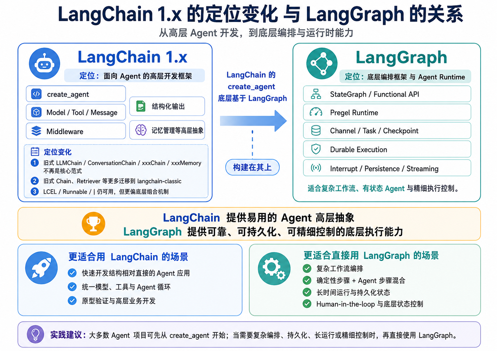
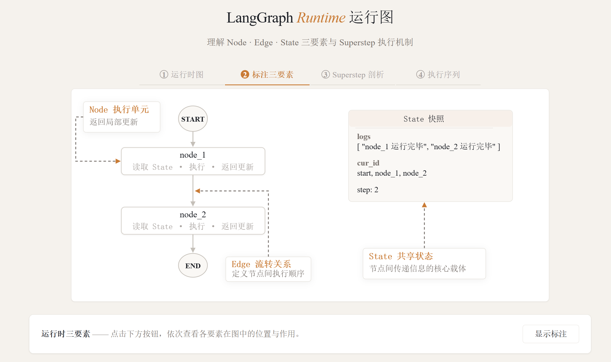
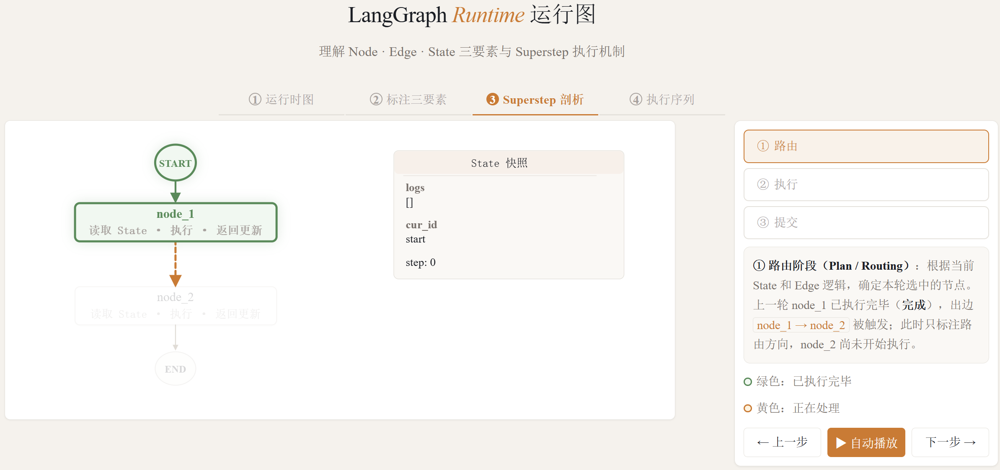
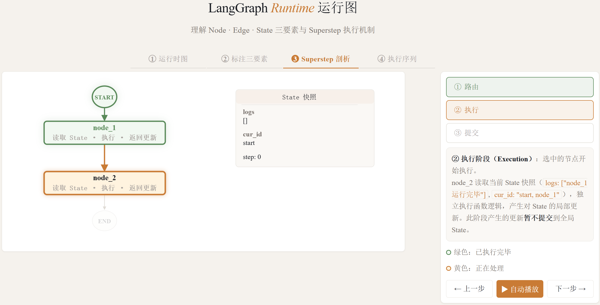
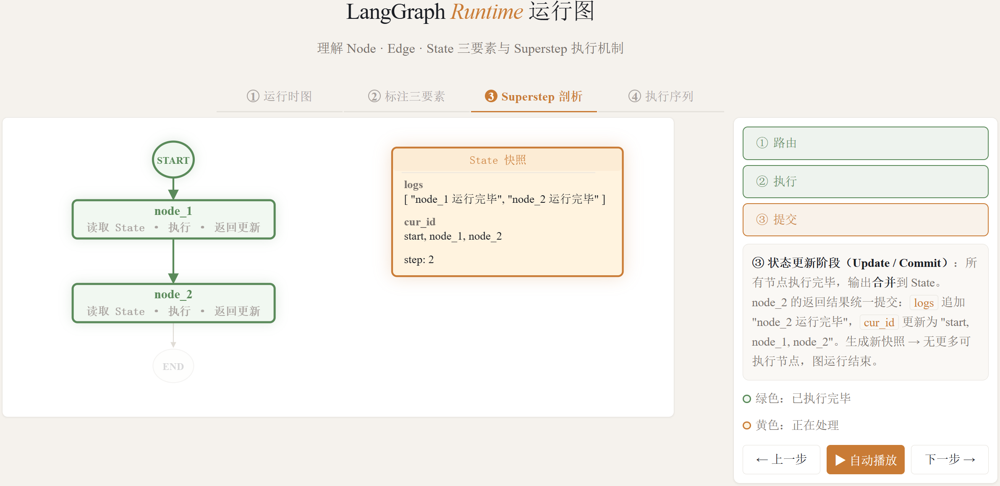

# LangGraph总览

LangGraph 运行时底层基于自研的 Pregel 运行时，其核心思想借鉴了 Google Pregel 计算模型，用于组织和执行复杂的图计算流程。

## 1.0. `LangGraph`和`LangChain`的版本迭代及定位

**LangChain 1.x** 的定位发生了明显变化：旧式 Chain、Retriever、Memory 等组件被迁移至 langchain-classic；LCEL 保留为 langchain-core 的底层组合机制，但不再是主要开发入口。

**LangChain 1.x** 现在聚焦于 Agent 开发，核心入口是 create_agent，围绕 Agent 提供模型、工具、消息、结构化输出、Middleware` 和记忆管理等高层抽象。

**LangGraph** 是更底层的编排框架与 Agent Runtime，负责复杂工作流和有状态 Agent 的执行，提供持久化、流式输出、Durable Execution、Human-in-the-loop 等运行时能力。create_agent 底层基于 LangGraph` 实现。

二者的定位对比如下：

| 对比维度 | LangChain             | LangGraph                                    |
| -------- | --------------------- | -------------------------------------------- |
| 定位     | Agent 高层开发框架    | 底层编排框架 & Agent Runtime                 |
| 核心入口 | `create_agent`        | `StateGraph` / `@entrypoint`                 |
| 适用场景 | 结构直接的 Agent 应用 | 复杂工作流、持久化状态、长时间运行、人工介入 |
| 流程控制 | Agent 循环自动管理    | 精细控制节点、边、条件分支                   |
| 学习成本 | 较低                  | 较高                                         |

> `LangChain` 提供易于使用的 Agent 高层抽象，`LangGraph` 提供可靠、可持久化且可精细控制的底层执行能力。

对于大多数 Agent 项目，从 LangChain 的 create_agent 开始即可；需要复杂工作流编排、确定性步骤与 Agent 步骤混合、长时间运行或底层状态控制时，再引入 LangGraph。



## 1.1. 构成图的基本要素

LangGraph 运行时主要由三个基本要素构成：State（状态）、Node（节点） 和 Edge（边）

State（状态）：LangGraph 运行过程中的共享数据结构，用于表示应用在某一时刻的状态快照。它承载了图运行所需的上下文信息、中间结果和后续节点需要读取的数据，是节点之间传递信息的核心载体。它与我们在学习 LangChain Agent 时使用的 State 是同一概念。

Node（节点）：LangGraph 中的具体执行单元，通常实现为一个函数。节点会读取当前 State，执行相应的业务逻辑，并返回对 State 的局部更新。节点本身并不直接修改全局状态，状态的合并与提交由运行时统一完成。

Edges（边）：用于定义节点之间的流转关系，决定一个节点执行完成后下一步应该进入哪个节点。Edge 可以是固定流转，也可以根据当前 State 进行条件判断，从而实现分支、循环等复杂控制流程。

下图展示了一个非常简单的运行图，只有两个计算节点，其拓扑结构为

```
START --> node_1 --> node_2 --> END
```

如下图所示



## 1.2. 图运行过程

LangGraph 的图运行过程基于 Superstep（超步） 来组织和推进。Superstep 可以理解为图运行过程中的一次”单步循环”。一次图运行过程从开始到结束，就是由一系列连续的 Superstep 串联而成。

下文以 **node_1执行完毕后的Superstep** 为例说明。

每个 Superstep 通常可以分为三个阶段：

1. 计划/路由阶段（Plan / Routing）：根据当前的 State（状态） 和 Edge（边） 的逻辑，确定本轮超步中应该被执行的节点。



2. 执行阶段（Execution）：运行本轮被选中的节点。如果本轮有多个节点同时被触发，它们会并行执行。每个节点都会基于本轮开始时的状态快照进行计算，并输出各自对状态的局部更新。在本阶段中，一个节点产生的更新不会立即被其他节点读取到。



3. 状态更新/提交阶段（Update / Commit）：当本轮所有节点都执行完成后，LangGraph 会将它们的输出统一合并到 State 中，生成新的状态快照。这个新状态会作为下一轮 Superstep 的输入。



完整的运行流程查看 [index.html](langgraph-runtime-viz/index.html) ，双击在浏览器打开即可。

其中和Checkpoint相关的部分，学习相关内容后再看。

## 1.3. Graph API vs Functional API

LangGraph 提供了两种不同的 API 来构建运行图：`Graph API`（图式 API） 和 `Functional API`（函数式 API）。这两种 API 共享相同的底层运行时，可以在同一应用程序中协同使用，但它们针对不同的使用场景和开发偏好而设计。

---

### 1.3.1. Graph API

Graph API 采用声明式方式构建工作流。开发者需要显式定义 State、Node 和 Edge，将业务流程组织成一个可视化的图结构。

当流程中存在较复杂的分支、多个节点之间共享状态、并行执行、结果汇聚，或者需要通过图结构帮助调试和团队协作时，更适合使用 Graph API。官方文档也明确建议，在需要复杂流程可视化、显式状态管理、多条件分支、并行路径以及团队协作时，优先选择 Graph API。

总之：

> Graph API 更适合构建结构清晰、节点关系复杂、需要长期维护的工作流。

典型场景包括：

| 场景               | 说明                                               |
| ------------------ | -------------------------------------------------- |
| 多节点复杂流程     | 流程中存在多个处理节点，需要清晰表达节点之间的关系 |
| 条件分支较多       | 根据 State 中的不同字段决定后续执行路径            |
| 并行执行与结果汇聚 | 多个节点并行运行，之后汇总结果                     |
| 多组件共享状态     | 多个节点都需要读写同一个全局 State                 |
| 需要图结构展示     | 便于调试、讲解、文档化和团队协作                   |

---

### 1.3.2. Functional API

Functional API 采用命令式方式构建工作流，更接近普通 Python 函数调用。开发者可以使用 `@entrypoint` 定义工作流入口，使用 `@task` 定义可被检查点记录的任务，然后在函数内部使用普通的 `if/else`、循环和函数调用来组织流程。官方文档指出，当已有过程式代码需要最小改造、流程主要是线性的、分支逻辑较简单、希望快速原型验证时，更适合使用 Functional API。

可以这样理解：

> Functional API 更适合在普通 Python 函数流程中，以较低成本接入 LangGraph 的持久化、中断恢复和任务记录能力。

典型场景包括：

| 场景           | 说明                                               |
| -------------- | -------------------------------------------------- |
| 现有代码改造   | 原本已有函数式或过程式代码，不希望重构成完整图结构 |
| 线性流程       | 主要是 A → B → C 的顺序执行                        |
| 简单分支       | 只有少量 `if/else` 判断                            |
| 快速原型验证   | 希望减少样板代码，快速验证业务逻辑                 |
| 局部任务持久化 | 希望某些函数作为独立 task 被检查点记录             |

---

### 1.3.3. 二者的核心区别

| 对比项     | Graph API                      | Functional API                   |
| ---------- | ------------------------------ | -------------------------------- |
| 编程风格   | 声明式图结构                   | 命令式函数流程                   |
| 核心抽象   | State、Node、Edge              | entrypoint、task                 |
| 状态管理   | 显式定义全局 State             | 更多依赖函数参数和返回值         |
| 流程表达   | 通过节点和边表达               | 通过普通 Python 控制流表达       |
| 可视化能力 | 强，天然适合画图和调试         | 弱，更像普通代码流程             |
| 适合场景   | 复杂工作流、多分支、多节点协作 | 简单流程、快速原型、已有代码改造 |
| 学习成本   | 相对更高                       | 相对更低                         |

---

### 1.3.4. 选型建议

从零构建或流程结构复杂，用 `Graph API`；现有代码改造、快速原型验证或流程逻辑简单，用 `Functional API`。

学习 `LangGraph` 建议优先掌握 `Graph API`。因为后者更能体现 `LangGraph` 的核心思想：通过 `State、Node、Edge` 显式描述一个可执行的计算图。

本文介绍 `Graph API`，对 `Functional API` 感兴趣的同学自行查阅

> https://docs.langchain.com/oss/python/langgraph/functional-api
