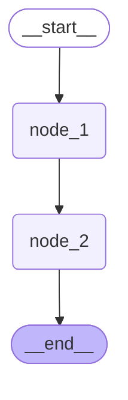
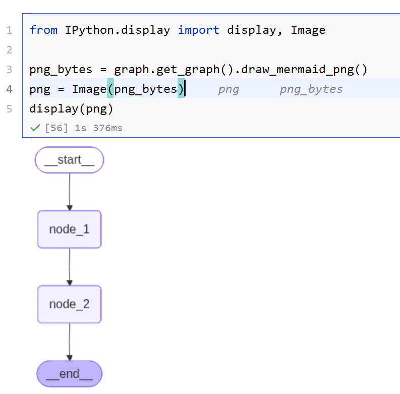
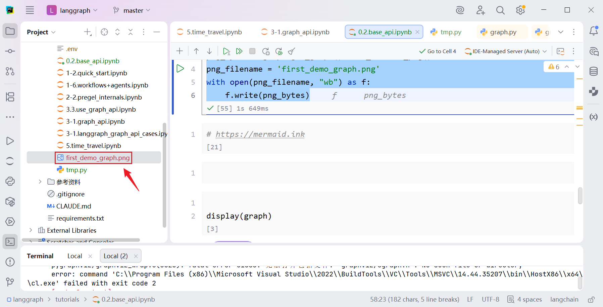
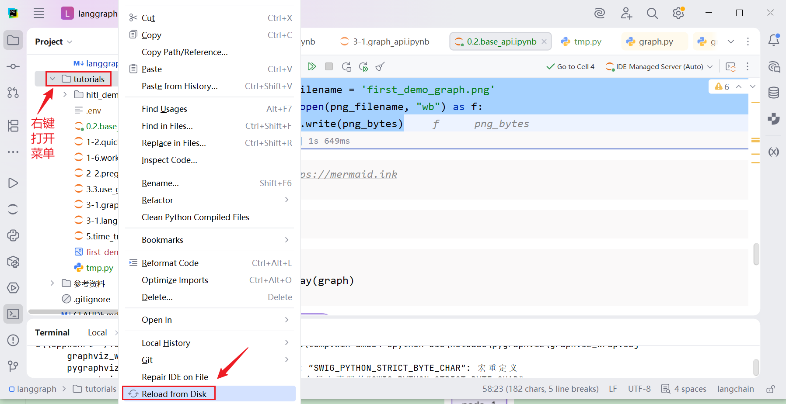
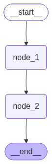
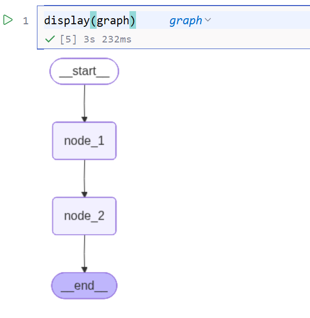

# 2. 图的基础构建与运行

本节将从一个基础案例入手，掌握图的基本创建、调用和可视化方法。

图的构建与运行分为三个阶段：定义状态图、编译状态图、调用状态图

## 2.1. 定义状态图

状态图的定义可以分为以下几个步骤：

**1. 定义全局状态** 定义整个运行图共享的全局状态（实际上，除了全局状态，LangGraph还支持其它类型的状态，下文详述）

**2. 创建状态图** 创建 StateGraph实例，将状态和状态图绑定

**3. 定义图结构** 定义节点和边并添加到状态图中

### 2.1.1. 定义全局状态

全局状态是 LangGraph 运行图每个节点都可以访问的公共对象。

```python
class OverAllState(TypedDict):
    logs: Annotated[list[str], add]
    cur_id: str
```

### 2.1.2. 创建状态图

```python
builder = StateGraph(state_schema=OverAllState)
```

### 2.1.3. 定义图结构

#### 2.1.3.1. 定义图节点

```python
def node_1(state: OverAllState) -> OverAllState:
    pre_id = state["cur_id"]
    return {
        "logs": ["node_1 运行完毕"],
        "cur_id": pre_id + ", node_1"
    }

def node_2(state: OverAllState) -> OverAllState:
    pre_id = state["cur_id"]
    return {
        "logs": ["node_2 运行完毕"],
        "cur_id": pre_id + ", node_2"
    }
```

#### 2.1.3.2. 添加节点

```python
builder.add_node("node_1", node_1)
builder.add_node("node_2", node_2)
```

#### 2.1.3.3. 添加边

```python
builder.add_edge(START, "node_1")
builder.add_edge("node_1", "node_2")
builder.add_edge("node_2", END)
```

## 2.2. 编译状态图

将上一步得到的状态图编译为可执行的运行图

```python
graph = builder.compile()
```

## 2.3. 调用状态图

可以通过invoke调用计算图

```python
print(graph.invoke({"cur_id": "start"}))
```

## 2.4. 完整代码

```python
from langgraph.graph import StateGraph, START, END
from typing import TypedDict, Annotated
from operator import add

class OverAllState(TypedDict):
    logs: Annotated[list[str], add]
    cur_id: str

def node_1(state: OverAllState) -> OverAllState:
    pre_id = state["cur_id"]
    return {
        "logs": ["node_1 运行完毕"],
        "cur_id": pre_id + ", node_1"
    }

def node_2(state: OverAllState) -> OverAllState:
    pre_id = state["cur_id"]
    return {
        "logs": ["node_2 运行完毕"],
        "cur_id": pre_id + ", node_2"
    }

builder = StateGraph(state_schema=OverAllState)
builder.add_node("node_1", node_1)
builder.add_node("node_2", node_2)
builder.add_edge(START, "node_1")
builder.add_edge("node_1", "node_2")
builder.add_edge("node_2", END)

graph = builder.compile()

print(graph.invoke({"cur_id": "start"}))
```

运行结果如下

```
{'logs': ['node_1 运行完毕', 'node_2 运行完毕'], 'cur_id': 'start, node_1, node_2'}
```

## 2.5. 图结构可视化

### 2.5.1. 绘制mermaid并获取源码

mermaid是一种生成图表和流程图的文本标记语言，它可以把简单的文本描述直接渲染成可视化图形。

通过以下代码可以用mermaid语法表达图结构，并打印mermaid源码

```python
raw_mermaid = graph.get_graph().draw_mermaid()
print(raw_mermaid)
```

输出如下

```
---
config:
  flowchart:
    curve: linear
---
graph TD;
    __start__([<p>__start__</p>]):::first
    node_1(node_1)
    node_2(node_2)
    __end__([<p>__end__</p>]):::last
    __start__ --> node_1;
    node_1 --> node_2;
    node_2 --> __end__;
    classDef default fill:#f2f0ff,line-height:1.2
    classDef first fill-opacity:0
    classDef last fill:#bfb6fcmermaidmermain
```

输出文本从`graph TD;`开始的部分为mermaid源码。



### 2.5.2. 绘制mermaid并转换为png

Langgraph也支持将mermaid转换为图片字节流

```python
png_bytes = graph.get_graph().draw_mermaid_png()
```

`draw_mermaid_png()`底层会先调用`draw_mermaid()`得到mermaid语法的图表代码，然后调用在线服务渲染为mermaid图片。

默认的mermaid在线渲染服务链接为：https://mermaid.ink，由于网络问题可能存在渲染失败的情况，通常重试即可成功。

可以通过`draw_mermaid_png()`的`base_url`参数替换可用的mermaid在线渲染服务，

#### 2.5.2.1. jupyter环境下直接展示图片

在jupyter环境下，可以通过IPython提供的功能将图片字节流直接展示为图片。

```python
from IPython.display import display, Image

png_bytes = graph.get_graph().draw_mermaid_png()
png = Image(png_bytes)
display(png)
```

运行结果如下所示



#### 2.5.2.2. 保存为图片文件

也可以将图片字节流转换为PNG文件落盘

```python
png_bytes = graph.get_graph().draw_mermaid_png()
png_filename = 'first_demo_graph.png'
with open(png_filename, "wb") as f:
    f.write(png_bytes)
```

运行结束后，代码文件同级目录下将会出现生成好的图片文件，如下图所示。



如果看不到文件，可以刷新上级目录



图片内容如下



#### 2.5.2.3. 快捷用法

在 `Jupyter` 环境下，可以直接使用 `display(graph)` 快速展示编译后的图结构：

```python
from IPython.display import display

display(graph)
```

效果如下


