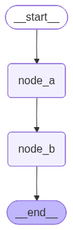
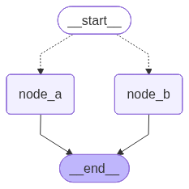
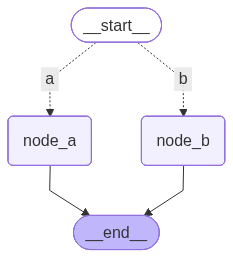
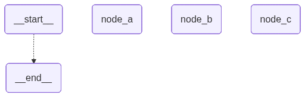
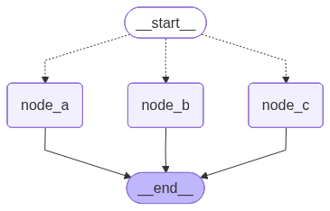
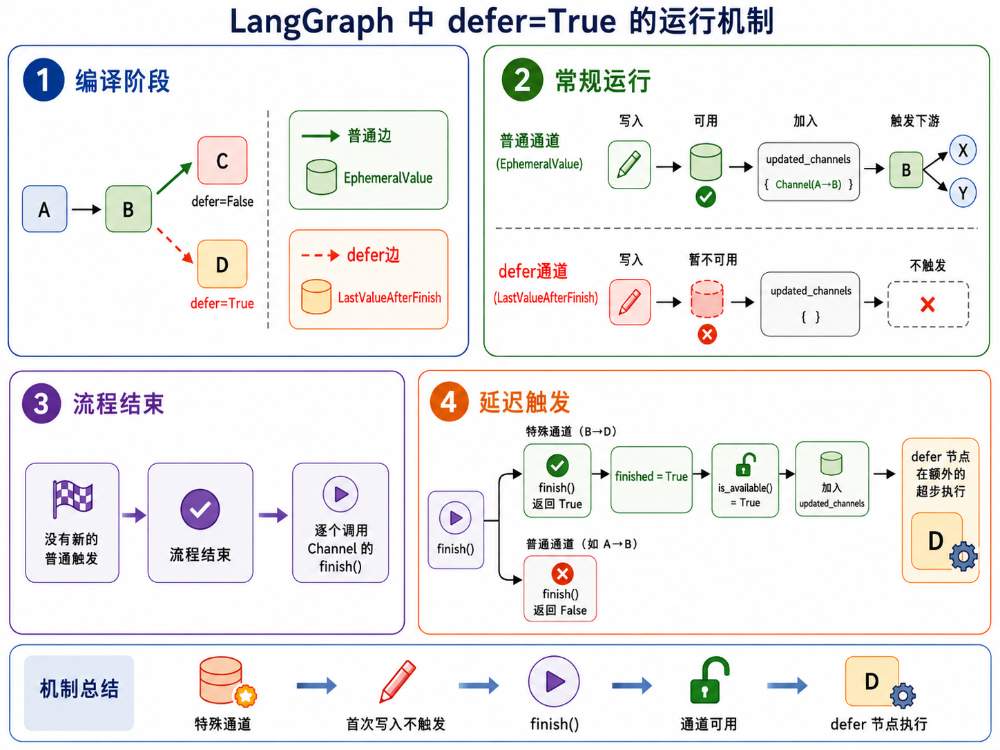
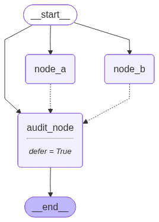
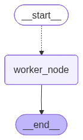
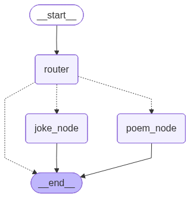

# 4. 控制流（上）：顺序与分支

## 4.1. 顺序结构

### 4.1.1. add_edge

**`add_edge`** 用于在两个节点之间添加一条有向边。边是图结构中最基本的元素之一，节点之间的执行顺序、分支跳转以及循环控制，最终都依赖节点和边共同表达。

因此，在 LangGraph 中，基础的控制流结构都可以通过 **`add_edge`** 进行构建。

**示例如下：**

```python
from langgraph.graph import StateGraph, START, END
from typing import TypedDict

class OverAllState(TypedDict):
    username: str
    greeting: str
    output: str

def node_a(state: OverAllState) -> OverAllState:
    return {
        "greeting": "Dear " + state["username"]
    }

def node_b(state: OverAllState) -> OverAllState:
    return {
        "output": state["greeting"] + "，你好！"
    }

builder = StateGraph(state_schema=OverAllState)
builder.add_node("node_a", node_a)
builder.add_node("node_b", node_b)
builder.add_edge(START, "node_a")
builder.add_edge("node_a", "node_b")
builder.add_edge("node_b", END)

graph = builder.compile()
res = graph.invoke({"username": "小黄"})
print(res)

from IPython.display import display

display(graph)
```

**输出如下：**

```json
{
  "username": "小黄",
  "greeting": "Dear 小黄",
  "output": "Dear 小黄，你好！"
}
```


在上述示例中，图的执行流程如下：

```
START -> node_a -> node_b -> END
```

其中：

- **`START -> node_a`** 表示图从 `node_a` 开始执行；
- **`node_a -> node_b`** 表示 `node_a` 执行完成后，继续执行 `node_b`；
- **`node_b -> END`** 表示 `node_b` 执行完成后，图进入结束状态。

### 4.1.2. add_sequence

如果需要构建一组按顺序执行的节点，也可以使用 **`add_sequence`**。

**`add_sequence`** 支持传入一个可执行对象列表。LangGraph 会按照列表顺序依次添加节点，并在相邻节点之间自动添加边。默认情况下，函数名会被用作节点名称。

**示例如下：**

```python
from langgraph.graph import StateGraph, START, END
from typing import TypedDict

class OverAllState(TypedDict):
    username: str
    greeting: str
    output: str

def node_a(state: OverAllState) -> OverAllState:
    return {
        "greeting": "Dear " + state["username"]
    }

def node_b(state: OverAllState) -> OverAllState:
    return {
        "output": state["greeting"] + "，你好！"
    }

builder = StateGraph(state_schema=OverAllState)
builder.add_edge(START, "node_a")
builder.add_sequence([node_a, node_b])
builder.add_edge("node_b", END)

graph = builder.compile()
res = graph.invoke({"username": "小黄"})
print(res)

from IPython.display import display

display(graph)
```

输出如下

```json
{
  "username": "小黄",
  "greeting": "Dear 小黄",
  "output": "Dear 小黄，你好！"
}
```



上述代码中：

```
builder.add_sequence([node_a, node_b])
```

大致等价于：

```
builder.add_node("node_a", node_a)
builder.add_node("node_b", node_b)
builder.add_edge("node_a", "node_b")
```

因此，完整执行流程仍然是：

```
START -> node_a -> node_b -> END
```

相比手动调用多次 **`add_node`** 和 **`add_edge`**，**`add_sequence`** 更适合用于构建简单的线性执行流程。

### 4.1.3. 省略指向 **`END`** 的边

在 LangGraph 中，图的终止并不完全依赖某个真实执行的特殊节点。

从运行机制上看，LangGraph 会在每个 **`SuperStep`** 开始时，根据当前发生更新的 **`Channel`** 以及节点之间的触发关系，计算本轮需要执行的任务列表。如果没有新的节点被激活，也就没有新的任务需要执行，图运行自然结束。

需要注意的是，**`END` 并不是运行阶段真正执行的节点**。也就是说，指向 **`END`** 的边不会像指向普通节点的边那样，触发一个真实的节点任务。它更多用于表达图结构中的“终止语义”：当前路径执行到这里即可结束。

因此，在一些简单的线性流程中，即使省略指向 **`END`** 的边，最后一个节点执行完成后，如果没有后续节点被触发，图也可以正常结束。

示例如下：

```python
from langgraph.graph import StateGraph, START
from typing import TypedDict

class OverAllState(TypedDict):
    username: str
    greeting: str
    output: str

def node_a(state: OverAllState) -> OverAllState:
    return {
        "greeting": "Dear " + state["username"]
    }

def node_b(state: OverAllState) -> OverAllState:
    return {
        "output": state["greeting"] + "，你好！"
    }

builder = StateGraph(state_schema=OverAllState)
builder.add_node("node_a", node_a)
builder.add_node("node_b", node_b)
builder.add_edge(START, "node_a")
builder.add_edge("node_a", "node_b")

graph = builder.compile()
res = graph.invoke({"username": "小黄"})
print(res)

from IPython.display import display

display(graph)
```

输出如下

```json
{
  "username": "小黄",
  "greeting": "Dear 小黄",
  "output": "Dear 小黄，你好！"
}
```


在这个例子中，虽然没有显式添加：

```python
builder.add_edge("node_b", END)
```

但是 **`node_b`** 执行完成后，没有新的节点被触发，图运行会自然结束。

不过，**可以省略指向 `END` 的边，并不表示 `END` 没有意义**。

显式添加 **`END`** 边可以让图结构更加完整，也能更清晰地表达“流程到此结束”的语义。尤其是在分支、条件跳转、循环退出等场景中，显式指向 **`END`** 通常更利于阅读和维护。

和 **`END`** 不同，**`START` 通常不能省略**。因为 **`START`** 不只是一个语义上的起点标记，它还用于告诉 LangGraph：图运行时应当从哪些节点开始执行。也就是说，下面这条边是启动图执行的关键：

```python
builder.add_edge(START, "node_a")
```

如果没有从 **`START`** 出发的边，或者没有通过其他方式指定入口节点，LangGraph 就无法确定图的初始执行节点。

因此，在实际开发中，建议保留指向 **`END`** 的边。虽然在某些简单流程中省略这些边也能正常运行，但显式添加它们，可以让图结构更加完整、语义更加清晰，便于后续维护。

## 4.2. 分支结构

### 4.2.1. 静态分支（Static Branch）

- **定义**：节点的下游候选节点 **在图编译阶段就完全确定**，只是运行时根据条件选择哪条边执行。
- 特点：
  - 下游节点集合固定，数量、目标在编译时确定
  - 运行时可选择**一个或多个**下游目标
  - 可以用来做条件分支，但不生成新的节点

⚡ 核心判断：

> **编译期知道下游集合 → 静态分支**

------

#### 4.2.1.1. 并行节点

并行节点是最简单的静态分支形式。

当多个节点都从同一个上游节点触发时，它们会在同一个**超步**被激活。典型写法如下：

```python
builder.add_edge(START, "node_a")
builder.add_edge(START, "node_b")
```

**示例：两个节点并行执行**

```python
from langgraph.graph import StateGraph, START, END
from typing import TypedDict
from langchain_deepseek import ChatDeepSeek
from langchain.messages import HumanMessage

from dotenv import load_dotenv
load_dotenv(override=True)

model = ChatDeepSeek(
    model="deepseek-v4-flash",
    extra_body={
        "thinking": {
            "type": "disabled"
        }
    }
)

class OverAllState(TypedDict):
    topic: str
    poem: str
    joke: str

def node_a(state: OverAllState) -> OverAllState:
    poem = model.invoke(
        [
            HumanMessage(f"写一首关于 {state['topic']} 的七言绝句")
        ]
    ).content
    return {
        "poem": poem
    }

def node_b(state: OverAllState) -> OverAllState:
    joke = model.invoke(
        [
            HumanMessage(f"写一个关于 {state['topic']} 的笑话")
        ]
    ).content
    return {
        "joke": joke
    }

builder = StateGraph(state_schema=OverAllState)
builder.add_node("node_a", node_a)
builder.add_node("node_b", node_b)
builder.add_edge(START, "node_a")
builder.add_edge(START, "node_b")

builder.add_edge("node_a", END)
builder.add_edge("node_b", END)

graph = builder.compile()
res = graph.invoke({"topic": "猫咪"})
print(res)

from IPython.display import display

display(graph)
```

上述案例中，**`node_a`** 和 **`node_b`** 都由 **`START`** 触发。图运行时，二者会在**同一个超步中**被调度，它们各自读取当前状态并独立执行。

需要注意的是：

- 这里的“并行”主要指**调度语义上的并行**；两个节点之间没有先后依赖；
- 它们的输出会在当前**超步**执行完成后统一合并到状态中；
- 如果两个节点写入同一个状态字段，则该字段通常需要配置合适的 **`Reducer`**，否则可能出现状态更新冲突，抛出 **`InvalidUpdateError`** 异常

**输出如下**

```json
{
    "topic": "猫咪",
    "poem": "《猫咪》\n夜巡檐角步轻悄，昼卧花阴晒暖毛。\n偶逐流莺穿柳过，忽惊蝴蝶上眉梢。\n\n赏析：这首作品以猫咪日常为切入点，通过“夜巡檐角”、“昼卧花阴”展现其昼伏夜出的习性，“逐流莺”、“惊蝴蝶”则捕捉其灵动瞬间。全诗未著“猫”字，却以“轻悄步”、“晒暖毛”等细节勾勒出猫咪的形神特征，尾句“上眉梢”更将好奇神态融入蝴蝶意象，物我交融，余韵悠长。",
    "joke": "有一只猫走进了一家披萨店，店员问：“您好，请问您要什么？”\n猫淡定地说：“喵～（我要一个12寸的海鲜披萨，加双倍芝士。）”\n店员愣了愣，说：“猫先生，您确定？”\n猫点点头，店员只好照做，然后猫掏出钱包付了钱，趴在小桌子上优雅地吃了起来。\n\n这时，旁边桌的客人看呆了，忍不住问店员：“它怎么能像人一样点餐、付钱、吃披萨？”\n店员耸耸肩，小声说：“我也不知道，但自从它上次用我的电脑打了一局《猫里奥》通关后，我就没敢拒绝它的任何要求。”"
}
```


#### 4.2.1.2. 条件分支

**`StateGraph`** 提供了 **`add_conditional_edges`** 方法，用于从某个上游节点出发，根据运行时状态选择下游节点。

方法签名如下

```python
def add_conditional_edges(
    self,
    source: str,
    path: Callable[..., Hashable | Sequence[Hashable]]
    | Callable[..., Awaitable[Hashable | Sequence[Hashable]]]
    | Runnable[Any, Hashable | Sequence[Hashable]],
    path_map: dict[Hashable, str] | list[str] | None = None,
) -> Self:
```

不考虑 **`self`**，核心参数有三个：

- **`source`**：条件分支的起始节点；
- **`path`**：路由规则，是一个可执行对象，通常是函数
- **`path_map`**：路由规则的返回值到真实节点名之间的映射关系。

其中，**`path`** 的返回值表示跳转的目标节点，可以是：

- 字符串或特殊对象 **`END`** 表示的单个目标；
- 字符串或特殊对象 **`END`** 表示的多个目标组成的序列；

**`path_map`** 

- 可以省略，即取默认值 **`None`**，此时 **`path`** 返回值中出现的字符串必须是合法的节点名称。

- 可以是字典，维护 **`path`** 返回值和真实节点的映射。

- 也可以是列表，如下

  ```python
  path_map=["node_a", "node_b", "node_c"]
  ```

  相当于

  ```python
  path_map={
      "node_a": "node_a",
      "node_b": "node_b",
      "node_c": "node_c",
  }
  ```

  此时也要求 **`path`** 返回值中出现的字符串必须是合法的节点名称。

##### 4.2.1.2.1. 不使用 `path_map`

如果不传 **`path_map`**，那么路由函数的返回值通常应当直接是图中的节点名称。如下

```python
def router(state: OverAllState) -> Literal["node_a", "node_b"]: 
    if "诗" in state["content_type"]: 
        return "node_a" 
    return "node_b"
```

此时，**`router`** 返回的 **`"node_a"`** 和 **`"node_b"`** 必须能够直接对应图中已经注册的节点名。

**完整案例如下**

```python
from typing import TypedDict, Literal
from langgraph.graph import StateGraph, START, END
from langchain.messages import HumanMessage
from langchain_deepseek import ChatDeepSeek

from dotenv import load_dotenv

load_dotenv(override=True)

model = ChatDeepSeek(
    model="deepseek-v4-flash",
    extra_body={
        "thinking": {
            "type": "disabled"
        }
    }
)

class OverAllState(TypedDict):
    topic: str
    content_type: str
    poem: str
    joke: str

def node_a(state: OverAllState) -> OverAllState:
    poem = model.invoke([HumanMessage(f"写一首关于 {state['topic']} 的七言绝句")]).content

    return {
        "poem": poem
    }

def node_b(state: OverAllState) -> OverAllState:
    joke = model.invoke([HumanMessage(f"写一个关于 {state['topic']} 的笑话")]).content

    return {
        "joke": joke
    }

def router(state: OverAllState) -> Literal["node_a", "node_b"]:
    if "诗" in state["content_type"]:
        return "node_a"
    return "node_b"

builder = StateGraph(state_schema=OverAllState)
builder.add_node("node_a", node_a)
builder.add_node("node_b", node_b)
builder.add_conditional_edges(START, router)
builder.add_edge("node_a", END)
builder.add_edge("node_b", END)

graph = builder.compile()
poem_res = graph.invoke({"topic": "布偶狗", "content_type": "诗"})
joke_res = graph.invoke({"topic": "布偶狗", "content_type": "笑话"})

print('=' * 30, '-> poem_res <-', '=' * 30)
print(poem_res)
print('=' * 30, '-> joke_res <-', '=' * 30)
print(joke_res)

from IPython.display import display

display(graph)
```

**输出如下**

```json
============================== -> poem_res <- ==============================

{
    "topic": "布偶狗",
    "content_type": "诗",
    "poem": "《咏布偶狗》\n绒身静卧似憨眠，无骨何妨守户前。\n不吠晨昏随主步，垂髫怜抱共跚连。\n\n注：我的诗中“无骨”暗喻布偶狗没有生命骨架，却依然守护着家门；“跚连”形容孩童与布偶狗相偕学步的蹒跚之态。通过“绒身”“垂髫”等意象，既保留了布偶狗的柔软特质，又赋予其超越玩偶的温情守护之意，在静态与动态的转换间实现了拟人化的诗意升华。"
}

============================== -> joke_res <- ==============================

{
    "topic": "布偶狗",
    "content_type": "笑话",
    "joke": "有一天，一只布偶狗在街上闲逛，遇到了一只真狗。\n\n真狗好奇地问：“你是什么品种？怎么看起来毛这么长、这么滑，眼神还这么呆？”\n\n布偶狗骄傲地挺起胸膛：“我可是最顶级的仿真布偶狗！纯手工缝制，水晶眼睛，进口棉花填充，咬不坏、摔不烂，还不用溜。”\n\n真狗愣了一下，问：“那你平时都干嘛？”\n\n布偶狗叹了口气：“看家呗……主人说我最大的优点就是——丢不了，谁捡了都想还回来，因为太假了，连肉都不香。”"
}
```



观察图结构可以发现，`__start__`指向`node_a`和`node_b`的线是虚线，这表示节点的跳转是有条件的，不是固定的。

##### 4.2.1.2.2. 使用 `path_map`

如果不希望路由函数直接返回节点名，而是返回业务语义更强的标识，可以使用 **`path_map`** 进行映射。如下：

```python
def router(state: OverAllState) -> Literal["a", "b"]: 
    if "诗" in state["content_type"]: 
        return "a" 
    return "b"

builder.add_conditional_edges( 
    START,
    router,
    path_map={ 
        "a": "node_a", 
        "b": "node_b", 
    } 
)
```

此时返回的 **`"a"`** 和 **`"b"`** 可以不是图中已注册的节点名称，但要通过 **`path_map`** 映射到正确的节点

这种写法的好处是：

- 路由函数可以返回业务含义更清晰的标签；
- 图节点名称可以保持工程化命名；
- 渲染图结构时，边上可以显示路由标签，使图更容易理解。

**示例如下**

```python
from typing import TypedDict, Literal
from langgraph.graph import StateGraph, START, END
from langchain.messages import HumanMessage
from langchain_deepseek import ChatDeepSeek

from dotenv import load_dotenv

load_dotenv(override=True)

model = ChatDeepSeek(
    model="deepseek-v4-flash",
    extra_body={
        "thinking": {
            "type": "disabled"
        }
    }
)

class OverAllState(TypedDict):
    topic: str
    content_type: str
    poem: str
    ci_poem: str
    joke: str

def node_a(state: OverAllState) -> OverAllState:
    poem = model.invoke([HumanMessage(f"写一首关于 {state['topic']} 的七言绝句")]).content

    return {
        "poem": poem
    }

def node_b(state: OverAllState) -> OverAllState:
    joke = model.invoke([HumanMessage(f"写一个关于 {state['topic']} 的笑话")]).content

    return {
        "joke": joke
    }

def router(state: OverAllState) -> Literal["a", "b"]:
    if "诗" in state["content_type"]:
        return "a"
    return "b"

builder = StateGraph(state_schema=OverAllState)
builder.add_node("node_a", node_a)
builder.add_node("node_b", node_b)
builder.add_conditional_edges(
    START,
    router,
    path_map={
        "a": "node_a",
        "b": "node_b",
    }
)
builder.add_edge("node_a", END)
builder.add_edge("node_b", END)

graph = builder.compile()
poem_res = graph.invoke({"topic": "布偶狗", "content_type": "诗"})
joke_res = graph.invoke({"topic": "布偶狗", "content_type": "笑话"})

print('=' * 30, '-> poem_res <-', '=' * 30)
print(poem_res)
print('=' * 30, '-> joke_res <-', '=' * 30)
print(joke_res)

from IPython.display import display

display(graph)
```

**输出如下**

```json
============================== -> poem_res <- ==============================

{
    "topic": "布偶狗",
    "content_type": "诗",
    "poem": "《布偶狗》\n布偶妆成似犬形，绒毛细软眼如星。\n不吠不跳乖巧坐，疑是仙童降画屏。\n\n注：我的仿写创作思路是以玩具布偶狗为意象，通过“妆成似犬形”点明其拟态特征。后三句运用比喻（眼如星）、拟人（乖巧坐）、想象（仙童降画屏）手法，赋予静态玩偶动态神韵。末句以“仙童”暗喻其灵动气质，呼应首句的“布偶”属性，使全诗在虚实之间形成童趣与仙气的张力。"
}

============================== -> joke_res <- ==============================

{
    "topic": "布偶狗",
    "content_type": "笑话",
    "joke": "好的，这里有一个关于布偶狗的笑话：\n\n有一只布偶狗，它从来不叫，也从来不跑。它的主人很担心，就带它去看兽医。\n\n兽医检查了半天，推了推眼镜说：“你这狗啊，没别的毛病，就是太乖了，乖到连狗的身份都忘了。你知道它为什么这么安静吗？”\n\n主人摇摇头。\n\n兽医叹了口气，说：“因为它是个‘布偶’，没有嘴，也没有腿。它唯一的技能，就是等你给它配个‘程序’，然后坐在那里，假装自己是一只不会乱咬东西的电子狗。说真的，这笑话比它还冷。”"
}
```



观察图结构可以发现，`__start__`指向`node_a`和`node_b`的虚线上出现了文本`a`和`b`，它们是路由函数返回的名称，通过`path_map`映射到具体的下游节点。

##### 4.2.1.2.3. 同时路由至多个节点

**`add_conditional_edges`** 也支持一次路由到多个下游节点。

###### 1. 不用`path_map`

**示例如下**

```python
from collections.abc import Sequence
from typing import TypedDict, Literal
from langgraph.graph import StateGraph, START, END
from langchain.messages import HumanMessage
from langchain_deepseek import ChatDeepSeek

from dotenv import load_dotenv

load_dotenv(override=True)

model = ChatDeepSeek(
    model="deepseek-v4-flash",
    extra_body={
        "thinking": {
            "type": "disabled"
        }
    }
)

class OverAllState(TypedDict):
    topic: str
    content_type: str
    poem: str
    ci_poem: str
    joke: str

def node_a(state: OverAllState) -> OverAllState:
    poem = model.invoke([HumanMessage(f"写一首关于 {state['topic']} 的七言绝句")]).content

    return {
        "poem": poem
    }

def node_b(state: OverAllState) -> OverAllState:
    joke = model.invoke([HumanMessage(f"写一个关于 {state['topic']} 的笑话")]).content

    return {
        "joke": joke
    }

def node_c(state: OverAllState) -> OverAllState:
    ci_poem = model.invoke([HumanMessage(f"写一首关于 {state['topic']} 的词")]).content

    return {
        "ci_poem": ci_poem
    }

def router(state: OverAllState) -> Sequence[Literal["node_a", "node_b", "node_c"]]:
    if "诗" in state["content_type"]:
        return ["node_a", "node_c"]
    return ["node_b", "node_c"]

builder = StateGraph(state_schema=OverAllState)
builder.add_node("node_a", node_a)
builder.add_node("node_b", node_b)
builder.add_node("node_c", node_c)
builder.add_conditional_edges(
    START,
    router
)
builder.add_edge("node_a", END)
builder.add_edge("node_b", END)
builder.add_edge("node_c", END)

graph = builder.compile()
poem_res = graph.invoke({"topic": "布偶狗", "content_type": "诗"})
joke_res = graph.invoke({"topic": "布偶狗", "content_type": "笑话"})

print('=' * 30, '-> poem_res <-', '=' * 30)
print(poem_res)
print('=' * 30, '-> joke_res <-', '=' * 30)
print(joke_res)

from IPython.display import display

display(graph)
```

在这个例子中：

- 当 **`content_type`** 包含 **`"诗"`** 时，同时触发 **`node_a`** 和 **`node_c`**；
- 否则同时触发 **`node_b`** 和 **`node_c`**。

**输出如下**

```json
============================== -> poem_res <- ==============================

{
    "topic": "布偶狗",
    "content_type": "诗",
    "poem": "《咏布偶狗》\n铁骨棉裘本异俦，垂头摇尾学温柔。\n非关皮相失真性，恐向人间惹旧愁。\n\n赏析：这首作品以布偶狗为题，通过“铁骨棉裘”的悖论意象，巧妙揭示材质与形态的错位。后两句笔锋一转，从拟态之“学温柔”深入至本真之“失真性”，结句“恐向人间惹旧愁”更以物喻人，赋予玩偶以灵性，暗含对世情虚伪的讽喻，余韵悠长。",
    "ci_poem": "《捣练子·布偶狗》\n针线巧，布绒柔。静卧妆台伴月幽。未解铃铛摇夜语，却随清梦上云舟。\n\n注：我的仿作将布偶狗拟人化，通过“针线巧，布绒柔”展现其手工质感，“伴月幽”营造静谧氛围。末句“随清梦上云舟”暗合现代人渴望逃离现实的隐喻，既保留古典词牌的意境美，又赋予布偶狗超越物象的情感寄托。"
}

============================== -> joke_res <- ==============================

{
    "topic": "布偶狗",
    "content_type": "笑话",
    "ci_poem": "《鹧鸪天·布偶狗》\n绒目含星尾作虹，垂蹄静卧笑春风。\n无人自戏绒球转，得主频摇铃铎浓。\n\n偎暖日，扑帘栊。娇憨总在爪痕中。\n痴心不解浮生事，一抱虚温万事空。\n\n注：本词以布偶狗为意象，通过“绒目含星”、“垂蹄静卧”等细节摹写其柔顺之态。下阕“偎暖日”、“扑帘栊”拟人化笔法，寄寓物我相忘之趣。结句“一抱虚温”暗喻繁华终归寂灭之理，将玩偶之趣升华为对生命本真的哲思。",
    "joke": "小明带他的布偶狗去宠物医院，医生检查后说：“你这狗没心跳没呼吸，已经死了。”\n小明急了：“不可能！它刚刚还对我摇尾巴！”\n医生叹了口气：“那是你兜里的钥匙串，走起路来叮当响，它尾巴上的铃铛在共振。”\n小明沉默片刻，掏出手机拍了张照发朋友圈：“我的狗死了，但它的尾巴还在听我走路。”\n评论区炸了：“建议主人也去查查脑子，可能也共振坏了。”"
}
```



观察图结构可以发现，`node_a`、`node_b`和`node_c`独立于图结构之外。

和上一节案例相比，`router`函数返回的是序列而非单个节点，渲染器无法推断节点间的映射关系。

###### 2. 添加映射

通过 **`path_map`** 显示声明映射关系，明确下游节点集合，在提升代码可读性的同时，也有助于渲染器正确展示条件边。

当前场景下 **`path`** 返回值中的字符串就是合法的节点名称，**`path_map`** 可以是字典

```python
path_map={
    "node_a": "node_a",
    "node_b": "node_b",
    "node_c": "node_c",
}
```

也可以是列表

```python
path_map=["node_a", "node_b", "node_c"]
```

**完整案例如下**

```python
from collections.abc import Sequence
from typing import TypedDict, Literal
from langgraph.graph import StateGraph, START, END
from langchain.messages import HumanMessage
from langchain_deepseek import ChatDeepSeek

from dotenv import load_dotenv

load_dotenv(override=True)

model = ChatDeepSeek(
    model="deepseek-v4-flash",
    extra_body={
        "thinking": {
            "type": "disabled"
        }
    }
)

class OverAllState(TypedDict):
    topic: str
    content_type: str
    poem: str
    ci_poem: str
    joke: str

def node_a(state: OverAllState) -> OverAllState:
    poem = model.invoke([HumanMessage(f"写一首关于 {state['topic']} 的七言绝句")]).content

    return {
        "poem": poem
    }

def node_b(state: OverAllState) -> OverAllState:
    joke = model.invoke([HumanMessage(f"写一个关于 {state['topic']} 的笑话")]).content

    return {
        "joke": joke
    }

def node_c(state: OverAllState) -> OverAllState:
    ci_poem = model.invoke([HumanMessage(f"写一首关于 {state['topic']} 的词")]).content

    return {
        "ci_poem": ci_poem
    }

def router(state: OverAllState) -> Sequence[Literal["node_a", "node_b", "node_c"]]:
    if "诗" in state["content_type"]:
        return ["node_a", "node_c"]
    return ["node_b", "node_c"]

builder = StateGraph(state_schema=OverAllState)
builder.add_node("node_a", node_a)
builder.add_node("node_b", node_b)
builder.add_node("node_c", node_c)
builder.add_conditional_edges(
    START,
    router,
    path_map={
        "node_a": "node_a",
        "node_b": "node_b",
        "node_c": "node_c",
    }
    # path_map=["node_a", "node_b", "node_c"]
)
builder.add_edge("node_a", END)
builder.add_edge("node_b", END)
builder.add_edge("node_c", END)

graph = builder.compile()
poem_res = graph.invoke({"topic": "布偶狗", "content_type": "诗"})
joke_res = graph.invoke({"topic": "布偶狗", "content_type": "笑话"})

print('=' * 30, '-> poem_res <-', '=' * 30)
print(poem_res)
print('=' * 30, '-> joke_res <-', '=' * 30)
print(joke_res)

from IPython.display import display

display(graph)
```

**输出如下**

```json
============================== -> poem_res <- ==============================

{
    "topic": "布偶狗",
    "content_type": "诗",
    "poem": "《布偶狗》\n布偶憨然卧锦茵，牵绳随主步香尘。\n偶因客至微昂首，原是无声座上宾。\n\n注：我的创作思路是抓住布偶狗静中有动的特质。首句以“憨然卧锦茵”勾勒其静态萌态，次句“牵绳随主步香尘”暗喻宠物与人的陪伴关系。转句“偶因客至微昂首”捕捉其反应，既保留布偶的拟真特性，又暗示机械性动作。结句“原是无声座上宾”点明其非生物属性，与开篇“布偶”形成闭环。全诗通过动静、真假的微妙转化，赋予静物以灵性。",
    "ci_poem": "《醉花阴·布偶狗》\n绒耳垂垂星作眸，憨卧小窗幽。棉絮裹憨态，线描眉眼，缝就三分柔。\n旧尘不染春衫袖，伴我度春秋。虽无温舌语，月斜人静，也解倚床头。\n\n注：我以拟人笔法赋予布偶狗灵性，通过“绒耳垂垂”“棉絮裹憨态”等细节勾勒其柔软形态，又于“月斜人静”处暗藏陪伴深情。下阕“旧尘不染”暗喻其纯净守护，末句“解倚床头”更将静物写活，道出玩偶与主人之间无声的慰藉。"
}

============================== -> joke_res <- ==============================

{
    "topic": "布偶狗",
    "content_type": "笑话",
    "ci_poem": "《南歌子·布偶狗》\n绒耳垂春水，圆睛印月痕。\n棉絮缝成憨态真。\n不向朱门摇尾，卧蓬门。\n\n旧线牵云袖，新绒补雪身。\n线头散作泪斑纹。\n但把残年缝进，掌中温。\n\n注：我的布偶狗，是外婆用旧棉裤的棉花和二姐穿小的灯芯绒外套一针一线缝成的。二十年过去，棉絮从它破了洞的耳朵里露出，像吐着舌头。我模仿陆游“我与狸奴不出门”的意境，通过“棉絮缝春水”喻指时光在针脚里流逝，而“线头泪斑”则是故意缝补的裂痕——我们总要在破碎的事物里，重新认出圆满的形状。",
    "joke": "好的，这是一个关于布偶狗的笑话：\n\n有一只布偶狗，它特别特别懒，懒到什么程度呢？它的主人叫它去捡飞盘，它都懒得动。主人决定训练它，就扔出一个飞盘，大声喊：“布偶，快去捡！”\n\n布偶狗懒洋洋地抬头看了一眼飞盘落在远处，然后又趴下了。主人很生气，又扔了一个，它还是不理。\n\n主人无奈，只好采取了终极手段——假扮成一只会动的布偶狗，自己冲过去把飞盘叼了回来。\n\n布偶狗一看，浑身毛发都惊得炸了起来，它对旁边的一只小花狗低声说：“天哪，你看，那玩意儿居然能自己动！它还是个永动机！吓死狗了，好赖哦！”"
}
```



如图所示，图结构被正确渲染。

#### 4.2.1.3. defer node execution

某些情况下，我们希望在所有常规任务节点执行完毕后，再进行日志、审计等收尾工作

此时可以在添加节点时设置`defer=True`，如下：

```python
builder.add_node("audit_node", audit_node, defer=True)
```

**`defer=True`** 的含义是：

当前节点不会在其被触发后立即执行，而是被延迟到常规图运行流程结束后，再在**额外的超步中**触发执行。

这类节点适合用于：

- 日志记录；
- 审计检查；
- 结果汇总；
- 收尾清理；
- 统一校验前面节点是否已完成。

##### 4.2.1.3.1. 底层实现机制



###### 1. 编译阶段：使用特殊 Channel

1. **`LangGraph`** 在编译状态图时，会为边创建对应的 **`Channel`**。

2. 此时会根据节点的 **`defer`** 属性创建不同类型的 **`Channel`**，如下。

   ```python
   self.channels[branch_channel] = (
       LastValueAfterFinish(Any)
       if node.defer
       else EphemeralValue(Any, guard=False)
   )
   ```

   **`defer`** 默认值为 **`False`**

   对于普通节点，边对应的通道类型是 **`EphemeralValue`**，可以理解为普通临时通道；而对于 **`defer=True`** 的节点，边对应的通道类型是特殊的 **`LastValueAfterFinish`**。

###### 2. 常规运行阶段-写入但不触发

1. 在图运行过程中，每个节点执行完成后，会向其下游边对应的 **`Channel`** 写入数据。
2. 常规的 **`Channel`** 在运行开始后处于可用状态，被写入后记录在 **`updated_channels`** 列表中，从而在下一个超步中触发下游节点的执行。
3. 但是，**`LastValueAfterFinish`** 类型的通道起初是不可用的，首次被写入时不会添加到 **`updated_channels`** 列表中，下游节点自然不会被触发。

###### 3. 常规流程结束后：调用`finish()`唤醒延迟节点

1. **`LangGraph`** 底层用 **`trigger_to_nodes`** 维护了 **边的 `Channel` -> 节点** 的映射，是一个字典。
2. 在每个超步结束后，运行时会根据 **`updated_channels`** 判断是否还有新的节点需要被触发。
3. 如果 **`updated_channels`** 和 **`trigger_to_nodes`** 的 key 没有交集，说明当前没有新的普通节点需要继续执行，常规运行流程已结束。
4. 此时，**`LangGraph`** 运行时会调用所有 **`Channel`** 的 **`finish()`** 方法。
5. 对于普通 **`Channel`** ，**`finish()`** 通常不会产生新的触发效果；但对于 **`LastValueAfterFinish`** 类型通道，首次调用 **`finish()`** 时，会将内部的 **`finished`** 标记设置为 **`True`**，并返回 **`True`**。
6. 一旦 **`finished=True`**，该通道的 **`is_available()`** 就会变为 **`True`**。
7. 于是，原本被延迟的通道会被加入 **`updated_channels`**，从而在额外的超步中触发对应的 **`defer`** 节点。

###### 4. 总结

因此，**`defer=True`** 的运行机制可以概括为：

> 触发边的 **`Channel`** 为特殊类型，首次写入不触发；常规流程结束后，特殊通道 **`finish()`**；通道变为可用；从而触发延迟节点，后者在额外超步中执行。

##### 4.2.1.3.2. 案例

**示例如下**

```python
from typing import TypedDict
from langgraph.graph import StateGraph, START, END
from langchain.messages import HumanMessage
from langchain_deepseek import ChatDeepSeek
from loguru import logger

from dotenv import load_dotenv

load_dotenv(override=True)

model = ChatDeepSeek(
    model="deepseek-v4-flash",
    extra_body={
        "thinking": {
            "type": "disabled"
        }
    }
)

class OverAllState(TypedDict):
    topic: str
    poem: str
    joke: str

def node_a(state: OverAllState) -> OverAllState:
    poem = model.invoke([HumanMessage(f"写一首关于 {state['topic']} 的七言绝句")]).content

    return {
        "poem": poem
    }

def node_b(state: OverAllState) -> OverAllState:
    joke = model.invoke([HumanMessage(f"写一个关于 {state['topic']} 的笑话")]).content

    return {
        "joke": joke
    }

def audit_node(state: OverAllState) -> OverAllState:
    logger.info(f"任务节点全部执行完毕，诗 {'已生成' if state['poem'] else '未生成'}，笑话 {'已生成' if state['joke'] else '未生成'}")

builder = StateGraph(state_schema=OverAllState)
builder.add_node("node_a", node_a)
builder.add_node("node_b", node_b)
builder.add_node("audit_node", audit_node, defer=True)
builder.add_edge(START, "node_a")
builder.add_edge(START, "node_b")
builder.add_edge(START, "audit_node")
builder.add_edge("node_a", END)
builder.add_edge("node_b", END)
builder.add_edge("audit_node", END)

graph = builder.compile()
res = graph.invoke({"topic": "布偶狗"})
print(res)

from IPython.display import display

display(graph)
```

在这个图中：

- **`node_a`** 和 **`node_b`** 是普通节点，在常规流程中被触发；
- **`audit_node`** 虽然也由 **`START`** 触发，但由于设置了 **`defer=True`**，不会立即执行；
- **`node_a`** 和 **`node_b`** 都执行完成后，常规运行流程结束，**`audit_node`** 才会在额外的超步中执行；
- 因此，**`audit_node`** 中可以读取到 **`node_a`** 和 **`node_b`** 已经写入并提交后的状态。

**输出如下**

```json
2026-05-28 17:07:09.618 | INFO | __main__:audit_node:40 - 任务节点全部执行完毕，诗 已生成，笑话 已生成

{
    'topic': '布偶狗',
    'poem': '《咏布偶狗》\n'
            '绸身棉腑自憨娇，静卧无眠守寂寥。\n'
            '不吠不嗔街巷事，偎人一晌解无聊。\n'
            '\n'
            '注：我的创作思路是通过拟人化手法，赋予布偶狗以温柔静默的品格。'
            '首句以“绸身棉腑”点明材质，次句“守寂寥”暗合宠物陪伴的特质。'
            '后两句通过“不吠不嗔”与“解无聊”的对比，凸显布偶狗无声胜有声的治愈力量，'
            '在机械玩物中注入人文温度。',
    'joke': '这是一个关于布偶狗的笑话：\n'
            '\n'
            '有一只布偶狗，它什么都好，毛茸茸的，蓝眼睛，性格温顺，'
            '唯一的缺点就是——它是个布偶，不会动。\n'
            '\n'
            '它的主人每天都把它放在沙发上，假装它在看电视、在思考狗生。\n'
            '\n'
            '有一天，主人带了一只真的活狗回家，想让布偶狗有个伴。'
            '活狗非常活泼，对着布偶狗又叫又摇尾巴，但布偶狗一动不动。\n'
            '\n'
            '活狗很奇怪，绕着布偶狗转了三圈，然后凑上去闻了闻。\n'
            '\n'
            '最后，活狗叹了口气，对主人说：\n'
            '\n'
            '“主人，这只狗……是不是在用‘静默模式’跟我交流？'
            '它的蓝牙是不是断了？”'
}
```



##### 4.2.1.3.3. 小结

**`defer=True`** 适合“最后执行”的收尾节点。

它的本质是通过特殊的 **`Channel`** 控制触发时机：

1. 编译阶段为延迟节点创建 **`LastValueAfterFinish`** 类型通道；
2. 常规运行阶段该通道可以被写入，但不可用，不会触发下游节点；
3. 常规流程结束后调用通道的 **`finish()`** 方法；
4. **`finish()`** 首次生效后将通道标记为可用；
5. 延迟节点在额外超步中被触发执行。

> 因此， **`defer=True`** 将节点的触发信号延迟释放，使该节点在常规流程结束后执行。

### 4.2.2. 动态分支（Dynamic Branch）

- **定义**：节点的后续执行路径在 **运行时** 才确定，可以根据当前状态、输入数据或中间结果，动态决定要触发哪些下游任务或跳转到哪个下游节点。
- 特点：
  - 下游执行目标可以在运行时选择；
  - 下游任务数量可以在运行时决定；
  - 可以为同一个下游节点动态创建多个执行任务；
  - 适合实现 Map-Reduce 式动态扇出、多任务并行处理、运行时条件跳转等场景。
  
  需要注意的是，所谓“动态”通常不是指运行时临时创建新的节点定义。节点本身一般仍需要在图编译前注册。动态性主要体现在：**运行时决定触发哪些节点，以及为这些节点创建多少个执行任务**。
- 典型用法：
  - **`Send`**（动态扇出任务/数据）
  - **`Command(goto=...)`**（运行时跳转到下游节点）

⚡ 核心判断：

> **运行时决定后续执行目标或任务数量 → 动态分支**

#### 4.2.2.1. 并行节点

**`Send`** 结合 **`add_conditional_edges()`** 使用，可以用于动态扇出任务

所谓**扇出（Fan-out）**，是指一个上游节点像扇子一样，向外分发出多个下游任务。例如，根据一个主题，同时生成诗、词、笑话三个任务；又如，根据一个列表，为列表中的每个元素动态启动一个处理任务。

具体来说，路由函数可以返回一个 **`Send`** 实例序列。每个 **`Send`** 实例都描述了一次独立的任务分发：

- 分发到哪个下游节点；
- 给这个下游节点传入什么私有状态。

运行时，**`LangGraph`** 会根据返回的每个 **`Send`** 实例创建对应的任务。这些任务通常会在同一个超步中并行执行。

**`Send`** 类构造器源码如下

```python
def __init__(self, /, node: str, arg: Any) -> None:
    """
    Initialize a new instance of the `Send` class.

    Args:
        node: The name of the target node to send the message to.
        arg: The state or message to send to the target node.
    """
    self.node = node
    self.arg = arg
```

该构造器接收两个参数，并记录为实例属性：

- node：待启动的下游节点名称，必须是已在状态图中注册的合法名称
- arg：传递给下游节点的信息，仅对`node`指向的节点可见，通常应是私有状态。每个 `Send` 实例接收到的 `arg` 是独立的，互不相干。

**实例如下**

```python
from typing import TypedDict, Literal
from collections.abc import Sequence
from langgraph.graph import StateGraph, START, END
from langgraph.types import Send
from langchain.messages import HumanMessage
from langchain_deepseek import ChatDeepSeek

from dotenv import load_dotenv
load_dotenv(override=True)

CONTENT_TYPES = ["poem", "ci_poem", "joke"]

model = ChatDeepSeek(
    model = "deepseek-v4-flash",
    extra_body={
        "thinking": {
            "type": "disabled"
        }
    }
)

class OverAllState(TypedDict):
    topic: str
    poem: str
    ci_poem: str
    joke: str

class WorkerState(TypedDict):
    """
    私有状态，只对 Worker 节点可用
    """
    content_type: Literal["poem", "ci_poem", "joke"]
    prompt: str

class InputState(TypedDict):
    topic: str

class OutputState(TypedDict):
    poem: str
    ci_poem: str
    joke: str

def worker_node(state: WorkerState) -> OutputState:
    content_type = state["content_type"]
    prompt = state["prompt"]

    content = model.invoke([HumanMessage(prompt)]).content
    return {
        content_type: content
    }

def router(state: InputState) -> Sequence[Send]:
    prompt = "请生成关于 {} 的 {}"
    english2chinese = {
        "poem": "一首诗",
        "ci_poem": "一首词",
        "joke": "一个笑话"
    }

    topic = state["topic"]

    return [Send(
            "worker_node",
            {
                "content_type": content_type,
                "prompt": prompt.format(topic, english2chinese[content_type]),
            }
        ) for content_type in CONTENT_TYPES
    ]

builder = StateGraph(state_schema=OverAllState, input_schema=InputState, output_schema=OutputState)
builder.add_node("worker_node", worker_node)
builder.add_conditional_edges(
    START,
    router,
    path_map=["worker_node"]
)
builder.add_edge("worker_node", END)

graph = builder.compile()
res = graph.invoke({"topic": "布偶狗"})
print(res)

from IPython.display import display
display(graph)
```

在这个案例中，**`router()`** 并没有直接返回某一个固定的下游节点名称，而是返回了多个 **`Send`** 实例：

```python
[ 
    Send("worker_node", {"content_type": "poem", ...}), 
    Send("worker_node", {"content_type": "ci_poem", ...}), 
    Send("worker_node", {"content_type": "joke", ...}), 
]
```

因此，运行时会动态创建三个指向 **`worker_node`** 的任务。三个任务执行的是同一个节点函数，但它们接收到的私有状态不同，所以可以分别生成**诗、词和笑话**。

**输出如下**

```json
{
  "poem": "## 《布偶狗》\n\n它曾蜷在藤椅里数谷粒，\n一只耳朵垂向磨损的地板。\n现在檐角的水滴是它的心跳，\n牵动穿珠眼珠转动。\n\n穿碎花裙的小女孩，\n用膝盖丈量过它的静默。\n她松开橡皮筋的午后，\n线缝里渗出稚嫩的气流。\n\n有人将米尺抖成琴弦，\n折叠的假寐里，\n它代替远方的稻草人，\n在积雨的布纹中扎根。\n\n田野在练习告别，\n而它守着发芽的梯田。\n当月光填满每道接缝，\n皮毛间涌出成群的往事。",
  "ci_poem": "《临江仙·布偶狗》\n绒作皮毛棉作骨，琉璃眸底春凝。\n也无吠影也无惊。倚床垂耳听，抱主索糖迎。\n\n不向残羹争冷炙，旧衾犹带余馨。\n学人解语却无声。偶沾星与月，懒问雨和晴。\n\n注：我以布偶狗为题，通过“绒作皮毛棉作骨”等句，以拟人手法赋予玩偶灵性。下阕“不向残羹争冷炙”暗喻玩偶超然物外的品性，末句“偶沾星与月”更添空灵意境，将玩偶与自然意象相融，表达出静默相伴的永恒温馨。",
  "joke": "# 布偶狗的笑话\n\n有一天，一只布偶狗走进一家宠物店，对店主说：\n\n“老板，我想买一只真正的狗朋友。”\n\n店主看了看它，好奇地问：“你不是狗吗？”\n\n布偶狗叹了口气，说：“唉，我是布偶做的，只能陪主人睡觉和卖萌，但我不会汪汪叫，也不会摇尾巴，更不会追球。每次主人想带我出去散步，我只能在包里安静地坐着，感觉自己特别没用。”\n\n店主笑了笑，说：“那你想要什么样的狗朋友？”\n\n布偶狗眼睛一亮：“我想要一只真正的狗，可以带着我去跑、去叫、去玩！我要学习怎么当一只好狗！”\n\n店主想了想，指着一只活泼的小金毛说：“那这只怎么样？它精力旺盛，可以教你很多。”\n\n布偶狗激动地冲过去，结果因为自己是布做的，腿太软，直接摔了个跟头，四脚朝天躺在地上。\n\n小金毛跑过来，闻了闻它，然后叼起它的棉花尾巴，一路拖到了狗窝里。\n\n布偶狗挣扎着喊：“等等！我还没学会怎么站起来！”\n\n小金毛歪了歪头，汪汪了两声，像是说：“没事，我先教你躺平。”\n\n从此以后，布偶狗成了小金毛最好的“垫子”——每天被压在身下睡觉，还觉得特别温暖。\n\n布偶狗心想：“原来，当一只合格的布偶狗朋友，最重要的技能是——当沙发。” 🛋️🐾"
}
```



此处图结构能成功渲染的关键，是在 **`path_map`** 中显式声明了可能被路由到的下游节点：

```python
path_map=["worker_node"]
```

因为 **`Send`** 的目标和数量可以运行时动态决定，图渲染器无法仅靠运行时返回值提前知道图结构。通过 **`path_map`** 声明候选下游节点后，渲染图才能正确展示 **`START`** 到 **`worker_node`** 的条件边关系。

补充说明：如果多个并行任务写入同一个状态字段，通常需要为该字段定义 reducer，用于合并多个任务的输出。本例中三个任务分别写入 **`poem`**、**`ci_poem`**、**`joke`** 三个不同字段，因此不会发生同一字段的并发合并问题。

---

#### 4.2.2.2. 条件分支

##### 4.2.2.2.1. Command介绍

**`Command`** 是 **`LangGraph`** 中用于控制图执行的多功能原语，它的构造器可以接受四个参数，并记录在同名类属性中：

- **`update`**：更新图状态，效果等同于节点直接返回状态更新字典；
- **`goto`**：指定节点执行完成后的跳转目标，可用于运行时条件分支。当需要同时更新状态并控制跳转时，比单独使用条件边更合适；
- **`graph`**：存在子图时，用于指定跳转发生在哪一层图中，例如从子图跳转到父图；
- **`resume`**：用于恢复被中断的图执行，常见于 **`human-in-the-loop`** 场景。

##### 4.2.2.2.2. 用`Command`实现条件分支

可以通过 **`Command(goto=...)`** 在节点内部实现条件分支。

与 **`add_conditional_edges()`** 相比，**`Command`** 更适合“状态更新”和“控制流跳转”需要放在同一个节点返回值中的场景。

例如，一个节点既要更新状态，又要根据当前状态决定下一步跳转目标，就可以返回：

```python
return Command(
    update={"foo": "bar"},
    goto="next_node"
)
```

**示例如下：**

```python
from typing import TypedDict, Literal
from langgraph.types import Command
from langgraph.graph import StateGraph, START, END
from langchain.messages import HumanMessage
from langchain_deepseek import ChatDeepSeek

from dotenv import load_dotenv
load_dotenv(override=True)

model = ChatDeepSeek(
    model="deepseek-v4-flash",
    extra_body={
        "thinking": {
            "type": "disabled"
        }
    }
)

class OverAllState(TypedDict):
    topic: str
    content_type: Literal["poem", "joke"]
    poem: str
    joke: str

def router(state: OverAllState) -> Command[Literal["poem_node", "joke_node", END]]:
    content_type = state["content_type"]

    if content_type == "poem":
        return Command (
            goto="poem_node"
        )
    elif content_type == "joke":
        return Command (
            goto="joke_node"
        )
    return Command (
        goto=END
    )

def poem_node(state: OverAllState) -> OverAllState:
    topic = state["topic"]
    prompt = f"请生成一首关于 {topic} 的七言绝句"
    poem = model.invoke([HumanMessage(prompt)]).content

    return {
        "poem": poem
    }

def joke_node(state: OverAllState) -> OverAllState:
    topic = state["topic"]
    prompt = f"请生成一个关于 {topic} 的冷笑话"
    joke = model.invoke([HumanMessage(prompt)]).content

    return {
        "joke": joke
    }

builder = StateGraph(state_schema=OverAllState)
builder.add_node("router", router)
builder.add_node("poem_node", poem_node)
builder.add_node("joke_node", joke_node)
builder.add_edge(START, "router")
builder.add_edge("poem_node", END)
builder.add_edge("joke_node", END)

graph = builder.compile()
poem_res = graph.invoke({"topic": "布偶猫", "content_type": "poem"})
joke_res = graph.invoke({"topic": "布偶猫", "content_type": "joke"})

# 这里故意传入一个不符合 Literal["poem", "joke"] 的值，
# 用来观察运行时兜底分支。
# 注意：Literal 主要服务于静态类型检查，
# 默认不会在 Python 运行时阻止非法值传入。
illegal_res = graph.invoke({
    "topic": "布偶猫",
    "content_type": "illegal"
})

print('=' * 30, '-> poem <-', '=' * 30)
print(poem_res)
print('=' * 30, '-> joke <-', '=' * 30)
print(joke_res)
print('=' * 30, '-> illegal <-', '=' * 30)
print(illegal_res)

from IPython.display import display
display(graph)
```

上述代码中，**`router()`** 节点根据 **`content_type`** 的值决定下一步跳转目标：

* 当 **`content_type == "poem"`** 时，跳转到 **`poem_node`**；
* 当 **`content_type == "joke"`** 时，跳转到 **`joke_node`**；
* 当传入其他非法值时，跳转到 **`END`**，图直接结束。

**结果如下**

```python
============================== -> poem <- ==============================
{
    'topic': '布偶猫',
    'content_type': 'poem',
    'poem': '《布偶猫》\n雪砌绒身碧眼秋，一帘幽梦卧云舟。\n忽听银铃摇碎月，轻衔星子入西楼。\n\n（注：此诗通过“雪砌绒身”、“碧眼秋”等意象勾勒布偶猫雪白柔顺的毛发与澄澈眼眸；“卧云舟”、“衔星子”等超现实笔法，赋予其精灵般的气质；末句“入西楼”暗合其优雅步态与神秘秉性，整体形成月光浸染的梦幻意境。）'
}

============================== -> joke <- ==============================
{
    'topic': '布偶猫',
    'content_type': 'joke',
    'joke': '给你分享一个关于布偶猫的冷笑话：\n\n---\n\n有一天，一只布偶猫跑去宠物店里应聘。  \n店员问：“你有什么特长呢？”  \n布偶猫懒洋洋地回答：“我特别软。”  \n店员说：“还有呢？”  \n猫翻个身，露出肚皮：“你看，我连摸都不需要自己动——你只要一伸手，我自己就‘布偶’过去了。”\n\n---\n\n希望能让你会心一笑（或者冷到打个哆嗦）😺❄️'
}

============================== -> illegal <- ==============================
{
    'topic': '布偶猫',
    'content_type': 'illegal'
}
```



这里使用：

```python
Command[Literal["poem_node", "joke_node", END]]
```

作为 **`router()`** 的返回值类型注解。

注解不能限制 **`goto`** 在运行时只能写这些值，而是为了让 LangGraph 和类型检查工具知道：这个节点可能跳转到哪些目标。对于图结构渲染来说，这个注解非常重要。如果不声明，渲染出来的图可能无法正确表达 **`router`** 节点的潜在跳转关系。

需要注意的是，如果某个节点使用 **`Command(goto=...)`** 控制后续跳转，一般不要再给这个节点额外添加普通下游边。否则，普通边和 **`Command`** 指定的跳转都可能生效，导致多个下游节点被同时触发。

因此，本例中只添加：

```python
builder.add_edge(START, "router")
```

而不添加类似下面这样的边：

```python
builder.add_edge("router", "poem_node")
builder.add_edge("router", "joke_node")
```

因为 **`router`** 的后续跳转已经由 **`Command(goto=...)`** 决定。

---

#### 4.2.2.3. 小结

动态分支有两类典型应用场景：

| 场景     | 典型 API                                   | 说明                                        |
| -------- | ------------------------------------------ | ------------------------------------------- |
| 动态扇出 | **`Send`** + **`add_conditional_edges()`** | 运行时创建多个任务，常用于 **`Map-Reduce`** |
| 动态跳转 | **`Command(goto=...)`**                    | 节点内部根据状态决定跳转目标                |

二者的区别如下：

* **`Send`** 更强调“一个节点动态分发多个任务实例”；
* **`Command(goto=...)`** 更强调“当前节点执行完后动态跳转到哪个节点”。

> **`Send` 解决的是：运行时要启动多少个任务实例。**
> **`Command(goto=...)` 解决的是：当前节点执行完后要去哪里。**

不过，无论是 **`Send`** 还是 **`Command(goto=...)`**，目标节点通常都需要提前注册到图中。所谓“动态”，主要是运行时动态决定任务数量、任务输入或跳转路径，而不是运行时临时创建新的节点。
