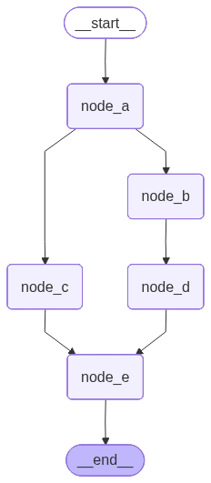
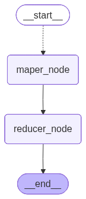
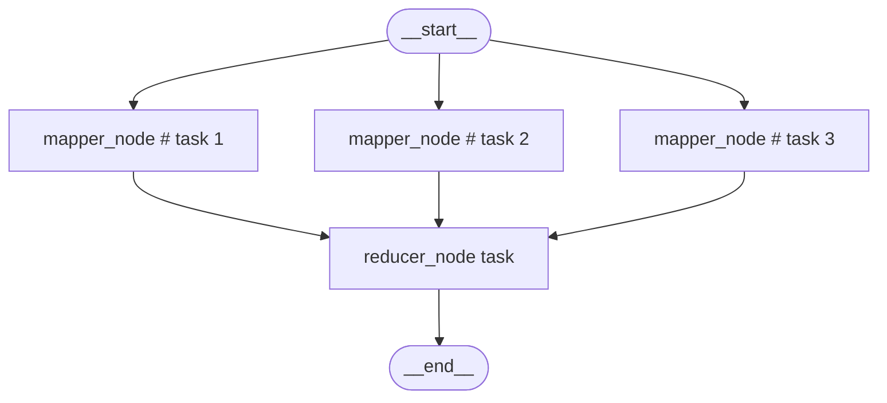
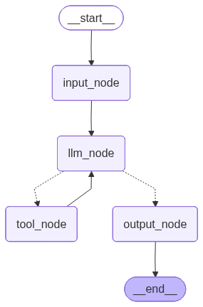
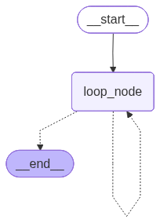
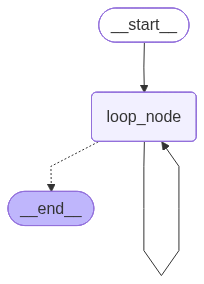

# 4. 控制流（下）：汇聚、循环与边

## 4.3. 多分支汇聚：Fan-in

上文提到了**扇出（Fan-out）**，它是指像打开扇子一样，由一个上游节点分发出多个下游分支。

与之相对，**扇入**（Fan-in）是指像合拢扇子一样，多个上游分支汇聚到同一个下游节点。

**Fan-out** 对应的是“分支结构”，**Fan-in** 对应的是“多分支汇聚结构”。

### 4.3.1. 静态扇入

在计算机中，“**与**”表示两个或多个条件同时满足，而“**或**”表示两个或多个条件任意一个满足。

当多个上游分支同时汇入同一个下游节点时，根据触发条件的不同，可以分成两种情况：

- “**与**”触发：上游所有分支全部到达才可触发下游节点
- “**或**”触发：任意一个分支到达，都可以触发下游节点

需要注意，这里的 **“与 / 或”** 只是帮助理解的类比，并不是 **`LangGraph`** 的官方术语。

#### 4.3.1.1 “**与**”触发：等待所有上游分支到达

这是多分支汇聚中**最常见**的情况。

**`LangGraph`** 的计算图是在一系列超步中完成的，如果能看到每个节点实例运行时的超步编号，则节点执行顺序一目了然。

**`LangGraph`** 的节点可以通过名为 **`config`** 的有名参数获取运行时配置

**`config`** 的元数据中记录了当前节点所在的 **`SuperStep`** 序号，可以通过下面的方式获取：

```python
config["metadata"]["langgraph_step"]
```

**详见下文。**

**示例如下**

```python
from typing import TypedDict
from langgraph.graph import StateGraph, START, END
from langchain_core.runnables import RunnableConfig

from loguru import logger

class EmptyState(TypedDict):
    pass

def node_a(state: EmptyState, config: RunnableConfig) -> EmptyState:
    cur_step = config["metadata"]["langgraph_step"]
    logger.info("cur_step: {}, node_a 被触发", cur_step)
    return {}

def node_b(state: EmptyState, config: RunnableConfig) -> EmptyState:
    cur_step = config["metadata"]["langgraph_step"]
    logger.info("cur_step: {}, node_b 被触发", cur_step)
    return {}

def node_c(state: EmptyState, config: RunnableConfig) -> EmptyState:
    cur_step = config["metadata"]["langgraph_step"]
    logger.info("cur_step: {}, node_c 被触发", cur_step)
    return {}

def node_d(state: EmptyState, config: RunnableConfig) -> EmptyState:
    cur_step = config["metadata"]["langgraph_step"]
    logger.info("cur_step: {}, node_d 被触发", cur_step)
    return {}

def node_e(state: EmptyState, config: RunnableConfig) -> EmptyState:
    cur_step = config["metadata"]["langgraph_step"]
    logger.info("cur_step: {}, node_e 被触发", cur_step)
    return {}

builder = StateGraph(state_schema=EmptyState)
builder.add_node("node_a", node_a)
builder.add_node("node_b", node_b)
builder.add_node("node_c", node_c)
builder.add_node("node_d", node_d)
builder.add_node("node_e", node_e)

builder.add_edge(START, "node_a")
builder.add_edge("node_a", "node_b")
builder.add_edge("node_a", "node_c")
builder.add_edge("node_b", "node_d")
builder.add_edge(["node_c", "node_d"], "node_e")

graph = builder.compile()
graph.invoke({})

from IPython.display import display
display(graph)
```

**运行结果如下**

```json
2026-06-05 14:55:01.705 | INFO     | __main__:node_a:12 - cur_step: 1, node_a 被触发
2026-06-05 14:55:01.708 | INFO     | __main__:node_b:17 - cur_step: 2, node_b 被触发
2026-06-05 14:55:01.710 | INFO     | __main__:node_c:22 - cur_step: 2, node_c 被触发
2026-06-05 14:55:01.713 | INFO     | __main__:node_d:27 - cur_step: 3, node_d 被触发
2026-06-05 14:55:01.714 | INFO     | __main__:node_e:32 - cur_step: 4, node_e 被触发
```


由运行结果可知：

* **`node_a`** 在第 1 个超步执行；
* **`node_b`** 和 **`node_c`** 在第 2 个超步并行执行；
* **`node_d`** 在第 3 个超步执行；
* **`node_e`** 在第 4 个超步执行。

虽然 **`node_c`** 在第 2 个超步已经执行完成，但是 **`node_e`** 并不会立刻触发。
因为这里使用的是：

```python
builder.add_edge(["node_c", "node_d"], "node_e")
```

这表示 **`node_e`** 需要等待 **`node_c`** 和 **`node_d`** 两个上游节点全部完成后，才会被触发一次。

因此，这种写法对应的是 **“与”触发**：等待所有上游分支到达方可触发。

#### 4.3.1.2 “**或**”触发：任意上游分支到达即可触发

另一种情况是：多个上游分支分别连接到同一个下游节点，但它们之间没有显式的同步等待关系。

**示例如下**

```python
from typing import TypedDict
from langgraph.graph import StateGraph, START, END
from langchain_core.runnables import RunnableConfig

from loguru import logger

class EmptyState(TypedDict):
    pass

def node_a(state: EmptyState, config: RunnableConfig) -> EmptyState:
    cur_step = config["metadata"]["langgraph_step"]
    logger.info("cur_step: {}, node_a 被触发", cur_step)
    return {}

def node_b(state: EmptyState, config: RunnableConfig) -> EmptyState:
    cur_step = config["metadata"]["langgraph_step"]
    logger.info("cur_step: {}, node_b 被触发", cur_step)
    return {}

def node_c(state: EmptyState, config: RunnableConfig) -> EmptyState:
    cur_step = config["metadata"]["langgraph_step"]
    logger.info("cur_step: {}, node_c 被触发", cur_step)
    return {}

def node_d(state: EmptyState, config: RunnableConfig) -> EmptyState:
    cur_step = config["metadata"]["langgraph_step"]
    logger.info("cur_step: {}, node_d 被触发", cur_step)
    return {}

def node_e(state: EmptyState, config: RunnableConfig) -> EmptyState:
    cur_step = config["metadata"]["langgraph_step"]
    logger.info("cur_step: {}, node_e 被触发", cur_step)
    return {}

builder = StateGraph(state_schema=EmptyState)
builder.add_node("node_a", node_a)
builder.add_node("node_b", node_b)
builder.add_node("node_c", node_c)
builder.add_node("node_d", node_d)
builder.add_node("node_e", node_e)

builder.add_edge(START, "node_a")
builder.add_edge("node_a", "node_b")
builder.add_edge("node_a", "node_c")
builder.add_edge("node_b", "node_d")

# 独立触发：node_c 完成后可以触发 node_e
builder.add_edge("node_c", "node_e")
# 独立触发：node_d 完成后可以触发 node_e
builder.add_edge("node_d", "node_e")

graph = builder.compile()
graph.invoke({})

from IPython.display import display
display(graph)
```

**运行结果如下**

```json
2026-06-05 15:09:11.715 | INFO     | __main__:node_a:12 - cur_step: 1, node_a 被触发
2026-06-05 15:09:11.720 | INFO     | __main__:node_b:17 - cur_step: 2, node_b 被触发
2026-06-05 15:09:11.723 | INFO     | __main__:node_c:22 - cur_step: 2, node_c 被触发
2026-06-05 15:09:11.729 | INFO     | __main__:node_d:27 - cur_step: 3, node_d 被触发
2026-06-05 15:09:11.729 | INFO     | __main__:node_e:32 - cur_step: 3, node_e 被触发
2026-06-05 15:09:11.732 | INFO     | __main__:node_e:32 - cur_step: 4, node_e 被触发
```



从运行结果可以看出，**`node_e`** 被触发了两次：

1. **`node_c`** 在第 2 个超步执行完成后，触发 **`node_e`** 在第 3 个超步执行；
2. **`node_d`** 在第 3 个超步执行完成后，再次触发 **`node_e`** 在第 4 个超步执行。

原因是这里使用了两条独立的边：

```python
builder.add_edge("node_c", "node_e")
builder.add_edge("node_d", "node_e")
```

这表示 **`node_c`** 和 **`node_d`** 都可以分别触发 **`node_e`**，它们之间没有同步等待关系。

因此，这种写法对应的是 **独立触发**，也可以类比为 **“或”触发**。

需要特别注意：

```python
builder.add_edge(["node_c", "node_d"], "node_e")
```

和

```python
builder.add_edge("node_c", "node_e")
builder.add_edge("node_d", "node_e")
```

不是等价写法。

前者表示 **等待多个上游全部完成后才触发一次**；
后者表示 **多个上游分支分别独立触发下游节点**。

### 4.3.2. 动态扇入-MapReduce结构

在上文我们通过 **`Send`** 动态生成了多个下游任务。

这种模式本质上是一种**动态扇出**：根据运行时数据，将一个任务拆分为多个子任务，并分别发送给下游节点处理。

如果这些子任务分别产生中间结果，并在后续通过 **`Reducer`** 进行合并，也就是重新 **扇入** 到一个下游节点中，最终得到统一的结果，那么就构成了典型的 **`MapReduce`** 结构。

**`MapReduce`** 是大数据计算中的经典模型，通常包含两个核心阶段：

* **`Map`：映射阶段**
  将输入数据映射为中间结果。

  在 **`LangGraph`** 中，可以理解为通过 **`Send`** 将子任务分发给多个 **`mapper`** 节点实例，每个节点实例独立完成局部计算：将部分输入数据映射为中间结果。
  
* **`Reduce`：归约阶段**
  将多个子任务产生的中间结果进行汇总、合并或聚合，得到最终结果。
  
  在 **`LangGraph`** 中，通常由一个特定的 **`reducer`** 节点完成归约：它接收上游 **`mapper`** 节点实例产生的中间结果，处理后得到计算图的最终输出。

本节实现一个经典的词频统计任务

```python
输入数据
  |
  | hello world
  | hello Atguigu
  | hello LLM
  v

Map：映射为中间键值对
  |
  | (hello, 1), (world, 1)
  | (hello, 1), (Atguigu, 1)
  | (hello, 1), (LLM, 1)
  v

Shuffle / Group：按 Key 分组
  |
  | hello   -> [1, 1, 1]
  | world   -> [1]
  | Atguigu -> [1]
  | LLM     -> [1]
  v

Reduce：归约 / 聚合
  |
  | hello   -> 3
  | world   -> 1
  | Atguigu -> 1
  | LLM     -> 1
  v

最终结果
```

需要注意，本节示例中没有单独实现一个 **`Shuffle`** 节点，而是把 **`Shuffle / Group`** 的逻辑也放在了 **`reducer_node`** 中完成。

在下面的示例中，我们用 **`Send`** 动态派发任务，创建了多个 **`mapper_node`** 实例。

每个 **`mapper_node`** 实例负责处理一条输入数据，并输出中间产物：**键值对**。

随后，下游的 **`reducer_node`** 收集所有中间结果，完成 **`Shuffle / Group`** 和最终的 **`Reduce`** 聚合。

**示例如下**

```python
from typing import TypedDict, Annotated
from langgraph.graph import StateGraph, START, END
from langgraph.types import Send
from _collections_abc import Sequence
from operator import add

from loguru import logger

class OverAllState(TypedDict):
    input_values: list[str]
    entries: Annotated[list[tuple[str, int]], add]
    word_counts: dict[str, int]

def router_map(state: OverAllState) -> Sequence[Send]:
    input_values = state["input_values"]

    tasks = []
    for input_value in input_values:
        tasks.append(
            Send(
                "mapper_node",
                {"input_value": input_value}
            )
        )

    return tasks

class MaperInputState(TypedDict):
    input_value: str

def mapper_node(state: MaperInputState) -> OverAllState:
    input_value = state["input_value"]
    words = input_value.split(" ")
    entries = []

    for word in words:
        entries.append((word, 1))

    return {
        "entries": entries
    }

def reducer_node(state: OverAllState) -> OverAllState:
    entries = state["entries"]
    logger.info("reducer entries: {}", entries)

    shuffle_dict = {}

    for k, v in entries:
        if k not in shuffle_dict:
            shuffle_dict[k] = [v]
        else:
            shuffle_dict[k].append(v)

    logger.info("reducer shuffle entries: {}", shuffle_dict)

    reduce_dict = {}

    for k, v in shuffle_dict.items():
        reduce_dict[k] = sum(v)

    return {
        "word_counts": reduce_dict
    }

builder = StateGraph(state_schema=OverAllState)
builder.add_node("mapper_node", mapper_node)
builder.add_node("reducer_node", reducer_node)
builder.add_conditional_edges(START, router_map, path_map=["mapper_node"])
builder.add_edge("mapper_node", "reducer_node")
builder.add_edge("reducer_node", END)

graph = builder.compile()
word_counts = graph.invoke(
    {"input_values": [
        "hello world",
        "hello Atguigu",
        "hello LLM"
    ]}
)

print(word_counts)

from IPython.display import display
display(graph)
```

运行结果如下



```json
2026-06-05 13:52:01.917 | INFO     | __main__:reducer_node:45 - reducer entries: [('hello', 1), ('world', 1), ('hello', 1), ('Atguigu', 1), ('hello', 1), ('LLM', 1)]
2026-06-05 13:52:01.918 | INFO     | __main__:reducer_node:55 - reducer shuffle entries: {'hello': [1, 1, 1], 'world': [1], 'Atguigu': [1], 'LLM': [1]}
{
    "input_values": [
        "hello world",
        "hello Atguigu",
        "hello LLM",
    ],
    "entries": [
        ("hello", 1),
        ("world", 1),
        ("hello", 1),
        ("Atguigu", 1),
        ("hello", 1),
        ("LLM", 1),
    ],
    "word_counts": {
        "hello": 3,
        "world": 1,
        "Atguigu": 1,
        "LLM": 1,
    },
}
```

从结果可以看出，三个输入字符串分别被映射为了中间键值对：

```python
("hello", 1), ("world", 1)
("hello", 1), ("Atguigu", 1)
("hello", 1), ("LLM", 1)
```

由于 **`entries`** 字段使用了 **`Reducer`**（**`LangGraph`** 状态的 **`Reducer`**，而不是当前示例中的 **`reducer_node`**）：

```python
entries: Annotated[list[tuple[str, int]], add]
```

所以多个 **`mapper_node`** 任务实例返回的 **`entries`** 会被合并到同一个状态字段中。

随后，**`reducer_node`** 读取合并后的 **`entries`**，先按单词进行分组：

```python
{
    "hello": [1, 1, 1],
    "world": [1],
    "Atguigu": [1],
    "LLM": [1],
}
```

再对每个分组中的数值进行求和，得到最终词频统计结果：

```python
{
    "hello": 3,
    "world": 1,
    "Atguigu": 1,
    "LLM": 1,
}
```

如果按照 **任务实例** 而不是 **节点定义** 来绘制运行图，那么这个示例实际的任务级运行图如下所示：



需要注意，**`display(graph)`** 展示的是节点级计算图，而不是运行时的任务实例图。
因此在可视化图中只会看到一个 **`mapper_node`** 节点；但在实际运行时，**`Send`** 会根据输入数据动态创建多个 **`mapper_node`** 任务实例。

## 4.4. 循环结构

### 4.4.1. 循环结构的实现

本节通过两种方式实现经典的 **`ReAct`** 循环结构。**`LangChain Agent`** 底层运行图架构正是 **`ReAct`** 。

**`ReAct`** 是 **`Reason + Action`** 的缩写，即“推理 + 行动”架构。其核心思想是：

1. **Reason**：大模型根据当前消息状态进行推理，判断是否需要调用工具；
2. **Action**：如果需要调用工具，则生成工具调用请求；
3. **Observation**：工具执行后，将执行结果以 **`ToolMessage`** 的形式返回给大模型；
4. **Loop**：大模型基于新的观察结果继续推理，决定是否继续调用工具；
5. **Final Answer**：当大模型不再发起工具调用时，生成最终回答，流程结束。

因此，**`ReAct`** 本质上是一个典型的 **“LLM → Tool → LLM → Tool → ... → LLM”** 循环结构。

本节分别使用两种方式实现该循环：

* **静态实现**：通过 **`add_conditional_edges()`** 在图结构中显式定义条件路由；
* **动态实现**：通过 **`Command(goto=...)`** 在节点返回值中触发运行时跳转。

---

#### 4.4.1.1. 静态实现

所谓“静态实现”，并不是指执行路径完全固定，而是指：

> **节点的下游候选集合在图编译阶段已经确定，运行时只是从这些候选节点中选择下一步。**

在本例中，**`llm_node`** 的下游候选节点是固定的：

* 如果大模型返回了 **`tool_calls`**，则进入 **`tool_node`**；
* 如果大模型没有返回 **`tool_calls`**，则进入 **`output_node`**。

也就是说，图结构在编译阶段已经知道 **`llm_node`** 可能流向 **`tool_node`** 或 **`output_node`**，运行时只负责判断具体走哪一条路径。

**示例如下**

```python
from typing import Literal
from langgraph.graph import StateGraph, START, END
from langgraph.graph.message import MessagesState
from langchain.messages import HumanMessage, ToolMessage, SystemMessage
from langchain.tools import tool
from langchain_deepseek import ChatDeepSeek

from random import randint
from dotenv import load_dotenv
load_dotenv(override=True)

model = ChatDeepSeek(
    model="deepseek-v4-flash",
    extra_body={
        "thinking": {
            "type": "disabled"
        }
    }
)

@tool(parse_docstring=True)
def get_weather(city: str="北京"):
    """
    查询指定城市当日天气

    Args:
        city: 城市名称
    """
    return f"{city} 今天天气晴朗，东南风三级，气温 25~30 ℃"

@tool(parse_docstring=True)
def get_news(domain: Literal["AI", "食品安全"]):
    """
    查询特定领域的当日热点

    Args:
        domain: 特定领域
    """
    if domain == "AI":
        return "Anthropic 发布了 Claude Opus-4.8，但通过 API 用中文向它发送“你是谁？”时，大多数情况下返回的却是“Qwen”或“Deepseek”。"
    else:
        return "双汇发展子公司猪肉产品被抽检出抗生素超标37.5倍"

tools = [get_weather, get_news]

model_with_tools = model.bind_tools(tools=tools)

class OverAllState(MessagesState):
    user_input: str
    final_answer: str

def input_node(state: OverAllState) ->OverAllState:
    return {
        "messages": [HumanMessage(state["user_input"])],
    }

def llm_node(state: OverAllState) -> OverAllState:
    messages = state["messages"]
    ai_msg = model_with_tools.invoke(messages)
    return {
        "messages": [ai_msg],
    }

def tool_node(state: OverAllState) -> OverAllState:
    messages = state["messages"]
    ai_msg = messages[-1]
    tool_calls = ai_msg.tool_calls

    fail_prob = 6 # 失败概率，6表示 60% 概率失败，7 -> 70%，8 -> 80%，依次类推

    for tool_call in tool_calls:
        if tool_call["name"] == "get_weather":
            # 生成 [0, 9] 范围内的随机数
            if randint(0, 9) < fail_prob: # 60% 概率因 “网络波动” 而调用失败
                messages.append(
                    ToolMessage(
                        content="网络波动，调用失败，请重试",
                        tool_call_id=tool_call["id"]
                    )
                )
            else:
                messages.append(get_weather.invoke(tool_call))
        elif tool_call["name"] == "get_news":
            # 生成 [0, 9] 范围内的随机数
            if randint(0, 9) < fail_prob: # 60% 概率因 “网络波动” 而调用失败
                messages.append(
                    ToolMessage(
                        content="网络波动，调用失败，请重试",
                        tool_call_id=tool_call["id"]
                    )
                )
            else:
                messages.append(get_news.invoke(tool_call))
        else:
            messages.append(
                ToolMessage(
                    content="工具名称错误，调用失败，请重试",
                    tool_call_id=tool_call["id"]
                )
            )

    return {
        "messages": messages
    }

def output_node(state: OverAllState) -> OverAllState:
    return {
        "final_answer": state["messages"][-1].content
    }

def router(state: OverAllState) -> Literal["tool_node", "output_node"]:
    messages = state["messages"]
    lst_msg = messages[-1]

    if lst_msg.tool_calls:
        return "tool_node"
    return "output_node"

builder = StateGraph(state_schema=OverAllState)
builder.add_node("input_node", input_node)
builder.add_node("llm_node", llm_node)
builder.add_node("tool_node", tool_node)
builder.add_node("output_node", output_node)

builder.add_edge(START, "input_node")
builder.add_edge("input_node", "llm_node")
builder.add_conditional_edges(
    "llm_node",
    router
)
builder.add_edge("tool_node", "llm_node")
builder.add_edge("output_node", END)

graph = builder.compile()
ai_res = graph.invoke({
    "user_input": "帮我查询杭州当日天气和AI热点",
    "messages": [SystemMessage("如果工具调用失败，必须重新调用直至成功")]
})
food_safety_res = graph.invoke({
    "user_input": "帮我查询当日天气和食品安全相关的热点",
    "messages": [SystemMessage("如果工具调用失败，必须重新调用直至成功")]
})

print('=' * 30, '-> ai_res <-', '=' * 30)
print("user_input: ", ai_res["user_input"])
print("final_answer: ", ai_res["final_answer"])
for msg in ai_res["messages"]:
    msg.pretty_print()

print('=' * 30, '-> food_safety_res <-', '=' * 30)
print("user_input: ", food_safety_res["user_input"])
print("final_answer: ", food_safety_res["final_answer"])
for msg in food_safety_res["messages"]:
    msg.pretty_print()

from IPython.display import display
display(graph)
```

**运行结果如下**

```json
============================== -> ai_res <- ==============================
user_input:  帮我查询杭州当日天气和AI热点
final_answer:  查询成功！以下是结果汇总：

---

### 🌤️ 杭州当日天气
- **天气状况**：晴朗
- **气温范围**：25°C ~ 30°C
- **风力**：东南风三级

### 🤖 AI热点
**Anthropic 发布了 Claude Opus-4.8**，但通过 API 用中文向它发送"你是谁？"时，大多数情况下返回的却是"Qwen"或"Deepseek"。（这条AI新闻可能反映了当前大模型领域的一些有趣现象或争议）

---

杭州今天天气不错，晴朗舒适，适合外出活动！而AI领域似乎又有了新的模型发布动态。您还想了解其他信息吗？
================================ System Message ================================

如果工具调用失败，必须重新调用直至成功
================================ Human Message =================================

帮我查询杭州当日天气和AI热点
================================== Ai Message ==================================

好的，我来同时查询杭州的天气和AI热点。
Tool Calls:
  get_weather (call_00_DPkgkfOYSBOuic3ipHj11702)
 Call ID: call_00_DPkgkfOYSBOuic3ipHj11702
  Args:
    city: 杭州
  get_news (call_01_clcon3yt50HhIKGKBaxl4926)
 Call ID: call_01_clcon3yt50HhIKGKBaxl4926
  Args:
    domain: AI
================================= Tool Message =================================

网络波动，调用失败，请重试
================================= Tool Message =================================

网络波动，调用失败，请重试
================================== Ai Message ==================================

两次调用都因网络波动失败了，让我重新尝试查询。
Tool Calls:
  get_weather (call_00_ruPVWhBySBDG9B9AR7vN4587)
 Call ID: call_00_ruPVWhBySBDG9B9AR7vN4587
  Args:
    city: 杭州
  get_news (call_01_ENBOMtrHXaJn7u1o7PPS6090)
 Call ID: call_01_ENBOMtrHXaJn7u1o7PPS6090
  Args:
    domain: AI
================================= Tool Message =================================

网络波动，调用失败，请重试
================================= Tool Message =================================
Name: get_news

Anthropic 发布了 Claude Opus-4.8，但通过 API 用中文向它发送“你是谁？”时，大多数情况下返回的却是“Qwen”或“Deepseek”。
================================== Ai Message ==================================

天气查询仍然失败，我再次尝试查询天气。
Tool Calls:
  get_weather (call_00_BSSyk3lOTQxZEzXLmbJr7873)
 Call ID: call_00_BSSyk3lOTQxZEzXLmbJr7873
  Args:
    city: 杭州
================================= Tool Message =================================

网络波动，调用失败，请重试
================================== Ai Message ==================================
Tool Calls:
  get_weather (call_00_WQZzpmwpfIQfGjkO98752270)
 Call ID: call_00_WQZzpmwpfIQfGjkO98752270
  Args:
    city: 杭州
================================= Tool Message =================================
Name: get_weather

杭州 今天天气晴朗，东南风三级，气温 25~30 ℃
================================== Ai Message ==================================

查询成功！以下是结果汇总：

---

### 🌤️ 杭州当日天气
- **天气状况**：晴朗
- **气温范围**：25°C ~ 30°C
- **风力**：东南风三级

### 🤖 AI热点
**Anthropic 发布了 Claude Opus-4.8**，但通过 API 用中文向它发送"你是谁？"时，大多数情况下返回的却是"Qwen"或"Deepseek"。（这条AI新闻可能反映了当前大模型领域的一些有趣现象或争议）

---

杭州今天天气不错，晴朗舒适，适合外出活动！而AI领域似乎又有了新的模型发布动态。您还想了解其他信息吗？
============================== -> food_safety_res <- ==============================
user_input:  帮我查询当日天气和食品安全相关的热点
final_answer:  查询成功！以下是您需要的信息：

---

### 🌤️ 当日天气（北京）
- **天气状况：** 晴朗
- **气温：** 25~30℃
- **风力：** 东南风三级

### 🔍 食品安全热点
**双汇发展子公司猪肉产品被抽检出抗生素超标37.5倍**
> 这是一则关于知名食品企业双汇旗下子公司猪肉产品被检出抗生素残留严重超标的新闻，超标幅度高达37.5倍，属于较为严重的食品安全问题。

---

如果您想查询其他城市的天气，也可以告诉我哦！
================================ System Message ================================

如果工具调用失败，必须重新调用直至成功
================================ Human Message =================================

帮我查询当日天气和食品安全相关的热点
================================== Ai Message ==================================

好的，我来同时查询当日天气和食品安全相关的热点。
Tool Calls:
  get_weather (call_00_NkvnFHT4M4h9wwENZmyu9753)
 Call ID: call_00_NkvnFHT4M4h9wwENZmyu9753
  Args:
    city: 北京
  get_news (call_01_rbFBctitbMLZQivR1TYd2949)
 Call ID: call_01_rbFBctitbMLZQivR1TYd2949
  Args:
    domain: 食品安全
================================= Tool Message =================================

网络波动，调用失败，请重试
================================= Tool Message =================================
Name: get_news

双汇发展子公司猪肉产品被抽检出抗生素超标37.5倍
================================== Ai Message ==================================

天气查询因为网络波动失败了，我重新查询一下天气信息。
Tool Calls:
  get_weather (call_00_fWmSdUOseojF7PADvgOA7804)
 Call ID: call_00_fWmSdUOseojF7PADvgOA7804
  Args:
    city: 北京
================================= Tool Message =================================
Name: get_weather

北京 今天天气晴朗，东南风三级，气温 25~30 ℃
================================== Ai Message ==================================

查询成功！以下是您需要的信息：

---

### 🌤️ 当日天气（北京）
- **天气状况：** 晴朗
- **气温：** 25~30℃
- **风力：** 东南风三级

### 🔍 食品安全热点
**双汇发展子公司猪肉产品被抽检出抗生素超标37.5倍**
> 这是一则关于知名食品企业双汇旗下子公司猪肉产品被检出抗生素残留严重超标的新闻，超标幅度高达37.5倍，属于较为严重的食品安全问题。

---

如果您想查询其他城市的天气，也可以告诉我哦！
```



本例运行图中的循环结构如下：

```text
START
  ↓
input_node
  ↓
llm_node
  ├── 有 tool_calls → tool_node → llm_node
  └── 无 tool_calls → output_node → END
```

其中，循环发生在：

```text
llm_node → tool_node → llm_node
```

只要大模型持续返回工具调用，流程就会不断回到 **`llm_node`**，形成 **`ReAct`** 循环。

需要注意的是，本例中“工具调用失败后继续重试”主要依赖这条系统提示词：

```python
SystemMessage("如果工具调用失败，必须重新调用直至成功")
```

也就是说，是否继续重试，在当前实现中主要由大模型决定，而不是由程序逻辑强制保证。

因此，如果模型在多次工具调用失败后选择停止重试并生成最终回答，运行图不会阻止它。

---

#### 4.4.1.2. 动态实现

除了静态路由，我们还可以利用 **`Command`** 在运行时动态指定下一个要执行的节点。

在本节的实现中，**`llm_node`** 借助 **`Command`** 在返回值中同时完成两件事：

- 更新状态；
- 控制下一步的跳转。

这里的 **动态** 是指：

> **节点在运行时，根据自身的执行结果，直接返回“状态更新 + 下一跳控制指令”。**

在本例中，**`llm_node`** 调用大模型后，会根据返回结果决定后续流程：

* 如果 **`ai_msg.tool_calls`** 不为空，则 **`goto="tool_node"`**；
* 如果 **`ai_msg.tool_calls`** 为空，则 **`goto="output_node"`**。

这样一来，路由逻辑就被内聚在 **`llm_node`** 节点，不再需要额外定义 **`router()`** 函数，也不再需要调用 **`add_conditional_edges()`** 从 **`llm_node`** 添加条件边。

**示例如下**

```python
from typing import Literal
from langgraph.graph import StateGraph, START, END
from langgraph.graph.message import MessagesState
from langgraph.types import Command
from langchain.messages import HumanMessage, ToolMessage, SystemMessage
from langchain.tools import tool
from langchain_deepseek import ChatDeepSeek

from random import randint
from dotenv import load_dotenv
load_dotenv(override=True)

model = ChatDeepSeek(
    model="deepseek-v4-flash",
    extra_body={
        "thinking": {
            "type": "disabled"
        }
    }
)

@tool(parse_docstring=True)
def get_weather(city: str="北京"):
    """
    查询指定城市当日天气

    Args:
        city: 城市名称
    """
    return f"{city} 今天天气晴朗，东南风三级，气温 25~30 ℃"

@tool(parse_docstring=True)
def get_news(domain: Literal["AI", "食品安全"]):
    """
    查询特定领域的当日热点

    Args:
        domain: 特定领域
    """
    if domain == "AI":
        return "Anthropic 发布了 Claude Opus-4.8，但通过 API 用中文向它发送“你是谁？”时，大多数情况下返回的却是“Qwen”或“Deepseek”。"
    else:
        return "双汇发展子公司猪肉产品被抽检出抗生素超标37.5倍"

tools = [get_weather, get_news]

model_with_tools = model.bind_tools(tools=tools)

class OverAllState(MessagesState):
    user_input: str
    final_answer: str

def input_node(state: OverAllState) ->OverAllState:
    return {
        "messages": [HumanMessage(state["user_input"])],
    }

def llm_node(state: OverAllState) -> Command[Literal["tool_node", "output_node"]]:
    messages = state["messages"]
    ai_msg = model_with_tools.invoke(messages)
    if ai_msg.tool_calls:
        goto = "tool_node"
    else:
        goto = "output_node"

    return Command(
        goto=goto,
        update={
            "messages": [ai_msg],
        }
    )

def tool_node(state: OverAllState) -> OverAllState:
    messages = state["messages"]
    ai_msg = messages[-1]
    tool_calls = ai_msg.tool_calls

    fail_prob = 6 # 失败概率，6表示 60% 概率失败，7 -> 70%，8 -> 80%，依次类推

    for tool_call in tool_calls:
        if tool_call["name"] == "get_weather":
            # 生成 [0, 9] 范围内的随机数
            if randint(0, 9) < fail_prob: # 60% 概率因 “网络波动” 而调用失败
                messages.append(
                    ToolMessage(
                        content="网络波动，调用失败，请重试",
                        tool_call_id=tool_call["id"]
                    )
                )
            else:
                messages.append(get_weather.invoke(tool_call))
        elif tool_call["name"] == "get_news":
            # 生成 [0, 9] 范围内的随机数
            if randint(0, 9) < fail_prob: # 60% 概率因 “网络波动” 而调用失败
                messages.append(
                    ToolMessage(
                        content="网络波动，调用失败，请重试",
                        tool_call_id=tool_call["id"]
                    )
                )
            else:
                messages.append(get_news.invoke(tool_call))
        else:
            messages.append(
                ToolMessage(
                    content="工具名称错误，调用失败，请重试",
                    tool_call_id=tool_call["id"]
                )
            )

    return {
        "messages": messages
    }

def output_node(state: OverAllState) -> OverAllState:
    return {
        "final_answer": state["messages"][-1].content
    }

builder = StateGraph(state_schema=OverAllState)
builder.add_node("input_node", input_node)
builder.add_node("llm_node", llm_node)
builder.add_node("tool_node", tool_node)
builder.add_node("output_node", output_node)

builder.add_edge(START, "input_node")
builder.add_edge("input_node", "llm_node")
builder.add_edge("tool_node", "llm_node")
builder.add_edge("output_node", END)

graph = builder.compile()
ai_res = graph.invoke({
    "user_input": "帮我查询杭州当日天气和AI热点",
    "messages": [SystemMessage("如果工具调用失败，必须重新调用直至成功")]
})
food_safety_res = graph.invoke({
    "user_input": "帮我查询当日天气和食品安全相关的热点",
    "messages": [SystemMessage("如果工具调用失败，必须重新调用直至成功")]
})

print('=' * 30, '-> ai_res <-', '=' * 30)
print("user_input: ", ai_res["user_input"])
print("final_answer: ", ai_res["final_answer"])
for msg in ai_res["messages"]:
    msg.pretty_print()

print('=' * 30, '-> food_safety_res <-', '=' * 30)
print("user_input: ", food_safety_res["user_input"])
print("final_answer: ", food_safety_res["final_answer"])
for msg in food_safety_res["messages"]:
    msg.pretty_print()

from IPython.display import display
display(graph)
```

**运行结果如下所示**

```json
============================== -> ai_res <- ==============================
user_input:  帮我查询杭州当日天气和AI热点
final_answer:  以下是查询结果：

---

### 🌤️ 杭州当日天气
- **天气状况**：晴朗
- **气温**：25~30 ℃
- **风力**：东南风三级

### 🤖 AI 热点
- **Anthropic 发布了 Claude Opus-4.8**，但有趣的是，通过 API 用中文向它发送"你是谁？"时，大多数情况下返回的却是"Qwen"或"Deepseek"。

---

看起来杭州今天天气不错，适合外出活动！而AI领域这则关于Claude的有趣现象也引发了不少讨论。还有其他想了解的吗？
================================ System Message ================================

如果工具调用失败，必须重新调用直至成功
================================ Human Message =================================

帮我查询杭州当日天气和AI热点
================================== Ai Message ==================================

好的，我来同时查询杭州的天气和AI热点。
Tool Calls:
  get_weather (call_00_QAXNeCIuy4MEe91ZiBQp0274)
 Call ID: call_00_QAXNeCIuy4MEe91ZiBQp0274
  Args:
    city: 杭州
  get_news (call_01_5hXZth3YLTZFZZKE48i62455)
 Call ID: call_01_5hXZth3YLTZFZZKE48i62455
  Args:
    domain: AI
================================= Tool Message =================================

网络波动，调用失败，请重试
================================= Tool Message =================================
Name: get_news

Anthropic 发布了 Claude Opus-4.8，但通过 API 用中文向它发送“你是谁？”时，大多数情况下返回的却是“Qwen”或“Deepseek”。
================================== Ai Message ==================================

天气查询遇到了网络波动，我重新尝试一下。
Tool Calls:
  get_weather (call_00_ooZcTsB9ntQRU3tXDrVj7186)
 Call ID: call_00_ooZcTsB9ntQRU3tXDrVj7186
  Args:
    city: 杭州
================================= Tool Message =================================

网络波动，调用失败，请重试
================================== Ai Message ==================================

再次重试：
Tool Calls:
  get_weather (call_00_EwVrJmFUZaYZfvkOxveK7822)
 Call ID: call_00_EwVrJmFUZaYZfvkOxveK7822
  Args:
    city: 杭州
================================= Tool Message =================================
Name: get_weather

杭州 今天天气晴朗，东南风三级，气温 25~30 ℃
================================== Ai Message ==================================

以下是查询结果：

---

### 🌤️ 杭州当日天气
- **天气状况**：晴朗
- **气温**：25~30 ℃
- **风力**：东南风三级

### 🤖 AI 热点
- **Anthropic 发布了 Claude Opus-4.8**，但有趣的是，通过 API 用中文向它发送"你是谁？"时，大多数情况下返回的却是"Qwen"或"Deepseek"。

---

看起来杭州今天天气不错，适合外出活动！而AI领域这则关于Claude的有趣现象也引发了不少讨论。还有其他想了解的吗？
============================== -> food_safety_res <- ==============================
user_input:  帮我查询当日天气和食品安全相关的热点
final_answer:  非常抱歉，天气查询接口持续出现网络波动，暂时无法获取到天气信息。以下是目前已获取到的信息：

---

### 📰 食品安全热点
**双汇发展子公司猪肉产品被抽检出抗生素超标37.5倍**
> 这是今日食品安全领域的一条重要新闻，涉及知名肉制品企业双汇发展，其子公司检测出猪肉产品中抗生素残留超标情况较为严重。

---

### 🌤️ 天气查询
天气接口当前多次重试均因网络波动失败，暂时无法获取当日天气信息，建议稍后再尝试查询。
================================ System Message ================================

如果工具调用失败，必须重新调用直至成功
================================ Human Message =================================

帮我查询当日天气和食品安全相关的热点
================================== Ai Message ==================================

我来为你查询当日天气和食品安全相关的热点。
Tool Calls:
  get_weather (call_00_JYYAWJk569VD0TZ4LCyr0840)
 Call ID: call_00_JYYAWJk569VD0TZ4LCyr0840
  Args:
    city: 北京
  get_news (call_01_YkzloPKV0DVwL1r5nBgi8164)
 Call ID: call_01_YkzloPKV0DVwL1r5nBgi8164
  Args:
    domain: 食品安全
================================= Tool Message =================================

网络波动，调用失败，请重试
================================= Tool Message =================================
Name: get_news

双汇发展子公司猪肉产品被抽检出抗生素超标37.5倍
================================== Ai Message ==================================

天气查询遇到网络波动，我来重试一下。
Tool Calls:
  get_weather (call_00_MjNdBAQz2gW6EzZavsZ91123)
 Call ID: call_00_MjNdBAQz2gW6EzZavsZ91123
  Args:
    city: 北京
================================= Tool Message =================================

网络波动，调用失败，请重试
================================== Ai Message ==================================
Tool Calls:
  get_weather (call_00_pkcSelcAJiFDNpU7II0d9212)
 Call ID: call_00_pkcSelcAJiFDNpU7II0d9212
  Args:
    city: 北京
================================= Tool Message =================================

网络波动，调用失败，请重试
================================== Ai Message ==================================
Tool Calls:
  get_weather (call_00_QKgt5xYTos0H1c6CIS9a6172)
 Call ID: call_00_QKgt5xYTos0H1c6CIS9a6172
  Args:
    city: 北京
================================= Tool Message =================================

网络波动，调用失败，请重试
================================== Ai Message ==================================

非常抱歉，天气查询接口持续出现网络波动，暂时无法获取到天气信息。以下是目前已获取到的信息：

---

### 📰 食品安全热点
**双汇发展子公司猪肉产品被抽检出抗生素超标37.5倍**
> 这是今日食品安全领域的一条重要新闻，涉及知名肉制品企业双汇发展，其子公司检测出猪肉产品中抗生素残留超标情况较为严重。

---

### 🌤️ 天气查询
天气接口当前多次重试均因网络波动失败，暂时无法获取当日天气信息，建议稍后再尝试查询。
```


本例和**静态实现**的核心区别体现在 **`llm_node`** 中：

```python
def llm_node(state: OverAllState) -> Command[Literal["tool_node", "output_node"]]:
    ai_msg = model_with_tools.invoke(state["messages"])

    if ai_msg.tool_calls:
        goto = "tool_node"
    else:
        goto = "output_node"

    return Command(
        update={
            "messages": [ai_msg],
        },
        goto=goto,
    )
```

其返回值类型：

```python
Command[Literal["tool_node", "output_node"]]
```

表明该节点返回的是一个 **`Command`** 对象，且 **`goto`** 字段的值只能是：

- **`"tool_node"`**  
- 或 **`"output_node"`**

这是静态约束，不会参与运行时校验。主要作用是提升代码可读性、通过静态类型检查，同时帮助 **`LangGraph`** 更准确地推断图结构。

---

#### 4.4.1.3. 小结

|            | 静态实现                               | 动态实现                   |
| ---------- | -------------------------------------- | -------------------------- |
| 路由位置   | 路由逻辑在独立的 **`router()`** 函数中 | 路由逻辑写在节点返回值中   |
| 图结构表达 | 显式声明条件边，更直观                 | 控制逻辑更内聚，代码更紧凑 |
| 适合场景   | 路由规则独立、希望图结构更清晰         | 节点执行结果直接决定下一跳 |

两种方式都能实现 **`ReAct`** 循环，本质区别不在于是否能循环，而在于：

> **路由逻辑写在哪里。**

* 基于 **`add_conditional_edges()`** 的静态实现：把控制逻辑放在图结构定义阶段；
* 基于 **`Command(goto=...)`** 的动态实现：把控制逻辑放在节点返回值中。

---

### 4.4.2. 引入递归限制

在存在循环结构的图中，如果没有合理的停止条件，运行图可能会一直循环执行。为了避免无限循环，**`LangGraph`** 提供了**递归限制**机制，用于限制单次图运行过程中允许执行的最大 **`SuperStep`** 数量。

当运行图在达到停止条件之前耗尽允许的最大步数时，**`LangGraph`** 会抛出 **`GraphRecursionError`**。开发者既可以在图内部提前检测剩余步数并优雅退出，也可以在图外部捕获异常并集中处理。

#### 4.4.2.1. 步骤计数器

##### 4.4.2.1.1. 运行时配置对象`config`

**`LangGraph`** 运行节点时，会向节点函数注入运行时配置对象 **`config`**。该对象通常使用 **`RunnableConfig`** 类型标注，用于记录本次运行的配置信息和部分运行时元数据。

节点函数的第一个参数必须是运行时状态。如果需要访问运行时配置，可以在状态参数之后声明额外参数 **`config`**。此时，**`LangGraph`** 会在调用节点函数之前，将运行时配置对象以关键字参数的方式传入节点函数。

**`config`** 的元数据中记录了当前节点所在的 **`SuperStep`** 序号，可以通过下面的方式获取：

```python
config["metadata"]["langgraph_step"]
```

需要注意的是，这里的步骤编号对应图运行过程中的 **`SuperStep`**，从 `1` 开始计数。对于顺序执行的节点，不同节点通常位于不同的 **`SuperStep`**；对于并行执行的节点，多个节点可能处于同一个  **`SuperStep`**，因此它们读取到的 **`langgraph_step`** 可能相同。

**示例如下**

```python
from typing import TypedDict
from langgraph.graph import StateGraph, START, END
from langchain_core.runnables import RunnableConfig

from loguru import logger

class EmptyState(TypedDict):
    pass

def node_a(state: EmptyState, config: RunnableConfig) -> EmptyState | None:
    current_step = config["metadata"]["langgraph_step"]
    logger.info(current_step)

def node_b(state: EmptyState, config: RunnableConfig) -> EmptyState | None:
    current_step = config["metadata"]["langgraph_step"]
    logger.info(current_step)

def node_c(state: EmptyState, config: RunnableConfig) -> EmptyState | None:
    current_step = config["metadata"]["langgraph_step"]
    logger.info(current_step)

builder = StateGraph(state_schema=EmptyState)
builder.add_node("node_a", node_a)
builder.add_node("node_b", node_b)
builder.add_node("node_c", node_c)
builder.add_edge(START, "node_a")
builder.add_edge("node_a", "node_b")
builder.add_edge("node_b", "node_c")
builder.add_edge("node_c", END)

graph = builder.compile()
graph.invoke({})

from IPython.display import display
display(graph)
```

运行结果如下

```
2026-05-29 19:40:07.569 | INFO     | __main__:node_a:12 - 1
2026-05-29 19:40:07.571 | INFO     | __main__:node_b:16 - 2
2026-05-29 19:40:07.573 | INFO     | __main__:node_c:20 - 3
```


可以看到，**`node_a`**、**`node_b`**、**`node_c`** 是顺序执行的三个节点，因此分别处于第 **`1`**、**`2`**、**`3`** 个 **`SuperStep`**。

#### 4.4.2.2. 配置**递归限制**

**`recursion_limit`** 表示单次图运行过程中允许执行的最大 **`SuperStep`** 数量。可以在调用运行图时通过 **`config`** 显式配置：

```python
graph.invoke(input, config={"recursion_limit": 10})
```

需要注意的是，**`recursion_limit` 的默认值可能随版本变化、运行环境切换而变化**。

##### 4.4.2.2.1. 版本的变化

官方文档提到：从 **`LangGraph 1.0.6`** 开始，**`recursion_limit`** 默认为 **`1000`**，本项目运行在 **`LangGraph 1.1.2`** 版本，实测发现 **`recursion_limit`** 默认为 **`10000`**。

##### 4.4.2.2.2. 环境的变化

阅读源码可知，**`LangGraph`** 运行时可能从多个来源读取默认值

如下：

| 来源                                  | 默认值      | 说明                                                         |
| :------------------------------------ | :---------- | :----------------------------------------------------------- |
| **`langchain_core.runnables.config`** | **`25`**    | **`RunnableConfig`** 中定义的默认值，**`LangChain Agent`** 运行时生效 |
| **`langgraph._internal._config`**     | **`10000`** | **`LangGraph`** 本地图运行时内部配置中的默认值，自定义 **`LangGraph`** 图结构时生效 |
| `langgraph_api.utils.config`      | `10011` | `LangGraph API / 服务侧`相关配置中的默认值               |

对于自定义图结构的 **`LangGraph`** 运行时，其默认值取自 **`langgraph._internal._config`**，所以调试看到的默认值为 **`10000`**。

##### 4.4.2.2.3. 最佳实践

在实际开发中，建议显式传入 **`recursion_limit`**，避免不同版本、不同运行入口或不同部署方式下默认值不同导致实际运行结果和预期不符。

#### 4.4.2.3. 优雅退出：主动方法（Proactive Approach）

**`RemainingSteps`** 是 **`LangGraph`** 提供的特殊托管值，表示**剩余可用步数**，由运行时维护。

**`LangGraph`** 运行时会根据当前步数和 **`recursion_limit`** 计算剩余步数，并填充到 **`RemainingSteps`** 类型的状态字段中。开发者可以在状态中声明一个 **`RemainingSteps`** 类型的字段，来获取**剩余可用步数**。

借助 **`RemainingSteps`**，开发者可以在图内部提前判断剩余步数是否充足，并根据剩余步数动态路由。例如，当剩余步数较少时，不再继续循环，而是路由到 **`END`** 或兜底节点，从而让运行图正常结束。

这种方式是在达到递归限制之前主动处理，因此称为 **主动方法（Proactive Approach）**。

**示例如下**

```python
from typing import TypedDict, Literal
from langgraph.graph import StateGraph, START, END
from langgraph.managed import RemainingSteps
from langchain_core.runnables.config import RunnableConfig

from loguru import logger

class OverAllState(TypedDict):
    remaining_steps: RemainingSteps

def loop_node(state: OverAllState, config: RunnableConfig) -> OverAllState:
    cur_step = config["metadata"]["langgraph_step"]
    remaining_steps = state["remaining_steps"]
    logger.info("loop_node, cur_step: {}, remaining_step: {}", cur_step, remaining_steps)

def router(state: OverAllState) -> Literal["loop_node", END]:
    remaining_steps = state["remaining_steps"]
    if remaining_steps < 3:
        logger.info("当前可用超步：{}，已不足2步，终止运行图", remaining_steps)
        return END
    return "loop_node"

builder = StateGraph(state_schema=OverAllState)
builder.add_node("loop_node", loop_node)
builder.add_edge(START, "loop_node")
builder.add_conditional_edges("loop_node", router)

graph = builder.compile()
graph.invoke({}, config={"recursion_limit": 10})

from IPython.display import display
display(graph)
```

**输出如下**

```
2026-06-01 10:23:40.412 | INFO | __main__:loop_node:14 - loop_node, cur_step: 1, remaining_step: 9
2026-06-01 10:23:40.413 | INFO | __main__:loop_node:14 - loop_node, cur_step: 2, remaining_step: 8
2026-06-01 10:23:40.414 | INFO | __main__:loop_node:14 - loop_node, cur_step: 3, remaining_step: 7
2026-06-01 10:23:40.414 | INFO | __main__:loop_node:14 - loop_node, cur_step: 4, remaining_step: 6
2026-06-01 10:23:40.415 | INFO | __main__:loop_node:14 - loop_node, cur_step: 5, remaining_step: 5
2026-06-01 10:23:40.416 | INFO | __main__:loop_node:14 - loop_node, cur_step: 6, remaining_step: 4
2026-06-01 10:23:40.417 | INFO | __main__:loop_node:14 - loop_node, cur_step: 7, remaining_step: 3
2026-06-01 10:23:40.417 | INFO | __main__:loop_node:14 - loop_node, cur_step: 8, remaining_step: 2
2026-06-01 10:23:40.418 | INFO | __main__:router:19    - 当前可用超步：2，已不足2步，终止运行图
```



本例中，**`recursion_limit`** 被显式设置为 **`10`**。

第 **`1`** 个 **`SuperStep`** 执行时，剩余步数为 **`9`**；第 **`2`** 个 **`SuperStep`** 执行时，剩余步数为 **`8`**；依次类推。。。当前**超步序号**和**剩余步数之和**等于 **`recursion_limit`**。

第 **`8`** 个 SuperStep 执行时，剩余步数为 **`2`**。此时路由函数判断剩余步数较少，不再继续循环，而是路由到 **`END`**，运行图正常结束。

这种方式在运行图内部主动处理，不会抛出异常，因此是**优雅退出**的**主动方法**。

#### 4.4.2.4. 异常中断：被动方法（Reactive Approach）

如果图中存在循环结构，并且运行图在达到停止条件之前耗尽了允许的最大步数，**`LangGraph`** 会抛出 **`GraphRecursionError`**。

开发者可以在图外部捕获该异常，处理递归限制超限的情况。由于这种方式是在异常已经发生之后再处理，因此称为 **被动方法（`Reactive Approach`）**。

**示例如下**

```python
from typing import TypedDict
from langgraph.graph import StateGraph, START, END
from langgraph.errors import GraphRecursionError
from langchain_core.runnables import RunnableConfig

from loguru import logger

class EmptyState(TypedDict):
    pass

def loop_node(state: EmptyState, config: RunnableConfig) -> EmptyState:
    cur_step = config["metadata"]["langgraph_step"]
    logger.info("loop_node, cur_step: {}", cur_step)

builder = StateGraph(state_schema=EmptyState)
builder.add_node("loop_node", loop_node)
builder.add_edge(START, "loop_node")
builder.add_edge("loop_node", "loop_node")

graph = builder.compile()
try:
    graph.invoke({}, config={"recursion_limit": 10})
except GraphRecursionError as e:
    logger.info("超步数量达到最大限制，抛出异常: {}", e)

from IPython.display import display
display(graph)
```

**运行结果如下**

```
2026-06-01 10:13:06.116 | INFO | __main__:loop_node:13 - loop_node, cur_step: 1
2026-06-01 10:13:06.117 | INFO | __main__:loop_node:13 - loop_node, cur_step: 2
2026-06-01 10:13:06.118 | INFO | __main__:loop_node:13 - loop_node, cur_step: 3
2026-06-01 10:13:06.119 | INFO | __main__:loop_node:13 - loop_node, cur_step: 4
2026-06-01 10:13:06.119 | INFO | __main__:loop_node:13 - loop_node, cur_step: 5
2026-06-01 10:13:06.120 | INFO | __main__:loop_node:13 - loop_node, cur_step: 6
2026-06-01 10:13:06.120 | INFO | __main__:loop_node:13 - loop_node, cur_step: 7
2026-06-01 10:13:06.121 | INFO | __main__:loop_node:13 - loop_node, cur_step: 8
2026-06-01 10:13:06.121 | INFO | __main__:loop_node:13 - loop_node, cur_step: 9
2026-06-01 10:13:06.122 | INFO | __main__:loop_node:13 - loop_node, cur_step: 10
2026-06-01 10:13:06.122 | INFO | __main__:<module>:24  - 超步数量达到最大限制，抛出异常: Recursion limit of 10 reached without hitting a stop condition. You can increase the limit by setting the `recursion_limit` config key.
                                                    For troubleshooting, visit: https://docs.langchain.com/oss/python/langgraph/errors/GRAPH_RECURSION_LIMIT
```



本例中，**`loop_node`** 的下游仍然是 **`loop_node`** 本身，因此运行图会不断循环。由于没有任何停止条件，当执行步数达到 **`recursion_limit=10`** 后，LangGraph 抛出 **`GraphRecursionError`**。

这种方式虽然可以避免异常导致整个进程崩溃，但图本身已经被异常中断，不能像主动方法那样正常结束。

#### 4.4.2.5. 主动方法和被动方法的对比

主动方法和被动方法的最大区别在于：

> **主动方法是在图内部提前处理递归限制；被动方法是在图外部捕获`递归限制异常`。**

| 方法                                 | 超限检测     | 处理方法                               | 控制流               |
| :----------------------------------- | :----------- | :------------------------------------- | :------------------- |
| 主动(借助 **`RemainingSteps`**)      | 达到限制之前 | 在图结构内部通过条件路由处理           | 图继续运行，正常结束 |
| 被动(捕获 **`GraphRecursionError`**) | 超出限制之后 | 图结构外部，通过 **`try/except`** 处理 | 图运行被异常中断     |

**主动方法的优势：**

- 在图内部实现优雅降级
- 可以将中间状态保存到检查点中
- 通过返回部分结果改善用户体验
- 图可以正常完成，不会抛出异常

**被动方法的优势：**

- 实现更简单
- 不需要修改图的内部逻辑
- 可以集中处理错误

实际开发中，如果循环结构本身是业务逻辑的一部分，例如 **ReAct 循环、多轮反思、自我修正、工具调用重试** 等，更推荐使用主动方法，在图内部提前处理递归限制。

如果只是为了兜底防止无限循环，也可以保留被动方法，在最外层捕获 **`GraphRecursionError`**，作为最后一道防线。

## 4.5. Edges总结：LangGraph中的边

上文我们已经学习了 **`LangGraph`** 中各种边的用法。本节对 **`LangGraph` 中的边** 做一个系统性总结。

### 4.5.1. `LangGraph`官方对边的定义和分类

**`Edges(边)`** 定义了节点之间的依赖关系，决定图如何根据当前状态决定下一步，以及何时停止运行。

边主要有以下几种类型：

#### 4.5.1.1. 普通边(Normal Edges)

**普通边** 表示从当前节点直接流转到下一个节点。

**例如**

```python
builder.add_edge("node_a", "node_b")
```

其含义是：**`node_a`** 执行完成后，下一步执行 **`node_b`**。

#### 4.5.1.2. 条件边(Conditional Edges)

**条件边** 表示当前节点执行完成后，调用一个 **路由函数** 来决定下一步进入**哪个或哪些**节点。

**例如**

```python
builder.add_conditional_edges("node_a", router)
```

其中，**`router`** 会根据当前图状态返回后续目标节点。

如果路由函数返回一个节点名，则下一步进入该节点；如果返回多个节点名，则这些目标节点会在下一个超步中并行执行。

#### 4.5.1.3. 入口点(Entry Point)

**入口点** 表示图开始运行时，首先执行哪个节点。

本质上，入口点就是一条 **以 `START` 为起点的普通边**。

**例如**

```python
builder.add_edge(START, "node_a")
```

其含义是：当用户输入进入图时，首先执行 **`node_a`**。

**`LangGraph`** 也提供了专门的 API 来声明入口点：

```python
builder.set_entry_point("node_a")
```

**二者是等价的。**

#### 4.5.1.4. 条件入口点(Conditional Entry Point)

**条件入口点** 表示图开始运行时，并不固定进入某一个节点，而是先调用一个 **路由函数**，再根据路由结果决定首先执行哪个节点，或者哪些节点。

本质上，条件入口点就是一条 **以 `START` 为起点的条件边**。

**例如**

```python
builder.add_conditional_edges(START, router)
```

其含义是：图开始运行时，先执行 **`router`**，再根据 **`router`** 的返回值决定首个执行节点。

#### 4.5.1.5. 注意

1. 一个节点可以有多个出边。此时，这些出边对应的目标节点会在下一个超步中**并行**执行。
2. 除了上述方式，条件边还可以通过在节点中返回 **`Command(goto=...)`** 来实现，虽然方式不同，但边的性质和作用完全一致。
3. 在实际开发中，建议同一个节点尽量只选择一种路由机制：
   - 要么使用普通边，固定流转；
   - 要么使用条件边或 **`Command(goto=...)`**，动态流转。

不要在同一个节点上同时混用普通边和动态路由，否则多个路径可能同时生效，最终导致运行图逻辑混乱，与预期不符。

### 4.5.2. 指向END的终止边

除了官方文档中列出的几种边，还有一类非常重要的边：**指向 `END` 的边**。

严格来说，**`END`** 不是普通业务节点，而是 **LangGraph 中的特殊终止标记**。当流程流转到 **`END`** 时，表示该路径不再继续执行后续节点。

为了便于理解，可以将指向 **`END`** 的边分为两种情况。

#### 4.5.2.1. 终止点（Finish Point）

**终止点** 表示某个节点执行完成后，图流程结束。

本质上，它是一条 **以 `END` 为目标点的普通边**。

**例如**

```python
builder.add_edge("node_a", END)
```

其含义是：当 **`node_a`** 执行完成后，当前路径终止，不再继续执行其他节点。

**`LangGraph`** 也提供了专门的 API 来声明结束点：

```python
builder.set_finish_point("node_a")
```

二者是等价的。

#### 4.5.2.2. 条件终止点（Conditional Finish Point）

**条件终止点** 表示图在运行过程中，通过 **路由函数** 判断是继续执行后续节点，还是终止当前路径。

本质上，它是一条 **路由结果中包含 `END` 的条件边**。

**例如**

```python
def router(state: EmptyState) -> Literal["node_b", END]:
    if state["is_finished"]:
        return END
    return "node_b"

builder.add_conditional_edges("node_a", router)
```

其含义是：

* 如果 **`state["is_finished"]`** 为真，则返回 **`END`**，流程终止；
* 否则返回 **`"node_b"`**，继续执行 **`node_b`**。

### 4.5.3. END和终止边的说明

1. 在编译后的运行图中，**终止边** 和 **`END`** 并没有具体的 **`Channel`** 和 **节点** 与之对应，它们只是**终止标记**，表示运行图的结束。
2. 终止边的声明可以省略，**`LangGraph`** 运行时会在没有活跃节点时自然终止。但是，为了程序的可读性和图结构可视化渲染器的正常工作，最好显式声明指向 **`END`** 的边。
