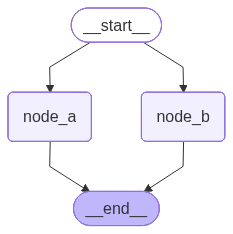
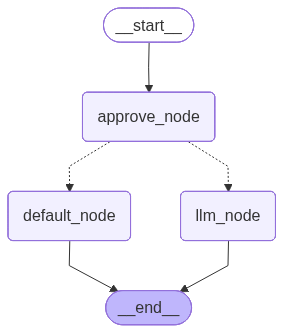
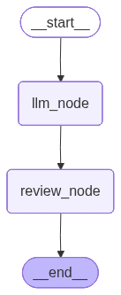

# 8. 中断（上）：动态中断

**`LangGraph`** 提供了两种中断机制：

- **动态中断**：在图的任意节点中调用 **`interrupt()`** 函数实现

  它可以放在代码的任意位置，并且可以根据应用逻辑设置条件触发，所以是**动态**的。

  动态中断提供了人机交互接口，使得调用者可以人为干预计算图的运行，**是业务逻辑的一部分**。

- **静态中断**：在编译或调用状态图时通过 **`interrupt_before`** 和 **`interrupt_after`** 参数设置断点

  它是在运行前确定的，不能根据业务逻辑条件触发，所以是**静态**的。

  静态中断主要用于调试，**不是业务逻辑的一部分**。

## 8.1. 动态中断

### 8.1.1. 概述

**`LangGraph`** 的动态中断机制允许用户在图执行过程中设置暂停点，等待外部输入后再继续执行，提供了人机交互接口。

当中断触发时，**`LangGraph`** 会通过持久化机制保存当前图状态，并无限期等待直到用户恢复执行。

中断通过在任意图节点中调用 **`interrupt()`** 函数实现，该函数可以接收任何可 **`JSON`** 序列化的值，并将该值暴露给调用方。

中断触发后，调用方根据 **`interrupt()`** 暴露的信息生成反馈，重新调用图时通过 **`Command`** 将反馈传递给计算图，恢复图的运行。

恢复运行后，调用方通过 **`Command`** 传递的反馈会作为 **`interrupt()`** 函数的返回值，参与后续计算。

### 8.1.2. 启用中断

1. 配置检查点存储器

2. 设置 **`thread_id`**

   如果要确保中断后可以恢复执行，就需要保存运行图的完整状态，所以必须**启用可恢复执行**。

3. 在需要中断的位置调用 **`interrupt()`**

### 8.1.3. 恢复中断

满足以下要求：

- 基于相同的配置再次调用计算图

- 将输入替换为 **`Command()`** 实例即可恢复运行。

**`LangGraph`** 会从中断节点继续运行，该节点会被再次执行。

通过 **`Command`** 实例的 **`resume`** 属性将用户反馈传递给计算图，中断节点重新运行时，传递给 **`resume`** 属性的值将会作为 **`interrupt()`** 函数的返回值。

### 8.1.4. 常见使用模式

根据中断发生的位置、业务场景以及执行结构，动态中断可以衍生出多种常见的使用模式。本节将介绍以下模式：

1. **基础 HITL 模式**：状态图触发一次中断，获取人类输入后继续执行。
2. **多个并行中断**：多个并行任务分别产生中断，并根据 **中断 `ID`** 接收各自的恢复数据。
3. **审批模式**：根据人类审批（批准、拒绝或其它处理方式），决定后续执行路径。
4. **审核与编辑模式**：将模型生成的内容交给人类检查，并允许人类直接修改后继续处理。
5. **工具执行审批模式**：在调用工具或执行具有副作用的操作之前，由人类确认是否允许执行。
6. **单节点串行中断模式**：在同一个节点内多次触发中断，上一个中断恢复后才能触发下一个。
7. **人类输入验证模式**：对人类输入进行校验；当输入不符合要求时，再次中断并要求重新输入。

需要注意，这些模式并不是完全互斥的。例如，工具执行审批本质上也是审批模式的一种，只是它专门应用于工具调用场景。

#### 8.1.4.1. 基础 **HITL** 模式

##### 8.1.4.1.1. 什么是`HITL`

**`HITL(Human In The Loop)`** 即**人在环**，是一种经典的人机协同设计模式，它允许计算图在运行过程中暂停，等待人工审批、修正意见或补充信息，然后从暂停位置恢复执行。

##### 8.1.4.1.2. 基础`HITL`模式的实现

调用 **`interrupt()`** 可以暂停状态图的执行，并等待外部输入后恢复运行。因此它是实现 **`HITL`** 的核心机制。

不过，仅仅调用 **`interrupt()`** 并不一定构成 **`HITL`**。只有当中断后的决策、输入或修改确实由人类完成时，才能称为 **`HITL`**；如果恢复数据完全由程序自动提供，本质上仍然是普通的中断与恢复机制。

**示例如下**

```python
from typing import TypedDict

from langgraph.graph import StateGraph,START,END
from langgraph.types import interrupt, Command
from langgraph.checkpoint.memory import InMemorySaver


#1. 声明状态
class OverAllState(TypedDict):
    username:str

#2. 声明节点
def node_a(state:OverAllState)->OverAllState:
    username = interrupt("请输入您的姓名")
    return {
        "username":username
    }

#3. 构建图
builder = StateGraph(state_schema=OverAllState)
builder.add_node("node_a",node_a)
builder.add_edge(START,"node_a")
builder.add_edge("node_a",END)

#4. 想要使用中断 => 必须配置检查点
checkpointer = InMemorySaver()
graph = builder.compile(checkpointer=checkpointer)

from IPython.display import display
display(graph)

config = {"configurable":{"thread_id":"123"}}
interrupt_res = graph.invoke({},config=config)
print(interrupt_res)

prompt = interrupt_res['__interrupt__'][0].value
print(prompt)
username = input(prompt)
# 5. 恢复图的中断执行
resume_res = graph.invoke(Command(resume=username),config=config)
print(resume_res)
```

**运行结果如下**


```json
============================== -> interrupt_res <- ==============================

{'__interrupt__': [Interrupt(value='请输入您的姓名', id='3543beca616d469fe1ccd35250ef5acf')]}

============================== -> resumed_res <- ==============================

{'username': '小黄'}
```

#### 8.1.4.2. 多个并行中断

**示例如下**

```python
from typing import TypedDict

from langgraph.graph import StateGraph, START, END
from langgraph.types import Command, interrupt
from langgraph.checkpoint.memory import InMemorySaver

class OverAllState(TypedDict):
    username: str
    age: int

def node_a(state: OverAllState) -> OverAllState:
    username = interrupt("请输入您的姓名")
    return {
        "username": username
    }

def node_b(state: OverAllState) -> OverAllState:
    age = interrupt("请输入您的年龄")
    return {
        "age": age
    }

builder = StateGraph(state_schema=OverAllState)
builder.add_node("node_a", node_a)
builder.add_node("node_b", node_b)
builder.add_edge(START, "node_a")
builder.add_edge(START, "node_b")
builder.add_edge("node_a", END)
builder.add_edge("node_b", END)

checkpointer = InMemorySaver()
graph = builder.compile(checkpointer=checkpointer)

from IPython.display import display
display(graph)

config = {"configurable": {"thread_id": "123"}}
interrupted_res = graph.invoke({}, config=config)
print('=' * 30, '-> interrupt_res <-', '=' * 30)
print(interrupted_res)

# 构建 中断ID -> 恢复指令 的映射
resume_map = {}
for i in interrupted_res['__interrupt__']:
    user_input = input(f"{i.value}: ")
    if "年龄" in i.value:
        resume_map[i.id] = int(user_input)
    else:
        resume_map[i.id] = user_input

resumed_res = graph.invoke(Command(resume=resume_map), config=config)
print('=' * 30, '-> resumed_res <-', '=' * 30)
print(resumed_res)
```

**运行结果如下**



```json
============================== -> interrupt_res <- ==============================

{'__interrupt__': [Interrupt(value='请输入您的年龄', id='2770f00729006c756d481fffa712bb27'), Interrupt(value='请输入您的姓名', id='db7e81e1d4f5cab611f07e0469e99854')]}

============================== -> resumed_res <- ==============================

{'username': '小黄', 'age': 19}
```

#### 8.1.4.3. 审批模式

**示例如下**

```python
from time import sleep
from typing import TypedDict, Literal

from langchain_core.messages import HumanMessage
from langgraph.graph import StateGraph,START,END
from langgraph.types import interrupt, Command
from langgraph.checkpoint.memory import InMemorySaver
from langchain_deepseek import ChatDeepSeek

from dotenv import load_dotenv
load_dotenv(override=True)

model =ChatDeepSeek(
    model="deepseek-v4-flash",
    extra_body={
        "thinking":{
            "type":"disabled"
        }
    }
)

#1. 声明状态
class OverAllState(TypedDict):
    topic:str
    poem:str
    is_approved:bool

#2. 声明节点
def approve_node(state:OverAllState) -> Command[Literal["llm_node","default_node"]]:
    is_approved = interrupt("是否同意调用模型?")
    goto = "llm_node" if is_approved else "default_node"
    return Command(
        goto=goto,
        update={"is_approved":is_approved}
    )

def llm_node(state:OverAllState) -> OverAllState:
    topic = state["topic"]
    res = model.invoke([HumanMessage(content=f"帮我写一首关于{topic}主题的七言绝句,只写诗句,不需要赏析")]).content

    return {
        "poem":res
    }

def default_node(state:OverAllState) -> OverAllState:
    return {
        "poem":"请求被拒绝"
    }

#3. 构建图
builder = StateGraph(state_schema=OverAllState)

builder.add_node("approve_node",approve_node)
builder.add_node("llm_node",llm_node)
builder.add_node("default_node",default_node)
builder.add_edge(START,"approve_node")
builder.add_edge("llm_node",END)
builder.add_edge("default_node",END)

#4. 添加检查点后端
checkpointer = InMemorySaver()
graph = builder.compile(checkpointer=checkpointer)

from IPython.display import display
display(graph)

#5. 首次执行 -> 触发中断
config = {"configurable":{"thread_id":"234"}}
interrupt_res = graph.invoke({"topic":"菊花"},config=config)
print(interrupt_res)
#6. 人工审核
user_approved = input("是否同意调用模型?(y/n)").strip().lower() == 'y'
# 重新调用图
approved_res = graph.invoke(Command(resume=user_approved),config=config)
print(approved_res)

#7. 审核不通过
config1 = {"configurable":{"thread_id":"456"}}
interrupt_res = graph.invoke({"topic":"牡丹花"},config=config1)
print(interrupt_res)

user_approved = input("是否同意调用模型?(y/n)").strip().lower() == 'y'
# 重新调用图
approved_res = graph.invoke(Command(resume=user_approved),config=config1)
print(approved_res)
```

**运行结果如下**



```json
{'topic': '菊花', '__interrupt__': [Interrupt(value='是否同意调用模型?', id='91edf41ecf736a242c18fd61d40ad5b4')]}

{'topic': '菊花', 'poem': '《咏菊》\n西风猎猎卷霜华，独抱秋心隐士家。\n冷艳不争桃李色，寒香偏入野人茶。', 'is_approved': True}

{'topic': '牡丹花', '__interrupt__': [Interrupt(value='是否同意调用模型?', id='47958afc1277b7ce6bf850a5f27f2e46')]}
{'topic': '牡丹花', 'poem': '请求被拒绝', 'is_approved': False}
```

#### 8.1.4.4. 审核与编辑模式

**示例如下**

```python
from typing import TypedDict
from langgraph.graph import StateGraph, START, END
from langgraph.types import Command, interrupt
from langchain.messages import HumanMessage
from langchain_deepseek import ChatDeepSeek
from langgraph.checkpoint.memory import InMemorySaver
from dotenv import load_dotenv
load_dotenv(override=True)

model = ChatDeepSeek(
    model="deepseek-v4-flash",
    extra_body={
        "thinking": {
            "type": "disabled"
        }
    }
)

class OverAllState(TypedDict):
    topic: str
    poem: str
    reviewed_poem: str

def llm_node(state: OverAllState) -> OverAllState:
    topic = state['topic']

    res = model.invoke([HumanMessage(content=f"帮我写一首关于 {topic} 的七言绝句，只给出诗句，不要赏析")]).content
    return {
        "poem": res
    }

def review_node(state: OverAllState) -> OverAllState:
    reviewed_poem = interrupt({
        "instruction": "请审核并修改大模型生成的七言绝句",
        "poem": state['poem']
    })
    return {
        "reviewed_poem": reviewed_poem
    }

builder = StateGraph(state_schema=OverAllState)
builder.add_node("llm_node", llm_node)
builder.add_node("review_node", review_node)
builder.add_edge(START, "llm_node")
builder.add_edge("llm_node", "review_node")
builder.add_edge("review_node", END)

checkpointer = InMemorySaver()
graph = builder.compile(checkpointer=checkpointer)

from IPython.display import display
display(graph)

config = {"configurable": {"thread_id": "review_test"}}
interrupted_res = graph.invoke({"topic": "布偶猫"}, config=config)
print('=' * 30, '-> interrupt_res <-', '=' * 30)
print(interrupted_res)

print("原始诗句：")
print(interrupted_res['__interrupt__'][0].value['poem'])
user_review = input("请审核并修改诗句（直接回车保留原诗）: ")
if not user_review.strip():
    user_review = interrupted_res['__interrupt__'][0].value['poem']
reviewed_res = graph.invoke(Command(resume=user_review), config=config)
print('=' * 30, '-> reviewed_res <-', '=' * 30)
print(reviewed_res)
```

**运行结果如下**



```json
============================== -> interrupt_res <- ==============================

{'topic': '布偶猫', 'poem': '《布偶猫》\n冰眸玉骨雪团身，蓝影衔春卧月轮。\n偶启朱唇呼入梦，云鬟一枕醉红尘。', '__interrupt__': [Interrupt(value={'instruction': '请审核并修改大模型生成的七言绝句', 'poem': '《布偶猫》\n冰眸玉骨雪团身，蓝影衔春卧月轮。\n偶启朱唇呼入梦，云鬟一枕醉红尘。'}, id='de13581234c57fb8b5d9620295b8239e')]}

============================== -> reviewed_res <- ==============================

{'topic': '布偶猫', 'poem': '《布偶猫》\n冰眸玉骨雪团身，蓝影衔春卧月轮。\n偶启朱唇呼入梦，云鬟一枕醉红尘。', 'reviewed_poem': '已审核：《布偶猫》\n冰眸玉骨雪团身，蓝影衔春卧月轮。\n偶启朱唇呼入梦，云鬟一枕醉红尘。'}
```

#### 8.1.4.5. 工具执行审批模式

**示例如下**

```python
from typing import Literal
from langgraph.graph import StateGraph, START, END
from langgraph.types import Command, interrupt
from langgraph.graph.message import MessagesState
from langgraph.checkpoint.memory import InMemorySaver
from langchain.messages import HumanMessage, ToolMessage
from langchain.tools import tool
from langchain_deepseek import ChatDeepSeek

from loguru import logger
from dotenv import load_dotenv
load_dotenv(override=True)

@tool(parse_docstring=True)
def get_weather(city: str) -> str:
    """
    查询指定城市的当日天气

    Args:
        city: 城市名称
    """
    is_approved = interrupt({
        "action": "get_weather",
        "question": "是否同意查询天气？"
    })

    logger.info("is_approved: {}", is_approved)
    if is_approved:
        return f"{city} 今天天气不错"
    else:
        return "用户拒绝查询天气"

tools_by_name = {"get_weather": get_weather}

model = ChatDeepSeek(
    model="deepseek-v4-flash",
    extra_body={
        "thinking": {
            "type": "disabled"
        }
    }
)
model_with_tools = model.bind_tools([get_weather])

def llm_node(state: MessagesState) -> MessagesState:
    messages = state['messages']
    response = model_with_tools.invoke(messages)

    return {
        "messages": [response]
    }

def tool_node(state: MessagesState) -> MessagesState:
    last_msg = state['messages'][-1]

    tool_msgs = []
    for tool_call in last_msg.tool_calls:
        tool = tools_by_name[tool_call["name"]]
        logger.info("工具 {} 被调用, 对应的 tool_call: {}", tool_call["name"], tool_call)
        tool_res = tool.invoke(tool_call["args"])
        tool_msg = ToolMessage(
            name = tool_call["name"],
            content = tool_res,
            tool_call_id = tool_call["id"]
        )
        tool_msgs.append(tool_msg)

    return {
        "messages": tool_msgs
    }

def router(state: MessagesState) -> Literal["tool_node", END]:
    if state['messages'][-1].tool_calls:
        return "tool_node"
    return END

builder = StateGraph(state_schema=MessagesState)
builder.add_node("llm_node", llm_node)
builder.add_node("tool_node", tool_node)
builder.add_edge(START, "llm_node")
builder.add_conditional_edges("llm_node", router, path_map=["tool_node", END])
builder.add_edge("tool_node", "llm_node")

checkpointer = InMemorySaver()
graph = builder.compile(checkpointer=checkpointer)

from IPython.display import display
display(graph)

config = {"configurable": {"thread_id": "tool_test"}}
interrupted_res = graph.invoke({"messages": [HumanMessage("今天北京天气如何？")]}, config=config)
print('=' * 30, '-> interrupt_res <-', '=' * 30)
for msg in interrupted_res['messages']:
    msg.pretty_print()
print('=' * 30, '-> interrupt_info <-', '=' * 30)
print(interrupted_res['__interrupt__'])

user_approved = input("是否同意查询天气？(y/n): ").strip().lower() == 'y'
approved_res = graph.invoke(Command(resume=user_approved), config=config)
print('=' * 30, '-> approved_res <-', '=' * 30)
for msg in approved_res['messages']:
    msg.pretty_print()
```

**运行结果如下**


```json
2026-06-16 14:51:50.662 | INFO     | __main__:tool_node:59 - 工具 get_weather 被调用, 对应的 tool_call: {'name': 'get_weather', 'args': {'city': '北京'}, 'id': 'call_00_EGxsgveRV6mFkXsTtN4H9369', 'type': 'tool_call'}
============================== -> interrupt_res <- ==============================
================================ Human Message =================================

今天北京天气如何？
================================== Ai Message ==================================

好的，我来查询一下今天北京的天气情况。
Tool Calls:
  get_weather (call_00_EGxsgveRV6mFkXsTtN4H9369)
 Call ID: call_00_EGxsgveRV6mFkXsTtN4H9369
  Args:
    city: 北京
============================== -> interrupt_info <- ==============================
[Interrupt(value={'action': 'get_weather', 'question': '是否同意查询天气？'}, id='907128d6bef87a8473833ec0c90589ea')]
2026-06-16 14:51:50.675 | INFO     | __main__:tool_node:59 - 工具 get_weather 被调用, 对应的 tool_call: {'name': 'get_weather', 'args': {'city': '北京'}, 'id': 'call_00_EGxsgveRV6mFkXsTtN4H9369', 'type': 'tool_call'}
2026-06-16 14:51:50.677 | INFO     | __main__:get_weather:27 - is_approved: True
============================== -> approved_res <- ==============================
================================ Human Message =================================

今天北京天气如何？
================================== Ai Message ==================================

好的，我来查询一下今天北京的天气情况。
Tool Calls:
  get_weather (call_00_EGxsgveRV6mFkXsTtN4H9369)
 Call ID: call_00_EGxsgveRV6mFkXsTtN4H9369
  Args:
    city: 北京
================================= Tool Message =================================
Name: get_weather

北京 今天天气不错
================================== Ai Message ==================================

今天北京的天气**不错**哦！☀️ 是个适合出行的好天气。如果需要更详细的天气信息（如温度、风力等），可以随时告诉我，我帮你进一步查询！
```

#### 8.1.4.6. 单节点串行中断模式

**示例如下**

```python
from typing import TypedDict, Literal
from langgraph.graph import StateGraph, START, END
from langgraph.checkpoint.memory import InMemorySaver
from langgraph.types import interrupt, Command

class OverAllState(TypedDict):
    username: str # 姓名
    age: int # 年龄
    gender: Literal["male", "female"] # 性别

def get_info_node(state: OverAllState) -> OverAllState:
    username = interrupt("请输入您的用户名：")
    age = interrupt("请输入您的年龄：")
    gender = interrupt("请输入您的性别：(male/female)")

    return {
        "username": username,
        "age": age,
        "gender": gender
    }

builder = StateGraph(state_schema=OverAllState)
builder.add_node("get_info_node", get_info_node)
builder.add_edge(START, "get_info_node")
builder.add_edge("get_info_node", END)

checkpointer = InMemorySaver()
graph = builder.compile(checkpointer=checkpointer)

config = {"configurable": {"thread_id": "seq_interrupt_test"}}
username_interrupted_res = graph.invoke({}, config=config)
print('=' * 30, '-> username_interrupted_res <-', '=' * 30)
print(username_interrupted_res)

user_name = input("请输入您的用户名：")
age_interrupted_res = graph.invoke(Command(resume=user_name), config=config)
print('=' * 30, '-> age_interrupted_res <-', '=' * 30)
print(age_interrupted_res)

user_age = input("请输入您的年龄：")
gender_interrupted_res = graph.invoke(Command(resume=int(user_age)), config=config)
print('=' * 30, '-> gender_interrupted_res <-', '=' * 30)
print(gender_interrupted_res)

user_gender = input("请输入您的性别：(male/female): ")
resumed_res = graph.invoke(Command(resume=user_gender), config=config)
print('=' * 30, '-> resumed_res <-', '=' * 30)
print(resumed_res)
```

**运行结果如下**

```json
============================== -> username_interrupted_res <- ==============================
{'__interrupt__': [Interrupt(value='请输入您的用户名：', id='0359f8a0b1ca357d2d092d5c55d80ec1')]}
============================== -> age_interrupted_res <- ==============================
{'__interrupt__': [Interrupt(value='请输入您的年龄：', id='0359f8a0b1ca357d2d092d5c55d80ec1')]}
============================== -> gender_interrupted_res <- ==============================
{'__interrupt__': [Interrupt(value='请输入您的性别：(male/female)', id='0359f8a0b1ca357d2d092d5c55d80ec1')]}
============================== -> resumed_res <- ==============================
{'username': '小黄', 'age': 15, 'gender': 'male'}
```

中断恢复时，整个被中断的节点函数都会重新运行。

单个节点中串行地多次调用 **`interrupt()`** 函数时，检查点存储器会记录历史的 **`resume`** 信息，**`LangGraph`** 运行时会读取这些信息，并在 **`interrupt()`** 函数中维护索引，按照节点内调用 **`interrupt()`** 函数的顺序，逐个取出历史 **`resume`** 的值，并将它们作为 **`interrupt()`** 函数的返回值。

所以，已经被恢复的 **`interrupt()`** 不会被重复触发。并且，由此可以推断，我们要保证历史 **`resume`** 可以被正确应用，就应保证中断恢复前后的多次 **`interrupt()`** 相对顺序保持不变。

当历史 **`resume`** 耗尽后，本次恢复运行时传入的 **`resume`** 会作为本次中断的返回值，然后节点函数继续运行。

所有中断都触发并恢复后，计算图正常结束。

### 8.1.5. 使用规范

#### 8.1.5.1. 不要用`try/catch`包裹`interrupt()`调用

中断的触发是通过抛出 **`GraphInterrupt`** 异常实现的，如果用 **`try/catch`** 包裹，则底层运行时无法感知断点，不会中断计算图。

**正确用法**

```python
def node_a(state: State):
    # ✅ 正确用法：先打断点，再处理异常
    interrupt("What's your name?")
    try:
        fetch_data()  # 这一步可能失败
    except Exception as e:
        print(e)
    return state
```

**错误用法**

```python
def node_a(state: State):
    # ❌ 错误用法，用 try/catch 包裹 interrupt()，这将会导致 GraphInterrupt 被捕获而无法触发中断
    try:
        interrupt("What's your name?")
        fetch_data()  # 这一步可能失败
    except Exception as e:
        print(e)
    return state
```

#### 8.1.5.2. 不要更改单个节点内`interrupt`的调用顺序

上文提到：

1. 恢复运行时整个节点函数都会重新运行，而非精确地从断点继续
2. 同一节点中存在多个断点时：历史恢复记录被记录在检查点中，并在恢复运行时按顺序加载

一旦中断恢复前后的断点顺序、数量不完全一致，将会导致语义混乱，程序执行结果无法满足预期。

这条规范就是为了避免这样的情况。

**正确用法**

```python
def node_a(state: State):
    # ✅ 正确用法，断点顺序固定
    name = interrupt("What's your name?")
    age = interrupt("What's your age?")
    city = interrupt("What's your city?")

    return {
        "name": name,
        "age": age,
        "city": city
    }
```

**错误用法**

**1. 可能跳过其中部分断点**

```python
def node_a(state: State):
    # ❌ 错误用法，以状态为条件，可能跳过部分断点
    name = interrupt("What's your name?")

    # 第一次运行到此处时，可能不会触发分支内的断点
    # 恢复时，resume 本应作为 city，但如果分支内断点触发，将被错误地作为 age，导致语义混乱
    if state.get("needs_age"):
        age = interrupt("What's your age?")

    city = interrupt("What's your city?")

    return {"name": name, "city": city}
```

断点以状态为条件，如果中断恢复前后状态发生了变化，断点的顺序和数量可能发生变化，导致语义混乱。

**2. 基于不确定的数据循环，并在其中设置断点**

```python
def node_a(state: State):
    # ❌ 错误用法：基于不确定的数据循环
    # 每次调用时的断点数量可能不同
    results = []
    for item in state.get("dynamic_list", []):  # List might change between runs
        result = interrupt(f"Approve {item}?")
        results.append(result)

    return {"results": results}
```

基于状态中可变的值循环，并在循环中设置断点，如果中断恢复前后状态发生变化，断点数量可能变化，导致语义混乱。

#### 8.1.5.3. 不要在`interrupt()`中传递复杂类型

**`LangGraph`** 运行时会将 **`interrupt()`** 函数接收到的参数经过 **`JSON` 序列化** 之后传递给调用者。

如果传递不支持 **`JSON` 序列化** 的复杂类型，如函数，将会抛出异常，如下所示

```json
TypeError: Type is not msgpack serializable: Interrupt
```

**正确用法**

**1. 简单类型**

```python
def node_a(state: State):
    # ✅ 正确用法：传递可以序列化的简单类型数据
    name = interrupt("What's your name?")
    count = interrupt(42)
    approved = interrupt(True)

    return {"name": name, "count": count, "approved": approved}
```

**2. 结构化数据**

```python
def node_a(state: State):
    # ✅ 正确用法：传递仅包含基本数据类型的可序列化字典
    response = interrupt({
        "question": "Enter user details",
        "fields": ["name", "email", "age"],
        "current_values": state.get("user", {})
    })

    return {"user": response}
```

**错误用法**

**1. 函数**

```python
def validate_input(value):
    return len(value) > 0

def node_a(state: State):
    # ❌ 错误用法：传递函数
    # 函数不支持 JSON 序列化
    response = interrupt({
        "question": "What's your name?",
        "validator": validate_input  # 此处会导致失败
    })
    return {"name": response}
```

**2. 类的实例**

```python
class DataProcessor:
    def __init__(self, config):
        self.config = config

def node_a(state: State):
    processor = DataProcessor({"mode": "strict"})

    # ❌ 错误用法：传递类的实例
    # 此处的自定义实例不支持 JSON 序列化
    response = interrupt({
        "question": "Enter data to process",
        "processor": processor  # 这将会导致失败
    })
    return {"result": response}
```

#### 8.1.5.4. 断点之前的副作用操作必须是幂等的

- **副作用操作**：修改了外部环境的操作，如
  - 写数据库
  - 写文件
  - 发送邮件或消息
- **幂等性**：多次执行的结果等价于一次执行。

我们知道，中断恢复时，断点所在的函数会被重复执行，所以，如果断点之前存在不满足幂等性的副作用操作，将会导致多次调用结果不一致。

如：写数据操作不满足幂等性，可能导致写入多条重复记录。

**正确用法**

**1. 在断点之前使用满足幂等性的操作**

```python
def node_a(state: State):
    # ✅ 正确用法：使用幂等的 upsert 操作
    # 多次运行结果一致
    db.upsert_user(
        user_id=state["user_id"],
        status="pending_approval"
    )

    approved = interrupt("Approve this change?")

    return {"approved": approved}
```

**`upsert`** 的语义是：**写入或更新**，如果有相同记录则覆盖更新，否则新增。满足幂等性。

**2. 将副作用操作放在断点之后**

```python
def node_a(state: State):
    # ✅ 正确用法：将副作用操作放在断点之后
    # 确保副作用操作只运行一次
    approved = interrupt("Approve this change?")

    if approved:
        db.create_audit_log(
            user_id=state["user_id"],
            action="approved"
        )

    return {"approved": approved}
```

上述代码将副作用操作置于断点之后，之后中断触发并恢复运行之后，副作用操作才会被执行，后者只会被执行一次。

**3. 将副作用操作和断点置于不同的节点**

```python
def approval_node(state: State):
    # ✅ 正确用法：当前节点只做中断
    approved = interrupt("Approve this change?")

    return {"approved": approved}

def notification_node(state: State):
    # ✅ 正确用法：副作用操作发生在独立的节点中
    # 当前节点独立于中断，所以副作用操作，不会因为中断恢复而重复执行
    if (state.approved):
        send_notification(
            user_id=state["user_id"],
            status="approved"
        )

    return state
```

这种方式更彻底，将中断和副作用操作完全隔离。

**错误用法**

**1. 在断点之前向数据库中新增数据**

```python
def node_a(state: State):
    # ❌ 错误用法：在断点之前向数据库中新增数据
    # 中断恢复会导致数据重复
    audit_id = db.create_audit_log({
        "user_id": state["user_id"],
        "action": "pending_approval",
        "timestamp": datetime.now()
    })

    approved = interrupt("Approve this change?")

    return {"approved": approved, "audit_id": audit_id}
```

**2. 将数据追加到已存在的列表**

```python
def node_a(state: State):
    # ❌ 错误用法：在断点之前向列表追加数据
    # 这将会在中断恢复时导致列表数据重复
    db.append_to_history(state["user_id"], "approval_requested")

    approved = interrupt("Approve this change?")

    return {"approved": approved}
```

### 8.1.6. 中断触发和恢复前后的检查点

#### 8.1.6.1. 基础`HITL`模式

##### 8.1.6.1.1. 示例代码

```python
from typing import TypedDict

from langgraph.graph import StateGraph, START, END
from langgraph.types import Command, interrupt
from langgraph.checkpoint.memory import InMemorySaver

class OverAllState(TypedDict):
    username: str
    age: int

def node_a(state: OverAllState) -> OverAllState:
    username = interrupt("请输入您的姓名")
    age = interrupt("请输入您的年龄")
    return {
        "username": username,
        "age": age
    }

builder = StateGraph(state_schema=OverAllState)
builder.add_node("node_a", node_a)
builder.add_edge(START, "node_a")
builder.add_edge("node_a", END)

checkpointer = InMemorySaver()
graph = builder.compile(checkpointer=checkpointer)

config = {"configurable": {"thread_id": "123"}}
username_interrupted_res = graph.invoke({}, config=config)
print('=' * 30, '-> username_interrupted_res <-', '=' * 30)
print(username_interrupted_res)
username_interrupted_his = list(graph.get_state_history(config=config))
print('=' * 30, '-> username_interrupted_his <-', '=' * 30)
print(username_interrupted_his)

age_interrupted_res = graph.invoke(Command(resume="小黄"), config=config)
print('=' * 30, '-> age_interrupted_res <-', '=' * 30)
print(age_interrupted_res)
age_interrupted_his = list(graph.get_state_history(config=config))
print('=' * 30, '-> age_interrupted_his <-', '=' * 30)
print(age_interrupted_his)

resumed_res = graph.invoke(Command(resume=123), config=config)
print('=' * 30, '-> resumed_res <-', '=' * 30)
print(resumed_res)
resumed_his = list(graph.get_state_history(config=config))
print('=' * 30, '-> resumed_his <-', '=' * 30)
print(resumed_his)
```

##### 8.1.6.1.2. 运行结果分析

###### 8.1.6.1.2.1. 第一次中断

**调用结果**

```json
============================== -> username_interrupted_res <- ==============================
{'__interrupt__': [Interrupt(value='请输入您的姓名', id='488d1fa95a4053d41ab09786f5260ae9')]}
```

**历史检查点**

```json
============================== -> username_interrupted_his <- ==============================
[
    StateSnapshot(
        values={},
        next=('node_a',),
        config={
            'configurable': {
                'thread_id': '123',
                'checkpoint_ns': '',
                'checkpoint_id': '1f16a255-4aa0-631a-8000-12a45e5b02a0'
            }
        },
        metadata={
            'source': 'loop',
            'step': 0,
            'parents': {}
        },
        created_at='2026-06-17T08:19:59.195818+00:00',
        parent_config={
            'configurable': {
                'thread_id': '123',
                'checkpoint_ns': '',
                'checkpoint_id': '1f16a255-4a9d-68e8-bfff-3573d795ed80'
            }
        },
        tasks=(
            PregelTask(
                id='a7e05e86-30c1-a590-a7bf-e3542eb53d4b',
                name='node_a',
                path=('__pregel_pull', 'node_a'),
                error=None,
                interrupts=(
                    Interrupt(
                        value='请输入您的姓名',
                        id='488d1fa95a4053d41ab09786f5260ae9'
                    ),
                ),
                state=None,
                result=None
            ),
        ),
        interrupts=(
            Interrupt(
                value='请输入您的姓名',
                id='488d1fa95a4053d41ab09786f5260ae9'
            ),
        )
    ),

    StateSnapshot(
        values={},
        next=('__start__',),
        config={
            'configurable': {
                'thread_id': '123',
                'checkpoint_ns': '',
                'checkpoint_id': '1f16a255-4a9d-68e8-bfff-3573d795ed80'
            }
        },
        metadata={
            'source': 'input',
            'step': -1,
            'parents': {}
        },
        created_at='2026-06-17T08:19:59.194743+00:00',
        parent_config=None,
        tasks=(
            PregelTask(
                id='173d6621-cd7b-3edd-a3d5-8d1c3bb8dc53',
                name='__start__',
                path=('__pregel_pull', '__start__'),
                error=None,
                interrupts=(),
                state=None,
                result={}
            ),
        ),
        interrupts=()
    )
]
```

当前工作流只有一个节点，所以只有一个真正执行用户自定义节点的超步，对应的超步编号为 **`1`**

中断触发时，检查点存储器中记录的最新检查点超步为 **`0`**，中断信息只能和这个超步绑定

中断信息存了两份：

- **`StateSnapshot`** 的 **`tasks`** 属性下记录的 **`PregelTask`** 实例的 **`interrupts`** 字段记录了当前任务触发的中断信息。

- **`StateSnapshot`** 的 **`interrupts`** 属性记录了当前超步发生的所有中断

当存在多个并行中断时

- 中断信息被记录在各自所属任务的 **`PregelTask`** 实例中
- 同时也会被汇总在 **`StateSnapshot`** 的 **`tasks`** 属性中

###### 8.1.6.1.2.2. 第一次恢复

**调用结果**

```json
============================== -> age_interrupted_res <- ==============================
{'__interrupt__': [Interrupt(value='请输入您的年龄', id='488d1fa95a4053d41ab09786f5260ae9')]}
```

**历史检查点**

```json
============================== -> age_interrupted_his <- ==============================

[
    StateSnapshot(
        values={},
        next=('node_a',),
        config={
            'configurable': {
                'thread_id': '123',
                'checkpoint_ns': '',
                'checkpoint_id': '1f16a255-4aa0-631a-8000-12a45e5b02a0'
            }
        },
        metadata={
            'source': 'loop',
            'step': 0,
            'parents': {}
        },
        created_at='2026-06-17T08:19:59.195818+00:00',
        parent_config={
            'configurable': {
                'thread_id': '123',
                'checkpoint_ns': '',
                'checkpoint_id': '1f16a255-4a9d-68e8-bfff-3573d795ed80'
            }
        },
        tasks=(
            PregelTask(
                id='a7e05e86-30c1-a590-a7bf-e3542eb53d4b',
                name='node_a',
                path=('__pregel_pull', 'node_a'),
                error=None,
                interrupts=(
                    Interrupt(
                        value='请输入您的年龄',
                        id='488d1fa95a4053d41ab09786f5260ae9'
                    ),
                ),
                state=None,
                result={}
            ),
        ),
        interrupts=(
            Interrupt(
                value='请输入您的年龄',
                id='488d1fa95a4053d41ab09786f5260ae9'
            ),
        )
    ),

    StateSnapshot(
        values={},
        next=('__start__',),
        config={
            'configurable': {
                'thread_id': '123',
                'checkpoint_ns': '',
                'checkpoint_id': '1f16a255-4a9d-68e8-bfff-3573d795ed80'
            }
        },
        metadata={
            'source': 'input',
            'step': -1,
            'parents': {}
        },
        created_at='2026-06-17T08:19:59.194743+00:00',
        parent_config=None,
        tasks=(
            PregelTask(
                id='173d6621-cd7b-3edd-a3d5-8d1c3bb8dc53',
                name='__start__',
                path=('__pregel_pull', '__start__'),
                error=None,
                interrupts=(),
                state=None,
                result={}
            ),
        ),
        interrupts=()
    )
]
```

**`checkpoint_id`、任务`id`、中断`id`** 和历史检查点完全一致，只是 **`Interrupt`** 实例的 **`value`** 属性变成了第二次中断的值。

由此可见，恢复运行时检查点的更新确实是覆盖写入，历史中断信息不会被保留。

并且，中断恢复时传递的 **`resume`** 在 **`graph.get_state_history()`** 时也不可见。

###### 8.1.6.1.2.3. 第二次恢复

**调用结果**

```json
============================== -> resumed_res <- ==============================
{'username': '小黄', 'age': 123}
```

**历史检查点**

```json
============================== -> resumed_his <- ==============================

[
    StateSnapshot(
        values={
            'username': '小黄',
            'age': 123
        },
        next=(),
        config={
            'configurable': {
                'thread_id': '123',
                'checkpoint_ns': '',
                'checkpoint_id': '1f16a255-4ab5-60bc-8001-df8746dc9400'
            }
        },
        metadata={
            'source': 'loop',
            'step': 1,
            'parents': {}
        },
        created_at='2026-06-17T08:19:59.204348+00:00',
        parent_config={
            'configurable': {
                'thread_id': '123',
                'checkpoint_ns': '',
                'checkpoint_id': '1f16a255-4aa0-631a-8000-12a45e5b02a0'
            }
        },
        tasks=(),
        interrupts=()
    ),

    StateSnapshot(
        values={},
        next=('node_a',),
        config={
            'configurable': {
                'thread_id': '123',
                'checkpoint_ns': '',
                'checkpoint_id': '1f16a255-4aa0-631a-8000-12a45e5b02a0'
            }
        },
        metadata={
            'source': 'loop',
            'step': 0,
            'parents': {}
        },
        created_at='2026-06-17T08:19:59.195818+00:00',
        parent_config={
            'configurable': {
                'thread_id': '123',
                'checkpoint_ns': '',
                'checkpoint_id': '1f16a255-4a9d-68e8-bfff-3573d795ed80'
            }
        },
        tasks=(
            PregelTask(
                id='a7e05e86-30c1-a590-a7bf-e3542eb53d4b',
                name='node_a',
                path=('__pregel_pull', 'node_a'),
                error=None,
                interrupts=(
                    Interrupt(
                        value='请输入您的年龄',
                        id='488d1fa95a4053d41ab09786f5260ae9'
                    ),
                ),
                state=None,
                result={
                    'username': '小黄',
                    'age': 123
                }
            ),
        ),
        interrupts=(
            Interrupt(
                value='请输入您的年龄',
                id='488d1fa95a4053d41ab09786f5260ae9'
            ),
        )
    ),

    StateSnapshot(
        values={},
        next=('__start__',),
        config={
            'configurable': {
                'thread_id': '123',
                'checkpoint_ns': '',
                'checkpoint_id': '1f16a255-4a9d-68e8-bfff-3573d795ed80'
            }
        },
        metadata={
            'source': 'input',
            'step': -1,
            'parents': {}
        },
        created_at='2026-06-17T08:19:59.194743+00:00',
        parent_config=None,
        tasks=(
            PregelTask(
                id='173d6621-cd7b-3edd-a3d5-8d1c3bb8dc53',
                name='__start__',
                path=('__pregel_pull', '__start__'),
                error=None,
                interrupts=(),
                state=None,
                result={}
            ),
        ),
        interrupts=()
    )
]
```

两个断点全部恢复运行后，编号为 **`1`** 的超步终于完成，任务实例的 **`result`** 被更新，状态被更新，最后一个超步的 **`values`** 是更新后的状态值，计算图运行完成。

#### 8.1.6.2. 多个并行中断触发时的检查点

##### 8.1.6.2.1. 示例代码

```python
from typing import TypedDict

from langgraph.graph import StateGraph, START, END
from langgraph.types import Command, interrupt
from langgraph.checkpoint.memory import InMemorySaver

class OverAllState(TypedDict):
    username: str
    age: int

def node_a(state: OverAllState) -> OverAllState:
    username = interrupt("请输入您的姓名")
    return {
        "username": username
    }

def node_b(state: OverAllState) -> OverAllState:
    age = interrupt("请输入您的年龄")
    return {
        "age": age
    }

builder = StateGraph(state_schema=OverAllState)
builder.add_node("node_a", node_a)
builder.add_node("node_b", node_b)
builder.add_edge(START, "node_a")
builder.add_edge(START, "node_b")
builder.add_edge("node_a", END)
builder.add_edge("node_b", END)

checkpointer = InMemorySaver()
graph = builder.compile(checkpointer=checkpointer)

from IPython.display import display
display(graph)

config = {"configurable": {"thread_id": "123"}}
interrupted_res = graph.invoke({}, config=config)
print('=' * 30, '-> interrupt_res <-', '=' * 30)
print(interrupted_res)

list(graph.get_state_history(config=config))

# 6. 恢复执行
resume_map = {}
for i in interrupted_res['__interrupt__']:
    user_input = input(f"{i.value}:")
    if "年龄" in i.value:
        resume_map[i.id] = int(user_input)
    else:
        resume_map[i.id] = user_input

resumed_res = graph.invoke(Command(resume=resume_map),config=config)
print(resumed_res)

list(graph.get_state_history(config=config))
```

##### 8.1.6.2.2. 结果分析


**计算图返回值**

```python
============================== -> interrupt_res <- ==============================

{
    '__interrupt__': [
        Interrupt(
            value='请输入您的姓名',
            id='0cae1932a74087f02711c6f1677b4b17'
        ),
        Interrupt(
            value='请输入您的年龄',
            id='cd216e1ad6907c2432636ff5f32cfcf3'
        )
    ]
}
```

同一个超步中并行触发的中断信息被放在列表中返回。

**历史检查点列表**

```python
[
    StateSnapshot(
        values={},

        next=(
            'node_a',
            'node_b'
        ),

        config={
            'configurable': {
                'thread_id': '123',
                'checkpoint_ns': '',
                'checkpoint_id': '1f16a329-8b50-69e0-8000-7bdce1ba7379'
            }
        },

        metadata={
            'source': 'loop',
            'step': 0,
            'parents': {}
        },

        created_at='2026-06-17T09:54:56.810630+00:00',

        parent_config={
            'configurable': {
                'thread_id': '123',
                'checkpoint_ns': '',
                'checkpoint_id': '1f16a329-8b4e-6085-bfff-3100dea319cc'
            }
        },

        tasks=(
            PregelTask(
                id='689d8040-4b34-02a2-eb32-d901bbb3c67c',
                name='node_a',
                path=(
                    '__pregel_pull',
                    'node_a'
                ),
                error=None,
                interrupts=(
                    Interrupt(
                        value='请输入您的姓名',
                        id='0cae1932a74087f02711c6f1677b4b17'
                    ),
                ),
                state=None,
                result=None
            ),

            PregelTask(
                id='034cbe3c-e0a6-025a-ce03-46436ce38fc3',
                name='node_b',
                path=(
                    '__pregel_pull',
                    'node_b'
                ),
                error=None,
                interrupts=(
                    Interrupt(
                        value='请输入您的年龄',
                        id='cd216e1ad6907c2432636ff5f32cfcf3'
                    ),
                ),
                state=None,
                result=None
            )
        ),

        interrupts=(
            Interrupt(
                value='请输入您的姓名',
                id='0cae1932a74087f02711c6f1677b4b17'
            ),
            Interrupt(
                value='请输入您的年龄',
                id='cd216e1ad6907c2432636ff5f32cfcf3'
            )
        )
    ),


    StateSnapshot(
        values={},

        next=(
            '__start__',
        ),

        config={
            'configurable': {
                'thread_id': '123',
                'checkpoint_ns': '',
                'checkpoint_id': '1f16a329-8b4e-6085-bfff-3100dea319cc'
            }
        },

        metadata={
            'source': 'input',
            'step': -1,
            'parents': {}
        },

        created_at='2026-06-17T09:54:56.809574+00:00',

        parent_config=None,

        tasks=(
            PregelTask(
                id='3df213dc-5fa0-a8aa-b1dc-428da9010be6',
                name='__start__',
                path=(
                    '__pregel_pull',
                    '__start__'
                ),
                error=None,
                interrupts=(),
                state=None,
                result={}
            ),
        ),

        interrupts=()
    )
]
```

如前所述，编号为 **`1`** 的超步执行时中断触发，此时检查点后端中存储的最新的超步编号为 **`0`**，因此中断信息记录在超步 **`0`** 的 **`StateSnapshot`** 实例中。

- 快照实例的 **`interrupts`** 属性记录了并行触发的两个中断的信息。

- 并且，各自的中断信息被记录在对应的任务实例中。

#### 8.1.6.3. 同一超步部分任务触发中断时的检查点

##### 8.1.6.3.1. 示例代码

```python
from typing import TypedDict

from langgraph.graph import StateGraph, START, END
from langgraph.types import Command, interrupt
from langgraph.checkpoint.memory import InMemorySaver

class OverAllState(TypedDict):
    username: str
    age: int

def node_a(state: OverAllState) -> OverAllState:
    username = interrupt("请输入您的姓名")
    return {
        "username": username
    }

def node_b(state: OverAllState) -> OverAllState:
    age = 12
    return {
        "age": age
    }

builder = StateGraph(state_schema=OverAllState)
builder.add_node("node_a", node_a)
builder.add_node("node_b", node_b)
builder.add_edge(START, "node_a")
builder.add_edge(START, "node_b")
builder.add_edge("node_a", END)
builder.add_edge("node_b", END)

checkpointer = InMemorySaver()
graph = builder.compile(checkpointer=checkpointer)

from IPython.display import display
display(graph)

config = {"configurable": {"thread_id": "123"}}
interrupted_res = graph.invoke({}, config=config)
print('=' * 30, '-> interrupt_res <-', '=' * 30)
print(interrupted_res)

list(graph.get_state_history(config=config))
```

##### 8.1.6.3.2. 结果分析


**计算图返回值**

```python
============================== -> interrupt_res <- ==============================

{
    'age': 12,
    '__interrupt__': [
        Interrupt(
            value='请输入您的姓名',
            id='bbff88193340fd0ed196be702608e385'
        )
    ]
}
```

**历史检查点列表**

```python
============================== -> state_history <- ==============================

[
    StateSnapshot(
        values={},
        next=(
            'node_a',
            'node_b'
        ),
        config={
            'configurable': {
                'thread_id': '123',
                'checkpoint_ns': '',
                'checkpoint_id': '1f16a32c-b47b-6ca9-8000-79ee3c65e7ce'
            }
        },
        metadata={
            'source': 'loop',
            'step': 0,
            'parents': {}
        },
        created_at='2026-06-17T09:56:21.658113+00:00',
        parent_config={
            'configurable': {
                'thread_id': '123',
                'checkpoint_ns': '',
                'checkpoint_id': '1f16a32c-b479-6766-bfff-901ed37f684d'
            }
        },
        tasks=(
            PregelTask(
                id='e16690fc-c0f8-e9fc-e30d-706a64f24209',
                name='node_a',
                path=(
                    '__pregel_pull',
                    'node_a'
                ),
                error=None,
                interrupts=(
                    Interrupt(
                        value='请输入您的姓名',
                        id='bbff88193340fd0ed196be702608e385'
                    ),
                ),
                state=None,
                result=None
            ),
            PregelTask(
                id='b628264b-d4ca-c09f-5197-6eb1c953b947',
                name='node_b',
                path=(
                    '__pregel_pull',
                    'node_b'
                ),
                error=None,
                interrupts=(),
                state=None,
                result={
                    'age': 12
                }
            )
        ),
        interrupts=(
            Interrupt(
                value='请输入您的姓名',
                id='bbff88193340fd0ed196be702608e385'
            ),
        )
    ),

    StateSnapshot(
        values={},
        next=(
            '__start__',
        ),
        config={
            'configurable': {
                'thread_id': '123',
                'checkpoint_ns': '',
                'checkpoint_id': '1f16a32c-b479-6766-bfff-901ed37f684d'
            }
        },
        metadata={
            'source': 'input',
            'step': -1,
            'parents': {}
        },
        created_at='2026-06-17T09:56:21.657164+00:00',
        parent_config=None,
        tasks=(
            PregelTask(
                id='5dc4ad26-1baa-7c18-2580-153a19d4c175',
                name='__start__',
                path=(
                    '__pregel_pull',
                    '__start__'
                ),
                error=None,
                interrupts=(),
                state=None,
                result={}
            ),
        ),
        interrupts=()
    )
]
```

由上可知，同一个超步中：

- 发生中断的任务，其中断信息被记录在任务实例和快照的 **`interrupts`** 字段中

- 未触发中断的任务正常结束，其结果被记录在任务实例的 **`result`** 字段中

底层负责执行节点逻辑的是超步的第二阶段，如果存在多个并行任务，则会将任务提交到线程池，在独立的线程中运行，负责执行第二阶段的 **`PregelRunner`** 实例会收集提交后的 **`future`** 对象，并等待所有任务完成。

当中断触发时，对应的线程会抛出 **`GraphInterrupt`**，对应的 **`future`** 对象会收集异常。

**`PregelRunner`** 实例在 **`future`** 对应的任务完成后，收集中断信息或任务执行结果，写入检查点存储器。

所以一个超步中某个任务触发中断，不会导致其它并行任务的终止，正常运行的任务结果、中断任务的中断信息都被记录在检查点后端。
