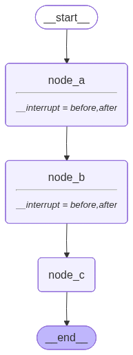
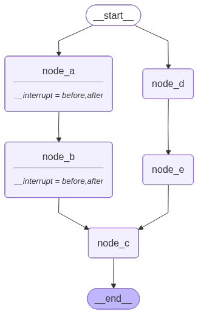
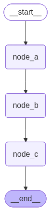

# 8. 中断（下）：静态断点

## 8.2. 静态断点

**`LangGraph`** 提供了用于调试的 **静态断点**。

它是在状态图编译或调用时设置的，不会在运行时动态触发，不属于业务逻辑，所以称为 **静态** 断点。

动态断点提供了接收人类反馈的接口，而静态断点只是暂停计算图的运行，不能向调用者传递信息，也不能接收调用者的反馈。

### 8.2.1. 用法说明

1. 静态断点也需要基于检查点恢复，所以必须配置检查点，启用可恢复运行机制。

2. 计算图会在 **`interrupt_before`** 指定的节点执行之前产生中断，暂停计算

3. 计算图会在 **`interrupt_after`** 指定的节点执行之后产生中断，暂停计算

4. 计算图运行到断点位置会中断，和动态断点不同的是，它会在超步边界而非内部中断。

   断点前的超步：三个阶段全部完成；断点后的超步：三个阶段都没有开始。

5. 静态断点不会返回任何中断信息，只会将当前最新的状态返回。

   因此，我们可以用静态断点查看每个超步边界的中间状态。

6. 传入相同的配置并将 **`None`** 作为输入，再次调用计算图，会从断点位置继续运行。

7. 支持在两个阶段设置静态断点

   - 状态图编译时

     ```python
     graph = builder.compile(
         checkpointer=checkpointer,
         interrupt_before=["node_a", "node_b"],
         interrupt_after=["node_a", "node_b"]
     )
     ```

   - 计算图调用时

     ```python
     first_res = graph.invoke(
         {},
         config=config,
         interrupt_before=["node_a", "node_b"],
         interrupt_after=["node_a", "node_b"]
     )
     ```

   断点都是在运行时生效，计算图调用时设置的断点优先级更高。

   如果调用时传入的断点列表不为空，则会覆盖编译时配置。

### 8.2.2. 底层原理

1. 编译时设置的静态断点保存在编译图的 **`interrupt_before_nodes`** 和 **`interrupt_after_nodes`** 中。

   运行时采用调用参数优先、编译配置兜底的规则。

   调用时传入非空节点列表会完全覆盖编译配置，而 **`None`** 或空列表会回退到编译配置。

2. **`interrupt_before`** 在超步的第一阶段：当前超步的任务列表计算完成后、节点任务开始执行前进行检查。

   - 如果检查点中的状态和上一次静态断点或图的初始状态相比，产生了变化
   - 并且当前超步的任务列表和 **`interrupt_before`** 列表存在交集

   则抛出 **`GraphInterrupt`**。

3. **`interrupt_after`** 在超步的第三阶段：当前超步的任务全部执行完成、写入应用到通道并创建检查点之后进行检查。

   - 如果检查点中的状态和上一次静态断点或图的初始状态相比，产生了变化
   - 并且当前超步的任务列表和 **`interrupt_after`** 列表存在交集

   则抛出 **`GraphInterrupt`**。

4. 如果存在这样的拓扑图

   ```python
   node_a -> node_b
   ```

   那么在 **`node_a` 之后** 和 **`node_b` 之前** 设置断点只会中断一次。

   因为二者对应同一个超步边界，如果同时配置：

   - **`node_a`** 的 **`after`** 先触发；

   - 恢复运行时检查点中记录的上次断点可见状态会被更新，和最新状态保持一致

   - 而产生中断之前已经保存了检查点，恢复运行时会从 **`node_b`** 的超步开始
   - **`node_b`** 的超步第一阶段，检查点和上次静态断点相比，没有变化，所以不会中断
   - 因此，**`node_a` 之后** 和 **`node_b` 之前** 设置断点只会中断一次

### 8.2.3. 示例

#### 8.2.3.1. 编译时设置断点

##### 8.2.3.1.1. 顺序结构设置断点

**示例如下**

```python
from typing import TypedDict
from langgraph.graph import StateGraph, START, END
from langgraph.checkpoint.memory import InMemorySaver

from loguru import logger

class OverAllState(TypedDict):
    final_res: str

def node_a(state: OverAllState) -> OverAllState:
    logger.info("node_a 被执行")
    return {
        "final_res": "node_a 运行的中间结果"
    }

def node_b(state: OverAllState) -> OverAllState:
    logger.info("node_b 被执行")
    return {
        "final_res": "node_b 运行的中间结果"
    }

def node_c(state: OverAllState) -> OverAllState:
    logger.info("node_c 被执行")
    return {
        "final_res": "node_c 运行的中间结果"
    }


builder = StateGraph(state_schema=OverAllState)
builder.add_node("node_a", node_a)
builder.add_node("node_b", node_b)
builder.add_node("node_c", node_c)

builder.add_edge(START, "node_a")
builder.add_edge("node_a", "node_b")
builder.add_edge("node_b", "node_c")
builder.add_edge("node_c", END)

checkpointer = InMemorySaver()
graph = builder.compile(
    checkpointer=checkpointer,
    interrupt_before=["node_a", "node_b"],
    interrupt_after=["node_a", "node_b"]
)

from IPython.display import display
display(graph)

config = {"configurable": {"thread_id": "123"}}

logger.info("{}-> 第一次执行 <-{}", "=" * 10, "=" * 10)
first_res = graph.invoke({}, config=config)
logger.info("第一次执行结果：{}", first_res)

logger.info("{}-> 第二次执行 <-{}", "=" * 10, "=" * 10)
second_res = graph.invoke(None, config=config)
logger.info("第二次执行结果：{}", second_res)

logger.info("{}-> 第三次执行 <-{}", "=" * 10, "=" * 10)
third_res = graph.invoke(None, config=config)
logger.info("第三次执行结果：{}", third_res)

logger.info("{}-> 第四次执行 <-{}", "=" * 10, "=" * 10)
final_res = graph.invoke(None, config=config)
logger.info("第四次执行结果：{}", final_res)

logger.info("{}-> 完毕 <-{}", "=" * 10, "=" * 10)
```

**运行结果如下**



编译时设置的断点在渲染拓扑结构时被感知，图中对应结点新增了断点标记：

```python
__interrupt = before,after
```

这表示该节点之前和之后都设置了断点。

**日志如下**

```json
2026-06-18 11:22:52.094 | INFO     | __main__:<module>:51 - ==========-> 第一次执行 <-==========
2026-06-18 11:22:52.100 | INFO     | __main__:<module>:53 - 第一次执行结果：None
2026-06-18 11:22:52.100 | INFO     | __main__:<module>:55 - ==========-> 第二次执行 <-==========
2026-06-18 11:22:52.102 | INFO     | __main__:node_a:11 - node_a 被执行
2026-06-18 11:22:52.104 | INFO     | __main__:<module>:57 - 第二次执行结果：{'final_res': 'node_a 运行的中间结果'}
2026-06-18 11:22:52.104 | INFO     | __main__:<module>:59 - ==========-> 第三次执行 <-==========
2026-06-18 11:22:52.105 | INFO     | __main__:node_b:17 - node_b 被执行
2026-06-18 11:22:52.107 | INFO     | __main__:<module>:61 - 第三次执行结果：{'final_res': 'node_b 运行的中间结果'}
2026-06-18 11:22:52.107 | INFO     | __main__:<module>:63 - ==========-> 第四次执行 <-==========
2026-06-18 11:22:52.108 | INFO     | __main__:node_c:23 - node_c 被执行
2026-06-18 11:22:52.110 | INFO     | __main__:<module>:65 - 第四次执行结果：{'final_res': 'node_c 运行的中间结果'}
2026-06-18 11:22:52.111 | INFO     | __main__:<module>:67 - ==========-> 完毕 <-==========
```

由日志可知，**`node_a`** 和 **`node_b`** 之间只产生了一次中断，和分析相符。

##### 8.2.3.1.2. 存在并行节点时设置断点

为了确定断点是 **以节点** 为边界还是 **以超步** 为边界设置的，我们在存在并行节点的计算图中测试

**示例如下**

```python
from typing import TypedDict
from langgraph.graph import StateGraph, START, END
from langgraph.checkpoint.memory import InMemorySaver

from loguru import logger

class OverAllState(TypedDict):
    final_res: str

def node_a(state: OverAllState) -> OverAllState:
    logger.info("node_a 被执行")
    return {
        "final_res": "node_a 运行的中间结果"
    }

def node_b(state: OverAllState) -> OverAllState:
    logger.info("node_b 被执行")
    return {
        "final_res": "node_b 运行的中间结果"
    }

def node_c(state: OverAllState) -> OverAllState:
    logger.info("node_c 被执行")
    return {
        "final_res": "node_c 运行的中间结果"
    }

def node_d(state: OverAllState) -> OverAllState:
    logger.info("node_d 被执行")
    return {}

def node_e(state: OverAllState) -> OverAllState:
    logger.info("node_e 被执行")
    return {}

builder = StateGraph(state_schema=OverAllState)
builder.add_node("node_a", node_a)
builder.add_node("node_b", node_b)
builder.add_node("node_c", node_c)
builder.add_node("node_d", node_d)
builder.add_node("node_e", node_e)

builder.add_edge(START, "node_a")
builder.add_edge(START, "node_d")
builder.add_edge("node_a", "node_b")
builder.add_edge("node_d", "node_e")
builder.add_edge(["node_b", "node_e"], "node_c")
builder.add_edge("node_c", END)

checkpointer = InMemorySaver()
graph = builder.compile(
    checkpointer=checkpointer,
    interrupt_before=["node_a", "node_b"],
    interrupt_after=["node_a", "node_b"]
)

from IPython.display import display
display(graph)

config = {"configurable": {"thread_id": "123"}}

logger.info("{}-> 第一次执行 <-{}", "=" * 10, "=" * 10)
first_res = graph.invoke({}, config=config)
logger.info("第一次执行结果：{}", first_res)

logger.info("{}-> 第二次执行 <-{}", "=" * 10, "=" * 10)
second_res = graph.invoke(None, config=config)
logger.info("第二次执行结果：{}", second_res)

logger.info("{}-> 第三次执行 <-{}", "=" * 10, "=" * 10)
third_res = graph.invoke(None, config=config)
logger.info("第三次执行结果：{}", third_res)

logger.info("{}-> 第四次执行 <-{}", "=" * 10, "=" * 10)
final_res = graph.invoke(None, config=config)
logger.info("第四次执行结果：{}", final_res)

logger.info("{}-> 完毕 <-{}", "=" * 10, "=" * 10)
```

**运行结果如下**



```json
2026-06-18 11:28:49.920 | INFO     | __main__:<module>:62 - ==========-> 第一次执行 <-==========
2026-06-18 11:28:49.922 | INFO     | __main__:<module>:64 - 第一次执行结果：None
2026-06-18 11:28:49.923 | INFO     | __main__:<module>:66 - ==========-> 第二次执行 <-==========
2026-06-18 11:28:49.925 | INFO     | __main__:node_a:11 - node_a 被执行
2026-06-18 11:28:49.927 | INFO     | __main__:node_d:29 - node_d 被执行
2026-06-18 11:28:49.931 | INFO     | __main__:<module>:68 - 第二次执行结果：{'final_res': 'node_a 运行的中间结果'}
2026-06-18 11:28:49.931 | INFO     | __main__:<module>:70 - ==========-> 第三次执行 <-==========
2026-06-18 11:28:49.933 | INFO     | __main__:node_b:17 - node_b 被执行
2026-06-18 11:28:49.935 | INFO     | __main__:node_e:33 - node_e 被执行
2026-06-18 11:28:49.939 | INFO     | __main__:<module>:72 - 第三次执行结果：{'final_res': 'node_b 运行的中间结果'}
2026-06-18 11:28:49.940 | INFO     | __main__:<module>:74 - ==========-> 第四次执行 <-==========
2026-06-18 11:28:49.940 | INFO     | __main__:node_c:23 - node_c 被执行
2026-06-18 11:28:49.942 | INFO     | __main__:<module>:76 - 第四次执行结果：{'final_res': 'node_c 运行的中间结果'}
2026-06-18 11:28:49.943 | INFO     | __main__:<module>:78 - ==========-> 完毕 <-==========
```

**`node_a`** 和 **`node_d`** 属于同一个超步

**`node_b`** 和 **`node_e`** 属于同一个超步

我们只在 **`node_a`** 和 **`node_b`** 前后设置了超步，但它们的并行节点也被中断了。

显然，中断发生在超步边界，而非节点边界，与分析相符。

#### 8.2.3.2. 调用时设置断点

调用时的断点配置只对本次调用生效。

##### 8.2.3.2.1. 正确用法：恢复调用时设置相同的断点

**示例如下**

```python
from typing import TypedDict
from langgraph.graph import StateGraph, START, END
from langgraph.checkpoint.memory import InMemorySaver

from loguru import logger

class OverAllState(TypedDict):
    final_res: str

def node_a(state: OverAllState) -> OverAllState:
    logger.info("node_a 被执行")
    return {
        "final_res": "node_a 运行的中间结果"
    }

def node_b(state: OverAllState) -> OverAllState:
    logger.info("node_b 被执行")
    return {
        "final_res": "node_b 运行的中间结果"
    }

def node_c(state: OverAllState) -> OverAllState:
    logger.info("node_c 被执行")
    return {
        "final_res": "node_c 运行的中间结果"
    }


builder = StateGraph(state_schema=OverAllState)
builder.add_node("node_a", node_a)
builder.add_node("node_b", node_b)
builder.add_node("node_c", node_c)

builder.add_edge(START, "node_a")
builder.add_edge("node_a", "node_b")
builder.add_edge("node_b", "node_c")
builder.add_edge("node_c", END)

checkpointer = InMemorySaver()
graph = builder.compile(
    checkpointer=checkpointer
)

from IPython.display import display
display(graph)

config = {"configurable": {"thread_id": "123"}}

logger.info("{}-> 第一次执行 <-{}", "=" * 10, "=" * 10)
first_res = graph.invoke(
    {},
    config=config,
    interrupt_before=["node_a", "node_b"],
    interrupt_after=["node_a", "node_b"]
)
logger.info("第一次执行结果：{}", first_res)

logger.info("{}-> 第二次执行 <-{}", "=" * 10, "=" * 10)
second_res = graph.invoke(
    None,
    config=config,
    interrupt_before=["node_a", "node_b"],
    interrupt_after=["node_a", "node_b"]
)
logger.info("第二次执行结果：{}", second_res)

logger.info("{}-> 第三次执行 <-{}", "=" * 10, "=" * 10)
third_res = graph.invoke(
    None,
    config=config,
    interrupt_before=["node_a", "node_b"],
    interrupt_after=["node_a", "node_b"]
)
logger.info("第三次执行结果：{}", third_res)

logger.info("{}-> 第四次执行 <-{}", "=" * 10, "=" * 10)
final_res = graph.invoke(
    None,
    config=config,
    interrupt_before=["node_a", "node_b"],
    interrupt_after=["node_a", "node_b"]
)
logger.info("第四次执行结果：{}", final_res)

logger.info("{}-> 完毕 <-{}", "=" * 10, "=" * 10)
```

**运行结果如下**


```json
2026-06-18 11:32:55.457 | INFO     | __main__:<module>:49 - ==========-> 第一次执行 <-==========
2026-06-18 11:32:55.460 | INFO     | __main__:<module>:56 - 第一次执行结果：None
2026-06-18 11:32:55.460 | INFO     | __main__:<module>:58 - ==========-> 第二次执行 <-==========
2026-06-18 11:32:55.461 | INFO     | __main__:node_a:11 - node_a 被执行
2026-06-18 11:32:55.463 | INFO     | __main__:<module>:65 - 第二次执行结果：{'final_res': 'node_a 运行的中间结果'}
2026-06-18 11:32:55.463 | INFO     | __main__:<module>:67 - ==========-> 第三次执行 <-==========
2026-06-18 11:32:55.463 | INFO     | __main__:node_b:17 - node_b 被执行
2026-06-18 11:32:55.465 | INFO     | __main__:<module>:74 - 第三次执行结果：{'final_res': 'node_b 运行的中间结果'}
2026-06-18 11:32:55.466 | INFO     | __main__:<module>:76 - ==========-> 第四次执行 <-==========
2026-06-18 11:32:55.467 | INFO     | __main__:node_c:23 - node_c 被执行
2026-06-18 11:32:55.468 | INFO     | __main__:<module>:83 - 第四次执行结果：{'final_res': 'node_c 运行的中间结果'}
2026-06-18 11:32:55.468 | INFO     | __main__:<module>:85 - ==========-> 完毕 <-==========
```

我们期望在 **`node_a`** 和 **`node_b`** 前后中断，此时运行结果和预期相符。

##### 8.2.3.2.2. 错误用法：恢复调用时不再设置断点

**示例如下**

```python
from typing import TypedDict
from langgraph.graph import StateGraph, START, END
from langgraph.checkpoint.memory import InMemorySaver

from loguru import logger

class OverAllState(TypedDict):
    final_res: str

def node_a(state: OverAllState) -> OverAllState:
    logger.info("node_a 被执行")
    return {
        "final_res": "node_a 运行的中间结果"
    }

def node_b(state: OverAllState) -> OverAllState:
    logger.info("node_b 被执行")
    return {
        "final_res": "node_b 运行的中间结果"
    }

def node_c(state: OverAllState) -> OverAllState:
    logger.info("node_c 被执行")
    return {
        "final_res": "node_c 运行的中间结果"
    }


builder = StateGraph(state_schema=OverAllState)
builder.add_node("node_a", node_a)
builder.add_node("node_b", node_b)
builder.add_node("node_c", node_c)

builder.add_edge(START, "node_a")
builder.add_edge("node_a", "node_b")
builder.add_edge("node_b", "node_c")
builder.add_edge("node_c", END)

checkpointer = InMemorySaver()
graph = builder.compile(
    checkpointer=checkpointer
)

from IPython.display import display
display(graph)

config = {"configurable": {"thread_id": "123"}}

logger.info("{}-> 第一次执行 <-{}", "=" * 10, "=" * 10)
first_res = graph.invoke(
    {},
    config=config,
    interrupt_before=["node_a", "node_b"],
    interrupt_after=["node_a", "node_b"]
)
logger.info("第一次执行结果：{}", first_res)

logger.info("{}-> 第二次执行 <-{}", "=" * 10, "=" * 10)
second_res = graph.invoke(
    None,
    config=config,
    interrupt_before=["node_a", "node_b"],
    interrupt_after=["node_a", "node_b"]
)
logger.info("第二次执行结果：{}", second_res)

logger.info("{}-> 第三次执行 <-{}", "=" * 10, "=" * 10)
third_res = graph.invoke(None, config=config)
logger.info("第三次执行结果：{}", third_res)

logger.info("{}-> 第四次执行 <-{}", "=" * 10, "=" * 10)
final_res = graph.invoke(None, config=config)
logger.info("第四次执行结果：{}", final_res)

logger.info("{}-> 完毕 <-{}", "=" * 10, "=" * 10)
```

**运行结果如下**



```json
2026-06-18 11:35:16.236 | INFO     | __main__:<module>:49 - ==========-> 第一次执行 <-==========
2026-06-18 11:35:16.259 | INFO     | __main__:<module>:56 - 第一次执行结果：None
2026-06-18 11:35:16.260 | INFO     | __main__:<module>:58 - ==========-> 第二次执行 <-==========
2026-06-18 11:35:16.261 | INFO     | __main__:node_a:11 - node_a 被执行
2026-06-18 11:35:16.263 | INFO     | __main__:<module>:65 - 第二次执行结果：{'final_res': 'node_a 运行的中间结果'}
2026-06-18 11:35:16.263 | INFO     | __main__:<module>:67 - ==========-> 第三次执行 <-==========
2026-06-18 11:35:16.264 | INFO     | __main__:node_b:17 - node_b 被执行
2026-06-18 11:35:16.265 | INFO     | __main__:node_c:23 - node_c 被执行
2026-06-18 11:35:16.266 | INFO     | __main__:<module>:69 - 第三次执行结果：{'final_res': 'node_c 运行的中间结果'}
2026-06-18 11:35:16.267 | INFO     | __main__:<module>:71 - ==========-> 第四次执行 <-==========
2026-06-18 11:35:16.267 | INFO     | __main__:<module>:73 - 第四次执行结果：{'final_res': 'node_c 运行的中间结果'}
2026-06-18 11:35:16.268 | INFO     | __main__:<module>:75 - ==========-> 完毕 <-==========
```

本例中，我们只在初次调用和第一次恢复运行时设置断点。

由日志可知，按照期望，第二次恢复运行之后，**`node_b`** 执行完成后还应中断一次，然而，因为本次没有设置断点，因此计算图不再中断，**`node_b`** 和 **`node_c`** 都在本次调用完成，计算图结束。

在第四次调用时，计算图已经运行完毕，恢复运行实际上不会执行任何逻辑，只是将计算图的最终状态返回。
