# 9. 项目部署

## 9.1. 本地部署并对接`LangSmith`

**`LangSmith`** 是 **`LangChain`** 官方提供的 **`Agent`** 应用工程平台，主要用于对基于 **`LangGraph`**、**`LangChain`** 等框架开发的 **`Agent`** 应用进行运行链路追踪、调试、评估和生产监控。

**`LangChain`** 官方提供了开箱即用的 **`LangSmith` 云服务**，访问地址为：

> [https://smith.langchain.com](https://smith.langchain.com/)

此外，**`LangSmith`** 也支持混合部署和私有化部署。

除了基本的运行链路追踪，**`LangSmith` 云服务** 还提供了用于调试的 **`studio`**，要使用这个模块的功能，需要在本地部署 **`LangGraph`** 项目，这正是本节要完成的任务。

本节将部署一个经典的 **`HITL`** 应用，并在 **`LangSmith` 云服务** 的 **`studio`** 中调试。

### 9.1.1. 补充依赖

本章用命令行工具 **`langgraph-cli`** 部署项目，需要补充相关依赖，如下所示。

在 **`requiremtents_full.txt`** 中补充依赖

```json
# LangGraph 本地 Agent Server、Studio、热重载
langgraph-cli[inmem]==0.4.30
```

放在

```json
# =========================================================
# LangGraph / Agent 编排
# 作用：构建 Agent、状态图、多步骤工作流、检查点、PostgreSQL 持久化
# =========================================================
```

模块下

然后命令行启用项目的 **`conda`** 环境，执行

```powershell
(langgraph) PS C:\Users\Lenovo\OneDrive\文档\AI\langgraph> pip install -r .\requirements_full.txt
```

即可。

### 9.1.2. 准备本地项目

在项目任意位置创建 **`hitl_demo`** 目录，作为 **`LangGraph`** 本地项目的根目录。

#### 9.1.2.1. 项目结构

项目结构如下所示

```powershell
hitl_demo/
├── src
    ├── __init__.py
│   └── agent.py
├── .env
└── langgraph.json
```

其中：

- **`src`**：源码包，存放业务代码
  - **`__init__.py`**：**`Python`** 包的初始化文件
  - **`agent.py`**：源码文件，包含业务逻辑，**`langgraph-cli`** 会根据配置文件读取其中的 **`Agent`** 或 **`Graph`** 对象。

- **`.env`**：当前项目的环境变量，本次部署时，**`langgraph-cli`** 会从中加载环境变量。对接 **`LangSmith` 云服务** 时，需要确保该文件中包含相关的环境变量。
- **`langgraph.json`**：项目配置文件，用于管理依赖并定位源码中的 **`agent`** 对象。

#### 9.1.2.2. 代码清单

##### 9.1.2.2.1. `__init__.py`

留空即可。

##### 9.1.2.2.2. `agent.py`

写入以下内容

```python
from typing import TypedDict, Literal
from langgraph.graph import StateGraph, START, END
from langgraph.types import interrupt

class OverAllState(TypedDict):
    username: str # 姓名
    age: int # 年龄
    gender: Literal["male", "female"] # 性别

def get_info_node(state: OverAllState) -> OverAllState:
    username = interrupt("请输入您的用户名：")
    age = interrupt("请输入您的年龄：")
    gender = interrupt("请输入您的性别：(male/female)")

    return {
        "username": username,
        "age": age,
        "gender": gender
    }

builder = StateGraph(state_schema=OverAllState)
builder.add_node("get_info_node", get_info_node)
builder.add_edge(START, "get_info_node")
builder.add_edge("get_info_node", END)

graph = builder.compile()
```

**`graph`** 对象是我们希望调试的计算图实例。

**注意：** **`langgraph-cli`** 启动的本地服务会帮我们管理检查点，所以代码中不要传递检查点存储器，否则启动本地服务时将报错。

##### 9.1.2.2.3. `.env`

确保该文件中有 **`LANGSMITH_API_KEY`** 变量

```properties
LANGSMITH_API_KEY=xxx
```

可以根据需求添加所需的环境变量。

如果希望同时启用 **`LangSmith`** 的追踪功能，需要添加以下环境变量

```properties
LANGSMITH_TRACING=true
LANGSMITH_ENDPOINT=https://api.smith.langchain.com
LANGSMITH_PROJECT="hitl-demo" # 项目名称，自定义
```

配置后，可以在 **`LangSmith` 云服务** 的以下界面根据项目名称追踪应用运行的详细信息。

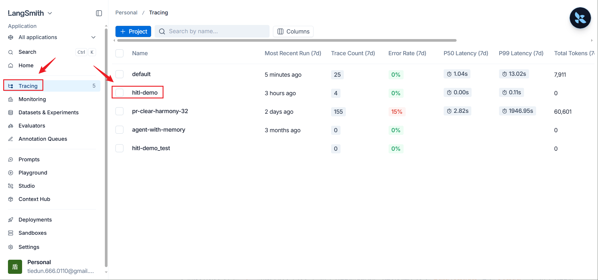

##### 9.1.2.2.4. `langgraph.json`

写入以下内容

```json
{
  "dependencies": ["."],
  "graphs": {
    "graph": "./src/agent.py:graph"
  },
  "env": ".env"
}
```

- **`dependencies`**：**`langgraph-cli`** 启动的本地服务的依赖项，接收类型为列表的值

  列表元素只有 **`"."`** 表示从本次环境中加载依赖。如果在名为 **`langchain`** 的 **`conda`** 环境中加载启动 **`LangGraph`** 本地服务，则会从该环境中加载依赖。

- **`graphs`**：计算图或 **`Agent`** 对象的映射

  这是个字典，其中每个键值对表示一条映射关系

  - **`Key`**：在 **`LangSmith Studio`** 中显示的应用名称
  - **`Value`**：相应的**应用实例**在项目源码中的路径
    - **`:`** 之前为应用实例所在的代码
    - **`:`** 之后为应用实例在代码中的**变量名**

- **`env`**：环境变量文件路径

### 9.1.3. 启动项目

在命令行执行 

```powershell
langgraph dev
```

该命令将会启动一个轻量的本地服务，用于测试。

```
#报错
UnicodeDecodeError: 'gbk' codec can't decode byte 0xaf in position 60: illegal multibyte sequence
#原因
  agent.py 里有中文注释（# 姓名、# 年龄），在 Windows 下 Python 默认用 GBK 编码读取 .py 文件，遇到 GBK 无法解码的字节就报
  UnicodeDecodeError。
  
  解决方法

  在 PowerShell 中（你平时用的终端），执行前先设置环境变量：

conda activate langgraph
$env:PYTHONUTF8 = "1"
langgraph dev
  
  或者一行搞定：

conda activate langgraph; $env:PYTHONUTF8 = "1"; langgraph dev

  永久修复（推荐）

  在 conda 的 langgraph 环境中设置该变量，之后 activate 就自动生效：

conda activate langgraph
conda env config vars set PYTHONUTF8=1
conda deactivate
conda activate langgraph

  这样以后每次 langgraph dev 都不用再手动设置了。
```


**如下所示**

```powershell
(langgraph) PS C:\Users\Lenovo\OneDrive\文档\AI\langgraph\tutorials\hitl_demo> langgraph dev
```

**启动日志如下**

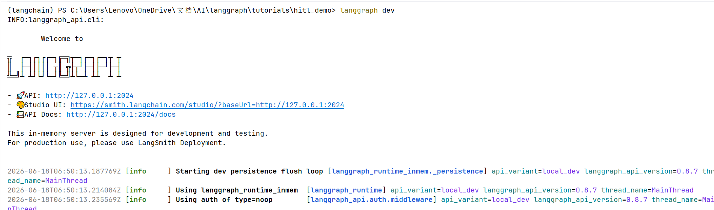

如果配置无误，执行命令后通常会自动跳转至

**`Studio UI`** 路径 

> https://smith.langchain.com/studio/?baseUrl=http://127.0.0.1:2024

如果没有跳转，在浏览器输入链接即可。

**页面如下所示**

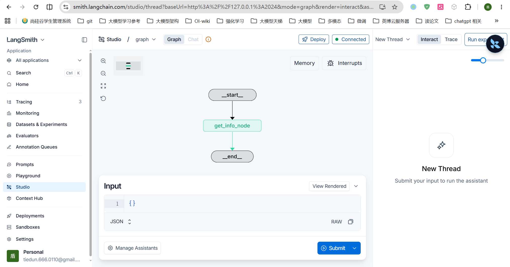

可以看到计算图的拓扑结构。

### 9.1.4. 调试

#### 9.1.4.1. 首次调用

该应用不需要任何输入状态，**`Input`** 字典留空即可

点击 **`Submit`** 启动计算图

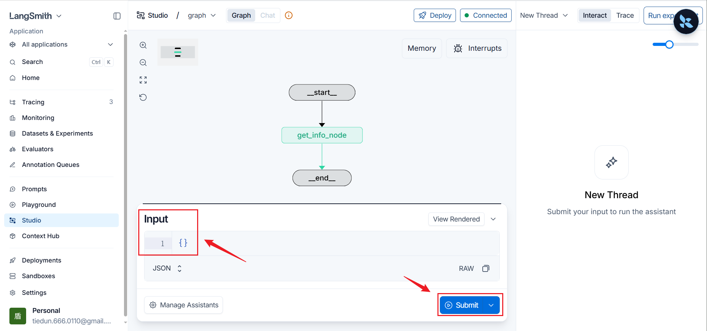

#### 9.1.4.2. 第一次恢复运行

计算图触发第一个断点，只需要输入本地开发时传递给 **`Command(resume)`** 的值即可

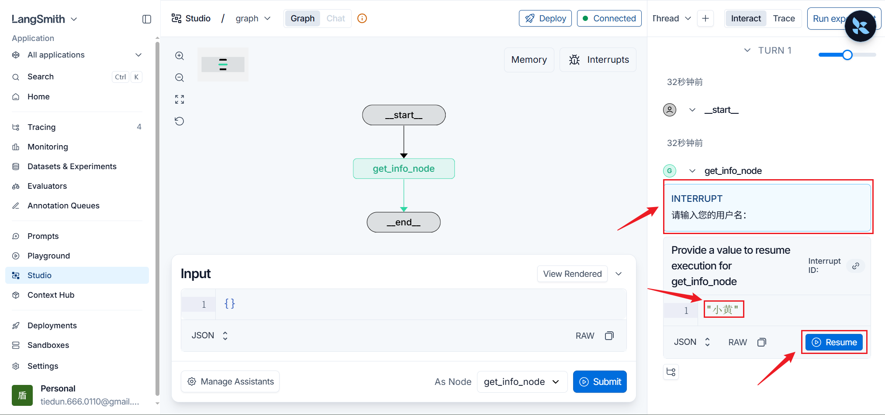

#### 9.1.4.3. 第二次恢复运行

输入年龄

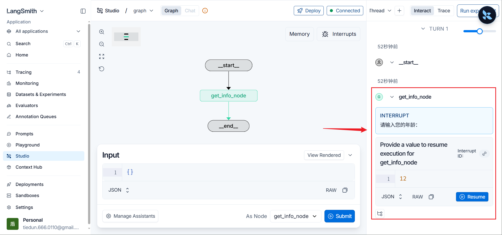

#### 9.1.4.4. 第三次恢复运行

输入性别

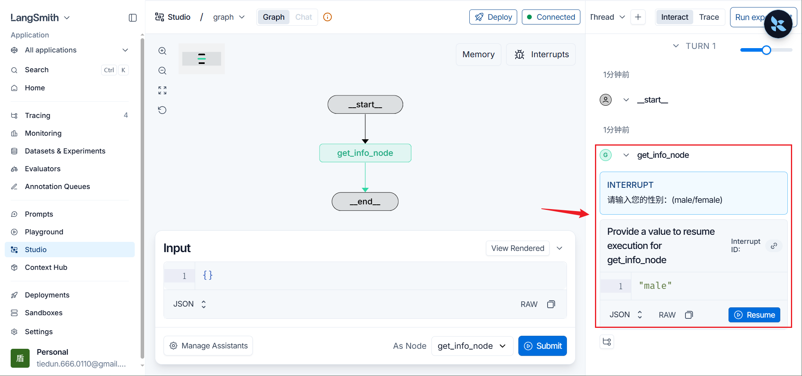

#### 9.1.4.5. 最终结果

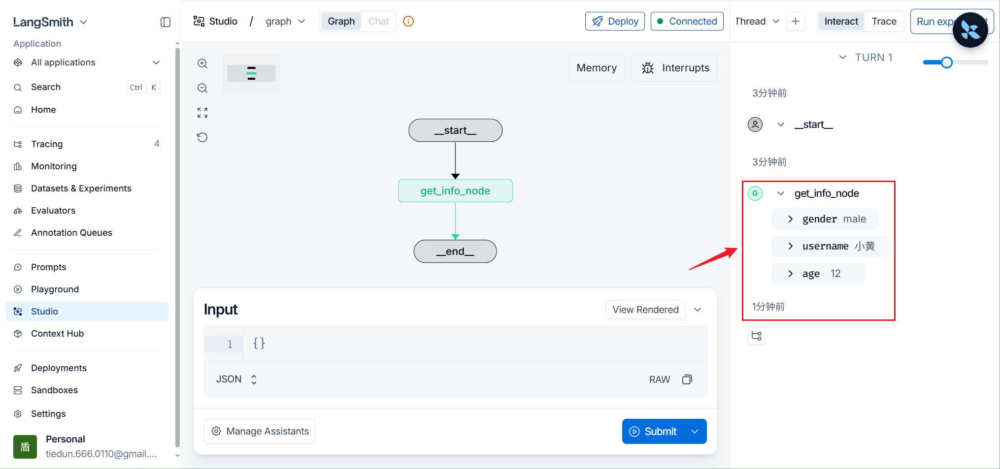

### 9.1.5. 调试时添加静态断点

我们可以在调试时添加静态断点

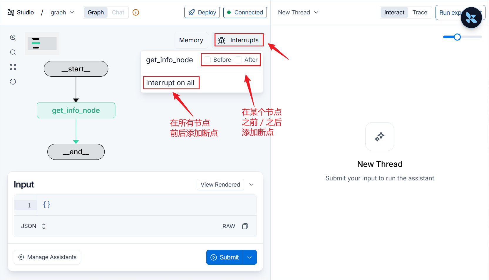

我们在 **`get_info_node`** 之前添加断点

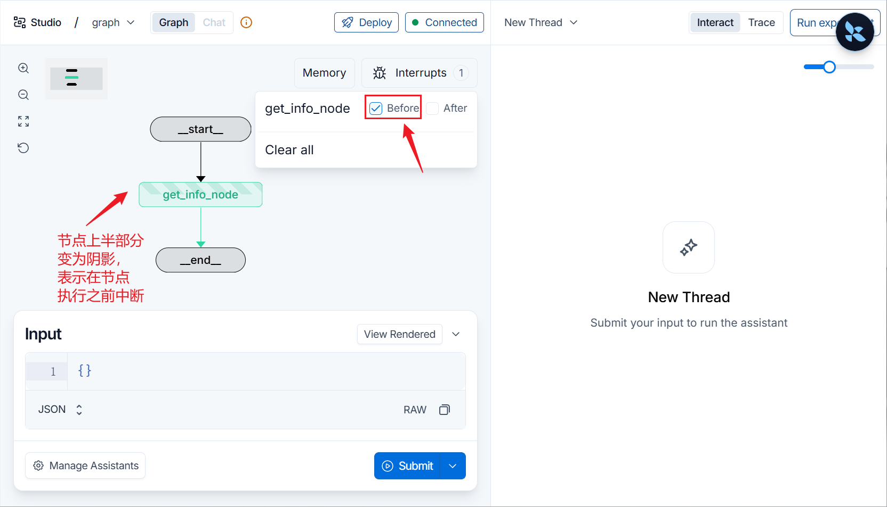

运行

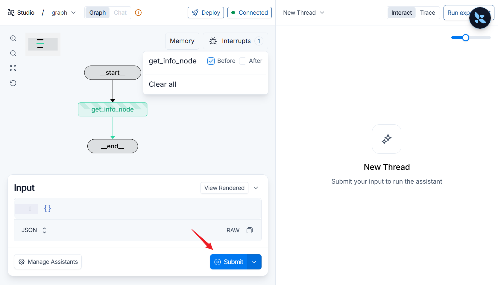

中断后继续

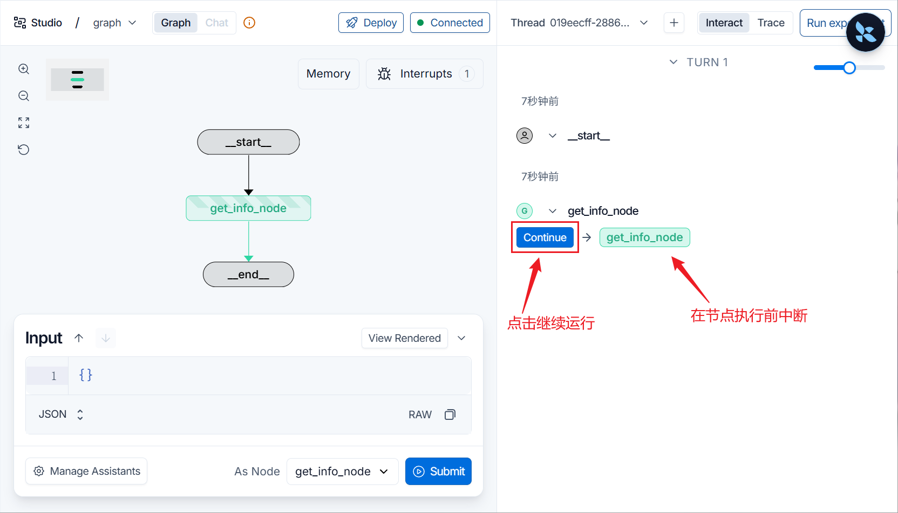

开始执行正常的节点计算逻辑

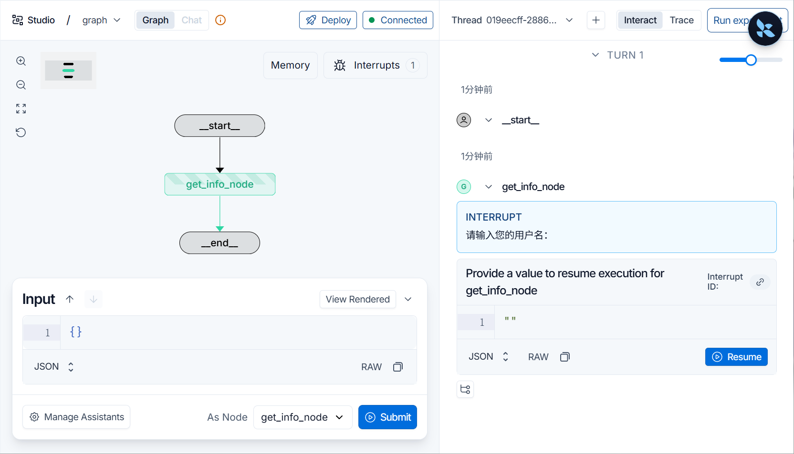

## 9.2. 本地部署并对接`AgentChatUI`

**`AgentChatUI`** 是 **`langchain-ai`** 旗下另一个开源框架，专为带有 **`messages`** 状态字段的计算图或 **`Agent`** 应用提供前端交互页面。

默认情况下，状态中的其它字段可以被后端正常处理，但是不会在前端展示。

**官方仓库地址如下**

> https://github.com/langchain-ai/agent-chat-ui

同样提供了开箱即用的**云服务**

> https://agentchat.vercel.app/

### 9.2.1. 准备文件

#### 9.2.1.1. `chat_agent.py` 

在项目的 **`src`** 目录下新建 **`chat_agent.py`**，写入以下内容

```python
from typing import Literal

from langgraph.graph import MessagesState, StateGraph, START, END
from langgraph.types import interrupt

from langchain.messages import ToolMessage
from langchain.tools import tool
from langchain_deepseek import ChatDeepSeek

model = ChatDeepSeek(
    model="deepseek-v4-flash",
    extra_body={
        "thinking": {
            "type": "disabled"
        }
    }
)

@tool(parse_docstring=True)
def get_weather(city: str) -> str:
    """
    根据城市名称，查询当日天气。

    Args:
        city: 城市名称
    """
    return f"{city} 今天天气很好"

tools = [get_weather]
tools_by_name = {
    current_tool.name: current_tool
    for current_tool in tools
}
model_with_tools = model.bind_tools(tools)

def llm_node(state: MessagesState) -> dict:
    response = model_with_tools.invoke(state["messages"])

    return {
        "messages": [response]
    }

def tool_node(state: MessagesState) -> dict:
    last_message = state["messages"][-1]
    tool_calls = last_message.tool_calls

    # 一次中断，提交所有待审批的工具调用
    resume_value = interrupt({
        "action_requests": [
            {
                "name": tool_call["name"],
                "args": tool_call["args"],
                "description": (
                    f"是否允许调用工具 {tool_call['name']}，"
                    f"参数为 {tool_call['args']}？"
                ),
            }
            for tool_call in tool_calls
        ],
        "review_configs": [
            {
                "action_name": tool_call["name"],
                "allowed_decisions": [
                    "approve",
                    "reject",
                    "edit",
                ],
            }
            for tool_call in tool_calls
        ],
    })

    decisions = resume_value.get("decisions", [])
    tool_messages = []

    for index, tool_call in enumerate(tool_calls):
        decision = (
            decisions[index]
            if index < len(decisions)
            else {"type": "reject"}
        )

        decision_type = decision.get("type")

        if decision_type == "approve":
            selected_tool = tools_by_name[tool_call["name"]]
            result = selected_tool.invoke(tool_call["args"])

        elif decision_type == "edit":
            edited_action = decision["edited_action"]
            edited_args = edited_action["args"]

            selected_tool = tools_by_name[tool_call["name"]]
            result = selected_tool.invoke(edited_args)

        else:
            result = decision.get(
                "message",
                "用户拒绝调用该工具",
            )

        tool_messages.append(
            ToolMessage(
                content=str(result),
                tool_call_id=tool_call["id"],
            )
        )

    return {
        "messages": tool_messages
    }


def router(
    state: MessagesState,
) -> Literal["tool_node", END]:
    last_message = state["messages"][-1]

    if last_message.tool_calls:
        return "tool_node"

    return END


builder = StateGraph(state_schema=MessagesState)

builder.add_node("llm_node", llm_node)
builder.add_node("tool_node", tool_node)

builder.add_edge(START, "llm_node")

builder.add_conditional_edges(
    "llm_node",
    router,
    ["tool_node", END],
)

builder.add_edge("tool_node", "llm_node")

chat_graph = builder.compile()
```

此处返回的中断信息，遵循 **`AgentChatUI`** 定义的 **`HITL`** 协议，遵循此协议，则前端可以正确渲染中断信息，前端期望的中断信息格式如下：

```json
{
    "action_requests": [
        {
            "name": "get_weather",
            "args": {
                "city": "杭州"
            },
            "description": "是否允许查询杭州天气？"
        }
    ],
    "review_configs": [
        {
            "action_name": "get_weather",
            "allowed_decisions": [
                "approve",
                "reject",
                "edit"
            ]
        }
    ]
}
```

当中断发生时，前端会将中断信息渲染在对话框中，根据用户操作的不同，后端拿到的反馈数据样式如下

- **`approve`**：

  ```json
  {
      "decisions": [
          {
              "type": "approve"
          }
      ]
  }
  ```

- **`reject`**：

  ```json
  {
      "decisions": [
          {
              "type": "reject",
              "message": "不允许执行该操作"
          }
      ]
  }

- **`edit`**：

  ```json
  {
      "decisions": [
          {
              "type": "edit",
              "edited_action": {
                  "name": "get_weather",
                  "args": {
                      "city": "上海"
                  }
              }
          }
      ]
  }

#### 9.2.1.2. 更改`langgraph.json`

在 **`graphs`** 中新增条目，如下

```json
{
  "dependencies": ["."],
  "graphs": {
    "graph": "./src/agent.py:graph",
    "chat_graph": "./src/chat_agent.py:chat_graph"
  },
  "env": ".env"
}
```

### 9.2.2. 对接`AgentChatUI`

#### 9.2.2.1. 重启本地服务

#### 9.2.2.2. 访问云服务

在官方云服务入口页面填入需要的信息

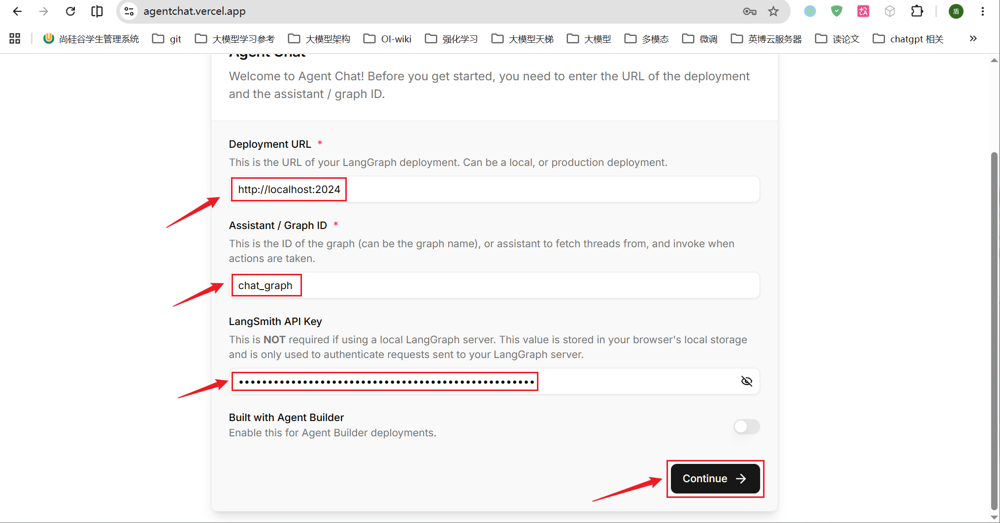

- **`Deployment URL`**：本地服务 **`URL`**
- **`Assistant / Graph ID`**：配置文件中声明的应用名称
- **`LangSmith API Key`**：略

点击 **`Continue`**，如果配置正确，则跳转至以下页面

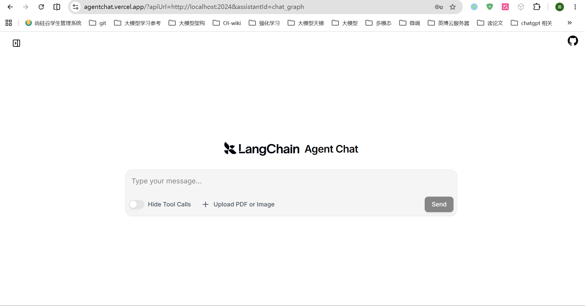

### 9.2.3. 测试

#### 9.2.3.1. 对话

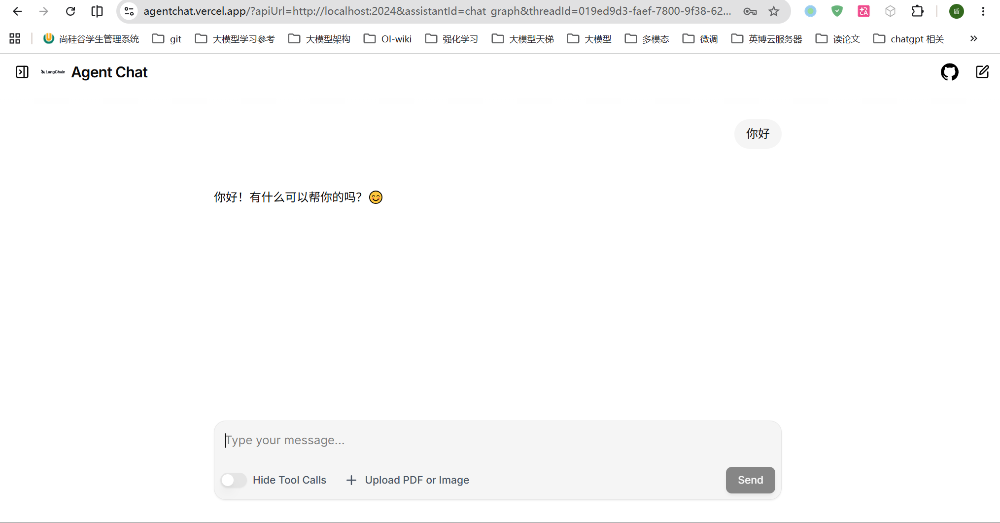

#### 9.2.3.2. 工具调用

在工具节点添加了 **`HITL`** 机制，所以调用工具会触发中断

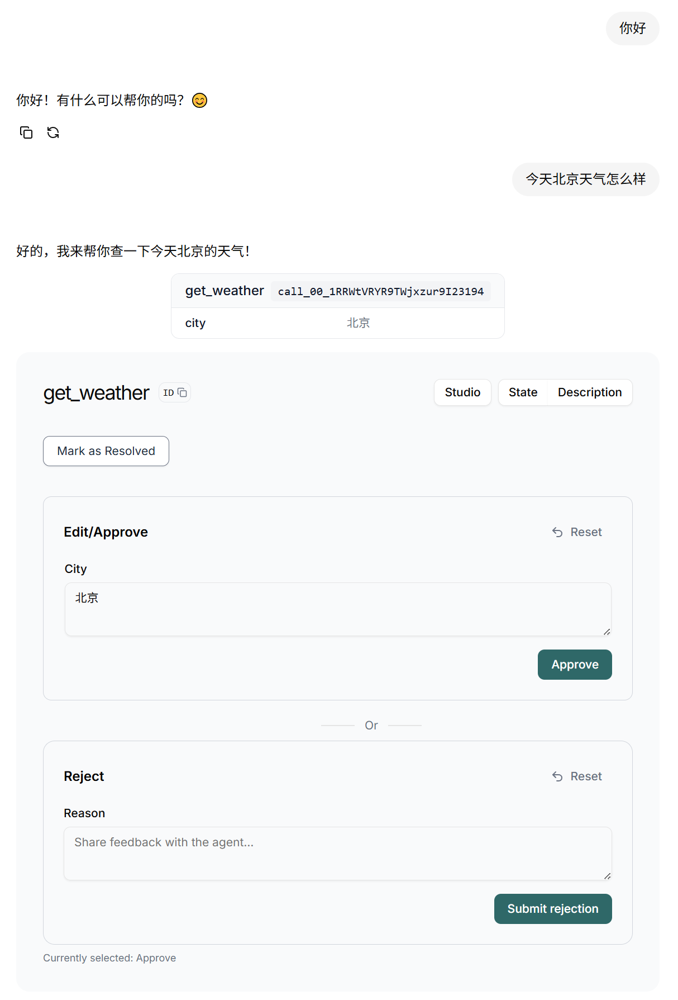

##### 9.2.3.2.1. 同意调用

点击 **`Approve`** 按钮

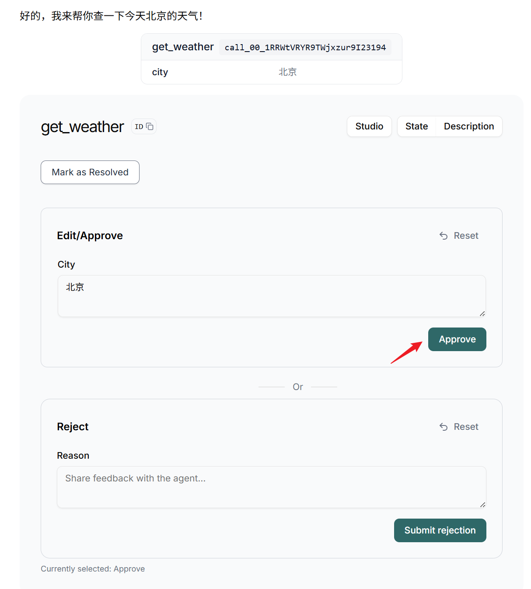

**结果如下**

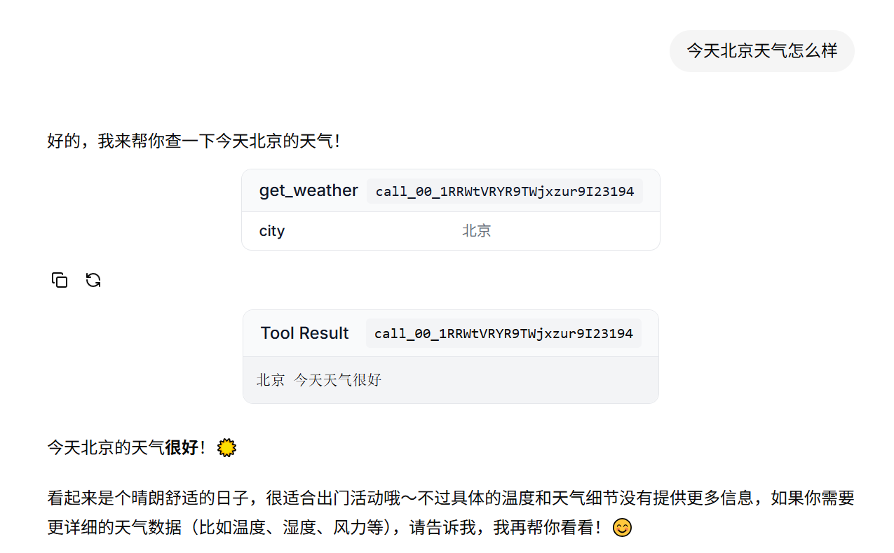

##### 9.2.3.2.2. 修改参数后调用

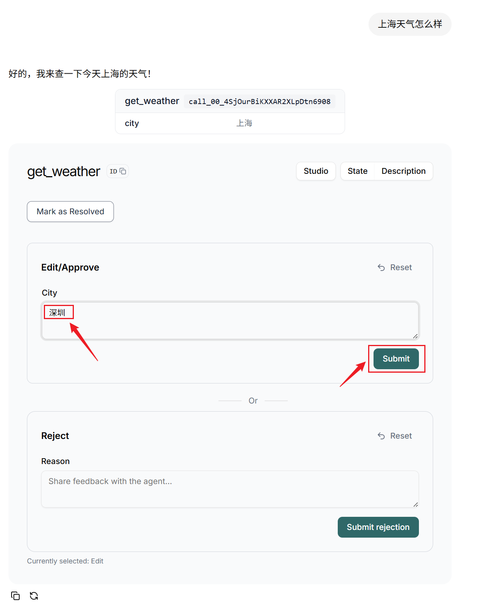

**修改后提交，结果如下**

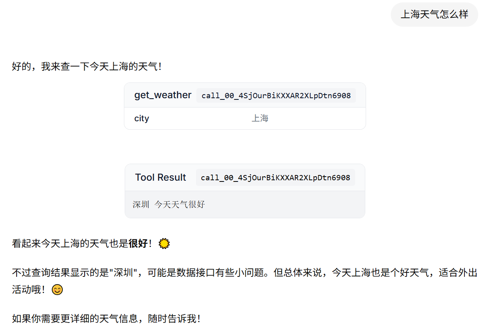

##### 9.2.3.2.3. 拒绝调用

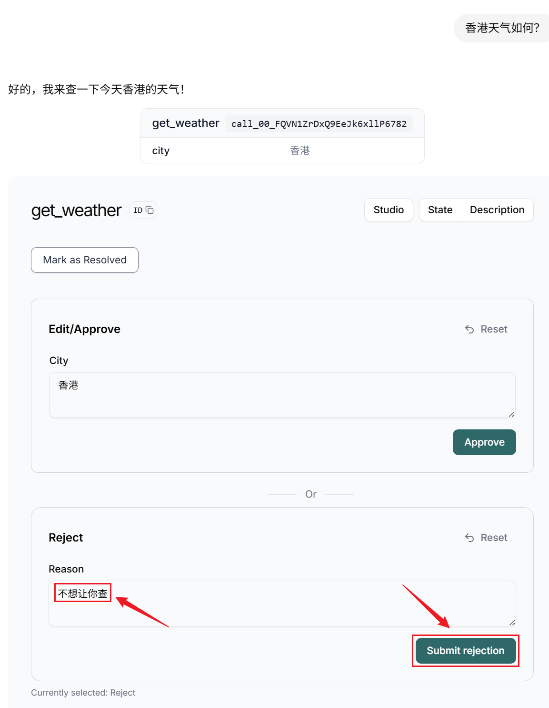

**编辑原因后拒绝，结果如下**

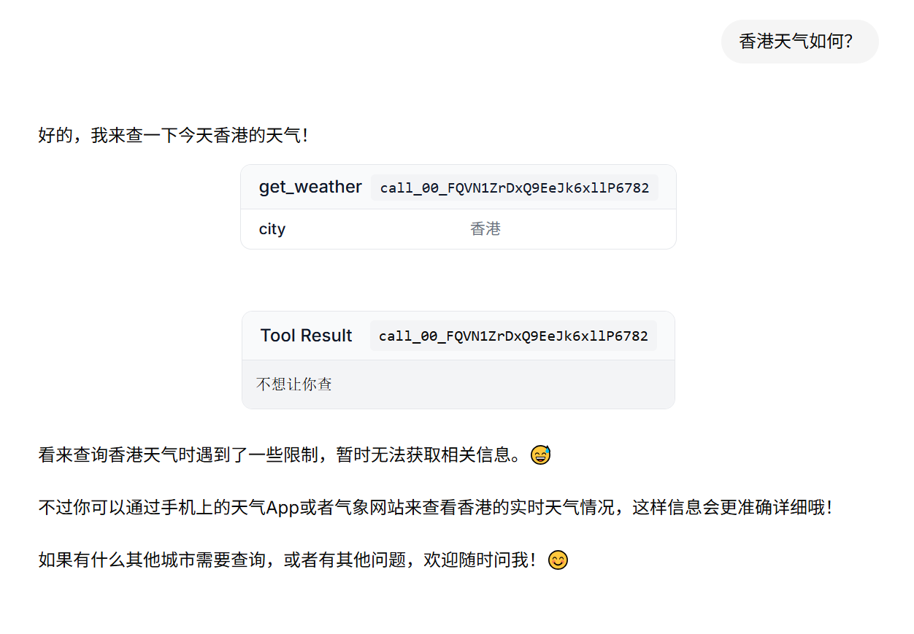

#### 9.2.3.3. 查看历史记录

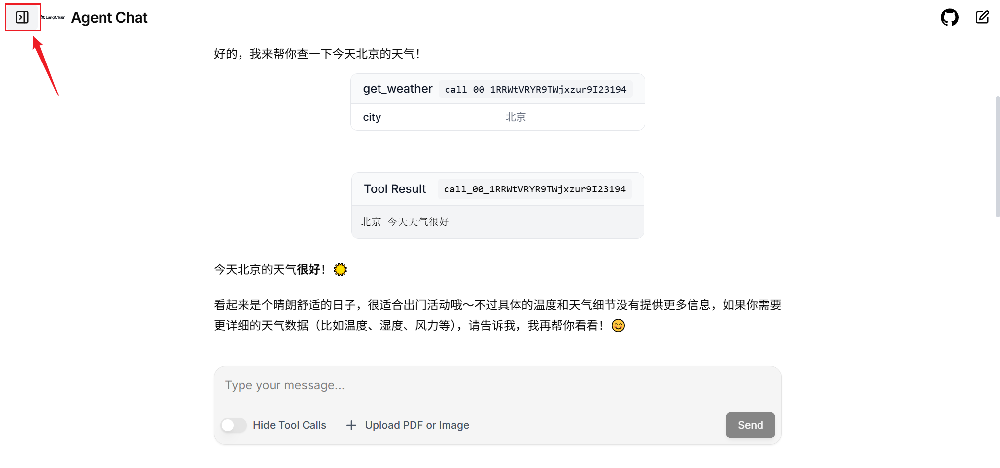

左侧列出了历史会话，点击会话名称即可查看历史会话

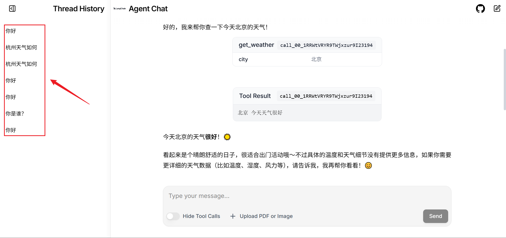

如果配置了 **`LangSmith`** 追踪所需的环境变量，还可以在以下页面追踪调用的详细信息。

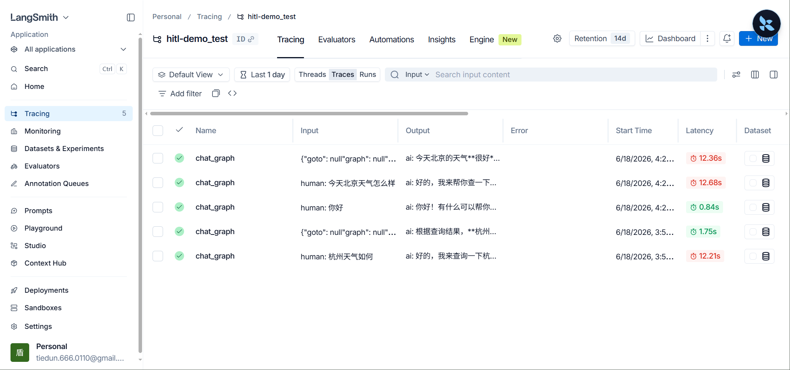
