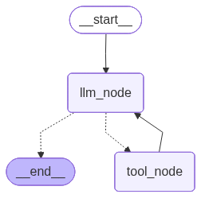

# 10. 工具调用节点

## 10.1. 工具节点的实现

工具是 **`Agent`** 扩展外部能力的重要组件之一。本节以最基础的 **`ReAct` 式工具调用循环**为例，分别介绍手动实现工具节点和使用预构建 **`ToolNode`** 两种方式。

手动实现有助于理解工具调用的基本流程：模型生成工具调用请求，工具节点根据名称查找并执行工具，再将执行结果封装成与原工具调用对应的 **`ToolMessage`**。不过，实际项目还需要处理参数校验、异常处理、运行时注入、并行执行以及 **`Command`** 传播等问题。

**`ToolNode`** 对这些通用逻辑进行了封装，适合在需要自定义图结构和工具调用流程的场景中使用。

### 10.1.1. 手动处理工具调用

**示例如下**

```python
from typing import Literal
from langgraph.graph import StateGraph, START, END
from langgraph.graph.message import MessagesState
from langchain.messages import HumanMessage, ToolMessage
from langchain.tools import tool
from langchain_deepseek import ChatDeepSeek

from loguru import logger
from dotenv import load_dotenv
load_dotenv(override=True)

@tool(parse_docstring=True)
def get_weather(city: str) -> str:
    """
    查询指定城市的当日天气

    Args:
        city: 城市名称
    """
    return f"{city} 今天天气不错"

@tool(parse_docstring=True)
def get_news(home_or_abroad: bool) -> str:
    """
    查询国内外新闻

    Args:
        home_or_abroad: 查询国内还是国外新闻，True: 国内新闻，False：国外新闻
    """
    if home_or_abroad:
        return "Kimi 新模型发布"
    return "Anthropic 暂停新模型访问"

tools_by_name = {
    "get_weather": get_weather,
    "get_news": get_news
}
tools = [get_weather, get_news]

model = ChatDeepSeek(
    model="deepseek-v4-flash",
    extra_body={
        "thinking": {
            "type": "disabled"
        }
    }
)
model_with_tools = model.bind_tools(tools=tools)

def llm_node(state: MessagesState) -> MessagesState:
    messages = state['messages']
    response = model_with_tools.invoke(messages)

    return {
        "messages": [response]
    }

def tool_node(state: MessagesState) -> MessagesState:
    last_msg = state['messages'][-1]
    if not last_msg.tool_calls:
        return {}

    tool_msgs = []
    for tool_call in last_msg.tool_calls:
        tool = tools_by_name[tool_call["name"]]
        logger.info("工具 {} 被调用, 对应的 tool_call: {}", tool_call["name"], tool_call)
        tool_res = tool.invoke(tool_call["args"])
        tool_msg = ToolMessage(
            name = tool_call["name"],
            content = tool_res,
            tool_call_id = tool_call["id"]
        )
        tool_msgs.append(tool_msg)

    return {
        "messages": tool_msgs
    }

def router(state: MessagesState) -> Literal["tool_node", END]:
    if state['messages'][-1].tool_calls:
        return "tool_node"
    return END

builder = StateGraph(state_schema=MessagesState)
builder.add_node("llm_node", llm_node)
builder.add_node("tool_node", tool_node)
builder.add_edge(START, "llm_node")
builder.add_conditional_edges("llm_node", router, path_map=["tool_node", END])
builder.add_edge("tool_node", "llm_node")

graph = builder.compile()

from IPython.display import display
display(graph)

res = graph.invoke({"messages": [HumanMessage("今天北京天气如何？国内有哪些新闻")]})
for msg in res['messages']:
    msg.pretty_print()
```

> **注意**
>
> 上面的手动实现会按照 **`tool_calls`** 的顺序串行执行工具，主要用于展示底层流程。**`ToolNode`** 在同步调用中可通过执行器并行处理多个工具调用，在异步调用中则使用 **`asyncio.gather()`** 并发执行。

**运行结果如下**


```json
2026-06-22 09:59:05.258 | INFO     | __main__:tool_node:67 - 工具 get_weather 被调用, 对应的 tool_call: {'name': 'get_weather', 'args': {'city': '北京'}, 'id': 'call_00_lpemFmfsKxTtEKjweosB0896', 'type': 'tool_call'}
2026-06-22 09:59:05.259 | INFO     | __main__:tool_node:67 - 工具 get_news 被调用, 对应的 tool_call: {'name': 'get_news', 'args': {'home_or_abroad': True}, 'id': 'call_01_DDLZCKnovq6EtdrD6XXw2202', 'type': 'tool_call'}
================================ Human Message =================================

今天北京天气如何？国内有哪些新闻
================================== Ai Message ==================================

好的，我来查询今天北京的天气和国内新闻。
Tool Calls:
  get_weather (call_00_lpemFmfsKxTtEKjweosB0896)
 Call ID: call_00_lpemFmfsKxTtEKjweosB0896
  Args:
    city: 北京
  get_news (call_01_DDLZCKnovq6EtdrD6XXw2202)
 Call ID: call_01_DDLZCKnovq6EtdrD6XXw2202
  Args:
    home_or_abroad: True
================================= Tool Message =================================
Name: get_weather

北京 今天天气不错
================================= Tool Message =================================
Name: get_news

Kimi 新模型发布
================================== Ai Message ==================================

以下是今天的查询结果：

### 🌤️ 北京天气
今天北京的天气**不错**，适合外出活动哦！

### 📰 国内新闻
目前有一条重要新闻：**Kimi 新模型发布**

如果你想了解更多详情，可以继续问我！
```

### 10.1.2. 用`ToolNode`处理工具调用

上一节的工具节点完成了以下工作：读取最后一条 **`AIMessage`** 中的 **`tool_calls`**，根据工具名称查找并执行对应工具，再把执行结果封装成与原工具调用一一对应的 **`ToolMessage`**。

这种实现适合帮助我们理解工具调用的基本流程，但它只覆盖了最简单的场景。实际项目还需要处理无效工具名、参数校验、异常处理、运行时参数注入、**`Command`** 传播以及多个工具调用的并行执行等问题。

**`LangGraph`** 提供了预构建的 **`ToolNode`**。只需传入工具列表，它便可以完成上述所有操作。

**示例如下**

```python
from typing import Literal
from langgraph.graph import StateGraph, START, END
from langgraph.prebuilt.tool_node import ToolNode
from langgraph.graph.message import MessagesState
from langchain.messages import HumanMessage
from langchain.tools import tool
from langchain_deepseek import ChatDeepSeek

from dotenv import load_dotenv
load_dotenv(override=True)

@tool(parse_docstring=True)
def get_weather(city: str) -> str:
    """
    查询指定城市的当日天气

    Args:
        city: 城市名称
    """
    return f"{city} 今天天气不错"

@tool(parse_docstring=True)
def get_news(home_or_abroad: bool) -> str:
    """
    查询国内外新闻

    Args:
        home_or_abroad: 查询国内还是国外新闻，True: 国内新闻，False：国外新闻
    """
    if home_or_abroad:
        return "Kimi 新模型发布"
    return "Anthropic 暂停新模型访问"

tools = [get_weather, get_news]

model = ChatDeepSeek(
    model="deepseek-v4-flash",
    extra_body={
        "thinking": {
            "type": "disabled"
        }
    }
)
model_with_tools = model.bind_tools(tools=tools)

def llm_node(state: MessagesState) -> MessagesState:
    messages = state['messages']
    response = model_with_tools.invoke(messages)

    return {
        "messages": [response]
    }

def router(state: MessagesState) -> Literal["tool_node", END]:
    if state['messages'][-1].tool_calls:
        return "tool_node"
    return END

builder = StateGraph(state_schema=MessagesState)
builder.add_node("llm_node", llm_node)
builder.add_node("tool_node", ToolNode(tools=tools))
builder.add_edge(START, "llm_node")
builder.add_conditional_edges("llm_node", router, path_map=["tool_node", END])
builder.add_edge("tool_node", "llm_node")

graph = builder.compile()

from IPython.display import display
display(graph)

res = graph.invoke({"messages": [HumanMessage("今天北京天气如何？国内有哪些新闻？")]})
for msg in res['messages']:
    msg.pretty_print()
```

**运行结果如下**



```json
================================ Human Message =================================

今天北京天气如何？国内有哪些新闻？
================================== Ai Message ==================================

好的，我来同时查询北京天气和国内新闻。
Tool Calls:
  get_weather (call_00_BBHYjTwSiWbGolSrp7yb9812)
 Call ID: call_00_BBHYjTwSiWbGolSrp7yb9812
  Args:
    city: 北京
  get_news (call_01_3XEu887comx2s1SMtw8h3282)
 Call ID: call_01_3XEu887comx2s1SMtw8h3282
  Args:
    home_or_abroad: True
================================= Tool Message =================================
Name: get_weather

北京 今天天气不错
================================= Tool Message =================================
Name: get_news

Kimi 新模型发布
================================== Ai Message ==================================

以下是您查询的信息：

---

### 🌤️ 北京今日天气
北京今天**天气不错**，适合外出活动。

### 📰 国内新闻
今日国内有一条重要新闻：**Kimi 新模型发布**。

如果您想了解更多详细内容，随时可以继续问我！
```

## 10.2. 进阶用法

### 10.2.1. `ToolRuntime`介绍

**`ToolRuntime`** 是专门面向工具调用的运行时对象。

按照官方规范：

- 工具函数中存在名为 **`runtime`**
- 并且类型标注为 **`ToolRuntime`** 的参数时

底层运行时会在调用工具前自动注入 **`ToolRuntime`** 实例。根据源码实现，某些不规范的写法也能注入运行时实例，但并不规范，不推荐。

需要注意，**`ToolRuntime`** 与图节点中使用的 **`langgraph.runtime.Runtime`** 并不是同一个类型。前者额外提供了当前图状态、运行配置和工具调用 ID 等工具调用专属信息。

当前版本，**`ToolRuntime`** 的核心定义如下：

```python
@dataclass
class ToolRuntime(_DirectlyInjectedToolArg, Generic[ContextT, StateT]):
    state: StateT
    context: ContextT
    config: RunnableConfig
    stream_writer: StreamWriter
    tool_call_id: str | None
    store: BaseStore | None
```

- **`state`**：图状态，短期记忆
- **`context`**：运行时上下文
- **`config`**：运行时配置，包含元数据
- **`stream_writer`**：自定义流式输出写入器
- **`tool_call_id`**：工具调用 **`ID`**
- **`store`**：长期记忆

借助 **`runtime`**，工具可以访问上述所有资源。

### 10.2.2. 在工具中更新状态

工具不仅可以返回普通结果，还可以返回 **`Command(update=...)`**，将业务结果写入图状态。

当工具由模型发起调用时，消息历史中的 **`AIMessage.tool_calls`** 必须紧跟与之匹配的 **`ToolMessage`**。

当工具返回普通结果时，**`ToolNode`** 会帮我们完成运行结果到 **`ToolMessage`** 的转换，并追加到消息列表。

但工具返回 **`Command`** 时，上述操作需要开发者完成，此时还应在 **`Command.update`** 的消息字段中写入对应的 **`ToolMessage`**。

如果同一轮并行执行的多个工具可能更新同一个普通状态字段，需要为该字段配置合适的归并函数；否则可能出现并发更新冲突。本例中的两个工具分别更新 **`weather_res`** 和 **`news_res`**，因此不存在该问题。

**示例如下**

```python
from typing import Literal
from langgraph.graph import StateGraph, START, END
from langgraph.prebuilt.tool_node import ToolNode, ToolRuntime
from langgraph.types import Command
from langgraph.graph.message import MessagesState

from langchain.messages import HumanMessage, ToolMessage
from langchain.tools import tool
from langchain_deepseek import ChatDeepSeek

from dotenv import load_dotenv
load_dotenv(override=True)

class OverAllState(MessagesState):
    weather_res: str
    news_res: str

@tool(parse_docstring=True)
def get_weather(city: str, runtime: ToolRuntime) -> Command:
    """
    查询指定城市的当日天气

    Args:
        city: 城市名称
    """
    res = f"{city} 今天天气不错"
    tool_call_id = runtime.tool_call_id
    tool_msg = ToolMessage(tool_call_id=tool_call_id, content=res)
    return Command(
        update = {
            "weather_res": res,
            "messages": [tool_msg]
        }
    )

@tool(parse_docstring=True)
def get_news(home_or_abroad: bool, runtime: ToolRuntime) -> Command:
    """
    查询国内外新闻

    Args:
        home_or_abroad: 查询国内还是国外新闻，True: 国内新闻，False：国外新闻
    """
    if home_or_abroad:
        res = "Kimi 新模型发布"
    else:
        res = "Anthropic 暂停新模型访问"
    tool_call_id = runtime.tool_call_id
    tool_msg = ToolMessage(tool_call_id=tool_call_id, content=res)
    return Command(
        update = {
            "news_res": res,
            "messages": [tool_msg]
        }
    )

tools = [get_weather, get_news]

model = ChatDeepSeek(
    model="deepseek-v4-flash",
    extra_body={
        "thinking": {
            "type": "disabled"
        }
    }
)
model_with_tools = model.bind_tools(tools=tools)

def llm_node(state: OverAllState) -> OverAllState:
    messages = state['messages']
    response = model_with_tools.invoke(messages)

    return {
        "messages": [response]
    }

def router(state: OverAllState) -> Literal["tool_node", END]:
    if state['messages'][-1].tool_calls:
        return "tool_node"
    return END

builder = StateGraph(state_schema=OverAllState)
builder.add_node("llm_node", llm_node)
builder.add_node("tool_node", ToolNode(tools=tools))
builder.add_edge(START, "llm_node")
builder.add_conditional_edges("llm_node", router, path_map=["tool_node", END])
builder.add_edge("tool_node", "llm_node")

graph = builder.compile()

from IPython.display import display
display(graph)

res = graph.invoke({"messages": [HumanMessage("今天北京天气如何？国内有哪些新闻？")]})
print('=' * 30, '-> messages <-', '=' * 30)
for msg in res.pop('messages'):
    msg.pretty_print()

print('=' * 30, '-> res without messages <-', '=' * 30)
print(res)
```

**运行结果如下**


```json
============================== -> messages <- ==============================
================================ Human Message =================================

今天北京天气如何？国内有哪些新闻？
================================== Ai Message ==================================

好的，我来同时查询北京天气和国内新闻。
Tool Calls:
  get_weather (call_00_hbEppxygz7DLDwaxg8X19090)
 Call ID: call_00_hbEppxygz7DLDwaxg8X19090
  Args:
    city: 北京
  get_news (call_01_wkG4j5Hjq4wkyTOaxzxT5267)
 Call ID: call_01_wkG4j5Hjq4wkyTOaxzxT5267
  Args:
    home_or_abroad: True
================================= Tool Message =================================
Name: get_weather

北京 今天天气不错
================================= Tool Message =================================
Name: get_news

Kimi 新模型发布
================================== Ai Message ==================================

为您查询到以下信息：

### 🌤️ 北京今日天气
今天北京的天气**不错**，比较适宜出行。

### 📰 国内新闻
- **Kimi 新模型发布** — 国内AI领域又有新动态。

如果您想了解更多详情，可以继续问我！
============================== -> res without messages <- ==============================
{'weather_res': '北京 今天天气不错', 'news_res': 'Kimi 新模型发布'}
```


### 10.2.3. 工具节点执行与容错机制

**`ToolNode`** 提供同步工具调用包装器 **`wrap_tool_call`**，用于在工具执行前后插入自定义逻辑。

它与 **`LangChain Agent`** 中间件 **`wrap_tool_call`** 的核心机制相同：接收当前工具调用请求 **`request`** 和真正执行工具的回调 **`execute`**，可以选择不调用、调用一次或多次 **`execute(request)`**，并最终返回 **`ToolMessage`** 或 **`Command`**。

因此，**`wrap_tool_call`** 可以用于重试、缓存、请求改写、短路返回和自定义控制流等场景。异步工具链路还可以使用对应的 **`awrap_tool_call`**。

此处通过重试和缓存机制的实现，介绍 **`wrap_tool_call`** 的用法。

#### 10.2.3.1. 实现重试机制

**示例如下**

```python
from typing import Literal
from langgraph.graph import StateGraph, START, END
from langgraph.prebuilt.tool_node import ToolNode
from langgraph.graph.message import MessagesState

from langchain.messages import HumanMessage, ToolMessage
from langchain.tools import tool
from langchain_deepseek import ChatDeepSeek

from dataclasses import dataclass
from loguru import logger
from dotenv import load_dotenv
load_dotenv(override=True)

import random

@tool(parse_docstring=True)
def get_weather(city: str) -> str:
    """
    查询指定城市的当日天气

    Args:
        city: 城市名称
    """
    # 70% 概率因网络波动而调用失败
    rand_int = random.randint(1,10)
    if rand_int < 8:
        raise ConnectionError("网络波动失败")
    return f"{city} 今天天气不错"

tools = [get_weather]

model = ChatDeepSeek(
    model="deepseek-v4-flash",
    extra_body={
        "thinking": {
            "type": "disabled"
        }
    }
)
model_with_tools = model.bind_tools(tools=tools)

@dataclass
class UserContext:
    max_attempts: int

def llm_node(state: MessagesState) -> MessagesState:
    messages = state['messages']
    response = model_with_tools.invoke(messages)

    return {
        "messages": [response]
    }

def router(state: MessagesState) -> Literal["tool_node", END]:
    if state['messages'][-1].tool_calls:
        return "tool_node"
    return END

def wrap_tool_call(request, execute):
    max_attempts = request.runtime.context.max_attempts
    tool_call_id = request.runtime.tool_call_id

    tool_msg = ""
    for i in range(max_attempts):
        try:
            tool_msg = execute(request)
            break
        except ConnectionError as e:
            logger.info("工具调用失败，当前调用次数: {}, 调用次数上限: {}, 异常信息: {}", i + 1, max_attempts, e)

    if not tool_msg:
        tool_msg = ToolMessage(
            tool_call_id = tool_call_id,
            content = "调用次数到达上限，调用失败"
        )

    return tool_msg

builder = StateGraph(state_schema=MessagesState, context_schema=UserContext)
builder.add_node("llm_node", llm_node)
builder.add_node("tool_node", ToolNode(tools=tools, wrap_tool_call=wrap_tool_call))
builder.add_edge(START, "llm_node")
builder.add_conditional_edges("llm_node", router, path_map=["tool_node", END])
builder.add_edge("tool_node", "llm_node")

graph = builder.compile()

from IPython.display import display
display(graph)

res = graph.invoke(
    {"messages": [HumanMessage("今天北京天气如何？")]},
    context = UserContext(max_attempts=3))
for msg in res['messages']:
    msg.pretty_print()
```

**运行结果如下**


按照当前设计，每次工具调用有 **`70%`** 的概率失败，最多尝试 **`3`** 次。仍然可能最终失败，如下所示。

```json
2026-06-22 11:12:21.039 | INFO     | __main__:wrap_tool_call:71 - 工具调用失败，当前调用次数: 1, 调用次数上限: 3, 异常信息: 网络波动失败
2026-06-22 11:12:21.042 | INFO     | __main__:wrap_tool_call:71 - 工具调用失败，当前调用次数: 1, 调用次数上限: 3, 异常信息: 网络波动失败
2026-06-22 11:12:21.046 | INFO     | __main__:wrap_tool_call:71 - 工具调用失败，当前调用次数: 1, 调用次数上限: 3, 异常信息: 网络波动失败
================================ Human Message =================================

今天北京天气如何？
================================== Ai Message ==================================

好的，我来查询一下北京今天的天气情况。
Tool Calls:
  get_weather (call_00_iYUeyQlDB0NuAAkcU1Zy3110)
 Call ID: call_00_iYUeyQlDB0NuAAkcU1Zy3110
  Args:
    city: 北京
================================= Tool Message =================================

调用次数到达上限，调用失败
================================== Ai Message ==================================

抱歉，查询天气的服务暂时遇到了问题，无法获取到北京今天的天气信息。可能是以下原因导致的：

1. **服务暂时不可用** - 可能是天气数据接口出现了临时故障
2. **网络问题** - 查询过程中网络连接不稳定

建议您可以：
- **稍后再试**，看看服务是否恢复
- 通过手机上的天气App或浏览器搜索"北京天气"来获取最新信息

非常抱歉给您带来不便！如果还有其他问题需要帮助，请随时告诉我。
```

也有可能最终成功，如下

```json
2026-06-22 14:03:22.371 | INFO     | __main__:wrap_tool_call:70 - 工具调用失败，当前调用次数: 1, 调用次数上限: 3, 异常信息: 网络波动失败
================================ Human Message =================================

今天北京天气如何？
================================== Ai Message ==================================

好的，我来帮你查询一下今天北京的天气情况。
Tool Calls:
  get_weather (call_00_IXWZ2mg3lxI09gzm9BbZ4314)
 Call ID: call_00_IXWZ2mg3lxI09gzm9BbZ4314
  Args:
    city: 北京
================================= Tool Message =================================
Name: get_weather

北京 今天天气不错
================================== Ai Message ==================================

今天北京的天气**不错**，是个适合外出活动的好日子！☀️

如果你需要更详细的天气信息（比如具体温度、风向等），可以告诉我，我再帮你进一步查询。
```

#### 10.2.3.2. 实现缓存机制

**示例如下**

```python
from typing import Literal
from langgraph.graph import StateGraph, START, END
from langgraph.prebuilt.tool_node import ToolNode
from langgraph.graph.message import MessagesState

from langchain.messages import HumanMessage, ToolMessage
from langchain.tools import tool
from langchain_deepseek import ChatDeepSeek

from loguru import logger
import json
from dotenv import load_dotenv
load_dotenv(override=True)

@tool(parse_docstring=True)
def get_weather(city: str) -> str:
    """
    查询指定城市的当日天气

    Args:
        city: 城市名称
    """
    return f"{city} 今天天气不错"

tools = [get_weather]

model = ChatDeepSeek(
    model="deepseek-v4-flash",
    extra_body={
        "thinking": {
            "type": "disabled"
        }
    }
)
model_with_tools = model.bind_tools(tools=tools)

def llm_node(state: MessagesState) -> MessagesState:
    messages = state['messages']
    response = model_with_tools.invoke(messages)

    return {
        "messages": [response]
    }

def router(state: MessagesState) -> Literal["tool_node", END]:
    if state['messages'][-1].tool_calls:
        return "tool_node"
    return END

global_cache = dict()
def wrap_tool_call(request, execute):
    tool_name = request.tool_call["name"]
    tool_args = json.dumps(request.tool_call["args"])
    tool_call_id = request.runtime.tool_call_id

    cache_key = (tool_name, tool_args)
    cache = global_cache.get(cache_key)

    if cache:
        logger.info("{} 调用命中缓存", tool_name)
        tool_msg = ToolMessage(
            tool_call_id = tool_call_id,
            content = cache
        )
    else:
        tool_msg = execute(request)
        logger.info("将 {} 的调用结果写入缓存", tool_name)
        global_cache[cache_key] = tool_msg.content

    return tool_msg

builder = StateGraph(state_schema=MessagesState)
builder.add_node("llm_node", llm_node)
builder.add_node("tool_node", ToolNode(tools=tools, wrap_tool_call=wrap_tool_call))
builder.add_edge(START, "llm_node")
builder.add_conditional_edges("llm_node", router, path_map=["tool_node", END])
builder.add_edge("tool_node", "llm_node")

graph = builder.compile()

from IPython.display import display
display(graph)

print('=' * 30, '-> 第一次调用 - 北京 <-', '=' * 30)
res = graph.invoke({"messages": [HumanMessage("今天北京天气如何？")]})
for msg in res['messages']:
    msg.pretty_print()

print('=' * 30, '-> 第二次调用 - 北京 <-', '=' * 30)
res = graph.invoke({"messages": [HumanMessage("今天北京天气如何？")]})
for msg in res['messages']:
    msg.pretty_print()

print('=' * 30, '-> 第三次调用 - 杭州 <-', '=' * 30)
res = graph.invoke({"messages": [HumanMessage("今天杭州天气如何？")]})
for msg in res['messages']:
    msg.pretty_print()
```

> **注意**
>
> 这里使用的 **`global_cache`** 只是进程内缓存，主要用于演示：它没有 **`TTL`**、容量限制、并发保护和持久化能力，也只缓存普通 **`ToolMessage`** 的内容。生产环境应根据数据时效性选择 **`Redis`** 等缓存系统，并把用户、权限、地域、工具版本等会影响结果的因素纳入缓存键；具有副作用的工具通常不应直接缓存。

**运行结果如下**


```json
============================== -> 第一次调用 - 北京 <- ==============================
2026-06-22 14:05:29.845 | INFO     | __main__:wrap_tool_call:67 - 将 get_weather 的调用结果写入缓存
================================ Human Message =================================

今天北京天气如何？
================================== Ai Message ==================================

好的，我来查询一下北京今天的天气情况。
Tool Calls:
  get_weather (call_00_RWpYgZGeskrexH2dOWol2713)
 Call ID: call_00_RWpYgZGeskrexH2dOWol2713
  Args:
    city: 北京
================================= Tool Message =================================
Name: get_weather

北京 今天天气不错
================================== Ai Message ==================================

北京今天天气不错哦！☀️ 是个适合外出活动的好天气。不过具体温度、风力等详细信息我就没法提供了，建议您出门前可以根据自己的体感适当增减衣物。希望您度过愉快的一天！😊
============================== -> 第二次调用 - 北京 <- ==============================
2026-06-22 14:05:32.277 | INFO     | __main__:wrap_tool_call:60 - get_weather 调用命中缓存
================================ Human Message =================================

今天北京天气如何？
================================== Ai Message ==================================

好的，我来查询一下北京今天的天气情况。
Tool Calls:
  get_weather (call_00_Kimj3ySGhtIFhuYjIuw67098)
 Call ID: call_00_Kimj3ySGhtIFhuYjIuw67098
  Args:
    city: 北京
================================= Tool Message =================================

北京 今天天气不错
================================== Ai Message ==================================

北京今天天气不错！☀️ 是个适合出门的好天气。不过具体的温度和风力等详细信息没有提供，如果你需要了解更多细节，可以告诉我哦~ 😊
============================== -> 第三次调用 - 杭州 <- ==============================
2026-06-22 14:05:34.514 | INFO     | __main__:wrap_tool_call:67 - 将 get_weather 的调用结果写入缓存
================================ Human Message =================================

今天杭州天气如何？
================================== Ai Message ==================================

好的，我来查询一下杭州今天的天气情况。
Tool Calls:
  get_weather (call_00_KvnVrq2WNq1C9I0xKb3U7776)
 Call ID: call_00_KvnVrq2WNq1C9I0xKb3U7776
  Args:
    city: 杭州
================================= Tool Message =================================
Name: get_weather

杭州 今天天气不错
================================== Ai Message ==================================

杭州今天天气不错！☀️ 看起来是一个适合出行或者户外活动的好日子。如果你有出门的计划，可以放心安排哦～不过如果需要更具体的温度、风力等信息，建议可以再查一下实时的天气预报。😊
```
