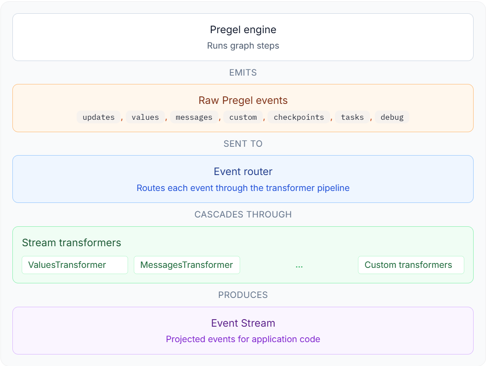

# 11. 流式执行

## 11.1. 概述

### 11.1.1. 什么是流式执行

**流式执行（`Streaming Execution`）**，是指程序在任务尚未全部完成时，就将执行过程中已经产生的中间结果、状态变化或事件持续输出给调用方，而不是等待整个任务结束后一次性返回最终结果。

简而言之：流式执行就是

> 边执行、边产生事件、边向调用方返回结果。

### 11.1.2. 什么是`LangGraph`的流式执行

**`LangGraph`** 的流式执行是指，状态图计算过程中，将节点输出、状态更新、消息增量、自定义事件或调试信息等写入流式队列，并在特定的时机将流式队列中的信息返还给调用者。

在同步执行中，这些数据最终进入内部的**同步流式队列**；在异步执行中，则进入对应的**异步队列**。调用方通过**迭代器**逐条消费这些数据，因此不必等到整张图执行完毕后再获得反馈。

### 11.1.3. `LangGraph`的流式执行`API`

**`LangGraph`** 提供了两套流式执行 **`API`**

#### 11.1.3.1. `stream/astream`

获取 **`LangGraph`** 执行过程中的业务数据或运行时数据

- **`stream`**：同步 **`API`**
- **`astream`**：异步 **`API`**

调用方通过 **`stream_mode`** 选择需要消费的内容，例如状态、节点更新、模型消息、自定义数据、检查点或任务事件。这是本章的重点。

**`stream`与`astream`的区别**

| 维度 | `stream()` | `astream()` |
|:---|:---|:---|
| 调用方式 | 同步迭代 `for chunk in graph.stream(...)` | 异步迭代 `async for chunk in graph.astream(...)` |
| 运行环境 | 普通 Python 脚本 | `asyncio` 事件循环（Jupyter、FastAPI 等） |
| 参数与输出 | 相同 `stream_mode`，语义一致 | 相同 `stream_mode`，语义一致 |
| 适用场景 | 同步批处理、CLI 工具 | `async` 服务端、结合其他异步 IO |

#### 11.1.3.2. `astream_events`

获取图运行过程中产生的 **`Runnable`** 标准事件（组件生命周期、父子调用关系、输入输出等）。详见 **[11.3. `astream_events`](#113-astream_events)**。

## 11.2. `stream/astream`

**`astream`** 是 **`stream`** 的异步版本。二者使用相同的流模式，且在参数一致时，输出数据的语义和封装格式一致；区别主要在于调用方分别使用同步迭代和异步迭代进行消费。

前面的章节我们都是通过 **`invoke`** 调用状态图。实际上，**`invoke`** 会在内部消费 **`stream`**，并把流式执行结果汇总为最终返回值；**`ainvoke`** 与 **`astream`** 的关系同理。

### 11.2.1. 输出格式版本说明

从 **`LangGraph 1.1`** 开始，**`stream/astream`** 支持两种输出格式版本：

- **`v1`**：当前默认格式。输出形态会随参数变化：
  - 单个流模式通常直接返回该模式的数据；
  - 多个流模式返回 **`(mode, data)`**；
  - 启用子图流式输出后，还会增加命名空间信息。
- **`v2`**：在 **`v1`** 基础上做了封装，统一返回 **`StreamPart`** 字典，固定包含 **`type`**、**`ns`** 和 **`data`** 三个字段，增强了输出的可读性，简化了解析难度、并补充了校验机制。

本节基于 **`v1`** 展开。示例刻意把 **`stream_mode`** 写成列表，即使每次只指定一种模式，也会得到 **`(mode, data)`** 二元组，便于观测模式名称，并且可以无缝扩展到指定多种模式的情况。

### 11.2.2. `stream_mode`

流式输出支持不同的输出模式 **`stream_mode`**，这规定了流式输出的内容（在 **`LangGraph`** 中称为 **`chunk`**）。**`stream_mode`** 可传入单个字符串或模式列表。

| 模式 | 输出内容 | 适用场景 |
|:---|:---|:---|
| **`values`** | 每个超步后的完整状态 | 需要完整状态快照 |
| **`updates`** | 节点产生的状态更新（增量） | 只关心节点输出变化 |
| **`messages`** | `messages` 状态字段的增量更新 | LLM 对话流式输出 |
| **`checkpoints`** | 检查点更新事件（需检查点存储器） | 持久化监控、中断调试 |
| **`tasks`** | 任务开始/结果事件（含触发通道、异常） | 运行时观测、任务追踪 |
| **`debug`** | `checkpoints` + `tasks` 的统一封装，附加超步编号、时间戳 | 调试排错 |
| **`custom`** | 节点/工具通过 `stream_writer` 主动写出的自定义数据 | 进度通知、阶段说明 |

为便于观察每种模式的数据结构，本节每次只启用一种模式，但仍使用列表形式传参（得到 `(mode, data)` 二元组）。

#### 11.2.2.1. `values`

**示例如下**

```python
from typing import TypedDict
from langgraph.graph import StateGraph, START, END

class OverAllState(TypedDict):
    initial_state: str
    node_a_output: str
    node_b_output: str

def node_a(state: OverAllState) -> OverAllState:
    return {
        "node_a_output": "节点A的输出"
    }

def node_b(state: OverAllState) -> OverAllState:
    return {
        "node_b_output": "节点B的输出"
    }

builder = StateGraph(state_schema=OverAllState)
builder.add_node("node_a", node_a)
builder.add_node("node_b", node_b)
builder.add_edge(START, "node_a")
builder.add_edge("node_a", "node_b")
builder.add_edge("node_b", END)

graph = builder.compile()
for chunk in graph.stream(
    {"initial_state": "初始状态"},
    stream_mode=["values"],
):
    print(chunk)
```

**运行结果如下**

```json
('values', {'initial_state': '初始状态'})
('values', {'initial_state': '初始状态', 'node_a_output': '节点A的输出'})
('values', {'initial_state': '初始状态', 'node_a_output': '节点A的输出', 'node_b_output': '节点B的输出'})
```

#### 11.2.2.2. `updates`

**示例如下**

```python
from typing import TypedDict
from langgraph.graph import StateGraph, START, END

class OverAllState(TypedDict):
    initial_state: str
    node_a_output: str
    node_b_output: str

def node_a(state: OverAllState) -> OverAllState:
    return {
        "node_a_output": "节点A的输出"
    }

def node_b(state: OverAllState) -> OverAllState:
    return {
        "node_b_output": "节点B的输出"
    }

builder = StateGraph(state_schema=OverAllState)
builder.add_node("node_a", node_a)
builder.add_node("node_b", node_b)
builder.add_edge(START, "node_a")
builder.add_edge("node_a", "node_b")
builder.add_edge("node_b", END)

graph = builder.compile()
for chunk in graph.stream(
    {"initial_state": "初始状态"},
    stream_mode=["updates"],
):
    print(chunk)
```

**运行结果如下**

```json
('updates', {'node_a': {'node_a_output': '节点A的输出'}})
('updates', {'node_b': {'node_b_output': '节点B的输出'}})
```

#### 11.2.2.3. `messages`

**示例如下**

```python
from langgraph.graph import StateGraph, START, END, MessagesState

from langchain.messages import HumanMessage
from langchain_deepseek import ChatDeepSeek

from dotenv import load_dotenv
load_dotenv(override=True)

model = ChatDeepSeek(
    model="deepseek-v4-flash",
    extra_body={
        "thinking": {
            "type": "disabled"
        }
    }
)

def llm_node(state: MessagesState) -> MessagesState:
    messages = state["messages"]
    response = model.invoke(messages)

    return {
        "messages": [response],
    }

builder = StateGraph(state_schema=MessagesState)
builder.add_node("llm_node", llm_node)
builder.add_edge(START, "llm_node")
builder.add_edge("llm_node", END)

graph = builder.compile()

for chunk in graph.stream(
        {
            "messages":[HumanMessage(content="你好!")]
        },
    stream_mode=["values","messages"],
):
    print(chunk)

```

**运行结果如下**

```json
('values', {'messages': [HumanMessage(content='你好!', additional_kwargs={}, response_metadata={}, id='0f0ff522-bc84-4ead-8228-66221903e9b4')]})
('messages', (AIMessageChunk(content='', additional_kwargs={}, response_metadata={'model_provider': 'deepseek'}, id='lc_run--019f5a6a-64cf-7573-874a-e669e00000ba', tool_calls=[], invalid_tool_calls=[], tool_call_chunks=[]), {'langgraph_step': 1, 'langgraph_node': 'llm_node', 'langgraph_triggers': ('branch:to:llm_node',), 'langgraph_path': ('__pregel_pull', 'llm_node'), 'langgraph_checkpoint_ns': 'llm_node:e0f03332-6641-0bb0-cf08-e99ffeb6c7a6', 'checkpoint_ns': 'llm_node:e0f03332-6641-0bb0-cf08-e99ffeb6c7a6', 'ls_provider': 'deepseek', 'ls_model_name': 'deepseek-v4-flash', 'ls_model_type': 'chat', 'ls_temperature': None}))
('messages', (AIMessageChunk(content='你好', additional_kwargs={}, response_metadata={'model_provider': 'deepseek'}, id='lc_run--019f5a6a-64cf-7573-874a-e669e00000ba', tool_calls=[], invalid_tool_calls=[], tool_call_chunks=[]), {'langgraph_step': 1, 'langgraph_node': 'llm_node', 'langgraph_triggers': ('branch:to:llm_node',), 'langgraph_path': ('__pregel_pull', 'llm_node'), 'langgraph_checkpoint_ns': 'llm_node:e0f03332-6641-0bb0-cf08-e99ffeb6c7a6', 'checkpoint_ns': 'llm_node:e0f03332-6641-0bb0-cf08-e99ffeb6c7a6', 'ls_provider': 'deepseek', 'ls_model_name': 'deepseek-v4-flash', 'ls_model_type': 'chat', 'ls_temperature': None}))
('messages', (AIMessageChunk(content='！', additional_kwargs={}, response_metadata={'model_provider': 'deepseek'}, id='lc_run--019f5a6a-64cf-7573-874a-e669e00000ba', tool_calls=[], invalid_tool_calls=[], tool_call_chunks=[]), {'langgraph_step': 1, 'langgraph_node': 'llm_node', 'langgraph_triggers': ('branch:to:llm_node',), 'langgraph_path': ('__pregel_pull', 'llm_node'), 'langgraph_checkpoint_ns': 'llm_node:e0f03332-6641-0bb0-cf08-e99ffeb6c7a6', 'checkpoint_ns': 'llm_node:e0f03332-6641-0bb0-cf08-e99ffeb6c7a6', 'ls_provider': 'deepseek', 'ls_model_name': 'deepseek-v4-flash', 'ls_model_type': 'chat', 'ls_temperature': None}))
('messages', (AIMessageChunk(content='很高兴', additional_kwargs={}, response_metadata={'model_provider': 'deepseek'}, id='lc_run--019f5a6a-64cf-7573-874a-e669e00000ba', tool_calls=[], invalid_tool_calls=[], tool_call_chunks=[]), {'langgraph_step': 1, 'langgraph_node': 'llm_node', 'langgraph_triggers': ('branch:to:llm_node',), 'langgraph_path': ('__pregel_pull', 'llm_node'), 'langgraph_checkpoint_ns': 'llm_node:e0f03332-6641-0bb0-cf08-e99ffeb6c7a6', 'checkpoint_ns': 'llm_node:e0f03332-6641-0bb0-cf08-e99ffeb6c7a6', 'ls_provider': 'deepseek', 'ls_model_name': 'deepseek-v4-flash', 'ls_model_type': 'chat', 'ls_temperature': None}))
('messages', (AIMessageChunk(content='见到', additional_kwargs={}, response_metadata={'model_provider': 'deepseek'}, id='lc_run--019f5a6a-64cf-7573-874a-e669e00000ba', tool_calls=[], invalid_tool_calls=[], tool_call_chunks=[]), {'langgraph_step': 1, 'langgraph_node': 'llm_node', 'langgraph_triggers': ('branch:to:llm_node',), 'langgraph_path': ('__pregel_pull', 'llm_node'), 'langgraph_checkpoint_ns': 'llm_node:e0f03332-6641-0bb0-cf08-e99ffeb6c7a6', 'checkpoint_ns': 'llm_node:e0f03332-6641-0bb0-cf08-e99ffeb6c7a6', 'ls_provider': 'deepseek', 'ls_model_name': 'deepseek-v4-flash', 'ls_model_type': 'chat', 'ls_temperature': None}))
('messages', (AIMessageChunk(content='你', additional_kwargs={}, response_metadata={'model_provider': 'deepseek'}, id='lc_run--019f5a6a-64cf-7573-874a-e669e00000ba', tool_calls=[], invalid_tool_calls=[], tool_call_chunks=[]), {'langgraph_step': 1, 'langgraph_node': 'llm_node', 'langgraph_triggers': ('branch:to:llm_node',), 'langgraph_path': ('__pregel_pull', 'llm_node'), 'langgraph_checkpoint_ns': 'llm_node:e0f03332-6641-0bb0-cf08-e99ffeb6c7a6', 'checkpoint_ns': 'llm_node:e0f03332-6641-0bb0-cf08-e99ffeb6c7a6', 'ls_provider': 'deepseek', 'ls_model_name': 'deepseek-v4-flash', 'ls_model_type': 'chat', 'ls_temperature': None}))
('messages', (AIMessageChunk(content='，', additional_kwargs={}, response_metadata={'model_provider': 'deepseek'}, id='lc_run--019f5a6a-64cf-7573-874a-e669e00000ba', tool_calls=[], invalid_tool_calls=[], tool_call_chunks=[]), {'langgraph_step': 1, 'langgraph_node': 'llm_node', 'langgraph_triggers': ('branch:to:llm_node',), 'langgraph_path': ('__pregel_pull', 'llm_node'), 'langgraph_checkpoint_ns': 'llm_node:e0f03332-6641-0bb0-cf08-e99ffeb6c7a6', 'checkpoint_ns': 'llm_node:e0f03332-6641-0bb0-cf08-e99ffeb6c7a6', 'ls_provider': 'deepseek', 'ls_model_name': 'deepseek-v4-flash', 'ls_model_type': 'chat', 'ls_temperature': None}))
('messages', (AIMessageChunk(content='有什么', additional_kwargs={}, response_metadata={'model_provider': 'deepseek'}, id='lc_run--019f5a6a-64cf-7573-874a-e669e00000ba', tool_calls=[], invalid_tool_calls=[], tool_call_chunks=[]), {'langgraph_step': 1, 'langgraph_node': 'llm_node', 'langgraph_triggers': ('branch:to:llm_node',), 'langgraph_path': ('__pregel_pull', 'llm_node'), 'langgraph_checkpoint_ns': 'llm_node:e0f03332-6641-0bb0-cf08-e99ffeb6c7a6', 'checkpoint_ns': 'llm_node:e0f03332-6641-0bb0-cf08-e99ffeb6c7a6', 'ls_provider': 'deepseek', 'ls_model_name': 'deepseek-v4-flash', 'ls_model_type': 'chat', 'ls_temperature': None}))
('messages', (AIMessageChunk(content='可以', additional_kwargs={}, response_metadata={'model_provider': 'deepseek'}, id='lc_run--019f5a6a-64cf-7573-874a-e669e00000ba', tool_calls=[], invalid_tool_calls=[], tool_call_chunks=[]), {'langgraph_step': 1, 'langgraph_node': 'llm_node', 'langgraph_triggers': ('branch:to:llm_node',), 'langgraph_path': ('__pregel_pull', 'llm_node'), 'langgraph_checkpoint_ns': 'llm_node:e0f03332-6641-0bb0-cf08-e99ffeb6c7a6', 'checkpoint_ns': 'llm_node:e0f03332-6641-0bb0-cf08-e99ffeb6c7a6', 'ls_provider': 'deepseek', 'ls_model_name': 'deepseek-v4-flash', 'ls_model_type': 'chat', 'ls_temperature': None}))
('messages', (AIMessageChunk(content='帮', additional_kwargs={}, response_metadata={'model_provider': 'deepseek'}, id='lc_run--019f5a6a-64cf-7573-874a-e669e00000ba', tool_calls=[], invalid_tool_calls=[], tool_call_chunks=[]), {'langgraph_step': 1, 'langgraph_node': 'llm_node', 'langgraph_triggers': ('branch:to:llm_node',), 'langgraph_path': ('__pregel_pull', 'llm_node'), 'langgraph_checkpoint_ns': 'llm_node:e0f03332-6641-0bb0-cf08-e99ffeb6c7a6', 'checkpoint_ns': 'llm_node:e0f03332-6641-0bb0-cf08-e99ffeb6c7a6', 'ls_provider': 'deepseek', 'ls_model_name': 'deepseek-v4-flash', 'ls_model_type': 'chat', 'ls_temperature': None}))
('messages', (AIMessageChunk(content='你的', additional_kwargs={}, response_metadata={'model_provider': 'deepseek'}, id='lc_run--019f5a6a-64cf-7573-874a-e669e00000ba', tool_calls=[], invalid_tool_calls=[], tool_call_chunks=[]), {'langgraph_step': 1, 'langgraph_node': 'llm_node', 'langgraph_triggers': ('branch:to:llm_node',), 'langgraph_path': ('__pregel_pull', 'llm_node'), 'langgraph_checkpoint_ns': 'llm_node:e0f03332-6641-0bb0-cf08-e99ffeb6c7a6', 'checkpoint_ns': 'llm_node:e0f03332-6641-0bb0-cf08-e99ffeb6c7a6', 'ls_provider': 'deepseek', 'ls_model_name': 'deepseek-v4-flash', 'ls_model_type': 'chat', 'ls_temperature': None}))
('messages', (AIMessageChunk(content='吗', additional_kwargs={}, response_metadata={'model_provider': 'deepseek'}, id='lc_run--019f5a6a-64cf-7573-874a-e669e00000ba', tool_calls=[], invalid_tool_calls=[], tool_call_chunks=[]), {'langgraph_step': 1, 'langgraph_node': 'llm_node', 'langgraph_triggers': ('branch:to:llm_node',), 'langgraph_path': ('__pregel_pull', 'llm_node'), 'langgraph_checkpoint_ns': 'llm_node:e0f03332-6641-0bb0-cf08-e99ffeb6c7a6', 'checkpoint_ns': 'llm_node:e0f03332-6641-0bb0-cf08-e99ffeb6c7a6', 'ls_provider': 'deepseek', 'ls_model_name': 'deepseek-v4-flash', 'ls_model_type': 'chat', 'ls_temperature': None}))
('messages', (AIMessageChunk(content='？', additional_kwargs={}, response_metadata={'model_provider': 'deepseek'}, id='lc_run--019f5a6a-64cf-7573-874a-e669e00000ba', tool_calls=[], invalid_tool_calls=[], tool_call_chunks=[]), {'langgraph_step': 1, 'langgraph_node': 'llm_node', 'langgraph_triggers': ('branch:to:llm_node',), 'langgraph_path': ('__pregel_pull', 'llm_node'), 'langgraph_checkpoint_ns': 'llm_node:e0f03332-6641-0bb0-cf08-e99ffeb6c7a6', 'checkpoint_ns': 'llm_node:e0f03332-6641-0bb0-cf08-e99ffeb6c7a6', 'ls_provider': 'deepseek', 'ls_model_name': 'deepseek-v4-flash', 'ls_model_type': 'chat', 'ls_temperature': None}))
('messages', (AIMessageChunk(content='无论是', additional_kwargs={}, response_metadata={'model_provider': 'deepseek'}, id='lc_run--019f5a6a-64cf-7573-874a-e669e00000ba', tool_calls=[], invalid_tool_calls=[], tool_call_chunks=[]), {'langgraph_step': 1, 'langgraph_node': 'llm_node', 'langgraph_triggers': ('branch:to:llm_node',), 'langgraph_path': ('__pregel_pull', 'llm_node'), 'langgraph_checkpoint_ns': 'llm_node:e0f03332-6641-0bb0-cf08-e99ffeb6c7a6', 'checkpoint_ns': 'llm_node:e0f03332-6641-0bb0-cf08-e99ffeb6c7a6', 'ls_provider': 'deepseek', 'ls_model_name': 'deepseek-v4-flash', 'ls_model_type': 'chat', 'ls_temperature': None}))
('messages', (AIMessageChunk(content='聊天', additional_kwargs={}, response_metadata={'model_provider': 'deepseek'}, id='lc_run--019f5a6a-64cf-7573-874a-e669e00000ba', tool_calls=[], invalid_tool_calls=[], tool_call_chunks=[]), {'langgraph_step': 1, 'langgraph_node': 'llm_node', 'langgraph_triggers': ('branch:to:llm_node',), 'langgraph_path': ('__pregel_pull', 'llm_node'), 'langgraph_checkpoint_ns': 'llm_node:e0f03332-6641-0bb0-cf08-e99ffeb6c7a6', 'checkpoint_ns': 'llm_node:e0f03332-6641-0bb0-cf08-e99ffeb6c7a6', 'ls_provider': 'deepseek', 'ls_model_name': 'deepseek-v4-flash', 'ls_model_type': 'chat', 'ls_temperature': None}))
('messages', (AIMessageChunk(content='、', additional_kwargs={}, response_metadata={'model_provider': 'deepseek'}, id='lc_run--019f5a6a-64cf-7573-874a-e669e00000ba', tool_calls=[], invalid_tool_calls=[], tool_call_chunks=[]), {'langgraph_step': 1, 'langgraph_node': 'llm_node', 'langgraph_triggers': ('branch:to:llm_node',), 'langgraph_path': ('__pregel_pull', 'llm_node'), 'langgraph_checkpoint_ns': 'llm_node:e0f03332-6641-0bb0-cf08-e99ffeb6c7a6', 'checkpoint_ns': 'llm_node:e0f03332-6641-0bb0-cf08-e99ffeb6c7a6', 'ls_provider': 'deepseek', 'ls_model_name': 'deepseek-v4-flash', 'ls_model_type': 'chat', 'ls_temperature': None}))
('messages', (AIMessageChunk(content='解答', additional_kwargs={}, response_metadata={'model_provider': 'deepseek'}, id='lc_run--019f5a6a-64cf-7573-874a-e669e00000ba', tool_calls=[], invalid_tool_calls=[], tool_call_chunks=[]), {'langgraph_step': 1, 'langgraph_node': 'llm_node', 'langgraph_triggers': ('branch:to:llm_node',), 'langgraph_path': ('__pregel_pull', 'llm_node'), 'langgraph_checkpoint_ns': 'llm_node:e0f03332-6641-0bb0-cf08-e99ffeb6c7a6', 'checkpoint_ns': 'llm_node:e0f03332-6641-0bb0-cf08-e99ffeb6c7a6', 'ls_provider': 'deepseek', 'ls_model_name': 'deepseek-v4-flash', 'ls_model_type': 'chat', 'ls_temperature': None}))
('messages', (AIMessageChunk(content='问题', additional_kwargs={}, response_metadata={'model_provider': 'deepseek'}, id='lc_run--019f5a6a-64cf-7573-874a-e669e00000ba', tool_calls=[], invalid_tool_calls=[], tool_call_chunks=[]), {'langgraph_step': 1, 'langgraph_node': 'llm_node', 'langgraph_triggers': ('branch:to:llm_node',), 'langgraph_path': ('__pregel_pull', 'llm_node'), 'langgraph_checkpoint_ns': 'llm_node:e0f03332-6641-0bb0-cf08-e99ffeb6c7a6', 'checkpoint_ns': 'llm_node:e0f03332-6641-0bb0-cf08-e99ffeb6c7a6', 'ls_provider': 'deepseek', 'ls_model_name': 'deepseek-v4-flash', 'ls_model_type': 'chat', 'ls_temperature': None}))
('messages', (AIMessageChunk(content='，', additional_kwargs={}, response_metadata={'model_provider': 'deepseek'}, id='lc_run--019f5a6a-64cf-7573-874a-e669e00000ba', tool_calls=[], invalid_tool_calls=[], tool_call_chunks=[]), {'langgraph_step': 1, 'langgraph_node': 'llm_node', 'langgraph_triggers': ('branch:to:llm_node',), 'langgraph_path': ('__pregel_pull', 'llm_node'), 'langgraph_checkpoint_ns': 'llm_node:e0f03332-6641-0bb0-cf08-e99ffeb6c7a6', 'checkpoint_ns': 'llm_node:e0f03332-6641-0bb0-cf08-e99ffeb6c7a6', 'ls_provider': 'deepseek', 'ls_model_name': 'deepseek-v4-flash', 'ls_model_type': 'chat', 'ls_temperature': None}))
('messages', (AIMessageChunk(content='还是', additional_kwargs={}, response_metadata={'model_provider': 'deepseek'}, id='lc_run--019f5a6a-64cf-7573-874a-e669e00000ba', tool_calls=[], invalid_tool_calls=[], tool_call_chunks=[]), {'langgraph_step': 1, 'langgraph_node': 'llm_node', 'langgraph_triggers': ('branch:to:llm_node',), 'langgraph_path': ('__pregel_pull', 'llm_node'), 'langgraph_checkpoint_ns': 'llm_node:e0f03332-6641-0bb0-cf08-e99ffeb6c7a6', 'checkpoint_ns': 'llm_node:e0f03332-6641-0bb0-cf08-e99ffeb6c7a6', 'ls_provider': 'deepseek', 'ls_model_name': 'deepseek-v4-flash', 'ls_model_type': 'chat', 'ls_temperature': None}))
('messages', (AIMessageChunk(content='需要', additional_kwargs={}, response_metadata={'model_provider': 'deepseek'}, id='lc_run--019f5a6a-64cf-7573-874a-e669e00000ba', tool_calls=[], invalid_tool_calls=[], tool_call_chunks=[]), {'langgraph_step': 1, 'langgraph_node': 'llm_node', 'langgraph_triggers': ('branch:to:llm_node',), 'langgraph_path': ('__pregel_pull', 'llm_node'), 'langgraph_checkpoint_ns': 'llm_node:e0f03332-6641-0bb0-cf08-e99ffeb6c7a6', 'checkpoint_ns': 'llm_node:e0f03332-6641-0bb0-cf08-e99ffeb6c7a6', 'ls_provider': 'deepseek', 'ls_model_name': 'deepseek-v4-flash', 'ls_model_type': 'chat', 'ls_temperature': None}))
('messages', (AIMessageChunk(content='帮助', additional_kwargs={}, response_metadata={'model_provider': 'deepseek'}, id='lc_run--019f5a6a-64cf-7573-874a-e669e00000ba', tool_calls=[], invalid_tool_calls=[], tool_call_chunks=[]), {'langgraph_step': 1, 'langgraph_node': 'llm_node', 'langgraph_triggers': ('branch:to:llm_node',), 'langgraph_path': ('__pregel_pull', 'llm_node'), 'langgraph_checkpoint_ns': 'llm_node:e0f03332-6641-0bb0-cf08-e99ffeb6c7a6', 'checkpoint_ns': 'llm_node:e0f03332-6641-0bb0-cf08-e99ffeb6c7a6', 'ls_provider': 'deepseek', 'ls_model_name': 'deepseek-v4-flash', 'ls_model_type': 'chat', 'ls_temperature': None}))
('messages', (AIMessageChunk(content='，', additional_kwargs={}, response_metadata={'model_provider': 'deepseek'}, id='lc_run--019f5a6a-64cf-7573-874a-e669e00000ba', tool_calls=[], invalid_tool_calls=[], tool_call_chunks=[]), {'langgraph_step': 1, 'langgraph_node': 'llm_node', 'langgraph_triggers': ('branch:to:llm_node',), 'langgraph_path': ('__pregel_pull', 'llm_node'), 'langgraph_checkpoint_ns': 'llm_node:e0f03332-6641-0bb0-cf08-e99ffeb6c7a6', 'checkpoint_ns': 'llm_node:e0f03332-6641-0bb0-cf08-e99ffeb6c7a6', 'ls_provider': 'deepseek', 'ls_model_name': 'deepseek-v4-flash', 'ls_model_type': 'chat', 'ls_temperature': None}))
('messages', (AIMessageChunk(content='都可以', additional_kwargs={}, response_metadata={'model_provider': 'deepseek'}, id='lc_run--019f5a6a-64cf-7573-874a-e669e00000ba', tool_calls=[], invalid_tool_calls=[], tool_call_chunks=[]), {'langgraph_step': 1, 'langgraph_node': 'llm_node', 'langgraph_triggers': ('branch:to:llm_node',), 'langgraph_path': ('__pregel_pull', 'llm_node'), 'langgraph_checkpoint_ns': 'llm_node:e0f03332-6641-0bb0-cf08-e99ffeb6c7a6', 'checkpoint_ns': 'llm_node:e0f03332-6641-0bb0-cf08-e99ffeb6c7a6', 'ls_provider': 'deepseek', 'ls_model_name': 'deepseek-v4-flash', 'ls_model_type': 'chat', 'ls_temperature': None}))
('messages', (AIMessageChunk(content='告诉我', additional_kwargs={}, response_metadata={'model_provider': 'deepseek'}, id='lc_run--019f5a6a-64cf-7573-874a-e669e00000ba', tool_calls=[], invalid_tool_calls=[], tool_call_chunks=[]), {'langgraph_step': 1, 'langgraph_node': 'llm_node', 'langgraph_triggers': ('branch:to:llm_node',), 'langgraph_path': ('__pregel_pull', 'llm_node'), 'langgraph_checkpoint_ns': 'llm_node:e0f03332-6641-0bb0-cf08-e99ffeb6c7a6', 'checkpoint_ns': 'llm_node:e0f03332-6641-0bb0-cf08-e99ffeb6c7a6', 'ls_provider': 'deepseek', 'ls_model_name': 'deepseek-v4-flash', 'ls_model_type': 'chat', 'ls_temperature': None}))
('messages', (AIMessageChunk(content='哦', additional_kwargs={}, response_metadata={'model_provider': 'deepseek'}, id='lc_run--019f5a6a-64cf-7573-874a-e669e00000ba', tool_calls=[], invalid_tool_calls=[], tool_call_chunks=[]), {'langgraph_step': 1, 'langgraph_node': 'llm_node', 'langgraph_triggers': ('branch:to:llm_node',), 'langgraph_path': ('__pregel_pull', 'llm_node'), 'langgraph_checkpoint_ns': 'llm_node:e0f03332-6641-0bb0-cf08-e99ffeb6c7a6', 'checkpoint_ns': 'llm_node:e0f03332-6641-0bb0-cf08-e99ffeb6c7a6', 'ls_provider': 'deepseek', 'ls_model_name': 'deepseek-v4-flash', 'ls_model_type': 'chat', 'ls_temperature': None}))
('messages', (AIMessageChunk(content='！', additional_kwargs={}, response_metadata={'model_provider': 'deepseek'}, id='lc_run--019f5a6a-64cf-7573-874a-e669e00000ba', tool_calls=[], invalid_tool_calls=[], tool_call_chunks=[]), {'langgraph_step': 1, 'langgraph_node': 'llm_node', 'langgraph_triggers': ('branch:to:llm_node',), 'langgraph_path': ('__pregel_pull', 'llm_node'), 'langgraph_checkpoint_ns': 'llm_node:e0f03332-6641-0bb0-cf08-e99ffeb6c7a6', 'checkpoint_ns': 'llm_node:e0f03332-6641-0bb0-cf08-e99ffeb6c7a6', 'ls_provider': 'deepseek', 'ls_model_name': 'deepseek-v4-flash', 'ls_model_type': 'chat', 'ls_temperature': None}))
('messages', (AIMessageChunk(content='😊', additional_kwargs={}, response_metadata={'model_provider': 'deepseek'}, id='lc_run--019f5a6a-64cf-7573-874a-e669e00000ba', tool_calls=[], invalid_tool_calls=[], tool_call_chunks=[]), {'langgraph_step': 1, 'langgraph_node': 'llm_node', 'langgraph_triggers': ('branch:to:llm_node',), 'langgraph_path': ('__pregel_pull', 'llm_node'), 'langgraph_checkpoint_ns': 'llm_node:e0f03332-6641-0bb0-cf08-e99ffeb6c7a6', 'checkpoint_ns': 'llm_node:e0f03332-6641-0bb0-cf08-e99ffeb6c7a6', 'ls_provider': 'deepseek', 'ls_model_name': 'deepseek-v4-flash', 'ls_model_type': 'chat', 'ls_temperature': None}))
('messages', (AIMessageChunk(content='', additional_kwargs={}, response_metadata={'finish_reason': 'stop', 'model_name': 'deepseek-v4-flash', 'system_fingerprint': 'fp_8b330d02d0_prod0820_fp8_kvcache_20260402', 'model_provider': 'deepseek'}, id='lc_run--019f5a6a-64cf-7573-874a-e669e00000ba', tool_calls=[], invalid_tool_calls=[], usage_metadata={'input_tokens': 6, 'output_tokens': 28, 'total_tokens': 34, 'input_token_details': {'cache_read': 0}, 'output_token_details': {}}, tool_call_chunks=[]), {'langgraph_step': 1, 'langgraph_node': 'llm_node', 'langgraph_triggers': ('branch:to:llm_node',), 'langgraph_path': ('__pregel_pull', 'llm_node'), 'langgraph_checkpoint_ns': 'llm_node:e0f03332-6641-0bb0-cf08-e99ffeb6c7a6', 'checkpoint_ns': 'llm_node:e0f03332-6641-0bb0-cf08-e99ffeb6c7a6', 'ls_provider': 'deepseek', 'ls_model_name': 'deepseek-v4-flash', 'ls_model_type': 'chat', 'ls_temperature': None}))
('messages', (AIMessageChunk(content='', additional_kwargs={}, response_metadata={}, id='lc_run--019f5a6a-64cf-7573-874a-e669e00000ba', tool_calls=[], invalid_tool_calls=[], tool_call_chunks=[], chunk_position='last'), {'langgraph_step': 1, 'langgraph_node': 'llm_node', 'langgraph_triggers': ('branch:to:llm_node',), 'langgraph_path': ('__pregel_pull', 'llm_node'), 'langgraph_checkpoint_ns': 'llm_node:e0f03332-6641-0bb0-cf08-e99ffeb6c7a6', 'checkpoint_ns': 'llm_node:e0f03332-6641-0bb0-cf08-e99ffeb6c7a6', 'ls_provider': 'deepseek', 'ls_model_name': 'deepseek-v4-flash', 'ls_model_type': 'chat', 'ls_temperature': None}))
('values', {'messages': [HumanMessage(content='你好!', additional_kwargs={}, response_metadata={}, id='0f0ff522-bc84-4ead-8228-66221903e9b4'), AIMessage(content='你好！很高兴见到你，有什么可以帮你的吗？无论是聊天、解答问题，还是需要帮助，都可以告诉我哦！😊', additional_kwargs={}, response_metadata={'finish_reason': 'stop', 'model_name': 'deepseek-v4-flash', 'system_fingerprint': 'fp_8b330d02d0_prod0820_fp8_kvcache_20260402', 'model_provider': 'deepseek'}, id='lc_run--019f5a6a-64cf-7573-874a-e669e00000ba', tool_calls=[], invalid_tool_calls=[], usage_metadata={'input_tokens': 6, 'output_tokens': 28, 'total_tokens': 34, 'input_token_details': {'cache_read': 0}, 'output_token_details': {}})]})
```

#### 11.2.2.4. `checkpoints`

**`checkpoints`** 模式依赖检查点存储器。它输出的是运行时构造的检查点事件，其结构接近 **`get_state()`** 返回的状态快照.

**示例如下**

```python
from typing import TypedDict
from langgraph.graph import StateGraph, START, END
from langgraph.checkpoint.memory import InMemorySaver

from langgraph.types import interrupt, Command

class OverAllState(TypedDict):
    initial_state: str
    parallel_node_a_1: str
    parallel_node_a_2: str
    node_b_output: str

def parallel_node_a_1(state: OverAllState) -> OverAllState:
    return {
        "parallel_node_a_1": "并行节点A-1的输出"
    }

def parallel_node_a_2(state: OverAllState) -> OverAllState:
    return {
        "parallel_node_a_2": "并行节点A-2的输出"
    }

def node_b(state: OverAllState) -> OverAllState:
    interrupt("hello")
    return {
        "node_b_output": "节点B的输出"
    }

builder = StateGraph(state_schema=OverAllState)
builder.add_node("parallel_node_a_1", parallel_node_a_1)
builder.add_node("parallel_node_a_2", parallel_node_a_2)
builder.add_node("node_b", node_b)
builder.add_edge(START, "parallel_node_a_1")
builder.add_edge(START, "parallel_node_a_2")
builder.add_edge(["parallel_node_a_1", "parallel_node_a_2"], "node_b")
builder.add_edge("node_b", END)

checkpointer = InMemorySaver()
graph = builder.compile(checkpointer=checkpointer)

config = {"configurable": {"thread_id": "123"}}
for chunk in graph.stream(
    {"initial_state": "初始状态"},
    stream_mode=["checkpoints"],
    config=config
):
    print(chunk)

print('=' * 30, '-> 中断前后分界线 <-', '=' * 30)

for chunk in graph.stream(
    Command(resume=""),
    stream_mode=["checkpoints"],
    config=config
):
    print(chunk)
```

**运行结果如下**

```python
# === 第 1 个检查点：input 阶段（step=-1），仅有 __start__ 任务 ===
(
    'checkpoints',
    {
        'config': {
            'configurable': {
                'checkpoint_ns': '',
                'thread_id': '123',
                'checkpoint_id': '1f17e909-a431-6009-bfff-dd033caf8a09'
            }
        },
        'parent_config': None,
        'values': {},
        'metadata': {
            'source': 'input',
            'step': -1,
            'parents': {}
        },
        'next': ['__start__'],
        'tasks': [
            {
                'id': '6f4add75-8430-fd5b-46d5-93f40b5f142a',
                'name': '__start__',
                'interrupts': (),
                'state': None
            }
        ]
    }
)

# === 第 2 个检查点：loop 阶段（step=0），两个并行节点待执行 ===
(
    'checkpoints',
    {
        'config': {
            'configurable': {
                'checkpoint_ns': '',
                'thread_id': '123',
                'checkpoint_id': '1f17e909-a436-66f0-8000-61f51460d18e'
            }
        },
        'parent_config': {
            'configurable': {
                'checkpoint_ns': '',
                'thread_id': '123',
                'checkpoint_id': '1f17e909-a431-6009-bfff-dd033caf8a09'
            }
        },
        'values': {
            'initial_state': '初始状态'
        },
        'metadata': {
            'source': 'loop',
            'step': 0,
            'parents': {}
        },
        'next': ['parallel_node_a_1', 'parallel_node_a_2'],
        'tasks': [
            {
                'id': '0aa4a4d7-1e7f-f02f-25ef-46c088c7e1e0',
                'name': 'parallel_node_a_1',
                'interrupts': (),
                'state': None
            },
            {
                'id': 'd3670671-0bdb-6574-be1e-915be93b239e',
                'name': 'parallel_node_a_2',
                'interrupts': (),
                'state': None
            }
        ]
    }
)

# === 第 3 个检查点：loop 阶段（step=1），并行节点执行完毕，node_b 待执行 ===
(
    'checkpoints',
    {
        'config': {
            'configurable': {
                'checkpoint_ns': '',
                'thread_id': '123',
                'checkpoint_id': '1f17e909-a439-67c6-8001-f441fbddc2f9'
            }
        },
        'parent_config': {
            'configurable': {
                'checkpoint_ns': '',
                'thread_id': '123',
                'checkpoint_id': '1f17e909-a436-66f0-8000-61f51460d18e'
            }
        },
        'values': {
            'initial_state': '初始状态',
            'parallel_node_a_1': '并行节点A-1的输出',
            'parallel_node_a_2': '并行节点A-2的输出'
        },
        'metadata': {
            'source': 'loop',
            'step': 1,
            'parents': {}
        },
        'next': ['node_b'],
        'tasks': [
            {
                'id': 'cc97ac77-de6f-470b-d3c5-d0a94ea5534e',
                'name': 'node_b',
                'interrupts': (),
                'state': None
            }
        ]
    }
)

============================== -> 中断前后分界线 <- ==============================

# === 第 4 个检查点：中断发生时（step=1），node_b 的 interrupts 字段包含中断信息 ===
(
    'checkpoints',
    {
        'config': {
            'configurable': {
                'checkpoint_ns': '',
                'thread_id': '123',
                'checkpoint_id': '1f17e909-a439-67c6-8001-f441fbddc2f9'
            }
        },
        'parent_config': {
            'configurable': {
                'thread_id': '123',
                'checkpoint_ns': '',
                'checkpoint_id': '1f17e909-a436-66f0-8000-61f51460d18e'
            }
        },
        'values': {
            'initial_state': '初始状态',
            'parallel_node_a_1': '并行节点A-1的输出',
            'parallel_node_a_2': '并行节点A-2的输出'
        },
        'metadata': {
            'source': 'loop',
            'step': 1,
            'parents': {}
        },
        'next': ['node_b'],
        'tasks': [
            {
                'id': 'cc97ac77-de6f-470b-d3c5-d0a94ea5534e',
                'name': 'node_b',
                'interrupts': (
                    {
                        'value': 'hello',
                        'id': '486f817f7367de26620067969c8780eb'
                    },
                ),
                'state': None
            }
        ]
    }
)

# === 第 5 个检查点：resume 后（step=2），node_b 执行完毕，next 为空 ===
(
    'checkpoints',
    {
        'config': {
            'configurable': {
                'checkpoint_ns': '',
                'thread_id': '123',
                'checkpoint_id': '1f17e926-5137-6203-8002-4e1f7ffb6aa1'
            }
        },
        'parent_config': {
            'configurable': {
                'checkpoint_ns': '',
                'thread_id': '123',
                'checkpoint_id': '1f17e909-a439-67c6-8001-f441fbddc2f9'
            }
        },
        'values': {
            'initial_state': '初始状态',
            'parallel_node_a_1': '并行节点A-1的输出',
            'parallel_node_a_2': '并行节点A-2的输出',
            'node_b_output': '节点B的输出'
        },
        'metadata': {
            'source': 'loop',
            'step': 2,
            'parents': {}
        },
        'next': [],
        'tasks': []
    }
)
```

**查看历史检查点列表**

```python
list(graph.get_state_history(config=config))
```

**运行结果如下**

```json
[
    StateSnapshot(
        values={
            'initial_state': '初始状态',
            'parallel_node_a_1': '并行节点A-1的输出',
            'parallel_node_a_2': '并行节点A-2的输出',
            'node_b_output': '节点B的输出'
        },
        next=(),
        config={
            'configurable': {
                'thread_id': '123',
                'checkpoint_ns': '',
                'checkpoint_id': '1f16eb81-f230-641b-8002-53e494a0e53c'
            }
        },
        metadata={
            'source': 'loop',
            'step': 2,
            'parents': {}
        },
        created_at='2026-06-23T04:00:50.062223+00:00',
        parent_config={
            'configurable': {
                'thread_id': '123',
                'checkpoint_ns': '',
                'checkpoint_id': '1f16eb81-f229-6a9b-8001-4049f4629aea'
            }
        },
        tasks=(),
        interrupts=()
    ),

    StateSnapshot(
        values={
            'initial_state': '初始状态',
            'parallel_node_a_1': '并行节点A-1的输出',
            'parallel_node_a_2': '并行节点A-2的输出'
        },
        next=(
            'node_b',
        ),
        config={
            'configurable': {
                'thread_id': '123',
                'checkpoint_ns': '',
                'checkpoint_id': '1f16eb81-f229-6a9b-8001-4049f4629aea'
            }
        },
        metadata={
            'source': 'loop',
            'step': 1,
            'parents': {}
        },
        created_at='2026-06-23T04:00:50.059522+00:00',
        parent_config={
            'configurable': {
                'thread_id': '123',
                'checkpoint_ns': '',
                'checkpoint_id': '1f16eb81-f225-646d-8000-b7e7c665f75a'
            }
        },
        tasks=(
            PregelTask(
                id='f2153246-63f8-7422-31f6-2712d781be78',
                name='node_b',
                path=(
                    '__pregel_pull',
                    'node_b'
                ),
                error=None,
                interrupts=(
                    Interrupt(
                        value='hello',
                        id='6e3aa823181df313cfac730c024f4ed7'
                    ),
                ),
                state=None,
                result={
                    'node_b_output': '节点B的输出'
                }
            ),
        ),
        interrupts=(
            Interrupt(
                value='hello',
                id='6e3aa823181df313cfac730c024f4ed7'
            ),
        )
    ),

    StateSnapshot(
        values={
            'initial_state': '初始状态'
        },
        next=(
            'parallel_node_a_1',
            'parallel_node_a_2'
        ),
        config={
            'configurable': {
                'thread_id': '123',
                'checkpoint_ns': '',
                'checkpoint_id': '1f16eb81-f225-646d-8000-b7e7c665f75a'
            }
        },
        metadata={
            'source': 'loop',
            'step': 0,
            'parents': {}
        },
        created_at='2026-06-23T04:00:50.057725+00:00',
        parent_config={
            'configurable': {
                'thread_id': '123',
                'checkpoint_ns': '',
                'checkpoint_id': '1f16eb81-f221-6a80-bfff-d157e04c0492'
            }
        },
        tasks=(
            PregelTask(
                id='419afd20-961a-9a90-49dd-d19f1448ebe0',
                name='parallel_node_a_1',
                path=(
                    '__pregel_pull',
                    'parallel_node_a_1'
                ),
                error=None,
                interrupts=(),
                state=None,
                result={
                    'parallel_node_a_1': '并行节点A-1的输出'
                }
            ),
            PregelTask(
                id='339d1e80-39f2-24d5-c677-3fb3f8314fd6',
                name='parallel_node_a_2',
                path=(
                    '__pregel_pull',
                    'parallel_node_a_2'
                ),
                error=None,
                interrupts=(),
                state=None,
                result={
                    'parallel_node_a_2': '并行节点A-2的输出'
                }
            )
        ),
        interrupts=()
    ),

    StateSnapshot(
        values={},
        next=(
            '__start__',
        ),
        config={
            'configurable': {
                'thread_id': '123',
                'checkpoint_ns': '',
                'checkpoint_id': '1f16eb81-f221-6a80-bfff-d157e04c0492'
            }
        },
        metadata={
            'source': 'input',
            'step': -1,
            'parents': {}
        },
        created_at='2026-06-23T04:00:50.056245+00:00',
        parent_config=None,
        tasks=(
            PregelTask(
                id='20116610-8f9e-c556-b647-778737961e5a',
                name='__start__',
                path=(
                    '__pregel_pull',
                    '__start__'
                ),
                error=None,
                interrupts=(),
                state=None,
                result={
                    'initial_state': '初始状态'
                }
            ),
        ),
        interrupts=()
    )
]
```

| 对比维度 | `get_state_history()` | `checkpoints` 流 |
|:---|:---|:---|
| 排序方式 | 时间倒序（最新在前） | 超步编号升序（正向执行顺序） |
| 顶层 `interrupts` | 有 | **无**（中断信息附着在 `tasks[].interrupts` 中） |

**中断时序说明**：检查点 `chunk` 在超步**第一阶段**输出，中断在**第二阶段**触发。因此中断发生时最新检查点仍为上一步（`step=1`），任务中断信息尚为空；恢复执行后第一阶段重新输出 `step=1` 检查点时，中断信息已被记录。

#### 11.2.2.5. `tasks`

**`tasks`** 模式以任务为单位输出开始事件和结果事件。它比 **`updates`** 更偏向运行时观测：除了任务结果，还会暴露任务输入、触发通道、异常和中断信息。

**示例如下**

```python
from typing import TypedDict
from langgraph.graph import StateGraph, START, END

class OverAllState(TypedDict):
    initial_state: str
    parallel_node_a_1: str
    parallel_node_a_2: str
    node_b_output: str

def parallel_node_a_1(state: OverAllState) -> OverAllState:
    return {
        "parallel_node_a_1": "并行节点A-1的输出"
    }

def parallel_node_a_2(state: OverAllState) -> OverAllState:
    return {
        "parallel_node_a_2": "并行节点A-2的输出"
    }

def node_b(state: OverAllState) -> OverAllState:
    return {
        "node_b_output": "节点B的输出"
    }

builder = StateGraph(state_schema=OverAllState)
builder.add_node("parallel_node_a_1", parallel_node_a_1)
builder.add_node("parallel_node_a_2", parallel_node_a_2)
builder.add_node("node_b", node_b)
builder.add_edge(START, "parallel_node_a_1")
builder.add_edge(START, "parallel_node_a_2")
builder.add_edge(["parallel_node_a_1", "parallel_node_a_2"], "node_b")
builder.add_edge("node_b", END)

graph = builder.compile()

for chunk in graph.stream(
    {"initial_state": "初始状态"},
    stream_mode=["tasks"]
):
    print(chunk)
```

**运行结果如下**

```json
(
    'tasks',
    {
        'id': '0b0c1e51-456f-d37c-346c-2109d78f8c2a',
        'name': 'parallel_node_a_1',
        'input': {
            'initial_state': '初始状态'
        },
        'triggers': (
            'branch:to:parallel_node_a_1',
        )
    }
)

(
    'tasks',
    {
        'id': '018ab5c2-0a5a-9094-8876-05668d3f27e0',
        'name': 'parallel_node_a_2',
        'input': {
            'initial_state': '初始状态'
        },
        'triggers': (
            'branch:to:parallel_node_a_2',
        )
    }
)

(
    'tasks',
    {
        'id': '0b0c1e51-456f-d37c-346c-2109d78f8c2a',
        'name': 'parallel_node_a_1',
        'error': None,
        'result': {
            'parallel_node_a_1': '并行节点A-1的输出'
        },
        'interrupts': []
    }
)

(
    'tasks',
    {
        'id': '018ab5c2-0a5a-9094-8876-05668d3f27e0',
        'name': 'parallel_node_a_2',
        'error': None,
        'result': {
            'parallel_node_a_2': '并行节点A-2的输出'
        },
        'interrupts': []
    }
)

(
    'tasks',
    {
        'id': '6ebeabdb-1735-2cab-ca3e-ea2fa67be0ff',
        'name': 'node_b',
        'input': {
            'initial_state': '初始状态',
            'parallel_node_a_1': '并行节点A-1的输出',
            'parallel_node_a_2': '并行节点A-2的输出'
        },
        'triggers': (
            'branch:to:node_b',
            'join:parallel_node_a_1+parallel_node_a_2:node_b'
        )
    }
)

(
    'tasks',
    {
        'id': '6ebeabdb-1735-2cab-ca3e-ea2fa67be0ff',
        'name': 'node_b',
        'error': None,
        'result': {
            'node_b_output': '节点B的输出'
        },
        'interrupts': []
    }
)
```

**任务 `chunk` 分为两类**：

| 事件类型 | 产生时机 | 关键字段 |
|:---|:---|:---|
| **任务开始事件** | 任务准备完毕，尚未执行 | `input`（任务输入）、`triggers`（触发通道） |
| **任务结果事件** | 任务执行完成/失败/中断后 | `error`（异常，`None`=正常）、`result`、`interrupts` |

并行任务时：所有**开始事件**（第一阶段）全部输出后，才出现**结果事件**（第二阶段）。

#### 11.2.2.6. `debug`

**示例如下**

```python
from typing import TypedDict
from langgraph.graph import StateGraph, START, END
from langgraph.checkpoint.memory import InMemorySaver

from langgraph.types import interrupt, Command

class OverAllState(TypedDict):
    initial_state: str
    parallel_node_a_1: str
    parallel_node_a_2: str
    node_b_output: str

def parallel_node_a_1(state: OverAllState) -> OverAllState:
    return {
        "parallel_node_a_1": "并行节点A-1的输出"
    }

def parallel_node_a_2(state: OverAllState) -> OverAllState:
    return {
        "parallel_node_a_2": "并行节点A-2的输出"
    }

def node_b(state: OverAllState) -> OverAllState:
    interrupt("hello")
    return {
        "node_b_output": "节点B的输出"
    }

builder = StateGraph(state_schema=OverAllState)
builder.add_node("parallel_node_a_1", parallel_node_a_1)
builder.add_node("parallel_node_a_2", parallel_node_a_2)
builder.add_node("node_b", node_b)
builder.add_edge(START, "parallel_node_a_1")
builder.add_edge(START, "parallel_node_a_2")
builder.add_edge(["parallel_node_a_1", "parallel_node_a_2"], "node_b")
builder.add_edge("node_b", END)

checkpointer = InMemorySaver()
graph = builder.compile(checkpointer=checkpointer)

config = {"configurable": {"thread_id": "123"}}
for chunk in graph.stream(
    {"initial_state": "初始状态"},
    stream_mode=["debug"],
    config=config
):
    print(chunk)

print('=' * 30, '-> 中断前后分界线 <-', '=' * 30)

for chunk in graph.stream(
    Command(resume=""),
    stream_mode=["debug"],
    config=config
):
    print(chunk)
```

**运行结果如下**

```json
(
    'debug',
    {
        'step': -1,
        'timestamp': '2026-06-23T06:02:59.369405+00:00',
        'type': 'checkpoint',
        'payload': {
            'config': {
                'configurable': {
                    'checkpoint_ns': '',
                    'thread_id': '123',
                    'checkpoint_id': '1f16ec92-fbe6-68b4-bfff-30257767db2f'
                }
            },
            'parent_config': None,
            'values': {},
            'metadata': {
                'source': 'input',
                'step': -1,
                'parents': {}
            },
            'next': [
                '__start__'
            ],
            'tasks': [
                {
                    'id': '3a25e32c-3a9a-a6fa-3c77-e958d2cf0021',
                    'name': '__start__',
                    'interrupts': (),
                    'state': None
                }
            ]
        }
    }
)

(
    'debug',
    {
        'step': 0,
        'timestamp': '2026-06-23T06:02:59.371035+00:00',
        'type': 'checkpoint',
        'payload': {
            'config': {
                'configurable': {
                    'checkpoint_ns': '',
                    'thread_id': '123',
                    'checkpoint_id': '1f16ec92-fbe9-63f9-8000-bc529e935a70'
                }
            },
            'parent_config': {
                'configurable': {
                    'checkpoint_ns': '',
                    'thread_id': '123',
                    'checkpoint_id': '1f16ec92-fbe6-68b4-bfff-30257767db2f'
                }
            },
            'values': {
                'initial_state': '初始状态'
            },
            'metadata': {
                'source': 'loop',
                'step': 0,
                'parents': {}
            },
            'next': [
                'parallel_node_a_1',
                'parallel_node_a_2'
            ],
            'tasks': [
                {
                    'id': '8f4954b8-e096-ed44-fd3b-b5741b66ce14',
                    'name': 'parallel_node_a_1',
                    'interrupts': (),
                    'state': None
                },
                {
                    'id': '33b02562-5b8b-c072-3dd4-d939f02f3835',
                    'name': 'parallel_node_a_2',
                    'interrupts': (),
                    'state': None
                }
            ]
        }
    }
)

(
    'debug',
    {
        'step': 1,
        'timestamp': '2026-06-23T06:02:59.371050+00:00',
        'type': 'task',
        'payload': {
            'id': '8f4954b8-e096-ed44-fd3b-b5741b66ce14',
            'name': 'parallel_node_a_1',
            'input': {
                'initial_state': '初始状态'
            },
            'triggers': (
                'branch:to:parallel_node_a_1',
            )
        }
    }
)

(
    'debug',
    {
        'step': 1,
        'timestamp': '2026-06-23T06:02:59.371054+00:00',
        'type': 'task',
        'payload': {
            'id': '33b02562-5b8b-c072-3dd4-d939f02f3835',
            'name': 'parallel_node_a_2',
            'input': {
                'initial_state': '初始状态'
            },
            'triggers': (
                'branch:to:parallel_node_a_2',
            )
        }
    }
)

(
    'debug',
    {
        'step': 1,
        'timestamp': '2026-06-23T06:02:59.371811+00:00',
        'type': 'task_result',
        'payload': {
            'id': '8f4954b8-e096-ed44-fd3b-b5741b66ce14',
            'name': 'parallel_node_a_1',
            'error': None,
            'result': {
                'parallel_node_a_1': '并行节点A-1的输出'
            },
            'interrupts': []
        }
    }
)

(
    'debug',
    {
        'step': 1,
        'timestamp': '2026-06-23T06:02:59.371861+00:00',
        'type': 'task_result',
        'payload': {
            'id': '33b02562-5b8b-c072-3dd4-d939f02f3835',
            'name': 'parallel_node_a_2',
            'error': None,
            'result': {
                'parallel_node_a_2': '并行节点A-2的输出'
            },
            'interrupts': []
        }
    }
)

(
    'debug',
    {
        'step': 1,
        'timestamp': '2026-06-23T06:02:59.372140+00:00',
        'type': 'checkpoint',
        'payload': {
            'config': {
                'configurable': {
                    'checkpoint_ns': '',
                    'thread_id': '123',
                    'checkpoint_id': '1f16ec92-fbee-6f65-8001-4e724c2acb07'
                }
            },
            'parent_config': {
                'configurable': {
                    'checkpoint_ns': '',
                    'thread_id': '123',
                    'checkpoint_id': '1f16ec92-fbe9-63f9-8000-bc529e935a70'
                }
            },
            'values': {
                'initial_state': '初始状态',
                'parallel_node_a_1': '并行节点A-1的输出',
                'parallel_node_a_2': '并行节点A-2的输出'
            },
            'metadata': {
                'source': 'loop',
                'step': 1,
                'parents': {}
            },
            'next': [
                'node_b'
            ],
            'tasks': [
                {
                    'id': 'e7d4c64e-8ab7-99ec-4031-170fd0122ed7',
                    'name': 'node_b',
                    'interrupts': (),
                    'state': None
                }
            ]
        }
    }
)

(
    'debug',
    {
        'step': 2,
        'timestamp': '2026-06-23T06:02:59.372150+00:00',
        'type': 'task',
        'payload': {
            'id': 'e7d4c64e-8ab7-99ec-4031-170fd0122ed7',
            'name': 'node_b',
            'input': {
                'initial_state': '初始状态',
                'parallel_node_a_1': '并行节点A-1的输出',
                'parallel_node_a_2': '并行节点A-2的输出'
            },
            'triggers': (
                'branch:to:node_b',
                'join:parallel_node_a_1+parallel_node_a_2:node_b'
            )
        }
    }
)

(
    'debug',
    {
        'step': 2,
        'timestamp': '2026-06-23T06:02:59.372332+00:00',
        'type': 'task_result',
        'payload': {
            'id': 'e7d4c64e-8ab7-99ec-4031-170fd0122ed7',
            'name': 'node_b',
            'error': None,
            'result': {},
            'interrupts': [
                {
                    'value': 'hello',
                    'id': 'b195d3f05c81aac2aab438899fe67823'
                }
            ]
        }
    }
)

============================== -> 中断前后分界线 <- ==============================

(
    'debug',
    {
        'step': 1,
        'timestamp': '2026-06-23T06:02:59.373847+00:00',
        'type': 'checkpoint',
        'payload': {
            'config': {
                'configurable': {
                    'checkpoint_ns': '',
                    'thread_id': '123',
                    'checkpoint_id': '1f16ec92-fbee-6f65-8001-4e724c2acb07'
                }
            },
            'parent_config': {
                'configurable': {
                    'thread_id': '123',
                    'checkpoint_ns': '',
                    'checkpoint_id': '1f16ec92-fbe9-63f9-8000-bc529e935a70'
                }
            },
            'values': {
                'initial_state': '初始状态',
                'parallel_node_a_1': '并行节点A-1的输出',
                'parallel_node_a_2': '并行节点A-2的输出'
            },
            'metadata': {
                'source': 'loop',
                'step': 1,
                'parents': {}
            },
            'next': [
                'node_b'
            ],
            'tasks': [
                {
                    'id': 'e7d4c64e-8ab7-99ec-4031-170fd0122ed7',
                    'name': 'node_b',
                    'interrupts': (
                        {
                            'value': 'hello',
                            'id': 'b195d3f05c81aac2aab438899fe67823'
                        },
                    ),
                    'state': None
                }
            ]
        }
    }
)

(
    'debug',
    {
        'step': 2,
        'timestamp': '2026-06-23T06:02:59.373864+00:00',
        'type': 'task',
        'payload': {
            'id': 'e7d4c64e-8ab7-99ec-4031-170fd0122ed7',
            'name': 'node_b',
            'input': {
                'initial_state': '初始状态',
                'parallel_node_a_1': '并行节点A-1的输出',
                'parallel_node_a_2': '并行节点A-2的输出'
            },
            'triggers': (
                'branch:to:node_b',
                'join:parallel_node_a_1+parallel_node_a_2:node_b'
            )
        }
    }
)

(
    'debug',
    {
        'step': 2,
        'timestamp': '2026-06-23T06:02:59.374037+00:00',
        'type': 'task_result',
        'payload': {
            'id': 'e7d4c64e-8ab7-99ec-4031-170fd0122ed7',
            'name': 'node_b',
            'error': None,
            'result': {
                'node_b_output': '节点B的输出'
            },
            'interrupts': []
        }
    }
)

(
    'debug',
    {
        'step': 2,
        'timestamp': '2026-06-23T06:02:59.374356+00:00',
        'type': 'checkpoint',
        'payload': {
            'config': {
                'configurable': {
                    'checkpoint_ns': '',
                    'thread_id': '123',
                    'checkpoint_id': '1f16ec92-fbf3-6ffe-8002-32361c07b81c'
                }
            },
            'parent_config': {
                'configurable': {
                    'checkpoint_ns': '',
                    'thread_id': '123',
                    'checkpoint_id': '1f16ec92-fbee-6f65-8001-4e724c2acb07'
                }
            },
            'values': {
                'initial_state': '初始状态',
                'parallel_node_a_1': '并行节点A-1的输出',
                'parallel_node_a_2': '并行节点A-2的输出',
                'node_b_output': '节点B的输出'
            },
            'metadata': {
                'source': 'loop',
                'step': 2,
                'parents': {}
            },
            'next': [],
            'tasks': []
        }
    }
)
```

**查看历史检查点**

```python
list(graph.get_state_history(config=config))
```

**结果如下**

```json
[
    StateSnapshot(
        values={
            'initial_state': '初始状态',
            'parallel_node_a_1': '并行节点A-1的输出',
            'parallel_node_a_2': '并行节点A-2的输出',
            'node_b_output': '节点B的输出'
        },
        next=(),
        config={
            'configurable': {
                'thread_id': '123',
                'checkpoint_ns': '',
                'checkpoint_id': '1f16ec92-fbf3-6ffe-8002-32361c07b81c'
            }
        },
        metadata={
            'source': 'loop',
            'step': 2,
            'parents': {}
        },
        created_at='2026-06-23T06:02:59.374073+00:00',
        parent_config={
            'configurable': {
                'thread_id': '123',
                'checkpoint_ns': '',
                'checkpoint_id': '1f16ec92-fbee-6f65-8001-4e724c2acb07'
            }
        },
        tasks=(),
        interrupts=()
    ),

    StateSnapshot(
        values={
            'initial_state': '初始状态',
            'parallel_node_a_1': '并行节点A-1的输出',
            'parallel_node_a_2': '并行节点A-2的输出'
        },
        next=(
            'node_b',
        ),
        config={
            'configurable': {
                'thread_id': '123',
                'checkpoint_ns': '',
                'checkpoint_id': '1f16ec92-fbee-6f65-8001-4e724c2acb07'
            }
        },
        metadata={
            'source': 'loop',
            'step': 1,
            'parents': {}
        },
        created_at='2026-06-23T06:02:59.372008+00:00',
        parent_config={
            'configurable': {
                'thread_id': '123',
                'checkpoint_ns': '',
                'checkpoint_id': '1f16ec92-fbe9-63f9-8000-bc529e935a70'
            }
        },
        tasks=(
            PregelTask(
                id='e7d4c64e-8ab7-99ec-4031-170fd0122ed7',
                name='node_b',
                path=(
                    '__pregel_pull',
                    'node_b'
                ),
                error=None,
                interrupts=(
                    Interrupt(
                        value='hello',
                        id='b195d3f05c81aac2aab438899fe67823'
                    ),
                ),
                state=None,
                result={
                    'node_b_output': '节点B的输出'
                }
            ),
        ),
        interrupts=(
            Interrupt(
                value='hello',
                id='b195d3f05c81aac2aab438899fe67823'
            ),
        )
    ),

    StateSnapshot(
        values={
            'initial_state': '初始状态'
        },
        next=(
            'parallel_node_a_1',
            'parallel_node_a_2'
        ),
        config={
            'configurable': {
                'thread_id': '123',
                'checkpoint_ns': '',
                'checkpoint_id': '1f16ec92-fbe9-63f9-8000-bc529e935a70'
            }
        },
        metadata={
            'source': 'loop',
            'step': 0,
            'parents': {}
        },
        created_at='2026-06-23T06:02:59.369665+00:00',
        parent_config={
            'configurable': {
                'thread_id': '123',
                'checkpoint_ns': '',
                'checkpoint_id': '1f16ec92-fbe6-68b4-bfff-30257767db2f'
            }
        },
        tasks=(
            PregelTask(
                id='8f4954b8-e096-ed44-fd3b-b5741b66ce14',
                name='parallel_node_a_1',
                path=(
                    '__pregel_pull',
                    'parallel_node_a_1'
                ),
                error=None,
                interrupts=(),
                state=None,
                result={
                    'parallel_node_a_1': '并行节点A-1的输出'
                }
            ),
            PregelTask(
                id='33b02562-5b8b-c072-3dd4-d939f02f3835',
                name='parallel_node_a_2',
                path=(
                    '__pregel_pull',
                    'parallel_node_a_2'
                ),
                error=None,
                interrupts=(),
                state=None,
                result={
                    'parallel_node_a_2': '并行节点A-2的输出'
                }
            )
        ),
        interrupts=()
    ),

    StateSnapshot(
        values={},
        next=(
            '__start__',
        ),
        config={
            'configurable': {
                'thread_id': '123',
                'checkpoint_ns': '',
                'checkpoint_id': '1f16ec92-fbe6-68b4-bfff-30257767db2f'
            }
        },
        metadata={
            'source': 'input',
            'step': -1,
            'parents': {}
        },
        created_at='2026-06-23T06:02:59.368563+00:00',
        parent_config=None,
        tasks=(
            PregelTask(
                id='3a25e32c-3a9a-a6fa-3c77-e958d2cf0021',
                name='__start__',
                path=(
                    '__pregel_pull',
                    '__start__'
                ),
                error=None,
                interrupts=(),
                state=None,
                result={
                    'initial_state': '初始状态'
                }
            ),
        ),
        interrupts=()
    )
]
```

**`debug` 模式 = `checkpoints` + `tasks` 的统一封装**，外层增加调试字段：

| 字段 | 含义 |
|:---|:---|
| `step` | 超步编号 |
| `timestamp` | chunk 生成时间 |
| `type` | `checkpoint` / `task` / `task_result` |
| `payload` | 对应模式下 chunk 的原始内容 |

**chunk 输出顺序**：每个超步第一阶段按 `准备任务 → 检查点日志 → 任务日志` 的顺序生成，因此任务 chunk 位于前后两个超步的检查点 chunk 之间。中断恢复时对应超步会重新执行，任务 chunk 会再次生成。

   具体来说，**`step=2`** 的超步发生了中断，恢复运行时，**`step=2`** 会重新执行，其第一阶段会再次准备任务，并生成这一阶段的所有任务 **`chunk`**。

#### 11.2.2.7. `custom`

**`custom`** 模式允许**节点或工具**主动写出自定义数据，调用方通过 **`stream/astream`** 消费这些数据。

它适合输出进度、阶段说明、外部 API 的增量结果等非状态数据。

##### 11.2.2.7.1. 节点中写出内容

节点中写出内容通过 **`Runtime`** 实例的 **`stream_writer`**（也可通过 `get_stream_writer()` 获取，二者等效）。当 `stream_mode` 包含 `custom` 时，底层会定义 `stream_writer` 并注入 `Runtime`，相关源码：

**定义 `stream_writer`**

```python
if "custom" in stream_modes:

    def stream_writer(c: Any) -> None:
        stream.put(
            (
                tuple(
                    get_config()[CONF][CONFIG_KEY_CHECKPOINT_NS].split(
                        NS_SEP
                    )[:-1]
                ),
                "custom",
                c,
            )
        )
```

创建 **`Runtime`** 实例

```python
runtime = Runtime(
    context=_coerce_context(self.context_schema, context),
    store=store,
    stream_writer=stream_writer,
    previous=None,
)
```

**示例如下**

```python
from typing import TypedDict
from langgraph.graph import StateGraph, START, END
from langgraph.runtime import Runtime

class OverAllState(TypedDict):
    initial_state: str
    node_a_output: str
    node_b_output: str

def node_a(state: OverAllState, runtime: Runtime) -> OverAllState:
    stream_writer = runtime.stream_writer
    stream_writer("节点 A 正在执行...")

    return {
        "node_a_output": "节点A的输出"
    }

def node_b(state: OverAllState, runtime: Runtime) -> OverAllState:
    stream_writer = runtime.stream_writer
    stream_writer("节点 B 正在执行...")

    return {
        "node_b_output": "节点B的输出"
    }

builder = StateGraph(state_schema=OverAllState)
builder.add_node("node_a", node_a)
builder.add_node("node_b", node_b)
builder.add_edge(START, "node_a")
builder.add_edge("node_a", "node_b")
builder.add_edge("node_b", END)

graph = builder.compile()
for chunk in graph.stream(
    {"initial_state": "初始状态"},
    stream_mode=["custom"],
):
    print(chunk)
```

**运行结果如下**

```json
('custom', '节点 A 正在执行...')
('custom', '节点 B 正在执行...')
```

##### 11.2.2.7.2. 工具中写出内容

工具中写出内容通过 **`ToolRuntime`** 实例的 **`stream_writer`**，用法与节点中一致。

**示例如下**

```python
from typing import Literal
from langgraph.graph import StateGraph, START, END, MessagesState
from langgraph.prebuilt.tool_node import ToolNode, ToolRuntime
from langgraph.runtime import Runtime
from langchain.tools import tool

from langchain.messages import HumanMessage
from langchain_deepseek import ChatDeepSeek
from dotenv import load_dotenv

load_dotenv(override=True)
model = ChatDeepSeek(
    model="deepseek-v4-flash",
    extra_body={
        "thinking": {
            "type": "disabled"
        }
    }
)

@tool(parse_docstring=True)
def get_weather(city: str, runtime: ToolRuntime) -> str:
    """
    根据城市查询当日天气

    Args:
        city: 城市名称
    """
    stream_writer = runtime.stream_writer
    stream_writer(f"正在查询 {city} 今天的天气...")
    return f"{city} 今天天气不错"

tools = [get_weather]
model_with_tools = model.bind_tools(tools=tools)

def llm_node(state: MessagesState, runtime: Runtime) -> MessagesState:
    messages = state["messages"]
    response = model_with_tools.invoke(messages)

    stream_writer = runtime.stream_writer
    stream_writer("正在执行 llm_node...")

    return {
        "messages": [response]
    }

def router(state: MessagesState) -> Literal["tool_node", END]:
    last_msg = state["messages"][-1]
    if last_msg.tool_calls:
        return "tool_node"
    return END

builder = StateGraph(state_schema=MessagesState)
builder.add_node("llm_node", llm_node)
builder.add_node("tool_node", ToolNode(tools=tools))
builder.add_edge(START, "llm_node")
builder.add_conditional_edges("llm_node", router, path_map=["tool_node", END])
builder.add_edge("tool_node", "llm_node")

graph = builder.compile()

for chunk in graph.stream(
    {"messages": [HumanMessage("今天北京天气如何？")]},
    stream_mode=["custom"]
):
    print(chunk)
```

**运行结果如下**

```json
('custom', '正在执行 llm_node...')
('custom', '正在查询 北京 今天的天气...')
('custom', '正在执行 llm_node...')
```

### 11.2.3. 底层机制

以 **`LangGraph 1.1.2`** 的 **`stream()`** 为例，流式处理分为三个阶段：

| 阶段 | 说明 |
|:---|:---|
| **创建队列** | `stream()` 调用 `SyncQueue()` 创建 FIFO 队列，接收运行时写入的 chunk |
| **生产** | 根据 `stream_mode`，在运行时的不同阶段将原始数据写入队列 |
| **消费** | 在两处调用 `_output()` 函数，按 FIFO 从队列取出数据 `yield` 给调用者：① `runner.tick()` 交还控制权时；② 超步循环结束后清空收尾 |

对 **`messages`** 和 **`custom`** 等需及时输出的模式，框架启用**等待器**，队列有新数据时立即交还控制权。

## 11.3. `astream_events`

**`astream_events`** 用于异步获取图运行过程中产生的 **`Runnable` 标准事件**。它关注的是可执行组件的生命周期、父子调用关系、输入输出和元数据，而不是单纯返回图状态。

**`Runnable`接口**

**`Runnable`** 是 `LangChain` 与 `LangGraph` 生态的统一可执行对象协议（`langchain_core.runnables`），统一了模型、工具、Agent、节点和编译图等组件的调用方式。

| 方法 | 说明 |
|:---|:---|
| `invoke()` / `ainvoke()` | 同步/异步调用 |
| `stream()` / `astream()` | 同步/异步流式执行 |
| `astream_events()` | 异步获取标准事件 |
| `batch()` | 批量执行 |

常见 `Runnable` 组件：`CompiledStateGraph`、`PromptTemplate`、`ChatModel`、`Tool`、`Retriever`、`RunnableSequence`。

**`Runnable`事件**

**`Runnable`** 执行过程会被框架转换为标准化事件，遵循 `on_<type>_<phase>` 命名规则：

| 阶段 | 事件后缀 | 含义 |
|:---|:---|:---|
| 开始 | `_start` | 组件开始执行 |
| 中间 | `_stream` | 产生中间结果 |
| 结束 | `_end` | 组件执行结束 |

类型（`<type>`）可为 `chain`、`chat_model`、`llm`、`tool`、`retriever`、`prompt` 等。并非所有类型都有三种事件——例如工具通常只有 `on_tool_start` 和 `on_tool_end`。

实际运行拿到的 **`Runnable` 事件** 示例如下

```json
{
    'event': 'on_chain_start',
    'data': {
        'input': {
            'initial_state': '初始状态'
        }
    },
    'name': 'LangGraph',
    'tags': [],
    'run_id': '019eeedd-9dfd-7400-b465-6b95f7292333',
    'metadata': {},
    'parent_ids': []
}
```

### 11.3.1. `astream_events`的版本

从 **`LangGraph 1.2.0`** 开始，**`astream_events`** 支持三个版本：

| 版本 | 基础 | 特点 | 入口 |
|:---|:---|:---|:---|
| **`v1`** | `Runnable` 标准事件 | `parent_ids` 始终为空列表 | `astream_events(version="v1")` |
| **`v2`**（默认） | `Runnable` 标准事件 | `parent_ids` 可表达完整父级运行链，改进父子调用关系 | `astream_events(version="v2")` |
| **`v3`** | `Pregel` 原始流（= `stream/astream` 底层） | 全新协议，通过类型化投影消费（见下表），独立于 v1/v2 | `astream_events(version="v3")` / `stream_events(version="v3")` |

**`v3`** 从底层 `stream/astream` 获取 `Pregel` 原始流数据，经事件路由器与 `StreamTransformer` 生成类型化投影。投影之间可独立/并发消费：

| 投影                     | 用法                         |
| :----------------------- | :--------------------------- |
| **`stream`**             | 遍历每个协议事件             |
| **`stream.messages`**    | 流式传输聊天模型的消息。     |
| **`stream.values`**      | 流式传输状态快照             |
| **`stream.output`**      | 等待计算图的最终输出         |
| **`stream.subgraphs`**   | 观测子图的运行               |
| **`stream.interrupts`**  | 观测 **`HITL`** 的中断信息   |
| **`stream.interrupted`** | 检查运行是否因人工输入而中断 |
| **`stream.extensions`**  | 消费自定义流的投影           |

不同投影之间可以独立或并发消费，读取 **`stream.messages`** 不会消耗 **`stream.values`** 、 **`stream.subgraphs`** 或 **`stream.output`** 所需的事件。

`Pregel` 流即 `stream/astream` 的底层支持，上文 7 种 `stream_mode` 分别对应其中的 7 类流式数据。v3 并非 v1/v2 的封装——二者数据协议和内部管线独立，但共享同一组公开 API 入口和底层图运行时。



当前版本（**`LangGraph 1.1.2`**）仅支持 `astream_events` 的 **`v1/v2`**，默认版本为 **`v2`**。

### 11.3.2. `astream_events`的用法

事件流不是我们研究的重点，此处仅提供最简示例。

**示例如下**

底层也会调用 **`astream`** 来真正触发计算图的运行。

```python
from typing import TypedDict
from langgraph.graph import StateGraph, START, END

class OverAllState(TypedDict):
    initial_state: str
    node_a_output: str
    node_b_output: str

def node_a(state: OverAllState) -> OverAllState:
    return {
        "node_a_output": "节点A的输出"
    }

def node_b(state: OverAllState) -> OverAllState:
    return {
        "node_b_output": "节点B的输出"
    }

builder = StateGraph(state_schema=OverAllState)
builder.add_node("node_a", node_a)
builder.add_node("node_b", node_b)
builder.add_edge(START, "node_a")
builder.add_edge("node_a", "node_b")
builder.add_edge("node_b", END)

graph = builder.compile()
async for chunk in graph.astream_events(
    {"initial_state": "初始状态"},
    version="v2"
):
    print(chunk)
```

**运行结果如下**

```python
{
    'event': 'on_chain_start',
    'data': {
        'input': {
            'initial_state': '初始状态'
        }
    },
    'name': 'LangGraph',
    'tags': [],
    'run_id': '019ef40f-2522-7212-9ad6-cb83c499652d',
    'metadata': {},
    'parent_ids': []
}

{
    'event': 'on_chain_start',
    'data': {
        'input': {
            'initial_state': '初始状态'
        }
    },
    'name': 'node_a',
    'tags': [
        'graph:step:1'
    ],
    'run_id': '019ef40f-2524-7f83-9501-9248f93fd0a4',
    'metadata': {
        'langgraph_step': 1,
        'langgraph_node': 'node_a',
        'langgraph_triggers': (
            'branch:to:node_a',
        ),
        'langgraph_path': (
            '__pregel_pull',
            'node_a'
        ),
        'langgraph_checkpoint_ns': 'node_a:9a47e3e1-ccab-85cc-f837-f3c986bafd1f'
    },
    'parent_ids': [
        '019ef40f-2522-7212-9ad6-cb83c499652d'
    ]
}

{
    'event': 'on_chain_stream',
    'run_id': '019ef40f-2524-7f83-9501-9248f93fd0a4',
    'name': 'node_a',
    'tags': [
        'graph:step:1'
    ],
    'metadata': {
        'langgraph_step': 1,
        'langgraph_node': 'node_a',
        'langgraph_triggers': (
            'branch:to:node_a',
        ),
        'langgraph_path': (
            '__pregel_pull',
            'node_a'
        ),
        'langgraph_checkpoint_ns': 'node_a:9a47e3e1-ccab-85cc-f837-f3c986bafd1f'
    },
    'data': {
        'chunk': {
            'node_a_output': '节点A的输出'
        }
    },
    'parent_ids': [
        '019ef40f-2522-7212-9ad6-cb83c499652d'
    ]
}

{
    'event': 'on_chain_end',
    'data': {
        'output': {
            'node_a_output': '节点A的输出'
        },
        'input': {
            'initial_state': '初始状态'
        }
    },
    'run_id': '019ef40f-2524-7f83-9501-9248f93fd0a4',
    'name': 'node_a',
    'tags': [
        'graph:step:1'
    ],
    'metadata': {
        'langgraph_step': 1,
        'langgraph_node': 'node_a',
        'langgraph_triggers': (
            'branch:to:node_a',
        ),
        'langgraph_path': (
            '__pregel_pull',
            'node_a'
        ),
        'langgraph_checkpoint_ns': 'node_a:9a47e3e1-ccab-85cc-f837-f3c986bafd1f'
    },
    'parent_ids': [
        '019ef40f-2522-7212-9ad6-cb83c499652d'
    ]
}

{
    'event': 'on_chain_stream',
    'run_id': '019ef40f-2522-7212-9ad6-cb83c499652d',
    'name': 'LangGraph',
    'tags': [],
    'metadata': {},
    'data': {
        'chunk': {
            'node_a': {
                'node_a_output': '节点A的输出'
            }
        }
    },
    'parent_ids': []
}

{
    'event': 'on_chain_start',
    'data': {
        'input': {
            'initial_state': '初始状态',
            'node_a_output': '节点A的输出'
        }
    },
    'name': 'node_b',
    'tags': [
        'graph:step:2'
    ],
    'run_id': '019ef40f-2526-70a3-8ad1-04ce18598b65',
    'metadata': {
        'langgraph_step': 2,
        'langgraph_node': 'node_b',
        'langgraph_triggers': (
            'branch:to:node_b',
        ),
        'langgraph_path': (
            '__pregel_pull',
            'node_b'
        ),
        'langgraph_checkpoint_ns': 'node_b:1fc56ad3-e5a9-e2a2-4c3e-b8cffec34d9c'
    },
    'parent_ids': [
        '019ef40f-2522-7212-9ad6-cb83c499652d'
    ]
}

{
    'event': 'on_chain_stream',
    'run_id': '019ef40f-2526-70a3-8ad1-04ce18598b65',
    'name': 'node_b',
    'tags': [
        'graph:step:2'
    ],
    'metadata': {
        'langgraph_step': 2,
        'langgraph_node': 'node_b',
        'langgraph_triggers': (
            'branch:to:node_b',
        ),
        'langgraph_path': (
            '__pregel_pull',
            'node_b'
        ),
        'langgraph_checkpoint_ns': 'node_b:1fc56ad3-e5a9-e2a2-4c3e-b8cffec34d9c'
    },
    'data': {
        'chunk': {
            'node_b_output': '节点B的输出'
        }
    },
    'parent_ids': [
        '019ef40f-2522-7212-9ad6-cb83c499652d'
    ]
}

{
    'event': 'on_chain_end',
    'data': {
        'output': {
            'node_b_output': '节点B的输出'
        },
        'input': {
            'initial_state': '初始状态',
            'node_a_output': '节点A的输出'
        }
    },
    'run_id': '019ef40f-2526-70a3-8ad1-04ce18598b65',
    'name': 'node_b',
    'tags': [
        'graph:step:2'
    ],
    'metadata': {
        'langgraph_step': 2,
        'langgraph_node': 'node_b',
        'langgraph_triggers': (
            'branch:to:node_b',
        ),
        'langgraph_path': (
            '__pregel_pull',
            'node_b'
        ),
        'langgraph_checkpoint_ns': 'node_b:1fc56ad3-e5a9-e2a2-4c3e-b8cffec34d9c'
    },
    'parent_ids': [
        '019ef40f-2522-7212-9ad6-cb83c499652d'
    ]
}

{
    'event': 'on_chain_stream',
    'run_id': '019ef40f-2522-7212-9ad6-cb83c499652d',
    'name': 'LangGraph',
    'tags': [],
    'metadata': {},
    'data': {
        'chunk': {
            'node_b': {
                'node_b_output': '节点B的输出'
            }
        }
    },
    'parent_ids': []
}

{
    'event': 'on_chain_end',
    'data': {
        'output': {
            'initial_state': '初始状态',
            'node_a_output': '节点A的输出',
            'node_b_output': '节点B的输出'
        }
    },
    'run_id': '019ef40f-2522-7212-9ad6-cb83c499652d',
    'name': 'LangGraph',
    'tags': [],
    'metadata': {},
    'parent_ids': []
}
```

**事件分类**：纵向按生命周期分为 `on_xxx_start`（开始）、`on_xxx_stream`（中间结果）、`on_xxx_end`（结束）；横向按 `Runnable` 类型分为以下事件：

| 组件类型 | 事件前缀 | name 示例 |
|:---|:---|:---|
| 模型 | `on_chat_model_*` / `on_llm_*` | `'[model name]'` |
| 工具 | `on_tool_*`（仅 start/end） | `'some_tool'` |
| 检索器 | `on_retriever_*` | `'[retriever name]'` |
| 提示词模板 | `on_prompt_*` | `'[template_name]'` |
| 通用（含编译图、普通节点） | `on_chain_*` | `'format_docs'` 等 |

**关键字段**：

| 字段 | 含义 |
|:---|:---|
| `event` | 事件类型 |
| `run_id` | 当前 Runnable 运行实例的唯一 ID |
| `name` | 运行实例名称 |
| `metadata` | 运行相关元数据 |
| `data` | 事件输入/输出/中间结果 |
| `parent_ids` | 从根运行实例到父运行实例的 ID 链（最外层 LangGraph 为空，子节点包含父 run_id） |
