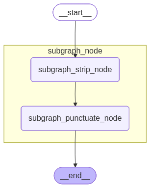
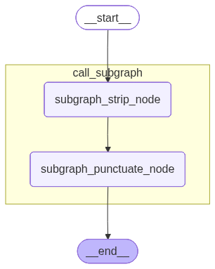
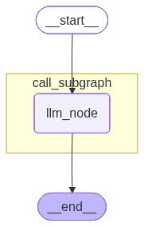
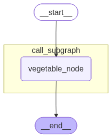
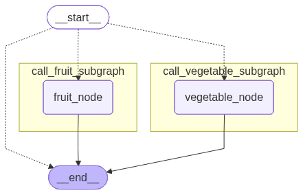
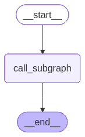
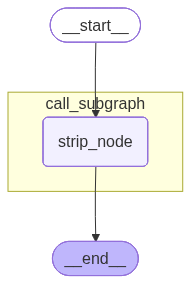
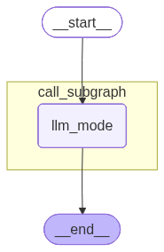

# 12. 子图

状态图节点中调用另外的状态图或直接将另外的状态图作为其节点则后者为子图。

**注意：**

为节点命名时特别注意避开 **`Mermaid`** 关键字，否则拓扑结构渲染可能失败，常见的 **`Mermaid`** 关键字如下

```python
subgraph
end
graph
flowchart
classDef
```

## 12.1. 两种子图嵌入方式

| 方式 | 用法 | 适用场景 | 通信方式 |
|:---|:---|:---|:---|
| **节点函数中调用子图** | 在节点函数内 `subgraph.invoke()` | 父子图状态完全隔离 | 手动做输入输出映射 |
| **子图直接作为父图节点** | `add_node("name", compiled_subgraph)` | 父子图共享状态字段 | 通过共享字段自动通信 |

### 12.1.1. 在节点函数中调用子图

如果父图和子图状态完全隔离，可以用这种方式。

#### 12.1.1.1. 用法

**示例如下**

```python
from typing import TypedDict
from langgraph.graph import StateGraph, START, END

# 构建子图
class SubgraphState(TypedDict):
    raw_text: str # 未清洗文本
    stripped_text: str # 去除收尾空格的文本
    punctuated_text: str # 句尾添加句号的文本

def subgraph_strip_node(state: SubgraphState) -> SubgraphState:
    raw_text = state["raw_text"]
    stripped_text = raw_text.strip()

    return {
        "stripped_text": stripped_text
    }

def subgraph_punctuate_node(state: SubgraphState) -> SubgraphState:
    stripped_text = state["stripped_text"]
    punctuated_text = stripped_text + "。"

    return {
        "punctuated_text": punctuated_text
    }

builder = StateGraph(state_schema=SubgraphState)
builder.add_node("subgraph_strip_node", subgraph_strip_node)
builder.add_node("subgraph_punctuate_node", subgraph_punctuate_node)

builder.add_edge(START, "subgraph_strip_node")
builder.add_edge("subgraph_strip_node", "subgraph_punctuate_node")
builder.add_edge("subgraph_punctuate_node", END)

subgraph = builder.compile()

# 构建父图
class ParentState(TypedDict):
    input_text: str # 输入的未清洗的文本
    cleaned_text: str # 清洗后的文本

def call_subgraph(state: ParentState) -> ParentState:
    input_text = state["input_text"]

    res = subgraph.invoke({"raw_text": input_text})
    cleaned_text = res["punctuated_text"]
    return {
        "cleaned_text": cleaned_text
    }

builder = StateGraph(state_schema=ParentState)
builder.add_node("call_subgraph", call_subgraph)

builder.add_edge(START, "call_subgraph")
builder.add_edge("call_subgraph", END)

parent_graph = builder.compile()

input_text = "   LangGraph 真有意思        "
res = parent_graph.invoke({"input_text": input_text})
cleaned_text = res["cleaned_text"]
print("=" * 30, "->   原始文本   <-", "=" * 30)
print(input_text)
print("=" * 30, "-> 清洗后的文本 <-", "=" * 30)
print(cleaned_text)

from IPython.display import display, Image
display(
    Image(
        parent_graph
        .get_graph(xray=True)
        .draw_mermaid_png()
    )
)
```

调用 **`get_graph()`** 时传递的 **`xray=True`** 表示自动解析并递归获取子图的拓扑结构。

**运行结果如下**

```json
============================== ->   原始文本   <- ==============================
   LangGraph 真有意思        
============================== -> 清洗后的文本 <- ==============================
LangGraph 真有意思。
```


**注意：**

当前方式的子图信息依赖于 **`LangGraph`** 对于节点函数代码的解析，解析的关键代码如下

```python
res = subgraph.invoke({"raw_text": input_text})
```

这是推荐的写法，调用子图时最好不要链式调用，否则解析失败，**`LangGraph`** 可能无法感知子图，这不仅会导致 **`display`** 渲染时不包含子图的拓扑结构，还会导致启用检查点存储器时，无法查看子图检查点快照。

**错误写法示例如下**

当前案例看不到效果，下文的 **`Multi-turn`** 案例能看到差别

```python
assistant_response = subgraph.invoke(
    {"messages": messages}
)["messages"][-1].content
```

此时，**`LangGraph`** 无法感知这里的子图 **`subgraph`**

**正确写法如下**

```python
subgraph_response = subgraph.invoke(
    {"messages": messages}
)

assistant_response = subgraph_response["messages"][-1].content
```

#### 12.1.1.2. 查看子图

在上述代码的基础上执行以下代码

```python
list(parent_graph.get_subgraphs())
```

**结果如下**

```python
[('call_subgraph',
  <langgraph.graph.state.CompiledStateGraph at 0x19bd9e84ec0>)]
```

### 12.1.2. 子图直接作为父图的节点

#### 12.1.2.1. 用法

**示例如下**

```python
from typing import TypedDict
from langgraph.graph import StateGraph, START, END

# 定义全局共享状态
class OverAllState(TypedDict):
    raw_text: str # 未清洗文本
    cleaned_text: str # 清洗后的文本

# 构建子图
def subgraph_strip_node(state: OverAllState) -> OverAllState:
    raw_text = state["raw_text"]
    stripped_text = raw_text.strip()

    return {
        "cleaned_text": stripped_text
    }

def subgraph_punctuate_node(state: OverAllState) -> OverAllState:
    cleaned_text = state["cleaned_text"]
    punctuated_text = cleaned_text + "。"

    return {
        "cleaned_text": punctuated_text
    }

builder = StateGraph(state_schema=OverAllState)
builder.add_node("subgraph_strip_node", subgraph_strip_node)
builder.add_node("subgraph_punctuate_node", subgraph_punctuate_node)

builder.add_edge(START, "subgraph_strip_node")
builder.add_edge("subgraph_strip_node", "subgraph_punctuate_node")
builder.add_edge("subgraph_punctuate_node", END)

subgraph = builder.compile()

# 构建父图
builder = StateGraph(state_schema=OverAllState)
builder.add_node("subgraph_node", subgraph)

builder.add_edge(START, "subgraph_node")
builder.add_edge("subgraph_node", END)

parent_graph = builder.compile()

raw_text = "   LangGraph 真有意思        "
res = parent_graph.invoke({"raw_text": raw_text})
cleaned_text = res["cleaned_text"]
print("=" * 30, "->   原始文本   <-", "=" * 30)
print(raw_text)
print("=" * 30, "-> 清洗后的文本 <-", "=" * 30)
print(cleaned_text)

from IPython.display import display, Image
display(
    Image(
        parent_graph
        .get_graph(xray=True)
        .draw_mermaid_png()
    )
)
```

**运行结果如下**

```json
============================== ->   原始文本   <- ==============================
   LangGraph 真有意思        
============================== -> 清洗后的文本 <- ==============================
LangGraph 真有意思。
```



#### 12.1.2.2. 查看子图

**示例如下**

```python
list(parent_graph.get_subgraphs())
```

**运行结果如下**

```python
[('subgraph_node',
  <langgraph.graph.state.CompiledStateGraph at 0x297c50a2520>)]
```

## 12.2. 子图持久化

### 12.2.1. 查看子图检查点快照

本节测试都依赖于以下示例

```python
from typing import TypedDict
from langgraph.graph import StateGraph, START, END
from langgraph.checkpoint.memory import InMemorySaver

# 构建子图
class SubgraphState(TypedDict):
    raw_text: str # 未清洗文本
    stripped_text: str # 去除收尾空格的文本
    punctuated_text: str # 句尾添加句号的文本

def subgraph_strip_node(state: SubgraphState) -> SubgraphState:
    raw_text = state["raw_text"]
    stripped_text = raw_text.strip()

    return {
        "stripped_text": stripped_text
    }

def subgraph_punctuate_node(state: SubgraphState) -> SubgraphState:
    stripped_text = state["stripped_text"]
    punctuated_text = stripped_text + "。"

    return {
        "punctuated_text": punctuated_text
    }

builder = StateGraph(state_schema=SubgraphState)
builder.add_node("subgraph_strip_node", subgraph_strip_node)
builder.add_node("subgraph_punctuate_node", subgraph_punctuate_node)

builder.add_edge(START, "subgraph_strip_node")
builder.add_edge("subgraph_strip_node", "subgraph_punctuate_node")
builder.add_edge("subgraph_punctuate_node", END)

subgraph = builder.compile()

# 构建父图
class ParentState(TypedDict):
    input_text: str # 输入的未清洗的文本
    cleaned_text: str # 清洗后的文本

def call_subgraph(state: ParentState) -> ParentState:
    input_text = state["input_text"]

    res = subgraph.invoke({"raw_text": input_text})
    cleaned_text = res["punctuated_text"]
    return {
        "cleaned_text": cleaned_text
    }

builder = StateGraph(state_schema=ParentState)
builder.add_node("call_subgraph", call_subgraph)

builder.add_edge(START, "call_subgraph")
builder.add_edge("call_subgraph", END)

checkpointer=InMemorySaver()
parent_graph = builder.compile(checkpointer=checkpointer)

input_text = "   LangGraph 真有意思        "
config={"configurable": {"thread_id": "observe_checkpoint_1"}}
res = parent_graph.invoke(
    {"input_text": input_text},
    config=config
)
cleaned_text = res["cleaned_text"]
print("=" * 30, "->   原始文本   <-", "=" * 30)
print(input_text)
print("=" * 30, "-> 清洗后的文本 <-", "=" * 30)
print(cleaned_text)

from IPython.display import display, Image
display(
    Image(
        parent_graph
        .get_graph(xray=True)
        .draw_mermaid_png()
    )
)
```

**运行结果如下**

```python
============================== ->   原始文本   <- ==============================
   LangGraph 真有意思        
============================== -> 清洗后的文本 <- ==============================
LangGraph 真有意思。
```



#### 12.2.1.1. 在父图检查点快照中查看子图信息

**获取父图历史检查点列表**

```python
histories = list(parent_graph.get_state_history(config=config))
histories
```

**结果如下**

```python
[
    StateSnapshot(
        values={
            'input_text': '   LangGraph 真有意思        ',
            'cleaned_text': 'LangGraph 真有意思。'
        },
        next=(),
        config={
            'configurable': {
                'thread_id': 'observe_checkpoint_1',
                'checkpoint_ns': '',
                'checkpoint_id': '1f16fd86-3406-6072-8001-1e8b9691a9cf'
            }
        },
        metadata={
            'source': 'loop',
            'step': 1,
            'parents': {}
        },
        created_at='2026-06-24T14:24:19.397838+00:00',
        parent_config={
            'configurable': {
                'thread_id': 'observe_checkpoint_1',
                'checkpoint_ns': '',
                'checkpoint_id': '1f16fd86-33fb-6847-8000-8914ff1be716'
            }
        },
        tasks=(),
        interrupts=()
    ),
    StateSnapshot(
        values={
            'input_text': '   LangGraph 真有意思        '
        },
        next=(
            'call_subgraph',
        ),
        config={
            'configurable': {
                'thread_id': 'observe_checkpoint_1',
                'checkpoint_ns': '',
                'checkpoint_id': '1f16fd86-33fb-6847-8000-8914ff1be716'
            }
        },
        metadata={
            'source': 'loop',
            'step': 0,
            'parents': {}
        },
        created_at='2026-06-24T14:24:19.393533+00:00',
        parent_config={
            'configurable': {
                'thread_id': 'observe_checkpoint_1',
                'checkpoint_ns': '',
                'checkpoint_id': '1f16fd86-33fa-61a4-bfff-538c9fb00687'
            }
        },
        tasks=(
            PregelTask(
                id='9923d4be-9845-576d-785f-5b1d6da9a94f',
                name='call_subgraph',
                path=(
                    '__pregel_pull',
                    'call_subgraph'
                ),
                error=None,
                interrupts=(),
                state={
                    'configurable': {
                        'thread_id': 'observe_checkpoint_1',
                        'checkpoint_ns': 'call_subgraph:9923d4be-9845-576d-785f-5b1d6da9a94f'
                    }
                },
                result={
                    'cleaned_text': 'LangGraph 真有意思。'
                }
            ),
        ),
        interrupts=()
    ),
    StateSnapshot(
        values={},
        next=(
            '__start__',
        ),
        config={
            'configurable': {
                'thread_id': 'observe_checkpoint_1',
                'checkpoint_ns': '',
                'checkpoint_id': '1f16fd86-33fa-61a4-bfff-538c9fb00687'
            }
        },
        metadata={
            'source': 'input',
            'step': -1,
            'parents': {}
        },
        created_at='2026-06-24T14:24:19.392958+00:00',
        parent_config=None,
        tasks=(
            PregelTask(
                id='1b333b41-1e2d-1770-8dab-a09a47002aef',
                name='__start__',
                path=(
                    '__pregel_pull',
                    '__start__'
                ),
                error=None,
                interrupts=(),
                state=None,
                result={
                    'input_text': '   LangGraph 真有意思        '
                }
            ),
        ),
        interrupts=()
    )
]
```

可以看到，超步为 **`0`** 的快照下的 **`tasks`** 字段下只有一个任务实例，该任务实例在编号为 **`1`** 的超步执行，其中的 **`state`** 字段记录了子图检查点的 **`thread_id`** 和 **`checkpoint_ns`**，如下所示：

```python
state={
    'configurable': {
        'thread_id': 'observe_checkpoint_1',
        'checkpoint_ns': 'call_subgraph:9923d4be-9845-576d-785f-5b1d6da9a94f'
    }
}
```

- **`thread_id`**：整个线程的唯一 **`ID`**，和父图一致

- **`checkpoint_ns`**：子图命名空间，格式为

  ```python
  <子图所属父图节点名称>:<子图所属父图任务ID>
  ```

  我们在介绍 **`LangGraph`** 中提到，父图的 **`checkpoint_ns`** 通常为空字符串，在子图嵌套系统中该字段排上了用场：

  - 父图的 **`checkpoint_ns`** 仍未空字符串
  - 子图的 **`checkpoint_ns`** 遵循以上格式

  当嵌套层级不止一层时，命名空间将会通过 **`|`** 拼接，具体来说，假设拓扑结构如下：

  ```python
  父图
  └── call_subgraph          # 调用子图 A
      └── call_inner_graph   # 子图 A 调用子图 B
  ```

  那么命名空间为

  ```python
  父图：
  ""
  
  子图 A：
  call_subgraph:<task_id_1>
  
  子图 B：
  call_subgraph:<task_id_1>|call_inner_graph:<task_id_2>
  ```

  依次类推。

#### 12.2.1.2. 在父图检查点快照中展开子图最新快照

我们可以在父图的 **`state`** 字段中展开子图快照，也就是将 **`state`** 字段的值替换为子图的最新检查点快照

##### 12.2.1.2.1. 获取父图检查点配置

超步为 **`0`** 的检查点记录了子图的配置，所以我们要获取这个快照的父图配置，观察检查点快照列表可知：快照列表按照超步编号降序排列，且最小超步为 **`-1`**，取列表的倒数第二个元素即可拿到超步编号为 **`0`** 的检查点快照。

**代码如下**

```python
parent_config = histories[-2].config
parent_config
```

**结果如下**

```python
{
  'configurable': {
    'thread_id': 'observe_checkpoint_1',
    'checkpoint_ns': '',
    'checkpoint_id': '1f16fd86-33fb-6847-8000-8914ff1be716'
  }
}
```

##### 12.2.1.2.2. 展开子图快照

在调用 **`get_state()`** 时传递带有 **`checkpoint_id`** 的父图配置，并传递 **`subgraphs=True`** 即可展开子图快照。

**示例如下**

```python
parent_graph.get_state(config=parent_config, subgraphs=True)
```

**运行结果如下**

```python
StateSnapshot(
  values={
    'input_text': '   LangGraph 真有意思        '
  },
  next=(
    'call_subgraph',
  ),
  config={
    'configurable': {
      'thread_id': 'observe_checkpoint_1',
      'checkpoint_ns': '',
      'checkpoint_id': '1f16fd86-33fb-6847-8000-8914ff1be716'
    }
  },
  metadata={
    'source': 'loop',
    'step': 0,
    'parents': {}
  },
  created_at='2026-06-24T14:24:19.393533+00:00',
  parent_config={
    'configurable': {
      'thread_id': 'observe_checkpoint_1',
      'checkpoint_ns': '',
      'checkpoint_id': '1f16fd86-33fa-61a4-bfff-538c9fb00687'
    }
  },
  tasks=(
    PregelTask(
      id='9923d4be-9845-576d-785f-5b1d6da9a94f',
      name='call_subgraph',
      path=(
        '__pregel_pull',
        'call_subgraph'
      ),
      error=None,
      interrupts=(),
      state=StateSnapshot(
        values={
          'raw_text': '   LangGraph 真有意思        ',
          'stripped_text': 'LangGraph 真有意思',
          'punctuated_text': 'LangGraph 真有意思。'
        },
        next=(),
        config={
          'configurable': {
            'thread_id': 'observe_checkpoint_1',
            'checkpoint_ns': 'call_subgraph:9923d4be-9845-576d-785f-5b1d6da9a94f',
            'checkpoint_id': '1f16fd86-3404-640e-8002-84e2d98a88dc',
            'checkpoint_map': {
              '': '1f16fd86-33fb-6847-8000-8914ff1be716',
              'call_subgraph:9923d4be-9845-576d-785f-5b1d6da9a94f': '1f16fd86-3404-640e-8002-84e2d98a88dc'
            }
          }
        },
        metadata={
          'source': 'loop',
          'step': 2,
          'parents': {
            '': '1f16fd86-33fb-6847-8000-8914ff1be716'
          }
        },
        created_at='2026-06-24T14:24:19.397114+00:00',
        parent_config={
          'configurable': {
            'thread_id': 'observe_checkpoint_1',
            'checkpoint_ns': 'call_subgraph:9923d4be-9845-576d-785f-5b1d6da9a94f',
            'checkpoint_id': '1f16fd86-3401-694f-8001-2c6a2666b501',
            'checkpoint_map': {
              '': '1f16fd86-33fb-6847-8000-8914ff1be716',
              'call_subgraph:9923d4be-9845-576d-785f-5b1d6da9a94f': '1f16fd86-3401-694f-8001-2c6a2666b501'
            }
          }
        },
        tasks=(),
        interrupts=()
      ),
      result={
        'cleaned_text': 'LangGraph 真有意思。'
      }
    ),
  ),
  interrupts=()
)
```

可以看到，**`state`** 字段已展开为子图的最新检查点快照。

#### 12.2.1.3. 获取子图配置，查看完整子图检查点列表

某些场景下，我们希望查看完整的子图检查点快照列表，此时只需要将包含 **`thread_id`** 和子图命名空间 **`checkpoint_ns`** 的配置信息传递给 **`get_state_history()`** 即可实现。

##### 12.2.1.3.1. 获取子图检查点配置

**示例如下**

```python
subgraph_config = histories[-2].tasks[0].state
subgraph_config
```

**结果如下**

```python
{
  'configurable': {
    'thread_id': 'observe_checkpoint_1',
    'checkpoint_ns': 'call_subgraph:9923d4be-9845-576d-785f-5b1d6da9a94f'
  }
}
```

##### 12.2.1.3.2. 查看完整子图检查点快照列表

**示例如下**

```python
list(parent_graph.get_state_history(config=subgraph_config))
```

**结果如下**

```python
[
    StateSnapshot(
        values={
            'raw_text': '   LangGraph 真有意思        ',
            'stripped_text': 'LangGraph 真有意思',
            'punctuated_text': 'LangGraph 真有意思。'
        },
        next=(),
        config={
            'configurable': {
                'thread_id': 'observe_checkpoint_1',
                'checkpoint_ns': 'call_subgraph:9923d4be-9845-576d-785f-5b1d6da9a94f',
                'checkpoint_id': '1f16fd86-3404-640e-8002-84e2d98a88dc',
                'checkpoint_map': {
                    '': '1f16fd86-33fb-6847-8000-8914ff1be716',
                    'call_subgraph:9923d4be-9845-576d-785f-5b1d6da9a94f': '1f16fd86-3404-640e-8002-84e2d98a88dc'
                }
            }
        },
        metadata={
            'source': 'loop',
            'step': 2,
            'parents': {
                '': '1f16fd86-33fb-6847-8000-8914ff1be716'
            }
        },
        created_at='2026-06-24T14:24:19.397114+00:00',
        parent_config={
            'configurable': {
                'thread_id': 'observe_checkpoint_1',
                'checkpoint_ns': 'call_subgraph:9923d4be-9845-576d-785f-5b1d6da9a94f',
                'checkpoint_id': '1f16fd86-3401-694f-8001-2c6a2666b501',
                'checkpoint_map': {
                    '': '1f16fd86-33fb-6847-8000-8914ff1be716',
                    'call_subgraph:9923d4be-9845-576d-785f-5b1d6da9a94f': '1f16fd86-3401-694f-8001-2c6a2666b501'
                }
            }
        },
        tasks=(),
        interrupts=()
    ),
    StateSnapshot(
        values={
            'raw_text': '   LangGraph 真有意思        ',
            'stripped_text': 'LangGraph 真有意思'
        },
        next=(
            'subgraph_punctuate_node',
        ),
        config={
            'configurable': {
                'thread_id': 'observe_checkpoint_1',
                'checkpoint_ns': 'call_subgraph:9923d4be-9845-576d-785f-5b1d6da9a94f',
                'checkpoint_id': '1f16fd86-3401-694f-8001-2c6a2666b501',
                'checkpoint_map': {
                    '': '1f16fd86-33fb-6847-8000-8914ff1be716',
                    'call_subgraph:9923d4be-9845-576d-785f-5b1d6da9a94f': '1f16fd86-3401-694f-8001-2c6a2666b501'
                }
            }
        },
        metadata={
            'source': 'loop',
            'step': 1,
            'parents': {
                '': '1f16fd86-33fb-6847-8000-8914ff1be716'
            }
        },
        created_at='2026-06-24T14:24:19.396020+00:00',
        parent_config={
            'configurable': {
                'thread_id': 'observe_checkpoint_1',
                'checkpoint_ns': 'call_subgraph:9923d4be-9845-576d-785f-5b1d6da9a94f',
                'checkpoint_id': '1f16fd86-33ff-6ad9-8000-0fb11208046d',
                'checkpoint_map': {
                    '': '1f16fd86-33fb-6847-8000-8914ff1be716',
                    'call_subgraph:9923d4be-9845-576d-785f-5b1d6da9a94f': '1f16fd86-33ff-6ad9-8000-0fb11208046d'
                }
            }
        },
        tasks=(
            PregelTask(
                id='d37272d8-d167-4fb9-6e31-466a58bf91cc',
                name='subgraph_punctuate_node',
                path=(
                    '__pregel_pull',
                    'subgraph_punctuate_node'
                ),
                error=None,
                interrupts=(),
                state=None,
                result={
                    'punctuated_text': 'LangGraph 真有意思。'
                }
            ),
        ),
        interrupts=()
    ),
    StateSnapshot(
        values={
            'raw_text': '   LangGraph 真有意思        '
        },
        next=(
            'subgraph_strip_node',
        ),
        config={
            'configurable': {
                'thread_id': 'observe_checkpoint_1',
                'checkpoint_ns': 'call_subgraph:9923d4be-9845-576d-785f-5b1d6da9a94f',
                'checkpoint_id': '1f16fd86-33ff-6ad9-8000-0fb11208046d',
                'checkpoint_map': {
                    '': '1f16fd86-33fb-6847-8000-8914ff1be716',
                    'call_subgraph:9923d4be-9845-576d-785f-5b1d6da9a94f': '1f16fd86-33ff-6ad9-8000-0fb11208046d'
                }
            }
        },
        metadata={
            'source': 'loop',
            'step': 0,
            'parents': {
                '': '1f16fd86-33fb-6847-8000-8914ff1be716'
            }
        },
        created_at='2026-06-24T14:24:19.395239+00:00',
        parent_config={
            'configurable': {
                'thread_id': 'observe_checkpoint_1',
                'checkpoint_ns': 'call_subgraph:9923d4be-9845-576d-785f-5b1d6da9a94f',
                'checkpoint_id': '1f16fd86-33fe-685b-bfff-d0a73977e807',
                'checkpoint_map': {
                    '': '1f16fd86-33fb-6847-8000-8914ff1be716',
                    'call_subgraph:9923d4be-9845-576d-785f-5b1d6da9a94f': '1f16fd86-33fe-685b-bfff-d0a73977e807'
                }
            }
        },
        tasks=(
            PregelTask(
                id='9d9a1009-3212-b789-f40a-3d8f213ce4fb',
                name='subgraph_strip_node',
                path=(
                    '__pregel_pull',
                    'subgraph_strip_node'
                ),
                error=None,
                interrupts=(),
                state=None,
                result={
                    'stripped_text': 'LangGraph 真有意思'
                }
            ),
        ),
        interrupts=()
    ),
    StateSnapshot(
        values={},
        next=(
            '__start__',
        ),
        config={
            'configurable': {
                'thread_id': 'observe_checkpoint_1',
                'checkpoint_ns': 'call_subgraph:9923d4be-9845-576d-785f-5b1d6da9a94f',
                'checkpoint_id': '1f16fd86-33fe-685b-bfff-d0a73977e807',
                'checkpoint_map': {
                    '': '1f16fd86-33fb-6847-8000-8914ff1be716',
                    'call_subgraph:9923d4be-9845-576d-785f-5b1d6da9a94f': '1f16fd86-33fe-685b-bfff-d0a73977e807'
                }
            }
        },
        metadata={
            'source': 'input',
            'step': -1,
            'parents': {
                '': '1f16fd86-33fb-6847-8000-8914ff1be716'
            }
        },
        created_at='2026-06-24T14:24:19.394769+00:00',
        parent_config=None,
        tasks=(
            PregelTask(
                id='5516615f-62ca-2dc4-d41e-6a8f20a981bb',
                name='__start__',
                path=(
                    '__pregel_pull',
                    '__start__'
                ),
                error=None,
                interrupts=(),
                state=None,
                result={
                    'raw_text': '   LangGraph 真有意思        '
                }
            ),
        ),
        interrupts=()
    )
]
```

- 上述快照的命名空间都不是空字符串，且保持一致，全部属于同一个子图

- **`metadata['parents']`** 记录了父检查点的信息，格式为

  **`<父检查点命名空间>:<父检查点ID>`**

- **`config['configurable']['checkpoint_map']`** 记录了父图和当前子图检查点命名空间和 **`ID`** 的映射关系，包含两个条目，格式如下

  ```python
  <父图检查点命名空间>:<父图检查点ID>,
  <当前子图检查点命名空间>:<当前子图检查点ID>
  ```

### 12.2.2. 持久化策略

本节讨论的持久化策略以**父图启用检查点存储器**为前提。子图支持三种策略：

| 策略 | 编译参数 | 检查点保存 | 中断恢复 | 多轮记忆 |
|:---|:---|:---|:---|:---|
| **`Per-invocation`**（默认） | `checkpointer=None` 或省略 | ✓ | ✓ | ✗（同 thread_id 再次调用不加载历史） |
| **`Per-thread`** | `checkpointer=True` | ✓ | ✓ | ✓（同 thread_id 调用加载历史） |
| **`Stateless`** | `checkpointer=False` | ✗ | ✗ | ✗ |

> **三种策略的唯一区别在于子图编译时的 `checkpointer` 参数**，其余代码完全相同。下面按场景组织，每个场景展示一份完整代码，策略切换只需修改一行。

#### 12.2.2.1. 场景一：中断（interrupt）

子图节点中使用 `interrupt()` 中断执行，等待用户输入后恢复。

```python
from typing import TypedDict
from langgraph.graph import StateGraph, START, END
from langgraph.types import interrupt, Command
from langgraph.checkpoint.memory import InMemorySaver

from loguru import logger

# 定义全局共享状态
class OverAllState(TypedDict):
    raw_text: str # 未清洗文本
    cleaned_text: str # 清洗后的文本

# 构建子图
def subgraph_strip_node(state: OverAllState) -> OverAllState:
    logger.info("子图 subgraph_strip_node 节点执行了")
    raw_text = state["raw_text"]
    stripped_text = raw_text.strip()

    return {
        "cleaned_text": stripped_text
    }

def subgraph_punctuate_node(state: OverAllState) -> OverAllState:
    logger.info("子图 subgraph_punctuate_node 节点执行了")
    cleaned_text = state["cleaned_text"]
    punctuation = interrupt("您希望在句尾添加的标点符号是？[。/，/！/？/；]")
    punctuation1 = interrupt("您希望在句尾添加的标点符号是？[。/，/！/？/；]")
    punctuated_text = cleaned_text + punctuation + punctuation1

    return {
        "cleaned_text": punctuated_text
    }

builder = StateGraph(state_schema=OverAllState)
builder.add_node("subgraph_strip_node", subgraph_strip_node)
builder.add_node("subgraph_punctuate_node", subgraph_punctuate_node)

builder.add_edge(START, "subgraph_strip_node")
builder.add_edge("subgraph_strip_node", "subgraph_punctuate_node")
builder.add_edge("subgraph_punctuate_node", END)

# ==================================================
# 【策略切换点】只需修改这一行
# subgraph = builder.compile()  # Per-invocation（默认）
# subgraph = builder.compile(checkpointer=True)   # Per-thread
subgraph = builder.compile(checkpointer=False)  # Stateless（中断不可用）
# ==================================================

# 构建父图
builder = StateGraph(state_schema=OverAllState)
builder.add_node("subgraph_node", subgraph)

builder.add_edge(START, "subgraph_node")
builder.add_edge("subgraph_node", END)

checkpointer = InMemorySaver()
parent_graph = builder.compile(checkpointer=checkpointer)

raw_text = "   LangGraph 真有意思        "
config = {"configurable": {"thread_id": "123"}}
# 首次调用
interrupted_res = parent_graph.invoke(
    {"raw_text": raw_text},
    config=config
)
print("=" * 30, "->   中断信息   <-", "=" * 30)
print(interrupted_res)


from IPython.display import display, Image
display(
    Image(
        parent_graph
        .get_graph(xray=True)
        .draw_mermaid_png()
    )
)

# 恢复调用
parent_graph.invoke(
    Command(resume="！"),
    config=config
)
res = parent_graph.invoke(
    Command(resume="！"),
    config=config
)

cleaned_text = res["cleaned_text"]
print("=" * 30, "->   原始文本   <-", "=" * 30)
print(raw_text)
print("=" * 30, "-> 清洗后的文本 <-", "=" * 30)
print(cleaned_text)
```

**运行结果（Per-invocation / Per-thread 均可）**

```python
2026-06-25 09:41:40.629 | INFO     | __main__:subgraph_strip_node:15 - 子图 subgraph_strip_node 节点执行了
2026-06-25 09:41:40.630 | INFO     | __main__:subgraph_punctuate_node:24 - 子图 subgraph_punctuate_node 节点执行了
============================== ->   中断信息   <- ==============================
{'raw_text': '   LangGraph 真有意思        ', '__interrupt__': [Interrupt(value='您希望在句尾添加的标点符号是？[。/，/！/？/；]', id='a4c6479870430be1a857af43cc7eff99')]}
2026-06-25 09:41:40.633 | INFO     | __main__:subgraph_punctuate_node:24 - 子图 subgraph_punctuate_node 节点执行了
============================== ->   原始文本   <- ==============================
   LangGraph 真有意思        
============================== -> 清洗后的文本 <- ==============================
LangGraph 真有意思！
```


> **策略差异**：三种策略下中断机制行为一致，`Per-invocation` 和 `Per-thread` 均支持中断恢复，`Stateless` 不支持中断。

| 策略 | 编译参数 | 中断 |
|:---|:---|:---|
| Per-invocation（默认） | `subgraph = builder.compile()` | ✅ |
| Per-thread | `subgraph = builder.compile(checkpointer=True)` | ✅ |
| Stateless | `subgraph = builder.compile(checkpointer=False)` | ❌ |

#### 12.2.2.2. 场景二：多轮对话

父图多次调用子图进行 LLM 对话，验证子图是否保留历史消息。

```python
from typing import TypedDict
from langgraph.graph import StateGraph, START, END, MessagesState
from langgraph.checkpoint.memory import InMemorySaver

from langchain.messages import HumanMessage, SystemMessage, AIMessage
from langchain_deepseek import ChatDeepSeek

import sys
from loguru import logger
# 删除 Loguru 默认的 stderr sink
logger.remove()
# 重新添加支持颜色的 sink
logger.add(sys.stdout, colorize=True)

from dotenv import load_dotenv

load_dotenv(override=True)

model = ChatDeepSeek(
    model="deepseek-v4-flash",
    extra_body={
        "thinking": {
            "type": "disabled"
        }
    }
)

# 构建子图
def llm_node(state: MessagesState) -> MessagesState:
    messages = state["messages"]
    logger.info("=" * 30)
    logger.info("调用子图的 llm_node 节点，当前的 messages: ")
    for index, message in enumerate(messages, start=1):
        logger.opt(colors=True).info(
            "\n<cyan><bold>[消息 {}]</bold></cyan>\n"
            "<yellow>类型：</yellow><magenta>{}</magenta>\n"
            "<yellow>内容：</yellow><green>{}</green>",
            index,
            message.type,
            message.content
        )
    logger.info("=" * 30)

    response = model.invoke(input=messages)
    ai_msg = AIMessage(content=response.content)

    return {
        "messages": [ai_msg]
    }

builder = StateGraph(state_schema=MessagesState)
builder.add_node("llm_node", llm_node)
builder.add_edge(START, "llm_node")
builder.add_edge("llm_node", END)

# ==================================================
# 【策略切换点】只需修改这一行
subgraph = builder.compile()  # Per-invocation（默认）：无记忆
# subgraph = builder.compile(checkpointer=True)   # Per-thread：有记忆
# ==================================================

# 构建父图
class OverAllState(TypedDict):
    user_input: str # 用户提问
    assistant_response: str # 助手回答

def call_subgraph(state: OverAllState) -> OverAllState:
    user_input = state["user_input"]

    messages = [
        SystemMessage("尽可能用简短的语言回答"),
        HumanMessage(user_input)
    ]
    subgraph_response = subgraph.invoke(
        {"messages": messages}
    )

    assistant_response = subgraph_response["messages"][-1].content

    return {
        "assistant_response": assistant_response
    }

builder = StateGraph(state_schema=OverAllState)
builder.add_node("call_subgraph", call_subgraph)
builder.add_edge(START, "call_subgraph")
builder.add_edge("call_subgraph", END)

checkpointer = InMemorySaver()
parent_graph = builder.compile(checkpointer=checkpointer)

config = {"configurable": {"thread_id": "multi-turn-demo"}}

first_invoke = parent_graph.invoke(
    {"user_input": "我是老王，从现在开始，你是小王"},
    config = config
)
print("=" * 30, "-> 第一次调用 <-", "=" * 30)
print(first_invoke)

second_invoke = parent_graph.invoke(
    {"user_input": "我是谁？你是谁？"},
    config = config
)
print("=" * 30, "-> 第二次调用 <-", "=" * 30)
print(second_invoke)

from IPython.display import display, Image
display(
    Image(
        parent_graph
        .get_graph(xray=True)
        .draw_mermaid_png()
    )
)
```

**Per-invocation 运行结果（无记忆）**

```
2026-06-25 09:43:14.012 | INFO     | __main__:llm_node:31 - ==============================
2026-06-25 09:43:14.013 | INFO     | __main__:llm_node:32 - 调用子图的 llm_node 节点，当前的 messages: 
2026-06-25 09:43:14.014 | INFO     | __main__:llm_node:34 - 
[消息 1]
类型：system
内容：尽可能用简短的语言回答
2026-06-25 09:43:14.014 | INFO     | __main__:llm_node:34 - 
[消息 2]
类型：human
内容：我是老王，从现在开始，你是小王
2026-06-25 09:43:14.015 | INFO     | __main__:llm_node:42 - ==============================
============================== -> 第一次调用 <- ==============================
{'user_input': '我是老王，从现在开始，你是小王', 'assistant_response': '好的，老王。我是小王，您有什么吩咐？'}
2026-06-25 09:43:14.814 | INFO     | __main__:llm_node:31 - ==============================
2026-06-25 09:43:14.815 | INFO     | __main__:llm_node:32 - 调用子图的 llm_node 节点，当前的 messages: 
2026-06-25 09:43:14.815 | INFO     | __main__:llm_node:34 - 
[消息 1]
类型：system
内容：尽可能用简短的语言回答
2026-06-25 09:43:14.816 | INFO     | __main__:llm_node:34 - 
[消息 2]
类型：human
内容：我是谁？你是谁？
2026-06-25 09:43:14.816 | INFO     | __main__:llm_node:42 - ==============================
============================== -> 第二次调用 <- ==============================
{'user_input': '我是谁？你是谁？', 'assistant_response': '你是用户，我是DeepSeek，一个由深度求索公司开发的AI助手。'}
```


第二次调用时子图 `messages` 被重置，无法获知第一次调用时传递的信息。**Per-invocation 模式无法在子图中进行多轮对话。**

**Per-thread 运行结果（有记忆）**——仅子图编译改为 `builder.compile(checkpointer=True)`：

```
2026-06-25 10:42:37.121 | INFO     | __main__:llm_node:31 - ==============================
2026-06-25 10:42:37.122 | INFO     | __main__:llm_node:32 - 调用子图的 llm_node 节点，当前的 messages: 
2026-06-25 10:42:37.123 | INFO     | __main__:llm_node:34 - 
[消息 1]
类型：system
内容：尽可能用简短的语言回答
2026-06-25 10:42:37.124 | INFO     | __main__:llm_node:34 - 
[消息 2]
类型：human
内容：我是老王，从现在开始，你是小王
2026-06-25 10:42:37.124 | INFO     | __main__:llm_node:42 - ==============================
============================== -> 第一次调用 <- ==============================
{'user_input': '我是老王，从现在开始，你是小王', 'assistant_response': '（严肃点头）好，老王，有啥指示？'}
2026-06-25 10:42:37.940 | INFO     | __main__:llm_node:31 - ==============================
2026-06-25 10:42:37.941 | INFO     | __main__:llm_node:32 - 调用子图的 llm_node 节点，当前的 messages: 
2026-06-25 10:42:37.942 | INFO     | __main__:llm_node:34 - 
[消息 1]
类型：system
内容：尽可能用简短的语言回答
2026-06-25 10:42:37.943 | INFO     | __main__:llm_node:34 - 
[消息 2]
类型：human
内容：我是老王，从现在开始，你是小王
2026-06-25 10:42:37.944 | INFO     | __main__:llm_node:34 - 
[消息 3]
类型：ai
内容：（严肃点头）好，老王，有啥指示？
2026-06-25 10:42:37.945 | INFO     | __main__:llm_node:34 - 
[消息 4]
类型：system
内容：尽可能用简短的语言回答
2026-06-25 10:42:37.945 | INFO     | __main__:llm_node:34 - 
[消息 5]
类型：human
内容：我是谁？你是谁？
2026-06-25 10:42:37.946 | INFO     | __main__:llm_node:42 - ==============================
============================== -> 第二次调用 <- ==============================
{'user_input': '我是谁？你是谁？', 'assistant_response': '老王。小王。'}
```



历史消息被保留，上下文连续。**Per-thread 模式适用于子图多轮对话场景。**

> **策略差异**

| 策略 | 编译参数 | 多轮记忆 |
|:---|:---|:---|
| Per-invocation（默认） | `subgraph = builder.compile()` | ❌ 每次调用状态重置 |
| Per-thread | `subgraph = builder.compile(checkpointer=True)` | ✅ 跨调用状态连续 |

#### 12.2.2.3. 场景三：多次调用同一子图

父图的一个节点内循环多次调用同一子图。

```python
from typing import TypedDict
from langgraph.graph import StateGraph, START, END, MessagesState
from langgraph.checkpoint.memory import InMemorySaver

from langchain.messages import HumanMessage, SystemMessage, AIMessage
from langchain_deepseek import ChatDeepSeek

import sys
from loguru import logger
logger.remove()
logger.add(sys.stdout, colorize=True)

from dotenv import load_dotenv

load_dotenv(override=True)

model = ChatDeepSeek(
    model="deepseek-v4-flash",
    extra_body={
        "thinking": {
            "type": "disabled"
        }
    }
)

# 构建子图
def llm_node(state: MessagesState) -> MessagesState:
    messages = state["messages"]
    logger.info("=" * 30)
    logger.info("调用子图的 llm_node 节点，当前的 messages: ")
    for index, message in enumerate(messages, start=1):
        logger.opt(colors=True).info(
            "\n<cyan><bold>[消息 {}]</bold></cyan>\n"
            "<yellow>类型：</yellow><magenta>{}</magenta>\n"
            "<yellow>内容：</yellow><green>{}</green>",
            index,
            message.type,
            message.content
        )
    logger.info("=" * 30)
    response = model.invoke(input=messages)
    ai_msg = AIMessage(content=response.content)

    return {
        "messages": [ai_msg]
    }

builder = StateGraph(state_schema=MessagesState)
builder.add_node("llm_node", llm_node)
builder.add_edge(START, "llm_node")
builder.add_edge("llm_node", END)

# ==================================================
# 【策略切换点】只需修改这一行
subgraph = builder.compile()  # Per-invocation（默认）：每次调用状态隔离
# subgraph = builder.compile(checkpointer=True)   # Per-thread：历史相互干扰
# ==================================================

# 构建父图
class OverAllState(TypedDict):
    user_inputs: list[str] # 用户提问
    assistant_responses: str # 助手回答

def call_subgraph(state: OverAllState) -> OverAllState:
    user_inputs = state["user_inputs"]

    assistant_responses = []
    for user_input in user_inputs:
        subgraph_response = subgraph.invoke(
            {
                "messages": [
                    SystemMessage("用最简短的话回答用户的提问"),
                    HumanMessage(user_input)
                ]
            }
        )
        assistant_response = subgraph_response["messages"][-1].content
        assistant_responses.append(assistant_response)

    return {
        "assistant_responses": assistant_responses
    }

builder = StateGraph(state_schema=OverAllState)
builder.add_node("call_subgraph", call_subgraph)
builder.add_edge(START, "call_subgraph")
builder.add_edge("call_subgraph", END)

checkpointer = InMemorySaver()
parent_graph = builder.compile(checkpointer=checkpointer)

config = {"configurable": {"thread_id": "multi-call-same-demo"}}

first_response = parent_graph.invoke(
    {
        "user_inputs": [
            "5*5等于几",
            "10*10等于几"
        ]
    },
    config = config
)
print("=" * 30, "-> 第一次运行结果 <-", "=" * 30)
print(first_response)

second_response = parent_graph.invoke(
    {
        "user_inputs": [
            "再+1呢?",
            "再+10000呢?"
        ]
    },
    config = config
)
print("=" * 30, "-> 第二次运行结果 <-", "=" * 30)
print(second_response)

from IPython.display import display, Image
display(
    Image(
        parent_graph
        .get_graph(xray=True)
        .draw_mermaid_png()
    )
)
```

**Per-thread 运行结果**

```
2026-07-14 11:53:58.056 | INFO     | __main__:llm_node:29 - ==============================
2026-07-14 11:53:58.056 | INFO     | __main__:llm_node:30 - 调用子图的 llm_node 节点，当前的 messages: 
2026-07-14 11:53:58.057 | INFO     | __main__:llm_node:32 - 
[消息 1]
类型：system
内容：用最简短的话回答用户的提问
2026-07-14 11:53:58.057 | INFO     | __main__:llm_node:32 - 
[消息 2]
类型：human
内容：5*5等于几
2026-07-14 11:53:58.058 | INFO     | __main__:llm_node:40 - ==============================
2026-07-14 11:53:58.652 | INFO     | __main__:llm_node:29 - ==============================
2026-07-14 11:53:58.652 | INFO     | __main__:llm_node:30 - 调用子图的 llm_node 节点，当前的 messages: 
2026-07-14 11:53:58.653 | INFO     | __main__:llm_node:32 - 
[消息 1]
类型：system
内容：用最简短的话回答用户的提问
2026-07-14 11:53:58.653 | INFO     | __main__:llm_node:32 - 
[消息 2]
类型：human
内容：10*10等于几
2026-07-14 11:53:58.654 | INFO     | __main__:llm_node:40 - ==============================
============================== -> 第一次运行结果 <- ==============================
{'user_inputs': ['5*5等于几', '10*10等于几'], 'assistant_responses': ['5*5等于25。', '10*10等于100。']}
2026-07-14 11:53:59.230 | INFO     | __main__:llm_node:29 - ==============================
2026-07-14 11:53:59.231 | INFO     | __main__:llm_node:30 - 调用子图的 llm_node 节点，当前的 messages: 
2026-07-14 11:53:59.231 | INFO     | __main__:llm_node:32 - 
[消息 1]
类型：system
内容：用最简短的话回答用户的提问
2026-07-14 11:53:59.232 | INFO     | __main__:llm_node:32 - 
[消息 2]
类型：human
内容：5*5等于几
2026-07-14 11:53:59.233 | INFO     | __main__:llm_node:32 - 
[消息 3]
类型：ai
内容：5*5等于25。
2026-07-14 11:53:59.234 | INFO     | __main__:llm_node:32 - 
[消息 4]
类型：system
内容：用最简短的话回答用户的提问
2026-07-14 11:53:59.234 | INFO     | __main__:llm_node:32 - 
[消息 5]
类型：human
内容：再+1呢?
2026-07-14 11:53:59.235 | INFO     | __main__:llm_node:40 - ==============================
2026-07-14 11:53:59.766 | INFO     | __main__:llm_node:29 - ==============================
2026-07-14 11:53:59.767 | INFO     | __main__:llm_node:30 - 调用子图的 llm_node 节点，当前的 messages: 
2026-07-14 11:53:59.767 | INFO     | __main__:llm_node:32 - 
[消息 1]
类型：system
内容：用最简短的话回答用户的提问
2026-07-14 11:53:59.768 | INFO     | __main__:llm_node:32 - 
[消息 2]
类型：human
内容：10*10等于几
2026-07-14 11:53:59.768 | INFO     | __main__:llm_node:32 - 
[消息 3]
类型：ai
内容：10*10等于100。
2026-07-14 11:53:59.769 | INFO     | __main__:llm_node:32 - 
[消息 4]
类型：system
内容：用最简短的话回答用户的提问
2026-07-14 11:53:59.769 | INFO     | __main__:llm_node:32 - 
[消息 5]
类型：human
内容：再+10000呢?
2026-07-14 11:53:59.769 | INFO     | __main__:llm_node:40 - ==============================
============================== -> 第二次运行结果 <- ==============================
{'user_inputs': ['再+1呢?', '再+10000呢?'], 'assistant_responses': ['25+1=26。', '10100']}
```


每次调用子图时 `messages` 状态都是独立的。**Per-invocation 适用于父图中多次调用同一子图的场景，调用间互不干扰。**

**Per-thread 行为**（改为 `builder.compile(checkpointer=True)`）：同一节点内的多次子图调用，历史按调用位置独立——即第一次子图调用的历史是连续的，第二次子图调用的历史也是连续的，但两次之间独立。**如果调用顺序发生变化，检查点历史会相互干扰。**

> **策略差异**

| 策略 | 编译参数 | 多次调用同一子图 |
|:---|:---|:---|
| Per-invocation（默认） | `subgraph = builder.compile()` | ✅ 每次调用完全隔离 |
| Per-thread | `subgraph = builder.compile(checkpointer=True)` | ❌ 历史按位置关联，可能干扰 |

#### 12.2.2.4. 场景四：多次调用不同子图

父图的一个节点内调用两个不同的子图。

```python
from typing import TypedDict
from langgraph.graph import StateGraph, START, END, MessagesState
from langgraph.checkpoint.memory import InMemorySaver

from langchain.messages import HumanMessage, SystemMessage, AIMessage
from langchain_deepseek import ChatDeepSeek

import sys
from loguru import logger
logger.remove()
logger.add(sys.stdout, colorize=True)

from dotenv import load_dotenv

load_dotenv(override=True)

model = ChatDeepSeek(
    model="deepseek-v4-flash",
    extra_body={
        "thinking": {
            "type": "disabled"
        }
    }
)

# ==================================================
# 【策略切换点】两个子图的编译参数
# ==================================================

# 构建水果子图
def fruit_node(state: MessagesState) -> MessagesState:
    messages = state["messages"]
    logger.info("=" * 30)
    logger.info("调用水果子图的 fruit_node 节点，当前的 messages: ")
    for index, message in enumerate(messages, start=1):
        logger.opt(colors=True).info(
            "\n<cyan><bold>[消息 {}]</bold></cyan>\n"
            "<yellow>类型：</yellow><magenta>{}</magenta>\n"
            "<yellow>内容：</yellow><green>{}</green>",
            index,
            message.type,
            message.content
        )
    logger.info("=" * 30)
    response = model.invoke(input=messages)
    ai_msg = AIMessage(content=response.content)

    return {
        "messages": [ai_msg]
    }

builder = StateGraph(state_schema=MessagesState)
builder.add_node("fruit_node", fruit_node)
builder.add_edge(START, "fruit_node")
builder.add_edge("fruit_node", END)

fruit_subgraph = builder.compile(checkpointer=True)

# 构建蔬菜子图
def vegetable_node(state: MessagesState) -> MessagesState:
    messages = state["messages"]
    logger.info("=" * 30)
    logger.info("调用蔬菜子图的 vegetable_node 节点，当前的 messages: ")
    for index, message in enumerate(messages, start=1):
        logger.opt(colors=True).info(
            "\n<cyan><bold>[消息 {}]</bold></cyan>\n"
            "<yellow>类型：</yellow><magenta>{}</magenta>\n"
            "<yellow>内容：</yellow><green>{}</green>",
            index,
            message.type,
            message.content
        )
    logger.info("=" * 30)
    response = model.invoke(input=messages)
    ai_msg = AIMessage(content=response.content)

    return {
        "messages": [ai_msg]
    }

builder = StateGraph(state_schema=MessagesState)
builder.add_node("vegetable_node", vegetable_node)
builder.add_edge(START, "vegetable_node")
builder.add_edge("vegetable_node", END)

vegetable_subgraph = builder.compile(checkpointer=True)

# 构建父图
class OverAllState(TypedDict):
    fruit: str # 水果
    vegetable: str # 蔬菜

    fruit_introduction: str # 水果介绍
    vegetable_introduction: str # 蔬菜介绍

def call_subgraph(state: OverAllState) -> OverAllState:
    fruit = state["fruit"]
    vegetable = state["vegetable"]

    fruit_messages = [
        SystemMessage("用最简短的话介绍用户输入的水果"),
        HumanMessage(fruit)
    ]

    vegetable_messages = [
        SystemMessage("用最简短的话介绍用户输入的蔬菜"),
        HumanMessage(vegetable)
    ]

    fruit_response = fruit_subgraph.invoke({"messages": fruit_messages})
    vegetable_response = vegetable_subgraph.invoke({"messages": vegetable_messages})

    fruit_introduction = fruit_response["messages"][-1].content
    vegetable_introduction = vegetable_response["messages"][-1].content

    return {
        "fruit_introduction": fruit_introduction,
        "vegetable_introduction": vegetable_introduction
    }

builder = StateGraph(state_schema=OverAllState)
builder.add_node("call_subgraph", call_subgraph)
builder.add_edge(START, "call_subgraph")
builder.add_edge("call_subgraph", END)

checkpointer = InMemorySaver()
parent_graph = builder.compile(checkpointer=checkpointer)

config = {"configurable": {"thread_id": "multi-call-diff-demo"}}

first_response = parent_graph.invoke(
    {
        "fruit": "桑葚",
        "vegetable": "西兰苔"
    },
    config = config
)
print("=" * 30, "-> 第一次运行结果 <-", "=" * 30)
print(first_response)

second_response = parent_graph.invoke(
    {
        "fruit": "香蕉",
        "vegetable": "西兰花"
    },
    config = config
)
print("=" * 30, "-> 第二次运行结果 <-", "=" * 30)
print(second_response)

from IPython.display import display, Image
display(
    Image(
        parent_graph
        .get_graph(xray=True)
        .draw_mermaid_png()
    )
)
```

**运行结果**

```
2026-06-25 11:37:49.176 | INFO     | __main__:fruit_node:32 - ==============================
2026-06-25 11:37:49.176 | INFO     | __main__:fruit_node:33 - 调用水果子图的 fruit_node 节点，当前的 messages: 
2026-06-25 11:37:49.177 | INFO     | __main__:fruit_node:35 - 
[消息 1]
类型：system
内容：用最简短的话介绍用户输入的水果
2026-06-25 11:37:49.178 | INFO     | __main__:fruit_node:35 - 
[消息 2]
类型：human
内容：桑葚
2026-06-25 11:37:49.178 | INFO     | __main__:fruit_node:43 - ==============================
2026-06-25 11:37:49.872 | INFO     | __main__:vegetable_node:61 - ==============================
2026-06-25 11:37:49.873 | INFO     | __main__:vegetable_node:62 - 调用蔬菜子图的 vegetable_node 节点，当前的 messages: 
2026-06-25 11:37:49.873 | INFO     | __main__:vegetable_node:64 - 
[消息 1]
类型：system
内容：用最简短的话介绍用户输入的蔬菜
2026-06-25 11:37:49.874 | INFO     | __main__:vegetable_node:64 - 
[消息 2]
类型：human
内容：西兰苔
2026-06-25 11:37:49.874 | INFO     | __main__:vegetable_node:72 - ==============================
============================== -> 第一次运行结果 <- ==============================
{'fruit': '桑葚', 'vegetable': '西兰苔', 'fruit_introduction': '紫黑多汁的浆果，味酸甜。', 'vegetable_introduction': '西兰苔是西兰花与芥蓝杂交的蔬菜，以鲜嫩花茎和球花为食。'}
...（第二次调用时水果、蔬菜子图各自保留历史消息，按调用位置独立）
{'fruit': '香蕉', 'vegetable': '西兰花', 'fruit_introduction': '黄色弯月形水果，软糯香甜。', 'vegetable_introduction': '西兰花，绿色花球状蔬菜，营养丰富。'}
```



本例在同一个节点中多次调用不同子图，通过专有状态保证了**水果一定发给 `fruit_subgraph`**、**蔬菜一定发给 `vegetable_subgraph`**，一定程度上可以确保不同子图的检查点历史不相互干扰。

但这种靠调用顺序区分的方式不够稳健——如果调用顺序变化，检查点历史也会错乱。官方推荐的做法见下一节。

#### 12.2.2.5. 场景五：独立节点调用不同子图（推荐）

为每个子图准备独立的父图节点，这样它们的命名空间是各自的节点名，完全独立。

```python
from typing import TypedDict, Literal
from collections.abc import Sequence
from langgraph.graph import StateGraph, START, END, MessagesState
from langgraph.checkpoint.memory import InMemorySaver

from langchain.messages import HumanMessage, SystemMessage, AIMessage
from langchain_deepseek import ChatDeepSeek

import sys
from loguru import logger
logger.remove()
logger.add(sys.stdout, colorize=True)

from dotenv import load_dotenv

load_dotenv(override=True)

model = ChatDeepSeek(
    model="deepseek-v4-flash",
    extra_body={
        "thinking": {
            "type": "disabled"
        }
    }
)

# 构建水果子图
def fruit_node(state: MessagesState) -> MessagesState:
    messages = state["messages"]
    logger.info("=" * 30)
    logger.info("调用水果子图的 fruit_node 节点，当前的 messages: ")
    for index, message in enumerate(messages, start=1):
        logger.opt(colors=True).info(
            "\n<cyan><bold>[消息 {}]</bold></cyan>\n"
            "<yellow>类型：</yellow><magenta>{}</magenta>\n"
            "<yellow>内容：</yellow><green>{}</green>",
            index,
            message.type,
            message.content
        )
    logger.info("=" * 30)
    response = model.invoke(input=messages)
    ai_msg = AIMessage(content=response.content)

    return {
        "messages": [ai_msg]
    }

builder = StateGraph(state_schema=MessagesState)
builder.add_node("fruit_node", fruit_node)
builder.add_edge(START, "fruit_node")
builder.add_edge("fruit_node", END)

fruit_subgraph = builder.compile(checkpointer=True)

# 构建蔬菜子图
def vegetable_node(state: MessagesState) -> MessagesState:
    messages = state["messages"]
    logger.info("=" * 30)
    logger.info("调用蔬菜子图的 vegetable_node 节点，当前的 messages: ")
    for index, message in enumerate(messages, start=1):
        logger.opt(colors=True).info(
            "\n<cyan><bold>[消息 {}]</bold></cyan>\n"
            "<yellow>类型：</yellow><magenta>{}</magenta>\n"
            "<yellow>内容：</yellow><green>{}</green>",
            index,
            message.type,
            message.content
        )
    logger.info("=" * 30)
    response = model.invoke(input=messages)
    ai_msg = AIMessage(content=response.content)

    return {
        "messages": [ai_msg]
    }

builder = StateGraph(state_schema=MessagesState)
builder.add_node("vegetable_node", vegetable_node)
builder.add_edge(START, "vegetable_node")
builder.add_edge("vegetable_node", END)

vegetable_subgraph = builder.compile(checkpointer=True)

# 构建父图
class OverAllState(TypedDict):
    fruit: str # 水果
    vegetable: str # 蔬菜

    fruit_introduction: str # 水果介绍
    vegetable_introduction: str # 蔬菜介绍

def call_fruit_subgraph(state: OverAllState) -> OverAllState:
    fruit = state["fruit"]

    fruit_messages = [
        SystemMessage("用最简短的话介绍用户输入的水果"),
        HumanMessage(fruit)
    ]

    fruit_response = fruit_subgraph.invoke({"messages": fruit_messages})
    fruit_introduction = fruit_response["messages"][-1].content

    return {
        "fruit_introduction": fruit_introduction
    }

def call_vegetable_subgraph(state: OverAllState) -> OverAllState:
    vegetable = state["vegetable"]

    vegetable_messages = [
        SystemMessage("用最简短的话介绍用户输入的蔬菜"),
        HumanMessage(vegetable)
    ]

    vegetable_response = vegetable_subgraph.invoke({"messages": vegetable_messages})
    vegetable_introduction = vegetable_response["messages"][-1].content

    return {
        "vegetable_introduction": vegetable_introduction
    }

def router(state: OverAllState) -> Sequence[Literal["call_fruit_subgraph", "call_vegetable_subgraph", END]]:
    next_nodes = []
    if state.get("fruit"):
        next_nodes.append("call_fruit_subgraph")
    if state.get("vegetable"):
        next_nodes.append("call_vegetable_subgraph")
    if not next_nodes:
        next_nodes.append(END)
    return next_nodes

builder = StateGraph(state_schema=OverAllState)
builder.add_node("call_fruit_subgraph", call_fruit_subgraph)
builder.add_node("call_vegetable_subgraph", call_vegetable_subgraph)

builder.add_conditional_edges(START, router, path_map=["call_fruit_subgraph", "call_vegetable_subgraph", END])
builder.add_edge("call_fruit_subgraph", END)
builder.add_edge("call_vegetable_subgraph", END)

checkpointer = InMemorySaver()
parent_graph = builder.compile(checkpointer=checkpointer)

config = {"configurable": {"thread_id": "independent-nodes-demo"}}

first_response = parent_graph.invoke(
    {
        "fruit": "桑葚",
        "vegetable": "西兰苔"
    },
    config = config
)
print("=" * 30, "-> 第一次运行结果 <-", "=" * 30)
print(first_response)

second_response = parent_graph.invoke(
    {
        "fruit": "香蕉",
        "vegetable": "西兰花"
    },
    config = config
)
print("=" * 30, "-> 第二次运行结果 <-", "=" * 30)
print(second_response)

from IPython.display import display, Image
display(
    Image(
        parent_graph
        .get_graph(xray=True)
        .draw_mermaid_png()
    )
)
```

**运行结果**

```
2026-06-25 11:59:10.331 | INFO     | __main__:fruit_node:33 - ==============================
2026-06-25 11:59:10.334 | INFO     | __main__:fruit_node:34 - 调用水果子图的 fruit_node 节点，当前的 messages: 
2026-06-25 11:59:10.335 | INFO     | __main__:fruit_node:36 - 
[消息 1]
类型：system
内容：用最简短的话介绍用户输入的水果
2026-06-25 11:59:10.334 | INFO     | __main__:vegetable_node:62 - ==============================
2026-06-25 11:59:10.335 | INFO     | __main__:fruit_node:36 - 
[消息 2]
类型：human
内容：桑葚
2026-06-25 11:59:10.337 | INFO     | __main__:fruit_node:44 - ==============================
2026-06-25 11:59:10.337 | INFO     | __main__:vegetable_node:63 - 调用蔬菜子图的 vegetable_node 节点，当前的 messages: 
2026-06-25 11:59:10.341 | INFO     | __main__:vegetable_node:65 - 
[消息 1]
类型：system
内容：用最简短的话介绍用户输入的蔬菜
2026-06-25 11:59:10.341 | INFO     | __main__:vegetable_node:65 - 
[消息 2]
类型：human
内容：西兰苔
2026-06-25 11:59:10.342 | INFO     | __main__:vegetable_node:73 - ==============================
============================== -> 第一次运行结果 <- ==============================
{'fruit': '桑葚', 'vegetable': '西兰苔', 'fruit_introduction': '桑葚是桑树的果实，味甜可食，常被用于制酱或入药。', 'vegetable_introduction': '西兰苔是西兰花和芥蓝的杂交品种。'}
...（第二次调用时，水果子图和蔬菜子图各自保留独立的历史）
{'fruit': '香蕉', 'vegetable': '西兰花', 'fruit_introduction': '香蕉是软甜水果，富含钾，能缓解便秘。', 'vegetable_introduction': '一种绿色花状蔬菜，营养丰富。'}
```



每个子图有独立的父图节点，命名空间为各自的节点名，完全隔离。**这是 Per-thread 模式下多次调用不同子图的推荐做法。**

#### 12.2.2.6. 场景六：Stateless 模式

子图完全无状态，不保存检查点，中断和多轮对话均不适用。适用于纯计算、无需追踪历史的场景。

```python
from typing import TypedDict, Annotated
from operator import add
from langgraph.graph import StateGraph, START, END
from langgraph.checkpoint.memory import InMemorySaver

# 构建子图
class SubgraphState(TypedDict):
    raw_text: str
    clean_texts: Annotated[list[str], add]

def strip_node(state: SubgraphState) -> SubgraphState:
    raw_text = state["raw_text"]
    clean_text = raw_text.strip()

    return {
        "clean_texts": [clean_text]
    }

builder = StateGraph(state_schema=SubgraphState)
builder.add_node("strip_node", strip_node)
builder.add_edge(START, "strip_node")
builder.add_edge("strip_node", END)

# ==================================================
# 【策略切换点】只需修改这一行
subgraph = builder.compile(checkpointer=False)  # Stateless：无检查点
# subgraph = builder.compile(checkpointer=True)   # Per-thread：有状态（对比用）
# ==================================================

# 构建父图
class ParentState(TypedDict):
    input_texts: list[str]
    output_texts: Annotated[list[str], add]

def call_subgraph(state: ParentState) -> ParentState:
    input_texts = state["input_texts"]

    output_texts = []
    for input_text in input_texts:
        res = subgraph.invoke({"raw_text": input_text})
        output_texts += res["clean_texts"]

    return {
        "output_texts": output_texts
    }

builder = StateGraph(state_schema=ParentState)
builder.add_node("call_subgraph", call_subgraph)
builder.add_edge(START, "call_subgraph")
builder.add_edge("call_subgraph", END)

checkpointer = InMemorySaver()
parent_graph = builder.compile(checkpointer=checkpointer)

config = {"configurable": {"thread_id": "stateless-demo"}}

first_response = parent_graph.invoke(
    {
        "input_texts": ["  LangGraph 真有意思 ", "  我喜欢 LangChain "]
    },
    config = config
)
print("=" * 30, "-> 第一次运行结果 <-", "=" * 30)
print(first_response)

second_response = parent_graph.invoke(
    {
        "input_texts": ["  Hello, LangGraph  ", "  Hello, LangChain "]
    },
    config = config
)
print("=" * 30, "-> 第二次运行结果 <-", "=" * 30)
print(second_response)

from IPython.display import display, Image
display(
    Image(
        parent_graph
        .get_graph(xray=True)
        .draw_mermaid_png()
    )
)
```

**Stateless 运行结果**

```
============================== -> 第一次运行结果 <- ==============================
{'input_texts': ['  LangGraph 真有意思 ', '  我喜欢 LangChain '], 'output_texts': ['LangGraph 真有意思', '我喜欢 LangChain']}
============================== -> 第二次运行结果 <- ==============================
{'input_texts': ['  Hello, LangGraph  ', '  Hello, LangChain '], 'output_texts': ['LangGraph 真有意思', '我喜欢 LangChain', 'Hello, LangGraph', 'Hello, LangChain']}
```



渲染的图结构中，子图节点内部没有展开子图拓扑——无状态模式的子图内部状态不可访问。

**Per-thread 对比结果**（仅改为 `builder.compile(checkpointer=True)`）：

```
============================== -> 第一次运行结果 <- ==============================
{'input_texts': ['  LangGraph 真有意思 ', '  我喜欢 LangChain '], 'output_texts': ['LangGraph 真有意思', '我喜欢 LangChain']}
============================== -> 第二次运行结果 <- ==============================
{'input_texts': ['  Hello, LangGraph  ', '  Hello, LangChain '], 'output_texts': ['LangGraph 真有意思', '我喜欢 LangChain', 'LangGraph 真有意思', 'Hello, LangGraph', '我喜欢 LangChain', 'Hello, LangChain']}
```



Per-thread 模式下第二次调用结果出现了重复（子图的历史 `clean_texts` 被累积），拓扑结构中也展开了子图。**Stateless 不会累积历史，每次调用都是干净的。**

#### 12.2.2.7. `Per-invocation`和`Per-thread`的设计哲学

默认子图检查点命名空间为 `<节点名称>:<任务ID>`。两种模式的核心差异在于对 `<任务ID>` 的处理：

| 维度 | **`Per-invocation`** | **`Per-thread`** |
|:---|:---|:---|
| 命名空间 | `<节点名称>:<任务ID>` | `<节点名称>`（去掉 `:<任务ID>`） |
| 设计意图 | `<任务ID>` 每次不同 → 每次调用状态独立 | `<节点名称>` 不变 → 跨多次调用状态连续 |
| 同节点多次调用 | `:<任务ID>\|1`, `:<任务ID>\|2` … | `\|1`, `\|2` … |
| 注意事项 | — | 调用顺序变化会导致检查点历史相互干扰；`get_state_history()` 存在 Bug，父图检查点仍记录 `:<任务ID>` 格式，需额外处理 |

#### 12.2.2.8. 总结

| 特性                | **`Per-invocation (default)`** | **`Per-thread`**  | **`Stateless`** |
| :------------------ | :----------------------------- | :---------------- | :-------------- |
| **`checkpointer=`** | **`None`**                     | **`True`**        | **`False`**     |
| 中断                | ✅                              | ✅                 | ❌               |
| 多轮对话            | ❌                              | ✅                 | ❌               |
| 多次调用不同子图    | ✅                              | ⚠️最好通过节点隔离 | ✅               |
| 多次调用相同子图    | ✅                              | ❌子图历史相互干扰 | ✅               |
| 观测子图检查点快照  | ⚠️可以观测，但每次调用独立      | ✅                 | ❌               |

## 12.3. 子图流式运行

只需要在父图调用 **`stream`** 时传递 **`subgraphs=True`** 即可，这样父图和子图的流数据都会汇入同一个流队列，再通过命名空间区分来源。

**需要注意的是**：**`subgraphs=True`** 是在原有父图流数据的基础上，**额外加入子图内部产生的流数据**，并不会用子图数据替代父图数据。它会同时流式返回父图和所有子图的输出。

### 12.3.1. 分析`chunk`格式

**`chunk`** 格式为

```python
(namespace, stream_mode, data)
```

此处的命名空间不同于检查点命名空间，是流处理内部专门用于区分父图和子图流数据的字段。

我们通过模式为 **`updates`** 的简单案例查看数据格式

**示例如下**

```python
from typing import TypedDict
from langgraph.graph import StateGraph, START, END

# 构建子图
class SubgraphState(TypedDict):
    raw_text: str # 未清洗文本
    stripped_text: str # 去除收尾空格的文本
    punctuated_text: str # 句尾添加句号的文本

def subgraph_strip_node(state: SubgraphState) -> SubgraphState:
    raw_text = state["raw_text"]
    stripped_text = raw_text.strip()

    return {
        "stripped_text": stripped_text
    }

def subgraph_punctuate_node(state: SubgraphState) -> SubgraphState:
    stripped_text = state["stripped_text"]
    punctuated_text = stripped_text + "。"

    return {
        "punctuated_text": punctuated_text
    }

builder = StateGraph(state_schema=SubgraphState)
builder.add_node("subgraph_strip_node", subgraph_strip_node)
builder.add_node("subgraph_punctuate_node", subgraph_punctuate_node)

builder.add_edge(START, "subgraph_strip_node")
builder.add_edge("subgraph_strip_node", "subgraph_punctuate_node")
builder.add_edge("subgraph_punctuate_node", END)

subgraph = builder.compile()

# 构建父图
class ParentState(TypedDict):
    input_text: str # 输入的未清洗的文本
    cleaned_text: str # 清洗后的文本

def call_subgraph(state: ParentState) -> ParentState:
    input_text = state["input_text"]

    res = subgraph.invoke({"raw_text": input_text})
    cleaned_text = res["punctuated_text"]
    return {
        "cleaned_text": cleaned_text
    }

builder = StateGraph(state_schema=ParentState)
builder.add_node("call_subgraph", call_subgraph)

builder.add_edge(START, "call_subgraph")
builder.add_edge("call_subgraph", END)

parent_graph = builder.compile()

input_text = "   LangGraph 真有意思        "
for chunk in parent_graph.stream(
    {"input_text": input_text},
    subgraphs=True,
    stream_mode=["updates"]
):
    print(chunk)

from IPython.display import display, Image
display(
    Image(
        parent_graph
        .get_graph(xray=True)
        .draw_mermaid_png()
    )
)
```

**运行结果如下**

```python
(
    (
        'call_subgraph:4daa7290-d5c9-ae96-849e-d2f1dafadd17',
    ),
    'updates',
    {
        'subgraph_strip_node': {
            'stripped_text': 'LangGraph 真有意思'
        }
    }
)
(
    (
        'call_subgraph:4daa7290-d5c9-ae96-849e-d2f1dafadd17',
    ),
    'updates',
    {
        'subgraph_punctuate_node': {
            'punctuated_text': 'LangGraph 真有意思。'
        }
    }
)
(
    (),
    'updates',
    {
        'call_subgraph': {
            'cleaned_text': 'LangGraph 真有意思。'
        }
    }
)
```


**流数据命名空间规则**：

| 来源 | 命名空间 | 备注 |
|:---|:---|:---|
| 父图 | `()`（空元组） | |
| 子图（常规） | `(<父图节点名>:<父图任务ID>,)` | |
| 子图（Per-thread） | `(<父图节点名>,)` | 与检查点命名空间一致 |

### 12.3.2. 多轮对话消息流处理

**示例如下**

```python
from typing import TypedDict
from langgraph.graph import StateGraph, START, END, MessagesState
from langgraph.checkpoint.memory import InMemorySaver
from langchain.messages import HumanMessage, SystemMessage
from langchain_deepseek import ChatDeepSeek

from dotenv import load_dotenv
load_dotenv(override=True)

model = ChatDeepSeek(
    model="deepseek-v4-flash",
    extra_body={
        "thinking": {
            "type": "disabled"
        }
    }
)

# 构建子图
class SubgraphState(MessagesState):
    system_prompt: SystemMessage

def llm_mode(state: SubgraphState) -> SubgraphState:
    system_prompt = state["system_prompt"]
    messages = state["messages"]

    response = model.invoke([system_prompt] + messages)
    return {
        "messages": [response]
    }

builder = StateGraph(state_schema=SubgraphState)
builder.add_node("llm_mode", llm_mode)
builder.add_edge(START, "llm_mode")
builder.add_edge("llm_mode", END)

subgraph = builder.compile(checkpointer=True)

# 构建父图
class ParentState(TypedDict):
    user_input: str
    assistant_response: str

def call_subgraph(state: ParentState) -> ParentState:
    user_input = state["user_input"]

    response = subgraph.invoke(
        {
            "system_prompt": SystemMessage("你是个善解人意的助手"),
            "messages": [HumanMessage(user_input)]
        }
    )

    assistant_response = response["messages"][-1].content

    return {
        "assistant_response": assistant_response
    }

builder = StateGraph(state_schema=ParentState)
builder.add_node("call_subgraph", call_subgraph)
builder.add_edge(START, "call_subgraph")
builder.add_edge("call_subgraph", END)

checkpointer = InMemorySaver()
parent_graph = builder.compile(checkpointer=checkpointer)

config = {"configurable": {"thread_id": "subgraph_stream_test"}}

print("\n", "=" * 30, "-> 第一次运行结果 <-", "=" * 30)
# chunk 形如
# (('call_subgraph',), 'messages', (AIMessageChunk(content='', additional_kwargs={}, response_metadata={'model_provider': 'deepseek'}, id='lc_run--019efd65-c54e-7012-912e-29ff4f84328e', tool_calls=[], invalid_tool_calls=[], tool_call_chunks=[]), {'thread_id': 'subgraph_stream_test', 'langgraph_step': 1, 'langgraph_node': 'llm_mode', 'langgraph_triggers': ('branch:to:llm_mode',), 'langgraph_path': ('__pregel_pull', 'llm_mode'), 'langgraph_checkpoint_ns': 'call_subgraph|llm_mode:55577c3e-22da-877a-c77b-f16bdbcd2c6c', 'checkpoint_ns': 'call_subgraph:9c469391-f094-1c1b-c5d7-6578f1603151', 'ls_provider': 'deepseek', 'ls_model_name': 'deepseek-v4-flash', 'ls_model_type': 'chat', 'ls_temperature': None}))
for chunk in parent_graph.stream(
    {
        "user_input": "花儿为什么这样红？"
    },
    config=config,
    subgraphs=True,
    stream_mode=["messages"]
):
    print(chunk[2][0].content, end="", flush=True)

print("\n", "=" * 30, "-> 第二次运行结果 <-", "=" * 30)
for chunk in parent_graph.stream(
    {
        "user_input": "刚才我们聊了什么？"
    },
    config=config,
    subgraphs=True,
    stream_mode=["messages"]
):
    print(chunk[2][0].content, end="", flush=True)

from IPython.display import display, Image
display(
    Image(
        parent_graph
        .get_graph(xray=True)
        .draw_mermaid_png()
    )
)
```

**运行结果如下**

```python

 ============================== -> 第一次运行结果 <- ==============================
“花儿为什么这样红”是一个经典的问题，可以从不同角度来理解：

1. **自然科学的视角**：花朵的颜色主要由花瓣中的色素决定，尤其是**花青素**（anthocyanins）。花青素在酸性环境下呈现红色，在碱性环境下偏向蓝色。某些花朵（如玫瑰、山茶花）细胞液偏酸性，因此吸收阳光中的蓝绿光，反射红光，让我们看到鲜艳的红色。此外，红色也能吸引蜂鸟等传粉动物，帮助植物繁殖。

2. **文化艺术的视角**：这是一首传唱已久的中国民歌（《花儿为什么这样红》），由雷振邦作曲，是电影《冰山上的来客》的插曲。歌词用“花儿”比喻纯洁、热烈的情感，红色象征着爱情、勇气或革命的赤诚。

3. **诗意隐喻**：就像“花儿为什么这样红”可以指代生命的热情、青春的绽放，或者经风雨后更加绚烂的坚韧。红色的花朵也常被赋予“美好而短暂”的哲学意味。

如果你指的是特定语境（比如学生物的朋友、教孩子、写赏析），我可以把回答调整得更具体。🌹
 ============================== -> 第二次运行结果 <- ==============================
我们刚才聊了“花儿为什么这样红”这个话题。我分别从自然科学（花青素与酸碱性）、文化艺术（经典民歌《花儿为什么这样红》）以及诗意隐喻三个角度做了解答。如果你有更多想深入的方向，随时告诉我～
```

实际测试可以看到模型返回的消息是 **逐`token`** 返回的。



## 12.4. 子图动态路由

在子图中可以通过 **`Command`** 动态路由到父图节点，只要将参数 **`graph`** 的值设置为 **`Command.PARENT`** 即可，如下所示

```python
return Command(
    update={
        "fruits": fruits,
        "vegetables": vegetables
    },
    goto="router_node",
    graph=Command.PARENT
)
```

 **示例如下**

```python
from typing import TypedDict, Literal
from langgraph.graph import StateGraph, START, END
from langgraph.types import Command
from loguru import logger

# ==================== 子图 ====================
class SubState(TypedDict):
    data: str

def sub_node(state: SubState) -> Command:
    """子图节点：执行后动态路由回父图的 parent_router"""
    logger.info("[子图] sub_node 执行")
    return Command(
        update={"data": state["data"] + " → 子图"},
        goto="node_b",       # 路由到父图节点
        graph=Command.PARENT,       # 指定目标为父图
    )

sub_builder = StateGraph(state_schema=SubState)
sub_builder.add_node("sub_node", sub_node)
sub_builder.add_edge(START, "sub_node")
sub_graph = sub_builder.compile()

# ==================== 父图 ====================
class ParentState(TypedDict):
    data: str

def node_a(state: ParentState) -> ParentState:
    print("[父图] node_a 执行")
    return {"visited_a": True}

def node_b(state: ParentState) -> ParentState:
    print("[父图] node_b 执行")
    return {"visited_b": True}

parent_builder = StateGraph(state_schema=ParentState)
parent_builder.add_node(
    "sub_graph", sub_graph
)

parent_builder.add_node("node_a", node_a)
parent_builder.add_node("node_b", node_b)
parent_builder.add_edge(START, "sub_graph")
parent_builder.add_edge("node_a", "node_b")
parent_builder.add_edge("node_b", END)

parent_graph = parent_builder.compile()

result = parent_graph.invoke({"data": "初始"})
print(f"\n最终结果: {result}")

from IPython.display import display
display(parent_graph)
```

**要点**：

1. 子图通过 `Command(goto="parent_router", graph=Command.PARENT)` 将执行流动态路由回父图的指定节点

2. 子图返回值类型注解不能用 `Command[Literal["parent_router"]]` 的形式，因为子图并不知道父图节点，静态类型校验会报错

   ```python
   ValueError: Found edge ending at unknown node `parent_router`
   ```

3. 添加子图节点时通过 **`destinations`** 声明下游节点，便于渲染图结构时正确描绘拓扑关系

   ```python
   builder.add_node(
       "sub_graph", sub_graph,
       destinations=("parent_router",)
   )
   ```

   不加 **`destinations`** 不会影响动态路由，只是渲染的图结构不能正确描绘拓扑。
