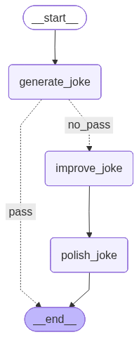
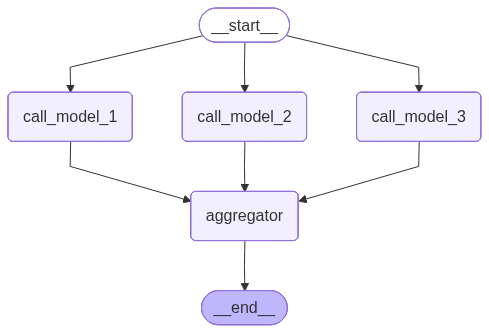
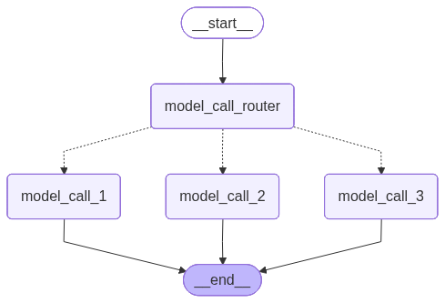
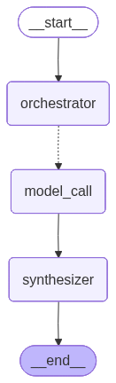
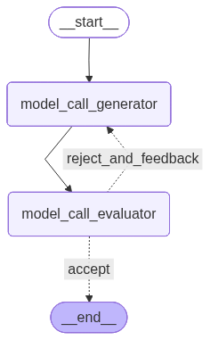
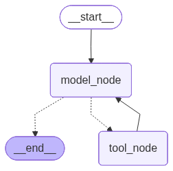

# 13. 运行图设计模式

## 13.1. 概述

**`LangGraph`** 官方总结了常用的状态图设计模式，如下

| 模式                      | 图结构                    | 运行时动态性 | 核心 `LangGraph` 能力                         |
| ------------------------- | ------------------------- | ------------ | --------------------------------------------- |
| **`Prompt Chaining`**     | 顺序链                    | 低           | 静态边、条件边                                |
| **`Parallelization`**     | 固定 **`Fan-out/Fan-in`** | 低           | 并行超步、汇聚                                |
| **`Routing`**             | 条件分支                  | 中           | 结构化输出、条件边                            |
| **`Orchestrator-worker`** | 动态 **`Fan-out/Fan-in`** | 高           | **`Send`**、**`WorkerState`**、**`Reducer`**  |
| **`Evaluator-optimizer`** | 反馈循环                  | 中           | 条件边、循环、反馈状态                        |
| **`Agent`**               | 自主决策循环              | 最高         | **`MessagesState`**、工具调用、**`ToolNode`** |

## 13.2. 实现

### 13.2.1. `Prompt Chaining`：提示词链

#### 13.2.1.1. 核心思想

将一个复杂任务拆分成若干个顺序执行的小任务：

```text
输入
 ↓
任务 A
 ↓
任务 B
 ↓
任务 C
 ↓
输出
```

后一个节点依赖前一个节点的结果。

适合：

* 翻译 → 校对 → 润色
* 生成内容 → 检查一致性 → 修订
* 提取信息 → 分类 → 格式化
* 需求分析 → 生成代码 → 代码解释

官方示例是：

```text
生成笑话
   ↓
检查是否合格
  ├─ 合格 → END
  └─ 不合格 → 改进笑话 → 最终润色 → END
```

所以 **`Prompt Chaining`** 不一定只是简单的直线，也可以在中间加入一个 **`Gate`，质量门控节点**。

**`Prompt Chaining`** 的核心是：

> **将复杂任务拆解为可独立验证的阶段，并把每一阶段的结果记录下来向后传递。**

它的优点是执行过程稳定且易于调试；缺点是流程固定，无法处理未知数量或高度动态的任务。

#### 13.2.1.2. 示例

**示例如下**

```python
from typing import TypedDict, Literal
from langgraph.graph import StateGraph, START, END

from langchain.messages import HumanMessage
from langchain_deepseek import ChatDeepSeek
from dotenv import load_dotenv
load_dotenv(override=True)

model = ChatDeepSeek(
    model="deepseek-v4-flash",
    extra_body={
        "thinking": {
            "type": "disabled"
        }
    }
)

# 图状态
class OverAllState(TypedDict):
    topic: str
    joke: str
    improved_joke: str
    final_joke: str

# 节点
def generate_joke(state: OverAllState) -> OverAllState:
    """第一次调用大模型，生成初始笑话"""

    msg = model.invoke(
        [HumanMessage(content=f"写一个关于“{state['topic']}”的简短笑话")]
    )
    return {"joke": msg.content}

def check_punchline(state: OverAllState) -> Literal["pass", "no_pass"]:
    """判断笑话中是否包含包袱"""

    # 简单判断：笑话中是否包含问号或感叹号
    if "?" in state["joke"] or "!" in state["joke"]:
        return "pass"
    return "no_pass"

def improve_joke(state: OverAllState) -> OverAllState:
    """第二次调用大模型，通过添加双关语改进笑话"""

    msg = model.invoke(
        [HumanMessage(content=f"通过添加双关语，让下面这个笑话变得更有趣：\n{state['joke']}")]
    )
    return {"improved_joke": msg.content}

def polish_joke(state: OverAllState) -> OverAllState:
    """第三次调用大模型，对笑话进行最终润色"""

    msg = model.invoke(
        [HumanMessage(content=f"为下面这个笑话添加一个出人意料的反转：\n{state['improved_joke']}")]
    )
    return {"final_joke": msg.content}

# 构建工作流
builder = StateGraph(state_schema=OverAllState)

# 添加节点
builder.add_node("generate_joke", generate_joke)
builder.add_node("improve_joke", improve_joke)
builder.add_node("polish_joke", polish_joke)

# 添加边，连接各个节点
builder.add_edge(START, "generate_joke")
builder.add_conditional_edges(
    "generate_joke",
    check_punchline,
    {
        "no_pass": "improve_joke",
        "pass": END,
    },
)
builder.add_edge("improve_joke", "polish_joke")
builder.add_edge("polish_joke", END)

# 编译工作流
graph = builder.compile()

# 调用工作流
response = graph.invoke({"topic": "猫"})
print(response)

# 绘制拓扑结构
from IPython.display import display
display(graph)
```

**运行结果如下**

```python
{
    'topic': '猫',
    'joke': '一只猫去面试，面试官问：“你有什么特长？”  \n猫淡定地回答：“我能用尾巴画圆。”  \n面试官惊讶：“真的吗？演示一下。”  \n猫转身，尾巴甩了几下，画出一个完美的圆。  \n面试官鼓掌：“太好了！你被录取了！”  \n第二天，猫上班了，发现它被送到了数学实验室——负责画π。',
    'improved_joke': '加了一点数学梗和双关后，版本如下：\n\n---\n\n一只猫去面试，面试官问：“你有什么特长？”  \n猫淡定地回答：“我能用尾巴画圆。”  \n面试官惊讶：“真的吗？演示一下。”  \n猫转身，尾巴甩了几下，画出一个完美的圆。  \n面试官鼓掌：“太好了！你被录取了！”  \n\n第二天，猫上班了，发现它被送到了数学实验室——**负责画π**。  \n\n猫叹了口气，说：“**原来我的‘圆’满人生，终究逃不过π的‘鼠’命。”**  \n\n（双关解析：  \n1. “π”音同“派”，既指圆周率，也暗示“被派遣”去画圆。  \n2. “鼠命”谐音“宿命”，同时猫抓老鼠，这里暗指猫被困在数学“鼠”洞（无限不循环小数）里，永远画不完。）',
    'final_joke': '---\n\n**反转版：**  \n第二天，猫上班了，发现它被送到了数学实验室——**负责画π**。  \n\n猫叹了口气，说：“原来我的‘圆’满人生，终究逃不过π的‘鼠’命。”  \n\n话音刚落，实验室主任推门进来，是个戴眼镜的仓鼠。仓鼠拍了拍猫的尾巴，微笑道：“别担心，我们用的是**有理数**——你每天只用画前100位，剩下的**无限循环**，由我们**鼠**类负责演算。”  \n\n猫愣了一下，突然跳起来：“等等！你是说——我画圆，你们算剩下的尾巴？”  \n\n仓鼠点头：“对，这叫……**π的‘分工’合作**。”  \n\n猫沉默三秒，忽然掏出手机：“那我得先给抓老鼠的同行打个电话——告诉他们，**‘有理’走遍天下，无理寸步难行**。”  \n\n（双关补充：  \n1. **“有理数”** 双关：既指数学上有理数（可终止或循环），也暗示“有道理的反转”——猫的“无限宿命”被仓鼠强行打断。  \n2. **“剩下的尾巴”** 双关：猫的尾巴画圆，但仓鼠们负责“补完”无限小数，字面与数学双关。  \n3. **“有理走遍天下”** 化用俗语，暗讽“有理数”才是猫的出路，而“无理”的π已变成职场协作梗。）'
}
```



---

### 13.2.2. `Parallelization`：并行化

#### 13.2.2.1. 核心思想

把相互独立的任务同时执行，最后汇总结果：

```text
                 ┌→ 任务 A ─┐
输入 → Fan-out ──┼→ 任务 B ─┼→ 聚合 → 输出
                 └→ 任务 C ─┘
```

官方将并行化分成两种用途：

1. **任务拆分**
   * 一个节点检查关键词
   * 一个节点检查格式
   * 一个节点检查事实准确性
   
2. **多次独立判断**
   * 多个模型或多个提示词分别评分
   * 最后投票、平均或综合判断

前者主要提升速度，后者主要提升置信度。

#### 13.2.2.2. 示例

**示例如下**

```python
from typing import TypedDict
from langgraph.graph import StateGraph, START, END

from langchain.messages import HumanMessage
from langchain_deepseek import ChatDeepSeek

from dotenv import load_dotenv
load_dotenv(override=True)

model = ChatDeepSeek(
    model="deepseek-v4-flash",
    extra_body={
        "thinking": {
            "type": "disabled"
        }
    }
)

# 图状态
class OverAllState(TypedDict):
    topic: str
    joke: str
    story: str
    poem: str
    combined_output: str

# 节点
def call_model_1(state: OverAllState) -> OverAllState:
    """第一次调用大模型，生成笑话"""

    msg = model.invoke(
        [HumanMessage(content=f"写一个关于“{state['topic']}”的简短的笑话")]
    )
    return {"joke": msg.content}

def call_model_2(state: OverAllState) -> OverAllState:
    """第二次调用大模型，生成故事"""

    msg = model.invoke(
        [HumanMessage(content=f"写一个关于“{state['topic']}”的简短的故事")]
    )
    return {"story": msg.content}

def call_model_3(state: OverAllState) -> OverAllState:
    """第三次调用大模型，生成诗歌"""

    msg = model.invoke(
        [HumanMessage(content=f"写一首关于“{state['topic']}”的简短的诗")]
    )
    return {"poem": msg.content}

def aggregator(state: OverAllState) -> OverAllState:
    """将笑话、故事和诗歌合并为单一输出"""

    combined = f"下面是一个关于“{state['topic']}”的故事、笑话和诗歌！\n\n"
    combined += f"故事：\n{state['story']}\n\n"
    combined += f"笑话：\n{state['joke']}\n\n"
    combined += f"诗歌：\n{state['poem']}"
    return {"combined_output": combined}

# 构建工作流
builder = StateGraph(state_schema=OverAllState)

# 添加节点
builder.add_node("call_model_1", call_model_1)
builder.add_node("call_model_2", call_model_2)
builder.add_node("call_model_3", call_model_3)
builder.add_node("aggregator", aggregator)

# 添加边，连接各个节点
builder.add_edge(START, "call_model_1")
builder.add_edge(START, "call_model_2")
builder.add_edge(START, "call_model_3")
builder.add_edge(["call_model_1", "call_model_2", "call_model_3"], "aggregator")
builder.add_edge("aggregator", END)

graph = builder.compile()

# 调用工作流
response = graph.invoke({"topic": "猫"})
print(response)

from IPython.display import display
display(graph)
```

**运行结果如下**

```python
{
    'topic': '猫',
    'joke': '“为什么猫总是赢不了电脑游戏？”\n“因为鼠标（鼠）一出现，它就光顾着抓屏（屏幕）了……”',
    'story': '# 猫的故事\n\n老张退休那年，在楼下捡到一只瘦骨嶙峋的橘猫。\n\n他本不爱猫，但看它可怜，便每天在楼道口放一碗剩饭。猫很警惕，非要等他走远了才肯吃。就这样喂了三个月，猫终于允许他靠近一臂的距离。\n\n半年后的一天夜里，老张突发心梗，倒在客厅地板上，手机摔在茶几底下，怎么也够不着。意识模糊间，他感到一团温热的东西贴上了他的胸口——是那只橘猫。它不知怎么钻进了他家门。\n\n猫用头蹭他的手，蹭他的脸，见他没反应，便冲进屋里的每一个房间，歇斯底里地叫。最后它跳上窗台，用爪子疯狂拍打玻璃，叫声惊动了楼下乘凉的邻居。\n\n120赶到时，老张已经在地上躺了将近一个小时。医生说，再晚十分钟，就悬了。\n\n出院后，橘猫正式住进了老张家。老张给它取名“富贵”，逢人就说：“我家富贵啊，有九条命，分了我一条。”\n\n富贵永远听不懂这些话。它只是每天黄昏，准时跳上老张的膝盖，把一团温暖塞进他的怀里，呼噜呼噜地睡去。',
    'poem': '## 《猫》\n\n黄昏被毛茸茸地踩碎，\n肚皮起伏如钟摆，\n眼睫间，星辰坠落。\n当琥珀瞳孔转动，\n整片夜色都来蜷卧。',
    'combined_output': '下面是一个关于“猫”的故事、笑话和诗歌！\n\n故事：\n# 猫的故事\n\n老张退休那年，在楼下捡到一只瘦骨嶙峋的橘猫。\n\n他本不爱猫，但看它可怜，便每天在楼道口放一碗剩饭。猫很警惕，非要等他走远了才肯吃。就这样喂了三个月，猫终于允许他靠近一臂的距离。\n\n半年后的一天夜里，老张突发心梗，倒在客厅地板上，手机摔在茶几底下，怎么也够不着。意识模糊间，他感到一团温热的东西贴上了他的胸口——是那只橘猫。它不知怎么钻进了他家门。\n\n猫用头蹭他的手，蹭他的脸，见他没反应，便冲进屋里的每一个房间，歇斯底里地叫。最后它跳上窗台，用爪子疯狂拍打玻璃，叫声惊动了楼下乘凉的邻居。\n\n120赶到时，老张已经在地上躺了将近一个小时。医生说，再晚十分钟，就悬了。\n\n出院后，橘猫正式住进了老张家。老张给它取名“富贵”，逢人就说：“我家富贵啊，有九条命，分了我一条。”\n\n富贵永远听不懂这些话。它只是每天黄昏，准时跳上老张的膝盖，把一团温暖塞进他的怀里，呼噜呼噜地睡去。\n\n笑话：\n“为什么猫总是赢不了电脑游戏？”\n“因为鼠标（鼠）一出现，它就光顾着抓屏（屏幕）了……”\n\n诗歌：\n## 《猫》\n\n黄昏被毛茸茸地踩碎，\n肚皮起伏如钟摆，\n眼睫间，星辰坠落。\n当琥珀瞳孔转动，\n整片夜色都来蜷卧。'
}
```



---

### 13.2.3. `Routing`：路由

#### 13.2.3.1. 核心思想

先识别输入类型，再把请求送到专门的处理流程：

```text
                    ┌→ 退款流程
输入 → 路由判断节点 ─┼→ 售价咨询流程
                    └→ 商品推荐流程
```

它适合不同类型请求需要不同处理逻辑的场景，例如：

* 售前、售后、退款分类
* 普通问答、代码生成、数据分析
* 文本、图片、音频请求分类
* 不同领域知识库的选择

#### 13.2.3.2. 设计原则

最佳实践：

* **`LLM` 节点**负责语义判断；
* **路由函数**负责把结构化结果映射到节点；
* **业务节点**负责真正处理任务。

不要让路由 LLM 直接返回任意节点名，否则模型输出和图结构会过度耦合，也难以进行类型检查和异常兜底。

#### 13.2.3.3. 示例

**示例如下**

```python
from pydantic import BaseModel, Field
from typing import Literal,TypedDict
from langgraph.graph import StateGraph, START, END
from langchain.messages import HumanMessage, SystemMessage

from langchain_deepseek import ChatDeepSeek

from dotenv import load_dotenv
load_dotenv(override=True)

model = ChatDeepSeek(
    model="deepseek-v4-flash",
    extra_body={
        "thinking": {
            "type": "disabled"
        }
    }
)

# 定义用于结构化输出的 Schema，作为路由判断依据
class Route(BaseModel):
    step: Literal["poem", "story", "joke"] = Field(
        None,
        description="路由流程中的下一执行步骤",
    )

# 为大模型添加结构化输出能力
router = model.with_structured_output(Route)

# 图状态
class OverAllState(TypedDict):
    input: str
    decision: str
    output: str

# 节点
def model_call_1(state: OverAllState) -> OverAllState:
    """生成故事"""

    result = model.invoke(
        [HumanMessage(content=state["input"])]
    )
    return {"output": result.content}


def model_call_2(state: OverAllState) -> OverAllState:
    """生成笑话"""

    result = model.invoke(
        [HumanMessage(content=state["input"])]
    )
    return {"output": result.content}


def model_call_3(state: OverAllState) -> OverAllState:
    """生成诗歌"""

    result = model.invoke(
        [HumanMessage(content=state["input"])]
    )
    return {"output": result.content}


def model_call_router(state: OverAllState) -> OverAllState:
    """将用户输入路由到合适的节点"""

    # 调用具有结构化输出能力的大模型，完成路由判断
    decision = router.invoke(
        [
            SystemMessage(
                content=(
                    "根据用户的请求，将其路由到 story、joke 或 poem。"
                    "请求编写故事时返回 story，请求编写笑话时返回 joke，"
                    "请求编写诗歌时返回 poem。"
                )
            ),
            HumanMessage(content=state["input"]),
        ]
    )

    return {"decision": decision.step}


# 条件边函数：根据路由决策选择下一个节点
def route_decision(
        state: OverAllState
) -> Literal[
    "model_call_1",
    "model_call_2",
    "model_call_3",
    END
]:
    # 返回接下来要执行的节点名称
    if state["decision"] == "story":
        return "model_call_1"
    elif state["decision"] == "joke":
        return "model_call_2"
    elif state["decision"] == "poem":
        return "model_call_3"
    return END


# 构建工作流
builder = StateGraph(OverAllState)

# 添加节点
builder.add_node("model_call_1", model_call_1)
builder.add_node("model_call_2", model_call_2)
builder.add_node("model_call_3", model_call_3)
builder.add_node("model_call_router", model_call_router)

# 添加边，连接各个节点
builder.add_edge(START, "model_call_router")
builder.add_conditional_edges(
    "model_call_router",
    route_decision,
    {
        # route_decision 返回的名称：接下来要执行的节点名称
        "model_call_1": "model_call_1",
        "model_call_2": "model_call_2",
        "model_call_3": "model_call_3",
    },
)
builder.add_edge("model_call_1", END)
builder.add_edge("model_call_2", END)
builder.add_edge("model_call_3", END)

# 编译工作流
graph = builder.compile()

# 调用工作流
state = graph.invoke({"input": "写一个关于猫的笑话"})
print(state["output"])

# 显示工作流图
from IPython.display import display
display(graph)
```

**运行结果如下**

```python
这是一个关于猫的冷笑话，希望你喜欢：

**猫为什么不喜欢洗澡？**

**因为它不想变成“落汤包”（肉包）。**

（笑点解析：谐音梗，把“落汤猫”说成“落汤包”，而猫胖胖的确实有点像包子。）
```



---

### 13.2.4. `Orchestrator-worker`：编排器—工作节点

#### 13.2.4.1. 核心思想

编排器先分析任务，动态生成若干子任务，再创建对应数量的 Worker：

```text
                         ┌→ Worker 1 ─┐
输入 → Orchestrator ─────┼→ Worker 2 ─┼→ Synthesizer → 输出
                         ├→ Worker 3 ─┤
                         └→ Worker N ─┘
```

它通常包含三个组件：

| 组件 | 职责 |
|:---|:---|
| **`Orchestrator`**（编排器） | 分析任务、制定计划、生成子任务列表 |
| **`Workers`**（工作节点） | 分别处理各子任务，通常并行执行 |
| **`Synthesizer`**（聚合节点） | 汇总所有 Worker 结果，生成最终答案 |

适合任务数量无法预先确定的场景，例如：

* 根据主题动态生成报告章节
* 修改未知数量的代码文件
* 为多个数据源分别执行分析
* 将长文档动态拆分为若干部分处理

#### 13.2.4.2. 和`Parallelization`的区别

| 模式 | 任务数量 |
|:---|:---|
| **`Parallelization`** | 编译图时已确定（静态） |
| **`Orchestrator-worker`** | 运行时动态计算 |

#### 13.2.4.3. 本质

**`Orchestrator-worker`** 本质上就是 **`Map-Reduce`**，我们在前面的课程中已经实现过了

```text
Orchestrator：生成 Map 任务
Send：动态分发
Worker：执行 Map
Reducer：合并中间结果
Synthesizer：执行 Reduce
```

#### 13.2.4.4. 示例

**示例如下**

```python
from typing import Annotated, List, TypedDict
from collections.abc import Sequence

from langchain_core.messages import SystemMessage, HumanMessage
from langgraph.graph import StateGraph, START, END
from langgraph.types import Send
from langchain_deepseek import ChatDeepSeek

from operator import add
from dotenv import load_dotenv
from pydantic import BaseModel, Field

load_dotenv(override=True)

model = ChatDeepSeek(
    model="deepseek-v4-flash",
    extra_body={
        "thinking": {
            "type": "disabled"
        }
    }
)

# 结构化输出的 Schema
class Section(BaseModel):
    name: str = Field(
        description="报告的章节名称",
    )
    description: str = Field(
        description="本节主题和核心思想的概述",
    )

class Sections(BaseModel):
    sections: List[Section] = Field(
        description="报告的章节列表",
    )

# 编排器
planner = model.with_structured_output(Sections)

# 图状态
class OverAllState(TypedDict):
    topic: str  # 报告主题
    sections: list[Section]  # 报告章节列表
    completed_sections: Annotated[
        list, add
    ]  # 所有工作节点并行写入该字段
    final_report: str  # 最终报告


# 工作节点状态
class WorkerState(TypedDict):
    section: Section
    completed_sections: Annotated[list, add]

# 节点
def orchestrator(state: OverAllState) -> OverAllState:
    """编排器：生成报告编写计划"""

    # 生成报告章节规划
    report_sections = planner.invoke(
        [
            SystemMessage(content="为这份报告生成一个章节规划。"),
            HumanMessage(content=f"报告主题如下：{state['topic']}"),
        ]
    )

    return {"sections": report_sections.sections}

def model_call(state: WorkerState) -> WorkerState:
    """工作节点：编写报告中的一个章节"""

    # 生成章节内容
    section = model.invoke(
        [
            SystemMessage(
                content=(
                    "根据提供的章节名称和章节描述编写报告内容。"
                    "不要在每个章节前添加额外的开场说明。"
                    "使用 Markdown 格式。"
                )
            ),
            HumanMessage(
                content=(
                    f"章节名称：{state['section'].name}\n"
                    f"章节描述：{state['section'].description}"
                )
            ),
        ]
    )

    # 将生成的章节写入已完成章节列表
    return {"completed_sections": [section.content]}


def synthesizer(state: OverAllState) -> OverAllState:
    """将所有章节合成为完整报告"""

    # 获取所有已完成的章节
    completed_sections = state["completed_sections"]

    # 将已完成章节拼接为最终报告
    completed_report_sections = "\n\n---\n\n".join(completed_sections)

    return {"final_report": completed_report_sections}


# 条件边函数：为规划中的每个章节创建一个 model_call 工作节点
def assign_workers(state: OverAllState) -> Sequence[Send]:
    """为规划中的每个章节分配一个工作节点"""

    # 使用 Send API 并行启动各个章节的编写任务
    return [Send("model_call", {"section": s}) for s in state["sections"]]


# 构建工作流
builder = StateGraph(state_schema=OverAllState)

# 添加节点
builder.add_node("orchestrator", orchestrator)
builder.add_node("model_call", model_call)
builder.add_node("synthesizer", synthesizer)

# 添加边，连接各个节点
builder.add_edge(START, "orchestrator")
builder.add_conditional_edges(
    "orchestrator",
    assign_workers,
    ["model_call"],
)
builder.add_edge("model_call", "synthesizer")
builder.add_edge("synthesizer", END)

# 编译工作流
graph = builder.compile()

# 调用工作流
state = graph.invoke(
    {"topic": "撰写一份关于大语言模型缩放定律的报告"}
)

from IPython.display import Markdown, display

# 显示工作流图
display(graph)
# 渲染报告
Markdown(state["final_report"])
```

**运行结果如下**



```markdown
引言
缩放定律是深度学习与人工智能领域中的核心理论基础之一。它揭示了模型性能与关键资源（如参数量、数据规模、计算算力）之间普遍存在的幂律关系，即当模型规模、训练数据量或计算预算成比例扩大时，模型的表现能力会呈现出可预测性的提升。这一发现最早源自对语言模型的系统性实证研究，随后在计算机视觉、多模态学习等众多任务中被广泛验证，深刻改变了现代AI研究的范式。

缩放定律的重要性体现在多个层面。从学术研究角度看，它不仅为“更大的模型、更多的数据”提供了科学依据，还催生了以GPT、PaLM、LLaMA为代表的大规模预训练模型浪潮。从工程实践角度看，缩放定律为资源分配提供了量化指导——研究人员可以据此预测模型性能对计算预算的依赖关系，从而制定更高效的训练策略。此外，在探索模型能力涌现性的前沿领域，缩放定律更是理解大语言模型行为边界的关键工具。因此，深入剖析缩放定律的理论内涵、实验验证与局限性，对于把握AI发展的底层逻辑具有不可替代的价值。

本报告将系统梳理缩放定律的研究脉络。后续章节首先阐述语言模型缩放的基本原理与核心公式；随后通过经典实验案例展示缩放定律的实证表现，并讨论其在不同任务与架构中的泛化能力；在此基础上，分析缩放定律的物理极限与开放挑战，包括数据效率、规模收益递减等问题；最后总结缩放定律对AI未来发展的战略启示。全文力求在学术严谨性与可读性之间取得平衡，为读者提供一幅关于缩放定律的全局图景。

缩放定律的基本概念
缩放定律（Scaling Laws）是深度学习中描述模型性能如何随模型规模（参数数量）、数据集规模（训练数据量）以及计算量（训练使用的计算资源，通常以FLOPs表示）变化的经验性规律。这些规律揭示了在大规模训练中，模型性能（例如损失值或下游任务准确率）与上述三个因素之间存在较为平滑且可预测的幂律关系。

具体而言，缩放定律通常由以下关系组成：

模型规模（Model Size）：在给定的数据集和计算预算下，增加模型参数数量（例如从几亿到数千亿）能够显著提升性能，但收益呈现递减趋势。性能提升与模型参数量的幂次方成正比，即 ( L \propto N^{-\alpha} )，其中 ( L ) 为损失， ( N ) 为参数数量， ( \alpha ) 为缩放指数。

数据集规模（Dataset Size）：在固定模型结构和计算资源的情况下，增加训练数据量同样可以降低损失。类似地，损失与数据量的关系可表示为 ( L \propto D^{-\beta} )，其中 ( D ) 为数据集规模， ( \beta ) 为对应的缩放指数。这意味着数据量越大，模型过拟合的风险越小，性能提升越稳定。

计算量（Compute）：将模型规模和数据规模同时考虑，总训练计算量（以FLOPs衡量）与性能的关系可概括为 ( L \propto C^{-\gamma} )，其中 ( C ) 为计算量。研究表明，在最优资源配置下，增加计算量能可靠地提升性能，且存在一个近似固定的计算最优前沿。

这些关系表明，模型性能并非由单一因素决定，而是三者共同作用的结果。缩放定律的核心在于，当预算（计算成本）固定时，存在一组最优的模型规模与数据规模分配，使得性能最大化。例如，若计算预算充足，则应同时扩大模型参数和训练数据；若某一资源受限，则需根据缩放指数的相对大小调整比例。

缩放定律的一个关键结论是：大模型是样本高效的——即随着模型规模增大，同样的数据量能带来更大的性能提升；反过来，大模型也是计算高效的——即同样的计算预算，训练更大的模型（配合适量数据）往往比训练小模型更优。这些规律为现代大规模语言模型的设计，如GPT系列、LLaMA等，提供了理论基础：它们正是遵循“同时扩大模型、数据和计算量”的指导原则。

核心发现：损失函数的幂律关系
Kaplan等人的研究揭示了大语言模型的损失函数与模型参数规模（(N)）、训练数据规模（(D)）以及计算量（(C)，通常以FLOPs衡量）之间存在明确的幂律（Power-Law）关系。这一发现为大规模模型的扩展提供了可预测的量化基础。

1. 损失与参数规模的幂律关系
在固定数据规模（(D)）的情况下，模型测试损失（(L)）与参数规模（(N)）呈现出双向的幂律行为：

欠参数化区域：当 (N) 较小时，模型容量不足，损失较高。
过参数化区域：当 (N) 持续增大，损失开始随参数增长以平滑的幂律形式下降，最终收敛于数据规模所限制的最优损失（即“不可约损失”）。
该关系可近似描述为： [ L(N) \approx L_{\infty} + \alpha_N \cdot N^{-\gamma_N} ] 其中 (L_{\infty}) 表示数据质量决定的不可约损失，(\gamma_N) 为幂律指数（通常在0.07-0.10之间），(\alpha_N) 为缩放常数。

2. 损失与数据规模的幂律关系
相似地，在固定参数规模（(N)）时，损失函数与训练数据规模（(D)）也呈现幂律趋势。当数据量增加，模型通过摄取更多示例改进泛化能力，损失按如下形式降低： [ L(D) \approx L_{\infty} + \alpha_D \cdot D^{-\gamma_D} ] 实验表明，(\gamma_D) 的典型值在0.07-0.10范围内，与 (\gamma_N) 接近，暗示参数和数据对损失的贡献在结构上是对称的。

3. 损失与计算量的幂律关系
计算量（(C)）被视为参数规模与数据规模的复合函数：(C \approx 6N \cdot D)（基于Transformer的前向与后向传播成本）。通过等比例扩展参数和数据，损失与计算量之间也遵循幂律规律： [ L(C) \approx L_{\infty} + \alpha_C \cdot C^{-\gamma_C} ] 其中 (\gamma_C) 通常在0.05-0.08左右，略低于前两个指数，反映了优化效率随规模增大而递减的边际效应。

4. 幂律关系的核心含义
可预测的扩展：只要维持参数和数据规模的平衡增长，损失减少的速率可被幂律精确预测，从而指导资源分配。
收益递减法则：幂律指数越小（绝对值），意味着每增加一单位计算量所获得的损失改善越慢，最终接近不可约损失。
Compute-Optimal极限：结合各项幂律曲线，存在一个最优的参数-数据配比，使得在给定总计算预算下损失最小化，这也是后续Chinchilla法则的理论基础。
综上所述，损失函数的幂律关系构成了大模型性能超越的关键先验知识，它强调了在扩展过程中参数、数据和计算量必须协同增长，否则因资源浪费（如只增加参数而不增加数据）导致幂律提升停滞。

数据与计算效率
在深度学习中，模型性能的提升往往依赖于增加参数数量与数据规模，但现实中的计算预算（如GPU时长、电力或成本）通常是有限的。如何在给定的计算预算下，最优地分配参数规模与数据规模，以实现最佳的模型性能，是数据与计算效率研究的核心问题。这涉及到缩放定律的深入理解以及训练策略的优化。

1. 缩放定律回顾与计算预算视角
根据经典的神经语言模型缩放定律（如Kaplan等人于2020年提出的研究，以及DeepMind的Chinchilla研究），模型性能（通常用验证损失衡量）受三个主要因素影响：模型参数数量（N）、训练数据Token数量（D）和计算预算（C）。缩放定律通常可以近似为幂律关系：损失 L(N,D) ≈ A/N^α + B/D^β + E，其中α和β是缩放指数，E是数据不可压缩的熵。计算预算与N和D并非独立，在大规模训练中，计算量主要来自前向和反向传播，通常近似为 C ≈ 6 * N * D（对于Transformer结构，忽略通信和嵌入层开销）。

给定固定的计算预算C，如果分配过少参数而使用过多数据（N过小，D过大），参数容量不足以捕捉数据中的模式，导致欠拟合；反之，如果参数过多而数据不足（N过大，D过小），模型会过拟合，无法通过足够的样本来泛化。最优分配的目标是找到N和D，使得在C固定的条件下，验证损失L最小化。

2. 计算最优训练：参数与数据的平衡点
Chinchilla缩放定律的研究指出，对于许多计算预算，最优的参数与数据规模满足近似关系：N_opt ∝ C^a 且 D_opt ∝ C^b，其中 a 和 b 之和接近1，且 a 通常小于 b。具体地，Chinchilla研究发现，对于使用Adam优化器的Transformer语言模型，当预算增加时，最优的参数和数据分配比例大致保持恒定，即 对于每个参数，约应分配20个训练Token（这一比例因模型架构和任务有所不同，但提供了一个直观的指导）。

例如，在计算预算为1e20 FLOPs的情况下，最优配置可能是约70B参数配合1.4T训练Token；而预算增加到2e20 FLOPs时，最优可能变为100B参数配合2T Token。这一发现反驳了早期“仅扩大参数而忽视数据”的做法，强调在固定预算下，同时按比例放大数据和参数比单独放大其中一个更有效。

3. 计算资源有限时的策略
当计算预算远小于现代主流规模（如单个GPU或小型集群）时，最优分配的策略需要更细致的考量：

预算极小的情况（如单GPU、几天训练）：参数规模和数据规模可能都受到硬件限制。此时，优先考虑模型容量，但需避免参数量超出能有效训练的最小数据量。通常，使用预训练模型微调比从头训练更高效，因为预训练模型已经在大规模数据上获得了通用表征，少量下游数据即可适配，从而将计算预算集中用于微调步骤。

中等预算（如多GPU、数周训练）：可参考缩放定律的比例关系。假设预算为C，根据N_opt ∝ C^0.5和D_opt ∝ C^0.5（此比例来自某些缩放研究，具体指数需要实验校准），推算合适的参数和Token数。实践中，可从公开的缩放曲线（如LLaMA、Chinchilla等）中提取经验公式，例如对于Transformer-LM，每增加一倍计算预算，同时将参数和Token增加约1.4倍（即C^0.5增长）。

预算极度受限且追求低成本：在边缘设备或快速原型开发中，计算效率意味着最小的参数规模实现足够好的性能。此时，推荐使用知识蒸馏、模型压缩或稀疏训练等方法。但这些方法本身需消耗计算资源，需权衡是否优于直接缩放

4. 数据效率的多重维度
除了参数与数据总量的分配，数据本身的特性也影响计算效率：

数据质量 vs. 数量：在有限计算预算下，使用高质量、代表性强的数据（例如经过筛选、去重、平衡类别的数据）往往比盲目增加数据量更有效。数据质量提升可降低所需的数据量，从而减少训练所需的计算量。

数据复用与课程学习：对数据进行多次训练（epoch）会引入过拟合风险，但在数据量不足时，适当的重复训练（如使用数据增强）可以增加有效样本数。课程学习（先易后难的数据顺序）可加速收敛，减少达到特定损失所需的计算步数。

主动学习与数据选择：在训练期间动态选择最具有信息性的数据子集进行训练，避免在容易或冗余样本上浪费计算资源。例如，基于损失值或不确定性采样，仅使用部分数据即可达到接近全量数据的性能。

5. 实际分配建议与工具使用
在工程实践中，最优分配可通过以下步骤实现：

建立小规模缩放曲线：使用计算预算的1%或更少进行小规模实验，训练不同（N,D）组合的模型，拟合幂律关系，推断出当前预算下的最优比例。
利用搜索或公式：参考已发表的缩放定律常数（如Chinchilla的20 Token/参数法则），但需注意这基于特定架构和数据集，应在目标数据上进行验证。
考虑数据生成成本：若数据获取比计算更昂贵（如需要人工标注），则应优先增大参数并使用预训练模型微调；反之，若计算昂贵而数据丰富（如互联网文本），则倾向于更多数据。
分阶段训练：若预算允许，可先训练一个大模型，再用其蒸馏小模型，是一种“先扩大参数，再缩小”的策略，但需要额外计算用于蒸馏。
总之，在有限计算预算下，最优地分配参数与数据规模的核心在于打破“越大越好”的直觉，理解缩放定律的隐含平衡，并通过质量控制和数据效率提升来最大化计算投入的回报。通过系统性实验和理论指导，可在固定成本下获得显著的性能提升。

超越损失：缩放定律对下游任务的影响
缩放定律最初源于对预训练损失随模型规模、数据量和计算量变化的观察，但其意义远不止于优化训练曲线。随着模型规模的增长，许多下游任务展现出超越简单损失改善的质性变化，呈现出涌现能力、上下文学习能力增强等非连续现象。本章将深入分析缩放定律如何预测并影响这些下游任务的表现，揭示规模提升带来的能力跃迁及其内在机制。

涌现能力：缩放定律的阶跃性预测
缩放定律通常描绘损失随规模平滑下降，但在下游任务上，模型能力并非线性提升，而是在达到特定规模后突然显现。例如，在算术推理、多步逻辑链、代码生成等任务中，小模型几乎无法完成，而大模型在参数跨过某个阈值时，准确率从接近零跃升至显著水平。这种涌现现象与实际任务性能的S形增长曲线相对应，而缩放定律通过预测模型不同区域的表示质量，揭示了涌现的触发条件：当模型参数量、数据量和训练步数满足特定组合时，隐层表征的容量与任务复杂度首次匹配。具体而言，缩放定律提供的幂律关系可以粗略估计模型在给定计算预算下的最优规模，当最优规模超过任务所需的最小表示容量时，涌现现象开始出现。因此，缩放定律并非保证所有任务同时涌现，而是定义了不同任务的能力门槛，预期在更大规模下能解锁更多高阶能力。

上下文学习能力的缩放效应
上下文学习——即模型无需梯度更新，仅通过在提示中提供少量示例即可执行新任务——是大规模语言模型最突出的特性之一。研究发现，上下文学习的性能与模型规模存在强正相关：小模型几乎不具备有效的上下文学习能力，随着参数规模扩大，模型能从示例中提取的模式更加准确，泛化偏差降低。缩放定律在此表现为：模型在上下文学习任务上的准确率通常符合对数或幂律增长，与预训练损失下降趋势并行。其背后的原因在于，随着规模增大，模型的前馈层和注意力头数增加，使得它能在前向传播中并行模拟更多的“推理步骤”，实现了内隐的梯度下降模拟。缩放定律预测，在固定计算预算下，规模更大的模型在上下文学习上的收益将超过同等效率的微调方法，从而引导研究者在提示工程和大规模预训练之间做出资源分配决策。

任务泛化与分布外表现
缩放定律对下游任务的影响不仅限于在分布内示例上的表现，更关键的是对分布外泛化能力的提升。实验表明，随着模型规模增长，模型在不同任务类别、不同领域、甚至不同语言之间的迁移性能稳定提升。这源于缩放定律中“数据多样性”的维度——更大的模型能更充分地利用多源数据中的结构共性，从而在未明确训练的领域形成鲁棒的假设。例如，在数学推理任务上，缩放定律使得模型能将从自然语言中学到的逻辑模式迁移至符号推理，表现出更强的类比和抽象能力。然而，这种迁移并非均匀：某些依赖低频知识或特殊模式的任务，可能仍需要接近边界规模才能突破泛化瓶颈。缩放定律因此为任务选择提供了依据——优先将计算资源分配给那些对规模敏感、且具有明确泛化回报的任务。

任务特定缩放曲线与优化经济性
不同下游任务对模型规模、数据量和计算量的响应曲线各异。有些任务（如简单分类或QA）在中小规模模型上即饱和，进一步扩展规模带来的收益递减很快；而另一些任务（如复杂推理、多语言理解）则持续受益于规模扩大。通过构建任务特定的缩放曲线（通常为幂律或指数饱和形式），研究者可以预测在给定计算预算下，投入资源以提升模型规模、增加训练数据或优化数据质量三者中的最优选择。例如，对于认知密集型任务，在模型规模上的投入回报率往往高于数据增量；而对于知识密集型任务，数据多样性可能更重要。这种缩放定律的延伸应用，使得模型部署决策更加数据驱动，避免了盲目扩大规模导致的经济浪费。

涌现能力背后的机制：表示压缩与结构对齐
进一步分析，缩放定律对涌现能力的积极影响可以理解为：大规模模型通过高维表示实现了对任务本质结构的压缩与对齐。在小规模模型中，隐层表示空间难以同时编码多个复杂模式，导致任务相关信号被噪声淹没。而当模型规模超过临界点，表示空间的各个维度开始分离出可解释的语义轴（如因果关系、时态关系、空间关系等）。缩放定律预测这些表示维度的“分化临界点”，在该点之后，模型能够以更少的冲突编码多个任务的隐含规则。此外，注意力模式的稳定化——即多头注意力在大型模型中形成更聚焦的依赖关系——进一步支撑了长程逻辑和上下文结构的捕捉，从而直接提升了下游任务的逻辑一致性和准确性。

缩放极限与下游任务瓶颈
尽管缩放定律整体上乐观地预测了规模带来的收益，但对下游任务的影响并非无限。随着模型参数进一步增大，部分任务（特别是需要外部知识更新或实时推理的任务）会遇到内存带宽瓶颈、指令遵循退化或幻觉加剧等问题。缩放定律在此提示，当模型规模超过数据质量所能支撑的有效容量时，损失的下行趋势放缓，而下游任务的性能可能进入“平台期”甚至出现波动。例如，极端大的模型可能对上下文中的干扰信息更敏感，导致在简单任务上的表现反常。因此，未来在追求更优下游任务表现时，不仅需要继续扩展规模，还必须结合数据治理、对齐训练和检索增强等手段，以跨越缩放定律在应用层面的新瓶颈。

3.3 Chinchilla缩放定律与最优计算分配
在深度学习的规模探索中，DeepMind提出的Chinchilla研究引入了关于模型与数据规模分配的新视角。以往的研究，如Kaplan等人提出的缩放定律，倾向于认为在增加模型参数时，数据规模可以相对缓慢地增长，即模型越大，性能随计算量提升的边际收益越显著。然而，Chinchilla研究对此提出了挑战。

核心观点：对于给定的计算预算（即总计算量，通常以FLOPs衡量），模型参数数量与训练数据规模（Token数量）应当等比例缩放。换言之，当计算预算增加时，为了达到最优性能，必须同时增加模型的参数和训练数据量，且两者间存在一个最优的比例关系。

研究方法。Chinchilla团队通过系统地变化模型大小（参数数量）和训练数据量（Token数量），在固定计算预算下评估模型性能。他们发现，在以往的研究中，许多大型模型（如GPT-3）实际上是在“计算欠调度”状态下训练的——即模型过大而数据不足。这意味着，在同样的计算预算下，如果一个模型较小但训练在更多的数据上，它可能会取得更好的性能。

关键结论。Chinchilla揭示了最优计算分配的法则：

最优模型参数与训练Token数应遵循大致相等的缩放率。
具体而言，对于主流Transformer模型，最优的模型参数数量（N）与训练Token数量（D）之间满足：N ∝ D。这意味着，当计算预算翻倍时，应同时将模型大小和数据量分别增加约1.4倍（即N ∝ C^0.5, D ∝ C^0.5，其中C为计算量）。
实际影响。基于这一发现，DeepMind训练了Chinchilla模型：一个拥有70亿参数的模型，但使用1.4万亿个Token进行训练。与当时更大规模的模型（如Gopher，2800亿参数，仅3000亿Token训练）相比，在相同的计算预算下，Chinchilla在多种自然语言处理任务中表现更优或相当。这证明了“小而精”的缩放策略的潜力：与其盲目增大模型，不如在模型和数据间取得更平衡的分配。

理论意义。Chinchilla缩放定律重新定义了“缩放”的内涵——它不再是单纯的参数扩展，而是计算资源在模型复杂度（参数空间）和数据复杂度（经验分布覆盖度）之间的优化分配。这一观点为后续的模型训练（如LLaMA系列）提供了重要指导，强调了数据质量与规模的重要性不亚于模型架构的复杂性。

缩放定律的局限性与挑战
缩放定律的边界

缩放定律（Scaling Laws）揭示了模型性能与模型参数、数据量、计算量之间的幂律关系，但这一规律并非无限制成立。随着模型规模的持续增长，性能提升呈现边际递减趋势，最终趋近于一个理论或实际的上限。该边界的出现源于多重因素：首先，现有训练数据的质量与多样性存在天花板，即使增加数据量，新数据提供的信息增益也会下降；其次，模型容量受限于硬件架构（如内存带宽、计算单元效率），极端规模的模型可能触发通信瓶颈或能耗约束；再者，缩放定律本身假设了理想化的训练条件，未考虑实际训练中的噪声、分布偏移等扰动。因此，简单地堆叠参数和计算资源已难以突破性能瓶颈，研究者需重新审视缩放定律的适用范围。

数据稀缺的困境

高质量训练数据的稀缺性是当前缩放定律面临的核心挑战之一。自然语言、图像等领域中，人工标注或精选数据的增长速率远落后于模型参数规模的扩展。无监督数据虽可大规模获取，但其噪声、冗余和不平衡分布可能导致模型学习到虚假相关性，而非真正有意义的模式。例如，在罕见语言任务或专业领域（如医学、法律）中，数据稀疏性直接限制了模型泛化能力。此外，基于互联网爬取的粗筛数据包含偏见、脏标签和版权问题，进一步加剧了数据质量与规模之间的张力。解决这一困境需要探索数据增强、半监督学习或合成数据生成等替代方案，但现有方法仍难以完全弥补真实数据的缺失。

训练不稳定性问题

大规模模型训练固有的不稳定性是缩放定律实际应用的又一障碍。当模型参数增至数百亿甚至万亿级别时，优化过程中的梯度爆炸、损失振荡、模式坍塌等问题显著增加。这主要由以下原因引起：深度网络中的梯度传播路径过长导致信号衰减；批量规模（batch size）与学习率之间的协变关系难以维护；分布式训练中的异步通信引入延迟和参数不一致。训练不稳定性不仅延长了收敛时间，还可能使模型陷入局部最优或产生灾难性遗忘。现有缓解手段（如梯度裁剪、混合精度训练、优化器调参）虽能部分缓解问题，但缺乏理论保证，尤其是当模型规模跨越特定临界点后，传统训练策略可能完全失效。

超越简单缩放的模型架构创新

面对缩放定律的局限性，研究者正转向非简单缩放的架构创新，以绕过参数扩张的性能瓶颈。例如，混合专家模型（MoE）通过稀疏激活机制，在增加总参数量的同时保持计算成本接近线性增长；维度扩展策略（如线性注意力、长序列建模）尝试替代传统transformer中的二次复杂度注意力机制；此外，结构化权重矩阵（如低秩分解、张量分解）能在不显著增加模型尺寸的前提下提升表达能力。这些创新揭示了更高效的缩放方向：而非盲目提升参数量，优化模型内部的信息流动效率、参数复用率以及计算资源分布。未来，结合神经架构搜索（NAS）或自演化设计的方法，可能进一步打破缩放定律的线性束缚，开辟新的性能增长路径。

结论与展望
本文围绕缩放定律（Scaling Laws）展开了系统性分析，揭示了大规模模型性能与计算资源、数据规模及参数数量之间存在的幂律关系。核心结论包括：模型性能在相当广泛的范围内随计算预算、数据集大小和参数数量的增加而稳定提升，这一规律为现代深度学习模型的规模化设计提供了理论依据与工程指导。然而，缩放并非无代价，边际收益递减、训练成本激增以及数据质量瓶颈成为进一步扩展的主要制约因素。

在未来研究方向上，稀疏模型（Sparse Models）展现出突破现有缩放瓶颈的潜力。通过引入混合专家系统（MoE）、参数高效微调及动态结构剪枝等机制，稀疏模型可在不显著增加计算开销的前提下，实现参数规模的有效放大。该方向有望打破密集模型中的线性缩放约束，推动模型容量与效率的协同增长。

多模态缩放（Multimodal Scaling）是另一个值得关注的前沿领域。当前缩放定律多聚焦于单一模态（如文本或图像），而跨模态联合训练下性能与资源间的映射关系尚不明确。未来亟需建立针对多模态输入的统一缩放框架，探索视觉、语言、音频等异构数据在共同训练过程中的交互效应与计算效率优化策略。

此外，训练数据质量与来源的多样性、模型泛化边界、以及缩放定律在非自监督学习范式（如强化学习、在线学习）中的适用性，构成后续研究需要深入探讨的关键议题。随着实际部署对能耗、推理速度和环境可持续性提出更高要求，缩放定律的应用亦需与资源约束感知模型设计及低碳训练方法相结合。总之，未来研究需在理解缩放基本规律的基础上，拓展其边界，提升其可控性，并为其在更广泛人工智能系统中的部署提供理论支持与实践路径。
```

---

### 13.2.5. `Evaluator-optimizer`：评估器—优化器

#### 13.2.5.1. 核心思想

一个节点生成结果，另一个节点评估结果；不合格就携带反馈重新生成：

```text
          ┌──────────────────────┐
          ↓                      │
输入 → Generator → Evaluator ────┤
                      ├─ 不合格 ─┘
                      └─ 合格 → END
```

适合：

* 翻译质量迭代
* 代码生成与代码审查
* 文案生成与合规检查
* **`SQL`** 生成与语法验证
* 报告生成与事实检查
* 人工审批后修改

这种模式适用于存在明确质量标准，但通常需要多轮修改才能满足标准的任务。评估者既可以是 **`LLM`**，也可以是规则、测试程序或人类。

#### 13.2.5.2. 必要的控制

为了避免无限循环，必须引入递归限制，可以是

- 优雅退出的主动方法
- 异常中断的被动方法

我们在介绍循环结构时已经系统讲解过了。

#### 13.2.5.3. 示例

**示例如下**

```python
from typing import TypedDict, Literal
from langgraph.graph import StateGraph, START, END
from langchain.messages import HumanMessage
from langchain_deepseek import ChatDeepSeek

from dotenv import load_dotenv
from pydantic import BaseModel, Field

load_dotenv(override=True)

model = ChatDeepSeek(
    model="deepseek-v4-flash",
    extra_body={
        "thinking": {
            "type": "disabled"
        }
    }
)

# 图状态
class OverAllState(TypedDict):
    joke: str
    topic: str
    feedback: str
    funny_or_not: str

# 定义用于结构化输出的 Schema，作为笑话评估依据
class Feedback(BaseModel):
    grade: Literal["好笑", "不好笑"] = Field(
        description="判断这个笑话是否好笑。",
    )
    feedback: str = Field(
        description="如果笑话不好笑，请给出具体的改进建议。",
    )

# 为大模型添加结构化输出能力，定义评估器
evaluator = model.with_structured_output(Feedback)

# 节点
def model_call_generator(state: OverAllState) -> OverAllState:
    """大模型生成笑话"""

    if state.get("feedback"):
        msg = model.invoke(
            f"""
            写一个关于“{state['topic']}”的笑话。

            请参考下面的改进建议：
            {state['feedback']}
            """
        )
    else:
        msg = model.invoke(f"写一个关于“{state['topic']}”的笑话")

    return {"joke": msg.content}


def model_call_evaluator(state: OverAllState) -> OverAllState:
    """大模型评估笑话"""

    grade = evaluator.invoke(
        f"""
        请评估下面这个笑话是否好笑：

        {state['joke']}
        """
    )

    return {
        "funny_or_not": grade.grade,
        "feedback": grade.feedback,
    }


# 条件边函数：根据评估结果决定结束流程，或者返回笑话生成节点
def route_joke(state: OverAllState) -> Literal["accept", "reject_and_feedback", END]:
    """根据评估结果决定接受笑话或根据反馈重新生成"""

    if state["funny_or_not"] == "好笑":
        return "accept"
    elif state["funny_or_not"] == "不好笑":
        return "reject_and_feedback"
    return END

# 构建工作流
builder = StateGraph(state_schema=OverAllState)

# 添加节点
builder.add_node("model_call_generator", model_call_generator)
builder.add_node("model_call_evaluator", model_call_evaluator)

# 添加边，连接各个节点
builder.add_edge(START, "model_call_generator")
builder.add_edge("model_call_generator", "model_call_evaluator")
builder.add_conditional_edges(
    "model_call_evaluator",
    route_joke,
    {
        # route_joke 返回的名称：接下来要执行的节点
        "accept": END,
        "reject_and_feedback": "model_call_generator",
    },
)

# 编译工作流
graph = builder.compile()

# 调用工作流
state = graph.invoke({"topic": "猫"})
print(state["joke"])

# 显示工作流图
from IPython.display import display
display(graph)
```

**运行结果如下**

```python
# 关于猫的笑话

一只猫去应聘当保安。

面试官问：“你有什么特长？”

猫说：“我精通‘猫步’，走路悄无声息，可以抓到任何小偷。”

面试官点头：“不错。那面对危险情况，你会怎么处理？”

猫淡定地说：“我会用‘九条命’精神，即使失败一次，还有八次机会总结经验。”

面试官很满意：“那我们决定录用你。不过，我们有个夜班岗位，你介意夜间工作吗？”

猫“喵”了一声：“正合我意，白天我要晒着太阳睡觉的。”

然后面试官又问：“最后一个问题——你如果发现仓库里有老鼠，会怎么处置？”

猫瞪大了眼睛：“老鼠？那是我请来的线人！没有老鼠，我怎么假装抓到战绩，让你们给我加罐头？”

面试官：“……你被开除了。”

猫耸耸肩：“无所谓，反正我还有八条命去找下一份工作。”
```



---

### 13.2.6. `Agent`：智能体循环

#### 13.2.6.1. 核心思想

前面的运行图设计模式都属于 **`Workflow`**，**`Agent`** 与 **`Workflow`** 最大的不同是：

> 开发者不再预先确定每一步具体执行什么，而是让 **`LLM`** 根据当前消息和工具结果决定下一步行为。

基本拓扑是：

```text
          ┌─────────────────┐
          ↓                 │
输入 → LLM 决策 → 是否调用工具
                ├─ 是 → Tool ┘
                └─ 否 → END
```

即最基础的 **`ReAct`** 架构，我们已经不止一次介绍并实现过 **`ReAct`** 架构的 **`Agent`**

**`Agent`** 适合问题求解步骤和工具调用顺序无法预先确定的场景。开发者仍然负责提供工具集合、系统提示词、权限和边界，但具体执行过程由模型动态决定。

#### 13.2.6.2. 示例

**示例如下**

```python
from typing import Literal
from langgraph.graph import StateGraph, START, END, MessagesState
from langgraph.prebuilt.tool_node import ToolNode

from langchain.messages import HumanMessage
from langchain_deepseek import ChatDeepSeek
from langchain.tools import tool

from dotenv import load_dotenv
load_dotenv(override=True)

model = ChatDeepSeek(
    model="deepseek-v4-flash",
    extra_body={
        "thinking": {
            "type": "disabled"
        }
    }
)

@tool(parse_docstring=True)
def get_weather(city: str) -> str:
    """
    根据城市查询当日天气

    Args:
        city: 城市名称
    """
    return f"{city} 今天天气不错"

tools = [get_weather]
model_with_tools = model.bind_tools(tools=tools)

def model_node(state: MessagesState) -> MessagesState:
    messages = state["messages"]
    response = model_with_tools.invoke(input=messages)

    return {
        "messages": [response]
    }

def router(state: MessagesState) -> Literal["tool_node", END]:
    last_msg = state["messages"][-1]

    if last_msg.tool_calls:
        return "tool_node"
    return END

builder = StateGraph(state_schema=MessagesState)
builder.add_node("model_node", model_node)
builder.add_node("tool_node", ToolNode(tools=tools))

builder.add_edge(START, "model_node")
builder.add_conditional_edges("model_node", router, path_map=["tool_node", END])
builder.add_edge("tool_node", "model_node")

graph = builder.compile()

response = graph.invoke({"messages": [HumanMessage(content="今天北京天气怎么样？")]})
for msg in response["messages"]:
    msg.pretty_print()

from IPython.display import display
display(graph)
```

**运行结果如下**

```python
================================ Human Message =================================

今天北京天气怎么样？
================================== Ai Message ==================================

好的，我来帮你查询一下今天北京的天气情况。
Tool Calls:
  get_weather (call_00_3kFtzQHjGl7VJkfBi5280445)
 Call ID: call_00_3kFtzQHjGl7VJkfBi5280445
  Args:
    city: 北京
================================= Tool Message =================================
Name: get_weather

北京 今天天气不错
================================== Ai Message ==================================

今天北京的**天气不错**哦！☀️

看起来是个适合出门活动的好天气，不用太担心下雨或恶劣天气的问题。如果你有具体的户外活动计划，应该会比较顺利。

请问还有其他需要帮忙的吗？😊
```


