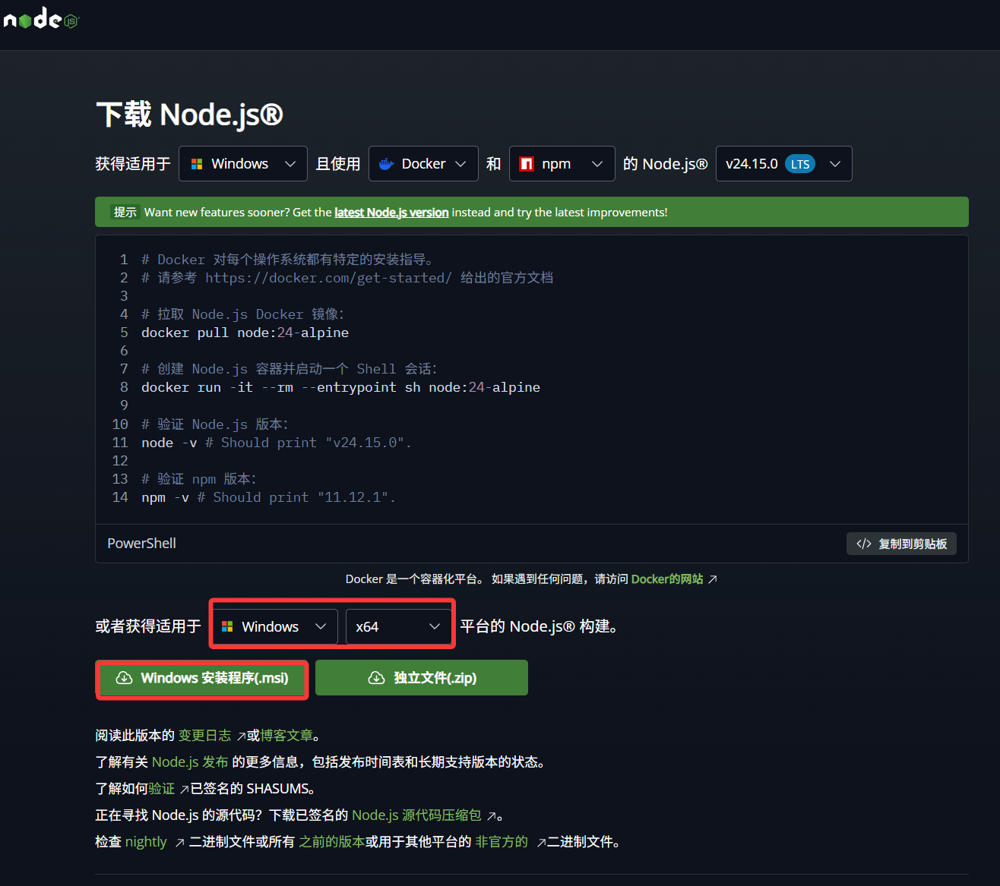

# 课程介绍与环境准备

> 从零开始，用自然语言指挥AI构建真实软件项目
>
> 基于 Claude Code 深度实践 | 多模型配置全覆盖 | 国内用户友好

## 阅读约定

在正式开始之前，先了解本教程中使用的标记约定：

> **提示**：这是一个帮助你更好理解概念的提示信息。

> **注意**：这是一个需要特别留意的事项，忽略可能导致问题。

> **避坑**：这是其他学习者踩过的坑，提前了解可以少走弯路。

> **验证**：这是一个检查点，执行后应该看到预期结果，确认你走在正确的路上。

- 所有终端命令前会标注适用的操作系统（Windows / macOS / 通用）
- 代码注释全部使用中文，方便理解
- 模型、价格、安装命令和第三方工具信息变化很快；本文中相关信息已在 **2026-05-18** 按官方文档做过一次核对，正式使用前仍应以官网当前页面为准
- `$` 符号表示终端命令提示符，输入命令时不需要输入 `$`
- 尖括号 `<xxx>` 表示需要替换为你自己的实际内容

---

## 前言：一个不会写代码的人，如何用AI构建软件

### 一个真实的故事

想象这样一个场景：产品经理小王完全不会写代码，但他用自然语言向AI描述了自己想要的功能 —— "帮我做一个团队内部的书签收藏工具，支持按标签分类和搜索"。三天后，一个功能完整、界面美观的Web应用上线了。

这不是科幻，这是2026年正在发生的事情。

传统的编程学习路径是这样的：花几个月学语法 → 花几个月做练习 → 花几个月做项目 → 终于能写出可用的软件。而AI编程的路径完全不同：**你只需要学会"如何清晰地表达你想要什么"，AI来负责把它变成代码**。

这就像你不需要学会砌墙、接水管、布电路，你只需要能清楚地告诉装修队"我想要一个什么样的家"，专业的团队会帮你实现。AI编程工具就是你的"装修队"，而你要学的，是如何当好这个"业主"。

### 这本教程是写给谁的

本教程面向**完全没有编程经验的初学者**。你不需要具备以下任何知识：

- 不需要会任何编程语言（Python、JavaScript、Java……统统不需要）
- 不需要数学基础
- 不需要计算机科学学位
- 不需要之前用过任何开发工具

你只需要具备：

- 基本的电脑操作能力（会上网、会装软件、会管理文件夹）
- 一定的英语阅读能力（能借助翻译工具看懂简单的英文界面即可）
- 清晰的逻辑思维（能描述清楚"我想要什么"）
- 一颗愿意尝试的心

### 你将学到什么

完成本教程后，你将能够：

| 能力         | 具体表现                                                   |
| ------------ | ---------------------------------------------------------- |
| 理解AI编程   | 能向他人解释什么是Vibe Coding、Agentic Engineering、SDD    |
| 掌握核心工具 | 能熟练使用Claude Code完成完整的软件开发                    |
| 灵活选模型   | 能根据任务需求选择最合适的AI模型（Claude/DeepSeek/千问等） |
| 构建Skill    | 能创建自定义的AI技能模块，提升开发效率                     |
| 独立做项目   | 能独立使用AI工具从零构建并部署一个完整的Web应用            |

### 学习路径总览

```
第零部分：环境准备 ──→ 打好地基，安装必要工具
   ↓
第一部分：基础理论 ──→ 建立认知，理解AI编程的核心概念
   ↓
第二部分：工具生态 ──→ 了解主流工具与模型，完成安装与选型
   ↓
第三部分：Claude Code 深度使用 ──→ 掌握武器，深入学习Claude Code的全部能力 核心
   ↓
第四部分：技能系统 ──→ 效率倍增，构建可复用的AI技能
   ↓
第五部分：项目实操 ──→ 学以致用，从零到一完成完整项目 重点
   ↓
第六部分：独立实战 ──→ 独当一面，自主完成项目开发
   ↓
第七部分：Codex Desktop ──→ 拓展视野，掌握另一个主流AI编程工具
```

### 学习建议

1. **动手大于阅读** —— 每学一个概念，立刻打开终端实践
2. **项目驱动学习** —— 带着"我要做出一个产品"的目标去学
3. **拥抱错误** —— AI会犯错，你也会犯错，这都是学习过程
4. **持续迭代** —— 没有一步到位的完美，先能跑再说
5. **记录与分享** —— 把踩的坑记下来，分享出去，加深理解

---

## 第零部分：环境准备与工具安装

> **学习目标**：搭建完整的开发环境，确保后续学习零障碍
>
> **完成标志**：能在终端执行基本命令，至少一个AI编程工具可正常运行

工欲善其事，必先利其器。在正式进入AI编程世界之前，我们需要先把"工作台"搭好。这就像做菜之前先把厨房收拾好、食材买齐 —— 虽然不是最激动人心的环节，但跳过它后面会处处碰壁。

### 0.1 终端/命令行入门：你的AI编程控制台

#### 0.1.1 什么是终端

你平时用电脑，是通过鼠标点击图标、菜单来操作的，这叫**图形界面（GUI）**。而**终端（Terminal）**是另一种操作电脑的方式 —— 通过输入文字命令来告诉电脑做什么。

打个比方：图形界面就像在餐厅看着菜单点菜（点什么有什么），终端就像直接跟厨师说你想吃什么（更灵活，但需要知道怎么"说"）。

AI编程工具（如Claude Code）几乎全部运行在终端中，所以掌握基本的终端操作是第一步。

#### 0.1.2 如何打开终端

**Windows 用户：**

1. 按下键盘上的 `Win + R` 键（Win 是键盘左下角带 Windows 标志的键）
2. 在弹出的"运行"对话框中输入 `powershell`
3. 按回车键

或者更简单的方式：

1. 在桌面底部的搜索栏中搜索"PowerShell"
2. 点击"Windows PowerShell"打开

**macOS 用户：**

1. 按下 `Command + 空格` 打开 Spotlight 搜索
2. 输入 `Terminal` 或"终端"
3. 按回车键打开

> **提示**：打开终端后你会看到一个黑色（或白色）的窗口，里面有一个闪烁的光标等待你输入命令。不要怕，它不会因为你输错命令就爆炸 —— 最多给你一个报错信息而已。

#### 0.1.3 5个必会终端命令

以下是你需要掌握的最基本的终端命令。打开终端，跟着一起敲：

**1. `pwd` —— 查看当前位置（我在哪？）**

```bash
# 通用命令（macOS/Linux直接输入，Windows PowerShell也支持）
$ pwd
```

预期输出：

```
# Windows 输出类似：
C:\Users\你的用户名

# macOS 输出类似：
/Users/你的用户名
```

这就像你在商场里，看一下脚下的地图上"您在此处"的标记。

**2. `ls`（macOS/Linux）或 `dir`（Windows）—— 查看当前目录有什么**

```bash
# macOS / Linux
$ ls

# Windows PowerShell（ls也可以用，但dir是经典命令）
$ dir
```

预期输出：

```
Desktop    Documents   Downloads   Pictures   Videos
桌面       文档       下载       图片      视频
```

就像打开一个文件夹，看看里面有什么东西。

**3. `cd` —— 进入某个目录（走到某个位置）**

```bash
# 进入"桌面"文件夹
$ cd Desktop

# 返回上一级目录
$ cd ..

# 直接回到用户主目录
$ cd ~
```

`cd` 是 "change directory" 的缩写，就是"换个地方"的意思。

**4. `mkdir` —— 创建新文件夹**

```bash
# 创建一个名为 my-project 的文件夹
$ mkdir my-project

# 验证：查看是否创建成功
$ ls
```

预期输出中应该能看到 `my-project` 文件夹。

**5. `clear` —— 清屏（屏幕太乱了，清理一下）**

```bash
$ clear
```

> **验证**：在终端中依次执行以下命令，确认你能正常操作：
>
> ```bash
> $ pwd
> $ mkdir ai-coding-test
> $ cd ai-coding-test
> $ pwd
> $ cd ..
> ```
>
> 如果每条命令都能正常执行且没有报错，恭喜你，终端入门完成！

#### 0.1.4 常见问题

| 问题                               | 原因                       | 解决方案                           |
| ---------------------------------- | -------------------------- | ---------------------------------- |
| 命令输入后提示"不是内部或外部命令" | 命令拼写错误或该命令不存在 | 检查拼写，注意大小写               |
| 中文路径导致命令失败               | 某些工具不支持中文路径     | 使用全英文路径名，如 `D:\projects` |
| PowerShell 窗口闪退                | 可能被系统策略限制         | 右键以管理员身份运行               |

> **注意**：在整个教程中，请尽量使用**全英文**的文件夹名和文件名。中文路径在很多开发工具中会引发奇怪的错误，这是一个经典的坑。

---

### 0.2 开发环境安装

#### 0.2.1 Node.js 安装

Node.js 是一个让 JavaScript 能在电脑上运行的环境。它是前端开发、npm 包管理、Next.js/Vite 项目的基础工具，也是 Claude Code 官方安装前置条件之一。

你可以把 Node.js 理解为 AI 编程项目的“基础运行环境”：很多脚手架、依赖安装、构建命令都离不开它。

**下载安装：**

1. 打开浏览器，访问 Node.js 官网：https://nodejs.org/
2. 你会看到两个版本按钮，选择左边的 **LTS（长期支持版）**，这是最稳定的版本
3. 下载完成后，双击安装包
4. 安装过程中一路点 **"Next"**（下一步），保持默认选项即可
5. 最后点 **"Install"** 完成安装



> **注意**：安装时请确保勾选了"Add to PATH"选项（默认是勾选的），这样才能在终端中直接使用 `node` 和 `npm` 命令。

**验证安装：**

安装完成后，**关闭并重新打开终端**（这一步很重要，否则新安装的命令可能找不到），然后输入：

```bash
# 检查 Node.js 版本
$ node -v
```

预期输出：

```
v24.15.0
```

（版本号可能不完全一致。建议安装官网当前 LTS 版本；如果用 npm 安装 Claude Code，需要 Node.js `v18` 或更高版本。）

```bash
# 检查 npm 版本（npm 是 Node.js 自带的包管理器）
$ npm -v
```

预期输出：

```
11.12.1
```

> **验证**：如果两条命令都能输出版本号，恭喜，Node.js 安装成功！

**常见问题：**

| 问题                                        | 原因                      | 解决方案                                                                      |
| ------------------------------------------- | ------------------------- | ----------------------------------------------------------------------------- |
| `node: command not found` 或 "不是内部命令" | Node.js 未添加到系统 PATH | 重新安装并确保勾选 "Add to PATH"；或手动将 Node.js 安装目录添加到系统环境变量 |
| 版本低于 v18                                | 下载了旧版本              | 重新到官网下载最新的 LTS 版本                                                 |
| 安装过程报错（Windows）                     | 权限不足                  | 右键安装包 → "以管理员身份运行"                                               |
| macOS 提示"无法验证开发者"                  | macOS 安全限制            | 系统偏好设置 → 安全性与隐私 → 仍要打开                                        |

> **提示**：如果你是 macOS 用户，推荐使用 `nvm`（Node Version Manager）来管理 Node.js 版本，方便将来切换不同版本。安装命令：
>
> ```bash
> $ curl -o- https://raw.githubusercontent.com/nvm-sh/nvm/v0.39.0/install.sh | bash
> ```
>
> 安装完成后重启终端，然后使用 `nvm install --lts` 安装最新 LTS 版本。

#### 0.2.2 Git 安装与配置

Git 是一个"版本控制"工具。什么是版本控制？想象你在写一篇文章，每写一个版本你都存一份副本：`论文_v1.doc`、`论文_v2.doc`、`论文_最终版.doc`、`论文_最终最终版.doc`…… Git 就是帮你优雅地管理这些版本的工具。

在AI编程中，Git 尤其重要 —— 因为**AI有时候会改错代码**。有了 Git，你可以随时"时光倒流"回到之前正确的版本。这是你的"后悔药"。

**下载安装：**

**Windows 用户：**

1. 访问 https://git-scm.com/download/win
2. 下载 64-bit 版本的安装包
3. 双击安装，安装过程中保持所有默认选项即可（会有很多页配置，不用改，一直点 Next）
4. 安装完成

**macOS 用户：**

macOS 通常自带 Git。打开终端输入 `git --version`，如果有输出就不需要安装。如果没有，执行：

```bash
# macOS 安装 Git（通过 Xcode 命令行工具）
$ xcode-select --install
```

弹出的对话框中点击"安装"即可。

**验证安装：**

```bash
$ git --version
```

预期输出：

```
git version 2.43.0
```

**首次配置（必须）：**

安装完成后，需要告诉 Git 你是谁（这些信息会记录在每次代码提交中）：

```bash
# 设置你的名字（用英文，可以是昵称）
$ git config --global user.name "Your Name"

# 设置你的邮箱
$ git config --global user.email "your.email@example.com"
```

> **提示**：这里的名字和邮箱不需要是真实的，但建议和你将来注册 GitHub 的邮箱保持一致。

**Git 最小生存技能（6条命令走天下）：**

你现在不需要精通 Git，只要记住这6条命令就够了（后面遇到会详细解释）：

```bash
# 1. 在项目文件夹中初始化 Git 仓库（只需要做一次）
$ git init

# 2. 查看当前文件状态（哪些文件被修改了）
$ git status

# 3. 把修改的文件添加到"暂存区"（准备提交）
$ git add .

# 4. 提交一个版本（附带说明信息）
$ git commit -m "描述这次修改做了什么"

# 5. 将代码推送到远程仓库（如GitHub）
$ git push

# 6. 从远程仓库拉取最新代码
$ git pull
```

> **避坑**：使用AI编程工具时，养成一个好习惯 —— **在让AI做大的修改之前，先 `git add . && git commit -m "保存当前进度"`**。这样即使AI改坏了，你也能用 `git checkout .` 恢复到之前的状态。这是无数开发者总结出的血泪经验。

#### 0.2.3 Python 安装（可选）

Python 在本教程的第六部分（AI知识库项目）中会用到。如果你暂时只想学前端项目，可以先跳过。

**下载安装：**

1. 访问 https://www.python.org/downloads/
2. 下载最新版本（建议 Python 3.11 或 3.12）
3. **Windows 用户特别注意**：安装时务必勾选 **"Add Python to PATH"** 选项！

**验证安装：**

```bash
# Windows
$ python --version

# macOS / Linux（可能需要用 python3）
$ python3 --version
```

预期输出：

```
Python 3.12.4
```

```bash
# 验证 pip（Python 包管理器）
$ pip --version
```

预期输出：

```
pip 24.0 from ... (python 3.12)
```

---

### 0.3 环境验证：确认一切就绪

完成上面的安装后，让我们做一次全面的环境检查，确保所有工具都正常工作。

**环境检查清单：**

打开终端，依次执行以下命令：

```bash
# 1. 检查 Node.js
$ node -v
# 预期输出: v18.x.x 或更高版本

# 2. 检查 npm
$ npm -v
# 预期输出: 9.x.x 或 10.x.x 或更高版本

# 3. 检查 Git
$ git --version
# 预期输出: git version 2.x.x

# 4. 检查 Python（可选）
$ python --version
# 预期输出: Python 3.11.x 或 3.12.x
```

**创建你的第一个项目文件夹：**

```bash
# 在你喜欢的位置创建一个总的工作目录
# Windows 建议：
$ mkdir D:\ai-coding-projects

# macOS 建议：
$ mkdir ~/ai-coding-projects

# 进入这个目录
$ cd D:\ai-coding-projects  # Windows
$ cd ~/ai-coding-projects   # macOS

# 初始化 Git
$ git init
```

预期输出：

```
Initialized empty Git repository in .../ai-coding-projects/.git/
```

> **验证**：如果以上所有命令都能正常执行，恭喜你！环境准备工作全部完成。你现在拥有了进入AI编程世界的全部工具。

**环境准备完成度检查表：**

- [ ] Node.js 已安装，版本 >= 18
- [ ] npm 已安装
- [ ] Git 已安装并完成基本配置（user.name 和 user.email）
- [ ] 已创建工作目录并初始化 Git

如果有某一项未完成，请回到对应章节重新操作。**不要跳过这些步骤** —— 后续每一步都依赖这些基础环境。
